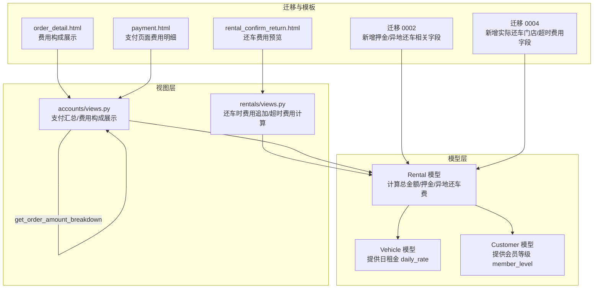
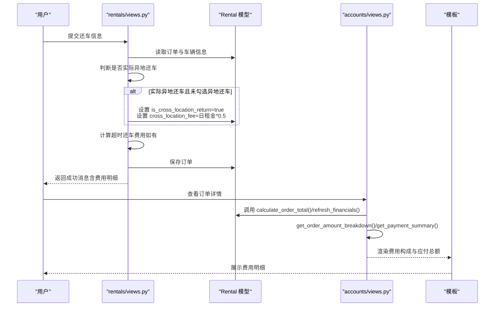
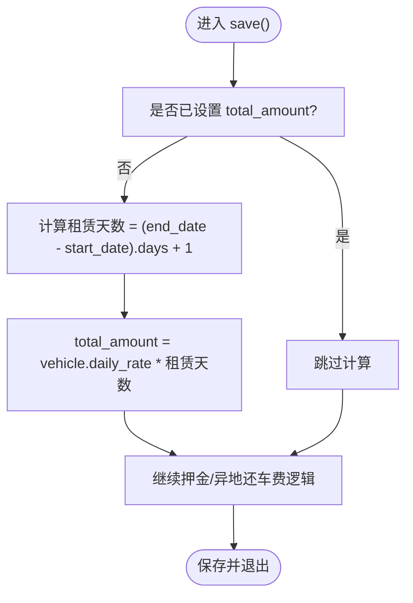
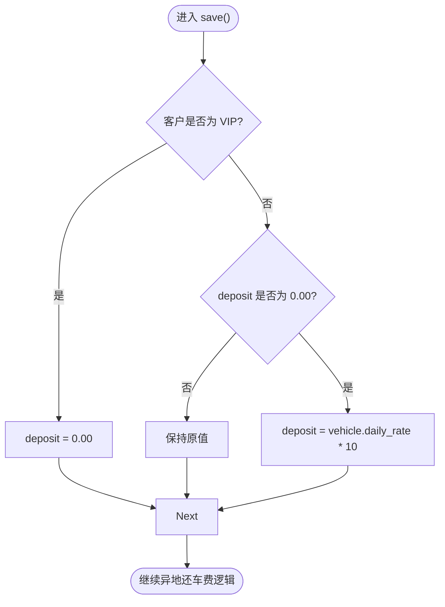
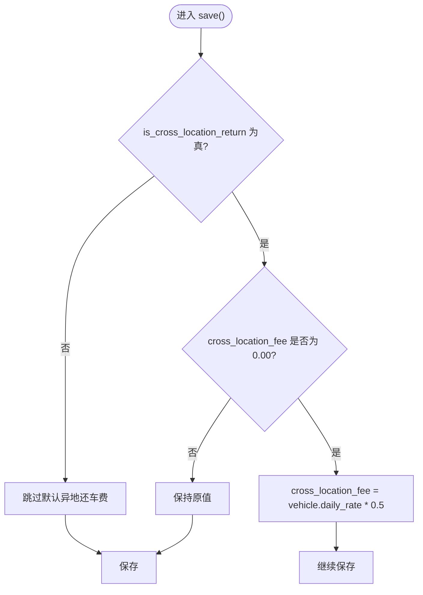
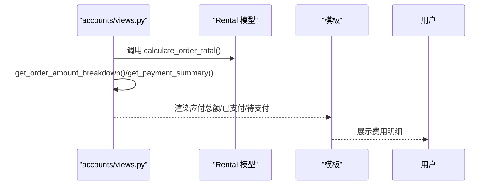
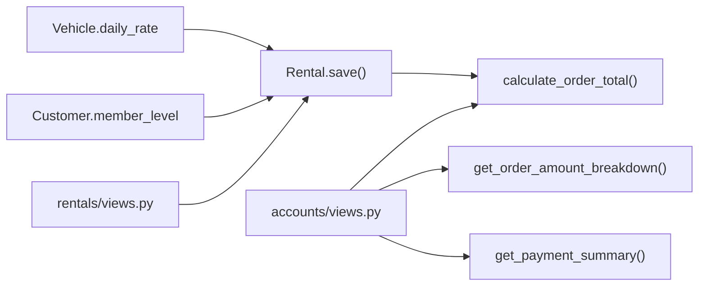

# 费用计算逻辑

<cite>
**本文引用的文件**
- [models.py](file://code/car_rental_system/rentals/models.py)
- [views.py](file://code/car_rental_system/rentals/views.py)
- [views.py](file://code/car_rental_system/accounts/views.py)
- [models.py](file://code/car_rental_system/vehicles/models.py)
- [models.py](file://code/car_rental_system/customers/models.py)
- [0002_add_deposit_and_location_fields.py](file://code/car_rental_system/rentals/migrations/0002_add_deposit_and_location_fields.py)
- [0004_add_return_location_fields.py](file://code/car_rental_system/rentals/migrations/0004_add_return_location_fields.py)
- [order_detail.html](file://code/car_rental_system/templates/accounts/order_detail.html)
- [payment.html](file://code/car_rental_system/templates/accounts/payment.html)
- [rental_confirm_return.html](file://code/car_rental_system/templates/rentals/rental_confirm_return.html)
</cite>

## 目录
1. [简介](#简介)
2. [项目结构](#项目结构)
3. [核心组件](#核心组件)
4. [架构概览](#架构概览)
5. [详细组件分析](#详细组件分析)
6. [依赖关系分析](#依赖关系分析)
7. [性能考量](#性能考量)
8. [故障排查指南](#故障排查指南)
9. [结论](#结论)
10. [附录](#附录)

## 简介
本文件围绕Rental模型的费用计算机制展开，重点说明以下三点：
- total_amount（总金额）的自动计算方式：基于车辆日租金（daily_rate）与租赁天数（end_date - start_date + 1）的乘积。
- deposit（押金）的差异化策略：VIP客户押金为0，普通客户押金为日租金的10倍。
- cross_location_fee（异地还车费）默认为日租金50%的业务规则，并结合save()方法中的逻辑实现。

同时，文档提供calculate_order_total()方法的使用场景说明，以及其在财务统计中的应用路径。

## 项目结构
围绕费用计算的关键模块与文件如下：
- 租赁模型与逻辑：Rental模型位于 rentals/models.py，负责总金额、押金、异地还车费的计算与持久化。
- 车辆与客户模型：vehicles/models.py提供日租金字段；customers/models.py提供会员等级字段，用于决定押金策略。
- 视图层：rentals/views.py与accounts/views.py分别处理还车时的费用追加、超时费用计算与支付汇总展示。
- 迁移文件：0002_add_deposit_and_location_fields.py与0004_add_return_location_fields.py定义了相关字段。
- 前端模板：order_detail.html、payment.html、rental_confirm_return.html展示了费用构成的呈现与交互。

图表来源
- [models.py](file://code/car_rental_system/rentals/models.py#L246-L303)
- [models.py](file://code/car_rental_system/vehicles/models.py#L45-L51)
- [models.py](file://code/car_rental_system/customers/models.py#L73-L79)
- [views.py](file://code/car_rental_system/rentals/views.py#L306-L378)
- [views.py](file://code/car_rental_system/accounts/views.py#L224-L267)
- [0002_add_deposit_and_location_fields.py](file://code/car_rental_system/rentals/migrations/0002_add_deposit_and_location_fields.py#L15-L74)
- [0004_add_return_location_fields.py](file://code/car_rental_system/rentals/migrations/0004_add_return_location_fields.py#L15-L41)
- [order_detail.html](file://code/car_rental_system/templates/accounts/order_detail.html#L332-L362)
- [payment.html](file://code/car_rental_system/templates/accounts/payment.html#L58-L79)
- [rental_confirm_return.html](file://code/car_rental_system/templates/rentals/rental_confirm_return.html#L286-L312)

章节来源
- [models.py](file://code/car_rental_system/rentals/models.py#L246-L303)
- [models.py](file://code/car_rental_system/vehicles/models.py#L45-L51)
- [models.py](file://code/car_rental_system/customers/models.py#L73-L79)
- [views.py](file://code/car_rental_system/rentals/views.py#L306-L378)
- [views.py](file://code/car_rental_system/accounts/views.py#L224-L267)
- [0002_add_deposit_and_location_fields.py](file://code/car_rental_system/rentals/migrations/0002_add_deposit_and_location_fields.py#L15-L74)
- [0004_add_return_location_fields.py](file://code/car_rental_system/rentals/migrations/0004_add_return_location_fields.py#L15-L41)
- [order_detail.html](file://code/car_rental_system/templates/accounts/order_detail.html#L332-L362)
- [payment.html](file://code/car_rental_system/templates/accounts/payment.html#L58-L79)
- [rental_confirm_return.html](file://code/car_rental_system/templates/rentals/rental_confirm_return.html#L286-L312)

## 核心组件
- Rental模型
  - total_amount：在save()中基于日租金与租赁天数自动计算。
  - deposit：VIP客户为0，普通客户默认为日租金的10倍。
  - cross_location_fee：若异地还车且费用为0，默认设置为日租金的50%。
  - calculate_order_total()：返回基础租金+押金+异地费用+超时费用（异地费用仅在is_cross_location_return为真时计入）。
- Vehicle模型
  - daily_rate：日租金，作为费用计算的基础单价。
- Customer模型
  - member_level：会员等级，决定押金策略。
- 视图层
  - rentals/views.py：还车时若实际异地还车但未勾选异地还车，会追加异地还车费用与标记；同时计算超时还车费用。
  - accounts/views.py：提供get_order_amount_breakdown()与get_payment_summary()，用于支付页面的费用构成与余额计算。

章节来源
- [models.py](file://code/car_rental_system/rentals/models.py#L246-L303)
- [models.py](file://code/car_rental_system/vehicles/models.py#L45-L51)
- [models.py](file://code/car_rental_system/customers/models.py#L73-L79)
- [views.py](file://code/car_rental_system/rentals/views.py#L306-L378)
- [views.py](file://code/car_rental_system/accounts/views.py#L224-L267)

## 架构概览
费用计算贯穿“模型层-视图层-模板层”的协作：
- 模型层：Rental.save()负责自动填充基础费用、押金与异地还车费；calculate_order_total()统一汇总。
- 视图层：还车流程中根据实际还车地点与结束日期动态追加异地还车费与超时费用；支付汇总视图通过get_order_amount_breakdown()与get_payment_summary()展示应付总额与待支付金额。
- 模板层：前端页面展示费用明细与最终应付总额，便于用户核对。

图表来源
- [views.py](file://code/car_rental_system/rentals/views.py#L306-L378)
- [models.py](file://code/car_rental_system/rentals/models.py#L246-L303)
- [views.py](file://code/car_rental_system/accounts/views.py#L224-L267)
- [order_detail.html](file://code/car_rental_system/templates/accounts/order_detail.html#L332-L362)

## 详细组件分析

### 总金额 total_amount 的自动计算
- 计算公式：基于车辆日租金（daily_rate）与租赁天数（end_date - start_date + 1）相乘。
- 触发时机：在Rental.save()中，当total_amount尚未设置且具备起止日期与车辆对象时，自动计算并写入数据库。
- 复杂度：O(1)，涉及一次日期差计算与一次乘法运算。

图表来源
- [models.py](file://code/car_rental_system/rentals/models.py#L246-L271)

章节来源
- [models.py](file://code/car_rental_system/rentals/models.py#L246-L271)
- [models.py](file://code/car_rental_system/vehicles/models.py#L45-L51)

### 押金 deposit 的差异化策略
- VIP客户：押金为0。
- 普通客户：若押金为0且存在车辆对象，则默认设置为日租金的10倍。
- 触发时机：在Rental.save()中，优先判断会员等级，再按默认规则补全。

图表来源
- [models.py](file://code/car_rental_system/rentals/models.py#L253-L260)
- [models.py](file://code/car_rental_system/customers/models.py#L73-L79)
- [models.py](file://code/car_rental_system/vehicles/models.py#L45-L51)

章节来源
- [models.py](file://code/car_rental_system/rentals/models.py#L253-L260)
- [models.py](file://code/car_rental_system/customers/models.py#L73-L79)
- [models.py](file://code/car_rental_system/vehicles/models.py#L45-L51)

### 异地还车费 cross_location_fee 的默认规则
- 默认规则：若is_cross_location_return为真且cross_location_fee为0，则设置为日租金的50%。
- 逻辑位置：Rental.save()中。
- 还车时追加：若实际还车地点与取车地点不同，且订单未勾选异地还车，系统会在还车流程中自动设置is_cross_location_return与cross_location_fee，并将还车地点同步为实际还车门店。

图表来源
- [models.py](file://code/car_rental_system/rentals/models.py#L265-L271)
- [views.py](file://code/car_rental_system/rentals/views.py#L306-L322)

章节来源
- [models.py](file://code/car_rental_system/rentals/models.py#L265-L271)
- [views.py](file://code/car_rental_system/rentals/views.py#L306-L322)

### calculate_order_total() 方法与财务统计应用
- 方法职责：返回基础租金（total_amount）+ 押金（deposit）+ 异地费用（cross_location_fee，仅当is_cross_location_return为真时计入）+ 超时费用（overdue_fee）。
- 应用场景：
  - 支付页面：accounts/views.py通过get_order_amount_breakdown()与get_payment_summary()组合calculate_order_total()的结果，向用户展示应付总额、已支付、已退款、待支付等信息。
  - 订单详情页：模板order_detail.html展示费用构成与应付总额，便于用户核对。
  - 财务统计：customers/views.py在客户详情页聚合total_amount并计算VIP节省金额（假设VIP享受9折优惠），体现calculate_order_total()在财务统计中的间接作用。

图表来源
- [models.py](file://code/car_rental_system/rentals/models.py#L286-L295)
- [views.py](file://code/car_rental_system/accounts/views.py#L224-L267)
- [order_detail.html](file://code/car_rental_system/templates/accounts/order_detail.html#L332-L362)

章节来源
- [models.py](file://code/car_rental_system/rentals/models.py#L286-L295)
- [views.py](file://code/car_rental_system/accounts/views.py#L224-L267)
- [order_detail.html](file://code/car_rental_system/templates/accounts/order_detail.html#L332-L362)

## 依赖关系分析
- Rental.save()依赖Vehicle.daily_rate与Customer.member_level。
- 还车流程依赖Rental.is_cross_location_return与Rental.actual_return_location，动态追加费用。
- 支付汇总依赖Rental.calculate_order_total()与Payment模型的聚合结果。

图表来源
- [models.py](file://code/car_rental_system/rentals/models.py#L246-L303)
- [models.py](file://code/car_rental_system/vehicles/models.py#L45-L51)
- [models.py](file://code/car_rental_system/customers/models.py#L73-L79)
- [views.py](file://code/car_rental_system/rentals/views.py#L306-L378)
- [views.py](file://code/car_rental_system/accounts/views.py#L224-L267)

章节来源
- [models.py](file://code/car_rental_system/rentals/models.py#L246-L303)
- [models.py](file://code/car_rental_system/vehicles/models.py#L45-L51)
- [models.py](file://code/car_rental_system/customers/models.py#L73-L79)
- [views.py](file://code/car_rental_system/rentals/views.py#L306-L378)
- [views.py](file://code/car_rental_system/accounts/views.py#L224-L267)

## 性能考量
- 计算复杂度：费用计算均为O(1)，涉及少量数值运算与一次数据库查询（refresh_financials）。
- 数据库索引：Rental模型对常用查询字段建立了索引，有助于提升状态更新与统计查询效率。
- 缓存：自动状态更新采用缓存控制频率，避免频繁更新带来的性能压力。

章节来源
- [models.py](file://code/car_rental_system/rentals/models.py#L158-L169)
- [models.py](file://code/car_rental_system/rentals/models.py#L171-L229)

## 故障排查指南
- 日期异常
  - 现象：保存订单时报错，提示结束日期早于开始日期或实际还车日期不合理。
  - 排查：检查Rental.clean()中的日期校验逻辑，确保start_date ≤ end_date，actual_return_date应在合法区间。
- 押金未按预期设置
  - 现象：VIP客户仍有押金或普通客户押金未按10倍日租金设置。
  - 排查：确认Customer.member_level是否为VIP；检查Rental.save()中押金逻辑顺序与条件分支。
- 异地还车费未生效
  - 现象：实际异地还车后未产生异地还车费。
  - 排查：确认rentals/views.py中是否正确识别实际还车地点与取车地点差异，并设置is_cross_location_return与cross_location_fee。
- 费用合计不一致
  - 现象：模板展示的应付总额与calculate_order_total()结果不符。
  - 排查：检查模板是否正确使用order_total_amount变量；确认get_order_amount_breakdown()与get_payment_summary()的计算逻辑。

章节来源
- [models.py](file://code/car_rental_system/rentals/models.py#L230-L245)
- [models.py](file://code/car_rental_system/rentals/models.py#L253-L271)
- [views.py](file://code/car_rental_system/rentals/views.py#L306-L322)
- [views.py](file://code/car_rental_system/accounts/views.py#L224-L267)

## 结论
Rental模型通过save()实现了费用计算的自动化与一致性：
- total_amount由日租金与租赁天数直接决定，逻辑清晰、易于审计。
- deposit依据会员等级差异化处理，VIP客户零押金，普通客户按日租金10倍收取，兼顾风险控制与用户体验。
- cross_location_fee默认按日租金50%设定，并在还车流程中根据实际还车地点动态追加，确保异地还车成本得到合理覆盖。
- calculate_order_total()提供统一的费用汇总入口，配合accounts/views.py的支付汇总逻辑，支撑前端费用明细展示与财务统计。

## 附录
- 字段定义与默认值
  - 押金字段：新增于迁移0002，初始默认0.00。
  - 异地还车相关字段：新增于迁移0002，初始默认0.00。
  - 实际还车门店与超时费用：新增于迁移0004。
- 前端费用展示
  - order_detail.html与payment.html展示费用构成与应付总额，rental_confirm_return.html在还车确认阶段预览费用明细。

章节来源
- [0002_add_deposit_and_location_fields.py](file://code/car_rental_system/rentals/migrations/0002_add_deposit_and_location_fields.py#L15-L74)
- [0004_add_return_location_fields.py](file://code/car_rental_system/rentals/migrations/0004_add_return_location_fields.py#L15-L41)
- [order_detail.html](file://code/car_rental_system/templates/accounts/order_detail.html#L332-L362)
- [payment.html](file://code/car_rental_system/templates/accounts/payment.html#L58-L79)
- [rental_confirm_return.html](file://code/car_rental_system/templates/rentals/rental_confirm_return.html#L286-L312)