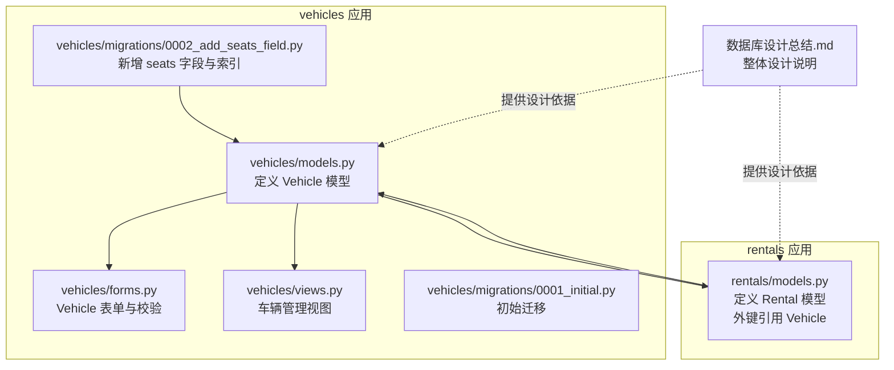
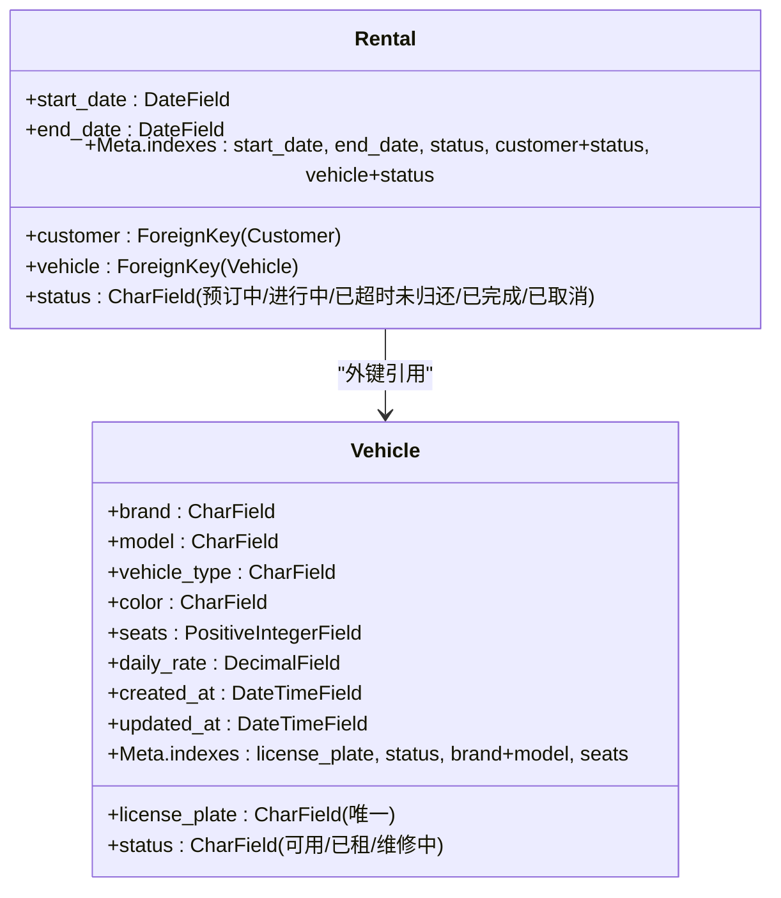
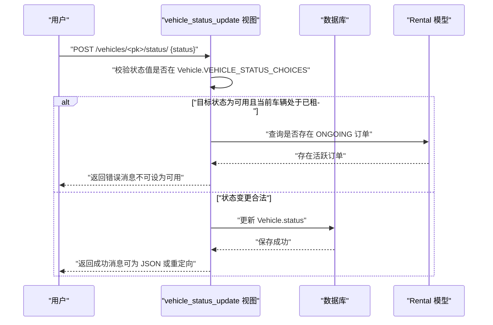
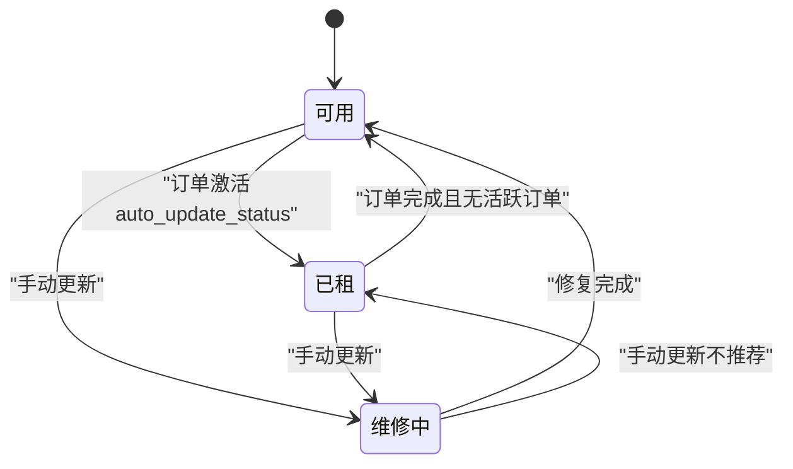
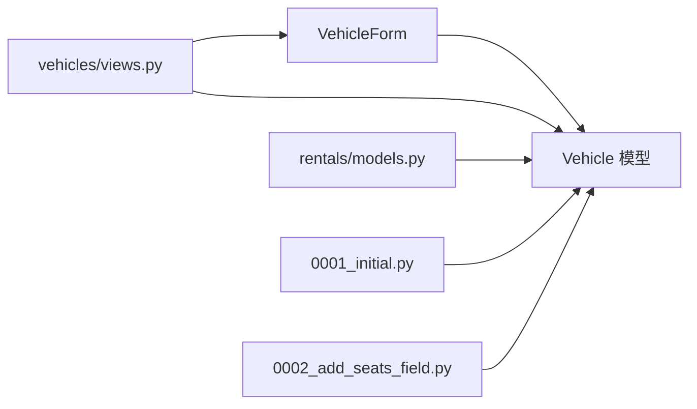

# 车辆模型设计

<cite>
**本文引用的文件**
- [vehicles/models.py](file://code/car_rental_system/vehicles/models.py)
- [vehicles/migrations/0001_initial.py](file://code/car_rental_system/vehicles/migrations/0001_initial.py)
- [vehicles/migrations/0002_add_seats_field.py](file://code/car_rental_system/vehicles/migrations/0002_add_seats_field.py)
- [vehicles/views.py](file://code/car_rental_system/vehicles/views.py)
- [vehicles/forms.py](file://code/car_rental_system/vehicles/forms.py)
- [rentals/models.py](file://code/car_rental_system/rentals/models.py)
- [数据库设计总结.md](file://code/car_rental_system/数据库设计总结.md)
- [test_vehicle_management.py](file://code/car_rental_system/test_vehicle_management.py)
- [create_vehicle_test_data.py](file://code/car_rental_system/create_vehicle_test_data.py)
</cite>

## 目录
1. [简介](#简介)
2. [项目结构](#项目结构)
3. [核心组件](#核心组件)
4. [架构总览](#架构总览)
5. [详细组件分析](#详细组件分析)
6. [依赖分析](#依赖分析)
7. [性能考量](#性能考量)
8. [故障排查指南](#故障排查指南)
9. [结论](#结论)
10. [附录](#附录)

## 简介
本文件围绕车辆数据模型 Vehicle 的字段定义、约束、索引设计以及与租赁模块的外键关联进行系统化说明。结合数据库设计总结文档，阐述车辆状态管理（可用、已租、维修中）的实现机制，并提供通过 Django ORM 进行增删改查的实际示例路径，帮助开发者快速理解与使用。

## 项目结构
车辆模型位于 vehicles 应用下，配合迁移文件、表单、视图与测试脚本共同构成完整的 CRUD 与状态管理能力；租赁模块通过外键引用 Vehicle，形成稳定的业务关联。

图表来源
- [vehicles/models.py](file://code/car_rental_system/vehicles/models.py#L1-L85)
- [vehicles/forms.py](file://code/car_rental_system/vehicles/forms.py#L1-L153)
- [vehicles/views.py](file://code/car_rental_system/vehicles/views.py#L1-L322)
- [vehicles/migrations/0001_initial.py](file://code/car_rental_system/vehicles/migrations/0001_initial.py#L1-L39)
- [vehicles/migrations/0002_add_seats_field.py](file://code/car_rental_system/vehicles/migrations/0002_add_seats_field.py#L1-L32)
- [rentals/models.py](file://code/car_rental_system/rentals/models.py#L1-L170)
- [数据库设计总结.md](file://code/car_rental_system/数据库设计总结.md#L1-L187)

章节来源
- [vehicles/models.py](file://code/car_rental_system/vehicles/models.py#L1-L85)
- [vehicles/migrations/0001_initial.py](file://code/car_rental_system/vehicles/migrations/0001_initial.py#L1-L39)
- [vehicles/migrations/0002_add_seats_field.py](file://code/car_rental_system/vehicles/migrations/0002_add_seats_field.py#L1-L32)
- [rentals/models.py](file://code/car_rental_system/rentals/models.py#L1-L170)
- [数据库设计总结.md](file://code/car_rental_system/数据库设计总结.md#L1-L187)

## 核心组件
- Vehicle 模型：定义车辆实体的所有字段、状态枚举、索引与排序策略。
- VehicleForm：封装表单字段、前端标签与校验逻辑（含唯一性、数值范围等）。
- 视图层：提供车辆列表、详情、创建、更新、删除与状态更新的完整流程。
- 迁移文件：0001_initial.py 定义初始表结构；0002_add_seats_field.py 新增 seats 字段并建立索引。
- 关联模型：Rental 通过外键引用 Vehicle，形成 1 对多关系。

章节来源
- [vehicles/models.py](file://code/car_rental_system/vehicles/models.py#L1-L85)
- [vehicles/forms.py](file://code/car_rental_system/vehicles/forms.py#L1-L153)
- [vehicles/views.py](file://code/car_rental_system/vehicles/views.py#L1-L322)
- [vehicles/migrations/0001_initial.py](file://code/car_rental_system/vehicles/migrations/0001_initial.py#L1-L39)
- [vehicles/migrations/0002_add_seats_field.py](file://code/car_rental_system/vehicles/migrations/0002_add_seats_field.py#L1-L32)
- [rentals/models.py](file://code/car_rental_system/rentals/models.py#L1-L170)

## 架构总览
Vehicle 与 Rental 的关系如下：一个 Vehicle 可对应多个 Rental 订单；Rental 通过外键 vehicle 关联 Vehicle。状态管理贯穿两个模块：Vehicle 的 status 字段用于控制可租性，Rental 的 auto_update_status 会在合适时机联动更新 Vehicle 的状态。

图表来源
- [vehicles/models.py](file://code/car_rental_system/vehicles/models.py#L1-L85)
- [rentals/models.py](file://code/car_rental_system/rentals/models.py#L1-L170)

章节来源
- [vehicles/models.py](file://code/car_rental_system/vehicles/models.py#L1-L85)
- [rentals/models.py](file://code/car_rental_system/rentals/models.py#L1-L170)

## 详细组件分析

### Vehicle 模型字段定义与约束
- 字段与类型
  - license_plate：CharField，长度 20，唯一，非空，作为车辆唯一标识。
  - brand/model/vehicle_type/color：CharField，长度分别为 50/50/20/20，非空。
  - seats：PositiveIntegerField，默认 5，最小值 2，非空。
  - daily_rate：DecimalField，10 位数字、2 位小数，最小值 0.01，非空。
  - status：CharField，枚举值 AVAILABLE/RENTED/MAINTENANCE，非空，默认 AVAILABLE。
  - created_at/updated_at：DateTimeField，自动记录创建与更新时间。
- 约束与校验
  - 唯一性：license_plate 唯一。
  - 数值范围：seats ∈ [2, 50]；daily_rate > 0。
  - 状态枚举：仅允许预设值。
- 索引设计
  - 单列索引：license_plate（唯一）、status。
  - 复合索引：brand + model。
  - 新增索引：seats（由迁移 0002_add_seats_field.py 添加）。
- 排序策略：默认按创建时间倒序。

章节来源
- [vehicles/models.py](file://code/car_rental_system/vehicles/models.py#L1-L85)
- [vehicles/migrations/0001_initial.py](file://code/car_rental_system/vehicles/migrations/0001_initial.py#L1-L39)
- [vehicles/migrations/0002_add_seats_field.py](file://code/car_rental_system/vehicles/migrations/0002_add_seats_field.py#L1-L32)
- [数据库设计总结.md](file://code/car_rental_system/数据库设计总结.md#L1-L187)

### VehicleForm 表单与校验
- 字段映射：license_plate、brand、model、vehicle_type、color、seats、daily_rate、status。
- 标签与帮助文本：统一使用中文标签与提示。
- 校验逻辑：
  - license_plate 唯一性校验（排除当前实例）。
  - daily_rate 必须为正数且上限合理。
  - seats 范围校验 [2, 50]。
  - 品牌/型号/颜色去除前后空白。
- 保存行为：在提交前清理空白字符，确保数据一致性。

章节来源
- [vehicles/forms.py](file://code/car_rental_system/vehicles/forms.py#L1-L153)

### 视图层：增删改查与状态管理
- 列表页：支持按品牌、类型、状态、座位数与关键词搜索，使用 only 选择必要字段，分页与缓存优化。
- 详情页：展示车辆基本信息、相关订单统计与评价统计。
- 创建/更新：基于 VehicleForm，保存后清除相关缓存。
- 删除：若存在活跃订单则禁止删除。
- 状态更新：支持 AJAX 与常规请求，校验状态合法性，避免将正在租用的车辆置为可用。

图表来源
- [vehicles/views.py](file://code/car_rental_system/vehicles/views.py#L289-L322)
- [vehicles/models.py](file://code/car_rental_system/vehicles/models.py#L1-L85)
- [rentals/models.py](file://code/car_rental_system/rentals/models.py#L1-L170)

章节来源
- [vehicles/views.py](file://code/car_rental_system/vehicles/views.py#L1-L322)

### 迁移文件作用分析
- 0001_initial.py
  - 创建 Vehicle 表，包含 license_plate、brand、model、vehicle_type、color、daily_rate、status、created_at、updated_at。
  - 定义索引：license_plate（唯一）、status、brand+model。
  - 设置排序：按 created_at 倒序。
- 0002_add_seats_field.py
  - 新增 seats 字段（默认 5，最小值 2）。
  - 为 seats 字段添加索引，提升按座位数筛选的查询性能。

章节来源
- [vehicles/migrations/0001_initial.py](file://code/car_rental_system/vehicles/migrations/0001_initial.py#L1-L39)
- [vehicles/migrations/0002_add_seats_field.py](file://code/car_rental_system/vehicles/migrations/0002_add_seats_field.py#L1-L32)

### 与租赁模块的外键关联
- Rental.vehicle 外键引用 Vehicle，ON DELETE 级联删除。
- 业务联动：Rental.auto_update_status 在激活与到期时自动更新订单状态，并联动更新 Vehicle.status（当车辆状态为 AVAILABLE 时置为 RENTED）。
- 索引优化：Rental 的索引覆盖 start_date、end_date、status、customer+status、vehicle+status，有利于订单查询与状态统计。

章节来源
- [rentals/models.py](file://code/car_rental_system/rentals/models.py#L1-L170)
- [数据库设计总结.md](file://code/car_rental_system/数据库设计总结.md#L65-L100)

### 车辆状态管理机制
- Vehicle.status：可用（AVAILABLE）、已租（RENTED）、维修中（MAINTENANCE）。
- 状态更新策略：
  - 通过视图 vehicle_status_update 进行手动更新，严格校验状态合法性与业务约束。
  - 通过 Rental.auto_update_status 自动更新：当订单从“预订中”进入“进行中”，且车辆状态为可用时，自动将车辆状态置为“已租”；当订单“进行中”超过结束日期，自动置为“已超时未归还”。

图表来源
- [vehicles/views.py](file://code/car_rental_system/vehicles/views.py#L289-L322)
- [rentals/models.py](file://code/car_rental_system/rentals/models.py#L170-L230)
- [vehicles/models.py](file://code/car_rental_system/vehicles/models.py#L1-L85)

## 依赖分析
- Vehicle 与 Rentals 的耦合点在于外键引用与状态联动。
- VehicleForm 依赖 Vehicle 模型字段与状态枚举。
- 视图层依赖 VehicleForm 与 Vehicle 模型，同时在删除与状态更新处引入 Rental 的查询以保证业务一致性。
- 迁移文件驱动数据库结构演进，确保索引与字段的逐步完善。

图表来源
- [vehicles/forms.py](file://code/car_rental_system/vehicles/forms.py#L1-L153)
- [vehicles/views.py](file://code/car_rental_system/vehicles/views.py#L1-L322)
- [vehicles/models.py](file://code/car_rental_system/vehicles/models.py#L1-L85)
- [rentals/models.py](file://code/car_rental_system/rentals/models.py#L1-L170)
- [vehicles/migrations/0001_initial.py](file://code/car_rental_system/vehicles/migrations/0001_initial.py#L1-L39)
- [vehicles/migrations/0002_add_seats_field.py](file://code/car_rental_system/vehicles/migrations/0002_add_seats_field.py#L1-L32)

章节来源
- [vehicles/forms.py](file://code/car_rental_system/vehicles/forms.py#L1-L153)
- [vehicles/views.py](file://code/car_rental_system/vehicles/views.py#L1-L322)
- [vehicles/models.py](file://code/car_rental_system/vehicles/models.py#L1-L85)
- [rentals/models.py](file://code/car_rental_system/rentals/models.py#L1-L170)
- [vehicles/migrations/0001_initial.py](file://code/car_rental_system/vehicles/migrations/0001_initial.py#L1-L39)
- [vehicles/migrations/0002_add_seats_field.py](file://code/car_rental_system/vehicles/migrations/0002_add_seats_field.py#L1-L32)

## 性能考量
- 索引设计
  - 车辆维度：license_plate（唯一索引）、status、brand+model、seats（迁移新增）。
  - 订单维度：start_date、end_date、status、customer+status、vehicle+status。
- 查询优化
  - 列表页使用 only 仅取必要字段，减少查询开销。
  - 使用缓存存储品牌、类型、座位数等筛选选项，降低重复查询成本。
  - 分页与排序分离，避免 N+1 查询。
- 写入优化
  - 状态更新采用 select_related 与 update_fields，减少不必要的字段写入。
  - 自动状态更新使用缓存节流（每 5 分钟最多一次），避免频繁写入。

章节来源
- [vehicles/models.py](file://code/car_rental_system/vehicles/models.py#L68-L85)
- [vehicles/views.py](file://code/car_rental_system/vehicles/views.py#L42-L135)
- [rentals/models.py](file://code/car_rental_system/rentals/models.py#L170-L230)
- [数据库设计总结.md](file://code/car_rental_system/数据库设计总结.md#L133-L144)

## 故障排查指南
- 唯一性冲突
  - 现象：创建/更新车辆时报错，提示车牌号重复。
  - 排查：确认 VehicleForm.clean_license_plate 是否生效；检查数据库中 license_plate 是否已存在。
- 状态更新失败
  - 现象：将“已租”车辆设为“可用”失败。
  - 排查：确认是否存在 ONGOING 订单；查看 vehicles/views.py 中的状态校验逻辑。
- 查询性能问题
  - 现象：列表页加载缓慢。
  - 排查：确认是否使用 only、分页与缓存；检查 seats 字段是否存在（迁移是否应用）。
- 自动状态更新未生效
  - 现象：订单状态未随日期变化而更新。
  - 排查：确认缓存节流是否生效；检查命令任务是否正确执行。

章节来源
- [vehicles/forms.py](file://code/car_rental_system/vehicles/forms.py#L87-L112)
- [vehicles/views.py](file://code/car_rental_system/vehicles/views.py#L289-L322)
- [vehicles/migrations/0002_add_seats_field.py](file://code/car_rental_system/vehicles/migrations/0002_add_seats_field.py#L1-L32)
- [rentals/models.py](file://code/car_rental_system/rentals/models.py#L170-L230)

## 结论
Vehicle 模型通过严谨的字段定义、约束与索引设计，为车辆管理提供了稳定的数据基础；配合 VehicleForm 与视图层的优化实践，实现了高效的增删改查与状态管理。与 Rental 的外键关联与状态联动，进一步强化了业务一致性与可维护性。迁移文件的演进确保了数据库结构的持续优化与扩展。

## 附录

### Django ORM 使用示例（路径指引）
- 创建车辆
  - 示例路径：[vehicles/views.py](file://code/car_rental_system/vehicles/views.py#L198-L222)
  - 表单入口：[vehicles/forms.py](file://code/car_rental_system/vehicles/forms.py#L1-L153)
- 查询车辆
  - 按状态查询：[test_vehicle_management.py](file://code/car_rental_system/test_vehicle_management.py#L93-L108)
  - 搜索与统计：[test_vehicle_management.py](file://code/car_rental_system/test_vehicle_management.py#L93-L116)
- 更新车辆
  - 更新日租金：[test_vehicle_management.py](file://code/car_rental_system/test_vehicle_management.py#L38-L41)
  - 状态更新（手动）：[vehicles/views.py](file://code/car_rental_system/vehicles/views.py#L289-L322)
- 删除车辆
  - 删除前检查活跃订单：[vehicles/views.py](file://code/car_rental_system/vehicles/views.py#L255-L287)
- 外键关联
  - Rental.vehicle 外键：[rentals/models.py](file://code/car_rental_system/rentals/models.py#L33-L38)
  - 自动状态联动：[rentals/models.py](file://code/car_rental_system/rentals/models.py#L195-L209)

### 设计与实现对照
- 字段与索引
  - 车辆：license_plate（唯一）、status、brand+model、seats（迁移新增）。
  - 订单：start_date、end_date、status、customer+status、vehicle+status。
- 状态枚举
  - 车辆：AVAILABLE、RENTED、MAINTENANCE。
  - 订单：PENDING、ONGOING、OVERDUE、COMPLETED、CANCELLED。
- 外键与级联
  - Rental.customer、Rental.vehicle 均为外键，删除级联。

章节来源
- [vehicles/models.py](file://code/car_rental_system/vehicles/models.py#L1-L85)
- [vehicles/migrations/0001_initial.py](file://code/car_rental_system/vehicles/migrations/0001_initial.py#L1-L39)
- [vehicles/migrations/0002_add_seats_field.py](file://code/car_rental_system/vehicles/migrations/0002_add_seats_field.py#L1-L32)
- [rentals/models.py](file://code/car_rental_system/rentals/models.py#L1-L170)
- [数据库设计总结.md](file://code/car_rental_system/数据库设计总结.md#L1-L187)