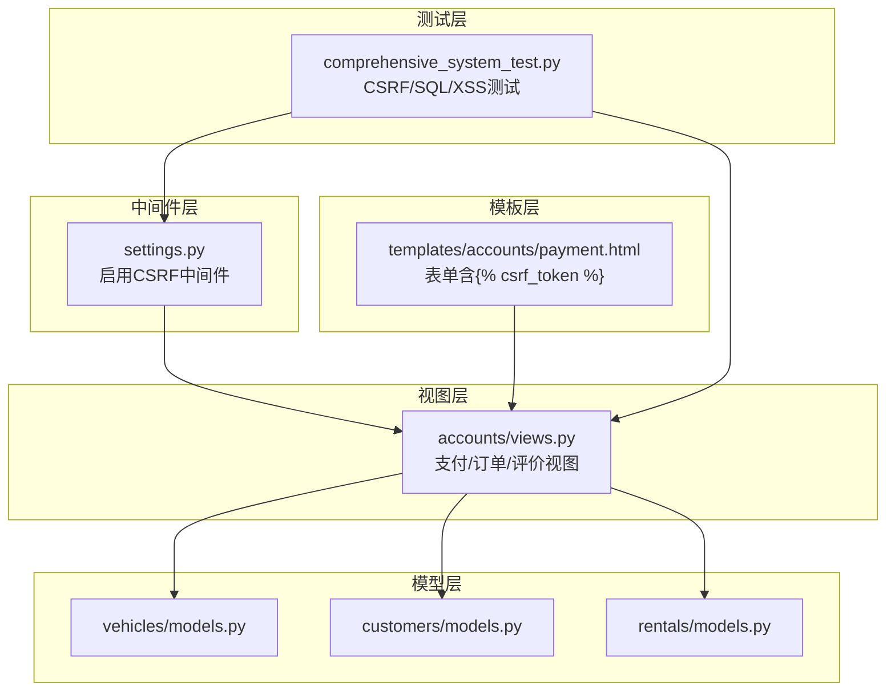
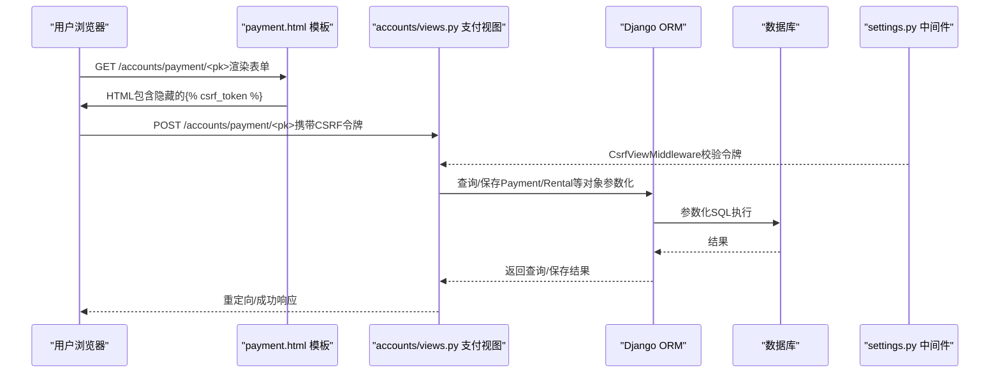
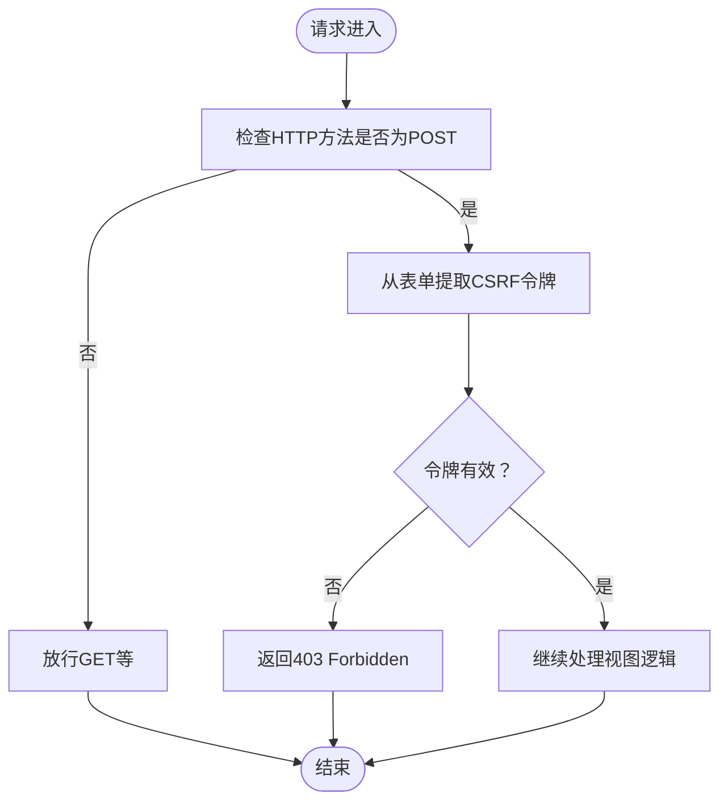
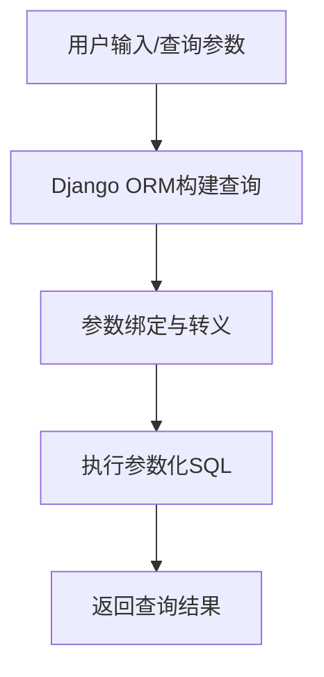
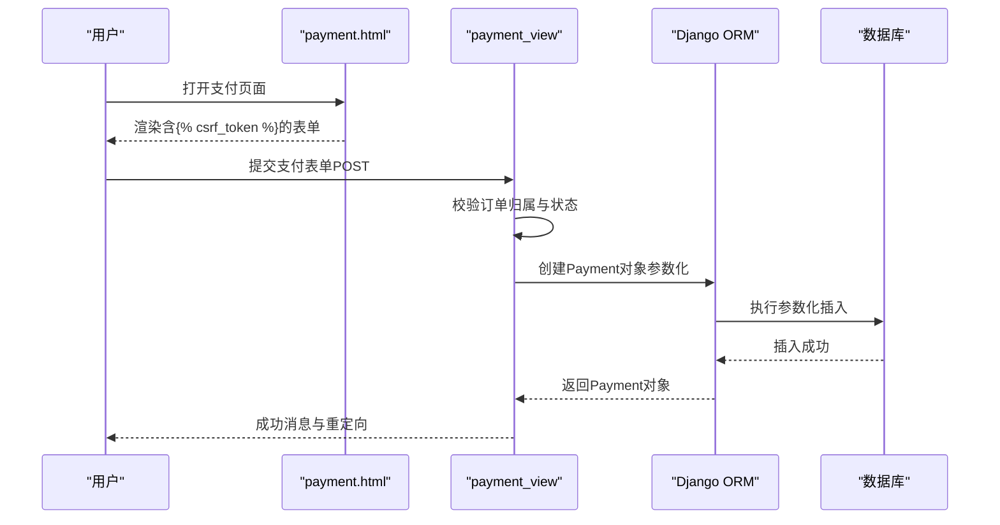
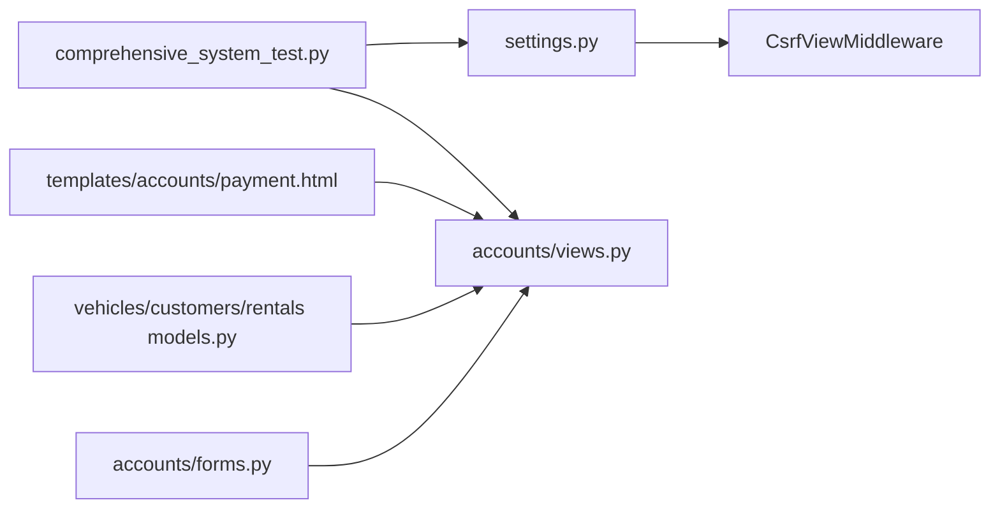

# CSRF与SQL注入防护

<cite>
**本文引用的文件**
- [comprehensive_system_test.py](file://code/car_rental_system/comprehensive_system_test.py)
- [settings.py](file://code/car_rental_system/car_rental_system/settings.py)
- [urls.py](file://code/car_rental_system/car_rental_system/urls.py)
- [accounts/urls.py](file://code/car_rental_system/accounts/urls.py)
- [accounts/views.py](file://code/car_rental_system/accounts/views.py)
- [accounts/forms.py](file://code/car_rental_system/accounts/forms.py)
- [templates/accounts/payment.html](file://code/car_rental_system/templates/accounts/payment.html)
- [vehicles/models.py](file://code/car_rental_system/vehicles/models.py)
- [customers/models.py](file://code/car_rental_system/customers/models.py)
- [rentals/models.py](file://code/car_rental_system/rentals/models.py)
- [系统测试与优化报告.md](file://code/car_rental_system/系统测试与优化报告.md)
- [最终测试与优化报告.md](file://code/car_rental_system/最终测试与优化报告.md)
</cite>

## 目录
1. [简介](#简介)
2. [项目结构](#项目结构)
3. [核心组件](#核心组件)
4. [架构总览](#架构总览)
5. [详细组件分析](#详细组件分析)
6. [依赖分析](#依赖分析)
7. [性能考量](#性能考量)
8. [故障排查指南](#故障排查指南)
9. [结论](#结论)
10. [附录](#附录)

## 简介
本文件聚焦系统中CSRF保护与SQL注入防御机制的实现原理与实际应用，结合系统测试与优化报告，解析Django中间件如何自动生成与验证CSRF令牌，并在表单提交（如支付页面）中正确集成；同时，依据综合测试脚本对csrf_protected与sql_injection_safe的测试逻辑，展示后端通过Django ORM与参数化查询避免SQL注入风险；最后分析views.py中数据库查询是否均使用ORM或安全的execute方法，杜绝原始SQL拼接，并给出安全编码规范，指导开发者在新增功能时延续这些安全实践。

## 项目结构
系统采用Django MVC结构，安全相关的关键位置包括：
- 中间件层：settings.py中启用CSRF中间件
- 视图层：accounts/views.py中支付、订单、评价等业务视图
- 模板层：templates/accounts/payment.html中表单包含
- 模型层：vehicles/customers/rentals/models.py中ORM模型定义
- 测试层：comprehensive_system_test.py中对CSRF与SQL注入的专项测试

图表来源
- [settings.py](file://code/car_rental_system/car_rental_system/settings.py#L46-L54)
- [accounts/views.py](file://code/car_rental_system/accounts/views.py#L1289-L1362)
- [templates/accounts/payment.html](file://code/car_rental_system/templates/accounts/payment.html#L103-L124)
- [vehicles/models.py](file://code/car_rental_system/vehicles/models.py#L1-L85)
- [customers/models.py](file://code/car_rental_system/customers/models.py#L1-L160)
- [rentals/models.py](file://code/car_rental_system/rentals/models.py#L1-L170)
- [comprehensive_system_test.py](file://code/car_rental_system/comprehensive_system_test.py#L517-L585)

章节来源
- [settings.py](file://code/car_rental_system/car_rental_system/settings.py#L46-L54)
- [urls.py](file://code/car_rental_system/car_rental_system/urls.py#L27-L38)
- [accounts/urls.py](file://code/car_rental_system/accounts/urls.py#L1-L50)

## 核心组件
- CSRF保护
  - Django中间件启用CsrfViewMiddleware，自动校验POST请求的CSRF令牌
  - 模板中使用生成隐藏令牌字段
  - 综合测试脚本通过向受保护端点发起无令牌POST请求，断言返回403 Forbidden，验证CSRF有效
- SQL注入防护
  - 全面使用Django ORM进行查询与写入，避免原生SQL拼接
  - 综合测试脚本对常见SQL注入载荷进行GET请求，断言不返回500错误，表明ORM与参数化查询有效
- XSS防护现状
  - 报告指出XSS防护需加强，建议在模板中使用转义过滤器与内容清理

章节来源
- [comprehensive_system_test.py](file://code/car_rental_system/comprehensive_system_test.py#L517-L585)
- [settings.py](file://code/car_rental_system/car_rental_system/settings.py#L46-L54)
- [templates/accounts/payment.html](file://code/car_rental_system/templates/accounts/payment.html#L103-L124)
- [系统测试与优化报告.md](file://code/car_rental_system/系统测试与优化报告.md#L101-L107)

## 架构总览
CSRF与SQL注入防护在系统中的协作流程如下：

图表来源
- [templates/accounts/payment.html](file://code/car_rental_system/templates/accounts/payment.html#L103-L124)
- [accounts/views.py](file://code/car_rental_system/accounts/views.py#L1289-L1362)
- [settings.py](file://code/car_rental_system/car_rental_system/settings.py#L46-L54)
- [vehicles/models.py](file://code/car_rental_system/vehicles/models.py#L1-L85)
- [customers/models.py](file://code/car_rental_system/customers/models.py#L1-L160)
- [rentals/models.py](file://code/car_rental_system/rentals/models.py#L1-L170)

## 详细组件分析

### CSRF保护机制
- 中间件启用
  - settings.py中MIDDLEWARE包含CsrfViewMiddleware，负责拦截并校验POST请求的CSRF令牌
- 模板集成
  - payment.html中表单包含，确保每次渲染生成唯一的隐藏令牌字段
- 视图行为
  - 支付视图payment_view接收POST请求，若缺少有效令牌，将被中间件拦截并返回403
- 测试验证
  - comprehensive_system_test.py的test_security中，向受保护端点发起无令牌POST请求，断言返回403，证明CSRF保护生效

图表来源
- [settings.py](file://code/car_rental_system/car_rental_system/settings.py#L46-L54)
- [templates/accounts/payment.html](file://code/car_rental_system/templates/accounts/payment.html#L103-L124)
- [accounts/views.py](file://code/car_rental_system/accounts/views.py#L1289-L1362)
- [comprehensive_system_test.py](file://code/car_rental_system/comprehensive_system_test.py#L517-L541)

章节来源
- [settings.py](file://code/car_rental_system/car_rental_system/settings.py#L46-L54)
- [templates/accounts/payment.html](file://code/car_rental_system/templates/accounts/payment.html#L103-L124)
- [accounts/views.py](file://code/car_rental_system/accounts/views.py#L1289-L1362)
- [comprehensive_system_test.py](file://code/car_rental_system/comprehensive_system_test.py#L517-L541)

### SQL注入防御机制
- ORM为主
  - views.py中大量使用Django ORM进行查询与写入，如Vehicle.objects.filter(...)、Rental.objects.filter(...)、Payment.objects.create(...)等
  - ORM自动对参数进行转义与绑定，避免原生SQL拼接
- 模型层约束
  - vehicles/models.py、customers/models.py、rentals/models.py中字段定义与验证，减少非法输入进入数据库
- 测试验证
  - comprehensive_system_test.py的test_security对常见SQL注入载荷进行GET请求，断言不返回500错误，表明ORM与参数化查询有效

图表来源
- [accounts/views.py](file://code/car_rental_system/accounts/views.py#L800-L1023)
- [vehicles/models.py](file://code/car_rental_system/vehicles/models.py#L1-L85)
- [customers/models.py](file://code/car_rental_system/customers/models.py#L1-L160)
- [rentals/models.py](file://code/car_rental_system/rentals/models.py#L1-L170)
- [comprehensive_system_test.py](file://code/car_rental_system/comprehensive_system_test.py#L524-L541)

章节来源
- [accounts/views.py](file://code/car_rental_system/accounts/views.py#L800-L1023)
- [vehicles/models.py](file://code/car_rental_system/vehicles/models.py#L1-L85)
- [customers/models.py](file://code/car_rental_system/customers/models.py#L1-L160)
- [rentals/models.py](file://code/car_rental_system/rentals/models.py#L1-L170)
- [comprehensive_system_test.py](file://code/car_rental_system/comprehensive_system_test.py#L524-L541)

### XSS防护现状与建议
- 现状
  - 系统测试与优化报告指出XSS防护需加强，当前模板渲染未明确使用转义过滤器
- 建议
  - 在模板中对用户可控输出使用转义过滤器
  - 对富文本输入进行白名单清理
  - 启用Content-Security-Policy等安全头

章节来源
- [系统测试与优化报告.md](file://code/car_rental_system/系统测试与优化报告.md#L145-L174)

### 支付流程中的CSRF与ORM安全
- 表单集成
  - payment.html中表单method="post"并包含，确保提交时携带令牌
- 视图逻辑
  - payment_view对POST请求进行表单验证与事务处理，使用ORM创建Payment对象，金额来自计算结果，避免硬编码SQL
- 安全要点
  - 令牌校验由中间件完成
  - ORM参数化防止SQL注入
  - 业务权限校验（仅订单所属用户可支付）

图表来源
- [templates/accounts/payment.html](file://code/car_rental_system/templates/accounts/payment.html#L103-L124)
- [accounts/views.py](file://code/car_rental_system/accounts/views.py#L1289-L1362)
- [accounts/forms.py](file://code/car_rental_system/accounts/forms.py#L300-L314)

章节来源
- [templates/accounts/payment.html](file://code/car_rental_system/templates/accounts/payment.html#L103-L124)
- [accounts/views.py](file://code/car_rental_system/accounts/views.py#L1289-L1362)
- [accounts/forms.py](file://code/car_rental_system/accounts/forms.py#L300-L314)

## 依赖分析
- 中间件依赖
  - settings.py中MIDDLEWARE启用CsrfViewMiddleware，为所有POST请求提供CSRF校验
- 视图依赖
  - accounts/views.py依赖accounts/forms.py提供的表单类，依赖vehicles/customers/rentals/models.py的模型进行查询与写入
- 模板依赖
  - templates/accounts/payment.html依赖Django模板系统渲染表单与CSRF令牌
- 测试依赖
  - comprehensive_system_test.py依赖Django Client模拟HTTP请求，验证CSRF与SQL注入防护

图表来源
- [settings.py](file://code/car_rental_system/car_rental_system/settings.py#L46-L54)
- [accounts/forms.py](file://code/car_rental_system/accounts/forms.py#L300-L314)
- [accounts/views.py](file://code/car_rental_system/accounts/views.py#L1289-L1362)
- [vehicles/models.py](file://code/car_rental_system/vehicles/models.py#L1-L85)
- [customers/models.py](file://code/car_rental_system/customers/models.py#L1-L160)
- [rentals/models.py](file://code/car_rental_system/rentals/models.py#L1-L170)
- [templates/accounts/payment.html](file://code/car_rental_system/templates/accounts/payment.html#L103-L124)
- [comprehensive_system_test.py](file://code/car_rental_system/comprehensive_system_test.py#L517-L585)

章节来源
- [settings.py](file://code/car_rental_system/car_rental_system/settings.py#L46-L54)
- [accounts/forms.py](file://code/car_rental_system/accounts/forms.py#L300-L314)
- [accounts/views.py](file://code/car_rental_system/accounts/views.py#L1289-L1362)
- [vehicles/models.py](file://code/car_rental_system/vehicles/models.py#L1-L85)
- [customers/models.py](file://code/car_rental_system/customers/models.py#L1-L160)
- [rentals/models.py](file://code/car_rental_system/rentals/models.py#L1-L170)
- [templates/accounts/payment.html](file://code/car_rental_system/templates/accounts/payment.html#L103-L124)
- [comprehensive_system_test.py](file://code/car_rental_system/comprehensive_system_test.py#L517-L585)

## 性能考量
- ORM查询优化
  - views.py广泛使用select_related/prefetch_related减少N+1查询
  - 使用聚合查询与分页降低数据库压力
- 缓存策略
  - settings.py中配置了内存缓存，用于热点数据与查询结果缓存
- 安全与性能平衡
  - CSRF中间件开销极低，收益显著
  - ORM参数化查询带来安全与可维护性提升，通常不会成为性能瓶颈

章节来源
- [accounts/views.py](file://code/car_rental_system/accounts/views.py#L800-L1023)
- [settings.py](file://code/car_rental_system/car_rental_system/settings.py#L141-L151)

## 故障排查指南
- CSRF 403错误
  - 症状：POST表单返回403 Forbidden
  - 排查：确认模板中包含，且表单method="post"
  - 参考：comprehensive_system_test.py中对CSRF保护的断言
- SQL注入相关异常
  - 症状：请求返回500错误
  - 排查：确认使用ORM而非原生SQL拼接；检查视图中是否调用了不安全的execute
  - 参考：comprehensive_system_test.py中对SQL注入载荷的测试
- XSS显示异常
  - 症状：页面出现未转义脚本或HTML
  - 排查：在模板中对用户可控输出使用转义过滤器；对富文本进行白名单清理
  - 参考：系统测试与优化报告中关于XSS防护的建议

章节来源
- [comprehensive_system_test.py](file://code/car_rental_system/comprehensive_system_test.py#L517-L585)
- [templates/accounts/payment.html](file://code/car_rental_system/templates/accounts/payment.html#L103-L124)
- [系统测试与优化报告.md](file://code/car_rental_system/系统测试与优化报告.md#L145-L174)

## 结论
- CSRF保护：系统已通过Django中间件与模板集成实现，综合测试验证了CSRF保护的有效性
- SQL注入防护：系统全面采用Django ORM与参数化查询，综合测试验证了SQL注入防护的有效性
- XSS防护：报告指出需加强，建议在模板中引入转义与内容清理
- 安全编码规范：新增功能应坚持使用ORM、表单验证、CSRF令牌、最小权限原则与输入清理

## 附录

### 安全编码规范（新增功能）
- 表单与CSRF
  - 所有POST表单必须包含，并在视图中使用@require_http_methods或装饰器限制方法
- 数据库访问
  - 一律使用Django ORM进行查询与写入，避免原生SQL拼接
  - 对用户输入进行表单验证与清洗
- 权限控制
  - 在视图中校验用户与资源归属关系，避免越权访问
- 输出安全
  - 在模板中对用户可控输出使用转义过滤器；对富文本进行白名单清理
- 错误处理
  - 统一使用Django错误页面；避免泄露敏感信息

章节来源
- [accounts/views.py](file://code/car_rental_system/accounts/views.py#L1289-L1362)
- [accounts/forms.py](file://code/car_rental_system/accounts/forms.py#L300-L314)
- [templates/accounts/payment.html](file://code/car_rental_system/templates/accounts/payment.html#L103-L124)
- [系统测试与优化报告.md](file://code/car_rental_system/系统测试与优化报告.md#L145-L174)