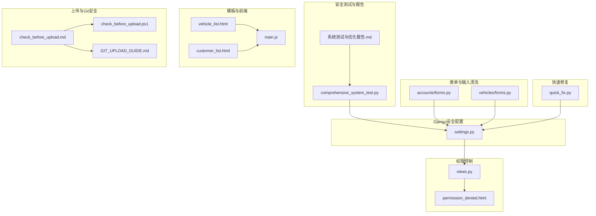
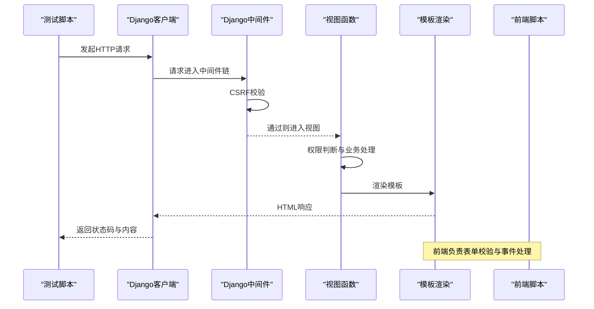
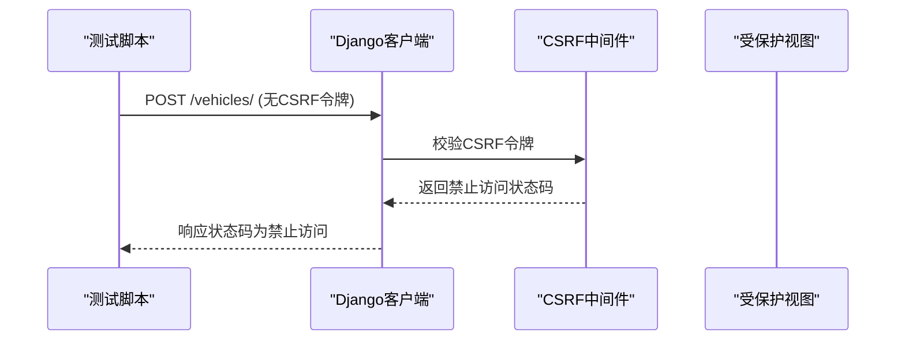
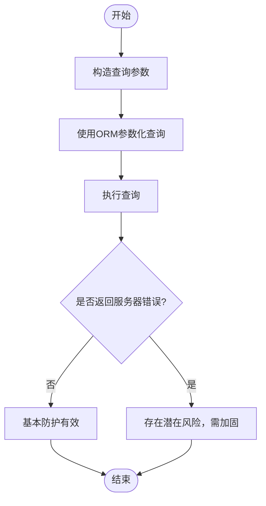
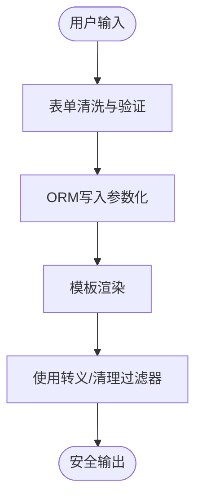
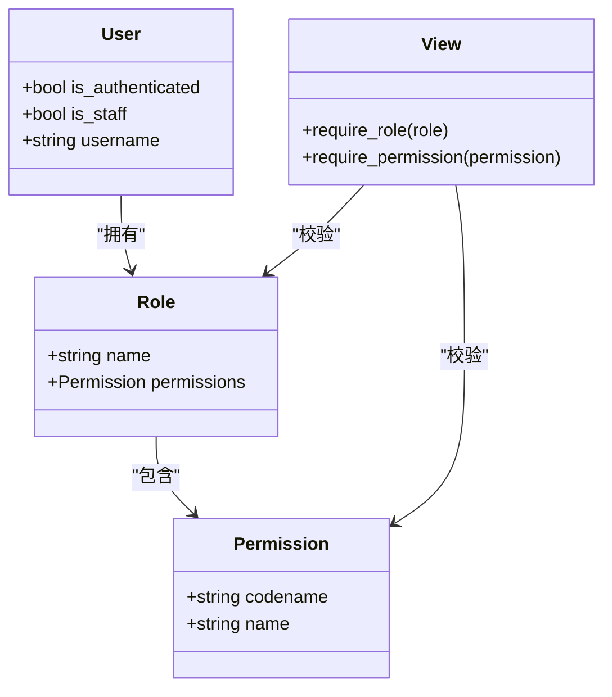
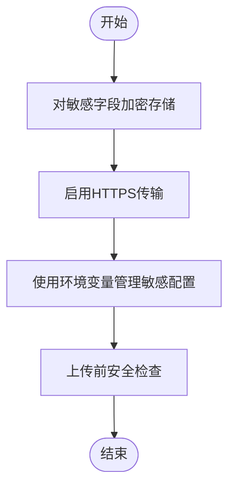
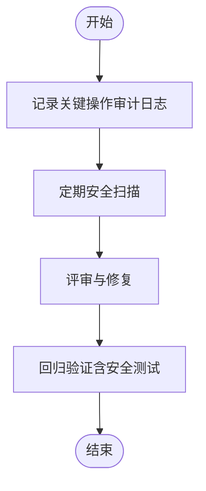
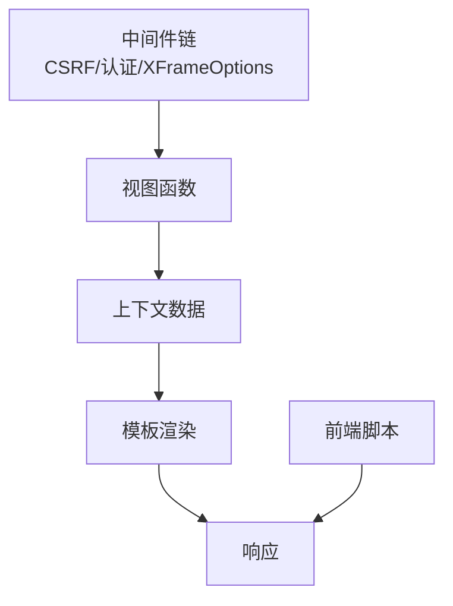

# 安全性增强

<cite>
**本文引用的文件**
- [comprehensive_system_test.py](file://code/car_rental_system/comprehensive_system_test.py)
- [系统测试与优化报告.md](file://code/car_rental_system/系统测试与优化报告.md)
- [settings.py](file://code/car_rental_system/car_rental_system/settings.py)
- [views.py](file://code/car_rental_system/views.py)
- [quick_fix.py](file://code/car_rental_system/quick_fix.py)
- [vehicle_list.html](file://code/car_rental_system/templates/vehicles/vehicle_list.html)
- [customer_list.html](file://code/car_rental_system/templates/customers/customer_list.html)
- [permission_denied.html](file://code/car_rental_system/templates/permission_denied.html)
- [main.js](file://code/car_rental_system/static/js/main.js)
- [accounts/forms.py](file://code/car_rental_system/accounts/forms.py)
- [vehicles/forms.py](file://code/car_rental_system/vehicles/forms.py)
- [check_before_upload.md](file://code/car_rental_system/check_before_upload.md)
- [check_before_upload.ps1](file://code/car_rental_system/check_before_upload.ps1)
- [GIT_UPLOAD_GUIDE.md](file://code/car_rental_system/GIT_UPLOAD_GUIDE.md)
</cite>

## 目录
1. [简介](#简介)
2. [项目结构](#项目结构)
3. [核心组件](#核心组件)
4. [架构总览](#架构总览)
5. [详细组件分析](#详细组件分析)
6. [依赖关系分析](#依赖关系分析)
7. [性能与安全权衡](#性能与安全权衡)
8. [故障排查指南](#故障排查指南)
9. [结论](#结论)
10. [附录](#附录)

## 简介
本文件系统化梳理项目在安全性方面的现状与增强方案，依据系统测试与优化报告中的安全性测试结果，重点说明已实现的CSRF保护与SQL注入防护机制，结合测试脚本中test_security()的实现逻辑，提出XSS防护强化、基于角色的访问控制（RBAC）设计、敏感数据加密策略与HTTPS传输要求，并给出安全审计日志与定期安全扫描流程建议。

## 项目结构
围绕安全性相关的代码与配置分布如下：
- 安全测试与报告：comprehensive_system_test.py、系统测试与优化报告.md
- Django安全中间件与设置：settings.py
- 视图层权限控制示例：views.py
- 模板与前端输出转义：vehicle_list.html、customer_list.html、permission_denied.html
- 前端校验与事件处理：main.js
- 表单清洗与验证：accounts/forms.py、vehicles/forms.py
- 上传前安全检查与Git配置：check_before_upload.md、check_before_upload.ps1、GIT_UPLOAD_GUIDE.md
- 快速修复脚本：quick_fix.py

**图表来源**
- [comprehensive_system_test.py](file://code/car_rental_system/comprehensive_system_test.py#L517-L585)
- [系统测试与优化报告.md](file://code/car_rental_system/系统测试与优化报告.md#L101-L107)
- [settings.py](file://code/car_rental_system/car_rental_system/settings.py#L46-L54)
- [views.py](file://code/car_rental_system/views.py#L118-L159)
- [vehicle_list.html](file://code/car_rental_system/templates/vehicles/vehicle_list.html#L1-L233)
- [customer_list.html](file://code/car_rental_system/templates/customers/customer_list.html#L1-L191)
- [permission_denied.html](file://code/car_rental_system/templates/permission_denied.html#L1-L29)
- [main.js](file://code/car_rental_system/static/js/main.js#L249-L335)
- [accounts/forms.py](file://code/car_rental_system/accounts/forms.py#L94-L136)
- [vehicles/forms.py](file://code/car_rental_system/vehicles/forms.py#L108-L153)
- [check_before_upload.md](file://code/car_rental_system/check_before_upload.md#L69-L123)
- [check_before_upload.ps1](file://code/car_rental_system/check_before_upload.ps1#L1-L45)
- [GIT_UPLOAD_GUIDE.md](file://code/car_rental_system/GIT_UPLOAD_GUIDE.md#L102-L112)
- [quick_fix.py](file://code/car_rental_system/quick_fix.py#L1-L166)

**章节来源**
- [comprehensive_system_test.py](file://code/car_rental_system/comprehensive_system_test.py#L517-L585)
- [系统测试与优化报告.md](file://code/car_rental_system/系统测试与优化报告.md#L101-L107)
- [settings.py](file://code/car_rental_system/car_rental_system/settings.py#L46-L54)

## 核心组件
- CSRF保护：Django内置中间件启用，测试脚本通过向受保护端点发起无CSRF令牌的POST请求，期望返回禁止访问的状态码以验证有效性。
- SQL注入防护：测试脚本构造常见恶意查询字符串，若系统未返回服务器错误，则视为基本防护有效；同时项目使用ORM查询与参数化查询，降低注入风险。
- XSS防护：当前报告指出XSS防护需加强；建议在模板中使用转义与清理过滤器，在表单验证中对用户输入进行清洗与规范化。
- RBAC设计：通过视图层的用户认证与权限判断，限制敏感操作；建议引入更细粒度的角色与权限模型，配合装饰器或中间件统一控制。
- 数据加密与传输：建议对敏感信息（如身份证号、手机号）采用加密存储与HTTPS传输；生产环境应关闭调试模式并启用安全传输。
- 安全审计与扫描：建议建立结构化日志与审计日志，定期进行安全扫描与代码审查。

**章节来源**
- [comprehensive_system_test.py](file://code/car_rental_system/comprehensive_system_test.py#L517-L585)
- [系统测试与优化报告.md](file://code/car_rental_system/系统测试与优化报告.md#L146-L174)
- [views.py](file://code/car_rental_system/views.py#L118-L159)
- [settings.py](file://code/car_rental_system/car_rental_system/settings.py#L22-L29)

## 架构总览
下图展示安全性相关的关键交互链路：测试脚本驱动HTTP请求，Django中间件拦截并执行CSRF校验，视图层进行权限判断，模板渲染输出，前端脚本负责表单校验与事件处理。

**图表来源**
- [comprehensive_system_test.py](file://code/car_rental_system/comprehensive_system_test.py#L517-L585)
- [settings.py](file://code/car_rental_system/car_rental_system/settings.py#L46-L54)
- [views.py](file://code/car_rental_system/views.py#L118-L159)
- [vehicle_list.html](file://code/car_rental_system/templates/vehicles/vehicle_list.html#L1-L233)
- [main.js](file://code/car_rental_system/static/js/main.js#L249-L335)

## 详细组件分析

### CSRF保护机制
- 已实现：Django中间件链包含CSRF保护中间件，测试脚本通过向受保护端点发起无CSRF令牌的POST请求，期望返回禁止访问的状态码以验证有效性。
- 测试逻辑要点：构造POST请求且不携带CSRF令牌，断言返回状态码为禁止访问，从而证明CSRF保护生效。

**图表来源**
- [comprehensive_system_test.py](file://code/car_rental_system/comprehensive_system_test.py#L517-L585)
- [settings.py](file://code/car_rental_system/car_rental_system/settings.py#L46-L54)

**章节来源**
- [comprehensive_system_test.py](file://code/car_rental_system/comprehensive_system_test.py#L517-L585)
- [settings.py](file://code/car_rental_system/car_rental_system/settings.py#L46-L54)

### SQL注入防护机制
- 已实现：项目广泛使用ORM查询与参数化查询，避免直接拼接SQL；测试脚本通过构造常见恶意查询字符串，若系统未返回服务器错误，则视为基本防护有效。
- 建议：持续使用ORM与参数化查询，避免原生SQL；对动态查询进行白名单校验与长度限制；对数据库连接进行最小权限配置。

**图表来源**
- [comprehensive_system_test.py](file://code/car_rental_system/comprehensive_system_test.py#L517-L585)

**章节来源**
- [comprehensive_system_test.py](file://code/car_rental_system/comprehensive_system_test.py#L517-L585)

### XSS防护强化方案
- 现状：测试报告指出XSS防护需加强；当前模板直接输出用户输入或查询参数，存在未转义风险。
- 强化建议：
  - 在模板中使用转义与清理过滤器，确保输出安全；
  - 在表单验证中对用户输入进行清洗与规范化，减少恶意内容进入数据库；
  - 对富文本输入场景，采用白名单过滤或内容安全策略（CSP）。

**图表来源**
- [vehicle_list.html](file://code/car_rental_system/templates/vehicles/vehicle_list.html#L1-L233)
- [customer_list.html](file://code/car_rental_system/templates/customers/customer_list.html#L1-L191)
- [accounts/forms.py](file://code/car_rental_system/accounts/forms.py#L94-L136)
- [vehicles/forms.py](file://code/car_rental_system/vehicles/forms.py#L108-L153)

**章节来源**
- [vehicle_list.html](file://code/car_rental_system/templates/vehicles/vehicle_list.html#L1-L233)
- [customer_list.html](file://code/car_rental_system/templates/customers/customer_list.html#L1-L191)
- [accounts/forms.py](file://code/car_rental_system/accounts/forms.py#L94-L136)
- [vehicles/forms.py](file://code/car_rental_system/vehicles/forms.py#L108-L153)

### 基于角色的访问控制（RBAC）设计
- 现状：视图层已具备基本权限判断（如管理员专用页面），但未形成统一的RBAC模型。
- 设计思路：
  - 用户角色：普通用户、管理员等；
  - 权限：读取、创建、更新、删除等；
  - 控制点：URL路由、视图函数、模板片段、API接口；
  - 实施建议：引入装饰器或中间件统一鉴权；为敏感操作（如删除、修改他人数据）设置更强权限；对权限变更进行审计。

**图表来源**
- [views.py](file://code/car_rental_system/views.py#L118-L159)
- [permission_denied.html](file://code/car_rental_system/templates/permission_denied.html#L1-L29)

**章节来源**
- [views.py](file://code/car_rental_system/views.py#L118-L159)
- [permission_denied.html](file://code/car_rental_system/templates/permission_denied.html#L1-L29)

### 数据加密策略与HTTPS传输
- 加密存储：对敏感信息（如身份证号、手机号）采用加密算法存储；建议使用对称加密并在应用侧实现密钥管理与轮换。
- 传输安全：生产环境必须启用HTTPS，配置安全传输头（如HSTS）；关闭调试模式，严格设置允许主机与安全密钥。
- Git与配置安全：上传前检查并排除数据库文件与敏感配置文件，避免泄露；使用环境变量存储敏感信息。

**图表来源**
- [settings.py](file://code/car_rental_system/car_rental_system/settings.py#L22-L29)
- [check_before_upload.md](file://code/car_rental_system/check_before_upload.md#L69-L123)
- [check_before_upload.ps1](file://code/car_rental_system/check_before_upload.ps1#L1-L45)
- [GIT_UPLOAD_GUIDE.md](file://code/car_rental_system/GIT_UPLOAD_GUIDE.md#L102-L112)

**章节来源**
- [settings.py](file://code/car_rental_system/car_rental_system/settings.py#L22-L29)
- [check_before_upload.md](file://code/car_rental_system/check_before_upload.md#L69-L123)
- [check_before_upload.ps1](file://code/car_rental_system/check_before_upload.ps1#L1-L45)
- [GIT_UPLOAD_GUIDE.md](file://code/car_rental_system/GIT_UPLOAD_GUIDE.md#L102-L112)

### 安全审计日志与定期安全扫描
- 审计日志：记录关键操作（登录、权限变更、敏感数据访问/修改、删除等）的时间、用户、IP、操作详情与结果；建议采用结构化日志格式并集中存储。
- 扫描流程：定期进行静态代码扫描（查找潜在漏洞）、依赖包安全扫描、数据库访问审计；对测试报告中的安全项进行回归验证。

**图表来源**
- [系统测试与优化报告.md](file://code/car_rental_system/系统测试与优化报告.md#L236-L240)
- [comprehensive_system_test.py](file://code/car_rental_system/comprehensive_system_test.py#L517-L585)

**章节来源**
- [系统测试与优化报告.md](file://code/car_rental_system/系统测试与优化报告.md#L236-L240)
- [comprehensive_system_test.py](file://code/car_rental_system/comprehensive_system_test.py#L517-L585)

## 依赖关系分析
- 中间件依赖：CSRF中间件位于中间件链中，是安全测试的基础；视图层权限控制依赖用户认证中间件。
- 模板依赖：模板渲染依赖上下文数据，若上下文包含未经转义的用户输入，可能引发XSS；建议在模板层统一转义。
- 前端依赖：前端脚本负责表单校验与事件处理，有助于减少无效请求与提升用户体验，但不能替代服务端安全控制。

**图表来源**
- [settings.py](file://code/car_rental_system/car_rental_system/settings.py#L46-L54)
- [views.py](file://code/car_rental_system/views.py#L118-L159)
- [vehicle_list.html](file://code/car_rental_system/templates/vehicles/vehicle_list.html#L1-L233)
- [main.js](file://code/car_rental_system/static/js/main.js#L249-L335)

**章节来源**
- [settings.py](file://code/car_rental_system/car_rental_system/settings.py#L46-L54)
- [views.py](file://code/car_rental_system/views.py#L118-L159)
- [vehicle_list.html](file://code/car_rental_system/templates/vehicles/vehicle_list.html#L1-L233)
- [main.js](file://code/car_rental_system/static/js/main.js#L249-L335)

## 性能与安全权衡
- 性能：安全措施（如严格的权限检查、模板转义、加密解密）可能带来额外开销；应在保证安全的前提下优化策略（如缓存、索引、ORM优化）。
- 建议：对高频操作进行缓存与索引优化；对敏感操作采用异步处理与队列；在模板中仅对必要字段进行转义。

[本节为通用指导，无需特定文件来源]

## 故障排查指南
- CSRF测试失败：检查中间件链是否包含CSRF保护中间件；确认测试脚本未携带CSRF令牌；核对视图是否正确处理CSRF。
- XSS测试失败：检查模板中是否对用户输入进行了转义；确认表单清洗逻辑是否生效；对富文本输入场景增加白名单过滤。
- 权限不足：检查视图层权限判断逻辑；确认用户认证状态与角色；核对权限拒绝页面的友好提示。
- 上传安全问题：运行上传前安全检查脚本，确保未跟踪数据库文件与敏感配置文件；使用环境变量管理敏感信息。

**章节来源**
- [comprehensive_system_test.py](file://code/car_rental_system/comprehensive_system_test.py#L517-L585)
- [views.py](file://code/car_rental_system/views.py#L118-L159)
- [check_before_upload.md](file://code/car_rental_system/check_before_upload.md#L69-L123)
- [check_before_upload.ps1](file://code/car_rental_system/check_before_upload.ps1#L1-L45)
- [GIT_UPLOAD_GUIDE.md](file://code/car_rental_system/GIT_UPLOAD_GUIDE.md#L102-L112)

## 结论
项目在CSRF保护与SQL注入防护方面已有基础实现，测试报告明确指出XSS防护需加强。建议在模板层引入转义与清理过滤器，在表单层强化输入清洗与验证；完善RBAC设计，统一权限控制；实施敏感数据加密与HTTPS传输；建立安全审计日志与定期安全扫描流程，持续提升系统整体安全性。

[本节为总结性内容，无需特定文件来源]

## 附录
- 快速修复脚本：用于解决模板路径问题，确保系统核心功能可用；修复完成后建议继续完善前端输出转义与权限控制。
- 安全测试方法：参考测试脚本中的CSRF、SQL注入与XSS测试方法，作为回归测试的一部分。

**章节来源**
- [quick_fix.py](file://code/car_rental_system/quick_fix.py#L1-L166)
- [comprehensive_system_test.py](file://code/car_rental_system/comprehensive_system_test.py#L517-L585)