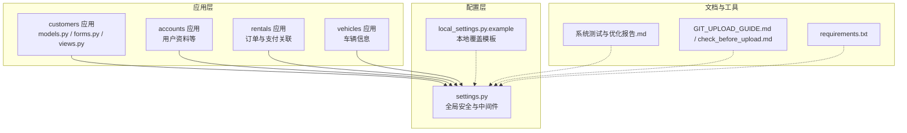
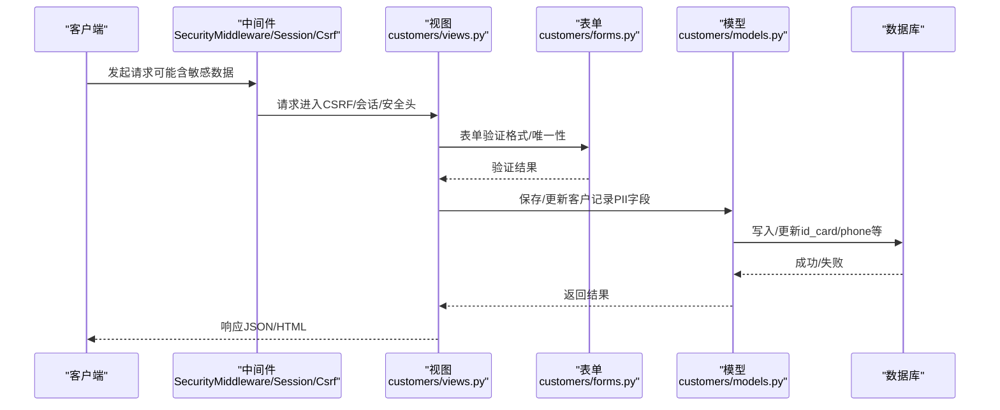
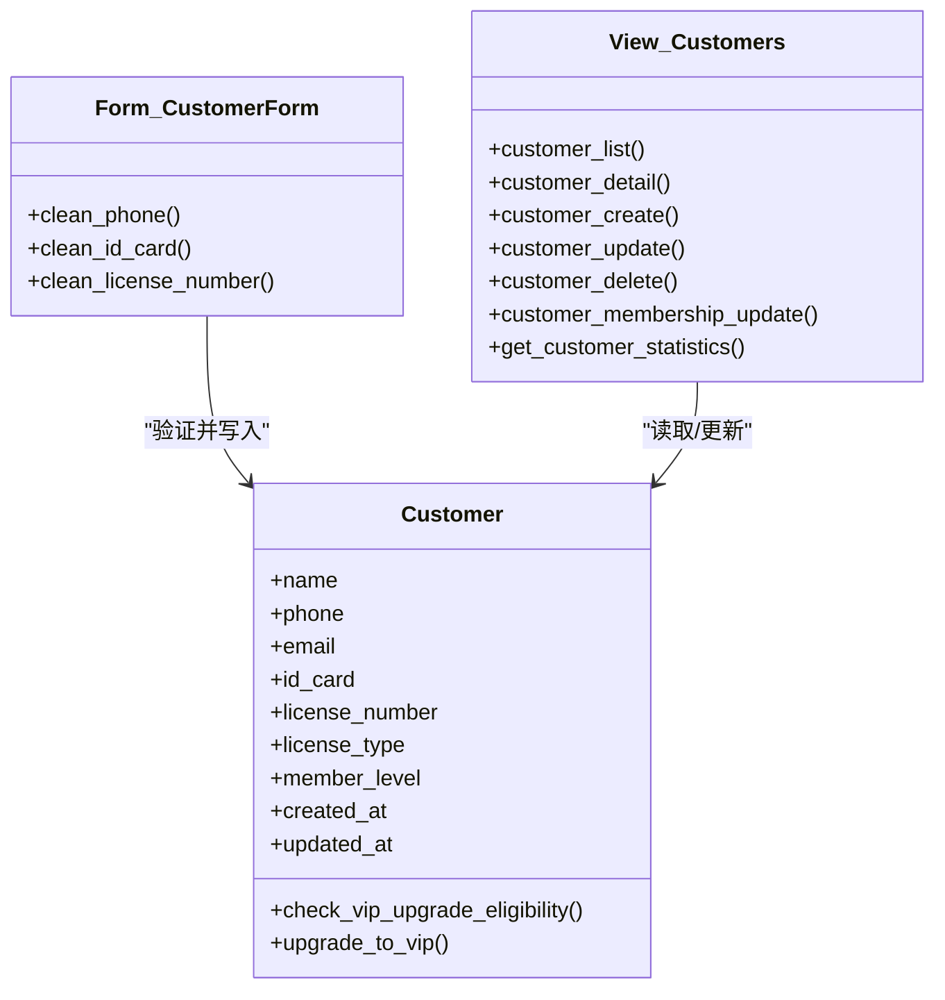
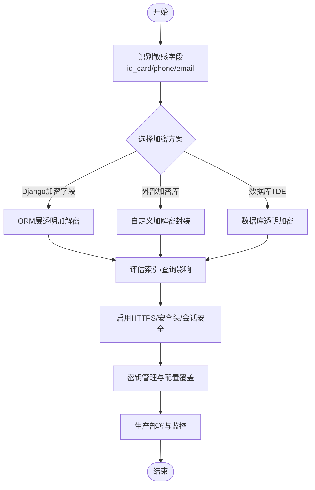
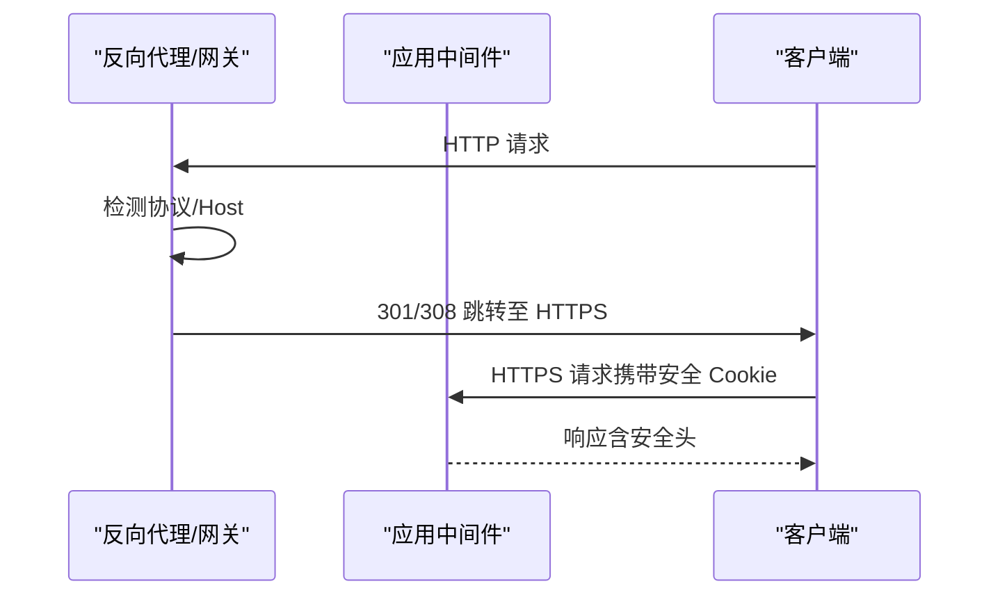
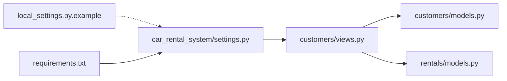

# 数据加密与传输安全

<cite>
**本文引用的文件**
- [customers/models.py](file://code/car_rental_system/customers/models.py)
- [customers/forms.py](file://code/car_rental_system/customers/forms.py)
- [customers/views.py](file://code/car_rental_system/customers/views.py)
- [car_rental_system/settings.py](file://code/car_rental_system/car_rental_system/settings.py)
- [car_rental_system/local_settings.py.example](file://code/car_rental_system/car_rental_system/local_settings.py.example)
- [系统测试与优化报告.md](file://code/car_rental_system/系统测试与优化报告.md)
- [GIT_UPLOAD_GUIDE.md](file://code/car_rental_system/GIT_UPLOAD_GUIDE.md)
- [check_before_upload.md](file://code/car_rental_system/check_before_upload.md)
- [requirements.txt](file://code/car_rental_system/requirements.txt)
</cite>

## 目录
1. [简介](#简介)
2. [项目结构](#项目结构)
3. [核心组件](#核心组件)
4. [架构总览](#架构总览)
5. [详细组件分析](#详细组件分析)
6. [依赖关系分析](#依赖关系分析)
7. [性能与安全特性](#性能与安全特性)
8. [故障排查指南](#故障排查指南)
9. [结论](#结论)
10. [附录：生产环境安全加固清单](#附录生产环境安全加固清单)

## 简介
本文件围绕系统数据安全策略展开，重点说明对客户身份证号、手机号等个人身份信息（PII）的加密存储与安全传输机制。依据系统测试与优化报告中关于数据加密的建议，结合 customers/models.py 字段设计、settings.py 安全配置现状以及部署实践，给出可行的加密存储方案（Django 加密字段或外部加密库）、HTTPS 强制启用与安全头配置、数据库连接安全、会话安全与生产环境加固清单。

## 项目结构
系统采用 Django 应用分层组织，客户相关的核心模型、表单与视图位于 customers 子应用；全局安全配置集中在 car_rental_system/settings.py，并提供 local_settings.py.example 作为本地覆盖模板。测试与优化报告提供了生产环境安全配置建议与安全测试结论。

**图表来源**
- [customers/models.py](file://code/car_rental_system/customers/models.py#L1-L160)
- [car_rental_system/settings.py](file://code/car_rental_system/car_rental_system/settings.py#L1-L179)
- [car_rental_system/local_settings.py.example](file://code/car_rental_system/car_rental_system/local_settings.py.example#L1-L29)
- [系统测试与优化报告.md](file://code/car_rental_system/系统测试与优化报告.md#L1-L361)
- [GIT_UPLOAD_GUIDE.md](file://code/car_rental_system/GIT_UPLOAD_GUIDE.md#L100-L170)
- [check_before_upload.md](file://code/car_rental_system/check_before_upload.md#L69-L123)
- [requirements.txt](file://code/car_rental_system/requirements.txt#L1-L4)

**章节来源**
- [customers/models.py](file://code/car_rental_system/customers/models.py#L1-L160)
- [car_rental_system/settings.py](file://code/car_rental_system/car_rental_system/settings.py#L1-L179)
- [car_rental_system/local_settings.py.example](file://code/car_rental_system/car_rental_system/local_settings.py.example#L1-L29)
- [系统测试与优化报告.md](file://code/car_rental_system/系统测试与优化报告.md#L1-L361)
- [GIT_UPLOAD_GUIDE.md](file://code/car_rental_system/GIT_UPLOAD_GUIDE.md#L100-L170)
- [check_before_upload.md](file://code/car_rental_system/check_before_upload.md#L69-L123)
- [requirements.txt](file://code/car_rental_system/requirements.txt#L1-L4)

## 核心组件
- 客户模型（PII 字段）：在 customers/models.py 中定义了 name、phone、email、id_card、license_number、license_type、member_level 等字段，其中 id_card 与 phone 属于敏感信息，具备格式校验与唯一性约束。
- 表单校验：customers/forms.py 对 phone、id_card、license_number 进行格式与唯一性校验，减少脏数据进入数据库。
- 视图与接口：customers/views.py 提供客户 CRUD、统计与 Ajax 会员等级更新接口，涉及敏感数据的读取与写入。
- 安全配置：car_rental_system/settings.py 提供基础安全中间件与默认配置；local_settings.py.example 提供本地覆盖模板；系统测试与优化报告提出生产环境安全加固建议。

**章节来源**
- [customers/models.py](file://code/car_rental_system/customers/models.py#L1-L160)
- [customers/forms.py](file://code/car_rental_system/customers/forms.py#L1-L158)
- [customers/views.py](file://code/car_rental_system/customers/views.py#L1-L262)
- [car_rental_system/settings.py](file://code/car_rental_system/car_rental_system/settings.py#L1-L179)
- [car_rental_system/local_settings.py.example](file://code/car_rental_system/car_rental_system/local_settings.py.example#L1-L29)
- [系统测试与优化报告.md](file://code/car_rental_system/系统测试与优化报告.md#L145-L251)

## 架构总览
下图展示与数据安全相关的关键交互：客户端请求经中间件处理，视图读取/写入模型，模型字段承载敏感信息，配置层决定传输与会话安全策略。

**图表来源**
- [customers/views.py](file://code/car_rental_system/customers/views.py#L1-L262)
- [customers/forms.py](file://code/car_rental_system/customers/forms.py#L1-L158)
- [customers/models.py](file://code/car_rental_system/customers/models.py#L1-L160)
- [car_rental_system/settings.py](file://code/car_rental_system/car_rental_system/settings.py#L46-L54)

## 详细组件分析

### 客户模型与敏感字段设计考量
- 字段类型与约束
  - id_card：18 位字符串，唯一，具备格式校验（正则），用于识别与去重。
  - phone：11 位手机号，唯一，具备格式校验（正则），用于联系与唯一性。
  - email：可空，非唯一，降低敏感度。
  - license_number：唯一，用于驾驶资质核验。
- 设计权衡
  - 唯一性约束有助于防止重复与简化检索，但对敏感字段的唯一性也意味着更高的泄露风险面。
  - 索引设计（id_card、license_number、phone、member_level）提升查询效率，但也可能暴露敏感维度。
- 加密存储建议
  - 方案一：Django 加密字段（若使用第三方库）
    - 优点：与 ORM 无缝集成，透明加解密。
    - 风险：需评估性能与兼容性，注意索引与查询限制。
  - 方案二：外部加密库（如 Fernet、AES）
    - 优点：灵活可控，可按需选择算法与密钥管理策略。
    - 风险：需自行处理序列化、索引与查询替代方案（如存储派生字段或哈希）。
  - 方案三：数据库透明加密（TDE）
    - 优点：对应用透明，统一加密。
    - 风险：需数据库支持与运维成本。

**图表来源**
- [customers/models.py](file://code/car_rental_system/customers/models.py#L1-L160)
- [customers/forms.py](file://code/car_rental_system/customers/forms.py#L1-L158)
- [customers/views.py](file://code/car_rental_system/customers/views.py#L1-L262)

**章节来源**
- [customers/models.py](file://code/car_rental_system/customers/models.py#L1-L160)
- [customers/forms.py](file://code/car_rental_system/customers/forms.py#L1-L158)

### 加密存储与安全传输机制

- 加密存储
  - 建议对 id_card、phone 等敏感字段进行加密存储。可采用对称加密（如 AES/Fernet）或数据库透明加密（TDE）。
  - 若采用对称加密，需：
    - 生成并安全保管密钥（建议使用密钥管理服务 KMS）。
    - 评估是否保留唯一性与索引需求，必要时使用派生字段或哈希索引。
    - 在 ORM 层封装加解密逻辑，避免直接暴露明文。
  - 若采用数据库透明加密（TDE），需在数据库层面开启，确保备份与传输同样受保护。
- 安全传输
  - HTTPS 强制：参考系统测试与优化报告，生产环境应启用 HTTPS 强制跳转与 HSTS。
  - 安全头：建议设置 HSTS、X-Content-Type-Options、X-Frame-Options、Referrer-Policy 等。
  - 会话安全：启用 SESSION_COOKIE_SECURE、SESSION_COOKIE_HTTPONLY、SECURE_SESSION_COOKIE 等。
- 配置要点（基于现有配置与报告）
  - SECRET_KEY 管理：使用 local_settings.py 或环境变量，避免硬编码。
  - DEBUG 控制：生产环境关闭 DEBUG。
  - ALLOWED_HOSTS：限定域名，避免 Host 头攻击。
  - 数据库连接：生产环境建议使用 PostgreSQL 并启用连接池与只读副本。
  - 静态资源与缓存：CDN、Gzip、浏览器缓存与结构化日志。

**图表来源**
- [系统测试与优化报告.md](file://code/car_rental_system/系统测试与优化报告.md#L145-L251)
- [car_rental_system/settings.py](file://code/car_rental_system/car_rental_system/settings.py#L1-L179)
- [car_rental_system/local_settings.py.example](file://code/car_rental_system/car_rental_system/local_settings.py.example#L1-L29)

**章节来源**
- [系统测试与优化报告.md](file://code/car_rental_system/系统测试与优化报告.md#L145-L251)
- [car_rental_system/settings.py](file://code/car_rental_system/car_rental_system/settings.py#L1-L179)
- [car_rental_system/local_settings.py.example](file://code/car_rental_system/car_rental_system/local_settings.py.example#L1-L29)

### HTTPS 强制启用与安全头
- 强制 HTTPS：参考报告中的生产配置片段，启用 SECURE_SSL_REDIRECT，并设置 SECURE_HSTS_SECONDS。
- 安全头：建议补充 X-Content-Type-Options、X-Frame-Options、Referrer-Policy、Permissions-Policy 等。
- 会话安全：启用 SESSION_COOKIE_SECURE、SESSION_COOKIE_HTTPONLY、SECURE_SESSION_COOKIE。
- 中间件顺序：确保 SecurityMiddleware 在 Session/Csrf 之前，以尽早拦截不安全请求。

**图表来源**
- [系统测试与优化报告.md](file://code/car_rental_system/系统测试与优化报告.md#L243-L251)
- [car_rental_system/settings.py](file://code/car_rental_system/car_rental_system/settings.py#L46-L54)

**章节来源**
- [系统测试与优化报告.md](file://code/car_rental_system/系统测试与优化报告.md#L243-L251)
- [car_rental_system/settings.py](file://code/car_rental_system/car_rental_system/settings.py#L46-L54)

### 数据库连接安全与密钥管理
- 数据库：生产环境建议使用 PostgreSQL，并启用连接池、只读副本与备份策略。
- 密钥管理：使用 local_settings.py 或环境变量，避免将真实 SECRET_KEY 提交到版本库。
- 版本控制安全：遵循上传指南与检查脚本，确保数据库文件与敏感配置不被跟踪。

**章节来源**
- [系统测试与优化报告.md](file://code/car_rental_system/系统测试与优化报告.md#L243-L266)
- [GIT_UPLOAD_GUIDE.md](file://code/car_rental_system/GIT_UPLOAD_GUIDE.md#L100-L170)
- [check_before_upload.md](file://code/car_rental_system/check_before_upload.md#L69-L123)
- [requirements.txt](file://code/car_rental_system/requirements.txt#L1-L4)

## 依赖关系分析
- 模块耦合
  - customers/views.py 依赖 customers/models.py 与 rentals/models.py（通过外键关系）。
  - settings.py 提供全局中间件与安全开关，影响所有视图。
  - local_settings.py.example 为本地覆盖模板，避免硬编码敏感信息。
- 外部依赖
  - Django 核心库与 Pillow，无显式加密库依赖。

**图表来源**
- [customers/views.py](file://code/car_rental_system/customers/views.py#L1-L262)
- [customers/models.py](file://code/car_rental_system/customers/models.py#L1-L160)
- [car_rental_system/settings.py](file://code/car_rental_system/car_rental_system/settings.py#L1-L179)
- [car_rental_system/local_settings.py.example](file://code/car_rental_system/car_rental_system/local_settings.py.example#L1-L29)
- [requirements.txt](file://code/car_rental_system/requirements.txt#L1-L4)

**章节来源**
- [customers/views.py](file://code/car_rental_system/customers/views.py#L1-L262)
- [customers/models.py](file://code/car_rental_system/customers/models.py#L1-L160)
- [car_rental_system/settings.py](file://code/car_rental_system/car_rental_system/settings.py#L1-L179)
- [car_rental_system/local_settings.py.example](file://code/car_rental_system/car_rental_system/local_settings.py.example#L1-L29)
- [requirements.txt](file://code/car_rental_system/requirements.txt#L1-L4)

## 性能与安全特性
- 查询优化：customers/views.py 使用 select_related/prefetch_related 与聚合查询，避免 N+1，提升性能。
- 安全测试：报告指出 CSRF 与 SQL 注入防护有效，XSS 防护需加强。
- 缓存与日志：settings.py 提供内存缓存与日志配置，便于性能与问题定位。

**章节来源**
- [customers/views.py](file://code/car_rental_system/customers/views.py#L34-L121)
- [系统测试与优化报告.md](file://code/car_rental_system/系统测试与优化报告.md#L101-L170)
- [car_rental_system/settings.py](file://code/car_rental_system/car_rental_system/settings.py#L141-L179)

## 故障排查指南
- 常见问题
  - XSS 防护不足：报告建议增强模板输出过滤与输入净化。
  - 模板路径错误：前端模板路径问题导致界面异常，需修正模板查找路径。
  - 数据库文件被跟踪：上传前检查并移除 db.sqlite3 等敏感文件。
- 排查步骤
  - 使用检查脚本快速定位敏感文件与 .gitignore 规则。
  - 在本地运行测试，验证 CSRF、SQL 注入与 XSS 防护效果。
  - 核对 settings.py 中的安全开关与 local_settings.py 的覆盖项。

**章节来源**
- [系统测试与优化报告.md](file://code/car_rental_system/系统测试与优化报告.md#L91-L120)
- [check_before_upload.md](file://code/car_rental_system/check_before_upload.md#L69-L123)
- [comprehensive_system_test.py](file://code/car_rental_system/comprehensive_system_test.py#L525-L561)

## 结论
系统在数据模型与表单层具备基础的 PII 校验与唯一性约束，但在加密存储与安全传输方面尚有改进空间。建议在生产环境中启用 HTTPS 强制与 HSTS，强化会话安全与安全头，同时对 id_card、phone 等敏感字段实施加密存储（Django 加密字段或外部加密库），并配合数据库透明加密与密钥管理最佳实践，形成端到端的数据安全体系。

## 附录：生产环境安全加固清单
- 传输安全
  - 启用 HTTPS 强制跳转与 HSTS（参考报告中的生产配置片段）。
  - 设置安全头：X-Content-Type-Options、X-Frame-Options、Referrer-Policy、Permissions-Policy。
  - 会话安全：SESSION_COOKIE_SECURE、SESSION_COOKIE_HTTPONLY、SECURE_SESSION_COOKIE。
- 加密存储
  - 对 id_card、phone 等敏感字段进行加密存储（对称加密或数据库透明加密）。
  - 评估索引与查询影响，必要时使用派生字段或哈希索引。
- 配置与密钥
  - 使用 local_settings.py 或环境变量管理 SECRET_KEY，避免硬编码。
  - 限定 ALLOWED_HOSTS，关闭 DEBUG。
- 数据库与备份
  - 使用 PostgreSQL，启用连接池与只读副本。
  - 制定备份与灾难恢复计划，定期测试有效性。
- 日志与监控
  - 结构化日志记录与日志轮转策略。
  - 关键操作审计与告警机制。

**章节来源**
- [系统测试与优化报告.md](file://code/car_rental_system/系统测试与优化报告.md#L243-L266)
- [car_rental_system/settings.py](file://code/car_rental_system/car_rental_system/settings.py#L1-L179)
- [car_rental_system/local_settings.py.example](file://code/car_rental_system/car_rental_system/local_settings.py.example#L1-L29)