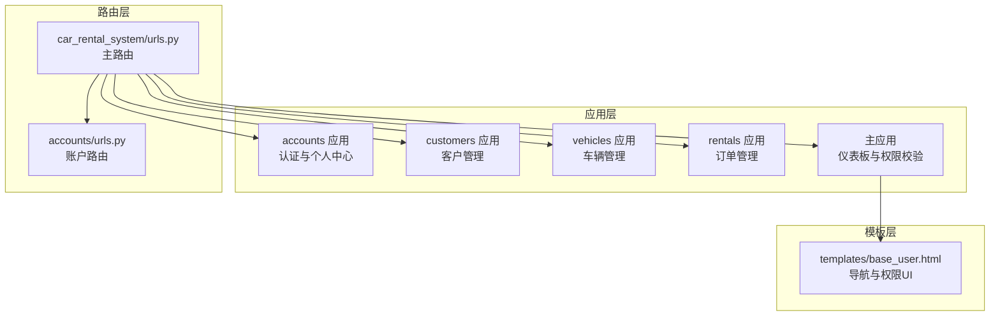
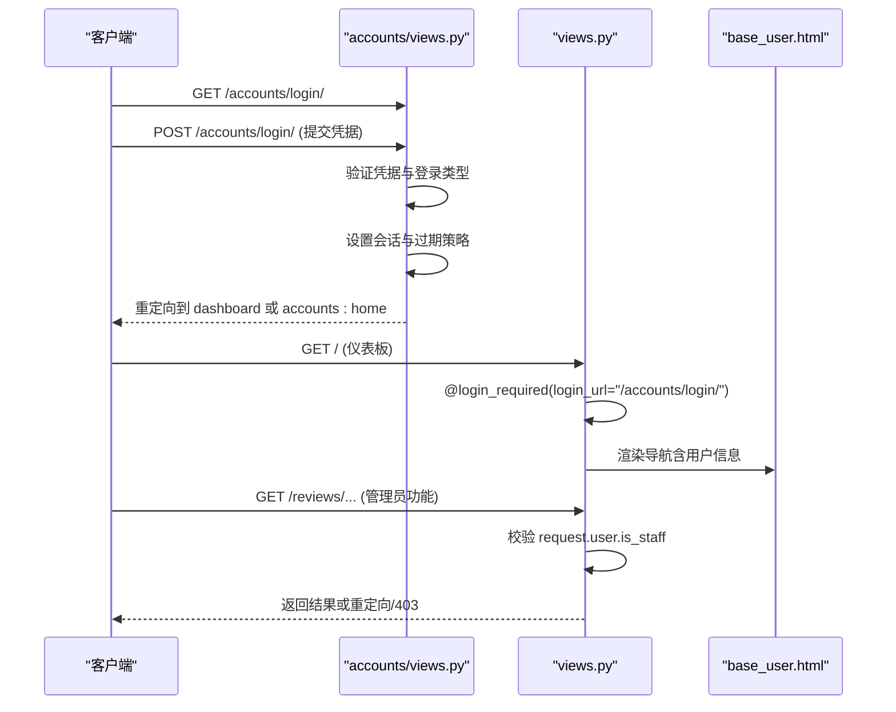
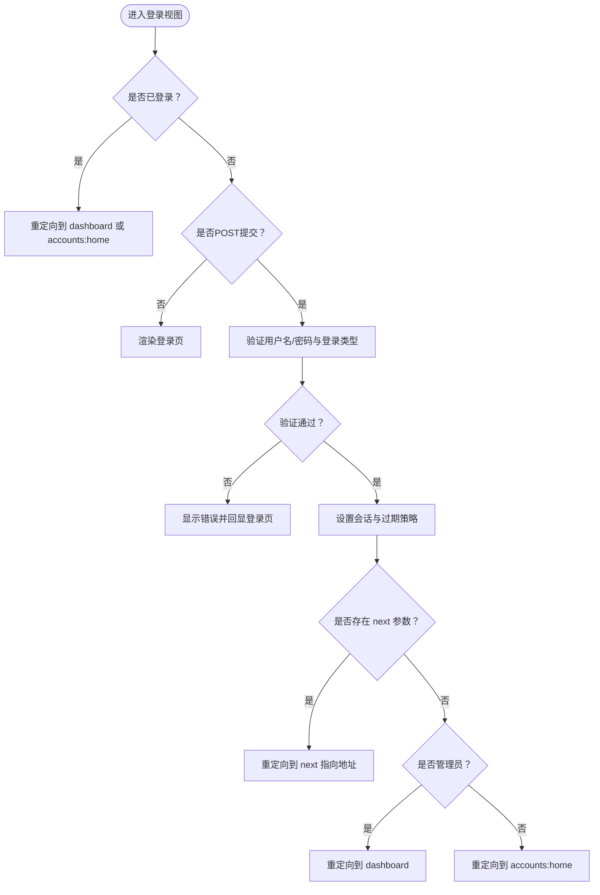
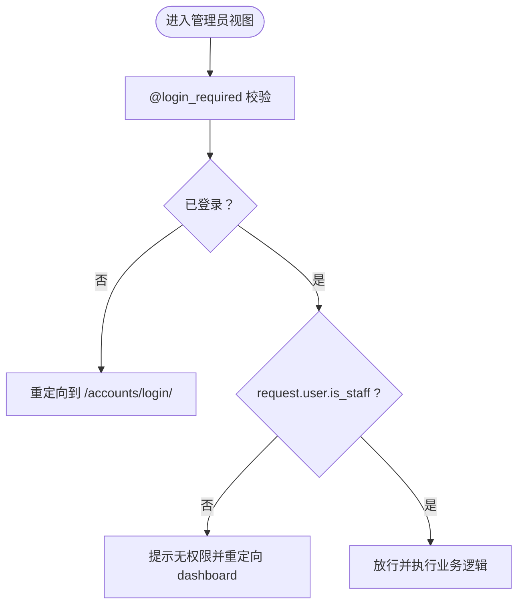
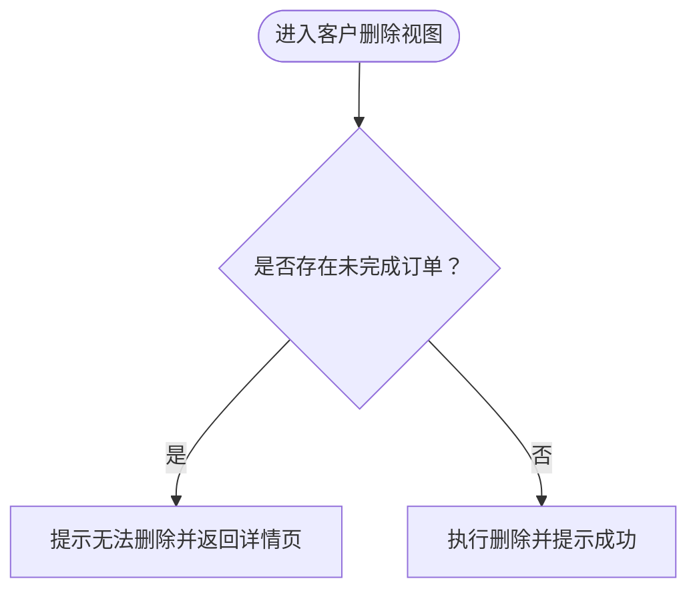
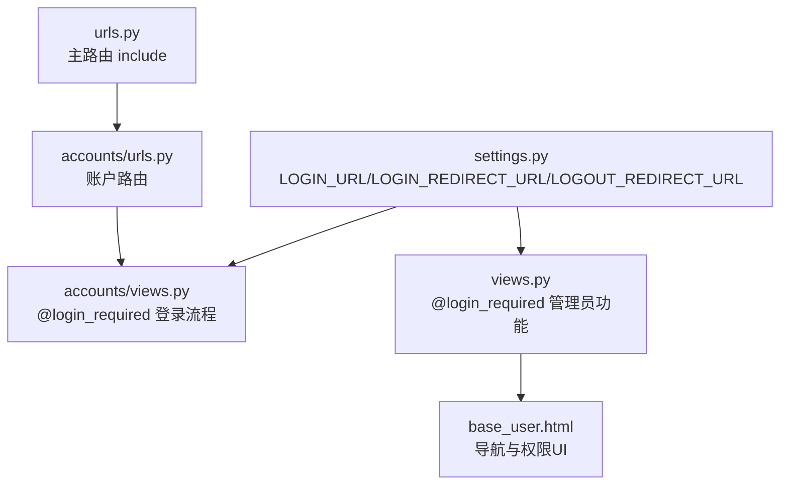

# 认证与基于角色的访问控制

<cite>
**本文引用的文件**
- [settings.py](file://code/car_rental_system/car_rental_system/settings.py)
- [urls.py](file://code/car_rental_system/car_rental_system/urls.py)
- [accounts/views.py](file://code/car_rental_system/accounts/views.py)
- [accounts/urls.py](file://code/car_rental_system/accounts/urls.py)
- [views.py](file://code/car_rental_system/views.py)
- [base_user.html](file://code/car_rental_system/templates/base_user.html)
- [customers/views.py](file://code/car_rental_system/customers/views.py)
- [rentals/views.py](file://code/car_rental_system/rentals/views.py)
- [vehicles/views.py](file://code/car_rental_system/vehicles/views.py)
- [最终测试与优化报告.md](file://code/car_rental_system/最终测试与优化报告.md)
</cite>

## 目录
1. [简介](#简介)
2. [项目结构](#项目结构)
3. [核心组件](#核心组件)
4. [架构总览](#架构总览)
5. [详细组件分析](#详细组件分析)
6. [依赖分析](#依赖分析)
7. [性能考虑](#性能考虑)
8. [故障排查指南](#故障排查指南)
9. [结论](#结论)
10. [附录](#附录)

## 简介
本文件围绕系统的用户认证流程与基于角色的访问控制（RBAC）设计展开，结合仓库中的认证视图、URL路由、模板中的权限判断以及主视图中的装饰器与辅助函数，系统化梳理登录、会话管理、权限校验与敏感操作的访问控制策略。同时，依据“最终测试与优化报告”中关于URL配置与安全性的测试结论，给出针对越权访问的预防建议与最佳实践。

## 项目结构
系统采用Django标准MVC结构，认证与权限控制主要分布在以下模块：
- 认证与个人中心：accounts 应用（登录、登出、密码重置、个人资料、车辆收藏等）
- 管理后台与仪表板：主应用（dashboard、权限校验、错误页面）
- 业务功能：customers、vehicles、rentals 应用（客户、车辆、订单管理）
- 模板层：base_user.html 等模板负责导航与权限相关UI呈现

图表来源
- [urls.py](file://code/car_rental_system/car_rental_system/urls.py#L1-L43)
- [accounts/urls.py](file://code/car_rental_system/accounts/urls.py#L1-L50)
- [base_user.html](file://code/car_rental_system/templates/base_user.html#L1-L235)

章节来源
- [urls.py](file://code/car_rental_system/car_rental_system/urls.py#L1-L43)
- [accounts/urls.py](file://code/car_rental_system/accounts/urls.py#L1-L50)
- [base_user.html](file://code/car_rental_system/templates/base_user.html#L1-L235)

## 核心组件
- 认证与会话管理
  - 登录视图支持管理员与普通用户登录，并根据 is_staff 字段决定跳转与消息提示；支持“记住我”会话有效期控制。
  - 登出视图统一处理会话失效与消息提示。
  - 密码重置请求与重置视图提供演示性流程。
- 权限校验与RBAC
  - 主应用使用 @login_required 与自定义辅助函数 _require_staff 实现管理员专用功能的访问控制。
  - accounts 应用广泛使用 @login_required 保护个人中心与敏感操作。
- URL路由与模板
  - 主路由集中挂载各应用子路由，便于统一管理。
  - 模板 base_user.html 通过 user.is_authenticated 控制导航菜单显示，体现基本的前端权限呈现。

章节来源
- [accounts/views.py](file://code/car_rental_system/accounts/views.py#L50-L103)
- [views.py](file://code/car_rental_system/views.py#L21-L30)
- [views.py](file://code/car_rental_system/views.py#L118-L120)
- [views.py](file://code/car_rental_system/views.py#L122-L160)
- [views.py](file://code/car_rental_system/views.py#L162-L200)
- [accounts/urls.py](file://code/car_rental_system/accounts/urls.py#L1-L50)
- [urls.py](file://code/car_rental_system/car_rental_system/urls.py#L27-L38)
- [base_user.html](file://code/car_rental_system/templates/base_user.html#L160-L177)

## 架构总览
系统认证与RBAC的关键交互如下：
- 用户通过 accounts/login 视图进行认证，系统根据 is_staff 决定跳转与消息。
- 登录成功后，@login_required 装饰器在视图层拦截未登录访问。
- 管理员专用功能通过 @login_required + request.user.is_staff 或自定义 _require_staff 辅助函数进行二次校验。
- 模板层通过 user.is_authenticated 控制导航菜单显示，形成前端与后端的双重权限呈现。

图表来源
- [accounts/views.py](file://code/car_rental_system/accounts/views.py#L50-L103)
- [views.py](file://code/car_rental_system/views.py#L21-L30)
- [views.py](file://code/car_rental_system/views.py#L118-L120)
- [views.py](file://code/car_rental_system/views.py#L122-L160)
- [base_user.html](file://code/car_rental_system/templates/base_user.html#L160-L177)

## 详细组件分析

### 认证流程与会话管理
- 登录视图
  - 支持两种登录类型：用户登录与管理员登录。若选择管理员登录但用户非 is_staff，则返回错误提示。
  - “记住我”选项影响会话有效期：未勾选则会话随浏览器关闭而结束。
  - 登录成功后根据 is_staff 跳转到 dashboard 或 accounts:home，并携带成功消息。
- 登出视图
  - 统一调用 logout，清空会话并返回登录页。
- 密码重置
  - 提供请求与重置视图，演示性处理（实际应结合邮件与令牌校验）。

图表来源
- [accounts/views.py](file://code/car_rental_system/accounts/views.py#L50-L103)

章节来源
- [accounts/views.py](file://code/car_rental_system/accounts/views.py#L50-L103)

### RBAC 设计与权限校验
- 视图级装饰器
  - @login_required(login_url="/accounts/login/") 用于仪表板与管理员功能，未登录用户被强制跳转登录。
  - accounts 应用中大量视图使用 @login_required 保护个人中心与敏感操作。
- 自定义辅助函数
  - _require_staff 作为辅助函数，封装 is_staff 校验逻辑，便于在视图中快速判断。
- 管理员专用功能示例
  - review_list_view、review_edit_view、review_delete_view：均要求管理员身份，否则重定向到仪表板并提示无权限。
- URL访问控制
  - 主路由集中挂载 accounts/、vehicles/、customers/、rentals/ 子路由，便于统一管理与后续扩展权限中间件。

图表来源
- [views.py](file://code/car_rental_system/views.py#L21-L30)
- [views.py](file://code/car_rental_system/views.py#L118-L120)
- [views.py](file://code/car_rental_system/views.py#L122-L160)
- [views.py](file://code/car_rental_system/views.py#L162-L200)

章节来源
- [views.py](file://code/car_rental_system/views.py#L21-L30)
- [views.py](file://code/car_rental_system/views.py#L118-L120)
- [views.py](file://code/car_rental_system/views.py#L122-L160)
- [views.py](file://code/car_rental_system/views.py#L162-L200)

### 敏感操作的访问控制（以客户删除为例）
- 客户删除视图在POST阶段进行业务校验：若客户存在未完成订单，则阻止删除并提示原因。
- 该逻辑体现了“业务层面的权限与约束”，即便管理员身份也无法绕过业务规则。

图表来源
- [customers/views.py](file://code/car_rental_system/customers/views.py#L165-L191)

章节来源
- [customers/views.py](file://code/car_rental_system/customers/views.py#L165-L191)

### URL路由配置与模板中的权限判断
- 主路由
  - 主路由集中挂载各应用子路由，便于统一管理与扩展。
- 账户路由
  - accounts 应用路由涵盖注册、登录、登出、个人中心、订单与支付等。
- 模板 base_user.html
  - 通过 user.is_authenticated 控制导航菜单显示，体现基本的前端权限呈现。

章节来源
- [urls.py](file://code/car_rental_system/car_rental_system/urls.py#L27-L38)
- [accounts/urls.py](file://code/car_rental_system/accounts/urls.py#L1-L50)
- [base_user.html](file://code/car_rental_system/templates/base_user.html#L160-L177)

### 不同用户角色的界面与功能差异
- 普通用户
  - 登录后跳转 accounts:home，可查看车辆、收藏、个人中心、订单与支付等功能。
- 管理员
  - 登录后跳转 dashboard，可访问管理员专属功能（如评价管理、仪表板统计等）。

章节来源
- [accounts/views.py](file://code/car_rental_system/accounts/views.py#L50-L103)
- [views.py](file://code/car_rental_system/views.py#L21-L30)
- [base_user.html](file://code/car_rental_system/templates/base_user.html#L160-L177)

## 依赖分析
- 认证与会话
  - settings.py 中配置 LOGIN_URL、LOGIN_REDIRECT_URL、LOGOUT_REDIRECT_URL，统一登录与重定向行为。
  - CSRF、Session、Message 等中间件保障会话与安全。
- 路由依赖
  - 主路由 include 各应用子路由，accounts/urls.py 定义账户相关URL。
- 视图依赖
  - accounts 应用视图广泛依赖 @login_required；主应用视图依赖 request.user.is_staff 或自定义辅助函数。
- 模板依赖
  - base_user.html 依赖 user 上下文变量，用于导航与用户信息展示。

图表来源
- [settings.py](file://code/car_rental_system/car_rental_system/settings.py#L120-L135)
- [urls.py](file://code/car_rental_system/car_rental_system/urls.py#L27-L38)
- [accounts/urls.py](file://code/car_rental_system/accounts/urls.py#L1-L50)
- [accounts/views.py](file://code/car_rental_system/accounts/views.py#L50-L103)
- [views.py](file://code/car_rental_system/views.py#L21-L30)
- [base_user.html](file://code/car_rental_system/templates/base_user.html#L160-L177)

章节来源
- [settings.py](file://code/car_rental_system/car_rental_system/settings.py#L120-L135)
- [urls.py](file://code/car_rental_system/car_rental_system/urls.py#L27-L38)
- [accounts/urls.py](file://code/car_rental_system/accounts/urls.py#L1-L50)
- [accounts/views.py](file://code/car_rental_system/accounts/views.py#L50-L103)
- [views.py](file://code/car_rental_system/views.py#L21-L30)
- [base_user.html](file://code/car_rental_system/templates/base_user.html#L160-L177)

## 性能考虑
- 查询优化
  - 多处视图使用 select_related、prefetch_related 与 only 限制字段，降低N+1查询风险。
- 缓存利用
  - 使用缓存存储筛选选项与热门车辆等数据，减少数据库压力。
- 分页与批量统计
  - 列表页普遍采用分页，聚合查询一次性统计关键指标，提升响应速度。

章节来源
- [accounts/views.py](file://code/car_rental_system/accounts/views.py#L520-L710)
- [vehicles/views.py](file://code/car_rental_system/vehicles/views.py#L42-L135)
- [rentals/views.py](file://code/car_rental_system/rentals/views.py#L61-L126)

## 故障排查指南
- URL反向解析错误（NoReverseMatch）
  - 报告指出主页面导航链接URL配置不正确，已在模板中修复。若出现类似问题，检查模板中的 url 标签与命名路由是否一致。
- 模板路径问题
  - 报告指出Django应用模板目录配置错误，已在 settings.py 中添加根模板目录路径。若模板找不到，检查 TEMPLATES.DIRS 配置。
- CSRF保护与安全
  - 报告确认CSRF保护已启用，SQL注入防护由Django ORM提供，表单验证正常。若出现CSRF错误，检查表单与中间件配置。
- 权限错误页面
  - 系统提供 403 权限错误页面，便于用户与运维定位越权访问问题。

章节来源
- [最终测试与优化报告.md](file://code/car_rental_system/最终测试与优化报告.md#L49-L57)
- [最终测试与优化报告.md](file://code/car_rental_system/最终测试与优化报告.md#L82-L93)
- [settings.py](file://code/car_rental_system/car_rental_system/settings.py#L56-L71)
- [views.py](file://code/car_rental_system/views.py#L209-L227)

## 结论
系统在认证与RBAC方面形成了“视图级装饰器 + 用户属性校验”的组合策略：@login_required 保证登录态，request.user.is_staff 或自定义辅助函数确保管理员专用功能的访问控制。配合URL路由集中管理与模板层的权限呈现，整体实现了清晰的权限边界。测试报告确认了安全性与部分URL配置问题的存在，建议持续完善URL命名一致性与模板路径配置，以进一步提升稳定性与可维护性。

## 附录

### 防止越权访问的最佳实践
- URL访问控制
  - 为管理员功能单独规划命名空间与URL前缀，便于后续接入中间件或权限中间件。
- 视图级权限验证
  - 对涉及业务数据修改的操作（如客户删除、订单状态变更、车辆信息修改）在视图中进行业务规则与权限双重校验。
- 前端菜单动态渲染
  - 通过 user.is_authenticated 与 request.user.is_staff 控制菜单项显示，避免未授权用户看到敏感入口。
- 安全漏洞与应对
  - CSRF：确保表单与AJAX请求均启用CSRF保护。
  - SQL注入：使用Django ORM，避免原生SQL拼接。
  - XSS：对模板输出进行安全过滤，避免直接渲染不受信任数据。
  - 强制会话：对管理员登录启用更严格的会话策略（如固定IP、二次验证）。

章节来源
- [accounts/views.py](file://code/car_rental_system/accounts/views.py#L50-L103)
- [views.py](file://code/car_rental_system/views.py#L122-L160)
- [views.py](file://code/car_rental_system/views.py#L162-L200)
- [base_user.html](file://code/car_rental_system/templates/base_user.html#L160-L177)
- [最终测试与优化报告.md](file://code/car_rental_system/最终测试与优化报告.md#L64-L73)