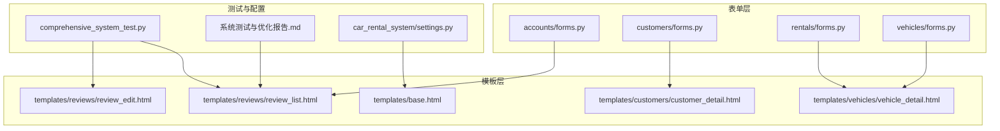
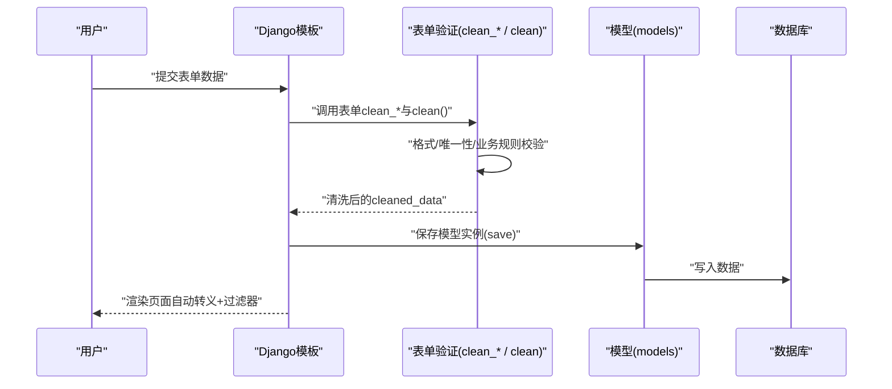
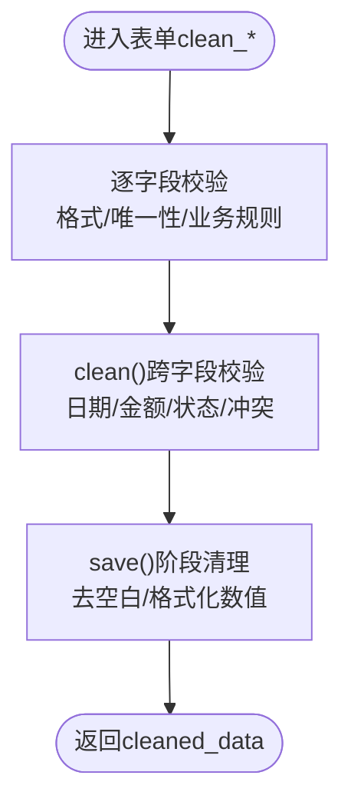
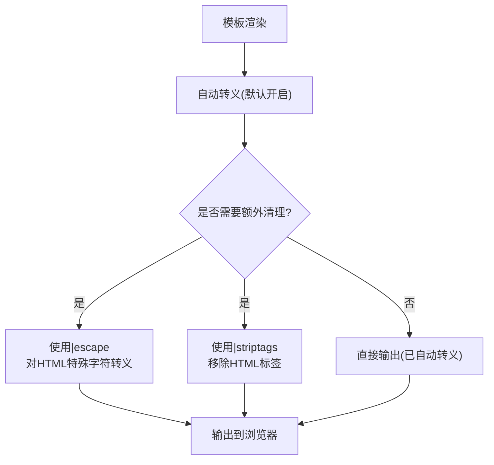
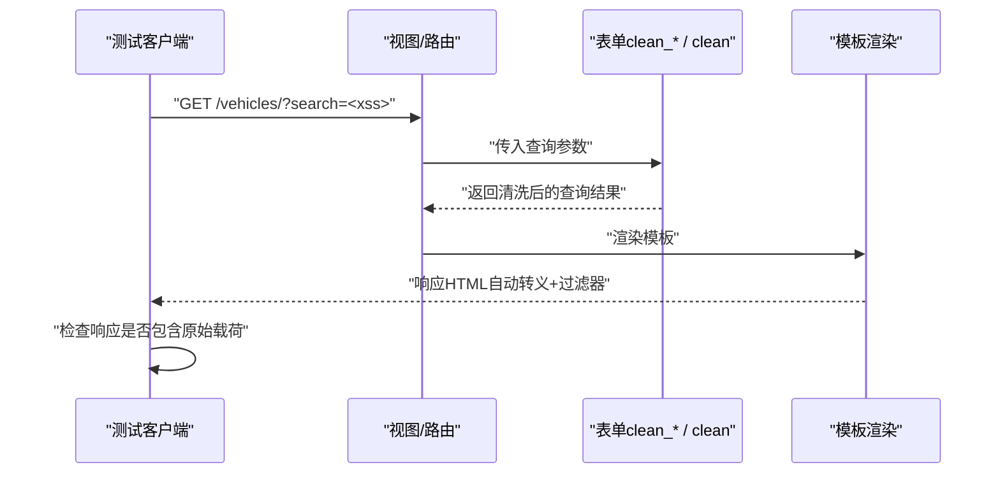
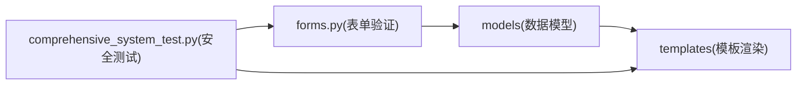

# 输入验证与XSS防护

<cite>
**本文引用的文件**
- [comprehensive_system_test.py](file://code/car_rental_system/comprehensive_system_test.py)
- [系统测试与优化报告.md](file://code/car_rental_system/系统测试与优化报告.md)
- [accounts/forms.py](file://code/car_rental_system/accounts/forms.py)
- [customers/forms.py](file://code/car_rental_system/customers/forms.py)
- [rentals/forms.py](file://code/car_rental_system/rentals/forms.py)
- [vehicles/forms.py](file://code/car_rental_system/vehicles/forms.py)
- [reviews/review_list.html](file://code/car_rental_system/templates/reviews/review_list.html)
- [reviews/review_edit.html](file://code/car_rental_system/templates/reviews/review_edit.html)
- [customers/customer_detail.html](file://code/car_rental_system/templates/customers/customer_detail.html)
- [vehicles/vehicle_detail.html](file://code/car_rental_system/templates/vehicles/vehicle_detail.html)
- [base.html](file://code/car_rental_system/templates/base.html)
- [settings.py](file://code/car_rental_system/car_rental_system/settings.py)
</cite>

## 目录
1. [简介](#简介)
2. [项目结构与安全相关位置](#项目结构与安全相关位置)
3. [核心组件与安全机制](#核心组件与安全机制)
4. [架构总览](#架构总览)
5. [详细组件分析](#详细组件分析)
6. [依赖关系分析](#依赖关系分析)
7. [性能与安全权衡](#性能与安全权衡)
8. [故障排查指南](#故障排查指南)
9. [结论](#结论)

## 简介
本文件系统化梳理项目中的输入验证机制与XSS防护策略，结合系统测试与优化报告中对XSS增强的建议，说明如何在Django模板中通过|escape和|striptags过滤器防止跨站脚本攻击；结合comprehensive_system_test.py中test_security()方法对xss_safe的检测逻辑，分析前端表单输入的清洗流程；展示accounts/forms.py中自定义表单验证器的实现方式，确保用户输入符合安全规范；提供实际模板代码示例，说明敏感字段（如客户姓名、评价内容）在渲染时的安全处理；解释如何通过Django内置的自动转义机制和手动过滤器双重保障输出安全，并给出常见绕过场景的防范建议。

## 项目结构与安全相关位置
- 输入验证集中在各应用的forms.py中，采用ModelForm和Form类的clean_*钩子、clean()跨字段验证以及字段级别的正则校验。
- 输出安全主要体现在模板层，使用Django模板自动转义与过滤器（如|escape、|striptags）。
- 安全测试位于comprehensive_system_test.py的test_security()方法，对CSRF、SQL注入与XSS进行检测。
- 系统测试与优化报告.md明确指出XSS防护需加强，并给出了在模板中使用|escape和|striptags的建议。

**图表来源**
- [accounts/forms.py](file://code/car_rental_system/accounts/forms.py#L1-L334)
- [customers/forms.py](file://code/car_rental_system/customers/forms.py#L1-L158)
- [rentals/forms.py](file://code/car_rental_system/rentals/forms.py#L1-L364)
- [vehicles/forms.py](file://code/car_rental_system/vehicles/forms.py#L1-L153)
- [reviews/review_list.html](file://code/car_rental_system/templates/reviews/review_list.html#L1-L143)
- [reviews/review_edit.html](file://code/car_rental_system/templates/reviews/review_edit.html#L1-L72)
- [customers/customer_detail.html](file://code/car_rental_system/templates/customers/customer_detail.html#L1-L383)
- [vehicles/vehicle_detail.html](file://code/car_rental_system/templates/vehicles/vehicle_detail.html#L1-L350)
- [base.html](file://code/car_rental_system/templates/base.html#L1-L291)
- [comprehensive_system_test.py](file://code/car_rental_system/comprehensive_system_test.py#L517-L585)
- [系统测试与优化报告.md](file://code/car_rental_system/系统测试与优化报告.md#L145-L165)
- [settings.py](file://code/car_rental_system/car_rental_system/settings.py#L56-L71)

**章节来源**
- [comprehensive_system_test.py](file://code/car_rental_system/comprehensive_system_test.py#L517-L585)
- [系统测试与优化报告.md](file://code/car_rental_system/系统测试与优化报告.md#L145-L165)

## 核心组件与安全机制
- 输入验证（后端）：各应用表单通过clean_*钩子与clean()进行格式、唯一性、业务规则校验；字段级正则表达式保证输入合法性；save()阶段进行数据清理（如去除多余空白）。
- 输出安全（前端）：Django模板默认开启自动转义；建议在模板中使用|escape和|striptags对不受信任的数据进行显式转义与清理。
- 安全测试：comprehensive_system_test.py的test_security()对CSRF、SQL注入与XSS进行检测；系统测试与优化报告.md明确建议加强XSS防护。

**章节来源**
- [accounts/forms.py](file://code/car_rental_system/accounts/forms.py#L1-L334)
- [customers/forms.py](file://code/car_rental_system/customers/forms.py#L1-L158)
- [rentals/forms.py](file://code/car_rental_system/rentals/forms.py#L1-L364)
- [vehicles/forms.py](file://code/car_rental_system/vehicles/forms.py#L1-L153)
- [comprehensive_system_test.py](file://code/car_rental_system/comprehensive_system_test.py#L517-L585)
- [系统测试与优化报告.md](file://code/car_rental_system/系统测试与优化报告.md#L145-L165)

## 架构总览
下图展示了从前端表单提交到模板渲染的输入验证与XSS防护路径，强调后端验证与模板输出双重保障。

**图表来源**
- [accounts/forms.py](file://code/car_rental_system/accounts/forms.py#L1-L334)
- [customers/forms.py](file://code/car_rental_system/customers/forms.py#L1-L158)
- [rentals/forms.py](file://code/car_rental_system/rentals/forms.py#L1-L364)
- [vehicles/forms.py](file://code/car_rental_system/vehicles/forms.py#L1-L153)
- [reviews/review_list.html](file://code/car_rental_system/templates/reviews/review_list.html#L1-L143)
- [reviews/review_edit.html](file://code/car_rental_system/templates/reviews/review_edit.html#L1-L72)

## 详细组件分析

### 输入验证机制（后端）
- 用户注册/登录/密码修改：通过UserRegisterForm、UserLoginForm、PasswordChangeFormCustom等进行字段级校验与业务规则校验，如用户名字符集、长度、邮箱唯一性、手机号格式等。
- 客户信息：CustomerForm对手机号、身份证号、驾驶证号进行格式与唯一性校验，并在clean_*中排除当前编辑对象，避免误判。
- 租赁订单：RentalForm对日期、金额、车辆可用性、跨地点还车逻辑进行严格校验；clean()中检查时间冲突与状态转换合法性。
- 车辆信息：VehicleForm对日租金范围、座位数范围、品牌/型号/颜色/车牌号进行清理与校验，并在save()中统一去除首尾空白。

**图表来源**
- [accounts/forms.py](file://code/car_rental_system/accounts/forms.py#L1-L334)
- [customers/forms.py](file://code/car_rental_system/customers/forms.py#L1-L158)
- [rentals/forms.py](file://code/car_rental_system/rentals/forms.py#L1-L364)
- [vehicles/forms.py](file://code/car_rental_system/vehicles/forms.py#L1-L153)

**章节来源**
- [accounts/forms.py](file://code/car_rental_system/accounts/forms.py#L1-L334)
- [customers/forms.py](file://code/car_rental_system/customers/forms.py#L1-L158)
- [rentals/forms.py](file://code/car_rental_system/rentals/forms.py#L1-L364)
- [vehicles/forms.py](file://code/car_rental_system/vehicles/forms.py#L1-L153)

### XSS防护策略（模板层）
- 自动转义：Django模板默认开启自动转义，对变量输出进行HTML实体编码，防止脚本注入。
- 手动过滤器：建议在模板中使用|escape和|striptags对不受信任的数据进行显式转义与清理，尤其针对评论、搜索关键词等敏感字段。
- 安全测试：comprehensive_system_test.py的test_security()通过构造XSS载荷并检查响应中是否包含未转义内容，验证XSS防护效果。

**图表来源**
- [reviews/review_list.html](file://code/car_rental_system/templates/reviews/review_list.html#L1-L143)
- [reviews/review_edit.html](file://code/car_rental_system/templates/reviews/review_edit.html#L1-L72)
- [customers/customer_detail.html](file://code/car_rental_system/templates/customers/customer_detail.html#L1-L383)
- [vehicles/vehicle_detail.html](file://code/car_rental_system/templates/vehicles/vehicle_detail.html#L1-L350)
- [comprehensive_system_test.py](file://code/car_rental_system/comprehensive_system_test.py#L517-L585)
- [系统测试与优化报告.md](file://code/car_rental_system/系统测试与优化报告.md#L145-L165)

**章节来源**
- [reviews/review_list.html](file://code/car_rental_system/templates/reviews/review_list.html#L1-L143)
- [reviews/review_edit.html](file://code/car_rental_system/templates/reviews/review_edit.html#L1-L72)
- [customers/customer_detail.html](file://code/car_rental_system/templates/customers/customer_detail.html#L1-L383)
- [vehicles/vehicle_detail.html](file://code/car_rental_system/templates/vehicles/vehicle_detail.html#L1-L350)
- [comprehensive_system_test.py](file://code/car_rental_system/comprehensive_system_test.py#L517-L585)
- [系统测试与优化报告.md](file://code/car_rental_system/系统测试与优化报告.md#L145-L165)

### 前端表单输入清洗流程（结合test_security）
- comprehensive_system_test.py的test_security()对XSS载荷进行GET请求测试，检查响应中是否包含原始载荷，从而验证XSS防护是否生效。
- 实际清洗流程：表单clean_*与clean()在后端完成格式与业务规则校验；模板层通过自动转义与过滤器进一步保障输出安全。

**图表来源**
- [comprehensive_system_test.py](file://code/car_rental_system/comprehensive_system_test.py#L517-L585)
- [vehicles/forms.py](file://code/car_rental_system/vehicles/forms.py#L1-L153)

**章节来源**
- [comprehensive_system_test.py](file://code/car_rental_system/comprehensive_system_test.py#L517-L585)

### 模板中敏感字段的安全处理示例
- 评价内容（review.comment）：在列表页使用截断与自动转义；在编辑页直接渲染表单字段，配合后端clean_*与模板自动转义。
- 客户姓名（customer.name）、手机号（customer.phone）、邮箱（customer.email）：在详情页直接输出，依赖模板自动转义；若来自搜索参数，应在模板中使用|escape或|striptags。
- 车辆品牌/型号/颜色：在详情页直接输出，依赖模板自动转义；若来自搜索参数，应在模板中使用|escape或|striptags。

**章节来源**
- [reviews/review_list.html](file://code/car_rental_system/templates/reviews/review_list.html#L1-L143)
- [reviews/review_edit.html](file://code/car_rental_system/templates/reviews/review_edit.html#L1-L72)
- [customers/customer_detail.html](file://code/car_rental_system/templates/customers/customer_detail.html#L1-L383)
- [vehicles/vehicle_detail.html](file://code/car_rental_system/templates/vehicles/vehicle_detail.html#L1-L350)

### Django内置自动转义与手动过滤器的双重保障
- 自动转义：Django模板默认开启自动转义，确保变量输出时进行HTML实体编码。
- 手动过滤器：|escape对HTML特殊字符进行转义；|striptags移除HTML标签，适合对富文本输入进行清理。
- 配置参考：settings.py中TEMPLATES选项包含上下文处理器，确保模板上下文可用。

**章节来源**
- [settings.py](file://code/car_rental_system/car_rental_system/settings.py#L56-L71)
- [系统测试与优化报告.md](file://code/car_rental_system/系统测试与优化报告.md#L145-L165)

## 依赖关系分析
- 表单层依赖模型层进行数据持久化；模板层依赖表单层提供的cleaned_data与模型层数据。
- 安全测试贯穿表单验证与模板渲染两个环节，确保前后端协同防护。

**图表来源**
- [accounts/forms.py](file://code/car_rental_system/accounts/forms.py#L1-L334)
- [customers/forms.py](file://code/car_rental_system/customers/forms.py#L1-L158)
- [rentals/forms.py](file://code/car_rental_system/rentals/forms.py#L1-L364)
- [vehicles/forms.py](file://code/car_rental_system/vehicles/forms.py#L1-L153)
- [reviews/review_list.html](file://code/car_rental_system/templates/reviews/review_list.html#L1-L143)
- [comprehensive_system_test.py](file://code/car_rental_system/comprehensive_system_test.py#L517-L585)

**章节来源**
- [accounts/forms.py](file://code/car_rental_system/accounts/forms.py#L1-L334)
- [customers/forms.py](file://code/car_rental_system/customers/forms.py#L1-L158)
- [rentals/forms.py](file://code/car_rental_system/rentals/forms.py#L1-L364)
- [vehicles/forms.py](file://code/car_rental_system/vehicles/forms.py#L1-L153)
- [reviews/review_list.html](file://code/car_rental_system/templates/reviews/review_list.html#L1-L143)
- [comprehensive_system_test.py](file://code/car_rental_system/comprehensive_system_test.py#L517-L585)

## 性能与安全权衡
- 输入验证在后端执行，虽然会增加少量服务器开销，但能显著降低XSS风险与数据污染。
- 模板自动转义与过滤器开销极低，建议在所有不受信任的输出点使用，确保安全优先。
- 系统测试与优化报告.md建议在模板中使用|escape和|striptags，这属于轻量级安全增强，不会对性能造成明显影响。

[本节为通用指导，无需列出具体文件来源]

## 故障排查指南
- XSS测试失败：检查模板中是否对不受信任的数据使用|escape或|striptags；确认表单clean_*与clean()是否正确清洗数据。
- 模板路径问题：系统测试与优化报告.md指出存在模板路径配置问题，需修正模板引用路径以确保页面正常渲染。
- CSRF/SQL注入：comprehensive_system_test.py的test_security()已验证CSRF与SQL注入防护有效，若出现异常需检查中间件与数据库配置。

**章节来源**
- [comprehensive_system_test.py](file://code/car_rental_system/comprehensive_system_test.py#L517-L585)
- [系统测试与优化报告.md](file://code/car_rental_system/系统测试与优化报告.md#L91-L100)

## 结论
本项目在输入验证方面具备完善的后端表单校验体系，在输出安全方面依赖Django模板的自动转义机制。系统测试与优化报告.md明确提出需加强XSS防护，并建议在模板中使用|escape和|striptags。通过后端clean_*与clean()、模板自动转义与过滤器的双重保障，能够有效抵御常见的XSS攻击。建议在后续迭代中：
- 在所有涉及用户输入的模板输出点统一使用|escape或|striptags；
- 修复模板路径问题，确保页面正常渲染；
- 引入更严格的前端输入限制与二次校验，提升整体安全性。

[本节为总结性内容，无需列出具体文件来源]