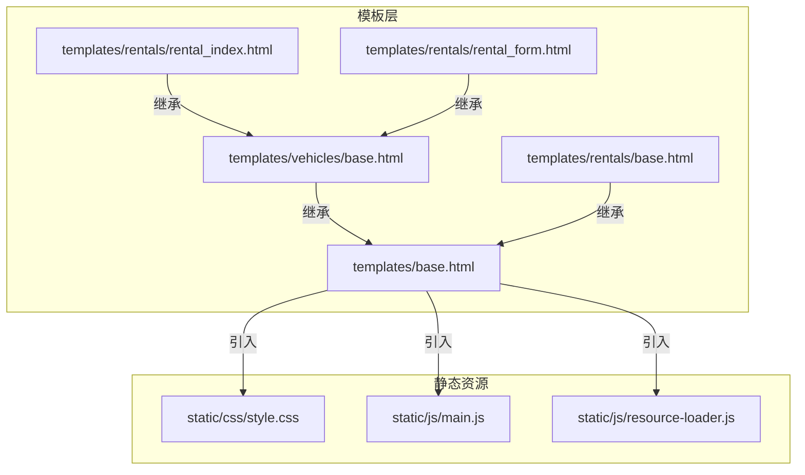
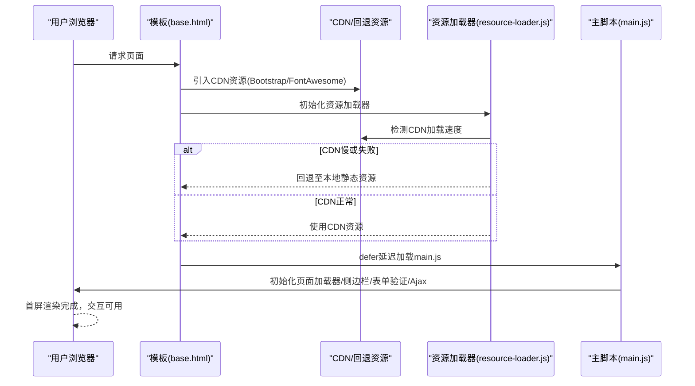
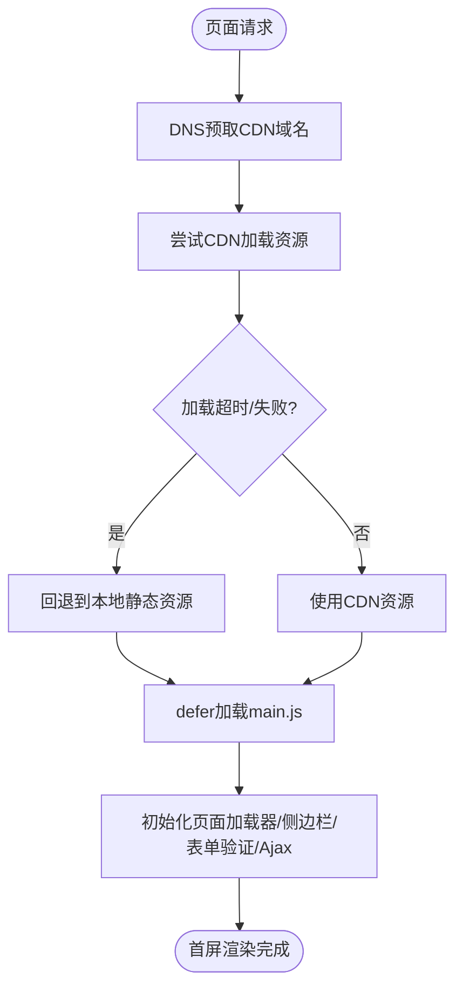
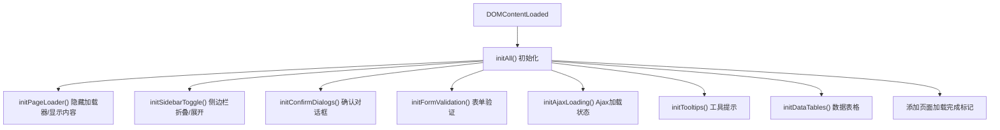
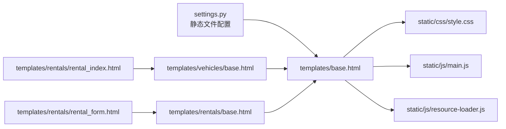
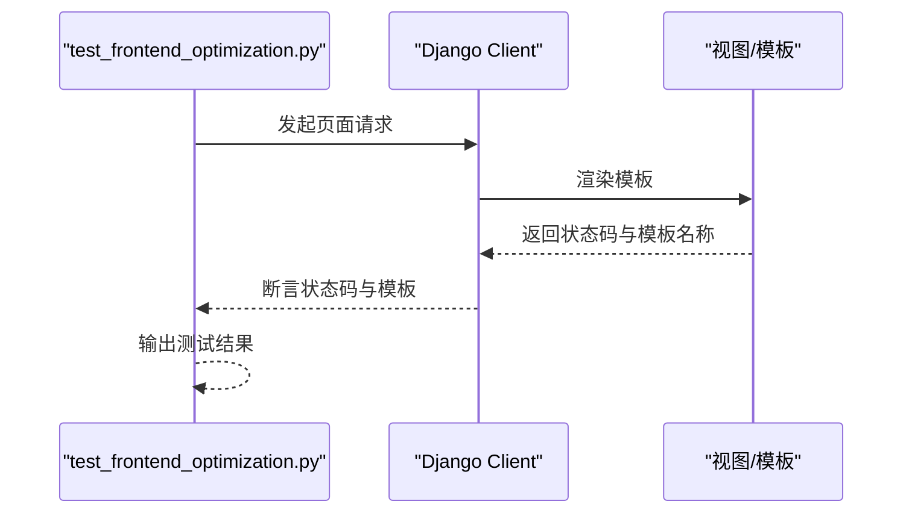

# 前端性能优化

<cite>
**本文引用的文件**
- [系统测试与优化报告.md](file://code/car_rental_system/系统测试与优化报告.md)
- [test_frontend_optimization.py](file://code/car_rental_system/test_frontend_optimization.py)
- [main.js](file://code/car_rental_system/static/js/main.js)
- [style.css](file://code/car_rental_system/static/css/style.css)
- [resource-loader.js](file://code/car_rental_system/static/js/resource-loader.js)
- [base.html](file://code/car_rental_system/templates/base.html)
- [rentals/base.html](file://code/car_rental_system/templates/rentals/base.html)
- [vehicles/base.html](file://code/car_rental_system/templates/vehicles/base.html)
- [rental_index.html](file://code/car_rental_system/templates/rentals/rental_index.html)
- [rental_form.html](file://code/car_rental_system/templates/rentals/rental_form.html)
- [settings.py](file://code/car_rental_system/car_rental_system/settings.py)
</cite>

## 目录
1. [简介](#简介)
2. [项目结构](#项目结构)
3. [核心组件](#核心组件)
4. [架构总览](#架构总览)
5. [详细组件分析](#详细组件分析)
6. [依赖分析](#依赖分析)
7. [性能考量](#性能考量)
8. [故障排查指南](#故障排查指南)
9. [结论](#结论)
10. [附录](#附录)

## 简介
本文件围绕前端性能优化实施方案展开，结合系统测试与优化报告中的前端性能数据以及 test_frontend_optimization.py 的测试逻辑，系统阐述静态资源优化策略（CSS/JS压缩、Gzip、缓存头、资源合并）、代码结构与行为（main.js 与 style.css 的组织方式）、JavaScript 代码分割与延迟加载、减少 HTTP 请求、CDN 加速与图片优化、前端性能监控与自动化测试方法，并给出常见问题的解决方案与最佳实践。

## 项目结构
前端资源与模板组织如下：
- 静态资源位于 static 目录，包含 CSS 与 JS 文件
- 模板位于 templates 目录，采用 Django 模板系统，base.html 提供全局布局与资源加载策略
- 租赁管理相关页面通过 vehicles/base.html 或 rentals/base.html 扩展，形成统一的卡片式布局与导航

**图表来源**
- [base.html](file://code/car_rental_system/templates/base.html#L1-L291)
- [rentals/base.html](file://code/car_rental_system/templates/rentals/base.html#L1-L183)
- [vehicles/base.html](file://code/car_rental_system/templates/vehicles/base.html#L1-L27)
- [rental_index.html](file://code/car_rental_system/templates/rentals/rental_index.html#L1-L161)
- [rental_form.html](file://code/car_rental_system/templates/rentals/rental_form.html#L1-L336)
- [style.css](file://code/car_rental_system/static/css/style.css#L1-L668)
- [main.js](file://code/car_rental_system/static/js/main.js#L1-L606)
- [resource-loader.js](file://code/car_rental_system/static/js/resource-loader.js#L1-L164)

**章节来源**
- [base.html](file://code/car_rental_system/templates/base.html#L1-L291)
- [settings.py](file://code/car_rental_system/car_rental_system/settings.py#L118-L125)

## 核心组件
- 全局布局与资源加载策略：base.html 通过 DNS 预取、CDN 资源加载与回退、页面加载指示器、延迟加载自定义 JS 等手段优化首屏与资源可用性
- 资源加载优化脚本：resource-loader.js 提供 CSS/JS 超时与回退、CDN 速度检测与本地回退策略
- 主要 JS 功能：main.js 负责页面加载器、侧边栏、确认对话框、表单验证、Ajax 加载状态、工具提示、数据表格、通用 Ajax 请求、费用计算、搜索与导出、错误处理等
- 样式体系：style.css 提供卡片式布局、网格、状态标签、表格、按钮、表单控件等通用样式，配合 base.html 的过渡动画与加载指示器

**章节来源**
- [base.html](file://code/car_rental_system/templates/base.html#L1-L291)
- [resource-loader.js](file://code/car_rental_system/static/js/resource-loader.js#L1-L164)
- [main.js](file://code/car_rental_system/static/js/main.js#L1-L606)
- [style.css](file://code/car_rental_system/static/css/style.css#L1-L668)

## 架构总览
前端性能优化的关键在于“资源加载优先级”“首屏渲染”“交互即时性”“错误兜底”。整体流程如下：

**图表来源**
- [base.html](file://code/car_rental_system/templates/base.html#L1-L291)
- [resource-loader.js](file://code/car_rental_system/static/js/resource-loader.js#L1-L164)
- [main.js](file://code/car_rental_system/static/js/main.js#L1-L606)

## 详细组件分析

### 组件A：资源加载与CDN回退（base.html 与 resource-loader.js）
- DNS 预取与国内 CDN：base.html 对 BootStrap 与 FontAwesome 使用国内 CDN，并提供 onerror 回退至备用 CDN 或本地静态资源
- 资源超时与回退：resource-loader.js 对 CSS/JS 加载设置超时，若失败则回退到本地资源；同时提供 CDN 速度检测，辅助决定是否使用本地资源
- 页面加载指示器：base.html 提供页面加载指示器与渐隐过渡，避免白屏与闪烁
- 延迟加载：main.js 通过 defer 延迟加载，确保 DOMContentLoaded 后再初始化，减少阻塞

**图表来源**
- [base.html](file://code/car_rental_system/templates/base.html#L1-L291)
- [resource-loader.js](file://code/car_rental_system/static/js/resource-loader.js#L1-L164)
- [main.js](file://code/car_rental_system/static/js/main.js#L1-L606)

**章节来源**
- [base.html](file://code/car_rental_system/templates/base.html#L1-L291)
- [resource-loader.js](file://code/car_rental_system/static/js/resource-loader.js#L1-L164)

### 组件B：main.js 的初始化与交互优化
- 页面加载器：在页面完全加载后隐藏加载器并显示内容，避免白屏
- 侧边栏折叠/展开：移动端与桌面端差异化处理，状态持久化到 localStorage
- 确认对话框：统一的确认弹窗，兼容原生 confirm 与 Bootstrap Modal
- 表单验证：实时校验与提交校验，错误反馈与清除
- Ajax 加载状态：对表单与链接点击提供加载状态反馈
- 工具提示与关闭按钮：基于 Bootstrap Tooltip，统一关闭按钮行为
- 数据表格：点击行跳转，简化交互
- 通用 Ajax 请求：封装 fetch 请求，统一错误处理
- 费用计算、日期格式化、货币格式化、搜索过滤、导出 CSV、错误处理与未处理 Promise 拒绝

**图表来源**
- [main.js](file://code/car_rental_system/static/js/main.js#L1-L606)

**章节来源**
- [main.js](file://code/car_rental_system/static/js/main.js#L1-L606)

### 组件C：样式体系与布局（style.css 与 base.html）
- 卡片式布局：section、card、grid 等类名统一页面结构
- 状态标签：status-pill/status-dot 用于状态展示
- 表单控件与表格：提供一致的表单与表格样式
- 响应式与过渡：媒体查询与 opacity 过渡，提升交互体验
- base.html 的页面过渡与加载指示器：通过 CSS 动画与过渡，改善首屏体验

**章节来源**
- [style.css](file://code/car_rental_system/static/css/style.css#L1-L668)
- [base.html](file://code/car_rental_system/templates/base.html#L1-L291)

### 组件D：模板继承与页面优化（rentals/base.html 与 vehicles/base.html）
- vehicles/base.html 扩展自 base.html，提供额外的内联样式与内容块
- rentals/base.html 提供租赁相关的内联样式与导航，便于页面快速构建
- 通过模板继承，实现统一的全局样式与局部样式的组合

**章节来源**
- [vehicles/base.html](file://code/car_rental_system/templates/vehicles/base.html#L1-L27)
- [rentals/base.html](file://code/car_rental_system/templates/rentals/base.html#L1-L183)

### 组件E：页面示例（rental_index.html 与 rental_form.html）
- rental_index.html 展示统计卡片、今日租赁情况与最近订单，采用卡片式布局，减少复杂表格渲染压力
- rental_form.html 使用 jQuery 进行费用预览与可用性检查，同时在模板块中注入脚本，便于按需加载

**章节来源**
- [rental_index.html](file://code/car_rental_system/templates/rentals/rental_index.html#L1-L161)
- [rental_form.html](file://code/car_rental_system/templates/rentals/rental_form.html#L1-L336)

## 依赖分析
- 模板依赖：vehicles/base.html 与 rentals/base.html 均继承自 base.html，形成全局样式与资源的统一入口
- 资源依赖：base.html 依赖静态 CSS 与 JS，main.js 依赖 Bootstrap 与 jQuery（在 rental_form.html 中按需引入），resource-loader.js 作为资源加载与回退策略
- 静态文件配置：settings.py 中配置了 STATIC_URL 与 STATICFILES_DIRS，确保静态资源可被 Django 正确服务

**图表来源**
- [settings.py](file://code/car_rental_system/car_rental_system/settings.py#L118-L125)
- [base.html](file://code/car_rental_system/templates/base.html#L1-L291)
- [style.css](file://code/car_rental_system/static/css/style.css#L1-L668)
- [main.js](file://code/car_rental_system/static/js/main.js#L1-L606)
- [resource-loader.js](file://code/car_rental_system/static/js/resource-loader.js#L1-L164)
- [vehicles/base.html](file://code/car_rental_system/templates/vehicles/base.html#L1-L27)
- [rentals/base.html](file://code/car_rental_system/templates/rentals/base.html#L1-L183)
- [rental_index.html](file://code/car_rental_system/templates/rentals/rental_index.html#L1-L161)
- [rental_form.html](file://code/car_rental_system/templates/rentals/rental_form.html#L1-L336)

**章节来源**
- [settings.py](file://code/car_rental_system/car_rental_system/settings.py#L118-L125)

## 性能考量
- 静态资源优化策略
  - 压缩与合并：建议对 CSS/JS 进行压缩与合并，减少 HTTP 请求与传输体积
  - Gzip 压缩：在服务器端启用 Gzip 压缩，显著降低 CSS/JS 传输体积
  - 缓存头设置：为静态资源设置合适的 Cache-Control 与 ETag/Last-Modified，提升缓存命中率
  - CDN 加速：继续沿用国内 CDN，并在 resource-loader.js 中增加 CDN 速度检测与回退策略
- 减少 HTTP 请求数
  - 合并 CSS/JS 文件，按需加载非关键资源
  - 将内联样式与脚本拆分为关键与非关键两部分，关键样式内联，其余外链
- 图片优化
  - 使用现代格式（如 WebP）与合适的尺寸，按设备像素比提供合适图片
  - 懒加载图片，减少首屏渲染压力
- 关键渲染路径
  - 将关键 CSS 内联，避免阻塞渲染
  - 将非关键 CSS 延迟加载或异步加载
  - 将关键 JS 放在底部或使用 defer/async
- 首屏加载时间目标
  - 结合测试报告，目标首屏加载时间小于 2 秒，可通过资源优化与缓存策略达成

[本节为通用性能指导，不直接分析具体文件，故无“章节来源”标注]

## 故障排查指南
- 模板路径问题导致页面无法显示
  - 现状：系统测试与优化报告指出模板路径配置问题，导致 dashboard.html、vehicles/index.html、customers/index.html、rentals/rental_index.html 等模板不存在
  - 解决：修正模板路径，确保模板文件存在且路径正确
  - 验证：使用 test_frontend_optimization.py 对租赁管理页面进行端到端验证，确保页面可访问且模板正确加载

**图表来源**
- [test_frontend_optimization.py](file://code/car_rental_system/test_frontend_optimization.py#L1-L161)

**章节来源**
- [系统测试与优化报告.md](file://code/car_rental_system/系统测试与优化报告.md#L91-L100)
- [test_frontend_optimization.py](file://code/car_rental_system/test_frontend_optimization.py#L1-L161)

## 结论
通过资源加载优化（CDN+回退、超时处理、延迟加载）、样式与脚本的结构化组织、模板继承的统一布局，以及针对页面的按需脚本注入，系统在首屏渲染与交互即时性方面已有良好基础。结合测试与报告中的性能目标，建议进一步推进静态资源压缩与合并、Gzip 启用、缓存头优化与图片优化，以达成首屏加载时间小于 2 秒的目标。

[本节为总结性内容，不直接分析具体文件，故无“章节来源”标注]

## 附录
- 前端性能监控与自动化测试
  - 使用 Chrome DevTools 分析关键渲染路径，关注首屏渲染时间、阻塞资源与交互延迟
  - 建立自动化测试流程，定期验证页面可访问性与模板加载正确性
- 常见问题与解决方案
  - 模板路径错误：修正路径，确保模板存在
  - 资源加载失败：启用回退策略与 CDN 速度检测
  - 首屏白屏：内联关键 CSS，延迟加载非关键资源，使用页面加载指示器

[本节为通用指导，不直接分析具体文件，故无“章节来源”标注]