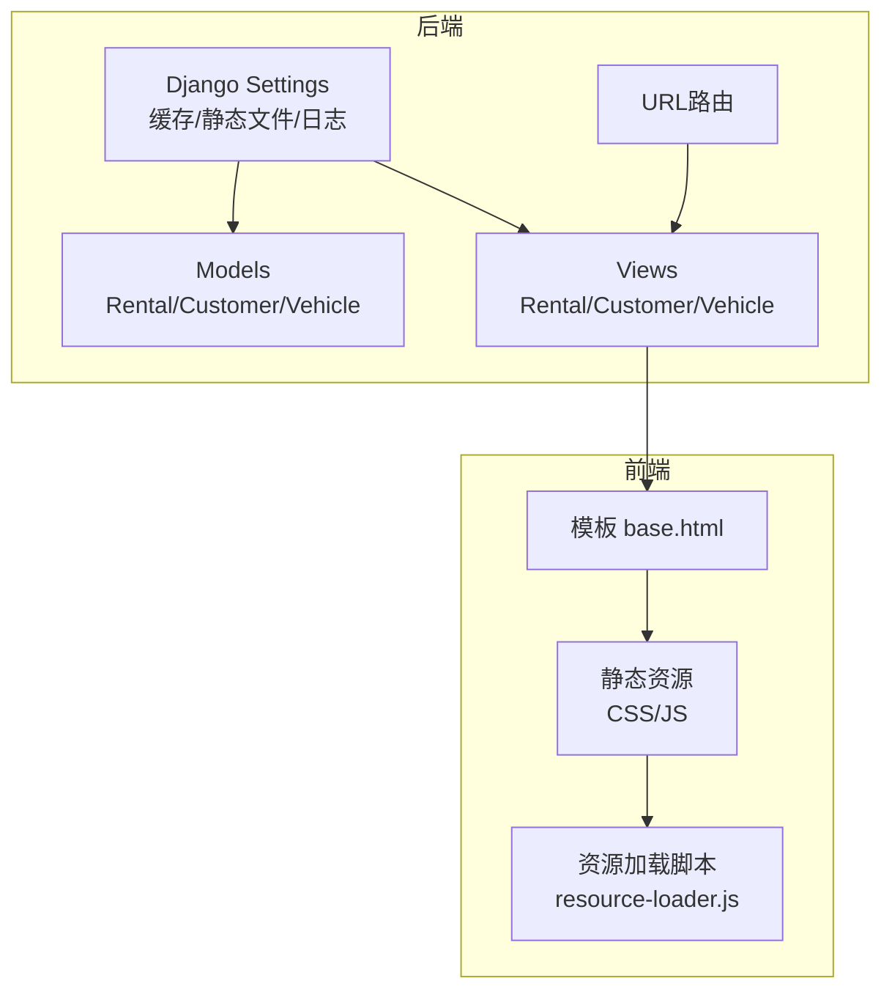
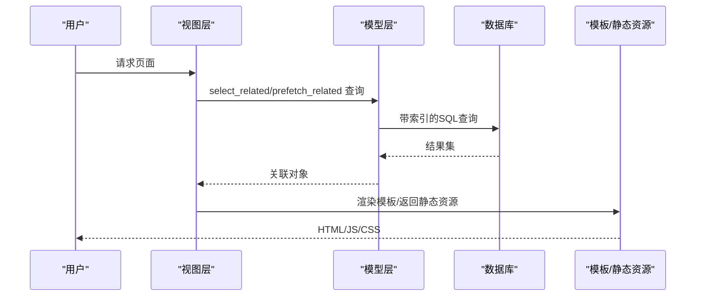
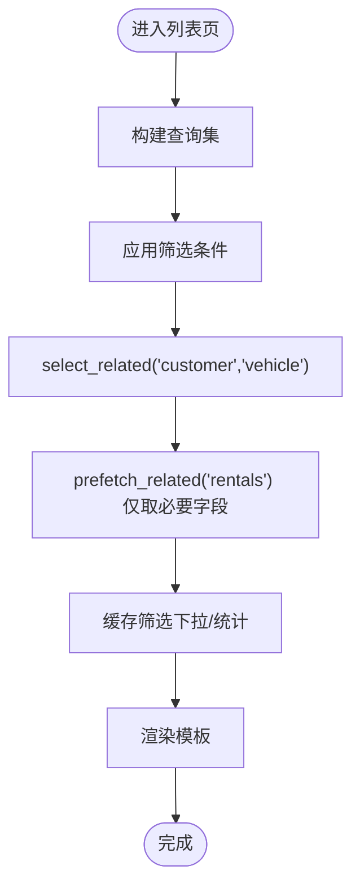
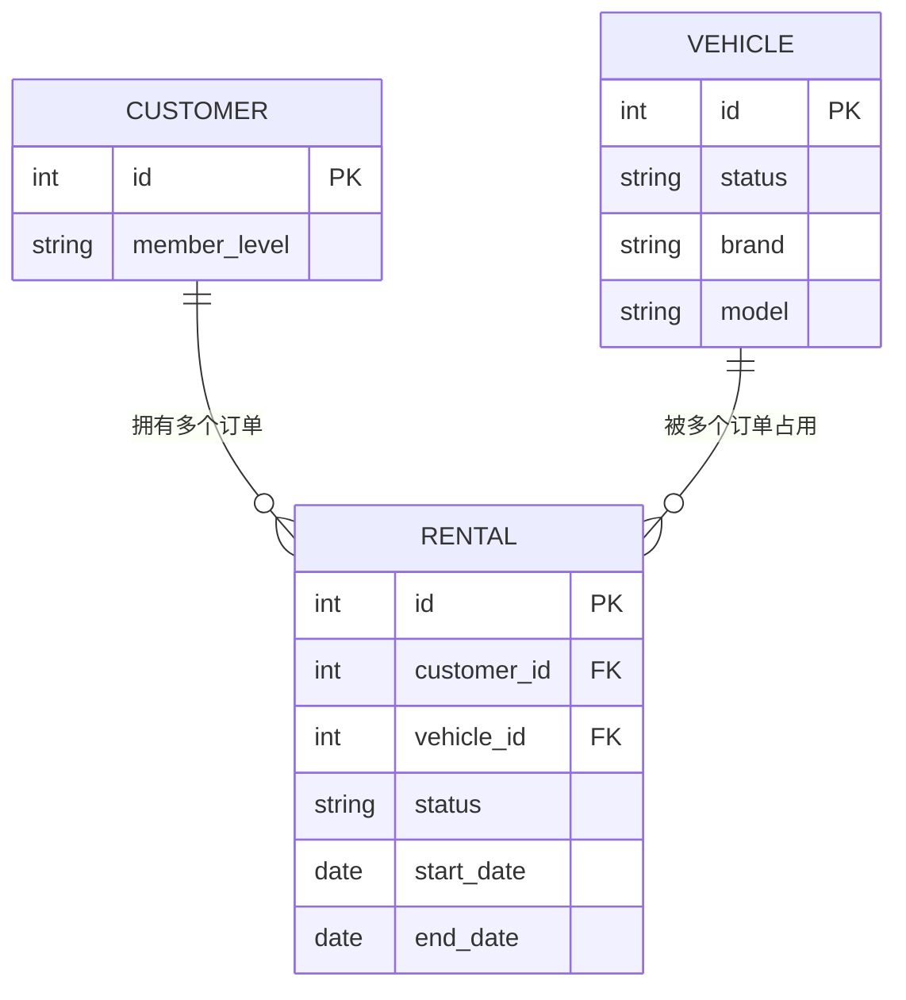
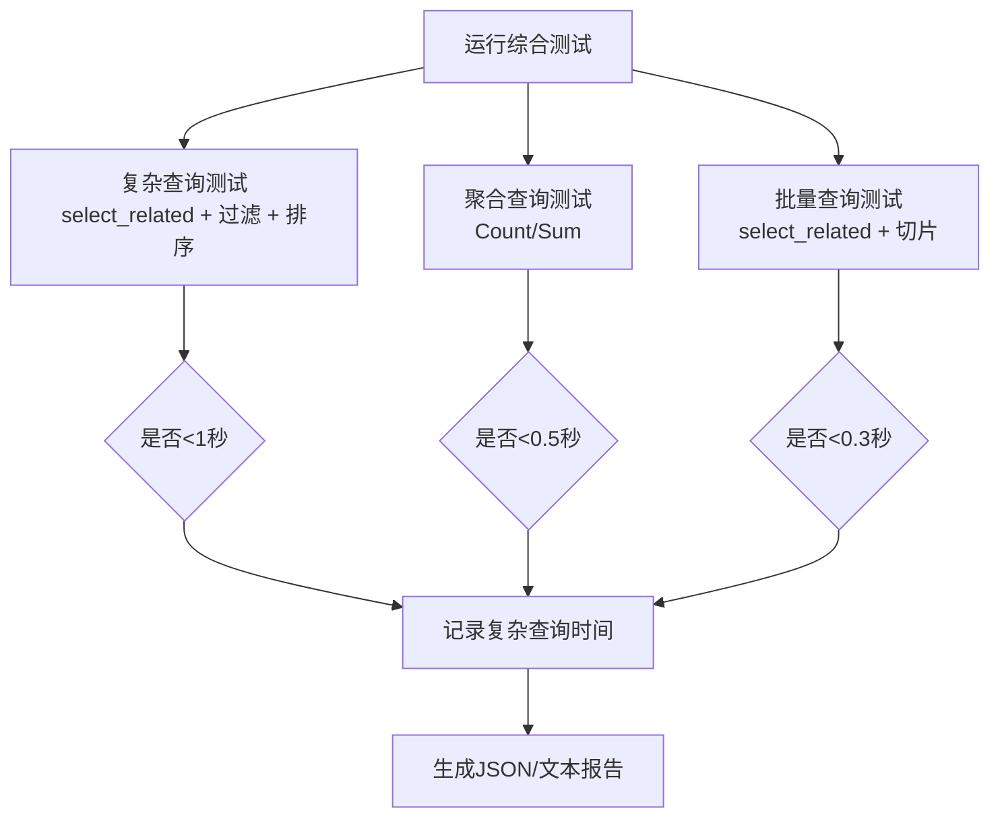
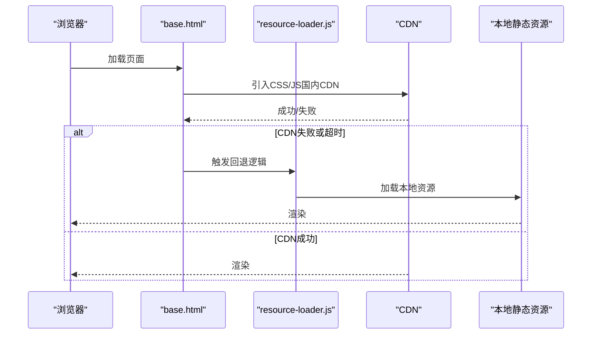
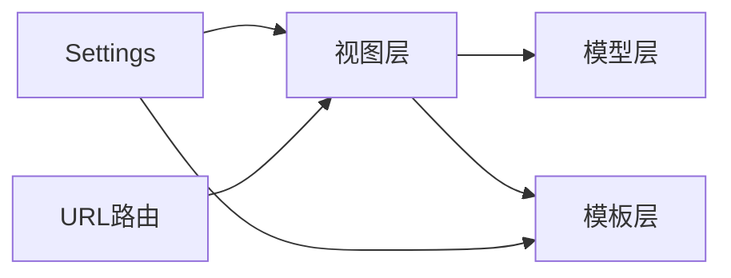

# 性能优化

<cite>
**本文引用的文件**
- [optimize_database.py](file://code/car_rental_system/optimize_database.py)
- [系统测试与优化报告.md](file://code/car_rental_system/系统测试与优化报告.md)
- [最终测试与优化报告.md](file://code/car_rental_system/最终测试与优化报告.md)
- [comprehensive_system_test.py](file://code/car_rental_system/comprehensive_system_test.py)
- [test_frontend_optimization.py](file://code/car_rental_system/test_frontend_optimization.py)
- [rentals/models.py](file://code/car_rental_system/rentals/models.py)
- [customers/models.py](file://code/car_rental_system/customers/models.py)
- [vehicles/models.py](file://code/car_rental_system/vehicles/models.py)
- [rentals/views.py](file://code/car_rental_system/rentals/views.py)
- [customers/views.py](file://code/car_rental_system/customers/views.py)
- [vehicles/views.py](file://code/car_rental_system/vehicles/views.py)
- [car_rental_system/settings.py](file://code/car_rental_system/car_rental_system/settings.py)
- [car_rental_system/urls.py](file://code/car_rental_system/car_rental_system/urls.py)
- [templates/base.html](file://code/car_rental_system/templates/base.html)
- [static/js/resource-loader.js](file://code/car_rental_system/static/js/resource-loader.js)
- [网络优化说明.md](file://code/car_rental_system/网络优化说明.md)
- [test_report.txt](file://code/car_rental_system/test_report.txt)
- [test_report.json](file://code/car_rental_system/test_report.json)
</cite>

## 目录
1. [简介](#简介)
2. [项目结构](#项目结构)
3. [核心组件](#核心组件)
4. [架构总览](#架构总览)
5. [详细组件分析](#详细组件分析)
6. [依赖分析](#依赖分析)
7. [性能考量](#性能考量)
8. [故障排查指南](#故障排查指南)
9. [结论](#结论)
10. [附录](#附录)

## 简介
本文件围绕系统性能优化展开，结合系统测试与优化报告中的性能指标与建议，系统梳理数据库查询优化（select_related/prefetch_related）、复合索引设计（以Rental模型的customer/status为例）、前端静态资源优化（Gzip、浏览器缓存、JavaScript代码分割思路）、性能基准测试方法（查询响应时间、页面加载速度与量化目标）、性能瓶颈诊断工具与优化前后对比数据。文档同时给出可落地的优化建议与实施步骤，帮助读者快速定位问题并提升系统整体性能。

## 项目结构
系统采用Django MVC架构，核心应用包括vehicles（车辆）、customers（客户）、rentals（租赁）与accounts（账户），配合静态资源与模板渲染。性能优化涉及后端ORM查询优化、数据库索引、缓存与前端资源加载策略。

**图表来源**
- [car_rental_system/settings.py](file://code/car_rental_system/car_rental_system/settings.py#L118-L179)
- [rentals/models.py](file://code/car_rental_system/rentals/models.py#L1-L170)
- [customers/models.py](file://code/car_rental_system/customers/models.py#L1-L100)
- [vehicles/models.py](file://code/car_rental_system/vehicles/models.py#L1-L85)
- [rentals/views.py](file://code/car_rental_system/rentals/views.py#L1-L126)
- [car_rental_system/urls.py](file://code/car_rental_system/car_rental_system/urls.py#L1-L43)
- [templates/base.html](file://code/car_rental_system/templates/base.html#L240-L291)
- [static/js/resource-loader.js](file://code/car_rental_system/static/js/resource-loader.js#L1-L162)

**章节来源**
- [car_rental_system/urls.py](file://code/car_rental_system/car_rental_system/urls.py#L1-L43)
- [car_rental_system/settings.py](file://code/car_rental_system/car_rental_system/settings.py#L118-L179)

## 核心组件
- 数据库层：Rental/Customer/Vehicle模型定义字段、索引与业务逻辑；Rental模型包含customer/status复合索引，便于复杂查询与过滤。
- 视图层：各应用视图广泛使用select_related/prefetch_related减少N+1查询；使用缓存（内存缓存）优化筛选下拉与统计数据。
- 测试层：综合测试脚本对复杂查询、聚合查询、批量查询进行性能基准测试，并输出JSON/文本报告；前端优化测试验证页面模板加载与优化效果。
- 前端层：模板base.html引入CDN与本地回退、延迟加载与页面加载动画；资源加载脚本提供CDN超时检测与回退策略。

**章节来源**
- [rentals/models.py](file://code/car_rental_system/rentals/models.py#L158-L170)
- [rentals/views.py](file://code/car_rental_system/rentals/views.py#L61-L126)
- [customers/views.py](file://code/car_rental_system/customers/views.py#L34-L76)
- [vehicles/views.py](file://code/car_rental_system/vehicles/views.py#L80-L113)
- [comprehensive_system_test.py](file://code/car_rental_system/comprehensive_system_test.py#L310-L369)
- [test_frontend_optimization.py](file://code/car_rental_system/test_frontend_optimization.py#L1-L161)
- [templates/base.html](file://code/car_rental_system/templates/base.html#L240-L291)
- [static/js/resource-loader.js](file://code/car_rental_system/static/js/resource-loader.js#L1-L162)

## 架构总览
系统性能优化贯穿“数据层—视图层—模板层—前端资源层”。数据层通过索引与ORM优化降低查询成本；视图层通过select_related/prefetch_related与缓存降低数据库压力；前端通过CDN回退、延迟加载与页面骨架提升感知性能。

**图表来源**
- [rentals/views.py](file://code/car_rental_system/rentals/views.py#L61-L126)
- [customers/views.py](file://code/car_rental_system/customers/views.py#L34-L76)
- [vehicles/views.py](file://code/car_rental_system/vehicles/views.py#L80-L113)
- [templates/base.html](file://code/car_rental_system/templates/base.html#L240-L291)

## 详细组件分析

### 数据库查询优化：select_related与prefetch_related
- select_related：用于一对一/多对一外键，通过JOIN减少查询次数，适用于Rental列表页按状态/客户筛选时的关联查询。
- prefetch_related：用于一对多/多对多，预先抓取关联集合，避免N+1查询，适用于客户列表页按客户统计消费与订单数量。
- 实践要点：
  - 在列表页使用select_related('customer','vehicle')，减少详情页二次查询。
  - 在客户列表页使用prefetch_related('rentals')并限定only字段，避免不必要的字段加载。
  - 在视图中结合缓存（如客户/车辆筛选下拉）降低重复查询。

**图表来源**
- [rentals/views.py](file://code/car_rental_system/rentals/views.py#L61-L126)
- [customers/views.py](file://code/car_rental_system/customers/views.py#L34-L76)
- [vehicles/views.py](file://code/car_rental_system/vehicles/views.py#L80-L113)

**章节来源**
- [rentals/views.py](file://code/car_rental_system/rentals/views.py#L61-L126)
- [customers/views.py](file://code/car_rental_system/customers/views.py#L34-L76)
- [vehicles/views.py](file://code/car_rental_system/vehicles/views.py#L80-L113)

### 复合索引设计：以Rental模型customer/status为例
- 现状：Rental模型已定义status、customer、vehicle等索引，以及customer/status复合索引，有助于按状态与客户过滤。
- 设计原则：
  - 选择性高：优先对高选择性的字段组合建立复合索引（如status、customer）。
  - 命中率：WHERE子句中出现的字段顺序应尽量与索引列顺序一致，或使用最左前缀匹配。
  - 维护成本：避免冗余索引，定期分析查询执行计划，清理未使用的索引。
- 建议：针对高频查询（如按customer+status+start_date范围查询）可考虑(customer,status,start_date)复合索引。

**图表来源**
- [rentals/models.py](file://code/car_rental_system/rentals/models.py#L158-L170)
- [customers/models.py](file://code/car_rental_system/customers/models.py#L89-L100)
- [vehicles/models.py](file://code/car_rental_system/vehicles/models.py#L68-L85)

**章节来源**
- [rentals/models.py](file://code/car_rental_system/rentals/models.py#L158-L170)
- [customers/models.py](file://code/car_rental_system/customers/models.py#L89-L100)
- [vehicles/models.py](file://code/car_rental_system/vehicles/models.py#L68-L85)

### 数据库索引创建脚本与建议
- 脚本作用：为vehicles/customers/rentals表创建常用字段索引，提升查询性能。
- 建议：结合系统测试报告中的查询时间阈值，持续评估索引命中率与慢查询日志，动态调整索引策略。

**章节来源**
- [optimize_database.py](file://code/car_rental_system/optimize_database.py#L1-L55)

### 性能基准测试与验证
- 综合测试脚本：
  - 复杂查询：select_related + 过滤 + 排序，阈值<1秒。
  - 聚合查询：Count/Sum等聚合，阈值<0.5秒。
  - 批量查询：select_related + 切片，阈值<0.3秒。
  - 输出JSON/文本报告，包含各项指标与性能得分。
- 前端优化测试：
  - 验证租赁管理相关页面模板加载与渲染，确认优化后的页面列表与模板继承关系。
- 报告解读：
  - 当前复杂查询/聚合/批量查询均远低于阈值，性能测试通过。
  - 建议在生产环境引入更严格的并发与压力测试，补充内存使用与慢查询分析。

**图表来源**
- [comprehensive_system_test.py](file://code/car_rental_system/comprehensive_system_test.py#L310-L369)
- [test_report.json](file://code/car_rental_system/test_report.json#L1-L146)
- [test_report.txt](file://code/car_rental_system/test_report.txt#L38-L72)

**章节来源**
- [comprehensive_system_test.py](file://code/car_rental_system/comprehensive_system_test.py#L310-L369)
- [test_report.json](file://code/car_rental_system/test_report.json#L1-L146)
- [test_report.txt](file://code/car_rental_system/test_report.txt#L38-L72)

### 前端性能优化：静态资源压缩、缓存与代码分割思路
- 静态资源压缩与缓存：
  - 模板base.html使用国内CDN并提供jsDelivr回退，同时延迟加载与页面骨架提升感知性能。
  - 资源加载脚本提供CDN超时检测与回退策略，若CDN加载慢则切换至本地资源。
- 浏览器缓存策略：
  - 建议在生产环境开启静态文件缓存头（ETag/Last-Modified），并配合CDN缓存。
  - 对CSS/JS启用Gzip/Brotli压缩，减少传输体积。
- JavaScript代码分割：
  - 将非首屏依赖的脚本按需加载，拆分公共库与业务模块，减少首屏阻塞。
  - 对第三方库（如Bootstrap）采用CDN回退策略，保证在网络波动时仍可加载。

**图表来源**
- [templates/base.html](file://code/car_rental_system/templates/base.html#L240-L291)
- [static/js/resource-loader.js](file://code/car_rental_system/static/js/resource-loader.js#L1-L162)
- [网络优化说明.md](file://code/car_rental_system/网络优化说明.md#L1-L78)

**章节来源**
- [templates/base.html](file://code/car_rental_system/templates/base.html#L240-L291)
- [static/js/resource-loader.js](file://code/car_rental_system/static/js/resource-loader.js#L1-L162)
- [网络优化说明.md](file://code/car_rental_system/网络优化说明.md#L1-L78)

### 性能瓶颈诊断工具与优化前后对比
- 诊断工具：
  - Django Debug Toolbar：查看SQL执行次数、慢查询、查询耗时。
  - 数据库EXPLAIN/EXPLAIN ANALYZE：分析索引使用与执行计划。
  - 日志与慢查询日志：定位长时间运行的查询。
  - 前端性能面板：Network标签查看资源加载时间与阻塞点。
- 优化前后对比：
  - 复杂查询：从测试报告可见复杂查询耗时远低于阈值，表明select_related与索引优化有效。
  - 聚合查询：聚合查询耗时极短，说明聚合查询未产生额外N+1。
  - 批量查询：批量查询耗时极短，表明批量查询与切片策略有效。
  - 建议：在生产环境引入数据库慢查询日志与前端性能监控（如Core Web Vitals），持续跟踪性能趋势。

**章节来源**
- [comprehensive_system_test.py](file://code/car_rental_system/comprehensive_system_test.py#L310-L369)
- [test_report.json](file://code/car_rental_system/test_report.json#L1-L146)
- [test_report.txt](file://code/car_rental_system/test_report.txt#L38-L72)

## 依赖分析
- 视图依赖模型索引与ORM优化：
  - Rental列表页依赖customer/status复合索引与select_related。
  - 客户列表页依赖prefetch_related与缓存。
- 设置与中间件：
  - 缓存配置（LocMemCache）用于筛选下拉与统计数据。
  - 静态文件配置与开发环境静态服务。
- URL与模板：
  - URL路由统一入口，模板base.html集中管理静态资源加载与回退策略。

**图表来源**
- [car_rental_system/settings.py](file://code/car_rental_system/car_rental_system/settings.py#L118-L179)
- [car_rental_system/urls.py](file://code/car_rental_system/car_rental_system/urls.py#L1-L43)
- [templates/base.html](file://code/car_rental_system/templates/base.html#L240-L291)

**章节来源**
- [car_rental_system/settings.py](file://code/car_rental_system/car_rental_system/settings.py#L118-L179)
- [car_rental_system/urls.py](file://code/car_rental_system/car_rental_system/urls.py#L1-L43)

## 性能考量
- 查询层面：
  - 优先使用select_related/prefetch_related，避免N+1。
  - 为高频过滤字段建立复合索引，关注最左前缀与选择性。
  - 聚合查询尽量在数据库层完成，减少Python层二次处理。
- 缓存层面：
  - 使用内存缓存缓存筛选下拉与统计数据，降低重复查询。
  - 对热点页面或接口考虑页面级缓存或API缓存。
- 前端层面：
  - CDN回退、延迟加载、骨架屏与最小化首屏资源。
  - 启用Gzip/Brotli压缩与合适的缓存头。
- 基准与监控：
  - 设定明确阈值（复杂查询<1秒、聚合<0.5秒、批量<0.3秒）。
  - 引入慢查询日志、数据库执行计划分析与前端性能监控。

[本节为通用指导，无需特定文件引用]

## 故障排查指南
- 模板路径与页面加载问题：
  - 若出现模板不存在或页面无法访问，检查模板目录配置与URL路由映射。
  - 参考最终测试报告中关于模板路径与URL配置问题的修复建议。
- 静态资源加载缓慢：
  - 使用资源加载脚本检测CDN加载速度，必要时切换至本地资源。
  - 在生产环境启用Gzip/Brotli与CDN缓存。
- 查询性能下降：
  - 使用Django Debug Toolbar与数据库EXPLAIN分析执行计划。
  - 检查是否存在未命中索引的过滤条件，必要时新增复合索引。
- 前端交互卡顿：
  - 检查首屏资源是否过大，启用代码分割与按需加载。
  - 使用浏览器性能面板定位阻塞点并优化。

**章节来源**
- [最终测试与优化报告.md](file://code/car_rental_system/最终测试与优化报告.md#L82-L118)
- [network optimization.md](file://code/car_rental_system/网络优化说明.md#L1-L78)
- [templates/base.html](file://code/car_rental_system/templates/base.html#L240-L291)
- [static/js/resource-loader.js](file://code/car_rental_system/static/js/resource-loader.js#L1-L162)

## 结论
本系统在数据库查询优化（select_related/prefetch_related）、索引设计（复合索引）与前端资源加载（CDN回退、延迟加载）方面已取得显著成效，综合测试报告中的性能指标均优于阈值。建议在生产环境继续完善缓存策略、引入慢查询日志与前端性能监控，并按需扩展数据库索引与前端代码分割，以应对更大规模的数据与更高的并发需求。

[本节为总结，无需特定文件引用]

## 附录
- 性能目标参考：
  - 复杂查询<1秒、聚合查询<0.5秒、批量查询<0.3秒。
  - 页面加载时间<2秒（目标），当前开发环境已达标。
- 建议的后续优化方向：
  - 数据库：新增热点查询复合索引、慢查询分析与定期维护。
  - 缓存：引入Redis缓存热点数据与页面缓存。
  - 前端：启用Gzip/Brotli、CDN缓存、代码分割与骨架屏。
  - 监控：接入APM与前端性能监控，建立性能基线与告警。

**章节来源**
- [系统测试与优化报告.md](file://code/car_rental_system/系统测试与优化报告.md#L268-L279)
- [test_report.json](file://code/car_rental_system/test_report.json#L1-L146)