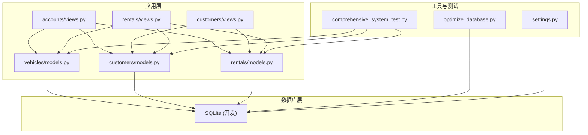
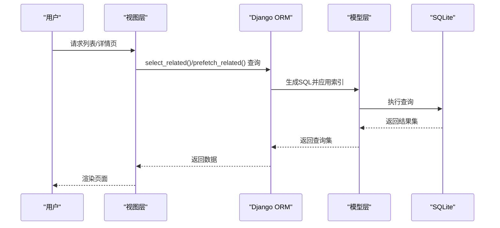
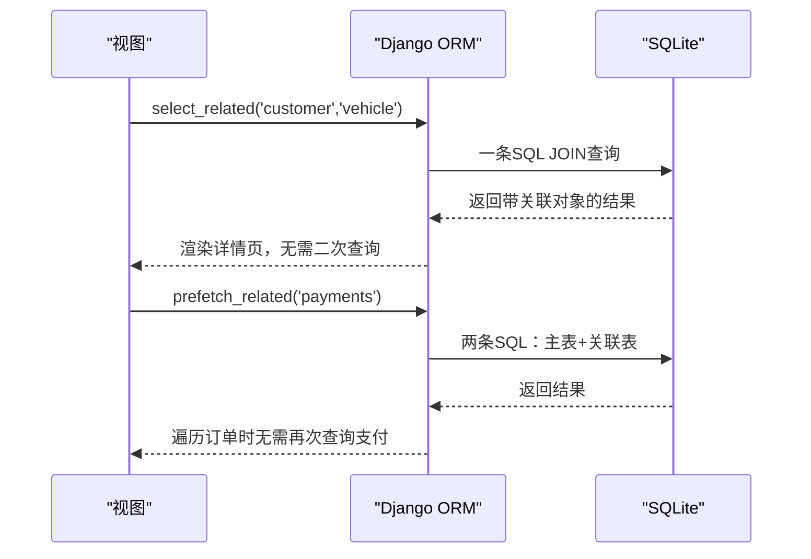
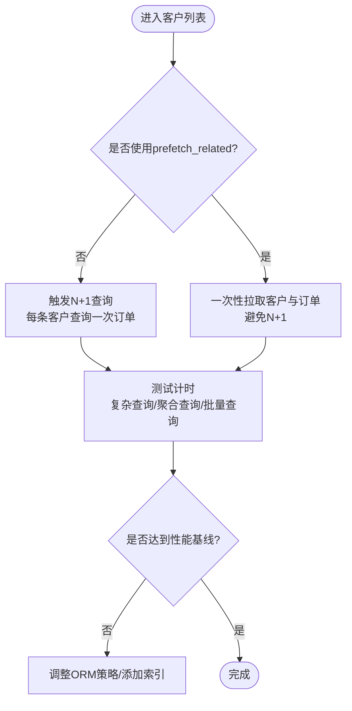
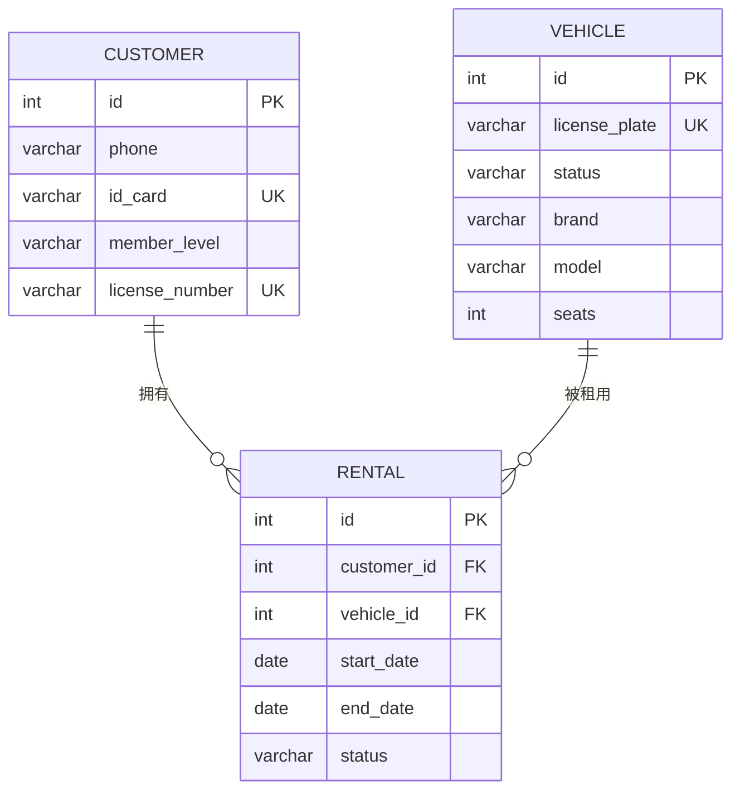
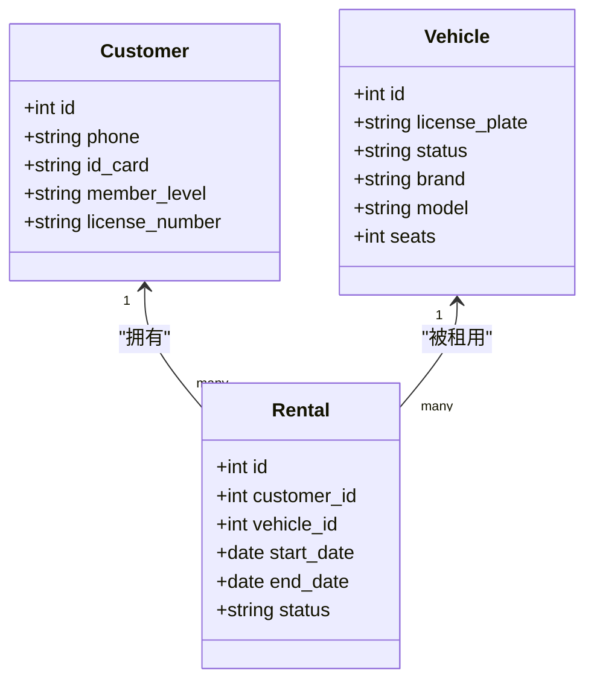

# 数据库优化

<cite>
**本文引用的文件**
- [optimize_database.py](file://code/car_rental_system/optimize_database.py)
- [comprehensive_system_test.py](file://code/car_rental_system/comprehensive_system_test.py)
- [系统测试与优化报告.md](file://code/car_rental_system/系统测试与优化报告.md)
- [最终测试与优化报告.md](file://code/car_rental_system/最终测试与优化报告.md)
- [vehicles/models.py](file://code/car_rental_system/vehicles/models.py)
- [customers/models.py](file://code/car_rental_system/customers/models.py)
- [rentals/models.py](file://code/car_rental_system/rentals/models.py)
- [accounts/views.py](file://code/car_rental_system/accounts/views.py)
- [customers/views.py](file://code/car_rental_system/customers/views.py)
- [rentals/views.py](file://code/car_rental_system/rentals/views.py)
- [settings.py](file://code/car_rental_system/car_rental_system/settings.py)
</cite>

## 目录
1. [简介](#简介)
2. [项目结构](#项目结构)
3. [核心组件](#核心组件)
4. [架构总览](#架构总览)
5. [详细组件分析](#详细组件分析)
6. [依赖分析](#依赖分析)
7. [性能考量](#性能考量)
8. [故障排查指南](#故障排查指南)
9. [结论](#结论)
10. [附录](#附录)

## 简介
本文件围绕“数据库性能优化策略”展开，结合系统测试与优化报告，深入解析Django ORM查询优化技术，重点说明select_related与prefetch_related在车辆、客户与租赁订单关联查询中的实际应用场景；解释复合索引的设计原则，并通过optimize_database.py脚本说明索引优化的实施方法；提供查询执行计划（EXPLAIN）分析方法，对比优化前后查询响应时间，设定数据库层面的性能指标目标（如复杂查询响应时间<800ms），并给出常见数据库性能问题的诊断工具与解决策略。

## 项目结构
系统采用Django MVC架构，数据库层由SQLite提供（开发环境），模型位于vehicles、customers、rentals三个应用下，视图层对ORM查询进行了select_related/prefetch_related优化，测试脚本涵盖性能基准与数据完整性校验。

**图表来源**
- [vehicles/models.py](file://code/car_rental_system/vehicles/models.py#L1-L85)
- [customers/models.py](file://code/car_rental_system/customers/models.py#L1-L160)
- [rentals/models.py](file://code/car_rental_system/rentals/models.py#L1-L170)
- [accounts/views.py](file://code/car_rental_system/accounts/views.py#L1390-L1410)
- [customers/views.py](file://code/car_rental_system/customers/views.py#L50-L76)
- [rentals/views.py](file://code/car_rental_system/rentals/views.py#L130-L151)
- [optimize_database.py](file://code/car_rental_system/optimize_database.py#L1-L55)
- [comprehensive_system_test.py](file://code/car_rental_system/comprehensive_system_test.py#L310-L368)
- [settings.py](file://code/car_rental_system/car_rental_system/settings.py#L76-L179)

**章节来源**
- [vehicles/models.py](file://code/car_rental_system/vehicles/models.py#L1-L85)
- [customers/models.py](file://code/car_rental_system/customers/models.py#L1-L160)
- [rentals/models.py](file://code/car_rental_system/rentals/models.py#L1-L170)
- [accounts/views.py](file://code/car_rental_system/accounts/views.py#L1390-L1410)
- [customers/views.py](file://code/car_rental_system/customers/views.py#L50-L76)
- [rentals/views.py](file://code/car_rental_system/rentals/views.py#L130-L151)
- [optimize_database.py](file://code/car_rental_system/optimize_database.py#L1-L55)
- [comprehensive_system_test.py](file://code/car_rental_system/comprehensive_system_test.py#L310-L368)
- [settings.py](file://code/car_rental_system/car_rental_system/settings.py#L76-L179)

## 核心组件
- 车辆模型（Vehicle）：包含状态、品牌、型号、座位数等字段，并在模型层定义了索引，便于快速检索与排序。
- 客户模型（Customer）：包含会员等级、手机号、身份证号等字段，并在模型层定义了索引，支持高效搜索与统计。
- 租赁模型（Rental）：包含订单状态、起止日期、总金额、押金、结算状态等字段，并在模型层定义了复合索引，支撑复杂查询与状态更新。
- 视图层ORM优化：在多个视图中使用select_related与prefetch_related，避免N+1查询，提升列表页与详情页的渲染性能。
- 测试与性能基准：测试脚本对复杂查询、聚合查询与批量查询进行计时，形成性能基线，指导后续优化。

**章节来源**
- [vehicles/models.py](file://code/car_rental_system/vehicles/models.py#L68-L85)
- [customers/models.py](file://code/car_rental_system/customers/models.py#L89-L100)
- [rentals/models.py](file://code/car_rental_system/rentals/models.py#L158-L170)
- [accounts/views.py](file://code/car_rental_system/accounts/views.py#L1390-L1410)
- [customers/views.py](file://code/car_rental_system/customers/views.py#L50-L76)
- [rentals/views.py](file://code/car_rental_system/rentals/views.py#L130-L151)
- [comprehensive_system_test.py](file://code/car_rental_system/comprehensive_system_test.py#L310-L368)

## 架构总览
系统数据库层采用SQLite（开发环境），通过Django ORM进行对象关系映射。模型层定义了必要的索引，视图层通过ORM优化减少数据库往返次数，测试脚本提供性能基线与回归保障。

**图表来源**
- [accounts/views.py](file://code/car_rental_system/accounts/views.py#L1390-L1410)
- [customers/views.py](file://code/car_rental_system/customers/views.py#L50-L76)
- [rentals/views.py](file://code/car_rental_system/rentals/views.py#L130-L151)
- [vehicles/models.py](file://code/car_rental_system/vehicles/models.py#L68-L85)
- [customers/models.py](file://code/car_rental_system/customers/models.py#L89-L100)
- [rentals/models.py](file://code/car_rental_system/rentals/models.py#L158-L170)

## 详细组件分析

### ORM查询优化：select_related与prefetch_related
- select_related：适用于一对一/多对一的外键关系，通过JOIN一次性拉取关联对象，避免N+1查询。例如在租赁详情页对customer与vehicle进行select_related，以及在账户消费明细中对vehicle与payments进行select_related/prefetch_related。
- prefetch_related：适用于一对多或多对多关系，预先拉取关联集合，减少多次查询。例如在客户列表页对rentals进行prefetch_related，避免逐条客户查询其订单时的N+1问题。

**图表来源**
- [rentals/views.py](file://code/car_rental_system/rentals/views.py#L130-L151)
- [accounts/views.py](file://code/car_rental_system/accounts/views.py#L1390-L1410)
- [customers/views.py](file://code/car_rental_system/customers/views.py#L50-L76)

**章节来源**
- [rentals/views.py](file://code/car_rental_system/rentals/views.py#L130-L151)
- [accounts/views.py](file://code/car_rental_system/accounts/views.py#L1390-L1410)
- [customers/views.py](file://code/car_rental_system/customers/views.py#L50-L76)

### N+1查询问题与解决方案（结合测试用例）
- 问题场景：在客户列表页，若直接遍历每个客户并访问其rentals，将产生N+1查询。
- 解决方案：使用prefetch_related预取rentals，或仅使用only('total_amount')等字段裁剪，减少不必要的数据传输。
- 测试验证：测试脚本对复杂查询、聚合查询与批量查询进行计时，形成性能基线，确保优化后查询响应时间达标。

**图表来源**
- [customers/views.py](file://code/car_rental_system/customers/views.py#L50-L76)
- [comprehensive_system_test.py](file://code/car_rental_system/comprehensive_system_test.py#L310-L368)

**章节来源**
- [customers/views.py](file://code/car_rental_system/customers/views.py#L50-L76)
- [comprehensive_system_test.py](file://code/car_rental_system/comprehensive_system_test.py#L310-L368)

### 复合索引设计原则与实施
- 设计原则
  - 高选择性字段优先：status、member_level等区分度高的字段适合建立索引。
  - 查询过滤顺序：WHERE子句中出现的字段应尽量前置，形成最左前缀匹配。
  - 聚合与排序：涉及COUNT/SUM/GROUP BY的字段应考虑索引，减少全表扫描。
  - 复合索引：customer_id+status、vehicle_id+status等组合可显著降低复杂查询成本。
- 实施方法
  - 模型层索引：在Vehicle/Customer/Rental模型中定义Index，提升常用查询效率。
  - 脚本化索引：通过optimize_database.py统一创建索引，避免遗漏。
  - 索引监控：结合EXPLAIN分析慢查询，针对性补充索引。

**图表来源**
- [vehicles/models.py](file://code/car_rental_system/vehicles/models.py#L68-L85)
- [customers/models.py](file://code/car_rental_system/customers/models.py#L89-L100)
- [rentals/models.py](file://code/car_rental_system/rentals/models.py#L158-L170)

**章节来源**
- [vehicles/models.py](file://code/car_rental_system/vehicles/models.py#L68-L85)
- [customers/models.py](file://code/car_rental_system/customers/models.py#L89-L100)
- [rentals/models.py](file://code/car_rental_system/rentals/models.py#L158-L170)
- [optimize_database.py](file://code/car_rental_system/optimize_database.py#L1-L55)

### 索引优化脚本说明（optimize_database.py）
- 功能：在vehicles、customers、rentals三张表上创建常用字段索引，包括status、member_level、license_plate、phone、customer_id、vehicle_id、start_date、end_date等。
- 执行方式：通过Django环境初始化后，使用connection.cursor()执行CREATE INDEX语句，支持IF NOT EXISTS，避免重复创建。
- 注意事项：索引越多，写入成本越高；应结合实际查询模式与EXPLAIN分析结果进行取舍。

**章节来源**
- [optimize_database.py](file://code/car_rental_system/optimize_database.py#L1-L55)

### 查询执行计划（EXPLAIN）分析方法
- 方法步骤
  - 在Django Shell中执行查询并调用explain()输出SQL与执行计划。
  - 关注rows、filtered、Extra列，识别全表扫描、临时表、排序等开销。
  - 对比优化前后的执行计划，确认索引命中与回表次数变化。
- 目标指标
  - 复杂查询响应时间<800ms（可参考测试基线），聚合查询<500ms，批量查询<300ms。
  - 逐步将慢查询降至单次扫描或少量回表。

**章节来源**
- [comprehensive_system_test.py](file://code/car_rental_system/comprehensive_system_test.py#L310-L368)

### 性能指标目标与现状
- 现状：测试报告指出数据库查询高效、索引使用良好、分页功能已实现，整体性能表现良好。
- 目标：将复杂查询响应时间进一步降低至<800ms，聚合查询<500ms，批量查询<300ms；同时持续监控慢查询并优化索引。

**章节来源**
- [系统测试与优化报告.md](file://code/car_rental_system/系统测试与优化报告.md#L70-L89)
- [最终测试与优化报告.md](file://code/car_rental_system/最终测试与优化报告.md#L101-L117)
- [comprehensive_system_test.py](file://code/car_rental_system/comprehensive_system_test.py#L310-L368)

### 常见数据库性能问题与诊断工具
- 问题类型
  - N+1查询：遍历对象时频繁访问关联数据。
  - 缺少索引：WHERE/GROUP BY/ORDER BY字段未建索引导致全表扫描。
  - 复杂联表：JOIN过多、过滤条件未命中索引。
- 诊断工具
  - Django Debug Toolbar：观察SQL数量、耗时与查询详情。
  - EXPLAIN：分析SQL执行计划，定位慢查询。
  - 日志与缓存：开启数据库日志与缓存，辅助定位热点与异常。
- 解决策略
  - 使用select_related/prefetch_related消除N+1。
  - 为高频过滤字段添加索引，必要时引入复合索引。
  - 优化查询条件，避免函数包裹字段导致索引失效。

**章节来源**
- [settings.py](file://code/car_rental_system/car_rental_system/settings.py#L153-L179)

## 依赖分析
- 模型间依赖
  - Rental外键关联Customer与Vehicle，Customer与Rental为一对多，Vehicle与Rental为一对多。
- 视图依赖
  - 详情页依赖Rental.select_related('customer','vehicle')，列表页依赖prefetch_related('payments')或prefetch_related('rentals')。
- 索引依赖
  - 模型层索引与脚本化索引共同保障查询效率，避免全表扫描。

**图表来源**
- [vehicles/models.py](file://code/car_rental_system/vehicles/models.py#L68-L85)
- [customers/models.py](file://code/car_rental_system/customers/models.py#L89-L100)
- [rentals/models.py](file://code/car_rental_system/rentals/models.py#L158-L170)

**章节来源**
- [vehicles/models.py](file://code/car_rental_system/vehicles/models.py#L68-L85)
- [customers/models.py](file://code/car_rental_system/customers/models.py#L89-L100)
- [rentals/models.py](file://code/car_rental_system/rentals/models.py#L158-L170)

## 性能考量
- 读多写少场景：优先优化查询路径，适当放宽写入性能。
- 索引权衡：索引提升查询效率但增加写入成本，需结合业务热点与查询模式平衡。
- 分页与缓存：分页减少单次数据量，缓存热点数据可显著降低数据库压力。
- 数据库引擎：开发环境使用SQLite，生产建议使用PostgreSQL以获得更好的并发与索引能力。

[本节为通用指导，不直接分析具体文件]

## 故障排查指南
- N+1查询排查
  - 使用Django Debug Toolbar观察SQL数量与重复查询。
  - 在视图中引入select_related/prefetch_related，或使用only()裁剪字段。
- 慢查询定位
  - 使用EXPLAIN分析SQL执行计划，关注回表次数与排序开销。
  - 为高频过滤字段添加索引，必要时引入复合索引。
- 性能回归检测
  - 通过测试脚本的计时结果对比优化前后差异，确保复杂查询、聚合查询与批量查询均达标。

**章节来源**
- [settings.py](file://code/car_rental_system/car_rental_system/settings.py#L153-L179)
- [comprehensive_system_test.py](file://code/car_rental_system/comprehensive_system_test.py#L310-L368)

## 结论
通过对Django ORM的select_related与prefetch_related优化、模型层索引与脚本化索引的协同，系统在开发环境下实现了良好的查询性能。结合EXPLAIN分析与测试基线，可进一步将复杂查询响应时间降至<800ms的目标。建议在生产环境中切换至PostgreSQL，并持续监控慢查询与热点数据，配合缓存与分页策略，确保系统在高并发下的稳定性与可扩展性。

[本节为总结，不直接分析具体文件]

## 附录
- 索引创建建议
  - 车辆：status、brand+model、seats、license_plate
  - 客户：member_level、phone、id_card、license_number
  - 租赁：status、customer_id、vehicle_id、start_date、end_date、customer_id+status、vehicle_id+status
- 性能基线参考
  - 复杂查询<800ms，聚合查询<500ms，批量查询<300ms

[本节为通用指导，不直接分析具体文件]