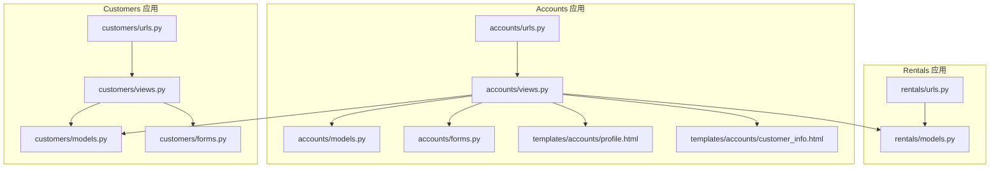
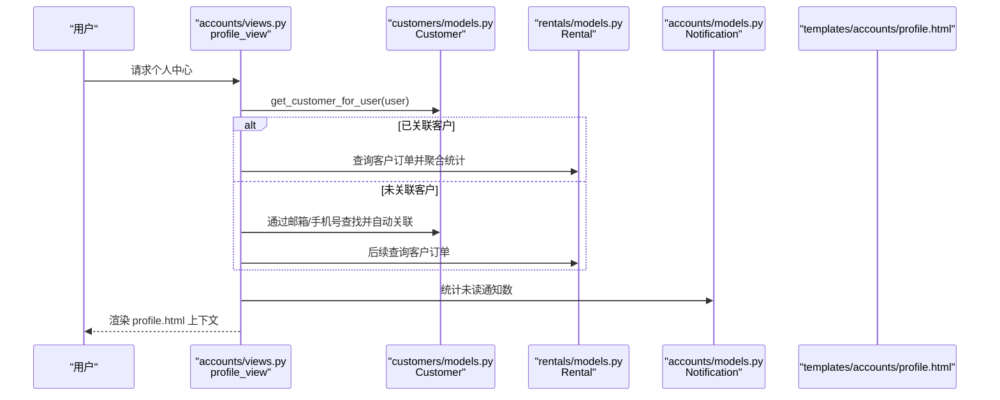
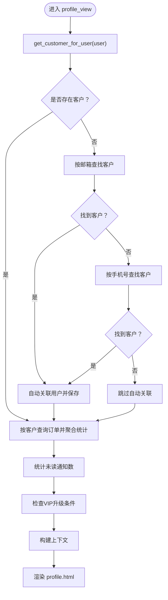
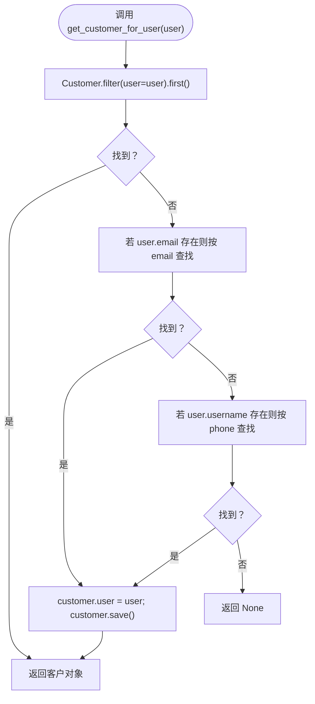
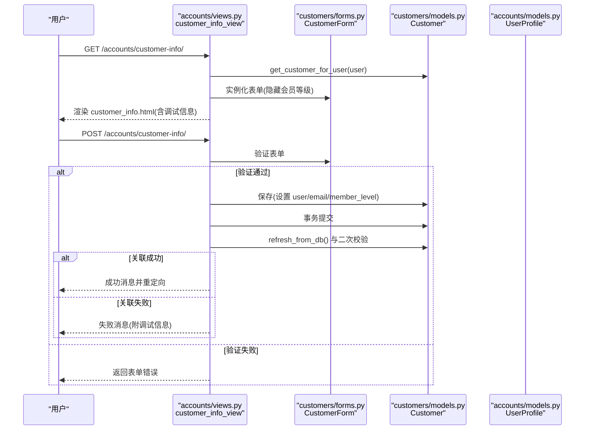
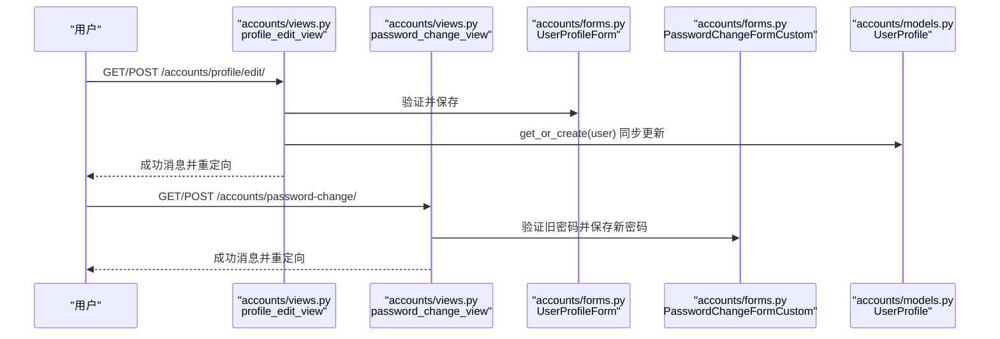
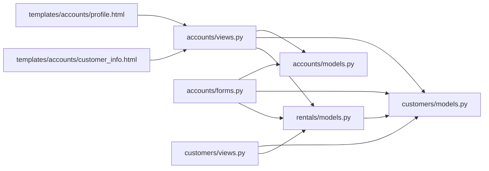

# 个人中心管理

<cite>
**本文引用的文件**
- [views.py](file://code/car_rental_system/accounts/views.py)
- [models.py](file://code/car_rental_system/accounts/models.py)
- [forms.py](file://code/car_rental_system/accounts/forms.py)
- [urls.py](file://code/car_rental_system/accounts/urls.py)
- [views.py](file://code/car_rental_system/customers/views.py)
- [models.py](file://code/car_rental_system/customers/models.py)
- [forms.py](file://code/car_rental_system/customers/forms.py)
- [urls.py](file://code/car_rental_system/customers/urls.py)
- [models.py](file://code/car_rental_system/rentals/models.py)
- [urls.py](file://code/car_rental_system/rentals/urls.py)
- [profile.html](file://code/car_rental_system/templates/accounts/profile.html)
- [customer_info.html](file://code/car_rental_system/templates/accounts/customer_info.html)
</cite>

## 目录
1. [简介](#简介)
2. [项目结构](#项目结构)
3. [核心组件](#核心组件)
4. [架构总览](#架构总览)
5. [详细组件分析](#详细组件分析)
6. [依赖关系分析](#依赖关系分析)
7. [性能考量](#性能考量)
8. [故障排除指南](#故障排除指南)
9. [结论](#结论)

## 简介
本文件围绕“个人中心”功能进行全面技术文档化，重点覆盖以下方面：
- profile_view 视图的数据聚合与上下文构建流程，包括用户信息、客户信息、租赁统计与通知状态的整合方式
- customer_info_view 中客户信息的创建、关联与保存流程，特别解析 get_customer_for_user 辅助函数的作用
- 个人资料编辑、密码修改等常用功能的实现细节
- 用户数据流的完整图示：从数据库查询到模板渲染的全过程
- 针对客户信息关联失败等常见问题的故障排除步骤与最佳实践建议

## 项目结构
个人中心相关的核心模块分布在 accounts、customers、rentals 三个子应用中，并通过统一的 URL 命名空间进行路由组织。模板位于 templates/accounts 下，负责最终的页面渲染。

图表来源
- [urls.py](file://code/car_rental_system/accounts/urls.py#L1-L50)
- [views.py](file://code/car_rental_system/accounts/views.py#L143-L516)
- [models.py](file://code/car_rental_system/accounts/models.py#L1-L318)
- [forms.py](file://code/car_rental_system/accounts/forms.py#L1-L334)
- [urls.py](file://code/car_rental_system/customers/urls.py#L1-L19)
- [views.py](file://code/car_rental_system/customers/views.py#L1-L262)
- [models.py](file://code/car_rental_system/customers/models.py#L1-L160)
- [forms.py](file://code/car_rental_system/customers/forms.py#L1-L158)
- [urls.py](file://code/car_rental_system/rentals/urls.py#L1-L22)
- [models.py](file://code/car_rental_system/rentals/models.py#L1-L401)
- [profile.html](file://code/car_rental_system/templates/accounts/profile.html#L1-L275)
- [customer_info.html](file://code/car_rental_system/templates/accounts/customer_info.html#L1-L230)

章节来源
- [urls.py](file://code/car_rental_system/accounts/urls.py#L1-L50)
- [views.py](file://code/car_rental_system/accounts/views.py#L143-L516)
- [models.py](file://code/car_rental_system/accounts/models.py#L1-L318)
- [forms.py](file://code/car_rental_system/accounts/forms.py#L1-L334)
- [urls.py](file://code/car_rental_system/customers/urls.py#L1-L19)
- [views.py](file://code/car_rental_system/customers/views.py#L1-L262)
- [models.py](file://code/car_rental_system/customers/models.py#L1-L160)
- [forms.py](file://code/car_rental_system/customers/forms.py#L1-L158)
- [urls.py](file://code/car_rental_system/rentals/urls.py#L1-L22)
- [models.py](file://code/car_rental_system/rentals/models.py#L1-L401)
- [profile.html](file://code/car_rental_system/templates/accounts/profile.html#L1-L275)
- [customer_info.html](file://code/car_rental_system/templates/accounts/customer_info.html#L1-L230)

## 核心组件
- 个人中心视图 profile_view：聚合用户信息、客户信息、订单统计、未读通知数与 VIP 升级信息，构建上下文并渲染 profile.html
- 客户信息视图 customer_info_view：统一获取/创建客户信息，表单校验与保存，事务控制与调试输出
- get_customer_for_user 辅助函数：跨多种线索（用户关联、邮箱、手机号）查找客户并自动关联用户
- 个人资料编辑 profile_edit_view：UserProfile 表单与用户基础信息同步更新
- 密码修改 password_change_view：基于 Django 内置表单的安全密码变更流程
- 通知模型 Notification：支持按用户分组、类型过滤与标记已读
- 客户模型 Customer：与 User 的一对一关联、会员等级、诚信度升级逻辑
- 租赁模型 Rental：订单统计、金额计算、结算状态与财务刷新

章节来源
- [views.py](file://code/car_rental_system/accounts/views.py#L143-L516)
- [models.py](file://code/car_rental_system/accounts/models.py#L253-L318)
- [models.py](file://code/car_rental_system/customers/models.py#L1-L160)
- [models.py](file://code/car_rental_system/rentals/models.py#L1-L401)
- [profile.html](file://code/car_rental_system/templates/accounts/profile.html#L1-L275)
- [customer_info.html](file://code/car_rental_system/templates/accounts/customer_info.html#L1-L230)

## 架构总览
个人中心的数据流遵循“视图层 -> 模型层 -> 模板层”的经典 MVC 模式。视图负责业务编排与上下文组装；模型层封装数据与业务规则；模板层负责最终展示。

图表来源
- [views.py](file://code/car_rental_system/accounts/views.py#L143-L196)
- [views.py](file://code/car_rental_system/accounts/views.py#L198-L223)
- [models.py](file://code/car_rental_system/customers/models.py#L1-L160)
- [models.py](file://code/car_rental_system/rentals/models.py#L1-L401)
- [models.py](file://code/car_rental_system/accounts/models.py#L253-L318)
- [profile.html](file://code/car_rental_system/templates/accounts/profile.html#L1-L275)

## 详细组件分析

### profile_view：数据聚合与上下文构建
- 用户信息：直接使用 request.user
- 客户信息：通过 get_customer_for_user(user) 获取，若未关联则按邮箱/手机号回溯并自动补关联
- 订单数据：按客户过滤，select_related 避免 N+1，取最近 10 条
- 统计信息：使用聚合查询 Count/Sum，避免循环遍历
- 通知状态：统计未读通知数
- VIP 升级信息：调用 Customer.check_vip_upgrade_eligibility 返回连续诚信订单数与剩余需求

图表来源
- [views.py](file://code/car_rental_system/accounts/views.py#L143-L196)
- [views.py](file://code/car_rental_system/accounts/views.py#L198-L223)
- [models.py](file://code/car_rental_system/customers/models.py#L101-L146)
- [profile.html](file://code/car_rental_system/templates/accounts/profile.html#L1-L275)

章节来源
- [views.py](file://code/car_rental_system/accounts/views.py#L143-L196)
- [views.py](file://code/car_rental_system/accounts/views.py#L198-L223)
- [models.py](file://code/car_rental_system/customers/models.py#L101-L146)
- [profile.html](file://code/car_rental_system/templates/accounts/profile.html#L1-L275)

### get_customer_for_user：客户信息统一获取与自动关联
- 优先通过 Customer.user=user 查找
- 若未找到，尝试 Customer.email=user.email
- 再尝试 Customer.phone=user.username（兼容手机号作为用户名）
- 若找到但未关联用户，自动 customer.user = user 并保存，保证后续流程一致性

图表来源
- [views.py](file://code/car_rental_system/accounts/views.py#L198-L223)

章节来源
- [views.py](file://code/car_rental_system/accounts/views.py#L198-L223)

### customer_info_view：客户信息创建、关联与保存
- 获取或创建客户：get_customer_for_user(user)
- 表单处理：隐藏会员等级字段，防止用户篡改；提交时确保 customer.user = user
- 事务控制：使用事务包裹保存，失败时打印堆栈并提示调试信息
- 保存校验：保存后再次查询 customer.user 是否正确绑定，否则提示失败并附带调试信息
- 预填充：若用户邮箱存在，预填到表单 email 字段

图表来源
- [views.py](file://code/car_rental_system/accounts/views.py#L390-L471)
- [forms.py](file://code/car_rental_system/customers/forms.py#L1-L158)
- [models.py](file://code/car_rental_system/customers/models.py#L1-L160)
- [models.py](file://code/car_rental_system/accounts/models.py#L1-L47)
- [customer_info.html](file://code/car_rental_system/templates/accounts/customer_info.html#L1-L230)

章节来源
- [views.py](file://code/car_rental_system/accounts/views.py#L390-L471)
- [forms.py](file://code/car_rental_system/customers/forms.py#L1-L158)
- [models.py](file://code/car_rental_system/customers/models.py#L1-L160)
- [models.py](file://code/car_rental_system/accounts/models.py#L1-L47)
- [customer_info.html](file://code/car_rental_system/templates/accounts/customer_info.html#L1-L230)

### 个人资料编辑与密码修改
- 个人资料编辑：UserProfileForm 支持更新用户 first_name/last_name/email 与头像；保存时同步更新 User
- 密码修改：PasswordChangeFormCustom 校验旧密码并设置新密码，更新会话哈希以保持登录态

图表来源
- [views.py](file://code/car_rental_system/accounts/views.py#L473-L517)
- [forms.py](file://code/car_rental_system/accounts/forms.py#L139-L248)
- [models.py](file://code/car_rental_system/accounts/models.py#L1-L47)

章节来源
- [views.py](file://code/car_rental_system/accounts/views.py#L473-L517)
- [forms.py](file://code/car_rental_system/accounts/forms.py#L139-L248)
- [models.py](file://code/car_rental_system/accounts/models.py#L1-L47)

### 数据聚合与统计：订单与收入
- 订单统计：聚合 total/active/completed/cancelled 数量
- 收入统计：按完成状态聚合总金额，并按今日/当月细分
- 最近订单：select_related 预取 customer/vehicle，避免 N+1
- 车辆状态概览：限制查询数量，避免性能问题

章节来源
- [views.py](file://code/car_rental_system/views.py#L21-L116)

## 依赖关系分析
- accounts/views 依赖 accounts/models、customers/models、rentals/models、vehicles/models
- accounts/forms 依赖 accounts/models、vehicles/models、rentals/models
- templates/accounts/profile.html 依赖 accounts/views 的上下文变量
- customers/views 依赖 customers/models、rentals/models
- rentals/models 依赖 customers/models、vehicles/models

图表来源
- [views.py](file://code/car_rental_system/accounts/views.py#L1-L223)
- [models.py](file://code/car_rental_system/accounts/models.py#L1-L318)
- [models.py](file://code/car_rental_system/customers/models.py#L1-L160)
- [models.py](file://code/car_rental_system/rentals/models.py#L1-L401)
- [forms.py](file://code/car_rental_system/accounts/forms.py#L1-L334)
- [views.py](file://code/car_rental_system/customers/views.py#L1-L262)
- [profile.html](file://code/car_rental_system/templates/accounts/profile.html#L1-L275)
- [customer_info.html](file://code/car_rental_system/templates/accounts/customer_info.html#L1-L230)

章节来源
- [views.py](file://code/car_rental_system/accounts/views.py#L1-L223)
- [models.py](file://code/car_rental_system/accounts/models.py#L1-L318)
- [models.py](file://code/car_rental_system/customers/models.py#L1-L160)
- [models.py](file://code/car_rental_system/rentals/models.py#L1-L401)
- [forms.py](file://code/car_rental_system/accounts/forms.py#L1-L334)
- [views.py](file://code/car_rental_system/customers/views.py#L1-L262)
- [profile.html](file://code/car_rental_system/templates/accounts/profile.html#L1-L275)
- [customer_info.html](file://code/car_rental_system/templates/accounts/customer_info.html#L1-L230)

## 性能考量
- 避免 N+1 查询：在 profile_view 中使用 select_related('customer', 'vehicle') 预取外键关联
- 聚合查询：使用 aggregate(Count/Sum) 替代循环遍历，降低数据库往返
- 分页与限制：最近订单与车辆状态概览限制查询数量，提升响应速度
- 缓存：推荐在 get_recommended_vehicles 中复用缓存键，减少热门车辆统计开销
- 事务边界：customer_info_view 使用事务包裹保存，保证一致性与原子性

章节来源
- [views.py](file://code/car_rental_system/accounts/views.py#L143-L196)
- [views.py](file://code/car_rental_system/accounts/views.py#L390-L471)

## 故障排除指南
- 客户信息关联失败
  - 现象：保存后提示“客户信息保存失败”，并附带调试信息
  - 排查要点：
    - 检查 get_customer_for_user 是否成功通过邮箱/手机号回溯到客户
    - 确认保存后 customer.user 是否等于当前用户
    - 查看事务是否抛出异常并打印堆栈
  - 处置建议：
    - 在 customer_info_view 的调试信息中核对 user_id、customer_id、customer_user 等字段
    - 如存在唯一性冲突（手机号/身份证/驾照号），修正表单数据后重试
    - 确保用户邮箱与手机号字段有效，避免因清洗失败导致预填失败

- 个人中心无订单或统计为 0
  - 现象：个人中心“我的订单”为空，“累计消费”为 0
  - 排查要点：
    - 确认 get_customer_for_user 是否成功关联到客户
    - 检查客户是否确实存在订单且状态满足聚合条件
  - 处置建议：
    - 在 profile_view 的上下文中增加日志输出 customer_id 与订单数量
    - 使用 select_related 验证外键是否正确加载

- VIP 升级进度不更新
  - 现象：VIP 升级进度卡住或不变化
  - 排查要点：
    - 检查 Customer.check_vip_upgrade_eligibility 的逻辑是否被正确触发
    - 确认已完成订单的实际还车时间与异地还车一致性
  - 处置建议：
    - 在订单完成后刷新财务信息，确保 overdue_fee 与 cross-location 一致性
    - 适当增加日志输出，定位中断计数的位置

- 通知未读数异常
  - 现象：未读通知数与预期不符
  - 排查要点：
    - 检查 Notification.is_read 字段是否被正确更新
    - 确认用户权限与通知类型过滤逻辑
  - 处置建议：
    - 在模板中增加通知列表与计数的调试输出，便于定位问题

章节来源
- [views.py](file://code/car_rental_system/accounts/views.py#L390-L471)
- [views.py](file://code/car_rental_system/accounts/views.py#L143-L196)
- [models.py](file://code/car_rental_system/customers/models.py#L101-L146)
- [models.py](file://code/car_rental_system/accounts/models.py#L253-L318)

## 结论
个人中心通过 profile_view 将用户、客户、订单与通知等多源数据进行统一聚合与上下文构建，配合 get_customer_for_user 的智能关联机制，实现了较为完善的用户体验。customer_info_view 在保障数据一致性的同时提供了详尽的调试信息，有助于快速定位问题。建议在高并发场景下进一步引入缓存与异步任务，持续优化性能与稳定性。