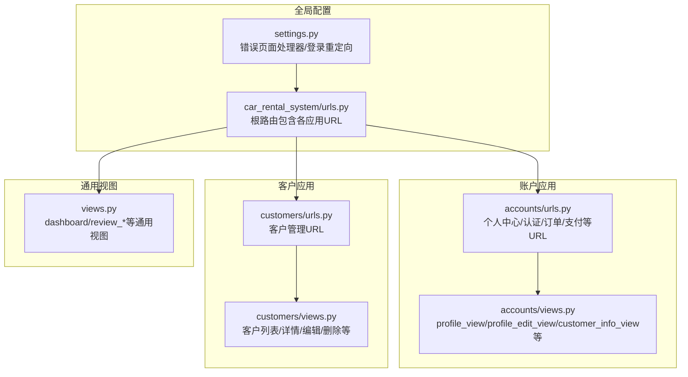
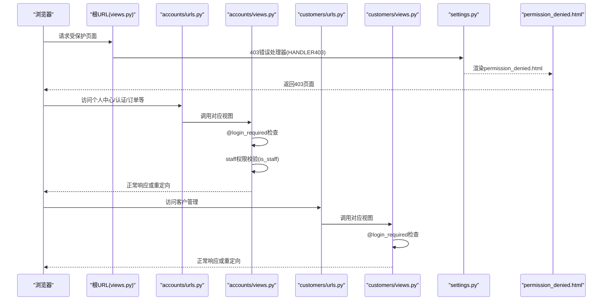
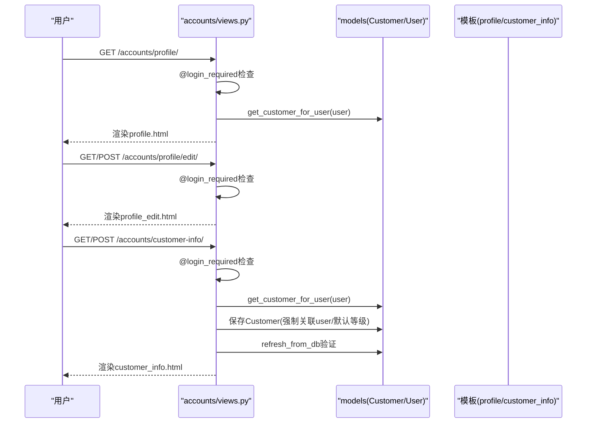
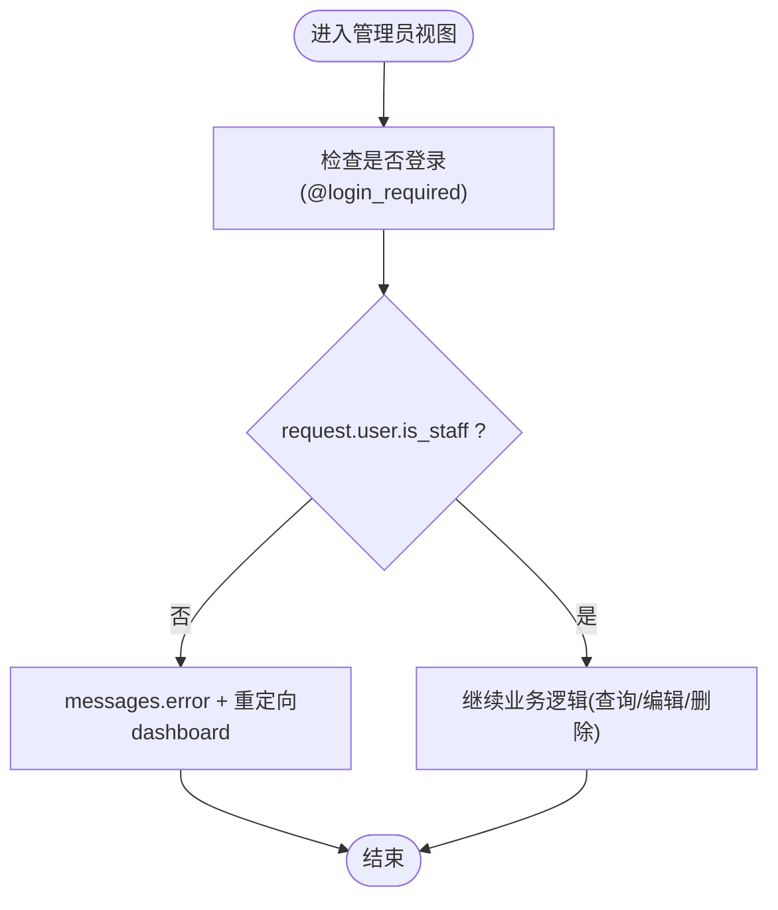
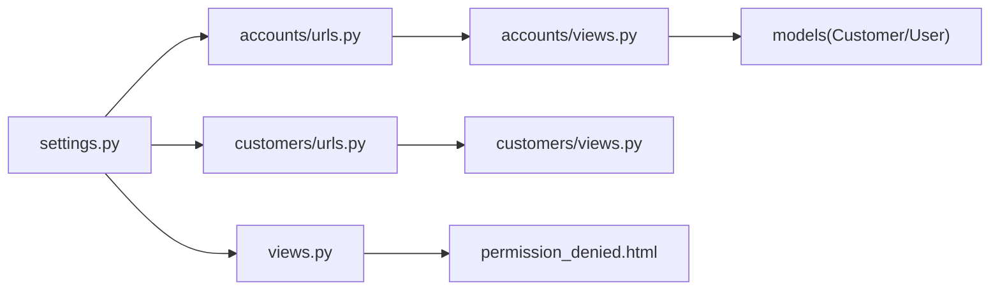

# 权限控制机制

<cite>
**本文引用的文件**
- [views.py](file://code/car_rental_system/views.py)
- [accounts/views.py](file://code/car_rental_system/accounts/views.py)
- [accounts/urls.py](file://code/car_rental_system/accounts/urls.py)
- [customers/views.py](file://code/car_rental_system/customers/views.py)
- [customers/urls.py](file://code/car_rental_system/customers/urls.py)
- [car_rental_system/urls.py](file://code/car_rental_system/car_rental_system/urls.py)
- [car_rental_system/settings.py](file://code/car_rental_system/car_rental_system/settings.py)
- [permission_denied.html](file://code/car_rental_system/templates/permission_denied.html)
</cite>

## 目录
1. [引言](#引言)
2. [项目结构](#项目结构)
3. [核心组件](#核心组件)
4. [架构总览](#架构总览)
5. [详细组件分析](#详细组件分析)
6. [依赖分析](#依赖分析)
7. [性能考虑](#性能考虑)
8. [故障排查指南](#故障排查指南)
9. [结论](#结论)

## 引言
本文件聚焦系统权限控制设计，围绕以下目标展开：
- 深入解析 @login_required 装饰器在 profile_view、profile_edit_view、customer_info_view 等视图中的应用与行为
- 解释基于用户角色的访问控制（RBAC）实现，特别是 staff 用户与普通用户的权限差异
- 分析敏感操作的权限验证逻辑，如 customer_info_view 中对用户数据关联的保护机制
- 说明 URL 路由与视图函数的权限对应关系
- 解释 permission_denied.html 页面的触发条件与处理流程
- 提供实际代码示例路径展示权限检查的执行过程，并给出调试方法与解决方案

## 项目结构
系统采用多应用分层组织，权限控制主要分布在 accounts、customers、rentals、vehicles 等应用的视图层，同时在全局 settings 中集中配置错误页面处理器与登录重定向策略。

图表来源
- [car_rental_system/settings.py](file://code/car_rental_system/car_rental_system/settings.py#L127-L135)
- [car_rental_system/urls.py](file://code/car_rental_system/car_rental_system/urls.py#L27-L38)
- [accounts/urls.py](file://code/car_rental_system/accounts/urls.py#L1-L50)
- [customers/urls.py](file://code/car_rental_system/customers/urls.py#L1-L19)
- [views.py](file://code/car_rental_system/views.py#L1-L227)

章节来源
- [car_rental_system/settings.py](file://code/car_rental_system/car_rental_system/settings.py#L127-L135)
- [car_rental_system/urls.py](file://code/car_rental_system/car_rental_system/urls.py#L27-L38)
- [accounts/urls.py](file://code/car_rental_system/accounts/urls.py#L1-L50)
- [customers/urls.py](file://code/car_rental_system/customers/urls.py#L1-L19)

## 核心组件
- 登录装饰器与全局错误处理
  - 全局设置中通过 HANDLER403 指向 views.permission_denied，统一处理 403 权限不足
  - LOGIN_URL、LOGIN_REDIRECT_URL、LOGOUT_REDIRECT_URL 统一登录与重定向策略
- 角色权限判定
  - 通过 request.user.is_staff 判断管理员权限
  - 在通用视图中定义 _require_staff 辅助函数
- 视图级权限控制
  - @login_required 装饰器保证未登录用户被重定向至登录页
  - 针对敏感操作在视图内部显式校验 is_staff 并返回 dashboard 或错误提示

章节来源
- [car_rental_system/settings.py](file://code/car_rental_system/car_rental_system/settings.py#L127-L135)
- [views.py](file://code/car_rental_system/views.py#L118-L120)
- [views.py](file://code/car_rental_system/views.py#L122-L200)

## 架构总览
下图展示了权限控制在 URL 路由、视图函数与模板之间的交互关系。

图表来源
- [car_rental_system/settings.py](file://code/car_rental_system/car_rental_system/settings.py#L127-L135)
- [car_rental_system/urls.py](file://code/car_rental_system/car_rental_system/urls.py#L27-L38)
- [accounts/urls.py](file://code/car_rental_system/accounts/urls.py#L1-L50)
- [customers/urls.py](file://code/car_rental_system/customers/urls.py#L1-L19)
- [views.py](file://code/car_rental_system/views.py#L223-L227)
- [permission_denied.html](file://code/car_rental_system/templates/permission_denied.html#L1-L29)

## 详细组件分析

### 1) @login_required 在 profile_view、profile_edit_view、customer_info_view 中的应用
- profile_view
  - 作用：展示当前用户的个人中心信息，包括客户信息、订单统计、未读通知等
  - 权限要点：使用 @login_required 保证只有登录用户可访问；内部未做额外 is_staff 校验，体现“普通用户可见”
  - 关联数据：通过 get_customer_for_user(user) 获取客户信息，避免 N+1 查询
- profile_edit_view
  - 作用：编辑用户个人资料（头像、电话等）
  - 权限要点：使用 @login_required；内部未做 is_staff 校验，普通用户可编辑自身资料
- customer_info_view
  - 作用：用户填写/编辑客户信息，隐藏会员等级字段，防止用户篡改
  - 权限要点：使用 @login_required；内部未做 is_staff 校验；保存时强制 customer.user = user 并默认 NORMAL 等保护措施
  - 数据关联保护：保存后通过 refresh_from_db 与断言性检查（debug_info）验证关联是否成功

图表来源
- [accounts/views.py](file://code/car_rental_system/accounts/views.py#L145-L195)
- [accounts/views.py](file://code/car_rental_system/accounts/views.py#L390-L470)
- [accounts/views.py](file://code/car_rental_system/accounts/views.py#L473-L496)

章节来源
- [accounts/views.py](file://code/car_rental_system/accounts/views.py#L145-L195)
- [accounts/views.py](file://code/car_rental_system/accounts/views.py#L390-L470)
- [accounts/views.py](file://code/car_rental_system/accounts/views.py#L473-L496)

### 2) 基于用户角色的访问控制（RBAC）实现
- 角色标识
  - is_staff 字段作为管理员角色标识
- 通用管理员视图
  - review_list_view/review_edit_view/review_delete_view
  - 内部通过 if not request.user.is_staff 进行权限校验，非管理员则重定向至 dashboard 并提示无权限
- 辅助函数
  - _require_staff(user) 返回 user.is_authenticated and user.is_staff，可用于更灵活的权限判定场景

图表来源
- [views.py](file://code/car_rental_system/views.py#L122-L200)
- [views.py](file://code/car_rental_system/views.py#L118-L120)

章节来源
- [views.py](file://code/car_rental_system/views.py#L118-L120)
- [views.py](file://code/car_rental_system/views.py#L122-L200)

### 3) 敏感操作的权限验证逻辑：customer_info_view 的数据关联保护
- 关键保护点
  - 隐藏会员等级字段，防止用户直接修改
  - 保存前 customer.user = user，确保数据与当前用户绑定
  - 默认新客户等级为 NORMAL，避免越权提升
  - 保存后 refresh_from_db 并输出 debug_info，便于定位关联失败问题
- 适用场景
  - 任何需要“用户只能编辑自己的客户信息”的场景，均应遵循上述保护逻辑

章节来源
- [accounts/views.py](file://code/car_rental_system/accounts/views.py#L390-L470)

### 4) URL 路由与视图函数的权限对应关系
- 根路由
  - /reviews/* 与 /dashboard 等由 views.py 提供，其中 review_* 需管理员权限
- 账户应用
  - /accounts/profile、/accounts/profile/edit、/accounts/customer-info 等由 accounts/urls.py 映射到 accounts/views.py
  - 这些视图均使用 @login_required，普通用户可访问
- 客户应用
  - /customers/* 由 customers/urls.py 映射到 customers/views.py
  - 该应用视图同样使用 @login_required，普通用户可访问

章节来源
- [car_rental_system/urls.py](file://code/car_rental_system/car_rental_system/urls.py#L27-L38)
- [accounts/urls.py](file://code/car_rental_system/accounts/urls.py#L1-L50)
- [customers/urls.py](file://code/car_rental_system/customers/urls.py#L1-L19)

### 5) permission_denied.html 页面的触发条件与处理流程
- 触发条件
  - 当未登录用户访问受保护页面时，Django AuthenticationMiddleware 会拦截并重定向至 LOGIN_URL
  - 若已登录但无权限访问（例如非管理员访问 review_*），系统会重定向至 dashboard 并提示
  - 若出现 403 错误（如自定义权限拒绝），由 settings.HANDLER403 指向 views.permission_denied
- 处理流程
  - settings.py 设置 HANDLER403 = 'views.permission_denied'
  - views.permission_denied 返回 HttpResponseForbidden，并渲染 permission_denied.html
  - 模板提供返回主页与管理后台的入口

章节来源
- [car_rental_system/settings.py](file://code/car_rental_system/car_rental_system/settings.py#L127-L135)
- [views.py](file://code/car_rental_system/views.py#L223-L227)
- [permission_denied.html](file://code/car_rental_system/templates/permission_denied.html#L1-L29)

## 依赖分析
- 组件耦合
  - accounts/views 与 models.Customer/User 存在强耦合（get_customer_for_user、customer_info_view）
  - 通用视图 views 提供管理员权限校验与错误页面处理，形成跨应用的权限控制中枢
- 外部依赖
  - settings.py 中的 LOGIN_URL、HANDLER403、LOGIN_REDIRECT_URL 等全局配置影响所有视图的权限行为
- 潜在风险
  - 若某视图遗漏 @login_required 或 is_staff 校验，可能导致越权访问
  - 客户信息保存链路需严格遵循“强制关联用户”与“默认等级”规则

图表来源
- [car_rental_system/settings.py](file://code/car_rental_system/car_rental_system/settings.py#L127-L135)
- [car_rental_system/urls.py](file://code/car_rental_system/car_rental_system/urls.py#L27-L38)
- [accounts/urls.py](file://code/car_rental_system/accounts/urls.py#L1-L50)
- [customers/urls.py](file://code/car_rental_system/customers/urls.py#L1-L19)
- [views.py](file://code/car_rental_system/views.py#L223-L227)

## 性能考虑
- 查询优化
  - 在 accounts/views 中广泛使用 select_related 与 only，避免 N+1 查询
  - 在 views.py 中使用聚合查询减少数据库往返
- 缓存利用
  - accounts/views 中使用 cache.get/set 缓存热门车辆与筛选选项，降低查询压力
- 权限检查成本
  - @login_required 与 is_staff 校验均为 O(1)，开销极低
  - 建议在高并发场景保持这些检查前置，避免不必要的业务逻辑执行

章节来源
- [accounts/views.py](file://code/car_rental_system/accounts/views.py#L520-L654)
- [views.py](file://code/car_rental_system/views.py#L21-L116)

## 故障排查指南
- 症状：访问 /accounts/profile/ 提示无权限或被重定向
  - 排查：确认是否已登录；检查 @login_required 是否生效；核对 LOGIN_URL 配置
- 症状：访问 /reviews/* 返回 dashboard 或提示无权限
  - 排查：确认当前用户是否为 staff；检查 is_staff 校验逻辑
- 症状：customer_info_view 保存后关联失败
  - 排查：查看 debug_info 输出；确认保存时 customer.user 是否正确赋值；检查 refresh_from_db 是否成功
- 症状：出现 403 页面
  - 排查：检查 settings.HANDLER403 是否指向 views.permission_denied；确认是否为自定义权限拒绝

章节来源
- [car_rental_system/settings.py](file://code/car_rental_system/car_rental_system/settings.py#L127-L135)
- [views.py](file://code/car_rental_system/views.py#L122-L200)
- [accounts/views.py](file://code/car_rental_system/accounts/views.py#L390-L470)

## 结论
本系统采用“装饰器 + 视图内校验 + 全局错误处理”的三层权限控制策略：
- @login_required 保障基本登录门槛
- is_staff 校验实现管理员专属功能
- settings.HANDLER403 统一处理 403 场景
- 在 customer_info_view 等敏感操作中，通过强制关联用户与默认等级等手段强化数据安全
建议在新增视图时遵循现有模式，确保权限检查前置且清晰可追溯，并在模板中提供明确的引导与返回路径，提升用户体验与安全性。