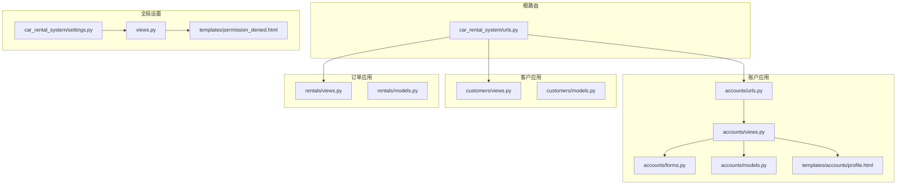
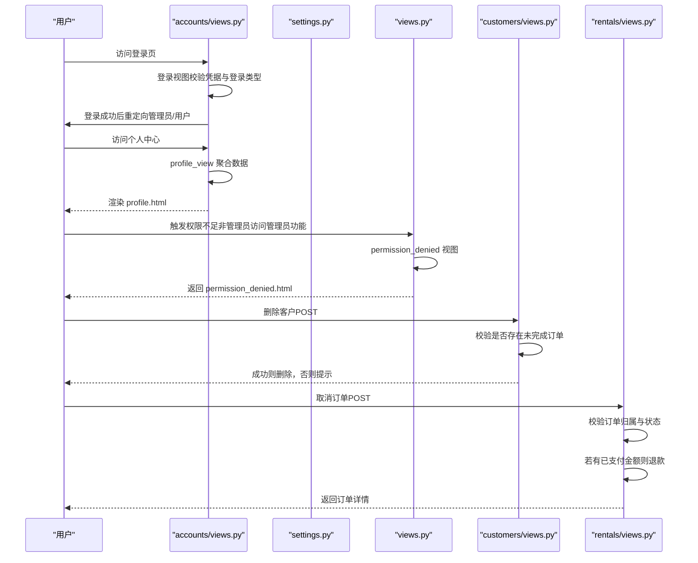
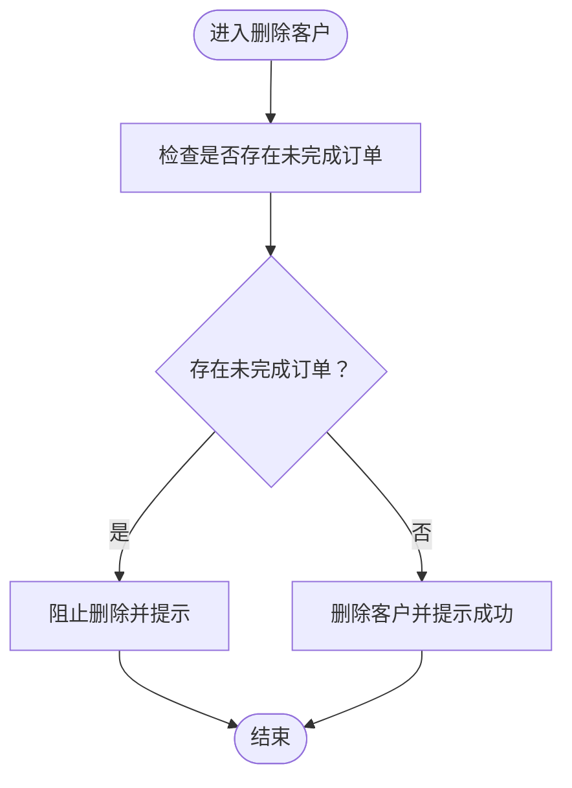
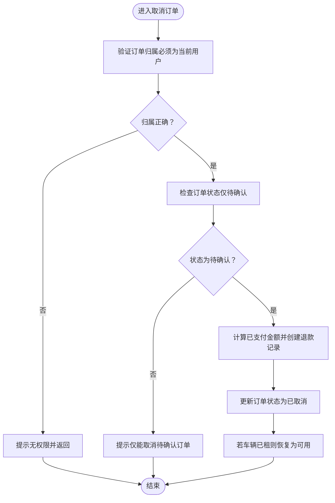
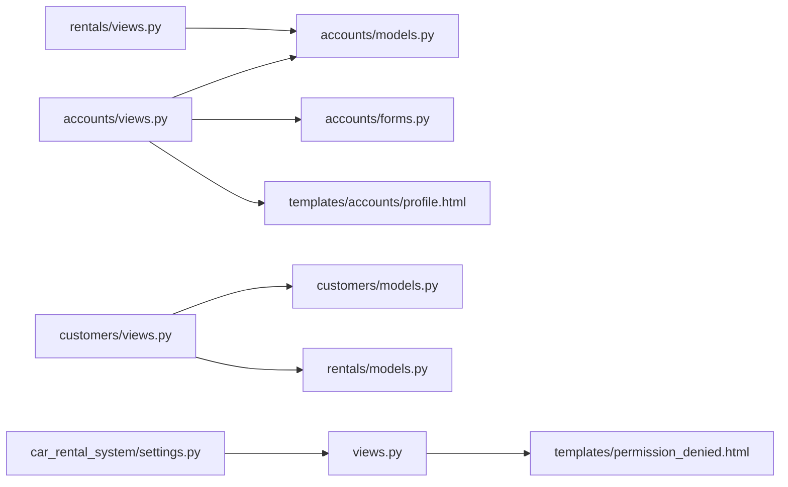

# 用户认证与权限

<cite>
**本文引用的文件**
- [accounts/views.py](file://code/car_rental_system/accounts/views.py)
- [accounts/models.py](file://code/car_rental_system/accounts/models.py)
- [accounts/forms.py](file://code/car_rental_system/accounts/forms.py)
- [accounts/urls.py](file://code/car_rental_system/accounts/urls.py)
- [customers/models.py](file://code/car_rental_system/customers/models.py)
- [customers/views.py](file://code/car_rental_system/customers/views.py)
- [rentals/models.py](file://code/car_rental_system/rentals/models.py)
- [rentals/views.py](file://code/car_rental_system/rentals/views.py)
- [views.py](file://code/car_rental_system/views.py)
- [car_rental_system/settings.py](file://code/car_rental_system/car_rental_system/settings.py)
- [car_rental_system/urls.py](file://code/car_rental_system/car_rental_system/urls.py)
- [templates/accounts/profile.html](file://code/car_rental_system/templates/accounts/profile.html)
- [templates/permission_denied.html](file://code/car_rental_system/templates/permission_denied.html)
</cite>

## 目录
1. [简介](#简介)
2. [项目结构](#项目结构)
3. [核心组件](#核心组件)
4. [架构总览](#架构总览)
5. [详细组件分析](#详细组件分析)
6. [依赖关系分析](#依赖关系分析)
7. [性能考量](#性能考量)
8. [故障排查指南](#故障排查指南)
9. [结论](#结论)

## 简介
本专项文档聚焦于系统的用户认证与权限控制机制，覆盖用户注册、登录、会话管理的完整流程；解释个人中心（profile.html）的数据来源与展示逻辑；阐述基于角色的访问控制（RBAC）设计，明确普通用户与管理员的权限边界；描述敏感操作（如删除客户、取消订单）的权限验证与拦截逻辑，并说明 permission_denied.html 页面的触发条件。同时结合 URL 路由配置，说明安全视图（如 @login_required 装饰器）的保护机制。

## 项目结构
系统采用 Django 应用分层组织，认证与权限相关的核心代码集中在 accounts 应用，敏感操作涉及 customers、rentals 等应用。全局路由在根级 urls.py 中聚合，settings.py 提供统一的安全与错误页面配置。

图表来源
- [car_rental_system/urls.py](file://code/car_rental_system/car_rental_system/urls.py#L27-L38)
- [accounts/urls.py](file://code/car_rental_system/accounts/urls.py#L1-L49)
- [car_rental_system/settings.py](file://code/car_rental_system/car_rental_system/settings.py#L127-L134)
- [views.py](file://code/car_rental_system/views.py#L223-L227)
- [templates/accounts/profile.html](file://code/car_rental_system/templates/accounts/profile.html#L1-L275)
- [templates/permission_denied.html](file://code/car_rental_system/templates/permission_denied.html#L1-L29)

章节来源
- [car_rental_system/urls.py](file://code/car_rental_system/car_rental_system/urls.py#L27-L38)
- [accounts/urls.py](file://code/car_rental_system/accounts/urls.py#L1-L49)
- [car_rental_system/settings.py](file://code/car_rental_system/car_rental_system/settings.py#L127-L134)

## 核心组件
- 认证与会话
  - 登录视图支持“用户/管理员”双入口，校验 is_staff 并设置会话有效期；登出视图使用 @login_required 保护。
  - 全局 LOGIN_URL、LOGIN_REDIRECT_URL、LOGOUT_REDIRECT_URL 统一登录与重定向策略。
- 个人中心
  - profile_view 聚合用户资料、客户信息、订单统计、通知数、VIP 升级信息等，模板 profile.html 展示。
- 权限控制
  - 全局 HANDLER403 指向 views.permission_denied，统一 403 页面。
  - 管理员专用视图（如 review_list_view、review_edit_view、review_delete_view）显式检查 request.user.is_staff。
- 敏感操作
  - 删除客户：customer_delete 在 POST 时检查是否存在未完成订单，阻止删除。
  - 取消订单：order_cancel_view 仅允许订单所属客户取消“待确认”状态的订单，并处理退款。

章节来源
- [accounts/views.py](file://code/car_rental_system/accounts/views.py#L31-L93)
- [accounts/views.py](file://code/car_rental_system/accounts/views.py#L96-L102)
- [car_rental_system/settings.py](file://code/car_rental_system/car_rental_system/settings.py#L127-L129)
- [views.py](file://code/car_rental_system/views.py#L118-L227)
- [customers/views.py](file://code/car_rental_system/customers/views.py#L165-L191)
- [accounts/views.py](file://code/car_rental_system/accounts/views.py#L1026-L1061)

## 架构总览
下图展示认证与权限的关键交互路径：用户通过 accounts 应用完成注册/登录/登出；个人中心聚合多源数据；敏感操作在对应应用内部进行权限校验与业务处理；全局错误处理器统一 403 页面。

图表来源
- [accounts/views.py](file://code/car_rental_system/accounts/views.py#L31-L93)
- [accounts/views.py](file://code/car_rental_system/accounts/views.py#L145-L195)
- [views.py](file://code/car_rental_system/views.py#L223-L227)
- [customers/views.py](file://code/car_rental_system/customers/views.py#L165-L191)
- [rentals/views.py](file://code/car_rental_system/rentals/views.py#L395-L466)

## 详细组件分析

### 认证与会话管理
- 注册流程
  - 注册视图在 POST 时校验表单，成功后创建用户资料并提示登录。
- 登录流程
  - 登录视图支持“用户/管理员”两种登录入口，若选择管理员登录但用户非 is_staff，则拒绝。
  - 登录成功后根据 remember_me 设置会话过期策略；根据 is_staff 决定跳转到仪表板或用户首页。
  - 登录成功后可读取 GET 参数 next 并重定向。
- 登出流程
  - @login_required 保护登出视图，登出后提示并回到登录页。
- 全局配置
  - LOGIN_URL、LOGIN_REDIRECT_URL、LOGOUT_REDIRECT_URL 统一登录与重定向策略。
  - HANDLER403 指向 views.permission_denied，统一 403 页面。

章节来源
- [accounts/views.py](file://code/car_rental_system/accounts/views.py#L31-L93)
- [accounts/views.py](file://code/car_rental_system/accounts/views.py#L96-L102)
- [car_rental_system/settings.py](file://code/car_rental_system/car_rental_system/settings.py#L127-L134)

### 个人中心（profile.html）
- 数据来源
  - profile_view 从数据库聚合：
    - 用户客户信息（通过 get_customer_for_user 关联用户与客户）
    - 用户近 10 笔订单（按创建时间倒序）
    - 订单统计（总数与累计消费）
    - 未读通知数
    - VIP 升级信息（仅非 VIP 用户展示）
- 模板渲染
  - profile.html 展示用户基本信息、统计信息、VIP 权益或升级进度、最近订单列表等。

章节来源
- [accounts/views.py](file://code/car_rental_system/accounts/views.py#L145-L195)
- [templates/accounts/profile.html](file://code/car_rental_system/templates/accounts/profile.html#L1-L275)

### 基于角色的访问控制（RBAC）
- 管理员专用功能
  - 通过 @login_required(login_url='/accounts/login/') 与显式检查 request.user.is_staff 实现双重保护。
  - 示例：review_list_view、review_edit_view、review_delete_view 仅管理员可访问。
- 普通用户功能
  - 大部分账户相关视图（如 profile、customer_info、password_change 等）均使用 @login_required 保护，确保仅登录用户可访问。
- 403 统一处理
  - settings.HANDLER403 指向 views.permission_denied，返回 permission_denied.html。

章节来源
- [views.py](file://code/car_rental_system/views.py#L118-L227)
- [car_rental_system/settings.py](file://code/car_rental_system/car_rental_system/settings.py#L132-L134)
- [templates/permission_denied.html](file://code/car_rental_system/templates/permission_denied.html#L1-L29)

### 敏感操作权限验证

#### 删除客户（customers）
- 权限与前置条件
  - 在 POST 时检查客户是否存在未完成订单（状态为 PENDING 或 ONGOING）。若有，则阻止删除并提示。
- 行为结果
  - 无未完成订单时删除客户并提示成功；否则返回详情页并保留相关订单列表。

图表来源
- [customers/views.py](file://code/car_rental_system/customers/views.py#L165-L191)

章节来源
- [customers/views.py](file://code/car_rental_system/customers/views.py#L165-L191)

#### 取消订单（rentals）
- 权限与前置条件
  - 仅订单所属客户可取消；仅“待确认”状态的订单允许取消。
- 退款处理
  - 若存在已支付金额（已扣已退款），系统创建退款记录并刷新订单财务信息。
- 结果
  - 订单状态更新为“已取消”，若车辆处于已租状态则恢复为可用。

图表来源
- [accounts/views.py](file://code/car_rental_system/accounts/views.py#L1026-L1061)
- [rentals/views.py](file://code/car_rental_system/rentals/views.py#L395-L466)

章节来源
- [accounts/views.py](file://code/car_rental_system/accounts/views.py#L1026-L1061)
- [rentals/views.py](file://code/car_rental_system/rentals/views.py#L395-L466)

### URL 路由与安全视图
- 根路由
  - 根级 urls.py 聚合 admin、accounts、vehicles、customers、rentals 子应用路由，并挂载 reviews 管理视图。
- accounts 应用路由
  - 覆盖注册、登录、登出、个人中心、车辆浏览、订单管理、支付、通知等 URL。
- 安全视图
  - @login_required 装饰器保护大多数账户相关视图；管理员视图显式检查 is_staff。
  - 403 错误由 views.permission_denied 统一处理。

章节来源
- [car_rental_system/urls.py](file://code/car_rental_system/car_rental_system/urls.py#L27-L38)
- [accounts/urls.py](file://code/car_rental_system/accounts/urls.py#L1-L49)
- [views.py](file://code/car_rental_system/views.py#L118-L227)

## 依赖关系分析
- 认证与权限
  - accounts/views.py 依赖 Django 认证中间件与消息框架；profile_view 依赖 customers、rentals、accounts 模型与表单。
  - settings.py 提供 LOGIN_URL、HANDLER403 等全局配置。
- 敏感操作
  - customers/views.py 的删除逻辑依赖 rentals 模型的订单状态；rentals/views.py 的取消逻辑依赖 accounts.models.Payment 与 accounts.views.get_payment_summary。
- 模板与视图
  - profile.html 依赖 accounts/views.py 提供的上下文变量；permission_denied.html 由 views.permission_denied 返回。

图表来源
- [accounts/views.py](file://code/car_rental_system/accounts/views.py#L145-L195)
- [accounts/models.py](file://code/car_rental_system/accounts/models.py#L1-L318)
- [accounts/forms.py](file://code/car_rental_system/accounts/forms.py#L1-L334)
- [templates/accounts/profile.html](file://code/car_rental_system/templates/accounts/profile.html#L1-L275)
- [customers/views.py](file://code/car_rental_system/customers/views.py#L165-L191)
- [customers/models.py](file://code/car_rental_system/customers/models.py#L1-L160)
- [rentals/models.py](file://code/car_rental_system/rentals/models.py#L1-L401)
- [rentals/views.py](file://code/car_rental_system/rentals/views.py#L395-L466)
- [views.py](file://code/car_rental_system/views.py#L223-L227)
- [car_rental_system/settings.py](file://code/car_rental_system/car_rental_system/settings.py#L127-L134)

## 性能考量
- 缓存与查询优化
  - accounts/views.py 中多处使用缓存（如热门车辆推荐、筛选选项）与 select_related/only 减少查询开销。
  - rentals/models.py 的自动状态更新使用缓存避免频繁写入。
- 事务与一致性
  - 取消订单与退款在事务中执行，保证支付记录与订单状态一致性。
- 会话与登录
  - 登录时根据 remember_me 设置会话过期策略，避免长期会话带来的安全风险。

章节来源
- [accounts/views.py](file://code/car_rental_system/accounts/views.py#L344-L387)
- [rentals/models.py](file://code/car_rental_system/rentals/models.py#L171-L229)
- [accounts/views.py](file://code/car_rental_system/accounts/views.py#L1026-L1061)

## 故障排查指南
- 登录失败或权限不足
  - 确认登录类型与账号权限：管理员入口仅对 is_staff 生效。
  - 检查 HANDLER403 是否指向 views.permission_denied，确保 403 页面正确显示。
- 无法访问管理员功能
  - 确认视图是否使用 @login_required 与 is_staff 检查。
- 删除客户被阻止
  - 检查是否存在未完成订单（PENDING/ONGOING），删除前需先完成或取消相关订单。
- 取消订单失败
  - 确认订单状态为“待确认”，且当前用户为订单所属客户；检查是否存在已支付金额并正确退款。

章节来源
- [accounts/views.py](file://code/car_rental_system/accounts/views.py#L50-L93)
- [views.py](file://code/car_rental_system/views.py#L223-L227)
- [customers/views.py](file://code/car_rental_system/customers/views.py#L165-L191)
- [accounts/views.py](file://code/car_rental_system/accounts/views.py#L1026-L1061)

## 结论
本系统采用“基于角色的访问控制（RBAC）+ 装饰器保护”的组合策略：普通用户通过 @login_required 保护，管理员通过 is_staff 显式校验；全局 HANDLER403 统一处理权限不足场景。敏感操作（删除客户、取消订单）在业务层严格校验归属与状态，并在必要时进行退款与状态回滚，确保数据一致性与安全性。配合缓存与事务优化，系统在保障安全的同时兼顾性能与用户体验。