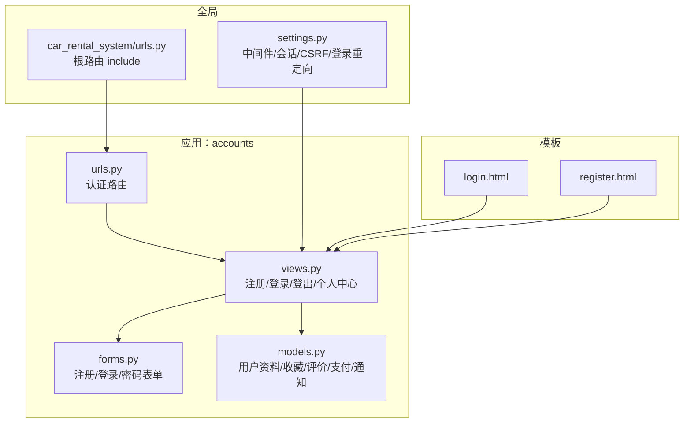
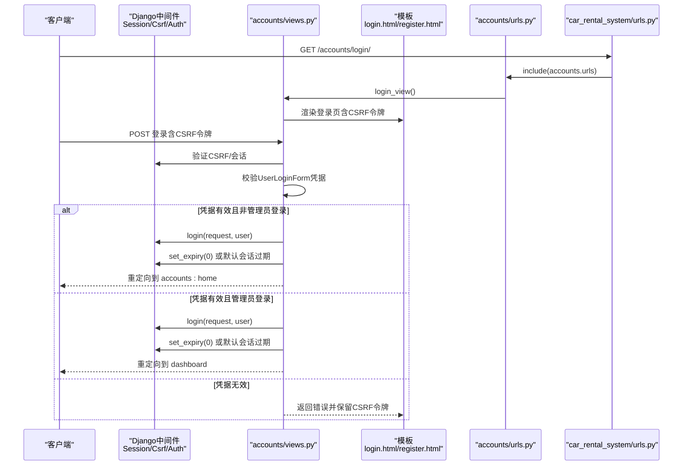
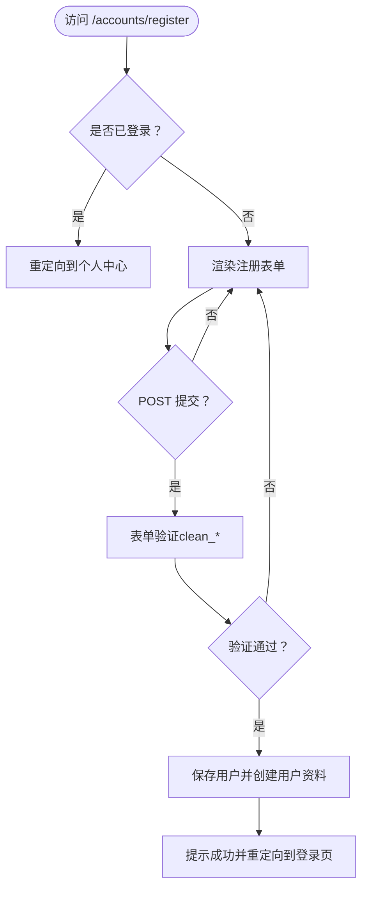
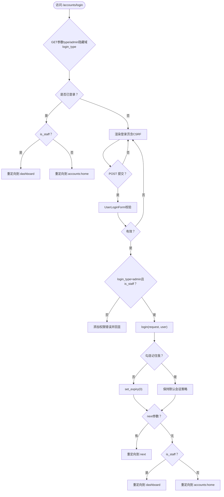
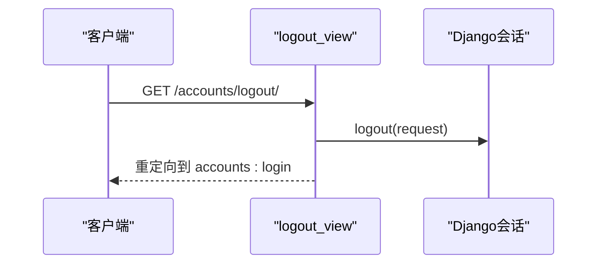
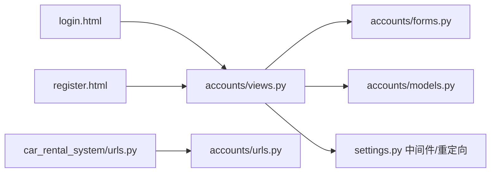

# 身份验证机制

<cite>
**本文引用的文件**
- [views.py](file://code/car_rental_system/accounts/views.py)
- [forms.py](file://code/car_rental_system/accounts/forms.py)
- [models.py](file://code/car_rental_system/accounts/models.py)
- [urls.py](file://code/car_rental_system/accounts/urls.py)
- [settings.py](file://code/car_rental_system/car_rental_system/settings.py)
- [urls.py](file://code/car_rental_system/car_rental_system/urls.py)
- [login.html](file://code/car_rental_system/templates/accounts/login.html)
- [register.html](file://code/car_rental_system/templates/accounts/register.html)
</cite>

## 目录
1. [简介](#简介)
2. [项目结构](#项目结构)
3. [核心组件](#核心组件)
4. [架构总览](#架构总览)
5. [详细组件分析](#详细组件分析)
6. [依赖关系分析](#依赖关系分析)
7. [性能考量](#性能考量)
8. [故障排除指南](#故障排除指南)
9. [结论](#结论)

## 简介
本文件系统性阐述系统的身份验证机制，覆盖用户注册、登录与登出的完整流程；解释 register_view、login_view 和 logout_view 的实现逻辑，尤其是 login_view 中对管理员与普通用户的区分处理；说明表单验证、会话管理与 CSRF 保护的实现方式；结合 URL 路由配置，给出认证流程的 HTTP 交互过程；提供代码示例路径以展示用户注册数据保存与登录状态维护；解释“记住我”功能与会话过期策略；最后给出常见问题的故障排除建议。

## 项目结构
账户认证相关的核心文件集中在 accounts 应用内，配合全局设置与模板渲染：
- 视图层：accounts/views.py 提供注册、登录、登出等视图
- 表单层：accounts/forms.py 定义注册、登录、密码重置等表单
- 模型层：accounts/models.py 定义用户资料、收藏、评价、支付、通知等模型
- 路由层：accounts/urls.py 定义认证相关 URL；根路由 include accounts/urls
- 设置层：car_rental_system/settings.py 启用会话、CSRF、认证中间件，并配置登录/登出重定向
- 模板层：templates/accounts 下的 login.html、register.html 等负责前端交互

图表来源
- [views.py](file://code/car_rental_system/accounts/views.py#L1-L120)
- [forms.py](file://code/car_rental_system/accounts/forms.py#L1-L120)
- [models.py](file://code/car_rental_system/accounts/models.py#L1-L120)
- [urls.py](file://code/car_rental_system/accounts/urls.py#L1-L30)
- [settings.py](file://code/car_rental_system/car_rental_system/settings.py#L46-L130)
- [urls.py](file://code/car_rental_system/car_rental_system/urls.py#L27-L38)
- [login.html](file://code/car_rental_system/templates/accounts/login.html#L140-L180)
- [register.html](file://code/car_rental_system/templates/accounts/register.html#L75-L110)

章节来源
- [views.py](file://code/car_rental_system/accounts/views.py#L1-L120)
- [urls.py](file://code/car_rental_system/accounts/urls.py#L1-L30)
- [settings.py](file://code/car_rental_system/car_rental_system/settings.py#L46-L130)
- [urls.py](file://code/car_rental_system/car_rental_system/urls.py#L27-L38)

## 核心组件
- 注册视图 register_view：处理 POST 提交的注册表单，校验通过后保存用户并创建用户资料，提示成功并跳转登录页
- 登录视图 login_view：支持“用户登录/管理员登录”两种模式；校验凭据后根据是否勾选“记住我”决定会话有效期；按身份跳转到仪表板或首页
- 登出视图 logout_view：使用 Django 内置 logout，清除会话并提示成功后跳转登录页
- 表单验证：UserRegisterForm、UserLoginForm、PasswordResetRequestForm、PasswordResetForm 等均在 clean_* 方法中实现业务规则校验
- 会话与 CSRF：启用 Django 默认会话与 CSRF 中间件；模板中使用 ；登录时动态设置会话过期策略
- 路由与重定向：accounts/urls.py 映射 /accounts/register、/accounts/login、/accounts/logout；settings.py 配置 LOGIN_URL、LOGIN_REDIRECT_URL、LOGOUT_REDIRECT_URL

章节来源
- [views.py](file://code/car_rental_system/accounts/views.py#L31-L103)
- [forms.py](file://code/car_rental_system/accounts/forms.py#L13-L120)
- [settings.py](file://code/car_rental_system/car_rental_system/settings.py#L46-L130)
- [urls.py](file://code/car_rental_system/accounts/urls.py#L6-L13)

## 架构总览
下图展示认证流程的端到端交互：浏览器发起 HTTP 请求，Django 中间件处理会话与 CSRF，视图解析表单并调用 Django 认证与会话 API，最终根据身份与配置进行重定向。

图表来源
- [views.py](file://code/car_rental_system/accounts/views.py#L50-L103)
- [urls.py](file://code/car_rental_system/accounts/urls.py#L6-L13)
- [urls.py](file://code/car_rental_system/car_rental_system/urls.py#L27-L38)
- [login.html](file://code/car_rental_system/templates/accounts/login.html#L140-L180)
- [settings.py](file://code/car_rental_system/car_rental_system/settings.py#L46-L130)

## 详细组件分析

### 注册流程 register_view
- 入口：/accounts/register/
- 行为要点：
  - 已登录用户直接跳转个人中心
  - POST 提交时实例化 UserRegisterForm，校验通过后保存用户并创建用户资料
  - 成功后提示并重定向到登录页
- 关键点：表单 clean_email/clean_username 在 forms.py 中实现唯一性与格式校验

图表来源
- [views.py](file://code/car_rental_system/accounts/views.py#L31-L47)
- [forms.py](file://code/car_rental_system/accounts/forms.py#L13-L66)
- [models.py](file://code/car_rental_system/accounts/models.py#L9-L47)

章节来源
- [views.py](file://code/car_rental_system/accounts/views.py#L31-L47)
- [forms.py](file://code/car_rental_system/accounts/forms.py#L13-L66)
- [models.py](file://code/car_rental_system/accounts/models.py#L9-L47)

### 登录流程 login_view（管理员/普通用户区分）
- 入口：/accounts/login/
- 行为要点：
  - 支持 GET 参数 type=user/admin 与隐藏域 login_type 控制登录模式
  - 已登录用户根据 is_staff 跳转 dashboard 或 accounts:home
  - POST 提交时实例化 UserLoginForm，校验通过后：
    - 若选择管理员登录但用户非 is_staff，则添加错误提示
    - 否则 login(request, user)，处理“记住我”：未勾选则 set_expiry(0) 使会话随浏览器关闭而结束
    - 检查 next 参数，存在则重定向到目标地址；否则按身份跳转
- 模板：login.html 使用  并提供用户/管理员双标签页切换

图表来源
- [views.py](file://code/car_rental_system/accounts/views.py#L50-L103)
- [login.html](file://code/car_rental_system/templates/accounts/login.html#L140-L180)
- [settings.py](file://code/car_rental_system/car_rental_system/settings.py#L120-L130)

章节来源
- [views.py](file://code/car_rental_system/accounts/views.py#L50-L103)
- [login.html](file://code/car_rental_system/templates/accounts/login.html#L140-L180)
- [settings.py](file://code/car_rental_system/car_rental_system/settings.py#L120-L130)

### 登出流程 logout_view
- 入口：/accounts/logout/
- 行为要点：
  - 使用 @login_required 保护，确保仅登录用户可登出
  - 调用 logout(request) 清除会话
  - 提示成功并重定向到登录页

图表来源
- [views.py](file://code/car_rental_system/accounts/views.py#L96-L103)
- [settings.py](file://code/car_rental_system/car_rental_system/settings.py#L120-L130)

章节来源
- [views.py](file://code/car_rental_system/accounts/views.py#L96-L103)
- [settings.py](file://code/car_rental_system/car_rental_system/settings.py#L120-L130)

### 表单验证与业务规则
- UserRegisterForm：邮箱唯一性、用户名格式与长度、密码一致性与强度
- UserLoginForm：用户名/密码校验，新增“记住我”布尔字段
- PasswordResetRequestForm：邮箱存在性校验
- PasswordResetForm：新密码一致性与 Django 密码强度校验
- UserProfileForm：邮箱唯一性、手机号格式、保存时同步更新 User 基本信息

章节来源
- [forms.py](file://code/car_rental_system/accounts/forms.py#L13-L120)
- [forms.py](file://code/car_rental_system/accounts/forms.py#L121-L223)

### 会话管理与 CSRF 保护
- CSRF：settings.py 中启用 CsrfViewMiddleware；模板 login.html/register.html 使用 
- 会话：login_view 根据“记住我”设置 request.session.set_expiry(0) 或保持默认策略
- 认证中间件：AuthenticationMiddleware 保证 request.user 可用
- 登录重定向：LOGIN_REDIRECT_URL 由视图按身份决定；LOGOUT_REDIRECT_URL 指向登录页

章节来源
- [settings.py](file://code/car_rental_system/car_rental_system/settings.py#L46-L130)
- [login.html](file://code/car_rental_system/templates/accounts/login.html#L140-L180)
- [register.html](file://code/car_rental_system/templates/accounts/register.html#L75-L110)
- [views.py](file://code/car_rental_system/accounts/views.py#L65-L93)

### URL 路由与 HTTP 交互
- accounts/urls.py 定义注册/登录/登出等 URL
- 根路由 include('accounts.urls')，形成 /accounts/* 前缀
- settings.py 配置 LOGIN_URL、LOGIN_REDIRECT_URL、LOGOUT_REDIRECT_URL

章节来源
- [urls.py](file://code/car_rental_system/accounts/urls.py#L6-L13)
- [urls.py](file://code/car_rental_system/car_rental_system/urls.py#L27-L38)
- [settings.py](file://code/car_rental_system/car_rental_system/settings.py#L120-L130)

## 依赖关系分析
- 视图依赖：
  - Django 认证与会话 API：login、logout、update_session_auth_hash
  - 表单类：UserRegisterForm、UserLoginForm、PasswordResetRequestForm、PasswordResetForm
  - 模型：UserProfile、Favorite、Review、Payment、Notification
- 模板依赖：
  - login.html/register.html 使用 ，并在 POST 时携带 login_type 与 remember_me
- 中间件依赖：
  - SessionMiddleware、CsrfViewMiddleware、AuthenticationMiddleware
- 路由依赖：
  - accounts/urls.py 与根路由 include

图表来源
- [views.py](file://code/car_rental_system/accounts/views.py#L1-L120)
- [forms.py](file://code/car_rental_system/accounts/forms.py#L1-L120)
- [models.py](file://code/car_rental_system/accounts/models.py#L1-L120)
- [settings.py](file://code/car_rental_system/car_rental_system/settings.py#L46-L130)
- [urls.py](file://code/car_rental_system/car_rental_system/urls.py#L27-L38)
- [urls.py](file://code/car_rental_system/accounts/urls.py#L6-L13)
- [login.html](file://code/car_rental_system/templates/accounts/login.html#L140-L180)
- [register.html](file://code/car_rental_system/templates/accounts/register.html#L75-L110)

章节来源
- [views.py](file://code/car_rental_system/accounts/views.py#L1-L120)
- [settings.py](file://code/car_rental_system/car_rental_system/settings.py#L46-L130)
- [urls.py](file://code/car_rental_system/car_rental_system/urls.py#L27-L38)
- [urls.py](file://code/car_rental_system/accounts/urls.py#L6-L13)

## 性能考量
- 缓存：系统使用内存缓存（LocMemCache）提升查询性能，如热门车辆推荐等场景
- 会话过期：未勾选“记住我”时设置会话过期为 0，减少长期会话占用
- 表单验证：在视图层集中校验，避免数据库层重复检查

章节来源
- [settings.py](file://code/car_rental_system/car_rental_system/settings.py#L141-L151)
- [views.py](file://code/car_rental_system/accounts/views.py#L65-L93)

## 故障排除指南
- 登录失败
  - 症状：凭据无效或权限错误
  - 排查：确认用户名/密码正确；若选择管理员登录但账号非 is_staff，将出现权限错误提示
  - 参考路径：[login_view](file://code/car_rental_system/accounts/views.py#L50-L103)
- 重复注册
  - 症状：邮箱已被注册
  - 排查：UserRegisterForm.clean_email 校验邮箱唯一性
  - 参考路径：[UserRegisterForm.clean_email](file://code/car_rental_system/accounts/forms.py#L53-L58)
- “记住我”无效
  - 症状：关闭浏览器后仍保持登录
  - 排查：若未勾选“记住我”，登录后会调用 set_expiry(0)，会话将在关闭浏览器后结束
  - 参考路径：[login_view 会话设置](file://code/car_rental_system/accounts/views.py#L65-L93)
- CSRF 校验失败
  - 症状：POST 提交被拒绝
  - 排查：确认模板中包含 ，且请求来自同一站点
  - 参考路径：[login.html](file://code/car_rental_system/templates/accounts/login.html#L140-L180)、[register.html](file://code/car_rental_system/templates/accounts/register.html#L75-L110)
- 登录后未跳转到预期页面
  - 症状：登录后未进入 dashboard 或 accounts:home
  - 排查：检查 is_staff 标识；确认视图中根据身份的重定向逻辑
  - 参考路径：[login_view 身份重定向](file://code/car_rental_system/accounts/views.py#L86-L93)

章节来源
- [views.py](file://code/car_rental_system/accounts/views.py#L50-L103)
- [forms.py](file://code/car_rental_system/accounts/forms.py#L53-L58)
- [login.html](file://code/car_rental_system/templates/accounts/login.html#L140-L180)
- [register.html](file://code/car_rental_system/templates/accounts/register.html#L75-L110)

## 结论
本系统采用标准 Django 认证与会话机制，结合自定义表单验证与模板 CSRF 保护，实现了清晰的注册、登录与登出流程。login_view 对管理员与普通用户进行了明确区分，并通过“记住我”控制会话生命周期。路由与中间件配置确保了安全与可用性。建议在生产环境中进一步完善密码重置流程（令牌验证）、邮件服务集成以及更细粒度的权限控制与审计日志。