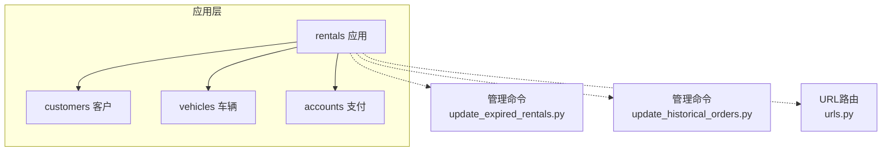
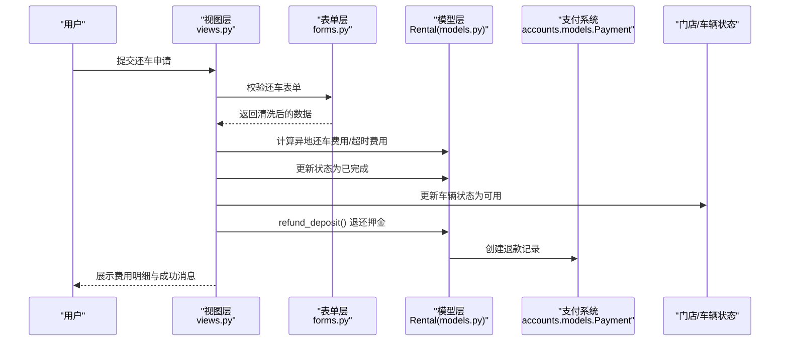
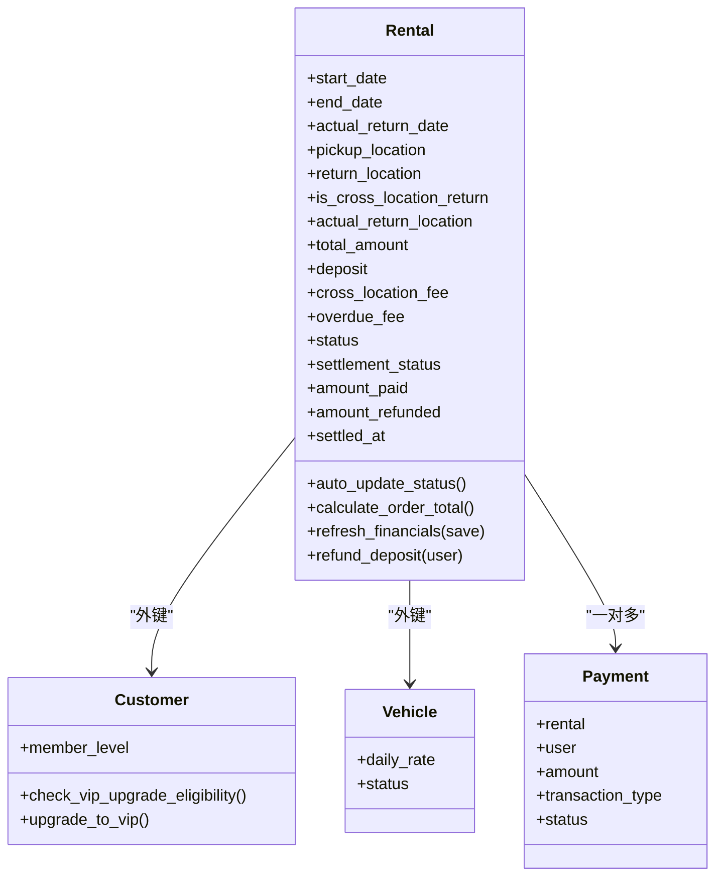
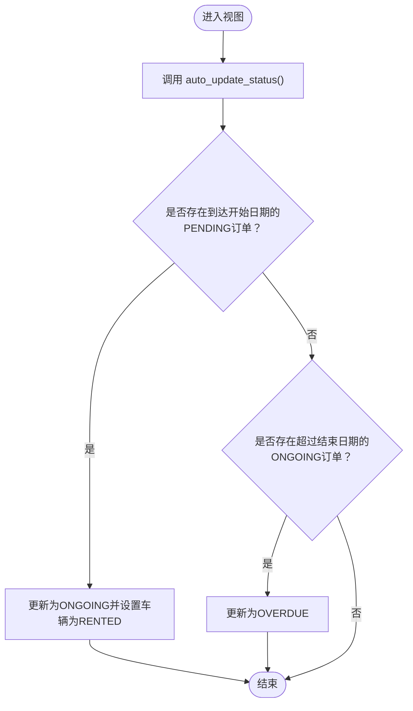
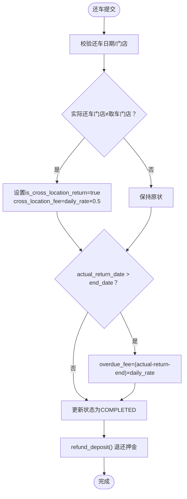
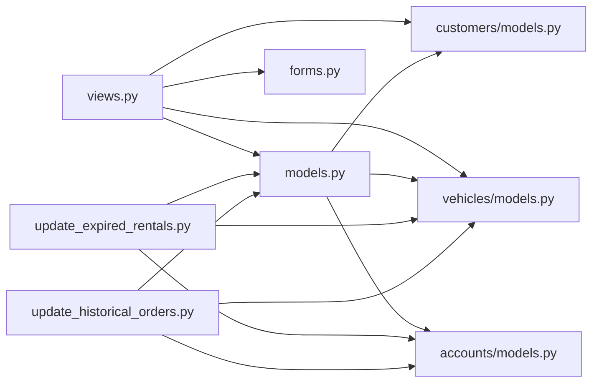
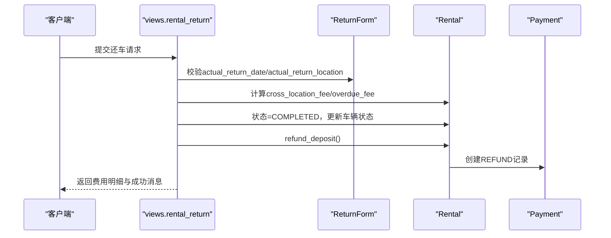

# 租赁管理模块

<cite>
**本文引用的文件**
- [models.py](file://code/car_rental_system/rentals/models.py)
- [views.py](file://code/car_rental_system/rentals/views.py)
- [forms.py](file://code/car_rental_system/rentals/forms.py)
- [urls.py](file://code/car_rental_system/rentals/urls.py)
- [update_expired_rentals.py](file://code/car_rental_system/rentals/management/commands/update_expired_rentals.py)
- [update_historical_orders.py](file://code/car_rental_system/rentals/management/commands/update_historical_orders.py)
- [0002_add_deposit_and_location_fields.py](file://code/car_rental_system/rentals/migrations/0002_add_deposit_and_location_fields.py)
- [0003_settlement_fields.py](file://code/car_rental_system/rentals/migrations/0003_settlement_fields.py)
- [0004_add_return_location_fields.py](file://code/car_rental_system/rentals/migrations/0004_add_return_location_fields.py)
- [customers/models.py](file://code/car_rental_system/customers/models.py)
- [vehicles/models.py](file://code/car_rental_system/vehicles/models.py)
- [accounts/models.py](file://code/car_rental_system/accounts/models.py)
- [还车逻辑修改说明.md](file://code/car_rental_system/还车逻辑修改说明.md)
</cite>

## 目录
1. [简介](#简介)
2. [项目结构](#项目结构)
3. [核心组件](#核心组件)
4. [架构总览](#架构总览)
5. [详细组件分析](#详细组件分析)
6. [依赖关系分析](#依赖关系分析)
7. [性能考量](#性能考量)
8. [故障排查指南](#故障排查指南)
9. [结论](#结论)
10. [附录](#附录)

## 简介
本文件系统化梳理租赁管理模块的功能与实现，覆盖订单创建、状态跟踪、费用计算与自动更新机制。重点解析Rental模型的关键字段（租赁时间、取车/还车门店、押金、结算金额）及业务规则；详解异地还车费用与超时还车费用的计算逻辑；说明管理命令如何自动化处理过期订单；阐述还车流程中押金退还的触发条件；并结合“还车逻辑修改说明”中的优化建议，讨论未来可配置化费用规则的可能性。

## 项目结构
- 应用层：rentals（订单、状态、费用、还车、管理命令）
- 关联模型：customers（客户）、vehicles（车辆）、accounts（支付）
- URL路由：提供订单列表、详情、创建、更新、状态变更、还车、取消等入口
- 管理命令：定时自动更新过期订单状态、批量处理历史订单

图表来源
- [models.py](file://code/car_rental_system/rentals/models.py#L1-L170)
- [urls.py](file://code/car_rental_system/rentals/urls.py#L1-L22)
- [update_expired_rentals.py](file://code/car_rental_system/rentals/management/commands/update_expired_rentals.py#L1-L191)
- [update_historical_orders.py](file://code/car_rental_system/rentals/management/commands/update_historical_orders.py#L1-L311)

章节来源
- [urls.py](file://code/car_rental_system/rentals/urls.py#L1-L22)

## 核心组件
- Rental模型：承载订单生命周期、状态、费用、结算、押金与还车信息
- 视图层：订单创建、更新、状态变更、还车、取消、费用计算与可用日期查询
- 表单层：订单表单、状态表单、还车表单、取消表单
- 管理命令：自动更新过期订单状态、批量处理历史订单、刷新财务信息
- 关联模型：Customer（会员等级、VIP升级）、Vehicle（日租金、状态）、Payment（支付/退款）

章节来源
- [models.py](file://code/car_rental_system/rentals/models.py#L1-L170)
- [views.py](file://code/car_rental_system/rentals/views.py#L1-L120)
- [forms.py](file://code/car_rental_system/rentals/forms.py#L1-L120)
- [customers/models.py](file://code/car_rental_system/customers/models.py#L1-L160)
- [vehicles/models.py](file://code/car_rental_system/vehicles/models.py#L1-L85)
- [accounts/models.py](file://code/car_rental_system/accounts/models.py#L147-L200)

## 架构总览
系统围绕Rental模型构建订单全生命周期管理，通过视图层协调表单、状态机与业务规则，借助管理命令实现自动化运维，最终与支付系统联动完成结算与退款。

图表来源
- [views.py](file://code/car_rental_system/rentals/views.py#L279-L392)
- [models.py](file://code/car_rental_system/rentals/models.py#L273-L394)
- [accounts/models.py](file://code/car_rental_system/accounts/models.py#L147-L200)

## 详细组件分析

### Rental模型与关键字段
- 订单时间线字段
  - start_date/end_date：计划起止日期，决定基础租金与超时判定
  - actual_return_date：实际还车日期，用于超时费用计算
- 地点与异地还车
  - pickup_location：取车门店
  - return_location：还车门店（异地还车时填写）
  - is_cross_location_return：是否异地还车标记
  - actual_return_location：实际还车门店（还车时填写）
- 费用与押金
  - total_amount：基础租金（日租金×天数）
  - deposit：押金（VIP为0，普通用户默认为日租金×10）
  - cross_location_fee：异地还车费用（默认日租金×0.5）
  - overdue_fee：超时还车费用（按日租金计算）
- 结算与财务
  - settlement_status/amount_paid/amount_refunded/settled_at：结算状态与累计支付/退款
- 状态机
  - PENDING → ONGOING → OVERDUE → COMPLETED；CANCELLED独立分支

图表来源
- [models.py](file://code/car_rental_system/rentals/models.py#L1-L170)
- [customers/models.py](file://code/car_rental_system/customers/models.py#L1-L160)
- [vehicles/models.py](file://code/car_rental_system/vehicles/models.py#L1-L85)
- [accounts/models.py](file://code/car_rental_system/accounts/models.py#L147-L200)

章节来源
- [models.py](file://code/car_rental_system/rentals/models.py#L1-L170)
- [models.py](file://code/car_rental_system/rentals/models.py#L246-L333)

### 订单创建与状态跟踪
- 订单创建
  - 视图层调用表单清洗与计算函数，设置total_amount并保存
  - 若状态为PENDING，车辆状态置为RENTED
- 状态自动更新
  - 视图入口与管理命令均调用auto_update_status()
  - PENDING → ONGOING（到达开始日期）
  - ONGOING → OVERDUE（超过结束日期）
  - 使用缓存避免频繁更新（每5分钟最多一次）
- 状态手动变更
  - 通过RentalStatusForm限定合法转换路径
  - 变更时联动更新车辆状态

图表来源
- [views.py](file://code/car_rental_system/rentals/views.py#L17-L59)
- [models.py](file://code/car_rental_system/rentals/models.py#L171-L229)

章节来源
- [views.py](file://code/car_rental_system/rentals/views.py#L154-L231)
- [models.py](file://code/car_rental_system/rentals/models.py#L171-L229)

### 费用计算与还车逻辑
- 基础费用
  - total_amount = daily_rate × 计划天数
  - VIP客户享受10%折扣（在计算函数中体现）
- 押金
  - VIP：deposit=0
  - 普通用户：deposit=daily_rate×10
- 异地还车费用
  - 若租车时已预约异地还车：默认cross_location_fee=daily_rate×0.5
  - 若租车时未预约但实际异地还车：系统自动增加费用（日租金×0.5）
- 超时还车费用
  - actual_return_date > end_date时，按日租金计算超时费用
- 订单完成
  - 状态更新为COMPLETED
  - 车辆状态在无其他进行中订单时更新为AVAILABLE
  - 自动退还押金（若可退）

图表来源
- [views.py](file://code/car_rental_system/rentals/views.py#L279-L392)
- [models.py](file://code/car_rental_system/rentals/models.py#L273-L394)

章节来源
- [views.py](file://code/car_rental_system/rentals/views.py#L279-L392)
- [models.py](file://code/car_rental_system/rentals/models.py#L273-L394)

### 管理命令：自动更新过期订单
- update_expired_rentals.py
  - 阶段1：激活PENDING→ONGOING，同步车辆状态
  - 阶段2：检查过期ONGOING→OVERDUE（仅提醒，不自动完成）
  - 自动结算与退款：仅在订单完成后退还押金（由视图层refund_deposit触发）
- update_historical_orders.py
  - 支持预览模式（--dry-run）
  - 可跳过状态更新/押金退还/财务刷新
  - 批量处理历史订单的状态更新、押金/已取消订单已支付金额退款、财务信息刷新

章节来源
- [update_expired_rentals.py](file://code/car_rental_system/rentals/management/commands/update_expired_rentals.py#L1-L191)
- [update_historical_orders.py](file://code/car_rental_system/rentals/management/commands/update_historical_orders.py#L1-L311)

### 数据库迁移与字段演进
- 0002：新增押金、取车/还车地点、是否异地还车、异地还车费用
- 0003：新增amount_paid/amount_refunded/settlement_status/settled_at，并回填历史数据
- 0004：新增actual_return_location/overdue_fee

章节来源
- [0002_add_deposit_and_location_fields.py](file://code/car_rental_system/rentals/migrations/0002_add_deposit_and_location_fields.py#L1-L76)
- [0003_settlement_fields.py](file://code/car_rental_system/rentals/migrations/0003_settlement_fields.py#L1-L95)
- [0004_add_return_location_fields.py](file://code/car_rental_system/rentals/migrations/0004_add_return_location_fields.py#L1-L42)

### 业务规则与合规性
- 日期校验
  - 开始日期不得早于今日
  - 结束日期不得早于开始日期
  - 实际还车日期不得晚于今日
- 车辆占用
  - 同一车辆在同一时间段仅允许一个进行中/预订中/已超时未归还订单
- VIP升级
  - 连续10个已完成订单且无超时、无不诚信异地还车，可升级为VIP

章节来源
- [forms.py](file://code/car_rental_system/rentals/forms.py#L148-L211)
- [forms.py](file://code/car_rental_system/rentals/forms.py#L277-L310)
- [customers/models.py](file://code/car_rental_system/customers/models.py#L101-L146)

## 依赖关系分析
- 模块耦合
  - views依赖models、forms、customers、vehicles
  - models依赖customers、vehicles、accounts（支付）
  - 管理命令依赖models、vehicles、accounts
- 外部依赖
  - Django ORM、缓存（用于状态自动更新节流）
  - Decimal用于精确费用计算

图表来源
- [views.py](file://code/car_rental_system/rentals/views.py#L1-L120)
- [models.py](file://code/car_rental_system/rentals/models.py#L1-L170)
- [accounts/models.py](file://code/car_rental_system/accounts/models.py#L147-L200)
- [update_expired_rentals.py](file://code/car_rental_system/rentals/management/commands/update_expired_rentals.py#L1-L191)
- [update_historical_orders.py](file://code/car_rental_system/rentals/management/commands/update_historical_orders.py#L1-L311)

## 性能考量
- 状态自动更新节流：使用缓存限制每5分钟最多更新一次，避免频繁写入
- 查询优化：列表页使用select_related减少N+1查询；聚合统计降低数据库压力
- 索引策略：Rental模型对常用过滤字段建立索引（start_date、end_date、status、customer/status、vehicle/status）
- 管理命令批处理：事务包裹批量更新，减少锁竞争

章节来源
- [models.py](file://code/car_rental_system/rentals/models.py#L158-L169)
- [views.py](file://code/car_rental_system/rentals/views.py#L61-L126)
- [update_expired_rentals.py](file://code/car_rental_system/rentals/management/commands/update_expired_rentals.py#L46-L143)

## 故障排查指南
- 订单无法完成
  - 确认是否已还车（只有还车后订单才完成）
  - 检查actual_return_date/end_date关系
- 异地还车费用未产生
  - 租车时未勾选异地还车但实际异地还车，系统会在还车时自动增加费用
  - 若未产生，确认实际还车门店与取车门店是否不同
- 超时还车费用异常
  - 确认actual_return_date是否超过end_date
  - 确认日租金字段是否正确
- 押金未退还
  - 确认订单已完成且存在可退余额
  - 检查是否存在退款记录
- 状态未更新
  - 确认是否触发了auto_update_status()或执行了管理命令
  - 检查缓存是否生效（每5分钟一次）

章节来源
- [views.py](file://code/car_rental_system/rentals/views.py#L279-L392)
- [models.py](file://code/car_rental_system/rentals/models.py#L171-L229)
- [update_expired_rentals.py](file://code/car_rental_system/rentals/management/commands/update_expired_rentals.py#L1-L191)

## 结论
租赁管理模块通过清晰的模型设计、严谨的表单与视图控制、完善的管理命令与迁移策略，实现了从订单创建到还车结算的闭环。异地还车与超时还车的费用计算逻辑明确，押金退还流程在订单完成后自动触发。未来可通过引入配置项实现费用规则可配置化，进一步提升业务灵活性。

## 附录

### 关键流程时序：还车

图表来源
- [views.py](file://code/car_rental_system/rentals/views.py#L279-L392)
- [models.py](file://code/car_rental_system/rentals/models.py#L273-L394)
- [accounts/models.py](file://code/car_rental_system/accounts/models.py#L147-L200)

### 费用规则与可配置化建议
- 当前规则
  - 异地还车费用：日租金×0.5（若租车时未预约但实际异地还车）
  - 超时还车费用：超时天数×日租金
  - 押金：日租金×10（VIP为0）
- 可配置化方向（基于“还车逻辑修改说明”）
  - 异地还车费用比例、超时费用倍数可在系统设置中配置
  - 还车门店管理与下拉选择，减少手工输入误差
  - 增加通知与报表统计，提升运营效率

章节来源
- [还车逻辑修改说明.md](file://code/car_rental_system/还车逻辑修改说明.md#L140-L229)