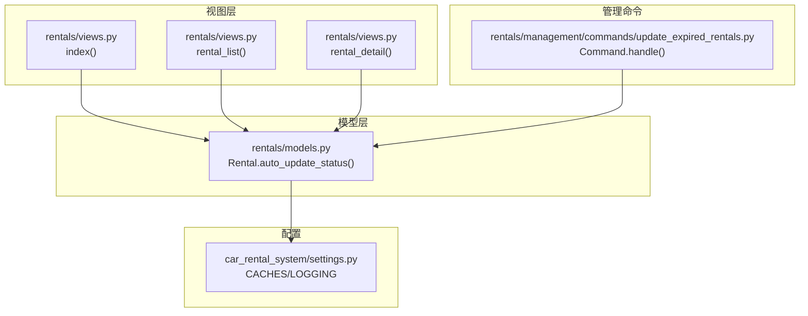
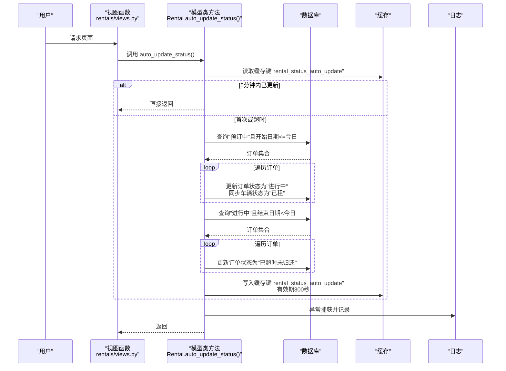
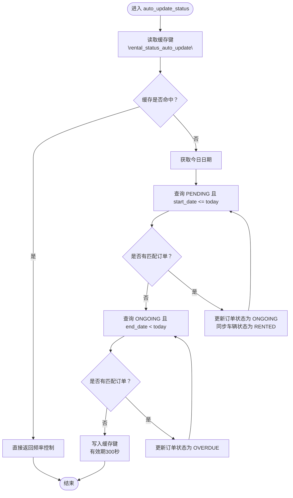
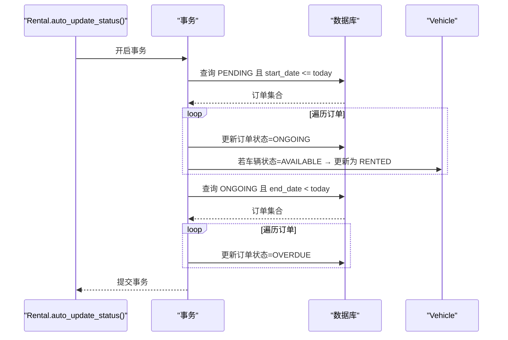
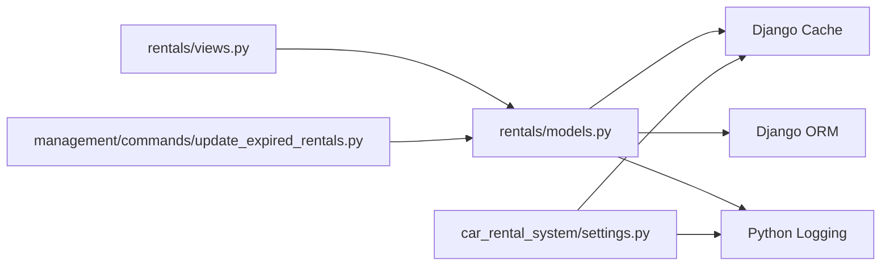

# 模型层自动更新

<cite>
**本文引用的文件**
- [models.py](file://code/car_rental_system/rentals/models.py)
- [views.py](file://code/car_rental_system/rentals/views.py)
- [update_expired_rentals.py](file://code/car_rental_system/rentals/management/commands/update_expired_rentals.py)
- [settings.py](file://code/car_rental_system/car_rental_system/settings.py)
- [rental_status_form.html](file://code/car_rental_system/templates/rentals/rental_status_form.html)
- [views.py](file://code/car_rental_system/accounts/views.py)
</cite>

## 目录
1. [简介](#简介)
2. [项目结构](#项目结构)
3. [核心组件](#核心组件)
4. [架构总览](#架构总览)
5. [详细组件分析](#详细组件分析)
6. [依赖关系分析](#依赖关系分析)
7. [性能考量](#性能考量)
8. [故障排查指南](#故障排查指南)
9. [结论](#结论)

## 简介
本文件聚焦于 Rental 模型中的类方法 auto_update_status 的实现机制，系统性解析其如何通过缓存键“rental_status_auto_update”实现每5分钟最多执行一次的频率控制，避免重复更新；随后深入拆解其事务处理流程：先将“预订中”且开始日期小于等于今日的订单更新为“进行中”，并同步车辆状态为“已租”；再将“进行中”且结束日期早于今日的订单更新为“已超时未归还”。强调该方法不会自动完成订单，仅更新状态以提醒手动还车。结合 models.py 中字段定义，说明状态转换对 overdue_fee、amount_paid 等财务字段的影响，并给出在视图或其他服务中调用该方法的示例路径与异常处理、日志记录机制说明。

## 项目结构
围绕自动更新功能的相关模块与文件分布如下：
- 模型层：Rental 模型及其类方法 auto_update_status
- 视图层：首页、列表页、详情页均在请求入口处调用 auto_update_status
- 管理命令：提供批量/定时执行的命令版本，便于后台任务调度
- 配置层：Django 缓存与日志配置，确保频率控制与可观测性

图表来源
- [models.py](file://code/car_rental_system/rentals/models.py#L171-L229)
- [views.py](file://code/car_rental_system/rentals/views.py#L17-L26)
- [update_expired_rentals.py](file://code/car_rental_system/rentals/management/commands/update_expired_rentals.py#L1-L142)
- [settings.py](file://code/car_rental_system/car_rental_system/settings.py#L141-L178)

章节来源
- [models.py](file://code/car_rental_system/rentals/models.py#L171-L229)
- [views.py](file://code/car_rental_system/rentals/views.py#L17-L26)
- [update_expired_rentals.py](file://code/car_rental_system/rentals/management/commands/update_expired_rentals.py#L1-L142)
- [settings.py](file://code/car_rental_system/car_rental_system/settings.py#L141-L178)

## 核心组件
- 类方法 auto_update_status：实现状态自动更新与频率控制
- 视图入口：在首页、列表页、详情页统一调用该方法
- 管理命令：提供批量/定时执行的替代方案
- 配置：缓存与日志配置保障频率控制与可观测性

章节来源
- [models.py](file://code/car_rental_system/rentals/models.py#L171-L229)
- [views.py](file://code/car_rental_system/rentals/views.py#L17-L26)
- [update_expired_rentals.py](file://code/car_rental_system/rentals/management/commands/update_expired_rentals.py#L1-L142)
- [settings.py](file://code/car_rental_system/car_rental_system/settings.py#L141-L178)

## 架构总览
auto_update_status 的调用链路与职责划分如下：
- 视图层：在用户访问首页、列表、详情时触发
- 模型层：执行频率控制与事务性状态更新
- 管理命令：作为后台任务或定时任务的补充执行方式
- 配置层：缓存键“rental_status_auto_update”用于频率控制；日志记录异常

图表来源
- [models.py](file://code/car_rental_system/rentals/models.py#L171-L229)
- [views.py](file://code/car_rental_system/rentals/views.py#L17-L26)
- [settings.py](file://code/car_rental_system/car_rental_system/settings.py#L141-L178)

## 详细组件分析

### auto_update_status 方法实现机制
- 频率控制：通过缓存键“rental_status_auto_update”实现每5分钟最多执行一次。若缓存命中则直接返回，避免重复更新。
- 事务处理：使用原子事务包裹两阶段更新，保证一致性。
- 第一阶段：将“预订中”且开始日期小于等于今日的订单更新为“进行中”，同时将对应车辆状态更新为“已租”。
- 第二阶段：将“进行中”且结束日期早于今日的订单更新为“已超时未归还”。

图表来源
- [models.py](file://code/car_rental_system/rentals/models.py#L171-L229)

章节来源
- [models.py](file://code/car_rental_system/rentals/models.py#L171-L229)

### 事务处理流程与一致性
- 原子性：整个自动更新过程在一个事务中执行，任一步骤失败都会回滚，确保数据一致性。
- 顺序性：先处理“预订中”到“进行中”的激活，再处理“进行中”到“已超时未归还”的提醒。
- 车辆状态同步：激活订单时若车辆状态为“可用”，则同步更新为“已租”。

图表来源
- [models.py](file://code/car_rental_system/rentals/models.py#L171-L229)

章节来源
- [models.py](file://code/car_rental_system/rentals/models.py#L171-L229)

### 频率控制与缓存键
- 缓存键：使用“rental_status_auto_update”作为频率控制标识。
- 缓存策略：Django 缓存默认使用内存缓存，超时时间为300秒（5分钟），与方法内的300秒设置一致。
- 控制效果：同一实例在5分钟内仅执行一次自动更新，避免重复写入与资源浪费。

章节来源
- [models.py](file://code/car_rental_system/rentals/models.py#L171-L229)
- [settings.py](file://code/car_rental_system/car_rental_system/settings.py#L141-L151)

### 状态转换对财务字段的影响
- overdue_fee：方法本身不计算超时费用，仅更新状态为“已超时未归还”。超时费用通常在还车流程中计算并写入该字段。
- amount_paid：方法不修改该字段。该字段由支付流水汇总刷新，详见模型中的 refresh_financials 方法。
- 其他相关字段：total_amount、deposit、cross_location_fee 在订单创建/保存时计算，与自动更新无直接关系。

章节来源
- [models.py](file://code/car_rental_system/rentals/models.py#L143-L156)
- [models.py](file://code/car_rental_system/rentals/models.py#L296-L333)

### 在视图与服务中的调用方式
- 视图入口：在首页、列表页、详情页的视图函数中直接调用 Rental.auto_update_status()，确保每次用户访问时进行状态检查与更新。
- 管理命令：提供独立的命令实现，便于定时任务或后台批处理执行，与类方法逻辑一致。

章节来源
- [views.py](file://code/car_rental_system/rentals/views.py#L17-L26)
- [views.py](file://code/car_rental_system/rentals/views.py#L61-L70)
- [views.py](file://code/car_rental_system/rentals/views.py#L129-L136)
- [update_expired_rentals.py](file://code/car_rental_system/rentals/management/commands/update_expired_rentals.py#L1-L142)

### 异常处理与日志记录
- 异常捕获：方法内部使用 try/except 捕获异常，避免因自动更新失败影响正常业务流程。
- 日志记录：使用标准日志模块记录错误信息，便于运维排查。
- 配置支持：settings.py 中提供了日志配置，可按需扩展输出级别与处理器。

章节来源
- [models.py](file://code/car_rental_system/rentals/models.py#L224-L229)
- [settings.py](file://code/car_rental_system/car_rental_system/settings.py#L158-L178)

## 依赖关系分析
- 模块依赖：auto_update_status 依赖 Django 缓存与事务框架；在视图层被高频调用；在管理命令中作为独立执行入口。
- 外部配置：缓存与日志配置由 settings.py 提供，确保频率控制与可观测性。

图表来源
- [models.py](file://code/car_rental_system/rentals/models.py#L171-L229)
- [views.py](file://code/car_rental_system/rentals/views.py#L17-L26)
- [update_expired_rentals.py](file://code/car_rental_system/rentals/management/commands/update_expired_rentals.py#L1-L142)
- [settings.py](file://code/car_rental_system/car_rental_system/settings.py#L141-L178)

章节来源
- [models.py](file://code/car_rental_system/rentals/models.py#L171-L229)
- [views.py](file://code/car_rental_system/rentals/views.py#L17-L26)
- [update_expired_rentals.py](file://code/car_rental_system/rentals/management/commands/update_expired_rentals.py#L1-L142)
- [settings.py](file://code/car_rental_system/car_rental_system/settings.py#L141-L178)

## 性能考量
- 频率控制：通过缓存键限制每5分钟一次，降低数据库压力与重复写入。
- 事务边界：将多步更新放入单个事务，减少锁竞争与中间态暴露。
- 查询索引：模型中对 start_date、end_date、status 等字段建立索引，有助于查询效率。
- 缓存命中：Django 默认内存缓存命中率高，适合本场景的轻量频率控制。

章节来源
- [models.py](file://code/car_rental_system/rentals/models.py#L163-L169)
- [models.py](file://code/car_rental_system/rentals/models.py#L171-L229)
- [settings.py](file://code/car_rental_system/car_rental_system/settings.py#L141-L151)

## 故障排查指南
- 现象：自动更新未生效
  - 检查缓存键“rental_status_auto_update”是否在5分钟内未过期
  - 确认视图是否调用了 auto_update_status
  - 查看日志输出，定位异常原因
- 现象：状态未按预期更新
  - 核对日期条件：开始日期小于等于今日才激活；结束日期早于今日才标记超时
  - 确认订单状态与日期字段是否正确
- 现象：车辆状态未同步
  - 确认激活订单时车辆状态为“可用”，否则不会更新
- 现象：overdue_fee 未增加
  - 该方法不计算超时费用，需在还车流程中处理

章节来源
- [models.py](file://code/car_rental_system/rentals/models.py#L171-L229)
- [views.py](file://code/car_rental_system/rentals/views.py#L17-L26)
- [settings.py](file://code/car_rental_system/car_rental_system/settings.py#L158-L178)

## 结论
Rental.auto_update_status 通过缓存键“rental_status_auto_update”实现每5分钟一次的频率控制，采用原子事务确保状态更新的一致性。其职责明确：激活即将开始的订单并同步车辆状态，提醒超时未还的订单。该方法不自动完成订单，也不计算超时费用，仅承担状态提醒作用。结合视图层的统一调用与管理命令的批量执行，形成完善的自动化更新体系。财务字段如 overdue_fee、amount_paid 不受该方法直接影响，需在还车与结算流程中处理。