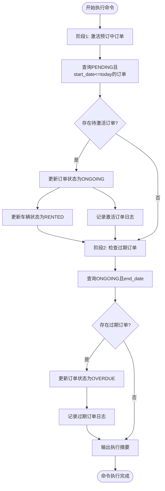

# 管理命令执行

<cite>
**本文档引用文件**   
- [update_expired_rentals.py](file://code/car_rental_system/rentals/management/commands/update_expired_rentals.py)
- [models.py](file://code/car_rental_system/rentals/models.py)
- [还车逻辑修改说明.md](file://code/car_rental_system/还车逻辑修改说明.md)
- [系统使用手册.md](file://code/car_rental_system/系统使用手册.md)
</cite>

## 目录
1. [引言](#引言)
2. [执行流程与设计原理](#执行流程与设计原理)
3. [命令调用方式与定时任务配置](#命令调用方式与定时任务配置)
4. [实际执行日志示例](#实际执行日志示例)

## 引言
`update_expired_rentals.py` 是租车管理系统中的一个 Django 管理命令，用于自动更新租赁订单的状态。该命令在系统中扮演着关键角色，确保订单状态能够根据时间自动流转，同时避免了过期订单被自动完成的问题。根据《还车逻辑修改说明.md》的描述，系统已移除自动完成订单的功能，现在仅将过期订单标记为“已超时未归还”（OVERDUE），而不会自动完成订单。这一变更使得订单的完成必须由用户手动归还车辆后触发，从而提高了系统的灵活性和安全性。

本文档将深入解析该管理命令的执行流程和设计原理，重点阐述其两个核心阶段：激活预订中订单和检查过期订单。此外，还将详细说明命令的输出日志格式、执行摘要统计信息，并提供调用方式及定时任务配置建议。

**Section sources**
- [update_expired_rentals.py](file://code/car_rental_system/rentals/management/commands/update_expired_rentals.py#L1-L191)
- [还车逻辑修改说明.md](file://code/car_rental_system/还车逻辑修改说明.md#L1-L229)

## 执行流程与设计原理

`update_expired_rentals.py` 的执行流程分为两个核心阶段：第一阶段调用 `_activate_pending_rentals` 方法激活预订中订单，第二阶段通过 `_check_expired_rentals` 方法检查并处理过期订单。整个流程由 `Command.handle` 方法驱动，确保每日订单状态的正确更新。

### 第一阶段：激活预订中订单

该阶段的目标是将所有满足条件的“预订中”（PENDING）订单激活为“进行中”（ONGOING）状态。具体逻辑如下：

1. **查询待激活订单**：使用 `Rental.objects.filter()` 查询所有状态为 `PENDING` 且开始日期小于等于当前日期的订单。
2. **更新订单状态**：遍历查询结果，将每个符合条件的订单状态更新为 `ONGOING`，并保存到数据库。
3. **同步车辆状态**：对于每个被激活的订单，检查其关联车辆的状态。如果车辆当前状态为“可用”（AVAILABLE），则将其更新为“已租”（RENTED）。
4. **事务性操作**：整个更新过程在 `transaction.atomic()` 上下文中执行，确保数据一致性。

此阶段完成后，系统会输出激活的订单数量和车辆数量，供运维人员确认执行结果。

### 第二阶段：检查过期订单

该阶段的目标是识别并处理所有已过期但尚未归还的“进行中”（ONGOING）订单。根据《还车逻辑修改说明.md》的变更，系统不再自动完成这些订单，而是将其状态更新为“已超时未归还”（OVERDUE），以提醒管理员或客户及时处理。

具体逻辑如下：

1. **查询过期订单**：使用 `Rental.objects.filter()` 查询所有状态为 `ONGOING` 且结束日期早于当前日期的订单。
2. **计算超时天数**：对于每个过期订单，计算其超时天数（即当前日期与结束日期之间的差值）。
3. **更新订单状态**：将每个过期订单的状态更新为 `OVERDUE`，并保存到数据库。
4. **记录日志信息**：输出每个过期订单的详细信息，包括订单号、客户姓名、车牌号、超时天数和计划结束日期。
5. **事务性操作**：同样在 `transaction.atomic()` 上下文中执行，确保状态更新的原子性。

此阶段完成后，系统会输出过期订单的数量，并提示“这些订单需要在还车时处理，系统会自动计算超时费用”。

### 设计原理

该命令的设计遵循了以下原则：

- **状态分离**：订单的完成不再依赖于时间自动触发，而是依赖于用户的归还操作。这使得系统能够更准确地反映实际业务流程。
- **可追溯性**：通过日志输出，运维人员可以清晰地看到每次执行的结果，包括激活和过期的订单详情。
- **事务安全**：所有数据库操作均在事务中执行，防止部分更新导致的数据不一致问题。
- **性能优化**：使用 `select_related` 提前加载关联对象（如 `vehicle` 和 `customer`），减少数据库查询次数，提升执行效率。



**Diagram sources**
- [update_expired_rentals.py](file://code/car_rental_system/rentals/management/commands/update_expired_rentals.py#L15-L45)

**Section sources**
- [update_expired_rentals.py](file://code/car_rental_system/rentals/management/commands/update_expired_rentals.py#L46-L142)
- [models.py](file://code/car_rental_system/rentals/models.py#L12-L115)

## 命令调用方式与定时任务配置

### 调用方式

该管理命令可以通过 Django 的 `manage.py` 脚本直接调用，命令格式如下：

```bash
python manage.py update_expired_rentals
```

执行后，系统将在控制台输出详细的执行日志，包括当前日期、激活订单数、过期订单数以及执行摘要。

### 定时任务配置

为了确保订单状态能够实时更新，建议将该命令配置为定时任务，每 5-10 分钟执行一次。以下是两种常见的配置方式：

#### Linux 系统（使用 cron）

编辑 crontab 文件：

```bash
crontab -e
```

添加以下行，表示每 5 分钟执行一次：

```bash
*/5 * * * * cd /path/to/car_rental_system && python manage.py update_expired_rentals >> /var/log/update_expired_rentals.log 2>&1
```

#### Windows 系统（使用任务计划程序）

1. 打开“任务计划程序”。
2. 创建基本任务，设置名称为“更新过期租赁订单”。
3. 设置触发器为“每天”，并选择“重复任务间隔”为“5分钟”，持续时间为“无限期”。
4. 在操作中选择“启动程序”，程序路径为 `python`，参数为 `manage.py update_expired_rentals`，起始于目录为项目根目录。
5. 完成设置并保存。

建议将日志输出重定向到文件，便于后续排查问题。

**Section sources**
- [系统使用手册.md](file://code/car_rental_system/系统使用手册.md#L153-L159)
- [update_expired_rentals.py](file://code/car_rental_system/rentals/management/commands/update_expired_rentals.py#L15-L45)

## 实际执行日志示例

以下是一个典型的命令执行日志输出示例：

```
开始执行订单状态自动更新...
当前日期: 2025-04-05

[阶段1] 激活预订中订单
发现 2 个待激活订单
  - 订单 #1001: 张三 - 粤A12345 (2025-04-05 ~ 2025-04-07)
    → 车辆 粤A12345 状态已更新为"已租"
  - 订单 #1002: 李四 - 粤B67890 (2025-04-05 ~ 2025-04-08)
    → 车辆 粤B67890 状态已更新为"已租"

✓ 已成功激活 2 个订单, 更新 2 个车辆状态

[阶段2] 检查过期订单
发现 1 个过期订单，正在更新状态为"已超时未归还"：
  - 订单 #1003: 王五 - 粤C11111 （过期 2 天，计划结束日期：2025-04-03）
    → 订单状态已更新为"已超时未归还"

✓ 已成功更新 1 个订单状态为"已超时未归还"

注意：这些订单需要在还车时处理，系统会自动计算超时费用。

============================================================
执行完成!
激活订单数量: 2
激活车辆数量: 2
过期订单数量: 1 (需手动还车)
============================================================

注意：订单只有在用户还车后才能完成，请提醒客户及时还车。
```

### 日志说明

- **正常输出**：绿色文字表示成功信息，如“已成功激活 X 个订单”。
- **警告信息**：黄色文字表示提醒或需要注意的情况，如“过期订单数量: X (需手动还车)”。
- **执行摘要**：包含激活订单数、激活车辆数和过期订单数，便于快速了解执行结果。
- **注意事项**：提示运维人员过期订单不会自动完成，需手动处理。

该日志格式清晰明了，有助于运维人员快速判断系统状态并采取相应措施。

**Section sources**
- [update_expired_rentals.py](file://code/car_rental_system/rentals/management/commands/update_expired_rentals.py#L19-L45)