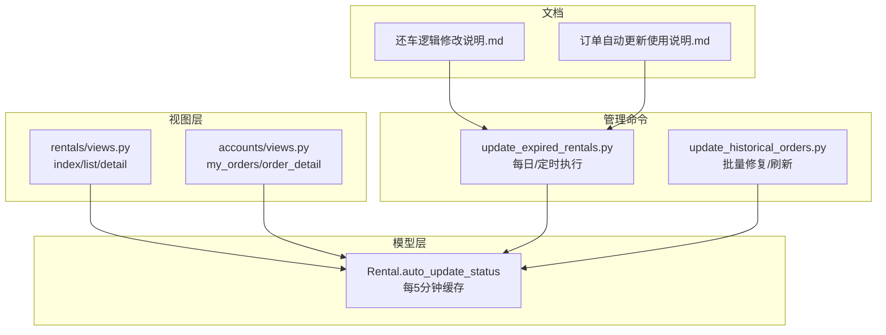
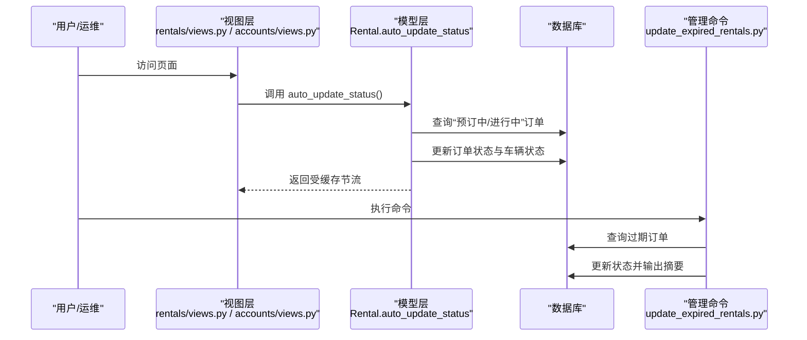
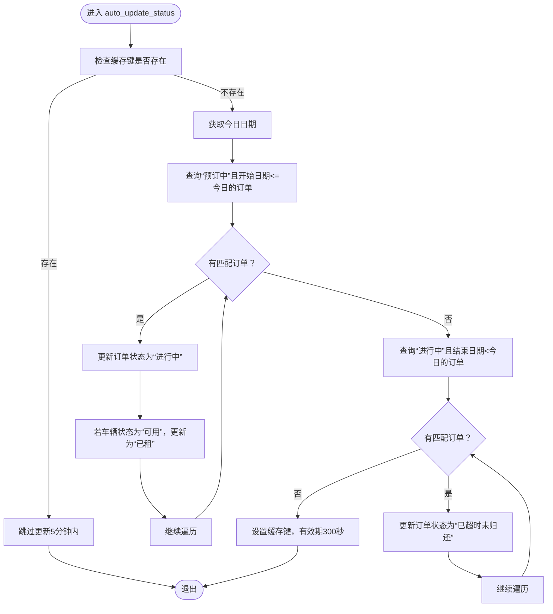
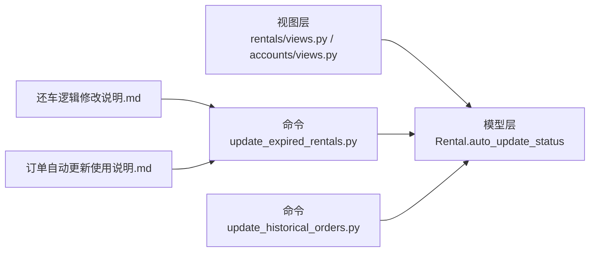

# 自动更新机制

<cite>
**本文引用的文件**
- [rentals/models.py](file://code/car_rental_system/rentals/models.py)
- [rentals/management/commands/update_expired_rentals.py](file://code/car_rental_system/rentals/management/commands/update_expired_rentals.py)
- [rentals/management/commands/update_historical_orders.py](file://code/car_rental_system/rentals/management/commands/update_historical_orders.py)
- [rentals/views.py](file://code/car_rental_system/rentals/views.py)
- [accounts/views.py](file://code/car_rental_system/accounts/views.py)
- [还车逻辑修改说明.md](file://code/car_rental_system/还车逻辑修改说明.md)
- [订单自动更新使用说明.md](file://code/car_rental_system/订单自动更新使用说明.md)
</cite>

## 目录
1. [简介](#简介)
2. [项目结构](#项目结构)
3. [核心组件](#核心组件)
4. [架构概览](#架构概览)
5. [详细组件分析](#详细组件分析)
6. [依赖关系分析](#依赖关系分析)
7. [性能考量](#性能考量)
8. [故障排查指南](#故障排查指南)
9. [结论](#结论)

## 简介
本章节聚焦租赁管理系统中的“自动更新机制”，涵盖两方面：
- 模型级自动更新：Rental.auto_update_status 类方法，通过缓存限制（每5分钟最多执行一次），将到达开始日期的“预订中”订单更新为“进行中”，并将超过结束日期的“进行中”订单标记为“已超时未归还”。
- 管理命令自动检查：Django 自定义命令 update_expired_rentals，周期性执行订单状态检查与车辆状态同步，强调“过期订单不会自动完成，必须通过手动还车流程处理”。

同时，依据还车逻辑修改说明，系统已移除自动完成订单的功能，过期订单仅作状态提醒，需由客户在还车时完成结算与订单关闭。

## 项目结构
围绕自动更新机制的关键文件与职责如下：
- 模型层：Rental.auto_update_status 负责自动状态推进与缓存控制
- 视图层：多个页面视图在请求入口处调用 auto_update_status，确保用户看到最新状态
- 管理命令：update_expired_rentals 执行批量状态检查与车辆状态同步
- 历史订单命令：update_historical_orders 支持批量历史订单修复与财务刷新
- 文档说明：还车逻辑修改说明、订单自动更新使用说明

图表来源
- [rentals/models.py](file://code/car_rental_system/rentals/models.py#L171-L229)
- [rentals/views.py](file://code/car_rental_system/rentals/views.py#L1-L200)
- [accounts/views.py](file://code/car_rental_system/accounts/views.py#L800-L999)
- [rentals/management/commands/update_expired_rentals.py](file://code/car_rental_system/rentals/management/commands/update_expired_rentals.py#L1-L191)
- [rentals/management/commands/update_historical_orders.py](file://code/car_rental_system/rentals/management/commands/update_historical_orders.py#L1-L311)
- [还车逻辑修改说明.md](file://code/car_rental_system/还车逻辑修改说明.md#L1-L229)
- [订单自动更新使用说明.md](file://code/car_rental_system/订单自动更新使用说明.md#L1-L157)

章节来源
- [rentals/models.py](file://code/car_rental_system/rentals/models.py#L171-L229)
- [rentals/views.py](file://code/car_rental_system/rentals/views.py#L1-L200)
- [accounts/views.py](file://code/car_rental_system/accounts/views.py#L800-L999)
- [rentals/management/commands/update_expired_rentals.py](file://code/car_rental_system/rentals/management/commands/update_expired_rentals.py#L1-L191)
- [rentals/management/commands/update_historical_orders.py](file://code/car_rental_system/rentals/management/commands/update_historical_orders.py#L1-L311)
- [还车逻辑修改说明.md](file://code/car_rental_system/还车逻辑修改说明.md#L1-L229)
- [订单自动更新使用说明.md](file://code/car_rental_system/订单自动更新使用说明.md#L1-L157)

## 核心组件
- Rental.auto_update_status 类方法
  - 功能：在缓存允许的前提下，将“预订中”到达开始日期的订单更新为“进行中”，并将“进行中”超过结束日期的订单更新为“已超时未归还”
  - 缓存策略：使用键名为“rental_status_auto_update”的缓存，若存在则直接返回，避免频繁更新
  - 事务保护：使用原子事务包裹更新操作，保证一致性
  - 车辆联动：当订单状态从“预订中”变为“进行中”时，若车辆状态为“可用”，则同步更新为“已租”

- 管理命令 update_expired_rentals
  - 功能：分阶段执行订单状态检查与车辆状态同步，明确标注“订单只有在用户还车后才完成”
  - 阶段划分：
    - 阶段1：激活“预订中”订单（预订中 → 进行中），并同步车辆状态
    - 阶段2：检查“进行中”过期订单（进行中 → 已超时未归还），仅提醒，不自动完成
  - 输出：提供清晰的执行摘要与注意事项，强调过期订单需手动还车

- 历史订单命令 update_historical_orders
  - 功能：支持批量修复历史订单状态、退还已完成订单押金、退还已取消订单已支付金额、刷新所有订单财务信息
  - 特性：支持 --dry-run、--skip-* 等参数，便于预览与安全执行

章节来源
- [rentals/models.py](file://code/car_rental_system/rentals/models.py#L171-L229)
- [rentals/management/commands/update_expired_rentals.py](file://code/car_rental_system/rentals/management/commands/update_expired_rentals.py#L1-L191)
- [rentals/management/commands/update_historical_orders.py](file://code/car_rental_system/rentals/management/commands/update_historical_orders.py#L1-L311)

## 架构概览
自动更新机制在系统中的交互路径如下：
- 页面访问路径：用户访问首页、列表页、详情页时，视图层统一调用 Rental.auto_update_status，确保即时状态更新
- 命令执行路径：运维通过定时任务或手动执行 update_expired_rentals，对过期订单进行检查与状态更新，并同步车辆状态
- 历史修复路径：在数据异常或迁移后，使用 update_historical_orders 批量修复与刷新

图表来源
- [rentals/views.py](file://code/car_rental_system/rentals/views.py#L1-L200)
- [accounts/views.py](file://code/car_rental_system/accounts/views.py#L800-L999)
- [rentals/models.py](file://code/car_rental_system/rentals/models.py#L171-L229)
- [rentals/management/commands/update_expired_rentals.py](file://code/car_rental_system/rentals/management/commands/update_expired_rentals.py#L1-L191)

## 详细组件分析

### 模型：Rental.auto_update_status
- 缓存节流
  - 键名：rental_status_auto_update
  - 有效期：300秒（5分钟）
  - 作用：避免高频重复更新，降低数据库压力
- 状态推进
  - “预订中”到达开始日期 → “进行中”
  - “进行中”超过结束日期 → “已超时未归还”
- 车辆联动
  - 订单状态变更为“进行中”且车辆为“可用”时，同步更新为“已租”
- 事务与容错
  - 使用原子事务包裹更新，失败时记录日志但不影响主流程

图表来源
- [rentals/models.py](file://code/car_rental_system/rentals/models.py#L171-L229)

章节来源
- [rentals/models.py](file://code/car_rental_system/rentals/models.py#L171-L229)

### 视图：页面入口自动触发
- 在首页、列表页、详情页等关键页面，视图层在处理请求前调用 Rental.auto_update_status，确保用户看到最新状态
- 账户模块的“我的订单”、“订单详情”也做相同处理，保障一致性

章节来源
- [rentals/views.py](file://code/car_rental_system/rentals/views.py#L1-L200)
- [accounts/views.py](file://code/car_rental_system/accounts/views.py#L800-L999)

### 管理命令：update_expired_rentals
- 执行流程
  - 阶段1：激活“预订中”订单（预订中 → 进行中），并同步车辆状态
  - 阶段2：检查“进行中”过期订单（进行中 → 已超时未归还），仅提醒，不自动完成
- 输出要点
  - 提供执行摘要（激活订单数量、激活车辆数量、过期订单数量）
  - 明确提示“订单只有在用户还车后才能完成”，强调过期订单需手动还车
- 与还车逻辑的关系
  - 根据还车逻辑修改说明，系统已移除自动完成订单的功能，过期订单不会自动完成，必须通过手动还车流程处理

章节来源
- [rentals/management/commands/update_expired_rentals.py](file://code/car_rental_system/rentals/management/commands/update_expired_rentals.py#L1-L191)
- [还车逻辑修改说明.md](file://code/car_rental_system/还车逻辑修改说明.md#L1-L229)

### 历史订单命令：update_historical_orders
- 功能范围
  - 更新订单状态（PENDING→ONGOING，ONGOING→OVERDUE）
  - 退还已完成订单押金
  - 退还已取消订单已支付金额
  - 刷新所有订单财务信息
- 可选参数
  - --dry-run：预览模式，不实际更新
  - --skip-status/--skip-deposit/--skip-financials：跳过对应步骤
- 适用场景
  - 数据迁移后修复、历史遗留问题处理、批量财务核对

章节来源
- [rentals/management/commands/update_historical_orders.py](file://code/car_rental_system/rentals/management/commands/update_historical_orders.py#L1-L311)

## 依赖关系分析
- 模型依赖
  - auto_update_status 依赖 Django 缓存与事务，查询 Rental 与 Vehicle 关联对象
- 视图依赖
  - 多个视图在请求入口调用 auto_update_status，确保状态一致
- 命令依赖
  - update_expired_rentals 依赖 Rental、Vehicle、Payment 等模型，执行状态更新与财务刷新
- 文档依赖
  - 还车逻辑修改说明明确了“过期订单不会自动完成”的业务规则
  - 订单自动更新使用说明提供了命令调用方式与定时任务配置示例

图表来源
- [rentals/views.py](file://code/car_rental_system/rentals/views.py#L1-L200)
- [accounts/views.py](file://code/car_rental_system/accounts/views.py#L800-L999)
- [rentals/models.py](file://code/car_rental_system/rentals/models.py#L171-L229)
- [rentals/management/commands/update_expired_rentals.py](file://code/car_rental_system/rentals/management/commands/update_expired_rentals.py#L1-L191)
- [rentals/management/commands/update_historical_orders.py](file://code/car_rental_system/rentals/management/commands/update_historical_orders.py#L1-L311)
- [还车逻辑修改说明.md](file://code/car_rental_system/还车逻辑修改说明.md#L1-L229)
- [订单自动更新使用说明.md](file://code/car_rental_system/订单自动更新使用说明.md#L1-L157)

## 性能考量
- 缓存节流
  - auto_update_status 使用5分钟缓存，避免高频重复更新，降低数据库压力
- 原子事务
  - 更新过程使用事务包裹，保证一致性，失败不影响整体流程
- 查询索引
  - 模型定义了针对 start_date、end_date、status 的索引，有助于提升查询效率
- 命令执行粒度
  - 管理命令分阶段执行，避免一次性处理大量数据导致阻塞

章节来源
- [rentals/models.py](file://code/car_rental_system/rentals/models.py#L171-L229)
- [rentals/models.py](file://code/car_rental_system/rentals/models.py#L158-L169)

## 故障排查指南
- 命令执行日志
  - 管理命令会输出阶段摘要与注意事项，运维可通过日志定位问题
  - 示例输出要点：
    - 阶段1：激活“预订中”订单数量、激活车辆数量
    - 阶段2：过期订单数量与状态更新提示
    - 提醒：订单只有在用户还车后才能完成
- 缓存导致的延迟
  - 若短时间内未看到状态更新，可能受5分钟缓存限制；等待或手动执行命令
- 数据一致性
  - 命令使用事务，若出现异常，建议检查数据库连接与权限
- 过期订单处理
  - 管理命令仅提醒过期订单，不自动完成；需引导客户手动还车

章节来源
- [rentals/management/commands/update_expired_rentals.py](file://code/car_rental_system/rentals/management/commands/update_expired_rentals.py#L1-L191)
- [rentals/models.py](file://code/car_rental_system/rentals/models.py#L171-L229)

## 结论
- Rental.auto_update_status 通过缓存节流与事务保护，稳定推进订单状态，减少人工干预
- 管理命令 update_expired_rentals 提供了可靠的自动化检查与同步能力，明确标注“过期订单不会自动完成”，需通过手动还车流程处理
- 历史订单命令 update_historical_orders 为数据修复与财务核对提供强力工具
- 运维应结合业务规则，合理配置定时任务与监控告警，确保系统状态准确、流程顺畅