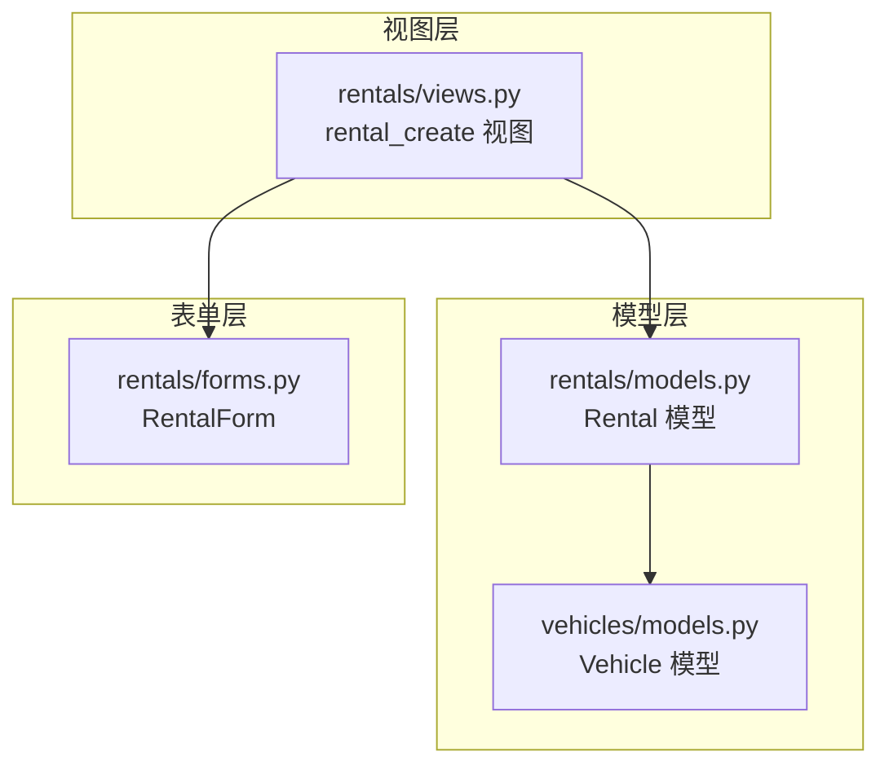
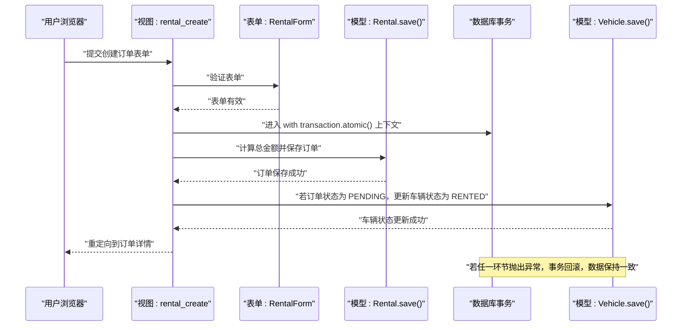
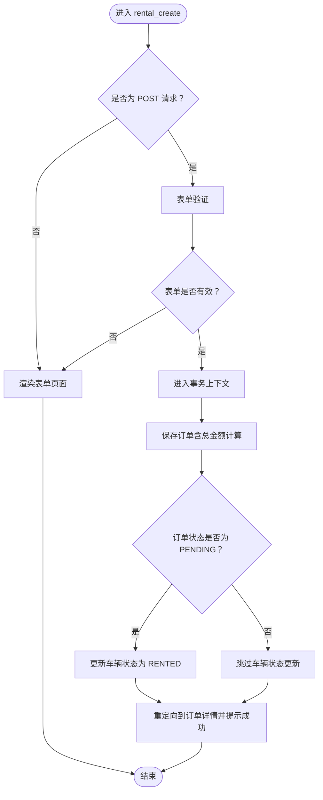
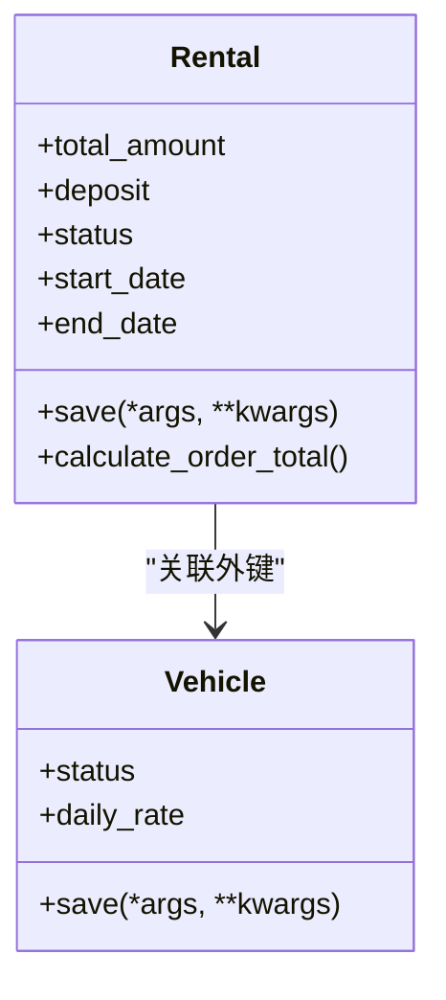
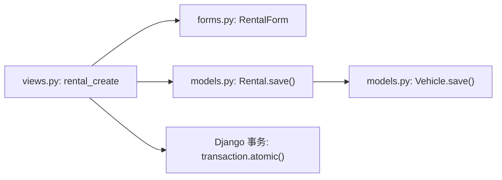

# 事务处理机制

<cite>
**本文引用的文件**
- [views.py](file://code/car_rental_system/rentals/views.py)
- [models.py](file://code/car_rental_system/rentals/models.py)
- [forms.py](file://code/car_rental_system/rentals/forms.py)
- [vehicles/models.py](file://code/car_rental_system/vehicles/models.py)
</cite>

## 目录
1. [简介](#简介)
2. [项目结构](#项目结构)
3. [核心组件](#核心组件)
4. [架构概览](#架构概览)
5. [详细组件分析](#详细组件分析)
6. [依赖分析](#依赖分析)
7. [性能考量](#性能考量)
8. [故障排查指南](#故障排查指南)
9. [结论](#结论)

## 简介
本文件聚焦于“rental_create”视图中的事务处理机制，系统性说明如何使用 Django 的 transaction.atomic() 装饰器确保订单创建与车辆状态更新的原子性，以及当车辆状态更新失败时如何回滚以保证数据一致性。文档结合 Rental 模型的 save 方法，阐述在事务中“先保存订单再更新车辆状态”的执行顺序，并提供事务执行的时序图与异常处理策略，帮助读者在理解业务逻辑的同时掌握工程实践要点。

## 项目结构
围绕订单创建与车辆状态联动的关键文件如下：
- 视图层：rentals/views.py 中的 rental_create 视图
- 模型层：rentals/models.py 中的 Rental 模型及其 save 方法
- 表单层：rentals/forms.py 中的 RentalForm
- 车辆模型：vehicles/models.py 中的 Vehicle 模型（状态字段）

图表来源
- [views.py](file://code/car_rental_system/rentals/views.py#L154-L187)
- [models.py](file://code/car_rental_system/rentals/models.py#L246-L271)
- [vehicles/models.py](file://code/car_rental_system/vehicles/models.py#L1-L85)
- [forms.py](file://code/car_rental_system/rentals/forms.py#L1-L121)

章节来源
- [views.py](file://code/car_rental_system/rentals/views.py#L154-L187)
- [models.py](file://code/car_rental_system/rentals/models.py#L246-L271)
- [vehicles/models.py](file://code/car_rental_system/vehicles/models.py#L1-L85)
- [forms.py](file://code/car_rental_system/rentals/forms.py#L1-L121)

## 核心组件
- rental_create 视图：在 POST 请求中使用事务包裹订单创建与车辆状态更新，确保两者要么同时成功，要么同时失败。
- Rental 模型 save 方法：在保存订单时计算总金额与押金等字段，为事务内的数据一致性提供基础。
- Vehicle 模型：提供 status 字段，作为订单状态联动更新的目标对象。
- RentalForm：负责表单校验与初始值设置，减少视图层的重复逻辑。

章节来源
- [views.py](file://code/car_rental_system/rentals/views.py#L154-L187)
- [models.py](file://code/car_rental_system/rentals/models.py#L246-L271)
- [vehicles/models.py](file://code/car_rental_system/vehicles/models.py#L1-L85)
- [forms.py](file://code/car_rental_system/rentals/forms.py#L1-L121)

## 架构概览
下图展示“创建订单并更新车辆状态”的整体调用链与事务边界。

图表来源
- [views.py](file://code/car_rental_system/rentals/views.py#L154-L187)
- [models.py](file://code/car_rental_system/rentals/models.py#L246-L271)

## 详细组件分析

### 1) 视图层：rental_create 的事务处理
- 事务边界：使用 Django 的 transaction.atomic() 将“保存订单 + 更新车辆状态”包裹在一个事务中，确保原子性。
- 执行顺序：
  - 先通过表单计算并设置总金额，再保存订单。
  - 若订单状态为 PENDING，则将对应车辆状态更新为 RENTED。
- 异常处理策略：
  - 由于事务回滚机制的存在，若保存订单或更新车辆状态过程中发生异常，数据库会自动回滚，不会出现“订单已创建但车辆状态未更新”的半成品数据。
  - 成功后通过重定向返回订单详情页面，并提示成功消息。

图表来源
- [views.py](file://code/car_rental_system/rentals/views.py#L154-L187)

章节来源
- [views.py](file://code/car_rental_system/rentals/views.py#L154-L187)

### 2) 模型层：Rental.save 的数据准备
- 在保存订单前，Rental.save 会根据起止日期与日租金计算总金额；并依据客户会员等级决定押金金额。
- 该逻辑确保事务内“订单金额”字段在保存前即已确定，避免后续状态更新时因金额不一致导致的数据问题。

图表来源
- [models.py](file://code/car_rental_system/rentals/models.py#L246-L271)
- [vehicles/models.py](file://code/car_rental_system/vehicles/models.py#L1-L85)

章节来源
- [models.py](file://code/car_rental_system/rentals/models.py#L246-L271)

### 3) 表单层：RentalForm 的约束与默认值
- 表单在创建新订单时设置默认状态为 PENDING、默认取车地点为“门店”，并过滤出 AVAILABLE 的车辆，避免在表单层面引入非法状态。
- 通过 HiddenInput 隐藏押金与异地还车费用字段，由后端统一计算，减少前端错误。

章节来源
- [forms.py](file://code/car_rental_system/rentals/forms.py#L1-L121)

### 4) 车辆状态模型：Vehicle.status
- 车辆状态枚举包含 AVAILABLE、RENTED、MAINTENANCE，视图层在订单状态为 PENDING 时将车辆状态置为 RENTED，从而保证业务一致性。

章节来源
- [vehicles/models.py](file://code/car_rental_system/vehicles/models.py#L1-L85)

## 依赖分析
- 视图依赖：
  - forms.RentalForm：用于表单验证与初始值设置。
  - models.Rental：用于保存订单并触发金额与押金计算。
  - models.Vehicle：用于更新车辆状态。
- 事务依赖：
  - Django transaction.atomic()：确保订单保存与车辆状态更新在同一个数据库事务中执行，失败即回滚。

图表来源
- [views.py](file://code/car_rental_system/rentals/views.py#L154-L187)
- [forms.py](file://code/car_rental_system/rentals/forms.py#L1-L121)
- [models.py](file://code/car_rental_system/rentals/models.py#L246-L271)

章节来源
- [views.py](file://code/car_rental_system/rentals/views.py#L154-L187)
- [forms.py](file://code/car_rental_system/rentals/forms.py#L1-L121)
- [models.py](file://code/car_rental_system/rentals/models.py#L246-L271)

## 性能考量
- 事务粒度：将“保存订单 + 更新车辆状态”放入同一事务，避免中间态数据暴露，提升一致性，同时不会显著增加锁竞争，因为只涉及少量写操作。
- 业务前置校验：表单层已过滤可用车辆并设置默认状态，减少视图层的重复判断与数据库查询。
- 金额计算：Rental.save 内部计算总金额与押金，避免多次往返数据库，降低网络开销。

## 故障排查指南
- 现象：订单创建成功但车辆状态未更新
  - 排查要点：确认订单状态是否为 PENDING；检查车辆状态是否为 AVAILABLE；确认事务内保存车辆状态的分支是否被执行。
  - 参考路径：[views.py](file://code/car_rental_system/rentals/views.py#L154-L187)
- 现象：事务异常导致订单与车辆状态不一致
  - 排查要点：查看异常堆栈与数据库日志；确认异常是否抛出在事务块内；利用事务回滚特性定位问题点。
  - 参考路径：[views.py](file://code/car_rental_system/rentals/views.py#L154-L187)
- 现象：订单金额与押金不符合预期
  - 排查要点：核对 Rental.save 的金额与押金计算逻辑；检查客户会员等级与日租金配置。
  - 参考路径：[models.py](file://code/car_rental_system/rentals/models.py#L246-L271)

章节来源
- [views.py](file://code/car_rental_system/rentals/views.py#L154-L187)
- [models.py](file://code/car_rental_system/rentals/models.py#L246-L271)

## 结论
通过在 rental_create 视图中使用 Django 的 transaction.atomic()，系统实现了“订单创建 + 车辆状态更新”的强一致事务控制。Rental.save 在事务前完成金额与押金的计算，确保数据在保存阶段即处于一致状态。一旦任一环节失败，事务回滚将保证数据库不留下半成品数据。配合表单层的严格校验与车辆状态枚举约束，系统在业务正确性与工程可靠性方面均得到保障。