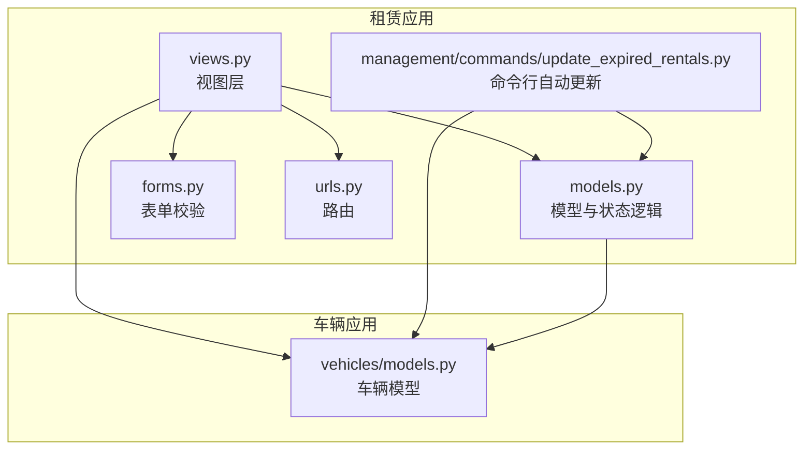
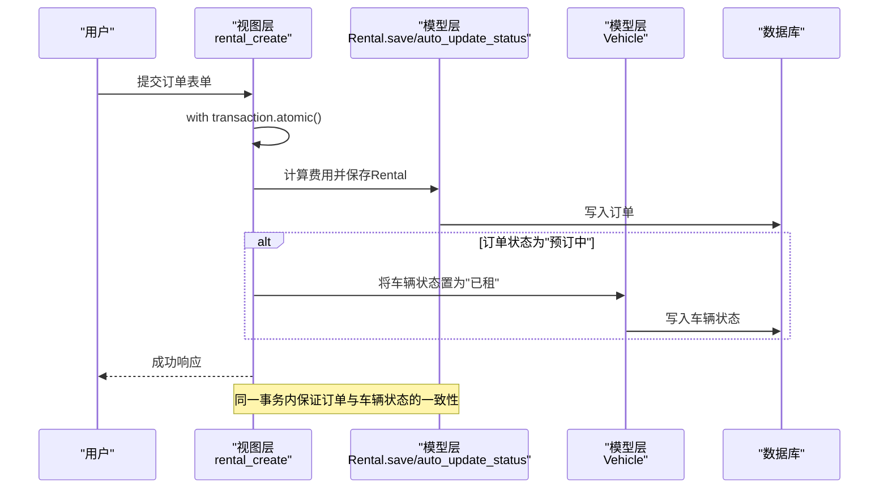
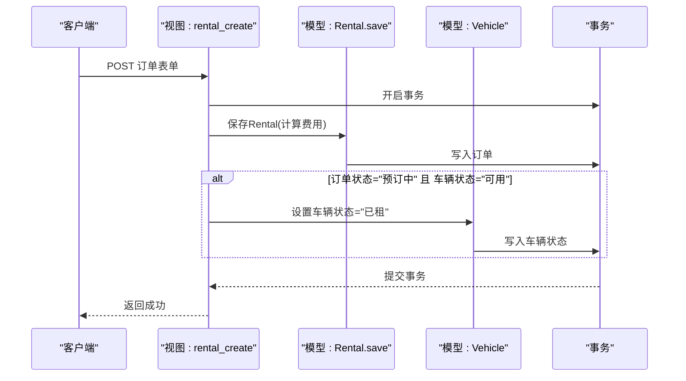
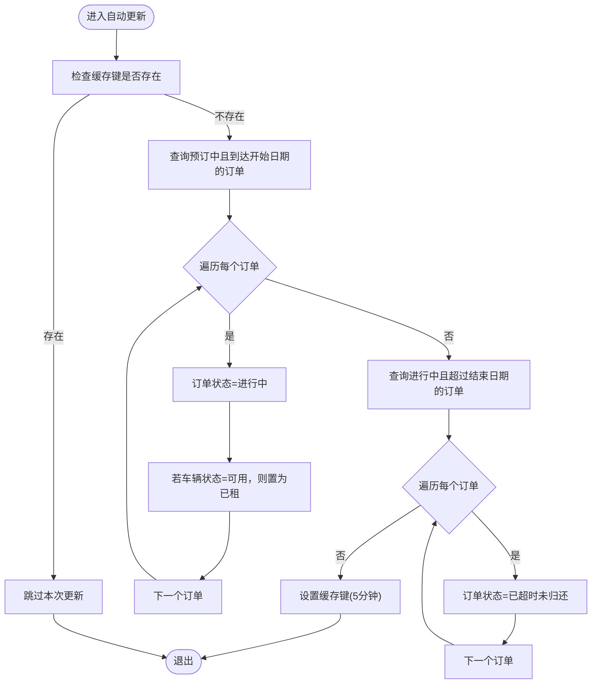
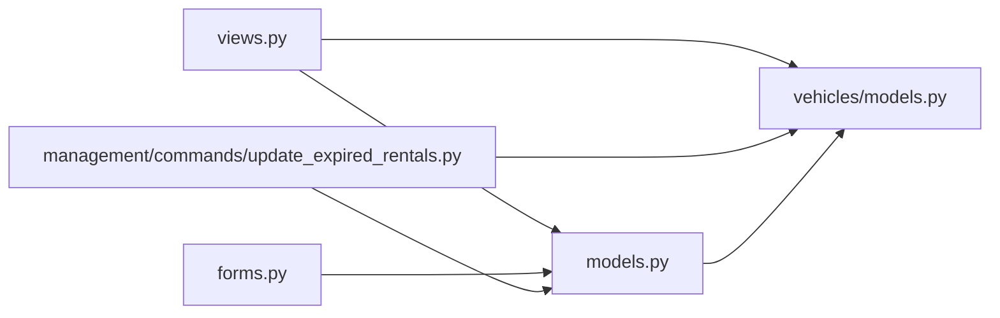

# 状态联动更新

<cite>
**本文引用的文件**
- [models.py](file://code/car_rental_system/rentals/models.py)
- [views.py](file://code/car_rental_system/rentals/views.py)
- [vehicles/models.py](file://code/car_rental_system/vehicles/models.py)
- [forms.py](file://code/car_rental_system/rentals/forms.py)
- [urls.py](file://code/car_rental_system/rentals/urls.py)
- [management/commands/update_expired_rentals.py](file://code/car_rental_system/rentals/management/commands/update_expired_rentals.py)
- [test_order_status_update.py](file://code/car_rental_system/test_order_status_update.py)
- [test_auto_update.py](file://code/car_rental_system/test_auto_update.py)
</cite>

## 目录
1. [简介](#简介)
2. [项目结构](#项目结构)
3. [核心组件](#核心组件)
4. [架构总览](#架构总览)
5. [详细组件分析](#详细组件分析)
6. [依赖关系分析](#依赖关系分析)
7. [性能考量](#性能考量)
8. [故障排查指南](#故障排查指南)
9. [结论](#结论)

## 简介
本文件聚焦“订单创建后车辆状态的联动更新机制”，围绕以下目标展开：
- 解析rental_create视图如何在订单创建时将关联车辆状态更新为“已租”
- 使用Django事务确保订单创建与车辆状态更新的原子性
- 结合Rental模型的save方法与auto_update_status类方法，说明状态变更的触发条件与缓存优化策略
- 提供状态更新的序列图与异常处理机制，保障数据一致性

## 项目结构
围绕订单与车辆状态联动更新的相关模块如下：
- 租赁订单应用：rentals
  - models.py：定义Rental模型及状态自动更新逻辑
  - views.py：提供订单创建、状态更新、归还、取消等视图，并在关键路径使用事务
  - forms.py：表单层校验与过滤，影响可用车辆选择
  - urls.py：路由映射
  - management/commands：命令行工具，批量执行状态更新
- 车辆应用：vehicles
  - models.py：定义Vehicle模型，包含状态枚举与索引

图表来源
- [views.py](file://code/car_rental_system/rentals/views.py#L154-L187)
- [models.py](file://code/car_rental_system/rentals/models.py#L171-L229)
- [vehicles/models.py](file://code/car_rental_system/vehicles/models.py#L1-L85)
- [urls.py](file://code/car_rental_system/rentals/urls.py#L1-L22)
- [management/commands/update_expired_rentals.py](file://code/car_rental_system/rentals/management/commands/update_expired_rentals.py#L1-L191)

章节来源
- [views.py](file://code/car_rental_system/rentals/views.py#L154-L187)
- [models.py](file://code/car_rental_system/rentals/models.py#L171-L229)
- [vehicles/models.py](file://code/car_rental_system/vehicles/models.py#L1-L85)
- [urls.py](file://code/car_rental_system/rentals/urls.py#L1-L22)

## 核心组件
- Rental模型
  - 状态字段与状态枚举：支持“预订中”“进行中”“已超时未归还”“已完成”“已取消”
  - auto_update_status类方法：定时自动激活预订中订单并更新过期订单状态，同时联动车辆状态
  - save方法：计算总金额、押金、异地还车费用等
- Vehicle模型
  - 状态字段与状态枚举：支持“可用”“已租”“维修中”
- 视图层
  - rental_create：创建订单并联动更新车辆状态
  - rental_status_update：基于状态转换规则联动更新车辆状态
  - rental_return：归还流程中综合处理订单完成与车辆状态释放
  - rental_cancel：取消流程中处理退款与车辆状态恢复
- 表单层
  - RentalForm：过滤可用车辆、日期与异地还车逻辑校验
- 命令行工具
  - update_expired_rentals：批量激活预订中订单并更新过期订单状态

章节来源
- [models.py](file://code/car_rental_system/rentals/models.py#L12-L170)
- [models.py](file://code/car_rental_system/rentals/models.py#L171-L229)
- [models.py](file://code/car_rental_system/rentals/models.py#L246-L271)
- [vehicles/models.py](file://code/car_rental_system/vehicles/models.py#L1-L85)
- [views.py](file://code/car_rental_system/rentals/views.py#L154-L187)
- [views.py](file://code/car_rental_system/rentals/views.py#L234-L267)
- [views.py](file://code/car_rental_system/rentals/views.py#L279-L392)
- [views.py](file://code/car_rental_system/rentals/views.py#L395-L466)
- [forms.py](file://code/car_rental_system/rentals/forms.py#L11-L121)
- [forms.py](file://code/car_rental_system/rentals/forms.py#L122-L275)
- [management/commands/update_expired_rentals.py](file://code/car_rental_system/rentals/management/commands/update_expired_rentals.py#L1-L191)

## 架构总览
订单创建与车辆状态联动更新的关键路径如下：
- 用户提交订单表单 → 视图层使用事务包裹订单创建与车辆状态更新 → 保存Rental实例 → 若订单状态为“预订中”且车辆可用，则将车辆状态置为“已租”
- 后台自动任务与视图层均调用Rental.auto_update_status，按日期条件激活“预订中”订单并更新“进行中”过期订单，同时联动车辆状态
- 归还与取消流程中，依据业务规则释放车辆状态或恢复为“可用”

图表来源
- [views.py](file://code/car_rental_system/rentals/views.py#L154-L187)
- [models.py](file://code/car_rental_system/rentals/models.py#L246-L271)

章节来源
- [views.py](file://code/car_rental_system/rentals/views.py#L154-L187)
- [models.py](file://code/car_rental_system/rentals/models.py#L171-L229)

## 详细组件分析

### 订单创建时的车辆状态联动更新
- 触发点：用户在创建订单时，若订单状态为“预订中”，且车辆当前状态为“可用”，则在事务内将车辆状态更新为“已租”
- 关键实现位置：
  - 视图层事务包裹与状态更新：[views.py](file://code/car_rental_system/rentals/views.py#L154-L187)
  - 模型层save方法（计算费用等）：[models.py](file://code/car_rental_system/rentals/models.py#L246-L271)
- 事务保障：使用Django事务确保订单写入与车辆状态更新在同一事务中，避免部分更新导致的数据不一致

图表来源
- [views.py](file://code/car_rental_system/rentals/views.py#L154-L187)
- [models.py](file://code/car_rental_system/rentals/models.py#L246-L271)

章节来源
- [views.py](file://code/car_rental_system/rentals/views.py#L154-L187)
- [models.py](file://code/car_rental_system/rentals/models.py#L246-L271)

### auto_update_status类方法与缓存优化
- 触发条件：
  - “预订中”订单：当到达开始日期时，自动激活为“进行中”，并联动将车辆状态置为“已租”
  - “进行中”订单：当超过结束日期时，自动更新为“已超时未归还”
- 缓存策略：使用缓存键限制自动更新频率（示例中为5分钟），避免频繁更新造成性能压力
- 事务保障：在自动更新过程中使用事务，确保订单与车辆状态更新的原子性
- 实现位置：
  - 自动更新逻辑与缓存控制：[models.py](file://code/car_rental_system/rentals/models.py#L171-L229)
  - 命令行批量更新（后台任务）：[management/commands/update_expired_rentals.py](file://code/car_rental_system/rentals/management/commands/update_expired_rentals.py#L1-L191)

图表来源
- [models.py](file://code/car_rental_system/rentals/models.py#L171-L229)
- [management/commands/update_expired_rentals.py](file://code/car_rental_system/rentals/management/commands/update_expired_rentals.py#L46-L143)

章节来源
- [models.py](file://code/car_rental_system/rentals/models.py#L171-L229)
- [management/commands/update_expired_rentals.py](file://code/car_rental_system/rentals/management/commands/update_expired_rentals.py#L1-L191)

### 状态变更的触发条件与业务规则
- 订单状态转换规则（由表单层约束）：
  - “预订中” → “进行中”/“已取消”
  - “进行中” → “已完成”/“已取消”
  - “已完成”/“已取消”不可再转换
- 视图层状态更新联动：
  - “预订中”→“进行中”：将车辆状态置为“已租”
  - “进行中”→“已完成”：若无其他进行中订单，将车辆状态置为“可用”
  - “已取消”：若车辆为“已租”，将其置为“可用”
- 归还流程：
  - 将订单状态置为“已完成”，并检查是否存在其他进行中订单
  - 若无其他进行中订单，将车辆状态置为“可用”
- 取消流程：
  - 将订单状态置为“已取消”，若有已支付金额则退款
  - 若车辆为“已租”，将其置为“可用”

章节来源
- [forms.py](file://code/car_rental_system/rentals/forms.py#L277-L310)
- [views.py](file://code/car_rental_system/rentals/views.py#L234-L267)
- [views.py](file://code/car_rental_system/rentals/views.py#L279-L392)
- [views.py](file://code/car_rental_system/rentals/views.py#L395-L466)

### 事务与异常处理
- 事务使用：
  - 订单创建：在视图层使用with transaction.atomic()包裹订单保存与车辆状态更新
  - 状态更新：在视图层状态更新与归还流程中使用事务
  - 自动更新：在模型层auto_update_status与命令行批量更新中使用事务
- 异常处理：
  - 自动更新：捕获异常并记录日志，避免影响主流程
  - 命令行：输出执行摘要与注意事项，便于运维核验

章节来源
- [views.py](file://code/car_rental_system/rentals/views.py#L154-L187)
- [views.py](file://code/car_rental_system/rentals/views.py#L234-L267)
- [views.py](file://code/car_rental_system/rentals/views.py#L279-L392)
- [models.py](file://code/car_rental_system/rentals/models.py#L171-L229)
- [management/commands/update_expired_rentals.py](file://code/car_rental_system/rentals/management/commands/update_expired_rentals.py#L1-L191)

## 依赖关系分析
- 模块耦合
  - views依赖models与vehicles模型，用于读取与更新状态
  - models依赖vehicles模型以访问车辆状态
  - forms依赖models进行过滤与校验
  - 命令行工具依赖models与vehicles进行批量更新
- 外部依赖
  - Django事务与缓存框架
  - Django ORM查询与索引

图表来源
- [views.py](file://code/car_rental_system/rentals/views.py#L154-L187)
- [models.py](file://code/car_rental_system/rentals/models.py#L171-L229)
- [vehicles/models.py](file://code/car_rental_system/vehicles/models.py#L1-L85)
- [forms.py](file://code/car_rental_system/rentals/forms.py#L11-L121)
- [management/commands/update_expired_rentals.py](file://code/car_rental_system/rentals/management/commands/update_expired_rentals.py#L1-L191)

章节来源
- [views.py](file://code/car_rental_system/rentals/views.py#L154-L187)
- [models.py](file://code/car_rental_system/rentals/models.py#L171-L229)
- [vehicles/models.py](file://code/car_rental_system/vehicles/models.py#L1-L85)
- [forms.py](file://code/car_rental_system/rentals/forms.py#L11-L121)
- [management/commands/update_expired_rentals.py](file://code/car_rental_system/rentals/management/commands/update_expired_rentals.py#L1-L191)

## 性能考量
- 缓存优化
  - auto_update_status使用缓存键限制更新频率（示例为5分钟），减少数据库压力
  - 视图层在列表页与详情页使用缓存优化筛选选项加载
- 索引优化
  - Rental与Vehicle模型均建立索引，提升查询效率
- 事务粒度
  - 将订单与车辆状态更新置于同一事务，避免中间态导致的并发问题
- 批量处理
  - 命令行工具批量处理，减少单条记录更新带来的开销

章节来源
- [models.py](file://code/car_rental_system/rentals/models.py#L171-L229)
- [views.py](file://code/car_rental_system/rentals/views.py#L60-L126)
- [vehicles/models.py](file://code/car_rental_system/vehicles/models.py#L68-L85)

## 故障排查指南
- 现象：订单创建后车辆状态未更新
  - 检查视图层事务是否正确包裹订单保存与车辆状态更新
  - 确认订单状态是否为“预订中”，且车辆状态为“可用”
  - 查看日志中是否有异常
- 现象：自动更新未生效
  - 检查缓存键是否仍处于冷却期
  - 确认日期条件是否满足（开始日期到达、结束日期过期）
  - 使用命令行工具手动执行批量更新并观察输出
- 现象：并发场景下状态不一致
  - 确保所有状态更新均在事务中执行
  - 检查是否存在外部脚本绕过视图层直接修改状态

章节来源
- [views.py](file://code/car_rental_system/rentals/views.py#L154-L187)
- [models.py](file://code/car_rental_system/rentals/models.py#L171-L229)
- [management/commands/update_expired_rentals.py](file://code/car_rental_system/rentals/management/commands/update_expired_rentals.py#L1-L191)

## 结论
- 订单创建与车辆状态联动更新通过Django事务得到强一致保障
- auto_update_status与命令行工具共同覆盖前台与后台的自动化状态维护
- 缓存与索引策略有效降低更新频率与查询成本
- 表单层与视图层的状态转换规则清晰，配合事务与异常处理，确保数据一致性与可维护性