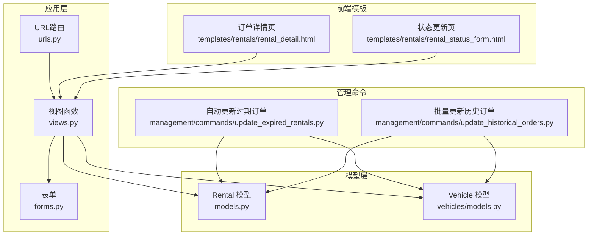
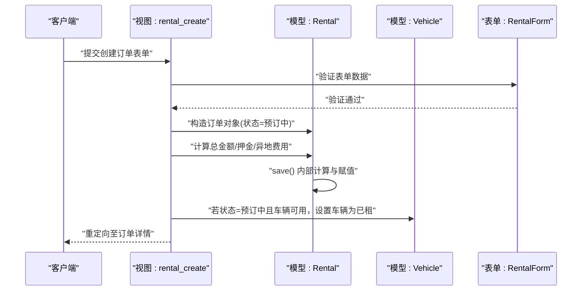
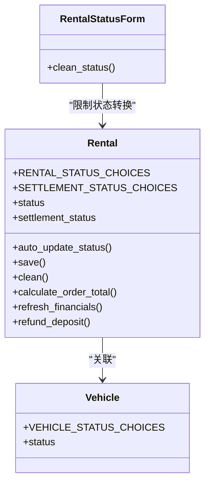
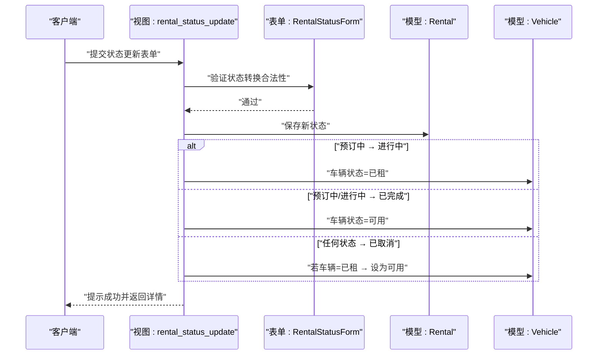
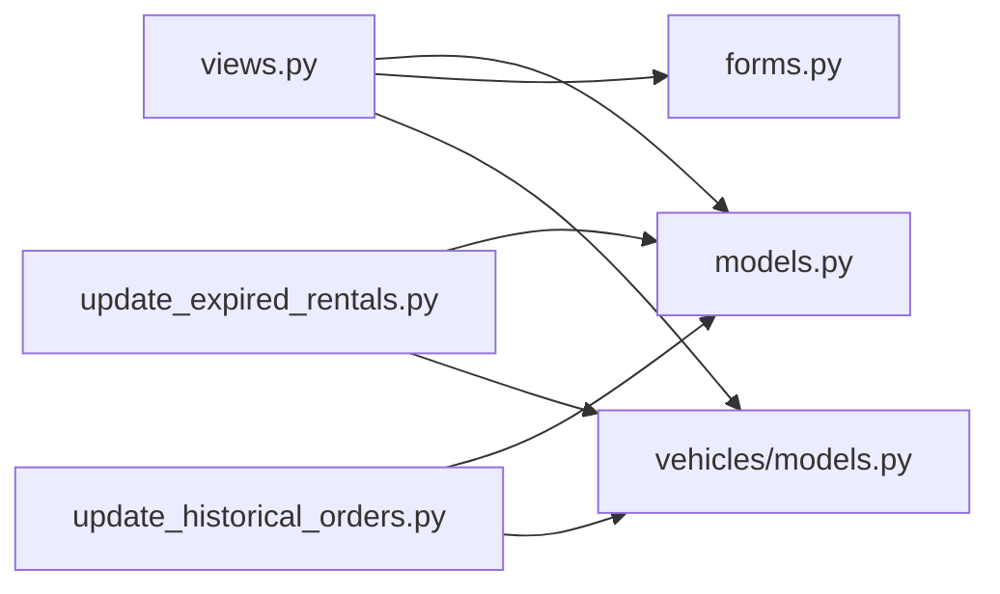

# 状态转换逻辑

<cite>
**本文引用的文件**
- [models.py](file://code/car_rental_system/rentals/models.py)
- [views.py](file://code/car_rental_system/rentals/views.py)
- [forms.py](file://code/car_rental_system/rentals/forms.py)
- [urls.py](file://code/car_rental_system/rentals/urls.py)
- [vehicles/models.py](file://code/car_rental_system/vehicles/models.py)
- [management/commands/update_expired_rentals.py](file://code/car_rental_system/rentals/management/commands/update_expired_rentals.py)
- [management/commands/update_historical_orders.py](file://code/car_rental_system/rentals/management/commands/update_historical_orders.py)
- [templates/rentals/rental_detail.html](file://code/car_rental_system/templates/rentals/rental_detail.html)
- [templates/rentals/rental_status_form.html](file://code/car_rental_system/templates/rentals/rental_status_form.html)
- [test_order_status_update.py](file://code/car_rental_system/test_order_status_update.py)
</cite>

## 目录
1. [简介](#简介)
2. [项目结构](#项目结构)
3. [核心组件](#核心组件)
4. [架构概览](#架构概览)
5. [详细组件分析](#详细组件分析)
6. [依赖关系分析](#依赖关系分析)
7. [性能考量](#性能考量)
8. [故障排查指南](#故障排查指南)
9. [结论](#结论)
10. [附录](#附录)

## 简介
本文件系统化阐述“订单状态从‘预订中’到‘已租’（即‘进行中’）”的完整转换路径，覆盖以下关键环节：
- 视图层：rental_create 的调用链与 save 方法执行时机
- 模型层：Rental 模型的状态机定义与自动更新逻辑
- 车辆状态联动：订单状态变更如何驱动车辆状态变化
- 管理员手动更新：rental_status_update 的业务校验与状态转换规则
- 前端交互：订单详情页与状态更新表单的展示与提交流程

## 项目结构
围绕订单状态转换的关键模块与文件如下：
- 模型层：Rental 模型定义状态机、自动更新与财务刷新
- 视图层：rental_create、rental_status_update、rental_return 等视图处理业务流程
- 表单层：RentalForm、RentalStatusForm 提供数据校验与状态转换约束
- 车辆模型：Vehicle 定义车辆状态枚举，与订单状态联动
- 管理命令：自动更新历史订单与过期订单
- 前端模板：订单详情页与状态更新页，展示状态与提供操作入口

图表来源
- [views.py](file://code/car_rental_system/rentals/views.py#L1-L563)
- [models.py](file://code/car_rental_system/rentals/models.py#L1-L401)
- [forms.py](file://code/car_rental_system/rentals/forms.py#L1-L364)
- [urls.py](file://code/car_rental_system/rentals/urls.py#L1-L22)
- [vehicles/models.py](file://code/car_rental_system/vehicles/models.py#L1-L85)
- [management/commands/update_expired_rentals.py](file://code/car_rental_system/rentals/management/commands/update_expired_rentals.py#L1-L191)
- [management/commands/update_historical_orders.py](file://code/car_rental_system/rentals/management/commands/update_historical_orders.py#L1-L311)
- [templates/rentals/rental_detail.html](file://code/car_rental_system/templates/rentals/rental_detail.html#L1-L385)
- [templates/rentals/rental_status_form.html](file://code/car_rental_system/templates/rentals/rental_status_form.html#L1-L96)

章节来源
- [urls.py](file://code/car_rental_system/rentals/urls.py#L1-L22)
- [views.py](file://code/car_rental_system/rentals/views.py#L1-L563)
- [models.py](file://code/car_rental_system/rentals/models.py#L1-L401)
- [forms.py](file://code/car_rental_system/rentals/forms.py#L1-L364)
- [vehicles/models.py](file://code/car_rental_system/vehicles/models.py#L1-L85)
- [management/commands/update_expired_rentals.py](file://code/car_rental_system/rentals/management/commands/update_expired_rentals.py#L1-L191)
- [management/commands/update_historical_orders.py](file://code/car_rental_system/rentals/management/commands/update_historical_orders.py#L1-L311)
- [templates/rentals/rental_detail.html](file://code/car_rental_system/templates/rentals/rental_detail.html#L1-L385)
- [templates/rentals/rental_status_form.html](file://code/car_rental_system/templates/rentals/rental_status_form.html#L1-L96)

## 核心组件
- Rental 模型
  - 定义订单状态机：预订中、进行中、已超时未归还、已完成、已取消
  - 定义结算状态机：未结算、部分结算、已结算
  - 提供自动更新逻辑：基于日期自动激活与过期标记
  - 提供 save 逻辑：计算总金额、押金、异地还车费用等
  - 提供财务刷新与押金退还能力
- Vehicle 模型
  - 定义车辆状态机：可用、已租、维修中
  - 与 Rental 状态联动，保证一致性
- 视图层
  - rental_create：创建订单并设置初始状态与车辆状态
  - rental_status_update：管理员手动更新状态并联动车辆状态
  - rental_return：归还流程，最终将订单置为已完成并释放车辆
- 表单层
  - RentalForm：创建/编辑订单的数据校验与默认值
  - RentalStatusForm：管理员更新状态的合法性校验
- 管理命令
  - 自动更新过期订单与历史订单，保障系统一致性

章节来源
- [models.py](file://code/car_rental_system/rentals/models.py#L1-L401)
- [vehicles/models.py](file://code/car_rental_system/vehicles/models.py#L1-L85)
- [views.py](file://code/car_rental_system/rentals/views.py#L1-L563)
- [forms.py](file://code/car_rental_system/rentals/forms.py#L1-L364)
- [management/commands/update_expired_rentals.py](file://code/car_rental_system/rentals/management/commands/update_expired_rentals.py#L1-L191)
- [management/commands/update_historical_orders.py](file://code/car_rental_system/rentals/management/commands/update_historical_orders.py#L1-L311)

## 架构概览
下面以序列图展示“从预订中到已租”的完整转换路径，涵盖视图调用、模型保存与车辆状态联动。

图表来源
- [views.py](file://code/car_rental_system/rentals/views.py#L154-L187)
- [models.py](file://code/car_rental_system/rentals/models.py#L246-L271)
- [forms.py](file://code/car_rental_system/rentals/forms.py#L11-L121)

章节来源
- [views.py](file://code/car_rental_system/rentals/views.py#L154-L187)
- [models.py](file://code/car_rental_system/rentals/models.py#L246-L271)
- [forms.py](file://code/car_rental_system/rentals/forms.py#L11-L121)

## 详细组件分析

### 状态机与合法转换规则
Rental 模型定义了订单状态机与结算状态机，并在表单层对管理员手动更新进行了严格的合法性校验。

图表来源
- [models.py](file://code/car_rental_system/rentals/models.py#L12-L136)
- [models.py](file://code/car_rental_system/rentals/models.py#L171-L229)
- [models.py](file://code/car_rental_system/rentals/models.py#L246-L333)
- [vehicles/models.py](file://code/car_rental_system/vehicles/models.py#L6-L12)
- [forms.py](file://code/car_rental_system/rentals/forms.py#L277-L309)

- 状态机定义
  - 订单状态：预订中、进行中、已超时未归还、已完成、已取消
  - 结算状态：未结算、部分结算、已结算
- 合法转换规则（管理员手动更新）
  - 预订中 → 进行中 或 已取消
  - 进行中 → 已完成 或 已取消
  - 已完成/已取消 不再允许转换
- 自动更新规则
  - 预订中 → 进行中：到达开始日期
  - 进行中 → 已超时未归还：超过结束日期
  - 自动更新通过缓存控制频率，避免频繁写入

章节来源
- [models.py](file://code/car_rental_system/rentals/models.py#L12-L136)
- [models.py](file://code/car_rental_system/rentals/models.py#L171-L229)
- [forms.py](file://code/car_rental_system/rentals/forms.py#L277-L309)

### 视图调用与 save 方法执行
- rental_create
  - 接收表单数据，计算总金额并保存订单
  - 若订单状态为“预订中”，且车辆状态为“可用”，将车辆状态更新为“已租”
  - 重定向至订单详情
- rental_update
  - 修改订单时，若状态变更为“预订中”，且车辆状态为“可用”，将车辆状态更新为“已租”
- rental_status_update
  - 管理员手动更新状态时，严格校验转换规则
  - 根据状态变化联动车辆状态：
    - 预订中 → 进行中：车辆设为“已租”
    - 预订中/进行中 → 已完成：车辆设为“可用”
    - 任何状态 → 已取消：若车辆为“已租”，车辆设为“可用”

图表来源
- [views.py](file://code/car_rental_system/rentals/views.py#L234-L276)
- [forms.py](file://code/car_rental_system/rentals/forms.py#L277-L309)

章节来源
- [views.py](file://code/car_rental_system/rentals/views.py#L154-L187)
- [views.py](file://code/car_rental_system/rentals/views.py#L190-L231)
- [views.py](file://code/car_rental_system/rentals/views.py#L234-L276)
- [forms.py](file://code/car_rental_system/rentals/forms.py#L277-L309)

### 车辆状态变更与一致性保障
- 车辆状态机：可用、已租、维修中
- 关键联动点
  - 订单状态=预订中 且 车辆状态=可用 → 保存订单后将车辆状态=已租
  - 订单状态=预订中/进行中 → 已完成 → 将车辆状态=可用
  - 订单状态=已取消 → 若车辆=已租 → 将车辆状态=可用
- 自动更新命令
  - 历史订单与过期订单的批量更新，确保系统一致性

章节来源
- [vehicles/models.py](file://code/car_rental_system/vehicles/models.py#L6-L12)
- [views.py](file://code/car_rental_system/rentals/views.py#L154-L187)
- [views.py](file://code/car_rental_system/rentals/views.py#L234-L276)
- [management/commands/update_expired_rentals.py](file://code/car_rental_system/rentals/management/commands/update_expired_rentals.py#L46-L143)
- [management/commands/update_historical_orders.py](file://code/car_rental_system/rentals/management/commands/update_historical_orders.py#L96-L165)

### 前端交互与业务校验
- 订单详情页
  - 展示当前订单状态与操作入口（如“车辆归还”、“取消订单”）
  - 提供“更新订单状态”表单入口
- 状态更新页
  - 展示当前状态与可选目标状态
  - 提交后由表单层进行状态转换合法性校验
- 归还流程
  - 仅进行中或已超时未归还的订单可归还
  - 归还后订单置为已完成，车辆状态释放为可用
  - 自动计算超时费用、异地还车费用、退还押金并刷新财务信息

章节来源
- [templates/rentals/rental_detail.html](file://code/car_rental_system/templates/rentals/rental_detail.html#L1-L385)
- [templates/rentals/rental_status_form.html](file://code/car_rental_system/templates/rentals/rental_status_form.html#L1-L96)
- [views.py](file://code/car_rental_system/rentals/views.py#L279-L392)

## 依赖关系分析
- 视图依赖
  - views.py 依赖 models.py 中的 Rental.auto_update_status 与 save 逻辑
  - views.py 依赖 forms.py 中的表单校验
  - views.py 依赖 vehicles/models.py 中的 Vehicle 状态
- 模型依赖
  - models.py 依赖 accounts/models.py 用于财务刷新与退款
- 管理命令依赖
  - 管理命令依赖 models.py 与 vehicles/models.py 实现批量更新与退款

图表来源
- [views.py](file://code/car_rental_system/rentals/views.py#L1-L563)
- [models.py](file://code/car_rental_system/rentals/models.py#L1-L401)
- [forms.py](file://code/car_rental_system/rentals/forms.py#L1-L364)
- [vehicles/models.py](file://code/car_rental_system/vehicles/models.py#L1-L85)
- [management/commands/update_expired_rentals.py](file://code/car_rental_system/rentals/management/commands/update_expired_rentals.py#L1-L191)
- [management/commands/update_historical_orders.py](file://code/car_rental_system/rentals/management/commands/update_historical_orders.py#L1-L311)

章节来源
- [views.py](file://code/car_rental_system/rentals/views.py#L1-L563)
- [models.py](file://code/car_rental_system/rentals/models.py#L1-L401)
- [forms.py](file://code/car_rental_system/rentals/forms.py#L1-L364)
- [vehicles/models.py](file://code/car_rental_system/vehicles/models.py#L1-L85)
- [management/commands/update_expired_rentals.py](file://code/car_rental_system/rentals/management/commands/update_expired_rentals.py#L1-L191)
- [management/commands/update_historical_orders.py](file://code/car_rental_system/rentals/management/commands/update_historical_orders.py#L1-L311)

## 性能考量
- 自动更新缓存
  - auto_update_status 使用缓存避免每请求都更新，降低数据库压力
- 查询优化
  - 模型层为常用字段建立索引，提升筛选与排序性能
- 批量更新
  - 管理命令采用事务批量更新，减少锁竞争与写放大
- 前端缓存
  - 列表页使用缓存存储筛选选项，减少数据库查询

章节来源
- [models.py](file://code/car_rental_system/rentals/models.py#L158-L169)
- [views.py](file://code/car_rental_system/rentals/views.py#L61-L126)
- [management/commands/update_expired_rentals.py](file://code/car_rental_system/rentals/management/commands/update_expired_rentals.py#L1-L191)
- [management/commands/update_historical_orders.py](file://code/car_rental_system/rentals/management/commands/update_historical_orders.py#L1-L311)

## 故障排查指南
- 状态无法转换
  - 检查表单层状态转换规则是否满足：仅允许预订中→进行中/已取消；进行中→已完成/已取消
  - 确认当前订单状态与目标状态是否在允许范围内
- 车辆状态异常
  - 确认订单状态=预订中且车辆状态=可用时，是否正确设置车辆为已租
  - 确认订单完成或取消后，车辆状态是否被正确释放为可用
- 自动更新未生效
  - 检查缓存键是否存在，确认自动更新逻辑是否被跳过（缓存限制）
  - 使用管理命令手动执行批量更新，验证历史订单一致性
- 归还流程问题
  - 确认订单状态为进行中或已超时未归还
  - 确认实际还车日期与还车地点逻辑正确，超时费用与异地还车费用计算无误
  - 确认押金退还与财务刷新流程是否执行

章节来源
- [forms.py](file://code/car_rental_system/rentals/forms.py#L277-L309)
- [views.py](file://code/car_rental_system/rentals/views.py#L234-L276)
- [views.py](file://code/car_rental_system/rentals/views.py#L279-L392)
- [models.py](file://code/car_rental_system/rentals/models.py#L171-L229)
- [management/commands/update_expired_rentals.py](file://code/car_rental_system/rentals/management/commands/update_expired_rentals.py#L1-L191)
- [management/commands/update_historical_orders.py](file://code/car_rental_system/rentals/management/commands/update_historical_orders.py#L1-L311)

## 结论
- “预订中”到“已租”（进行中）的转换路径清晰：创建订单时若状态为预订中且车辆可用，系统将车辆状态置为已租；随后可通过自动更新或管理员手动更新实现状态推进
- 状态机与表单校验共同保障了业务合法性，避免非法状态转换
- 车辆状态与订单状态强一致，通过视图与管理命令实现批量与实时维护
- 建议在生产环境定期运行管理命令，确保历史订单与过期订单的一致性

## 附录
- 测试参考
  - 可参考测试脚本对自动更新逻辑进行验证，确保“预订中→进行中”与“进行中→已完成”的边界条件正确

章节来源
- [test_order_status_update.py](file://code/car_rental_system/test_order_status_update.py#L28-L287)