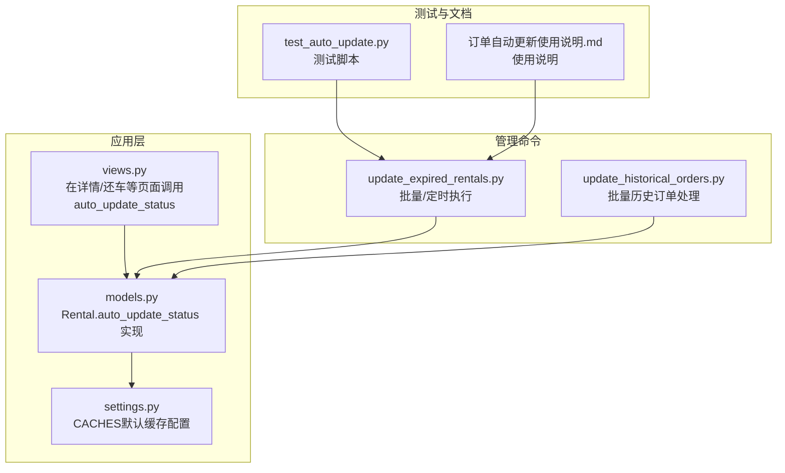
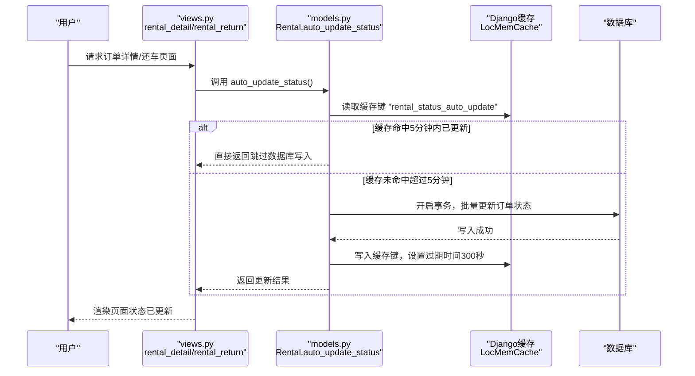
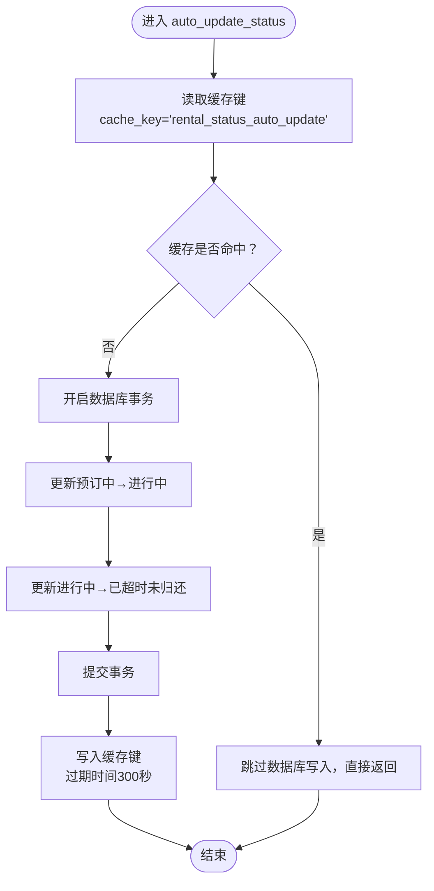
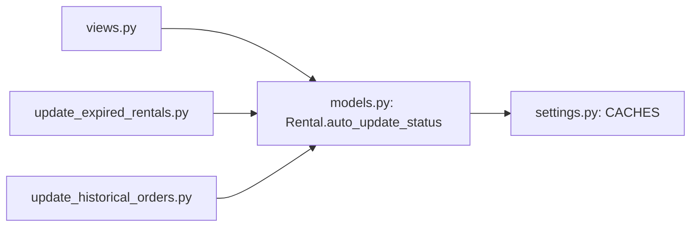

# 缓存优化策略

<cite>
**本文引用的文件**
- [models.py](file://code/car_rental_system/rentals/models.py)
- [views.py](file://code/car_rental_system/rentals/views.py)
- [settings.py](file://code/car_rental_system/car_rental_system/settings.py)
- [update_expired_rentals.py](file://code/car_rental_system/rentals/management/commands/update_expired_rentals.py)
- [update_historical_orders.py](file://code/car_rental_system/rentals/management/commands/update_historical_orders.py)
- [test_auto_update.py](file://code/car_rental_system/test_auto_update.py)
- [订单自动更新使用说明.md](file://code/car_rental_system/订单自动更新使用说明.md)
</cite>

## 目录
1. [简介](#简介)
2. [项目结构](#项目结构)
3. [核心组件](#核心组件)
4. [架构总览](#架构总览)
5. [详细组件分析](#详细组件分析)
6. [依赖关系分析](#依赖关系分析)
7. [性能考量](#性能考量)
8. [故障排查指南](#故障排查指南)
9. [结论](#结论)
10. [附录](#附录)

## 简介
本文件聚焦于Rental模型中的auto_update_status类方法，系统性解析其如何利用Django缓存框架实现“每5分钟最多执行一次”的状态更新频率控制。文档涵盖：
- 限流机制的设计与实现（cache_key='rental_status_auto_update'标记最近更新时间）
- 缓存失效策略与数据库事务一致性
- 性能优势与高并发稳定性保障
- 缓存命中率监控建议
- 与命令行自动更新脚本的协同关系

## 项目结构
围绕“状态自动更新”功能的相关模块与文件如下：
- 模型层：Rental模型包含状态字段与自动更新逻辑
- 视图层：在关键页面访问路径中调用auto_update_status，触发频率控制
- 管理命令：提供批量/定时执行的自动化脚本
- 配置层：Django缓存后端与超时时间设置
- 测试与说明：测试脚本与使用说明文档

图表来源
- [models.py](file://code/car_rental_system/rentals/models.py#L171-L229)
- [views.py](file://code/car_rental_system/rentals/views.py#L129-L151)
- [settings.py](file://code/car_rental_system/car_rental_system/settings.py#L141-L151)
- [update_expired_rentals.py](file://code/car_rental_system/rentals/management/commands/update_expired_rentals.py#L15-L41)
- [update_historical_orders.py](file://code/car_rental_system/rentals/management/commands/update_historical_orders.py#L96-L165)
- [test_auto_update.py](file://code/car_rental_system/test_auto_update.py#L184-L223)
- [订单自动更新使用说明.md](file://code/car_rental_system/订单自动更新使用说明.md#L1-L157)

章节来源
- [models.py](file://code/car_rental_system/rentals/models.py#L171-L229)
- [views.py](file://code/car_rental_system/rentals/views.py#L129-L151)
- [settings.py](file://code/car_rental_system/car_rental_system/settings.py#L141-L151)

## 核心组件
- auto_update_status类方法：在每次请求进入详情/还车等页面时，通过缓存键标记最近更新时间，实现每5分钟最多执行一次的限流。
- 视图层调用：在rental_detail与rental_return等关键路径中显式调用auto_update_status，确保页面展示状态最新。
- 管理命令：提供批量/定时执行的替代方案，适合后台任务调度与历史数据修复。
- 缓存配置：默认使用LocMemCache，TIMEOUT=300秒（5分钟），保证限流窗口一致。

章节来源
- [models.py](file://code/car_rental_system/rentals/models.py#L171-L229)
- [views.py](file://code/car_rental_system/rentals/views.py#L129-L151)
- [settings.py](file://code/car_rental_system/car_rental_system/settings.py#L141-L151)
- [update_expired_rentals.py](file://code/car_rental_system/rentals/management/commands/update_expired_rentals.py#L15-L41)
- [update_historical_orders.py](file://code/car_rental_system/rentals/management/commands/update_historical_orders.py#L96-L165)

## 架构总览
下面的序列图展示了“页面访问触发状态更新”的典型流程，突出缓存限流与数据库事务的协作。

图表来源
- [views.py](file://code/car_rental_system/rentals/views.py#L129-L151)
- [models.py](file://code/car_rental_system/rentals/models.py#L171-L229)
- [settings.py](file://code/car_rental_system/car_rental_system/settings.py#L141-L151)

## 详细组件分析

### auto_update_status方法的限流实现
- 缓存键命名：使用固定键名标记最近一次更新时间，便于全局统一限流。
- 读取缓存：若缓存存在且未过期（5分钟内），直接返回，避免重复写入。
- 事务包裹：在原子事务中执行批量状态更新，保证一致性。
- 写入缓存：更新成功后写入当前时间，设置过期时间为300秒，形成稳定的5分钟限流窗口。
- 异常处理：捕获异常并记录日志，不影响主流程，提升稳定性。

图表来源
- [models.py](file://code/car_rental_system/rentals/models.py#L171-L229)

章节来源
- [models.py](file://code/car_rental_system/rentals/models.py#L171-L229)

### 视图层调用与页面稳定性
- 在rental_detail与rental_return等关键路径中显式调用auto_update_status，确保用户看到最新状态。
- 由于限流机制的存在，即使同一用户快速刷新页面，也不会产生重复的数据库写入压力。
- 事务与缓存配合，避免了高并发下重复更新同一组订单的风险。

章节来源
- [views.py](file://code/car_rental_system/rentals/views.py#L129-L151)
- [views.py](file://code/car_rental_system/rentals/views.py#L279-L299)

### 缓存失效策略
- 固定键名+固定过期时间：键名稳定，过期时间统一，便于跨进程/多实例的一致性控制。
- 5分钟窗口：在高频访问场景下，有效降低数据库写入次数，同时保证状态更新的时效性。
- 与命令行脚本的关系：命令行脚本独立于页面访问，适合定时任务与批量修复；页面访问通过缓存限流避免冲突。

章节来源
- [models.py](file://code/car_rental_system/rentals/models.py#L171-L229)
- [settings.py](file://code/car_rental_system/car_rental_system/settings.py#L141-L151)
- [update_expired_rentals.py](file://code/car_rental_system/rentals/management/commands/update_expired_rentals.py#L15-L41)
- [update_historical_orders.py](file://code/car_rental_system/rentals/management/commands/update_historical_orders.py#L96-L165)

### 与命令行脚本的协同
- 命令行脚本提供批量/定时执行能力，适合后台任务调度与历史数据修复。
- 页面访问通过缓存限流避免与命令行脚本的重复更新冲突。
- 使用说明文档提供了Windows/Linux的定时任务配置建议，便于按需执行。

章节来源
- [update_expired_rentals.py](file://code/car_rental_system/rentals/management/commands/update_expired_rentals.py#L15-L41)
- [update_historical_orders.py](file://code/car_rental_system/rentals/management/commands/update_historical_orders.py#L96-L165)
- [订单自动更新使用说明.md](file://code/car_rental_system/订单自动更新使用说明.md#L44-L85)

## 依赖关系分析
- auto_update_status依赖Django缓存框架与数据库事务。
- 视图层对auto_update_status的调用构成“页面访问→状态更新”的关键链路。
- 管理命令作为独立执行单元，与页面访问解耦，互不干扰。

图表来源
- [views.py](file://code/car_rental_system/rentals/views.py#L129-L151)
- [models.py](file://code/car_rental_system/rentals/models.py#L171-L229)
- [settings.py](file://code/car_rental_system/car_rental_system/settings.py#L141-L151)
- [update_expired_rentals.py](file://code/car_rental_system/rentals/management/commands/update_expired_rentals.py#L15-L41)
- [update_historical_orders.py](file://code/car_rental_system/rentals/management/commands/update_historical_orders.py#L96-L165)

## 性能考量
- 读多写少的热点路径：auto_update_status在页面访问中被频繁调用，但通过缓存限流，写入操作被限制在每5分钟一次，显著降低数据库写压力。
- 事务批处理：在单次更新中批量处理多个订单，减少多次往返与锁竞争。
- 缓存命中率建议：
  - 通过日志统计auto_update_status的命中/未命中比例，评估限流效果。
  - 若命中率过高导致状态更新滞后，可适当延长缓存过期时间或引入更细粒度的键空间（如按站点/用户维度）。
  - 对于高并发场景，建议结合Redis等分布式缓存，确保多实例共享同一限流状态。
- 与命令行脚本的配合：在业务高峰期使用命令行脚本批量更新，页面访问仅做轻量级限流，避免峰值叠加。

[本节为通用性能讨论，无需列出具体文件来源]

## 故障排查指南
- 现象：页面状态长时间未更新
  - 排查：确认缓存键是否存在且未过期；检查日志中auto_update_status的错误输出。
  - 处理：等待缓存过期或手动清理缓存键，确保下次调用能执行更新。
- 现象：数据库写入异常
  - 排查：查看事务回滚原因与异常日志；确认数据库连接与锁等待情况。
  - 处理：修复异常后重试；必要时通过命令行脚本进行批量修复。
- 现象：高并发下状态不一致
  - 排查：确认是否同时存在页面访问与命令行脚本的更新；避免重复更新。
  - 处理：通过缓存限流窗口统一更新节奏；在高峰期优先使用命令行脚本集中更新。

章节来源
- [models.py](file://code/car_rental_system/rentals/models.py#L171-L229)
- [settings.py](file://code/car_rental_system/car_rental_system/settings.py#L141-L151)
- [update_expired_rentals.py](file://code/car_rental_system/rentals/management/commands/update_expired_rentals.py#L15-L41)
- [test_auto_update.py](file://code/car_rental_system/test_auto_update.py#L184-L223)

## 结论
Rental模型的auto_update_status通过固定键名+固定过期时间的缓存限流，实现了“每5分钟最多一次”的状态更新频率控制。该策略与数据库事务配合，既保证了状态更新的正确性与一致性，又在高并发场景下显著降低了数据库写压力。视图层的显式调用确保页面展示的实时性，而命令行脚本则提供了批量/定时执行的补充手段。建议在生产环境中结合日志与监控，持续评估缓存命中率与更新时效，必要时引入分布式缓存与更精细的限流策略。

[本节为总结性内容，无需列出具体文件来源]

## 附录
- 使用说明与定时任务配置参考：[订单自动更新使用说明.md](file://code/car_rental_system/订单自动更新使用说明.md#L44-L85)
- 测试脚本：[test_auto_update.py](file://code/car_rental_system/test_auto_update.py#L184-L223)

[本节为辅助信息，无需列出具体文件来源]