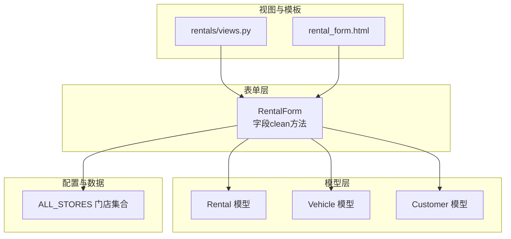
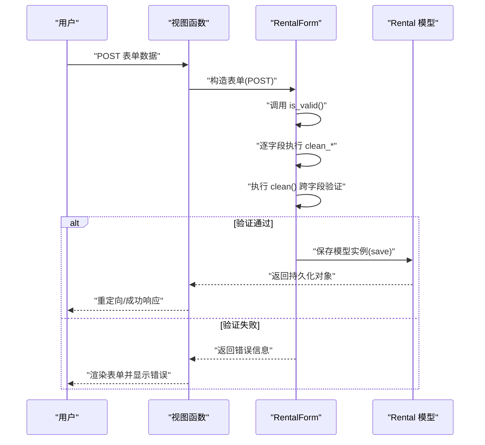
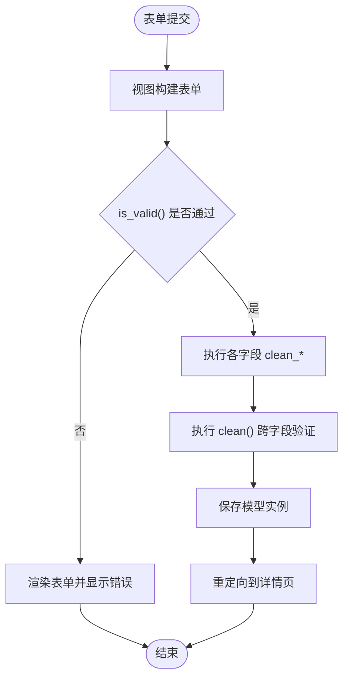
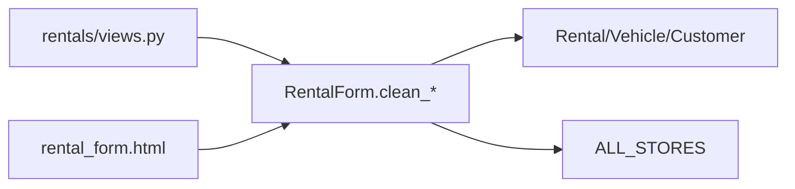

# 字段级验证

<cite>
**本文引用的文件**
- [rentals/forms.py](file://code/car_rental_system/rentals/forms.py)
- [rentals/models.py](file://code/car_rental_system/rentals/models.py)
- [vehicles/models.py](file://code/car_rental_system/vehicles/models.py)
- [customers/models.py](file://code/car_rental_system/customers/models.py)
- [accounts/store_locations.py](file://code/car_rental_system/accounts/store_locations.py)
- [rentals/views.py](file://code/car_rental_system/rentals/views.py)
- [templates/rentals/rental_form.html](file://code/car_rental_system/templates/rentals/rental_form.html)
</cite>

## 目录
1. [简介](#简介)
2. [项目结构](#项目结构)
3. [核心组件](#核心组件)
4. [架构总览](#架构总览)
5. [详细组件分析](#详细组件分析)
6. [依赖关系分析](#依赖关系分析)
7. [性能考量](#性能考量)
8. [故障排查指南](#故障排查指南)
9. [结论](#结论)

## 简介
本文件聚焦于 RentalForm 的字段级验证逻辑，逐项解析 customer、vehicle、start_date、end_date、deposit 和 cross_location_fee 字段的 clean 方法实现，重点阐述：
- clean_start_date 对“开始日期不得早于今天”的校验机制；
- clean_vehicle 对“车辆可用状态”的检查策略；
- 各字段的验证规则、错误处理方式与默认值设置策略；
- Django 表单字段验证的执行流程与前后端联动。

## 项目结构
围绕表单验证的核心文件分布如下：
- 表单层：rentals/forms.py 中的 RentalForm
- 模型层：rentals/models.py 中的 Rental；vehicles/models.py 中的 Vehicle；customers/models.py 中的 Customer
- 配置与数据源：accounts/store_locations.py 中的服务门店集合 ALL_STORES
- 视图与模板：rentals/views.py 中的表单处理逻辑；templates/rentals/rental_form.html 中的前端展示与交互

图表来源
- [rentals/forms.py](file://code/car_rental_system/rentals/forms.py#L1-L275)
- [rentals/models.py](file://code/car_rental_system/rentals/models.py#L1-L170)
- [vehicles/models.py](file://code/car_rental_system/vehicles/models.py#L1-L85)
- [customers/models.py](file://code/car_rental_system/customers/models.py#L1-L100)
- [accounts/store_locations.py](file://code/car_rental_system/accounts/store_locations.py#L1-L79)
- [rentals/views.py](file://code/car_rental_system/rentals/views.py#L154-L231)
- [templates/rentals/rental_form.html](file://code/car_rental_system/templates/rentals/rental_form.html#L1-L188)

章节来源
- [rentals/forms.py](file://code/car_rental_system/rentals/forms.py#L1-L275)
- [rentals/models.py](file://code/car_rental_system/rentals/models.py#L1-L170)
- [vehicles/models.py](file://code/car_rental_system/vehicles/models.py#L1-L85)
- [customers/models.py](file://code/car_rental_system/customers/models.py#L1-L100)
- [accounts/store_locations.py](file://code/car_rental_system/accounts/store_locations.py#L1-L79)
- [rentals/views.py](file://code/car_rental_system/rentals/views.py#L154-L231)
- [templates/rentals/rental_form.html](file://code/car_rental_system/templates/rentals/rental_form.html#L1-L188)

## 核心组件
- RentalForm：继承自 ModelForm，负责订单创建/编辑的字段级与跨字段验证，以及默认值设置与字段属性初始化。
- Vehicle 模型：提供车辆状态字段 status，作为 clean_vehicle 的关键依据。
- Customer 模型：提供会员等级 member_level，影响押金策略。
- ALL_STORES：服务门店集合，用于异地还车逻辑的校验与费用计算。

章节来源
- [rentals/forms.py](file://code/car_rental_system/rentals/forms.py#L1-L121)
- [vehicles/models.py](file://code/car_rental_system/vehicles/models.py#L1-L85)
- [customers/models.py](file://code/car_rental_system/customers/models.py#L1-L100)
- [accounts/store_locations.py](file://code/car_rental_system/accounts/store_locations.py#L1-L79)

## 架构总览
Django 表单验证的典型流程：
- 用户提交表单 → 视图接收请求 → 实例化表单 → 调用 is_valid() → 触发各字段的 clean_* 方法 → 调用 clean() 进行跨字段验证 → 通过后保存模型实例。

图表来源
- [rentals/views.py](file://code/car_rental_system/rentals/views.py#L154-L231)
- [rentals/forms.py](file://code/car_rental_system/rentals/forms.py#L122-L275)
- [rentals/models.py](file://code/car_rental_system/rentals/models.py#L230-L272)

## 详细组件分析

### 字段 clean_customer
- 验证规则
  - 必填校验：若未选择客户，抛出异常。
- 错误处理
  - 使用 ValidationError 抛出明确错误信息。
- 默认值策略
  - 表单初始化时未对 customer 设置默认值，保持由前端选择。
- 关键实现位置
  - clean_customer 方法位于 [rentals/forms.py](file://code/car_rental_system/rentals/forms.py#L122-L128)

章节来源
- [rentals/forms.py](file://code/car_rental_system/rentals/forms.py#L122-L128)

### 字段 clean_vehicle
- 验证规则
  - 必填校验：未选择车辆则抛错。
  - 可用性校验：仅当车辆状态为 AVAILABLE 时允许选择；更新订单时排除当前订单本身。
- 错误处理
  - 使用 ValidationError 抛出“当前不可用”错误。
- 默认值策略
  - 表单初始化时过滤出 AVAILABLE 的车辆供选择。
- 关键实现位置
  - clean_vehicle 方法位于 [rentals/forms.py](file://code/car_rental_system/rentals/forms.py#L129-L146)
  - 可用车辆过滤位于 [rentals/forms.py](file://code/car_rental_system/rentals/forms.py#L100-L104)

章节来源
- [rentals/forms.py](file://code/car_rental_system/rentals/forms.py#L100-L104)
- [rentals/forms.py](file://code/car_rental_system/rentals/forms.py#L129-L146)
- [vehicles/models.py](file://code/car_rental_system/vehicles/models.py#L1-L85)

### 字段 clean_start_date
- 验证规则
  - 必填校验：未选择开始日期则抛错。
  - 时间约束：开始日期不得早于今天。
- 错误处理
  - 使用 ValidationError 抛出“开始日期不得早于今天”的错误。
- 默认值策略
  - 新建订单时，默认开始日期与结束日期均为当天。
- 关键实现位置
  - clean_start_date 方法位于 [rentals/forms.py](file://code/car_rental_system/rentals/forms.py#L148-L158)
  - 默认值设置位于 [rentals/forms.py](file://code/car_rental_system/rentals/forms.py#L91-L98)

章节来源
- [rentals/forms.py](file://code/car_rental_system/rentals/forms.py#L91-L98)
- [rentals/forms.py](file://code/car_rental_system/rentals/forms.py#L148-L158)

### 字段 clean_end_date
- 验证规则
  - 必填校验：未选择结束日期则抛错。
- 错误处理
  - 使用 ValidationError 抛出“请选择结束日期”的错误。
- 默认值策略
  - 新建订单时，默认结束日期为当天。
- 关键实现位置
  - clean_end_date 方法位于 [rentals/forms.py](file://code/car_rental_system/rentals/forms.py#L160-L166)
  - 默认值设置位于 [rentals/forms.py](file://code/car_rental_system/rentals/forms.py#L91-L98)

章节来源
- [rentals/forms.py](file://code/car_rental_system/rentals/forms.py#L91-L98)
- [rentals/forms.py](file://code/car_rental_system/rentals/forms.py#L160-L166)

### 字段 clean_deposit
- 验证规则
  - 空值处理：若为 None 或空字符串，返回默认值 0.00。
  - 类型安全：字符串尝试转换为 Decimal，失败则回退为 0.00。
  - 数值范围：不得为负数。
  - 精度控制：统一保留两位小数。
- 错误处理
  - 若传入负数，抛出 ValidationError。
- 默认值策略
  - 表单初始化时 deposit 字段被隐藏，初始值为 0.00。
- 关键实现位置
  - clean_deposit 方法位于 [rentals/forms.py](file://code/car_rental_system/rentals/forms.py#L168-L189)
  - 默认值设置与隐藏控件位于 [rentals/forms.py](file://code/car_rental_system/rentals/forms.py#L116-L121)

章节来源
- [rentals/forms.py](file://code/car_rental_system/rentals/forms.py#L116-L121)
- [rentals/forms.py](file://code/car_rental_system/rentals/forms.py#L168-L189)

### 字段 clean_cross_location_fee
- 验证规则
  - 空值处理：若为 None 或空字符串，返回默认值 0.00。
  - 类型安全：字符串尝试转换为 Decimal，失败则回退为 0.00。
  - 数值范围：不得为负数。
  - 精度控制：统一保留两位小数。
- 错误处理
  - 若传入负数，抛出 ValidationError。
- 默认值策略
  - 表单初始化时 cross_location_fee 字段被隐藏，初始值为 0.00。
- 关键实现位置
  - clean_cross_location_fee 方法位于 [rentals/forms.py](file://code/car_rental_system/rentals/forms.py#L190-L211)
  - 默认值设置与隐藏控件位于 [rentals/forms.py](file://code/car_rental_system/rentals/forms.py#L116-L121)

章节来源
- [rentals/forms.py](file://code/car_rental_system/rentals/forms.py#L116-L121)
- [rentals/forms.py](file://code/car_rental_system/rentals/forms.py#L190-L211)

### 跨字段验证 clean（整体逻辑）
- 时间顺序校验：结束日期不得早于开始日期。
- 异地还车逻辑：
  - 若勾选异地还车，还车地点必填，且不得与取车地点相同。
  - 若还车地点不在服务门店列表，自动增加异地还车费用（基于日租金计算）。
  - 若还车地点在服务门店列表且费用为 0，则按默认比例设置费用。
  - 若未勾选异地还车，清空还车地点与费用。
- 车辆时间冲突校验：同一辆车在同一时间段内仅能被一个订单占用（状态为 PENDING/ONGOING/OVERDUE）。
- 关键实现位置
  - clean 方法位于 [rentals/forms.py](file://code/car_rental_system/rentals/forms.py#L212-L274)
  - 服务门店集合 ALL_STORES 来源于 [accounts/store_locations.py](file://code/car_rental_system/accounts/store_locations.py#L1-L79)

章节来源
- [rentals/forms.py](file://code/car_rental_system/rentals/forms.py#L212-L274)
- [accounts/store_locations.py](file://code/car_rental_system/accounts/store_locations.py#L1-L79)

### Django 表单字段验证执行流程（结合代码路径）
- 视图层触发：在创建/更新订单时，视图接收 POST 请求并实例化 RentalForm。
- 表单层验证：调用 is_valid()，依次执行 clean_customer、clean_vehicle、clean_start_date、clean_end_date、clean_deposit、clean_cross_location_fee，最后执行 clean()。
- 模型层保存：验证通过后，视图调用 form.save()，进入模型层 save()，计算总金额、押金、异地还车费用等。

图表来源
- [rentals/views.py](file://code/car_rental_system/rentals/views.py#L154-L231)
- [rentals/forms.py](file://code/car_rental_system/rentals/forms.py#L122-L275)
- [rentals/models.py](file://code/car_rental_system/rentals/models.py#L246-L272)

## 依赖关系分析
- 表单对模型的依赖
  - clean_vehicle 依赖 Vehicle.status；
  - clean() 依赖 Rental.status 与 Vehicle.daily_rate；
  - clean_deposit/clean_cross_location_fee 依赖 Decimal 精度与模型字段默认值。
- 表单对配置的依赖
  - clean() 依赖 ALL_STORES 判断还车地点是否为服务门店。
- 视图与模板的耦合
  - 视图在保存后更新车辆状态；
  - 模板提供前端默认值与二次校验提示。

图表来源
- [rentals/forms.py](file://code/car_rental_system/rentals/forms.py#L122-L274)
- [rentals/models.py](file://code/car_rental_system/rentals/models.py#L1-L170)
- [vehicles/models.py](file://code/car_rental_system/vehicles/models.py#L1-L85)
- [customers/models.py](file://code/car_rental_system/customers/models.py#L1-L100)
- [accounts/store_locations.py](file://code/car_rental_system/accounts/store_locations.py#L1-L79)
- [rentals/views.py](file://code/car_rental_system/rentals/views.py#L154-L231)
- [templates/rentals/rental_form.html](file://code/car_rental_system/templates/rentals/rental_form.html#L1-L188)

## 性能考量
- 查询优化
  - 表单初始化时对车辆进行 AVAILABLE 过滤，减少无效选择。
  - 视图层对客户/车辆列表使用缓存，降低筛选开销。
- 计算优化
  - 费用计算在模型 save() 中进行，避免重复计算。
  - 异地还车费用按日租金比例计算，避免复杂逻辑在表单层重复。
- 前端辅助
  - 模板提供前端默认值与二次校验，减轻后端压力。

章节来源
- [rentals/forms.py](file://code/car_rental_system/rentals/forms.py#L100-L121)
- [rentals/views.py](file://code/car_rental_system/rentals/views.py#L100-L116)
- [templates/rentals/rental_form.html](file://code/car_rental_system/templates/rentals/rental_form.html#L190-L336)

## 故障排查指南
- 常见错误与定位
  - “请选择一个客户/请选择一辆车辆”：对应 clean_customer/clean_vehicle 的必填校验。
  - “该车辆当前不可用”：对应 clean_vehicle 的可用性校验。
  - “开始日期不得早于今天”：对应 clean_start_date 的日期校验。
  - “请选择结束日期”：对应 clean_end_date 的必填校验。
  - “结束日期不得早于开始日期”：对应 clean() 的跨字段校验。
  - “异地还车时，还车地点不得与取车地点相同”：对应 clean() 的异地还车逻辑。
- 排查步骤
  - 确认表单字段是否必填（required 属性）。
  - 检查车辆状态是否为 AVAILABLE。
  - 检查日期是否符合 today 限制。
  - 检查还车地点是否在服务门店列表或是否与取车地点相同。
  - 检查是否存在时间冲突的订单。
- 相关实现参考
  - clean_* 方法与 clean() 逻辑：[rentals/forms.py](file://code/car_rental_system/rentals/forms.py#L122-L274)
  - 车辆状态与日租金字段：[vehicles/models.py](file://code/car_rental_system/vehicles/models.py#L1-L85)
  - 服务门店集合：[accounts/store_locations.py](file://code/car_rental_system/accounts/store_locations.py#L1-L79)

章节来源
- [rentals/forms.py](file://code/car_rental_system/rentals/forms.py#L122-L274)
- [vehicles/models.py](file://code/car_rental_system/vehicles/models.py#L1-L85)
- [accounts/store_locations.py](file://code/car_rental_system/accounts/store_locations.py#L1-L79)

## 结论
RentalForm 的字段级验证遵循“必填优先、类型与范围约束、精度控制、跨字段一致性”的原则，结合 Vehicle.status 与 ALL_STORES 实现了严谨的业务校验。clean_start_date 的“不得早于今天”与 clean_vehicle 的“可用性检查”是保障业务正确性的关键点。配合视图层的保存逻辑与模板层的前端辅助，形成了从前端到后端的完整验证闭环。