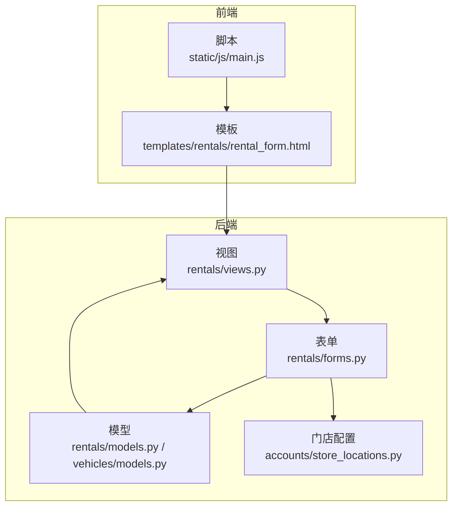
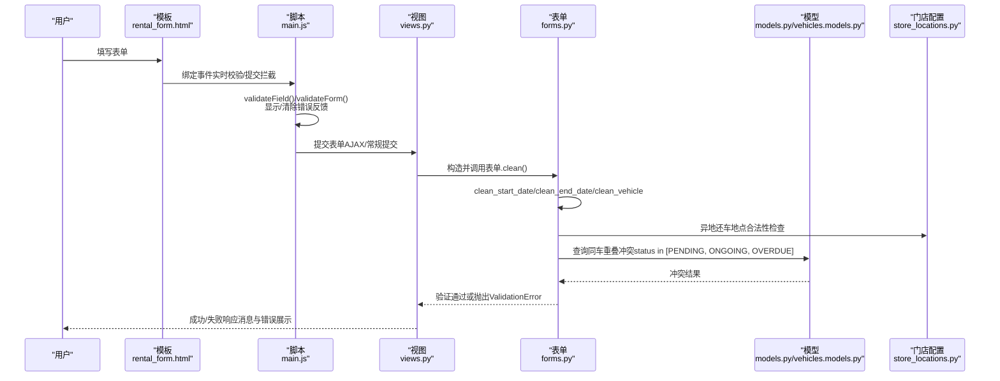
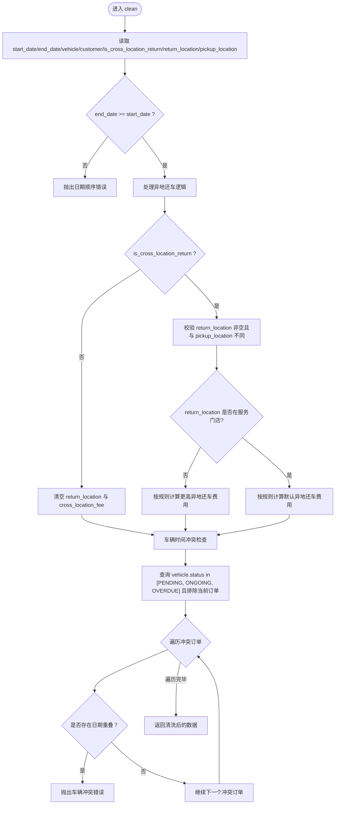
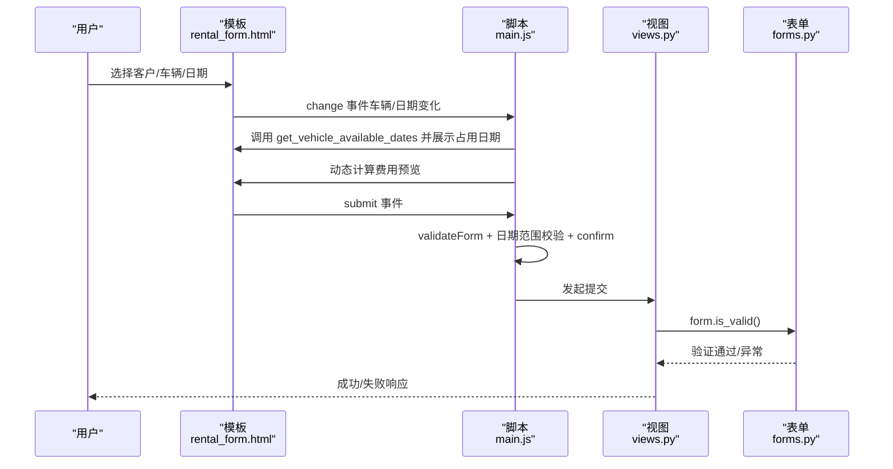
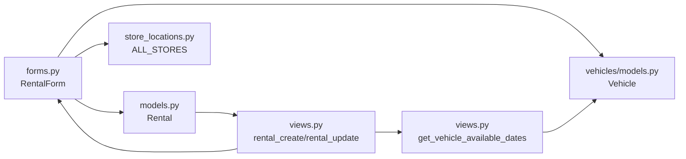

# 表单验证机制

<cite>
**本文引用的文件**
- [rentals/forms.py](file://code/car_rental_system/rentals/forms.py)
- [rentals/models.py](file://code/car_rental_system/rentals/models.py)
- [vehicles/models.py](file://code/car_rental_system/vehicles/models.py)
- [accounts/store_locations.py](file://code/car_rental_system/accounts/store_locations.py)
- [rentals/views.py](file://code/car_rental_system/rentals/views.py)
- [static/js/main.js](file://code/car_rental_system/static/js/main.js)
- [templates/rentals/rental_form.html](file://code/car_rental_system/templates/rentals/rental_form.html)
</cite>

## 目录
1. [简介](#简介)
2. [项目结构](#项目结构)
3. [核心组件](#核心组件)
4. [架构总览](#架构总览)
5. [详细组件分析](#详细组件分析)
6. [依赖关系分析](#依赖关系分析)
7. [性能考量](#性能考量)
8. [故障排查指南](#故障排查指南)
9. [结论](#结论)

## 简介
本文件聚焦于 RentalForm 表单的验证机制，系统性解析字段级验证与跨字段验证的实现细节，重点阐述：
- clean_start_date 对“开始日期不得早于今天”的严格校验逻辑
- clean 方法对“租赁日期逻辑”和“车辆时间冲突”的综合检查
- 如何通过 Django 表单的 clean 方法实现车辆可用性检查，防止同一车辆在重叠时间段被重复租赁
- 前端 JavaScript 的客户端初步验证与服务端严格验证的协同机制
- 验证失败时的错误消息处理与用户体验优化策略

## 项目结构
围绕表单验证的核心文件分布如下：
- 表单定义与验证：rentals/forms.py
- 模型与业务规则：rentals/models.py、vehicles/models.py
- 门店配置：accounts/store_locations.py
- 视图层处理与前后端交互：rentals/views.py
- 前端脚本与模板：static/js/main.js、templates/rentals/rental_form.html

图表来源
- [rentals/views.py](file://code/car_rental_system/rentals/views.py#L154-L231)
- [rentals/forms.py](file://code/car_rental_system/rentals/forms.py#L1-L275)
- [rentals/models.py](file://code/car_rental_system/rentals/models.py#L1-L170)
- [vehicles/models.py](file://code/car_rental_system/vehicles/models.py#L1-L85)
- [accounts/store_locations.py](file://code/car_rental_system/accounts/store_locations.py#L1-L79)
- [static/js/main.js](file://code/car_rental_system/static/js/main.js#L221-L336)
- [templates/rentals/rental_form.html](file://code/car_rental_system/templates/rentals/rental_form.html#L1-L188)

章节来源
- [rentals/views.py](file://code/car_rental_system/rentals/views.py#L154-L231)
- [rentals/forms.py](file://code/car_rental_system/rentals/forms.py#L1-L275)
- [rentals/models.py](file://code/car_rental_system/rentals/models.py#L1-L170)
- [vehicles/models.py](file://code/car_rental_system/vehicles/models.py#L1-L85)
- [accounts/store_locations.py](file://code/car_rental_system/accounts/store_locations.py#L1-L79)
- [static/js/main.js](file://code/car_rental_system/static/js/main.js#L221-L336)
- [templates/rentals/rental_form.html](file://code/car_rental_system/templates/rentals/rental_form.html#L1-L188)

## 核心组件
- 字段级验证
  - clean_customer：确保选择了有效客户
  - clean_vehicle：确保选择了可用车辆；更新场景排除自身订单后再检查状态
  - clean_start_date：开始日期不得早于今天
  - clean_end_date：结束日期基本校验
  - clean_deposit/clean_cross_location_fee：数值格式、正数、精度控制
- 跨字段验证
  - clean：统一校验日期顺序、异地还车逻辑、车辆时间冲突
  - clean 中对“同一车辆在同一时间段只能租给一个客户”的冲突检测
- 前端协同
  - main.js 的表单实时验证与提交拦截
  - rental_form.html 的客户端日期校验与费用预览联动

章节来源
- [rentals/forms.py](file://code/car_rental_system/rentals/forms.py#L122-L274)
- [static/js/main.js](file://code/car_rental_system/static/js/main.js#L221-L336)
- [templates/rentals/rental_form.html](file://code/car_rental_system/templates/rentals/rental_form.html#L190-L336)

## 架构总览
下图展示从前端到后端的验证链路与数据流。

图表来源
- [rentals/views.py](file://code/car_rental_system/rentals/views.py#L154-L231)
- [rentals/forms.py](file://code/car_rental_system/rentals/forms.py#L122-L274)
- [rentals/models.py](file://code/car_rental_system/rentals/models.py#L1-L170)
- [vehicles/models.py](file://code/car_rental_system/vehicles/models.py#L1-L85)
- [accounts/store_locations.py](file://code/car_rental_system/accounts/store_locations.py#L1-L79)
- [static/js/main.js](file://code/car_rental_system/static/js/main.js#L221-L336)
- [templates/rentals/rental_form.html](file://code/car_rental_system/templates/rentals/rental_form.html#L190-L336)

## 详细组件分析

### 字段级验证：clean_start_date 与 clean_end_date
- clean_start_date
  - 必填校验：若未选择开始日期，抛出错误
  - 日期范围校验：开始日期不得早于今天
  - 返回清洗后的日期
- clean_end_date
  - 必填校验：若未选择结束日期，抛出错误
  - 返回清洗后的日期

这些字段级验证确保了基础输入的有效性，并为跨字段验证提供干净的数据源。

章节来源
- [rentals/forms.py](file://code/car_rental_system/rentals/forms.py#L148-L167)

### 字段级验证：clean_vehicle
- 必填校验：未选择车辆则报错
- 可用性检查：
  - 新建订单：车辆状态必须为可用
  - 更新订单：若当前订单不在该车辆的历史订单中，则检查车辆状态是否可用
- 返回清洗后的车辆对象

该逻辑保证了“同一车辆在同一时间段只能租给一个客户”的前提条件。

章节来源
- [rentals/forms.py](file://code/car_rental_system/rentals/forms.py#L129-L147)
- [vehicles/models.py](file://code/car_rental_system/vehicles/models.py#L1-L85)

### 字段级验证：数值与精度控制
- clean_deposit/clean_cross_location_fee
  - 支持 None/空字符串，默认返回 0.00
  - 字符串转 Decimal 失败时回退为 0.00
  - 不允许负数
  - 保留两位小数（四舍五入）

章节来源
- [rentals/forms.py](file://code/car_rental_system/rentals/forms.py#L168-L211)

### 跨字段验证：clean 方法中的日期逻辑与车辆冲突检查
- 日期顺序校验：结束日期不得早于开始日期
- 异地还车逻辑：
  - 若勾选异地还车：
    - 还车地点必填，且不得与取车地点相同
    - 若还车地点不在服务门店列表，则自动计算并设置更高的异地还车费用
    - 若还车地点在服务门店列表，使用默认异地还车费用
  - 若未勾选异地还车：清空还车地点与费用
- 车辆时间冲突检查：
  - 查询同车处于“预订中/进行中/已超时未归还”的订单集合
  - 排除当前订单实例
  - 对每个冲突订单检查日期区间是否重叠
  - 一旦发现重叠，抛出错误，阻止创建或修改

图表来源
- [rentals/forms.py](file://code/car_rental_system/rentals/forms.py#L212-L274)

章节来源
- [rentals/forms.py](file://code/car_rental_system/rentals/forms.py#L212-L274)
- [accounts/store_locations.py](file://code/car_rental_system/accounts/store_locations.py#L1-L79)

### 服务端严格验证与前端协同机制
- 前端 JavaScript（main.js）
  - 表单初始化：为所有表单绑定实时校验与提交拦截
  - validateField：必填、邮箱/电话格式、数字格式等基础校验
  - validateForm：提交前整体校验
  - 提交拦截：阻止无效提交，提升用户体验
- 模板（rental_form.html）
  - 嵌入 jQuery，提供车辆可用日期查询接口调用，提前提示冲突
  - 日期变化时动态计算费用预览，辅助用户决策
  - 表单提交时再次进行日期范围校验与二次确认
- 后端 Django 表单（forms.py）
  - clean_start_date/clean_end_date/clean_vehicle/clean 等严格校验
  - clean 方法中对车辆时间冲突的数据库级检查
- 视图（views.py）
  - rental_create/rental_update：接收表单数据，调用 form.is_valid()，通过后保存并更新车辆状态
  - get_vehicle_available_dates：供前端查询车辆占用日期，配合模板脚本使用

图表来源
- [static/js/main.js](file://code/car_rental_system/static/js/main.js#L221-L336)
- [templates/rentals/rental_form.html](file://code/car_rental_system/templates/rentals/rental_form.html#L190-L336)
- [rentals/views.py](file://code/car_rental_system/rentals/views.py#L154-L231)
- [rentals/forms.py](file://code/car_rental_system/rentals/forms.py#L122-L274)

章节来源
- [static/js/main.js](file://code/car_rental_system/static/js/main.js#L221-L336)
- [templates/rentals/rental_form.html](file://code/car_rental_system/templates/rentals/rental_form.html#L190-L336)
- [rentals/views.py](file://code/car_rental_system/rentals/views.py#L154-L231)
- [rentals/forms.py](file://code/car_rental_system/rentals/forms.py#L122-L274)

### 验证失败时的错误消息处理与用户体验优化
- 前端层面
  - 实时反馈：validateField 在 blur/input 时即时显示/清除错误
  - 提交拦截：validateForm 阻止无效提交，避免不必要的网络往返
  - 警告弹窗：模板脚本在日期非法时 alert 提示
  - 加载状态：提交按钮禁用并显示“处理中”，提升感知
- 后端层面
  - clean_* 方法抛出 ValidationError，由 Django 将错误绑定到对应字段
  - 模板渲染时通过 form.field.errors 展示错误文本
  - 视图层使用 messages.success/error 提示操作结果

章节来源
- [static/js/main.js](file://code/car_rental_system/static/js/main.js#L221-L336)
- [templates/rentals/rental_form.html](file://code/car_rental_system/templates/rentals/rental_form.html#L20-L188)
- [rentals/views.py](file://code/car_rental_system/rentals/views.py#L154-L231)
- [rentals/forms.py](file://code/car_rental_system/rentals/forms.py#L122-L274)

## 依赖关系分析
- 表单依赖
  - forms.RentalForm 依赖 vehicles.models.Vehicle 的状态字段
  - forms.RentalForm 依赖 accounts.store_locations.ALL_STORES 进行异地还车地点校验
- 视图依赖
  - views.rental_create/rental_update 依赖 forms.RentalForm 的验证结果
  - views.get_vehicle_available_dates 依赖 vehicles.models.Vehicle 的关联订单查询
- 模型依赖
  - models.Rental 与 models.Vehicle 之间存在外键关系，支持跨字段冲突检测
  - models.Rental.save 中根据日期与日租金计算总金额与押金

图表来源
- [rentals/forms.py](file://code/car_rental_system/rentals/forms.py#L1-L275)
- [rentals/models.py](file://code/car_rental_system/rentals/models.py#L1-L170)
- [vehicles/models.py](file://code/car_rental_system/vehicles/models.py#L1-L85)
- [accounts/store_locations.py](file://code/car_rental_system/accounts/store_locations.py#L1-L79)
- [rentals/views.py](file://code/car_rental_system/rentals/views.py#L154-L231)
- [rentals/views.py](file://code/car_rental_system/rentals/views.py#L536-L563)

章节来源
- [rentals/forms.py](file://code/car_rental_system/rentals/forms.py#L1-L275)
- [rentals/models.py](file://code/car_rental_system/rentals/models.py#L1-L170)
- [vehicles/models.py](file://code/car_rental_system/vehicles/models.py#L1-L85)
- [accounts/store_locations.py](file://code/car_rental_system/accounts/store_locations.py#L1-L79)
- [rentals/views.py](file://code/car_rental_system/rentals/views.py#L154-L231)
- [rentals/views.py](file://code/car_rental_system/rentals/views.py#L536-L563)

## 性能考量
- 数据库查询优化
  - clean 中对车辆冲突的查询仅针对关键状态（PENDING/ONGOING/OVERDUE），并排除当前订单实例，减少无关数据扫描
  - views.get_vehicle_available_dates 通过循环生成占用日期列表，适合中小规模冲突检测
- 前端交互优化
  - main.js 的实时校验与提交拦截减少无效请求
  - 模板脚本在车辆/日期变化时异步查询占用日期，避免阻塞主流程
- 数值处理
  - Decimal 保留两位小数，避免浮点误差累积

[本节为通用性能建议，不直接分析具体文件]

## 故障排查指南
- 常见错误与定位
  - “开始日期不能早于今天”：检查 clean_start_date 的日期比较逻辑
  - “结束日期不能早于开始日期”：检查 clean 中日期顺序校验
  - “该车辆当前不可用”：检查 clean_vehicle 的车辆状态与更新场景排除逻辑
  - “车辆在某时间段已被租赁”：检查 clean 中车辆冲突检测与日期重叠判断
- 前端问题
  - 表单未显示错误：确认模板中是否正确渲染 form.field.errors
  - 提交未拦截：检查 main.js 的 validateForm 与 submit 事件绑定
- 后端问题
  - 验证未生效：确认视图中是否调用了 form.is_valid() 并处理异常
  - 车辆状态未更新：确认保存后是否调用 vehicle.save()

章节来源
- [rentals/forms.py](file://code/car_rental_system/rentals/forms.py#L122-L274)
- [static/js/main.js](file://code/car_rental_system/static/js/main.js#L221-L336)
- [templates/rentals/rental_form.html](file://code/car_rental_system/templates/rentals/rental_form.html#L20-L188)
- [rentals/views.py](file://code/car_rental_system/rentals/views.py#L154-L231)

## 结论
RentalForm 的验证体系通过“字段级验证 + 跨字段验证”的双层保障，确保了业务规则的严格执行：
- 字段级验证负责输入合法性与数据清洗
- 跨字段验证负责业务一致性与并发安全（车辆时间冲突）
- 前端 JavaScript 与 Django 表单形成“客户端初验 + 服务端严控”的协同机制，既提升了用户体验，又保证了数据完整性

在实际部署中，建议持续关注车辆冲突检测的性能瓶颈，并在高并发场景下评估数据库索引与查询优化策略。