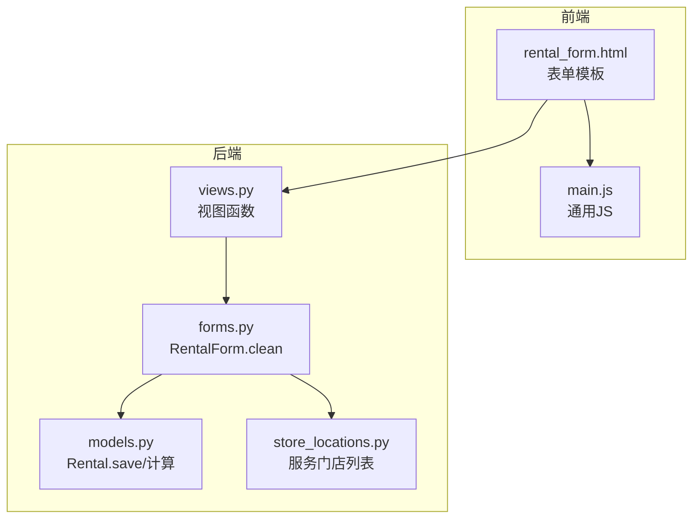
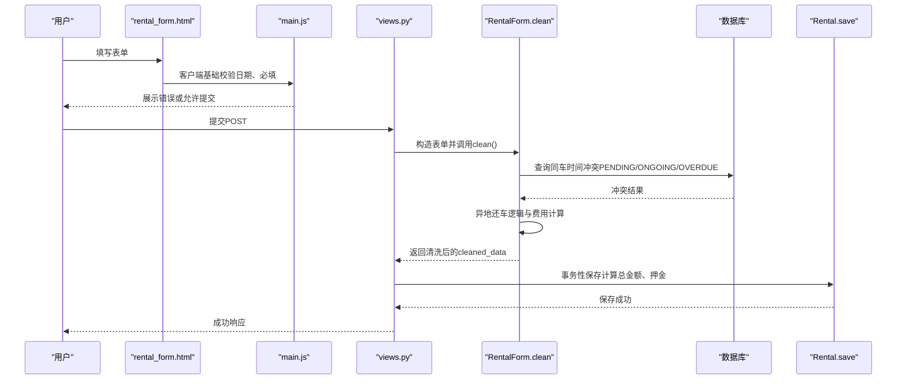
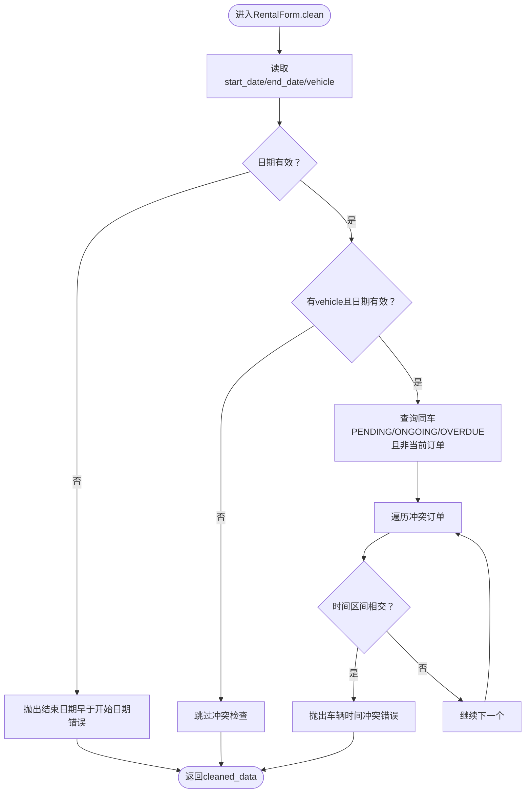
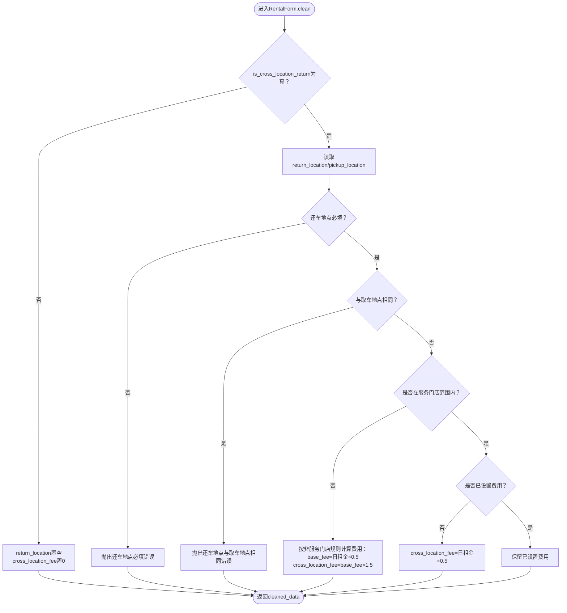
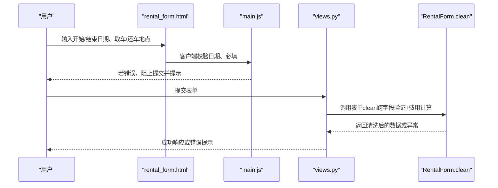
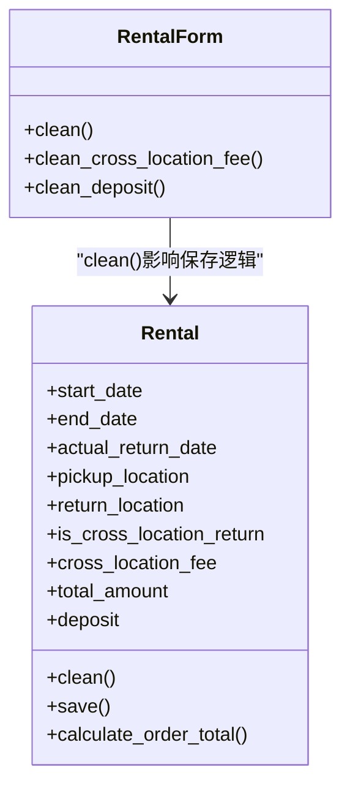
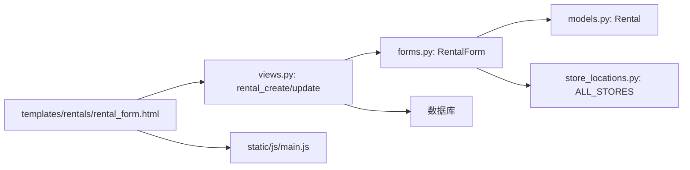

# 跨字段验证

<cite>
**本文引用的文件**
- [forms.py](file://code/car_rental_system/rentals/forms.py)
- [models.py](file://code/car_rental_system/rentals/models.py)
- [views.py](file://code/car_rental_system/rentals/views.py)
- [store_locations.py](file://code/car_rental_system/accounts/store_locations.py)
- [rental_form.html](file://code/car_rental_system/templates/rentals/rental_form.html)
- [main.js](file://code/car_rental_system/static/js/main.js)
- [0002_add_deposit_and_location_fields.py](file://code/car_rental_system/rentals/migrations/0002_add_deposit_and_location_fields.py)
- [0004_add_return_location_fields.py](file://code/car_rental_system/rentals/migrations/0004_add_return_location_fields.py)
</cite>

## 目录
1. [引言](#引言)
2. [项目结构](#项目结构)
3. [核心组件](#核心组件)
4. [架构总览](#架构总览)
5. [详细组件分析](#详细组件分析)
6. [依赖关系分析](#依赖关系分析)
7. [性能考量](#性能考量)
8. [故障排查指南](#故障排查指南)
9. [结论](#结论)

## 引言
本文件聚焦于RentalForm的clean方法中实现的跨字段验证逻辑，特别是：
- 租赁时间冲突检测机制：如何通过查询数据库检查同一车辆在指定时间段内是否存在其他进行中或已预订的订单。
- 异地还车逻辑验证：还车地点与取车地点的差异性检查、服务门店范围判断及相应费用的自动计算规则。
- 前后端协同：结合前端JavaScript代码，说明客户端初步验证与服务端严格验证的协同工作机制。

## 项目结构
围绕“跨字段验证”的关键文件组织如下：
- 表单层：RentalForm.clean负责跨字段校验与费用自动计算
- 视图层：处理表单提交、调用表单clean并持久化
- 模型层：存储订单、计算总金额、押金、异地还车费用等
- 前端模板与脚本：提供客户端基础校验与费用预览
- 配置与数据：服务门店列表来自accounts.store_locations

图表来源
- [rental_form.html](file://code/car_rental_system/templates/rentals/rental_form.html#L1-L336)
- [main.js](file://code/car_rental_system/static/js/main.js#L221-L336)
- [views.py](file://code/car_rental_system/rentals/views.py#L154-L231)
- [forms.py](file://code/car_rental_system/rentals/forms.py#L212-L274)
- [models.py](file://code/car_rental_system/rentals/models.py#L246-L271)
- [store_locations.py](file://code/car_rental_system/accounts/store_locations.py#L1-L79)

章节来源
- [rental_form.html](file://code/car_rental_system/templates/rentals/rental_form.html#L1-L336)
- [main.js](file://code/car_rental_system/static/js/main.js#L221-L336)
- [views.py](file://code/car_rental_system/rentals/views.py#L154-L231)
- [forms.py](file://code/car_rental_system/rentals/forms.py#L212-L274)
- [models.py](file://code/car_rental_system/rentals/models.py#L246-L271)
- [store_locations.py](file://code/car_rental_system/accounts/store_locations.py#L1-L79)

## 核心组件
- 表单类RentalForm：集中实现跨字段验证与费用自动计算
- 视图函数rental_create/rental_update：接收表单数据，调用表单clean，事务性保存
- 模型Rental：保存订单、计算总金额、押金、异地还车费用；提供clean补充校验
- 服务门店列表：ALL_STORES用于判断还车地点是否属于服务范围
- 前端模板与脚本：提供日期范围、车辆可用性提示与费用预览

章节来源
- [forms.py](file://code/car_rental_system/rentals/forms.py#L11-L121)
- [views.py](file://code/car_rental_system/rentals/views.py#L154-L231)
- [models.py](file://code/car_rental_system/rentals/models.py#L246-L271)
- [store_locations.py](file://code/car_rental_system/accounts/store_locations.py#L61-L66)
- [rental_form.html](file://code/car_rental_system/templates/rentals/rental_form.html#L190-L336)

## 架构总览
跨字段验证的端到端流程如下：

图表来源
- [rental_form.html](file://code/car_rental_system/templates/rentals/rental_form.html#L190-L336)
- [main.js](file://code/car_rental_system/static/js/main.js#L307-L331)
- [views.py](file://code/car_rental_system/rentals/views.py#L154-L179)
- [forms.py](file://code/car_rental_system/rentals/forms.py#L212-L274)
- [models.py](file://code/car_rental_system/rentals/models.py#L246-L271)

## 详细组件分析

### 1) 跨字段验证：时间冲突检测
- 目标：确保同一辆车在同一时间段内仅能被一个订单占用
- 逻辑要点：
  - 仅对状态为“预订中”“进行中”“已超时未归还”的订单参与冲突检查
  - 排除当前正在编辑的订单本身
  - 使用区间相交判定：若两个闭区间存在交集，则视为冲突
- 数据来源：Rental.objects.filter(...).exclude(pk=instance.pk)
- 错误处理：抛出ValidationError，阻止保存

图表来源
- [forms.py](file://code/car_rental_system/rentals/forms.py#L212-L274)

章节来源
- [forms.py](file://code/car_rental_system/rentals/forms.py#L212-L274)

### 2) 异地还车逻辑验证与费用计算
- 目标：保证还车地点与取车地点不同，判断是否属于服务门店范围，并自动计算费用
- 逻辑要点：
  - 若勾选“异地还车”，还车地点必填，且不得等于取车地点
  - 若还车地点不在服务门店范围内（ALL_STORES），则按“非服务门店”规则加收费用
  - 若还车地点在服务门店范围内：
    - 若未设置异地还车费用，则默认为日租金的50%
    - 若已设置费用，则保持原值
  - 若未勾选“异地还车”，则清空还车地点与费用
- 服务门店范围：ALL_STORES由accounts.store_locations提供

图表来源
- [forms.py](file://code/car_rental_system/rentals/forms.py#L227-L256)
- [store_locations.py](file://code/car_rental_system/accounts/store_locations.py#L61-L66)

章节来源
- [forms.py](file://code/car_rental_system/rentals/forms.py#L227-L256)
- [store_locations.py](file://code/car_rental_system/accounts/store_locations.py#L61-L66)

### 3) 前后端协同：客户端初步验证与服务端严格验证
- 客户端（前端）：
  - 基础校验：开始日期不得早于今天；结束日期不得早于开始日期；必填字段校验
  - 费用预览：基于所选客户、车辆、起止日期计算基础费用、VIP折扣与总金额
  - 提交确认：二次确认弹窗
- 服务端（后端）：
  - 表单clean：严格的跨字段验证（时间冲突、异地还车逻辑、费用计算）
  - 视图保存：事务性保存，计算总金额与押金，更新车辆状态
- 协同机制：
  - 前端先行拦截明显错误，提升用户体验
  - 服务端作为最终防线，确保数据一致性与业务规则强制执行

图表来源
- [rental_form.html](file://code/car_rental_system/templates/rentals/rental_form.html#L190-L336)
- [main.js](file://code/car_rental_system/static/js/main.js#L221-L336)
- [views.py](file://code/car_rental_system/rentals/views.py#L154-L179)
- [forms.py](file://code/car_rental_system/rentals/forms.py#L212-L274)

章节来源
- [rental_form.html](file://code/car_rental_system/templates/rentals/rental_form.html#L190-L336)
- [main.js](file://code/car_rental_system/static/js/main.js#L221-L336)
- [views.py](file://code/car_rental_system/rentals/views.py#L154-L179)
- [forms.py](file://code/car_rental_system/rentals/forms.py#L212-L274)

### 4) 模型层的补充验证与保存逻辑
- clean补充校验：结束日期不得早于开始日期；实际还车日期不得早于开始日期且不得晚于今天
- save保存逻辑：计算总金额（日租金×天数）、设置押金（VIP为0，普通用户为日租金×10）、默认异地还车费用（日租金×0.5）

图表来源
- [models.py](file://code/car_rental_system/rentals/models.py#L230-L271)
- [forms.py](file://code/car_rental_system/rentals/forms.py#L168-L211)

章节来源
- [models.py](file://code/car_rental_system/rentals/models.py#L230-L271)
- [forms.py](file://code/car_rental_system/rentals/forms.py#L168-L211)

### 5) 数据模型与字段来源
- 字段来源：迁移文件0002与0004新增了押金、取车/还车地点、是否异地还车、异地还车费用、实际还车门店、超时还车费用等字段
- 作用：支撑跨字段验证与费用计算

章节来源
- [0002_add_deposit_and_location_fields.py](file://code/car_rental_system/rentals/migrations/0002_add_deposit_and_location_fields.py#L1-L76)
- [0004_add_return_location_fields.py](file://code/car_rental_system/rentals/migrations/0004_add_return_location_fields.py#L1-L42)

## 依赖关系分析
- 表单依赖：
  - forms.RentalForm依赖models.Rental、customers.Customer、vehicles.Vehicle
  - 使用accounts.store_locations.ALL_STORES进行还车地点范围判断
- 视图依赖：
  - views.rental_create/rental_update依赖forms.RentalForm
  - 通过事务性保存确保一致性
- 前端依赖：
  - rental_form.html依赖main.js进行表单验证与费用预览
  - 通过AJAX接口获取车辆可用日期（辅助前端提示）

图表来源
- [forms.py](file://code/car_rental_system/rentals/forms.py#L11-L121)
- [models.py](file://code/car_rental_system/rentals/models.py#L12-L169)
- [store_locations.py](file://code/car_rental_system/accounts/store_locations.py#L61-L66)
- [views.py](file://code/car_rental_system/rentals/views.py#L154-L231)
- [rental_form.html](file://code/car_rental_system/templates/rentals/rental_form.html#L190-L336)
- [main.js](file://code/car_rental_system/static/js/main.js#L221-L336)

章节来源
- [forms.py](file://code/car_rental_system/rentals/forms.py#L11-L121)
- [models.py](file://code/car_rental_system/rentals/models.py#L12-L169)
- [store_locations.py](file://code/car_rental_system/accounts/store_locations.py#L61-L66)
- [views.py](file://code/car_rental_system/rentals/views.py#L154-L231)
- [rental_form.html](file://code/car_rental_system/templates/rentals/rental_form.html#L190-L336)
- [main.js](file://code/car_rental_system/static/js/main.js#L221-L336)

## 性能考量
- 冲突查询索引：Rental模型已建立索引（start_date、end_date、status、customer/status、vehicle/status），有助于快速筛选PENDING/ONGOING/OVERDUE订单
- 事务性保存：视图层使用事务包裹保存，避免部分失败导致的数据不一致
- 前端预览：main.js的费用预览减少不必要的后端请求，提升交互体验
- 服务端计算：Rental.save中计算总金额与押金，避免重复计算

章节来源
- [models.py](file://code/car_rental_system/rentals/models.py#L163-L169)
- [views.py](file://code/car_rental_system/rentals/views.py#L154-L179)
- [models.py](file://code/car_rental_system/rentals/models.py#L246-L271)
- [main.js](file://code/car_rental_system/static/js/main.js#L500-L516)

## 故障排查指南
- 常见错误与定位
  - “结束日期不能早于开始日期”：检查表单clean_start_date/clean_end_date与Rental.clean
  - “车辆在某时间段已被租赁”：检查RentalForm.clean中的冲突查询逻辑
  - “异地还车时还车地点与取车地点相同”：检查RentalForm.clean中is_cross_location_return分支
  - “还车地点不在服务门店范围内”：检查ALL_STORES与clean中的范围判断
- 前端问题
  - 客户端日期校验未生效：确认rental_form.html中的jQuery校验逻辑与main.js初始化
  - 费用预览不更新：检查change事件绑定与updateCostPreview函数
- 后端问题
  - 表单未通过clean：查看RentalForm.clean返回的错误信息
  - 保存失败：检查views.py中的事务与Rental.save逻辑

章节来源
- [forms.py](file://code/car_rental_system/rentals/forms.py#L148-L211)
- [models.py](file://code/car_rental_system/rentals/models.py#L230-L245)
- [rental_form.html](file://code/car_rental_system/templates/rentals/rental_form.html#L190-L336)
- [main.js](file://code/car_rental_system/static/js/main.js#L221-L336)
- [views.py](file://code/car_rental_system/rentals/views.py#L154-L179)

## 结论
RentalForm的clean方法通过严格的跨字段验证，确保：
- 同一车辆在同一时间段内的唯一占用（时间冲突检测）
- 异地还车的合规性与费用自动计算（还车地点差异性、服务门店范围、费用规则）
配合前端JavaScript的客户端初步验证与费用预览，形成“前端友好、后端严格”的协同机制，既提升了用户体验，又保障了业务规则的强制执行与数据一致性。