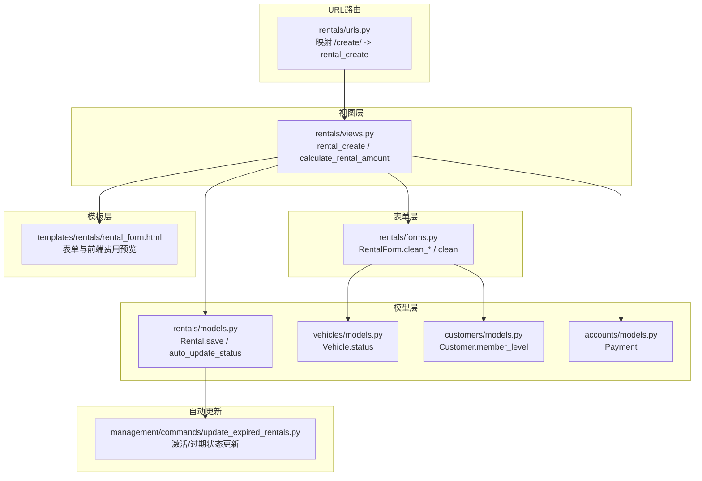
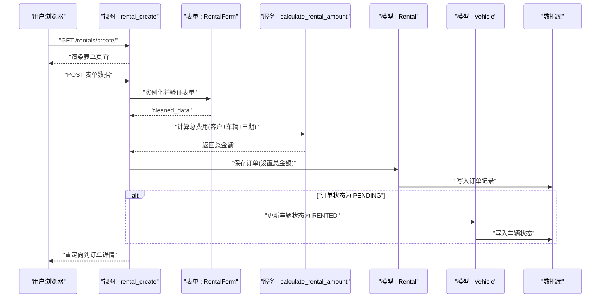
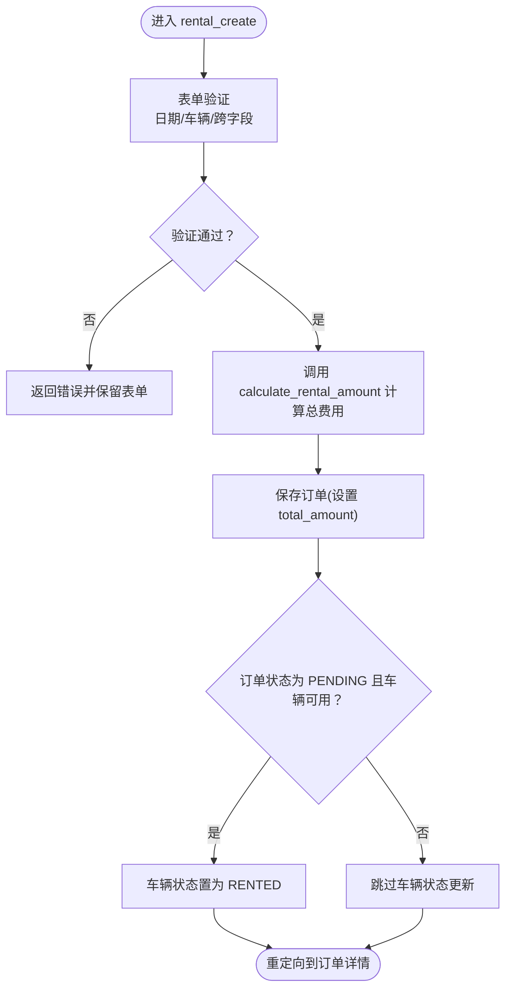
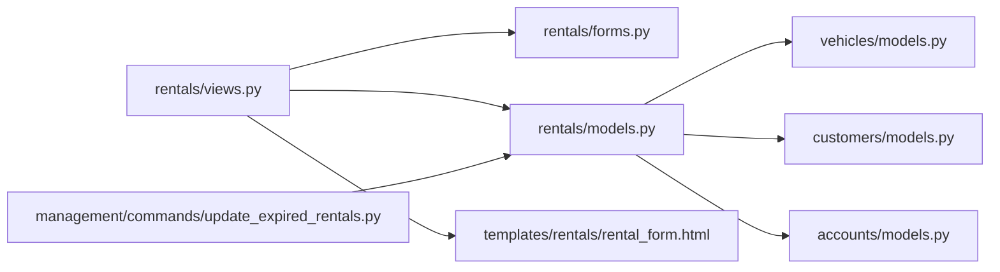

# 订单创建流程

<cite>
**本文引用的文件**
- [views.py](file://code/car_rental_system/rentals/views.py)
- [forms.py](file://code/car_rental_system/rentals/forms.py)
- [models.py](file://code/car_rental_system/rentals/models.py)
- [urls.py](file://code/car_rental_system/rentals/urls.py)
- [rental_form.html](file://code/car_rental_system/templates/rentals/rental_form.html)
- [customers/models.py](file://code/car_rental_system/customers/models.py)
- [vehicles/models.py](file://code/car_rental_system/vehicles/models.py)
- [accounts/models.py](file://code/car_rental_system/accounts/models.py)
- [update_expired_rentals.py](file://code/car_rental_system/rentals/management/commands/update_expired_rentals.py)
</cite>

## 目录
1. [简介](#简介)
2. [项目结构](#项目结构)
3. [核心组件](#核心组件)
4. [架构总览](#架构总览)
5. [详细组件分析](#详细组件分析)
6. [依赖关系分析](#依赖关系分析)
7. [性能考量](#性能考量)
8. [故障排查指南](#故障排查指南)
9. [结论](#结论)

## 简介
本文件围绕“租赁订单的创建流程”展开，目标是从用户提交表单到订单成功创建的完整过程进行深入解析。重点覆盖：
- RentalForm 表单验证机制：日期逻辑校验、车辆可用性检查、跨字段一致性校验
- 视图函数 rental_create 如何调用 calculate_rental_amount 计算基础费用，并依据客户会员等级应用 VIP 折扣
- 订单创建后车辆状态自动更新为“已租”的联动机制
- 数据一致性保障：事务与自动状态更新策略
- 提供创建流程的序列图与关键代码片段路径，帮助开发者快速定位实现细节

## 项目结构
围绕订单创建流程的关键模块与文件如下：
- URL 映射：将 /rentals/create/ 映射到 rental_create 视图
- 视图层：rental_create 负责接收表单、计算费用、保存订单并更新车辆状态
- 表单层：RentalForm 定义字段、默认值、前端渲染及严格的数据校验
- 模型层：Rental、Vehicle、Customer、Payment 等模型支撑业务实体
- 模板层：rental_form.html 展示表单与前端费用预览
- 自动更新：管理命令 update_expired_rentals 与模型级 auto_update_status 实现状态联动

图表来源
- [urls.py](file://code/car_rental_system/rentals/urls.py#L1-L22)
- [views.py](file://code/car_rental_system/rentals/views.py#L154-L187)
- [forms.py](file://code/car_rental_system/rentals/forms.py#L11-L121)
- [models.py](file://code/car_rental_system/rentals/models.py#L171-L229)
- [vehicles/models.py](file://code/car_rental_system/vehicles/models.py#L1-L85)
- [customers/models.py](file://code/car_rental_system/customers/models.py#L1-L160)
- [accounts/models.py](file://code/car_rental_system/accounts/models.py#L147-L248)
- [update_expired_rentals.py](file://code/car_rental_system/rentals/management/commands/update_expired_rentals.py#L1-L191)

章节来源
- [urls.py](file://code/car_rental_system/rentals/urls.py#L1-L22)
- [views.py](file://code/car_rental_system/rentals/views.py#L154-L187)
- [forms.py](file://code/car_rental_system/rentals/forms.py#L11-L121)
- [models.py](file://code/car_rental_system/rentals/models.py#L171-L229)
- [vehicles/models.py](file://code/car_rental_system/vehicles/models.py#L1-L85)
- [customers/models.py](file://code/car_rental_system/customers/models.py#L1-L160)
- [accounts/models.py](file://code/car_rental_system/accounts/models.py#L147-L248)
- [update_expired_rentals.py](file://code/car_rental_system/rentals/management/commands/update_expired_rentals.py#L1-L191)

## 核心组件
- 视图函数 rental_create：接收 POST 表单，调用 calculate_rental_amount 计算总费用，保存订单并在状态为 PENDING 时将车辆状态置为 RENTED；使用事务保证一致性
- 表单 RentalForm：负责字段默认值、可用车辆过滤、日期与跨字段校验、异地还车逻辑与车辆占用冲突检查
- 模型 Rental：提供 auto_update_status 自动更新状态、save 中的 VIP 押金与费用计算、calculate_order_total 等
- 模型 Vehicle：维护车辆状态 AVAILABLE/RENTED/MAINTENANCE
- 模型 Customer：维护会员等级 NORMAL/VIP，支持 VIP 升级检查与升级
- 模板 rental_form.html：展示表单、前端费用预览、日期与车辆可用性提示
- 管理命令 update_expired_rentals：批量激活预订中订单并更新过期订单状态，配合事务与车辆状态联动

章节来源
- [views.py](file://code/car_rental_system/rentals/views.py#L154-L187)
- [forms.py](file://code/car_rental_system/rentals/forms.py#L11-L121)
- [models.py](file://code/car_rental_system/rentals/models.py#L171-L229)
- [vehicles/models.py](file://code/car_rental_system/vehicles/models.py#L1-L85)
- [customers/models.py](file://code/car_rental_system/customers/models.py#L1-L160)
- [rental_form.html](file://code/car_rental_system/templates/rentals/rental_form.html#L1-L336)
- [update_expired_rentals.py](file://code/car_rental_system/rentals/management/commands/update_expired_rentals.py#L1-L191)

## 架构总览
下面以序列图展示“用户提交表单到订单创建成功”的端到端流程，涵盖表单验证、费用计算、订单保存与车辆状态联动。

图表来源
- [views.py](file://code/car_rental_system/rentals/views.py#L154-L187)
- [forms.py](file://code/car_rental_system/rentals/forms.py#L11-L121)
- [models.py](file://code/car_rental_system/rentals/models.py#L171-L229)
- [vehicles/models.py](file://code/car_rental_system/vehicles/models.py#L1-L85)

## 详细组件分析

### 表单验证机制：RentalForm
- 字段与默认值
  - 默认开始/结束日期为当天，状态默认 PENDING，取车地点默认“门店”，押金默认 0，异地还车默认否
  - 可用客户与车辆列表过滤：车辆仅显示 AVAILABLE
- 日期逻辑校验
  - 开始日期不得早于今天
  - 结束日期不得早于开始日期
- 车辆可用性检查
  - 新建订单：车辆状态必须为 AVAILABLE
  - 更新订单：若非当前订单占用的车辆，同样要求 AVAILABLE
- 跨字段一致性校验
  - 异地还车：必须填写还车地点，且不得与取车地点相同；若还车地点不在服务门店列表，自动计算并填充异地还车费用
  - 同一车辆在同一时间段只能租给一个客户：基于 PENDING/ONGOING/OVERDUE 状态冲突检测
- 前端辅助
  - 模板中通过 AJAX 调用 get_vehicle_available_dates 接口，提示车辆不可用与忙碌日期

章节来源
- [forms.py](file://code/car_rental_system/rentals/forms.py#L11-L121)
- [forms.py](file://code/car_rental_system/rentals/forms.py#L122-L275)
- [views.py](file://code/car_rental_system/rentals/views.py#L536-L563)
- [rental_form.html](file://code/car_rental_system/templates/rentals/rental_form.html#L190-L210)

### 费用计算：calculate_rental_amount 与 VIP 折扣
- 基础费用
  - 租赁天数 = 结束日期 - 开始日期 + 1
  - 基础费用 = 日租金 × 租赁天数
- VIP 折扣
  - 若客户会员等级为 VIP，总费用 = 基础费用 × (1 - 10%)
- 视图层调用
  - rental_create 在保存订单前调用 calculate_rental_amount，将 total_amount 写入订单
- 模型层补充
  - Rental.save 中亦会根据日期与日租金计算基础费用，并根据会员等级设置押金

章节来源
- [views.py](file://code/car_rental_system/rentals/views.py#L469-L484)
- [models.py](file://code/car_rental_system/rentals/models.py#L246-L271)
- [customers/models.py](file://code/car_rental_system/customers/models.py#L1-L160)

### 订单创建与车辆状态联动
- 视图层
  - rental_create 使用事务包裹：计算费用、保存订单、更新车辆状态（仅当订单状态为 PENDING 且车辆为 AVAILABLE 时）
- 模型层
  - Rental.auto_update_status：定时激活预订中订单为进行中，并将车辆状态置为 RENTED；同时将进行中且已过期的订单更新为 OVERDUE
- 管理命令
  - update_expired_rentals：批量激活 PENDING → ONGOING，更新车辆为 RENTED；检查 ONGOING → OVERDUE（仅状态变更，不自动完成）

图表来源
- [views.py](file://code/car_rental_system/rentals/views.py#L154-L187)
- [models.py](file://code/car_rental_system/rentals/models.py#L171-L229)
- [update_expired_rentals.py](file://code/car_rental_system/rentals/management/commands/update_expired_rentals.py#L46-L93)

章节来源
- [views.py](file://code/car_rental_system/rentals/views.py#L154-L187)
- [models.py](file://code/car_rental_system/rentals/models.py#L171-L229)
- [update_expired_rentals.py](file://code/car_rental_system/rentals/management/commands/update_expired_rentals.py#L46-L93)

### 数据一致性保障：事务与自动更新
- 事务
  - rental_create、rental_status_update、rental_return、rental_cancel 等均使用 with transaction.atomic 包裹关键操作，确保订单与车辆状态的一致性
- 自动更新
  - 模型级 auto_update_status：每 5 分钟最多更新一次，避免频繁写入
  - 管理命令 update_expired_rentals：明确激活与过期状态更新，配合事务与车辆状态联动
- VIP 升级与财务刷新
  - 归还流程中检查 VIP 升级条件并自动升级；刷新财务信息与押金退还

章节来源
- [views.py](file://code/car_rental_system/rentals/views.py#L154-L187)
- [views.py](file://code/car_rental_system/rentals/views.py#L234-L268)
- [views.py](file://code/car_rental_system/rentals/views.py#L279-L392)
- [views.py](file://code/car_rental_system/rentals/views.py#L395-L466)
- [models.py](file://code/car_rental_system/rentals/models.py#L171-L229)
- [update_expired_rentals.py](file://code/car_rental_system/rentals/management/commands/update_expired_rentals.py#L1-L191)

### 关键代码片段路径
- 表单初始化与默认值
  - [RentalForm.__init__](file://code/car_rental_system/rentals/forms.py#L88-L121)
- 日期与跨字段校验
  - [RentalForm.clean_start_date](file://code/car_rental_system/rentals/forms.py#L148-L159)
  - [RentalForm.clean_end_date](file://code/car_rental_system/rentals/forms.py#L160-L167)
  - [RentalForm.clean](file://code/car_rental_system/rentals/forms.py#L212-L275)
- 车辆可用性与冲突检查
  - [RentalForm.clean_vehicle](file://code/car_rental_system/rentals/forms.py#L129-L147)
- 订单创建与费用计算
  - [rental_create](file://code/car_rental_system/rentals/views.py#L154-L187)
  - [calculate_rental_amount](file://code/car_rental_system/rentals/views.py#L469-L484)
- 车辆状态联动
  - [Rental.auto_update_status](file://code/car_rental_system/rentals/models.py#L171-L229)
  - [update_expired_rentals 命令](file://code/car_rental_system/rentals/management/commands/update_expired_rentals.py#L46-L93)
- VIP 折扣与押金
  - [Rental.save 中的 VIP 押金与费用计算](file://code/car_rental_system/rentals/models.py#L246-L271)
  - [VIP 升级检查与升级](file://code/car_rental_system/customers/models.py#L101-L154)
- 前端费用预览与可用性提示
  - [rental_form.html 中的费用预览与校验](file://code/car_rental_system/templates/rentals/rental_form.html#L223-L335)
  - [get_vehicle_available_dates](file://code/car_rental_system/rentals/views.py#L536-L563)

## 依赖关系分析
- 组件耦合
  - 视图层依赖表单层（验证）、模型层（持久化）、模板层（渲染）
  - 模型层依赖 Vehicle/Customer/Payment 等外部实体
  - 自动更新通过命令与模型方法共同实现，减少视图层复杂度
- 外部依赖
  - Django ORM、事务、缓存（状态自动更新中使用）
  - 前端 jQuery/AJAX 用于车辆可用性提示与费用预览

图表来源
- [views.py](file://code/car_rental_system/rentals/views.py#L1-L187)
- [forms.py](file://code/car_rental_system/rentals/forms.py#L1-L275)
- [models.py](file://code/car_rental_system/rentals/models.py#L1-L271)
- [vehicles/models.py](file://code/car_rental_system/vehicles/models.py#L1-L85)
- [customers/models.py](file://code/car_rental_system/customers/models.py#L1-L160)
- [accounts/models.py](file://code/car_rental_system/accounts/models.py#L147-L248)
- [update_expired_rentals.py](file://code/car_rental_system/rentals/management/commands/update_expired_rentals.py#L1-L191)

## 性能考量
- 查询优化
  - 视图层广泛使用 select_related 减少 N+1 查询
  - 列表页使用分页与缓存（客户/车辆筛选项缓存 5 分钟）
- 状态自动更新缓存
  - auto_update_status 使用缓存，每 5 分钟最多执行一次，降低数据库压力
- 前端交互
  - 前端费用预览与可用性提示减少无效提交与服务器压力

章节来源
- [views.py](file://code/car_rental_system/rentals/views.py#L61-L126)
- [models.py](file://code/car_rental_system/rentals/models.py#L171-L229)

## 故障排查指南
- 常见表单错误
  - 开始日期早于今天：检查表单 clean_start_date
  - 结束日期早于开始日期：检查表单 clean_end_date 与 clean
  - 车辆不可用：检查 clean_vehicle 与车辆状态 AVAILABLE
  - 异地还车地点非法：检查 clean 中的跨字段逻辑
- 订单创建失败
  - 确认事务包裹范围是否覆盖保存与车辆状态更新
  - 检查车辆是否被其他订单占用（PENDING/ONGOING/OVERDUE 冲突）
- 状态不一致
  - 使用管理命令 update_expired_rentals 执行批量状态更新
  - 检查 auto_update_status 是否被缓存限制导致延迟
- VIP 折扣与押金异常
  - 检查 Customer.member_level 与 Rental.save 中的押金逻辑
  - 归还流程中确认 VIP 升级条件与财务刷新

章节来源
- [forms.py](file://code/car_rental_system/rentals/forms.py#L122-L275)
- [views.py](file://code/car_rental_system/rentals/views.py#L154-L187)
- [models.py](file://code/car_rental_system/rentals/models.py#L171-L229)
- [update_expired_rentals.py](file://code/car_rental_system/rentals/management/commands/update_expired_rentals.py#L1-L191)

## 结论
本系统通过严格的表单验证、清晰的费用计算与完善的事务保障，实现了从用户提交到订单创建成功的稳健流程。RentalForm 在前端与后端双重约束下，确保日期逻辑与车辆可用性；视图层在事务保护下完成订单保存与车辆状态联动；模型层与管理命令共同承担自动状态更新职责，兼顾一致性与性能。开发者可依据本文提供的序列图与代码片段路径快速定位实现细节，进一步优化或扩展业务逻辑。