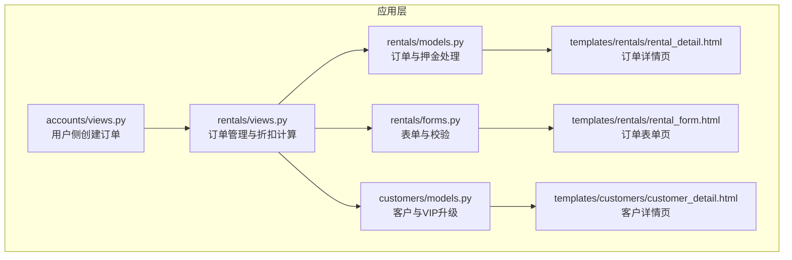
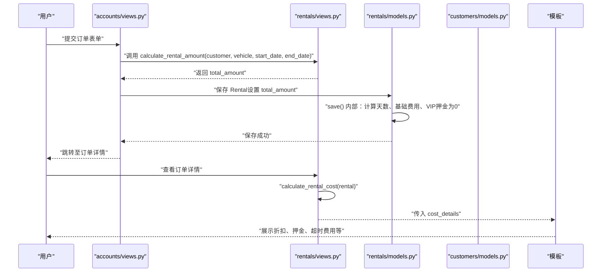
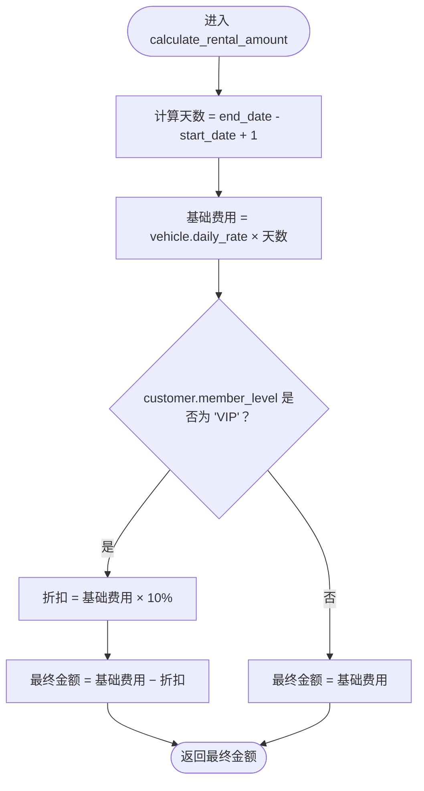
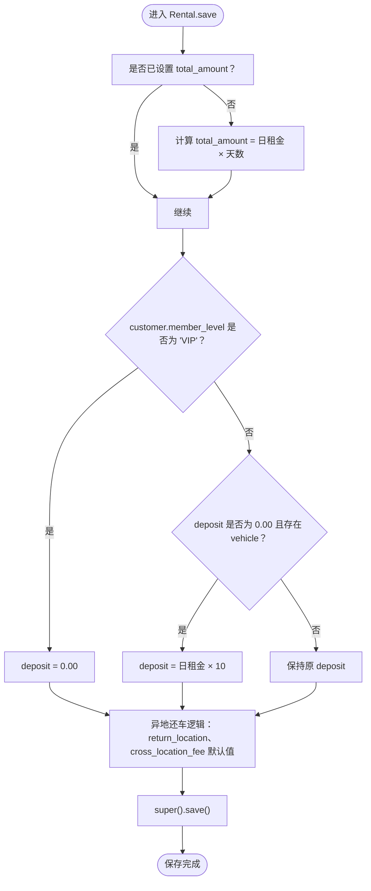
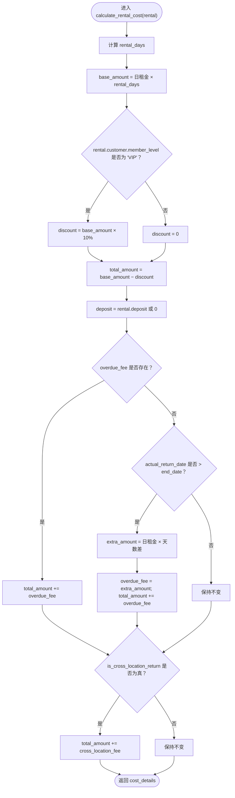
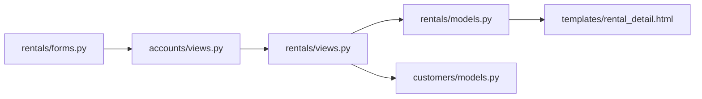

# VIP折扣应用

<cite>
**本文引用的文件**
- [customers/models.py](file://code/car_rental_system/customers/models.py)
- [rentals/models.py](file://code/car_rental_system/rentals/models.py)
- [rentals/views.py](file://code/car_rental_system/rentals/views.py)
- [accounts/views.py](file://code/car_rental_system/accounts/views.py)
- [rentals/forms.py](file://code/car_rental_system/rentals/forms.py)
- [templates/rentals/rental_detail.html](file://code/car_rental_system/templates/rentals/rental_detail.html)
- [templates/rentals/rental_form.html](file://code/car_rental_system/templates/rentals/rental_form.html)
- [templates/customers/customer_detail.html](file://code/car_rental_system/templates/customers/customer_detail.html)
- [rentals/urls.py](file://code/car_rental_system/rentals/urls.py)
</cite>

## 目录
1. [简介](#简介)
2. [项目结构](#项目结构)
3. [核心组件](#核心组件)
4. [架构总览](#架构总览)
5. [详细组件分析](#详细组件分析)
6. [依赖关系分析](#依赖关系分析)
7. [性能考量](#性能考量)
8. [故障排查指南](#故障排查指南)
9. [结论](#结论)
10. [附录](#附录)

## 简介
本文件聚焦于系统中VIP会员折扣的实现机制，围绕以下目标展开：
- 解析 calculate_rental_amount 函数中对VIP用户10%折扣的应用逻辑
- 说明如何通过 Customer 模型的 member_level 字段判断用户会员等级，并据此应用折扣策略
- 结合 Rental 模型的 save 方法，解释VIP用户押金为0的特殊处理逻辑
- 提供VIP折扣计算的流程图与关键代码示例路径，展示从订单创建到费用计算的完整调用链
- 解释该功能与客户管理模块的集成方式，以及如何确保折扣策略的一致性应用
- 说明在订单详情页中费用明细的展示逻辑

## 项目结构
系统采用分层架构，核心涉及“客户”“租赁”“账户”“车辆”等子应用。VIP折扣相关的关键交互点分布在：
- 客户模型：维护会员等级字段，提供VIP升级条件检查与升级逻辑
- 租赁模型：负责订单金额计算、押金处理、费用明细汇总
- 租赁视图：提供订单创建、更新、归还、取消等流程；其中包含折扣计算函数
- 账户视图：在用户侧创建订单时调用折扣计算函数
- 模板：在订单详情页与表单页展示折扣与费用明细

图表来源
- [accounts/views.py](file://code/car_rental_system/accounts/views.py#L958-L987)
- [rentals/views.py](file://code/car_rental_system/rentals/views.py#L469-L484)
- [customers/models.py](file://code/car_rental_system/customers/models.py#L73-L79)
- [rentals/models.py](file://code/car_rental_system/rentals/models.py#L246-L271)
- [rentals/forms.py](file://code/car_rental_system/rentals/forms.py#L116-L121)
- [templates/rentals/rental_detail.html](file://code/car_rental_system/templates/rentals/rental_detail.html#L266-L326)
- [templates/rentals/rental_form.html](file://code/car_rental_system/templates/rentals/rental_form.html#L264-L336)
- [templates/customers/customer_detail.html](file://code/car_rental_system/templates/customers/customer_detail.html#L185-L207)

章节来源
- [rentals/urls.py](file://code/car_rental_system/rentals/urls.py#L9-L22)

## 核心组件
- Customer 模型
  - 会员等级字段 member_level，支持 NORMAL 与 VIP 两种取值
  - 提供 check_vip_upgrade_eligibility 与 upgrade_to_vip，用于VIP升级条件判定与执行
- Rental 模型
  - 订单金额 total_amount、押金 deposit、异地还车费用 cross_location_fee、超时费用 overdue_fee 等
  - save 方法中包含VIP用户押金为0的处理逻辑
  - calculate_order_total 与 refresh_financials 等辅助方法
- 计算函数
  - calculate_rental_amount：按天数与日租金计算基础费用，并对VIP用户应用10%折扣
  - calculate_rental_cost：生成费用明细字典，包含折扣、押金、超时费用、异地还车费用等
- 视图与模板
  - accounts/views.py 中在用户侧创建订单时调用 calculate_rental_amount
  - rentals/views.py 中在订单详情页渲染费用明细
  - 模板中展示VIP折扣与总金额

章节来源
- [customers/models.py](file://code/car_rental_system/customers/models.py#L73-L79)
- [customers/models.py](file://code/car_rental_system/customers/models.py#L101-L145)
- [rentals/models.py](file://code/car_rental_system/rentals/models.py#L246-L271)
- [rentals/models.py](file://code/car_rental_system/rentals/models.py#L286-L333)
- [rentals/views.py](file://code/car_rental_system/rentals/views.py#L469-L484)
- [rentals/views.py](file://code/car_rental_system/rentals/views.py#L487-L533)
- [accounts/views.py](file://code/car_rental_system/accounts/views.py#L958-L987)
- [templates/rentals/rental_detail.html](file://code/car_rental_system/templates/rentals/rental_detail.html#L266-L326)
- [templates/rentals/rental_form.html](file://code/car_rental_system/templates/rentals/rental_form.html#L264-L336)

## 架构总览
VIP折扣贯穿“用户下单—后端计算—订单持久化—页面展示”的全链路。整体流程如下：

图表来源
- [accounts/views.py](file://code/car_rental_system/accounts/views.py#L958-L987)
- [rentals/views.py](file://code/car_rental_system/rentals/views.py#L469-L484)
- [rentals/views.py](file://code/car_rental_system/rentals/views.py#L487-L533)
- [rentals/models.py](file://code/car_rental_system/rentals/models.py#L246-L271)
- [templates/rentals/rental_detail.html](file://code/car_rental_system/templates/rentals/rental_detail.html#L266-L326)

## 详细组件分析

### VIP折扣计算函数：calculate_rental_amount
- 输入：customer、vehicle、start_date、end_date
- 步骤：
  - 计算租赁天数：天数 = 结束日期 − 开始日期 + 1
  - 计算基础费用：基础费用 = 日租金 × 天数
  - 判断会员等级：
    - 若 customer.member_level == 'VIP'，折扣 = 基础费用 × 10%，最终金额 = 基础费用 − 折扣
    - 否则最终金额 = 基础费用
- 输出：最终金额（Decimal）

图表来源
- [rentals/views.py](file://code/car_rental_system/rentals/views.py#L469-L484)

章节来源
- [rentals/views.py](file://code/car_rental_system/rentals/views.py#L469-L484)

### Rental.save 中的VIP押金处理
- 在保存订单时，若 customer.member_level == 'VIP'，则 deposit 显式设置为0
- 若 deposit 为0且存在 vehicle，则 deposit 默认设置为 vehicle.daily_rate × 10（普通用户默认押金）
- 同时处理异地还车场景：若勾选异地还车但 return_location 为空，则回填 pickup_location；若 cross_location_fee 为0，则设置默认异地还车费用为 vehicle.daily_rate × 0.5

图表来源
- [rentals/models.py](file://code/car_rental_system/rentals/models.py#L246-L271)

章节来源
- [rentals/models.py](file://code/car_rental_system/rentals/models.py#L246-L271)

### 订单详情页费用明细展示
- 计算入口：rentals/views.py 的 calculate_rental_cost(rental)
- 关键字段：
  - rental_days：天数
  - base_amount：基础费用
  - discount：VIP折扣（若为VIP）
  - total_amount：基础费用 − 折扣
  - deposit：押金（VIP为0）
  - overdue_fee：超时费用（若有）
  - cross_location_fee：异地还车费用（若有）
- 模板渲染：
  - 当 cost_details.discount > 0 时，展示“VIP折扣”条目
  - 展示“订单总金额”为 total_amount（含超时费用与异地还车费用）

图表来源
- [rentals/views.py](file://code/car_rental_system/rentals/views.py#L487-L533)
- [templates/rentals/rental_detail.html](file://code/car_rental_system/templates/rentals/rental_detail.html#L266-L326)

章节来源
- [rentals/views.py](file://code/car_rental_system/rentals/views.py#L487-L533)
- [templates/rentals/rental_detail.html](file://code/car_rental_system/templates/rentals/rental_detail.html#L266-L326)

### 与客户管理模块的集成
- 客户升级：Customer.check_vip_upgrade_eligibility 会基于已完成订单的“无超时归还”和“异地还车诚信”进行连续计数，达到阈值后调用 upgrade_to_vip 将会员等级提升为VIP
- 页面展示：在客户详情页，若客户为VIP且存在消费总额，则展示其累计节省的VIP折扣金额（按消费总额×10%估算）

章节来源
- [customers/models.py](file://code/car_rental_system/customers/models.py#L101-L145)
- [templates/customers/customer_detail.html](file://code/car_rental_system/templates/customers/customer_detail.html#L185-L207)

### 从订单创建到折扣应用的调用链
- 用户侧创建订单：accounts/views.py 中调用 rentals/views.py 的 calculate_rental_amount，设置 rental.total_amount 并保存
- 订单详情页：rentals/views.py 的 rental_detail 渲染时调用 calculate_rental_cost，生成费用明细并在模板中展示VIP折扣

章节来源
- [accounts/views.py](file://code/car_rental_system/accounts/views.py#L958-L987)
- [rentals/views.py](file://code/car_rental_system/rentals/views.py#L129-L151)
- [templates/rentals/rental_detail.html](file://code/car_rental_system/templates/rentals/rental_detail.html#L266-L326)

## 依赖关系分析
- 模块耦合
  - accounts/views.py 依赖 rentals/views.py 的 calculate_rental_amount
  - rentals/views.py 依赖 rentals/models.py 的 Rental.save 与 calculate_order_total、refresh_financials
  - rentals/views.py 依赖 customers/models.py 的 Customer.check_vip_upgrade_eligibility
  - 模板依赖 rentals/views.py 提供的 cost_details
- 关键依赖链
  - 订单创建 → calculate_rental_amount → Rental.save → 模板渲染
  - 订单详情 → calculate_rental_cost → 模板展示

图表来源
- [accounts/views.py](file://code/car_rental_system/accounts/views.py#L958-L987)
- [rentals/views.py](file://code/car_rental_system/rentals/views.py#L469-L484)
- [rentals/models.py](file://code/car_rental_system/rentals/models.py#L246-L271)
- [templates/rentals/rental_detail.html](file://code/car_rental_system/templates/rentals/rental_detail.html#L266-L326)

章节来源
- [accounts/views.py](file://code/car_rental_system/accounts/views.py#L958-L987)
- [rentals/views.py](file://code/car_rental_system/rentals/views.py#L469-L484)
- [rentals/models.py](file://code/car_rental_system/rentals/models.py#L246-L271)

## 性能考量
- 订单创建与更新时，calculate_rental_amount 仅进行简单数值运算，复杂度低
- 模板渲染中对 cost_details 的访问为O(1)，页面展示开销较小
- 对于大量订单的批量处理，建议在后台任务中异步刷新财务信息，避免阻塞请求

## 故障排查指南
- 折扣未生效
  - 检查 customer.member_level 是否正确设置为 'VIP'
  - 确认 calculate_rental_amount 的调用是否在订单创建/更新流程中执行
- 押金异常
  - VIP用户押金应为0；若仍显示非零，请检查Rental.save中VIP分支是否被覆盖
- 费用明细不一致
  - 确认 calculate_rental_cost 中是否正确累加了超时费用与异地还车费用
  - 检查模板中是否对 discount 存在条件渲染

章节来源
- [customers/models.py](file://code/car_rental_system/customers/models.py#L73-L79)
- [rentals/models.py](file://code/car_rental_system/rentals/models.py#L246-L271)
- [rentals/views.py](file://code/car_rental_system/rentals/views.py#L487-L533)
- [templates/rentals/rental_detail.html](file://code/car_rental_system/templates/rentals/rental_detail.html#L266-L326)

## 结论
系统通过清晰的职责划分实现了VIP折扣与押金策略：
- 以 Customer.member_level 作为决策依据，确保折扣策略一致性
- 在订单创建阶段即应用折扣，避免后续重复计算
- 在Rental.save中统一处理VIP用户的押金为0，保证业务规则落地
- 在订单详情页完整展示折扣与各项费用，提升透明度与用户体验

## 附录
- 关键代码示例路径（不直接展示代码内容）
  - VIP折扣计算函数：[rentals/views.py](file://code/car_rental_system/rentals/views.py#L469-L484)
  - 订单费用明细计算：[rentals/views.py](file://code/car_rental_system/rentals/views.py#L487-L533)
  - 订单保存与VIP押金处理：[rentals/models.py](file://code/car_rental_system/rentals/models.py#L246-L271)
  - 用户侧创建订单并应用折扣：[accounts/views.py](file://code/car_rental_system/accounts/views.py#L958-L987)
  - 订单详情页折扣展示：[templates/rentals/rental_detail.html](file://code/car_rental_system/templates/rentals/rental_detail.html#L266-L326)
  - 客户VIP升级条件与升级逻辑：[customers/models.py](file://code/car_rental_system/customers/models.py#L101-L145)