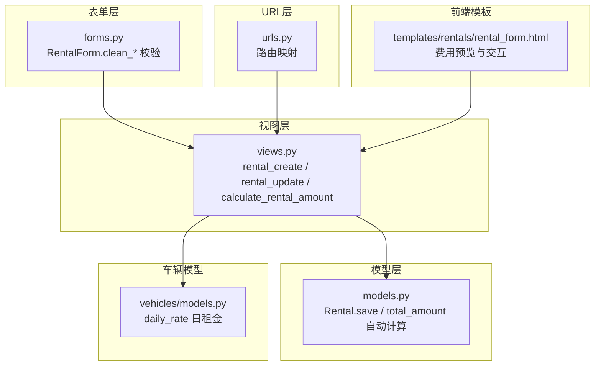
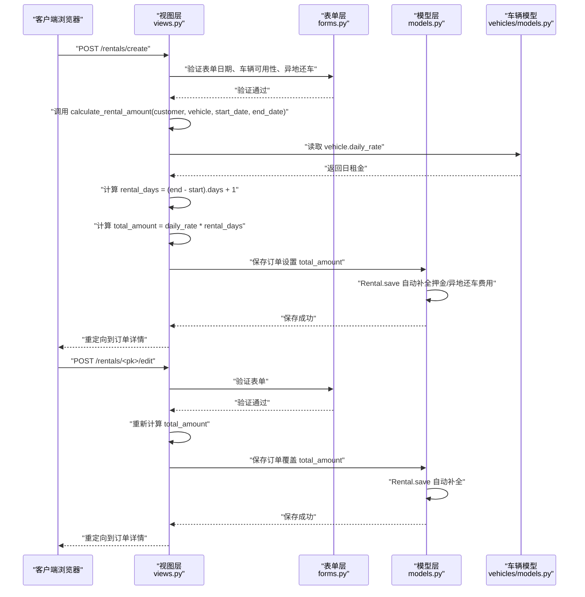
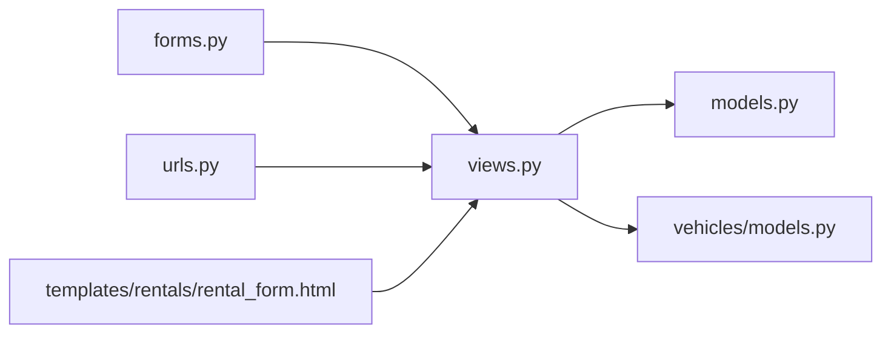

# 基础费用计算

<cite>
**本文引用的文件**
- [models.py](file://code/car_rental_system/rentals/models.py)
- [views.py](file://code/car_rental_system/rentals/views.py)
- [forms.py](file://code/car_rental_system/rentals/forms.py)
- [urls.py](file://code/car_rental_system/rentals/urls.py)
- [vehicles/models.py](file://code/car_rental_system/vehicles/models.py)
- [templates/rentals/rental_form.html](file://code/car_rental_system/templates/rentals/rental_form.html)
</cite>

## 目录
1. [简介](#简介)
2. [项目结构](#项目结构)
3. [核心组件](#核心组件)
4. [架构总览](#架构总览)
5. [详细组件分析](#详细组件分析)
6. [依赖关系分析](#依赖关系分析)
7. [性能考量](#性能考量)
8. [故障排查指南](#故障排查指南)
9. [结论](#结论)

## 简介
本文件聚焦于“基础费用计算”这一核心业务逻辑，围绕以下目标展开：
- 深入解析 calculate_rental_amount 函数如何依据车辆日租金与租赁天数计算基础费用
- 明确租赁天数的计算方式：结束日期减开始日期加1天
- 说明基础金额的计算公式：日租金 × 租赁天数
- 结合 Rental 模型的 save 方法，阐述 total_amount 字段在订单创建与更新时的自动计算过程
- 提供基础费用计算的时序图与关键代码片段路径，帮助开发者快速定位实现位置
- 解释该逻辑在 rental_create 与 rental_update 视图中的调用流程，并说明如何确保数据一致性

## 项目结构
与基础费用计算直接相关的模块与文件如下：
- 视图层：rentals/views.py 中包含订单创建、更新、费用计算与返回处理等逻辑
- 模型层：rentals/models.py 中定义 Rental 模型及 total_amount 的自动计算逻辑
- 表单层：rentals/forms.py 对日期、车辆可用性、异地还车等进行前端与后端校验
- URL 层：rentals/urls.py 将请求路由到对应视图
- 车辆模型：vehicles/models.py 提供日租金字段 daily_rate
- 前端模板：templates/rentals/rental_form.html 展示费用预览与交互

图表来源
- [views.py](file://code/car_rental_system/rentals/views.py#L154-L231)
- [models.py](file://code/car_rental_system/rentals/models.py#L246-L271)
- [forms.py](file://code/car_rental_system/rentals/forms.py#L148-L211)
- [urls.py](file://code/car_rental_system/rentals/urls.py#L9-L22)
- [vehicles/models.py](file://code/car_rental_system/vehicles/models.py#L45-L51)
- [templates/rentals/rental_form.html](file://code/car_rental_system/templates/rentals/rental_form.html#L115-L180)

章节来源
- [views.py](file://code/car_rental_system/rentals/views.py#L154-L231)
- [models.py](file://code/car_rental_system/rentals/models.py#L246-L271)
- [forms.py](file://code/car_rental_system/rentals/forms.py#L148-L211)
- [urls.py](file://code/car_rental_system/rentals/urls.py#L9-L22)
- [vehicles/models.py](file://code/car_rental_system/vehicles/models.py#L45-L51)
- [templates/rentals/rental_form.html](file://code/car_rental_system/templates/rentals/rental_form.html#L115-L180)

## 核心组件
- calculate_rental_amount：计算基础费用的纯函数，输入客户、车辆、开始/结束日期，输出总金额
- Rental.save：在保存订单时自动计算 total_amount；同时处理押金、异地还车费用等
- Rental.rental_days：属性计算租赁天数
- Rental.calculate_order_total：计算订单总额（基础租金+押金+异地费用+超时费用）
- 视图 rental_create / rental_update：在创建与更新订单时调用 calculate_rental_amount 并设置 total_amount
- 表单 RentalForm：对日期、车辆可用性、异地还车等进行严格校验，保证输入质量

章节来源
- [views.py](file://code/car_rental_system/rentals/views.py#L469-L485)
- [models.py](file://code/car_rental_system/rentals/models.py#L246-L271)
- [models.py](file://code/car_rental_system/rentals/models.py#L286-L295)
- [models.py](file://code/car_rental_system/rentals/models.py#L280-L285)
- [views.py](file://code/car_rental_system/rentals/views.py#L154-L231)
- [forms.py](file://code/car_rental_system/rentals/forms.py#L148-L211)

## 架构总览
下面以序列图形式展示“基础费用计算”的关键调用链路，涵盖创建与更新两个入口，以及模型层的自动计算与校验。

图表来源
- [views.py](file://code/car_rental_system/rentals/views.py#L154-L231)
- [views.py](file://code/car_rental_system/rentals/views.py#L469-L485)
- [models.py](file://code/car_rental_system/rentals/models.py#L246-L271)
- [vehicles/models.py](file://code/car_rental_system/vehicles/models.py#L45-L51)

## 详细组件分析

### 1) calculate_rental_amount 函数
- 输入：客户、车辆、开始日期、结束日期
- 计算步骤：
  - 计算租赁天数：结束日期减开始日期加1天
  - 基础金额 = 日租金 × 租赁天数
  - 若客户为 VIP，应用 10% 折扣，得到最终总金额
- 输出：总金额（Decimal）

关键实现位置
- [calculate_rental_amount](file://code/car_rental_system/rentals/views.py#L469-L485)

章节来源
- [views.py](file://code/car_rental_system/rentals/views.py#L469-L485)

### 2) Rental.save 的自动计算与一致性保障
- 条件触发：当 total_amount 未设置，且存在开始/结束日期与车辆时，自动计算
- 计算逻辑：
  - 租赁天数 = (end_date - start_date).days + 1
  - total_amount = vehicle.daily_rate × rental_days
- 其他自动处理：
  - VIP 客户押金为 0；普通客户默认押金为日租金的 10 倍
  - 异地还车：若勾选异地还车但还车地点为空，默认使用取车地点；若异地还车费用为 0，默认按日租金的 50% 设置
- 事务与一致性：
  - 创建与更新订单时均使用数据库事务包裹，确保原子性
  - 保存前由表单层进行严格校验，减少异常数据进入模型层

关键实现位置
- [Rental.save](file://code/car_rental_system/rentals/models.py#L246-L271)

章节来源
- [models.py](file://code/car_rental_system/rentals/models.py#L246-L271)

### 3) 租赁天数与基础金额的计算公式
- 租赁天数 = (结束日期 − 开始日期).days + 1
- 基础金额 = 日租金 × 租赁天数
- VIP 折扣：VIP 客户在基础金额上打 9 折（10% 折扣）

关键实现位置
- [calculate_rental_amount](file://code/car_rental_system/rentals/views.py#L469-L485)
- [Rental.rental_days 属性](file://code/car_rental_system/rentals/models.py#L280-L285)

章节来源
- [views.py](file://code/car_rental_system/rentals/views.py#L469-L485)
- [models.py](file://code/car_rental_system/rentals/models.py#L280-L285)

### 4) 视图层调用流程（创建与更新）
- rental_create：
  - 表单验证通过后，调用 calculate_rental_amount 计算 total_amount
  - 保存订单并更新车辆状态
- rental_update：
  - 表单验证通过后，重新计算 total_amount 并保存
  - 根据状态变化更新车辆状态

关键实现位置
- [rental_create](file://code/car_rental_system/rentals/views.py#L154-L187)
- [rental_update](file://code/car_rental_system/rentals/views.py#L190-L231)

章节来源
- [views.py](file://code/car_rental_system/rentals/views.py#L154-L187)
- [views.py](file://code/car_rental_system/rentals/views.py#L190-L231)

### 5) 前端费用预览与交互
- 前端模板提供费用预览区域，监听客户、车辆、起止日期变化，实时计算并展示基础金额、折扣与总金额
- 表单提交时，前端还会做日期合法性校验（开始日期不能早于今天、结束日期不能早于开始日期）

关键实现位置
- [费用预览与交互脚本](file://code/car_rental_system/templates/rentals/rental_form.html#L115-L180)
- [表单提交校验](file://code/car_rental_system/templates/rentals/rental_form.html#L308-L336)

章节来源
- [templates/rentals/rental_form.html](file://code/car_rental_system/templates/rentals/rental_form.html#L115-L180)
- [templates/rentals/rental_form.html](file://code/car_rental_system/templates/rentals/rental_form.html#L308-L336)

### 6) 表单层的日期与业务约束
- 开始日期不得早于当天
- 结束日期不得早于开始日期
- 车辆必须处于 AVAILABLE 状态（除更新当前订单外）
- 异地还车时必须填写还车地点，且不得与取车地点相同；若还车地点不在服务门店列表，系统会自动增加还车费用

关键实现位置
- [RentalForm.clean_start_date](file://code/car_rental_system/rentals/forms.py#L148-L159)
- [RentalForm.clean_end_date](file://code/car_rental_system/rentals/forms.py#L160-L167)
- [RentalForm.clean_vehicle](file://code/car_rental_system/rentals/forms.py#L129-L147)
- [RentalForm.clean](file://code/car_rental_system/rentals/forms.py#L212-L275)

章节来源
- [forms.py](file://code/car_rental_system/rentals/forms.py#L148-L167)
- [forms.py](file://code/car_rental_system/rentals/forms.py#L129-L147)
- [forms.py](file://code/car_rental_system/rentals/forms.py#L212-L275)

### 7) 数据一致性保障机制
- 事务包裹：创建与更新订单时使用 transaction.atomic，确保多步操作的原子性
- 原子更新：Rental.auto_update_status 使用缓存与原子块，避免重复更新与并发问题
- 表单前置校验：严格的日期与车辆可用性校验，降低模型层异常概率
- 模型层自动补全：Rental.save 在保存时自动补全押金、异地还车费用等，减少人工干预

关键实现位置
- [views.py 中的事务使用](file://code/car_rental_system/rentals/views.py#L154-L187)
- [views.py 中的事务使用](file://code/car_rental_system/rentals/views.py#L190-L231)
- [Rental.auto_update_status](file://code/car_rental_system/rentals/models.py#L171-L229)
- [Rental.save](file://code/car_rental_system/rentals/models.py#L246-L271)

章节来源
- [views.py](file://code/car_rental_system/rentals/views.py#L154-L187)
- [views.py](file://code/car_rental_system/rentals/views.py#L190-L231)
- [models.py](file://code/car_rental_system/rentals/models.py#L171-L229)
- [models.py](file://code/car_rental_system/rentals/models.py#L246-L271)

## 依赖关系分析
- 视图层依赖模型层与车辆模型提供的日租金字段
- 表单层负责输入校验，减少异常数据进入模型层
- URL 层将请求路由到对应视图
- 前端模板负责费用预览与交互，提升用户体验

图表来源
- [views.py](file://code/car_rental_system/rentals/views.py#L154-L231)
- [models.py](file://code/car_rental_system/rentals/models.py#L246-L271)
- [vehicles/models.py](file://code/car_rental_system/vehicles/models.py#L45-L51)
- [forms.py](file://code/car_rental_system/rentals/forms.py#L148-L211)
- [urls.py](file://code/car_rental_system/rentals/urls.py#L9-L22)
- [templates/rentals/rental_form.html](file://code/car_rental_system/templates/rentals/rental_form.html#L115-L180)

## 性能考量
- 事务与缓存：Rental.auto_update_status 使用缓存避免频繁更新，降低数据库压力
- 聚合查询：视图层使用聚合查询统计订单数量与收入，减少多次查询
- 前端预计算：模板中对费用进行前端预览，减少不必要的后端请求
- 索引优化：车辆模型对常用查询字段建立索引，提升检索效率

章节来源
- [models.py](file://code/car_rental_system/rentals/models.py#L171-L229)
- [views.py](file://code/car_rental_system/rentals/views.py#L17-L49)
- [vehicles/models.py](file://code/car_rental_system/vehicles/models.py#L68-L78)

## 故障排查指南
- 订单创建/更新后 total_amount 未正确计算
  - 检查是否满足模型层自动计算条件：未设置 total_amount 且存在开始/结束日期与车辆
  - 确认 vehicle.daily_rate 是否有效
  - 参考路径：[Rental.save](file://code/car_rental_system/rentals/models.py#L246-L271)
- VIP 折扣未生效
  - 确认客户 member_level 是否为 VIP
  - 参考路径：[calculate_rental_amount](file://code/car_rental_system/rentals/views.py#L469-L485)
- 日期校验失败
  - 开始日期不得早于当天；结束日期不得早于开始日期
  - 参考路径：[RentalForm.clean_start_date](file://code/car_rental_system/rentals/forms.py#L148-L159)、[RentalForm.clean_end_date](file://code/car_rental_system/rentals/forms.py#L160-L167)
- 车辆不可用导致创建失败
  - 新建订单时车辆必须为 AVAILABLE；更新订单时需排除当前订单
  - 参考路径：[RentalForm.clean_vehicle](file://code/car_rental_system/rentals/forms.py#L129-L147)
- 异地还车费用未设置
  - 若勾选异地还车但费用为 0，系统会默认按日租金的 50% 设置
  - 参考路径：[Rental.save](file://code/car_rental_system/rentals/models.py#L266-L270)

章节来源
- [models.py](file://code/car_rental_system/rentals/models.py#L246-L271)
- [views.py](file://code/car_rental_system/rentals/views.py#L469-L485)
- [forms.py](file://code/car_rental_system/rentals/forms.py#L148-L167)
- [forms.py](file://code/car_rental_system/rentals/forms.py#L129-L147)
- [models.py](file://code/car_rental_system/rentals/models.py#L266-L270)

## 结论
- 基础费用计算的核心在于：租赁天数 = (结束日期 − 开始日期).days + 1，基础金额 = 日租金 × 天数
- VIP 客户在此基础上再享 10% 折扣
- 模型层的 Rental.save 在保存时自动计算 total_amount，并补充押金与异地还车费用，确保数据完整性
- 视图层 rental_create 与 rental_update 在事务中调用 calculate_rental_amount，保证创建与更新的一致性
- 表单层与前端模板共同提供严格的输入校验与费用预览，显著降低错误率并提升用户体验