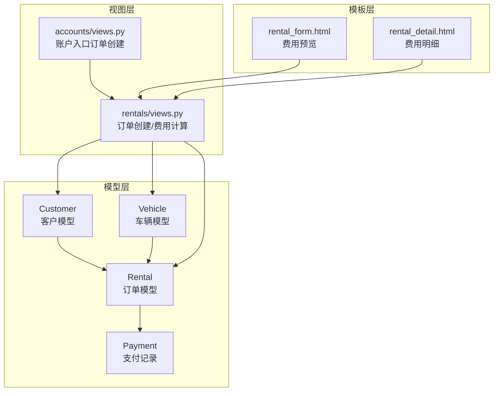
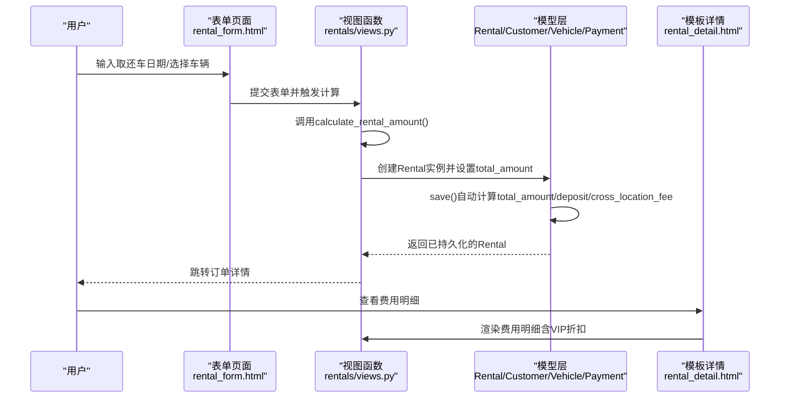
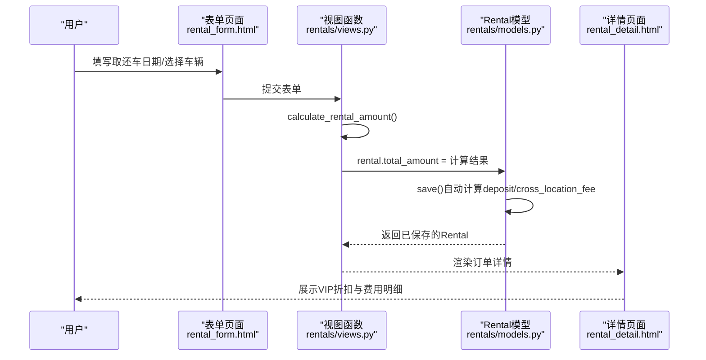
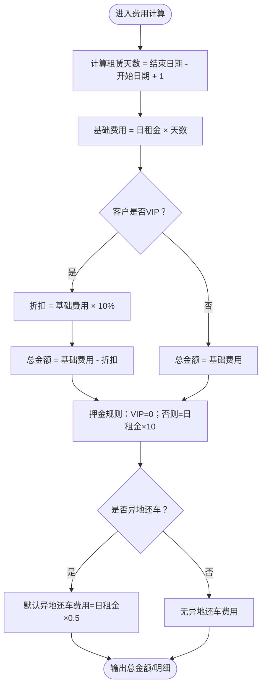
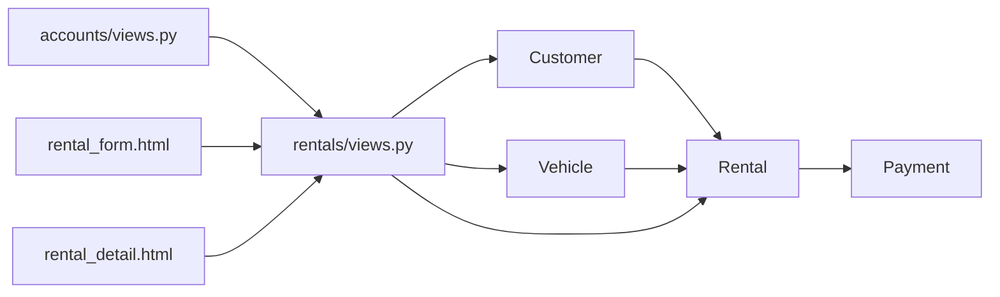

# 费用计算逻辑

<cite>
**本文引用的文件列表**
- [rentals/models.py](file://code/car_rental_system/rentals/models.py)
- [customers/models.py](file://code/car_rental_system/customers/models.py)
- [vehicles/models.py](file://code/car_rental_system/vehicles/models.py)
- [accounts/models.py](file://code/car_rental_system/accounts/models.py)
- [rentals/views.py](file://code/car_rental_system/rentals/views.py)
- [rental_form.html](file://code/car_rental_system/templates/rentals/rental_form.html)
- [rental_detail.html](file://code/car_rental_system/templates/rentals/rental_detail.html)
- [accounts/views.py](file://code/car_rental_system/accounts/views.py)
</cite>

## 目录
1. [简介](#简介)
2. [项目结构](#项目结构)
3. [核心组件](#核心组件)
4. [架构总览](#架构总览)
5. [详细组件分析](#详细组件分析)
6. [依赖关系分析](#依赖关系分析)
7. [性能考量](#性能考量)
8. [故障排查指南](#故障排查指南)
9. [结论](#结论)

## 简介
本文件聚焦于订单创建过程中的费用计算逻辑，重点说明以下内容：
- 基础费用计算方式：日租金 × 租赁天数
- VIP用户10%折扣的应用机制
- 结合Rental模型的save方法，解释总金额和押金的自动计算过程
- VIP用户押金为0的特殊处理
- 提供费用计算的时序图与关键代码片段路径，帮助开发者快速定位实现细节

## 项目结构
围绕费用计算的关键模块与文件如下：
- 模型层：Rental（订单）、Customer（客户）、Vehicle（车辆）、Payment（支付）
- 视图层：rentals/views.py中的订单创建与费用计算函数；accounts/views.py中的订单创建入口
- 模板层：rental_form.html、rental_detail.html展示费用明细与VIP折扣

图表来源
- [rentals/models.py](file://code/car_rental_system/rentals/models.py#L1-L120)
- [customers/models.py](file://code/car_rental_system/customers/models.py#L1-L80)
- [vehicles/models.py](file://code/car_rental_system/vehicles/models.py#L1-L60)
- [accounts/models.py](file://code/car_rental_system/accounts/models.py#L147-L248)
- [rentals/views.py](file://code/car_rental_system/rentals/views.py#L154-L187)
- [accounts/views.py](file://code/car_rental_system/accounts/views.py#L958-L1023)
- [rental_form.html](file://code/car_rental_system/templates/rentals/rental_form.html#L264-L321)
- [rental_detail.html](file://code/car_rental_system/templates/rentals/rental_detail.html#L279-L299)

章节来源
- [rentals/models.py](file://code/car_rental_system/rentals/models.py#L1-L120)
- [customers/models.py](file://code/car_rental_system/customers/models.py#L1-L80)
- [vehicles/models.py](file://code/car_rental_system/vehicles/models.py#L1-L60)
- [accounts/models.py](file://code/car_rental_system/accounts/models.py#L147-L248)
- [rentals/views.py](file://code/car_rental_system/rentals/views.py#L154-L187)
- [accounts/views.py](file://code/car_rental_system/accounts/views.py#L958-L1023)
- [rental_form.html](file://code/car_rental_system/templates/rentals/rental_form.html#L264-L321)
- [rental_detail.html](file://code/car_rental_system/templates/rentals/rental_detail.html#L279-L299)

## 核心组件
- Rental模型：负责订单的总金额、押金、异地还车费用、超时费用等字段的自动计算与持久化，并提供订单总额计算与财务刷新能力。
- Customer模型：定义会员等级（NORMAL/VIP），为VIP折扣提供依据。
- Vehicle模型：提供日租金字段，作为基础费用计算的基础。
- Payment模型：记录支付与退款流水，支持订单完成后的押金自动退还与财务状态刷新。
- 视图函数：提供calculate_rental_amount与calculate_rental_cost两个关键函数，分别用于订单创建时的总金额计算与费用明细汇总。

章节来源
- [rentals/models.py](file://code/car_rental_system/rentals/models.py#L246-L271)
- [customers/models.py](file://code/car_rental_system/customers/models.py#L1-L40)
- [vehicles/models.py](file://code/car_rental_system/vehicles/models.py#L45-L51)
- [accounts/models.py](file://code/car_rental_system/accounts/models.py#L147-L248)
- [rentals/views.py](file://code/car_rental_system/rentals/views.py#L469-L533)

## 架构总览
费用计算贯穿“前端预览 -> 后端创建 -> 模型自动计算 -> 支付与退款”的完整链路。VIP折扣与押金策略由模型层统一实现，视图层仅负责调用与展示。

图表来源
- [rental_form.html](file://code/car_rental_system/templates/rentals/rental_form.html#L264-L321)
- [rentals/views.py](file://code/car_rental_system/rentals/views.py#L154-L187)
- [rentals/views.py](file://code/car_rental_system/rentals/views.py#L469-L533)
- [rentals/models.py](file://code/car_rental_system/rentals/models.py#L246-L271)
- [rental_detail.html](file://code/car_rental_system/templates/rentals/rental_detail.html#L279-L299)

## 详细组件分析

### 1) 基础费用计算：日租金 × 租赁天数
- 计算逻辑
  - 租赁天数 = 结束日期 − 开始日期 + 1
  - 基础费用 = 日租金 × 租赁天数
- 实现位置
  - 视图函数calculate_rental_amount：用于订单创建时一次性计算总金额
  - 视图函数calculate_rental_cost：用于订单详情页汇总费用明细
  - 模型Rental.save：在未设置total_amount时自动计算基础费用
- 关键代码片段路径
  - [基础费用计算（视图）](file://code/car_rental_system/rentals/views.py#L469-L485)
  - [基础费用计算（视图）](file://code/car_rental_system/rentals/views.py#L487-L533)
  - [模型自动计算基础费用](file://code/car_rental_system/rentals/models.py#L246-L271)

章节来源
- [rentals/views.py](file://code/car_rental_system/rentals/views.py#L469-L533)
- [rentals/models.py](file://code/car_rental_system/rentals/models.py#L246-L271)
- [vehicles/models.py](file://code/car_rental_system/vehicles/models.py#L45-L51)

### 2) VIP折扣机制：10%折扣
- 应用条件
  - 当Customer.member_level为VIP时，对基础费用施加10%折扣
- 实现位置
  - 视图函数calculate_rental_amount：在VIP条件下计算折扣并返回最终总金额
  - 视图函数calculate_rental_cost：在VIP条件下计算折扣并汇总到total_amount
  - 模板rental_detail.html：展示VIP折扣项
- 关键代码片段路径
  - [VIP折扣计算（视图）](file://code/car_rental_system/rentals/views.py#L477-L483)
  - [VIP折扣计算（视图）](file://code/car_rental_system/rentals/views.py#L506-L510)
  - [VIP折扣展示（模板）](file://code/car_rental_system/templates/rentals/rental_detail.html#L295-L299)

章节来源
- [customers/models.py](file://code/car_rental_system/customers/models.py#L1-L40)
- [rentals/views.py](file://code/car_rental_system/rentals/views.py#L477-L483)
- [rentals/views.py](file://code/car_rental_system/rentals/views.py#L506-L510)
- [rental_detail.html](file://code/car_rental_system/templates/rentals/rental_detail.html#L295-L299)

### 3) 总金额与押金的自动计算（Rental.save）
- 总金额自动计算
  - 若未设置total_amount，且存在start_date、end_date、vehicle，则按“日租金 × 天数”自动填充
- 押金自动计算
  - 若Customer.member_level为VIP，则deposit强制为0
  - 否则若deposit为0且存在vehicle，则默认按“日租金 × 10”计算
- 其他费用
  - 异地还车：若is_cross_location_return为真且未设置return_location，则回填取车地点；若cross_location_fee为0，则默认按“日租金 × 0.5”计算
- 关键代码片段路径
  - [Rental.save自动计算逻辑](file://code/car_rental_system/rentals/models.py#L246-L271)

章节来源
- [rentals/models.py](file://code/car_rental_system/rentals/models.py#L246-L271)
- [customers/models.py](file://code/car_rental_system/customers/models.py#L1-L40)
- [vehicles/models.py](file://code/car_rental_system/vehicles/models.py#L45-L51)

### 4) 订单创建流程与时序图
- 流程要点
  - 用户在rental_form.html填写取还车日期与车辆
  - 视图函数rental_create接收表单，调用calculate_rental_amount计算total_amount后保存Rental
  - Rental.save自动补全total_amount、deposit、cross_location_fee等字段
  - 跳转至rental_detail.html展示费用明细（含VIP折扣）
- 关键代码片段路径
  - [订单创建入口（视图）](file://code/car_rental_system/rentals/views.py#L154-L187)
  - [费用预览（模板）](file://code/car_rental_system/templates/rentals/rental_form.html#L264-L321)
  - [费用明细（模板）](file://code/car_rental_system/templates/rentals/rental_detail.html#L279-L299)

图表来源
- [rental_form.html](file://code/car_rental_system/templates/rentals/rental_form.html#L264-L321)
- [rentals/views.py](file://code/car_rental_system/rentals/views.py#L154-L187)
- [rentals/views.py](file://code/car_rental_system/rentals/views.py#L469-L533)
- [rentals/models.py](file://code/car_rental_system/rentals/models.py#L246-L271)
- [rental_detail.html](file://code/car_rental_system/templates/rentals/rental_detail.html#L279-L299)

### 5) 订单完成后的押金自动退还
- 触发条件
  - 订单完成后，若存在应付押金且未退款，则自动创建REFUND记录
- 关键代码片段路径
  - [Rental.refund_deposit](file://code/car_rental_system/rentals/models.py#L334-L393)
  - [命令脚本自动结算押金](file://code/car_rental_system/rentals/management/commands/update_expired_rentals.py#L144-L173)
  - [Payment模型定义](file://code/car_rental_system/accounts/models.py#L147-L248)

章节来源
- [rentals/models.py](file://code/car_rental_system/rentals/models.py#L334-L393)
- [rentals/management/commands/update_expired_rentals.py](file://code/car_rental_system/rentals/management/commands/update_expired_rentals.py#L144-L173)
- [accounts/models.py](file://code/car_rental_system/accounts/models.py#L147-L248)

### 6) 费用计算算法流程图

图表来源
- [rentals/views.py](file://code/car_rental_system/rentals/views.py#L469-L533)
- [rentals/models.py](file://code/car_rental_system/rentals/models.py#L246-L271)
- [customers/models.py](file://code/car_rental_system/customers/models.py#L1-L40)
- [vehicles/models.py](file://code/car_rental_system/vehicles/models.py#L45-L51)

## 依赖关系分析
- 模型依赖
  - Rental依赖Customer与Vehicle以获取会员等级与日租金
  - Payment通过外键关联Rental，用于财务刷新与退款
- 视图依赖
  - rentals/views.py中的费用计算函数被rental_create与订单详情页共同使用
  - accounts/views.py在账户入口处复用calculate_rental_amount
- 模板依赖
  - rental_form.html与rental_detail.html展示VIP折扣与费用明细

图表来源
- [customers/models.py](file://code/car_rental_system/customers/models.py#L1-L80)
- [vehicles/models.py](file://code/car_rental_system/vehicles/models.py#L1-L60)
- [rentals/models.py](file://code/car_rental_system/rentals/models.py#L1-L120)
- [accounts/models.py](file://code/car_rental_system/accounts/models.py#L147-L248)
- [rentals/views.py](file://code/car_rental_system/rentals/views.py#L154-L187)
- [accounts/views.py](file://code/car_rental_system/accounts/views.py#L958-L1023)
- [rental_form.html](file://code/car_rental_system/templates/rentals/rental_form.html#L264-L321)
- [rental_detail.html](file://code/car_rental_system/templates/rentals/rental_detail.html#L279-L299)

章节来源
- [customers/models.py](file://code/car_rental_system/customers/models.py#L1-L80)
- [vehicles/models.py](file://code/car_rental_system/vehicles/models.py#L1-L60)
- [rentals/models.py](file://code/car_rental_system/rentals/models.py#L1-L120)
- [accounts/models.py](file://code/car_rental_system/accounts/models.py#L147-L248)
- [rentals/views.py](file://code/car_rental_system/rentals/views.py#L154-L187)
- [accounts/views.py](file://code/car_rental_system/accounts/views.py#L958-L1023)
- [rental_form.html](file://code/car_rental_system/templates/rentals/rental_form.html#L264-L321)
- [rental_detail.html](file://code/car_rental_system/templates/rentals/rental_detail.html#L279-L299)

## 性能考量
- 计算复杂度
  - 费用计算为O(1)，涉及少量数值运算与条件分支
- 数据访问
  - 订单创建时仅访问Vehicle与Customer，避免N+1查询
- 缓存与批量操作
  - 状态自动更新使用缓存避免频繁数据库写入（非费用计算直接相关）

[本节为通用建议，不直接分析具体文件]

## 故障排查指南
- 常见问题
  - VIP用户仍被收取押金：检查Customer.member_level是否正确设置，以及Rental.save中VIP押金逻辑
  - 总金额与模板显示不一致：核对calculate_rental_amount与calculate_rental_cost的折扣逻辑
  - 异地还车费用未生效：确认is_cross_location_return与cross_location_fee字段是否正确设置
- 关键定位点
  - VIP折扣与总金额计算：[视图函数](file://code/car_rental_system/rentals/views.py#L469-L533)
  - 模型自动计算与押金规则：[模型save](file://code/car_rental_system/rentals/models.py#L246-L271)
  - 押金自动退还流程：[模型退款](file://code/car_rental_system/rentals/models.py#L334-L393)

章节来源
- [rentals/views.py](file://code/car_rental_system/rentals/views.py#L469-L533)
- [rentals/models.py](file://code/car_rental_system/rentals/models.py#L246-L271)
- [rentals/models.py](file://code/car_rental_system/rentals/models.py#L334-L393)

## 结论
- 基础费用计算清晰明确：日租金 × 租赁天数
- VIP折扣以Customer.member_level为唯一判定依据，折扣比例为10%
- Rental.save统一承担总金额、押金、异地还车费用的自动计算，确保一致性
- 模板层直观展示VIP折扣与费用明细，提升用户体验
- 建议在后续版本中进一步抽象折扣策略，便于灵活配置不同会员等级的折扣率