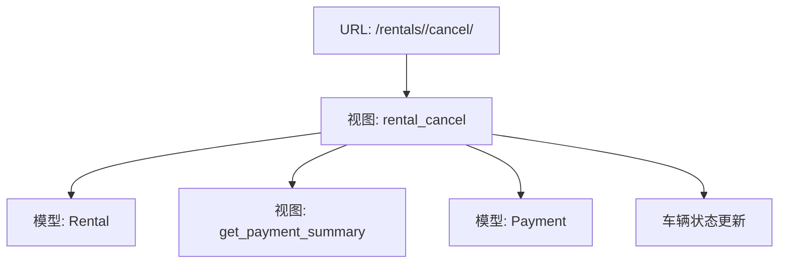
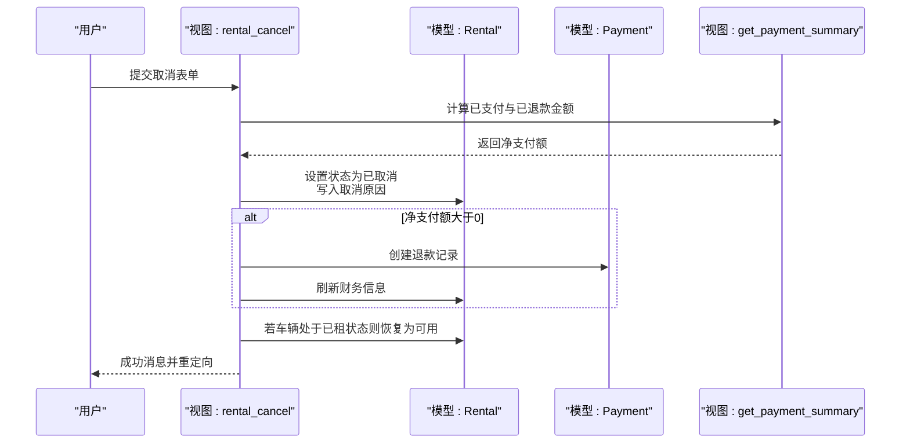
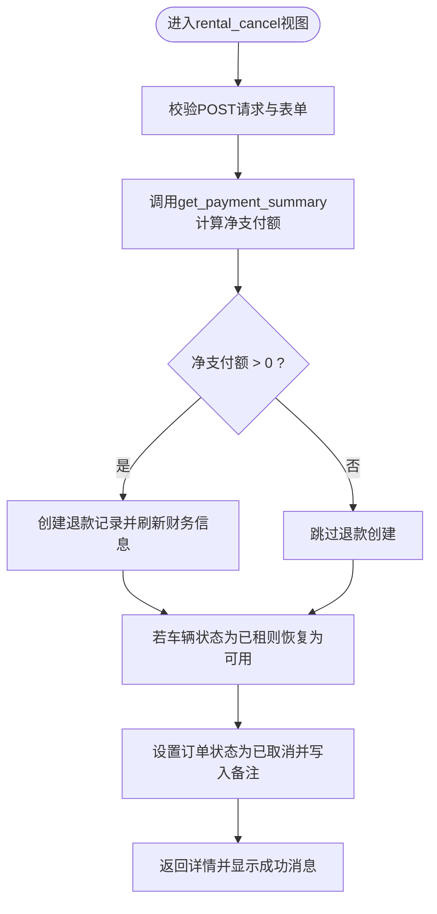
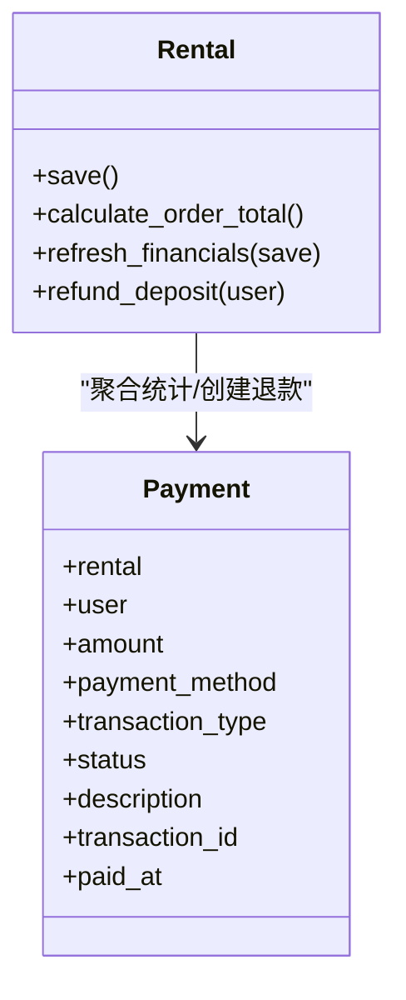
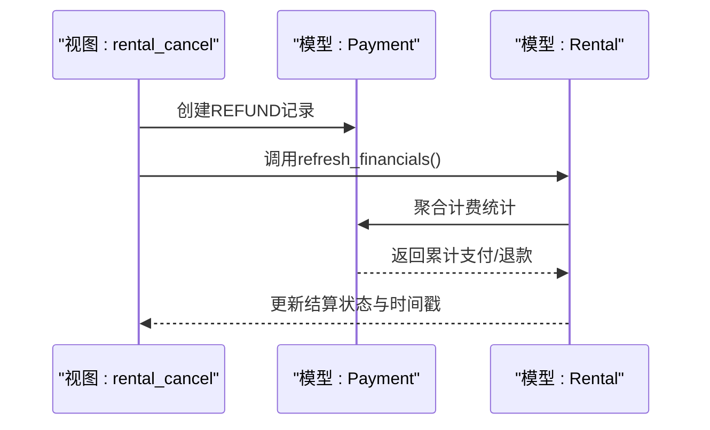
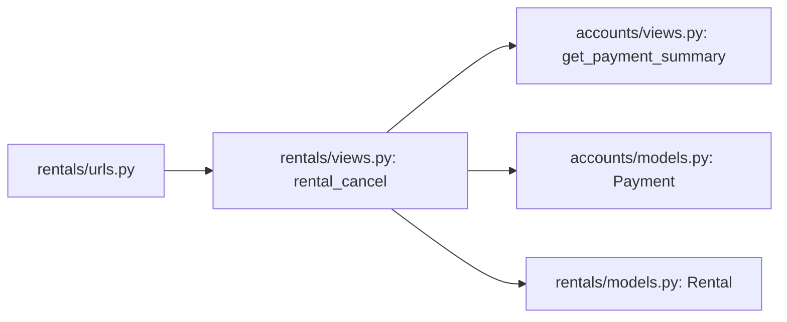

# 事务管理机制

<cite>
**本文引用的文件**
- [rentals/views.py](file://code/car_rental_system/rentals/views.py)
- [rentals/models.py](file://code/car_rental_system/rentals/models.py)
- [accounts/views.py](file://code/car_rental_system/accounts/views.py)
- [accounts/models.py](file://code/car_rental_system/accounts/models.py)
- [rentals/urls.py](file://code/car_rental_system/rentals/urls.py)
- [templates/rentals/rental_confirm_cancel.html](file://code/car_rental_system/templates/rentals/rental_confirm_cancel.html)
</cite>

## 目录
1. [引言](#引言)
2. [项目结构](#项目结构)
3. [核心组件](#核心组件)
4. [架构总览](#架构总览)
5. [详细组件分析](#详细组件分析)
6. [依赖关系分析](#依赖关系分析)
7. [性能考量](#性能考量)
8. [故障排查指南](#故障排查指南)
9. [结论](#结论)

## 引言
本文件聚焦于系统中“订单取消”流程的事务管理机制，围绕rental_cancel视图如何通过Django的transaction.atomic()确保订单状态更新、退款记录创建与车辆状态恢复三类数据库操作的原子性展开。我们将解释在with transaction.atomic()代码块中，三个关键步骤如何被纳入同一数据库事务，从而保证要么全部成功，要么全部回滚；同时结合Rental模型的save方法与refresh_financials方法，阐明事务边界内的数据一致性保障策略，并说明当事务执行过程中发生异常时，Django如何自动回滚所有已执行的操作，防止出现部分更新导致的数据不一致问题。

## 项目结构
- 业务入口与路由
  - URL配置将“取消订单”请求映射至rentals应用的rental_cancel视图。
- 视图层
  - rental_cancel视图负责接收取消请求、计算退款金额、创建退款记录、更新订单状态与车辆状态，并在事务中执行这些操作。
- 模型层
  - Rental模型提供save与refresh_financials等方法，用于订单金额与押金的计算、财务信息的刷新与结算状态的判定。
- 支付模块
  - accounts.views提供get_payment_summary函数，用于计算已支付与已退款金额，辅助确定应退金额。
  - accounts.models定义Payment模型，承载支付与退款记录。

图表来源
- [rentals/urls.py](file://code/car_rental_system/rentals/urls.py#L1-L22)
- [rentals/views.py](file://code/car_rental_system/rentals/views.py#L395-L466)
- [accounts/views.py](file://code/car_rental_system/accounts/views.py#L243-L268)
- [accounts/models.py](file://code/car_rental_system/accounts/models.py#L147-L248)
- [rentals/models.py](file://code/car_rental_system/rentals/models.py#L246-L333)

章节来源
- [rentals/urls.py](file://code/car_rental_system/rentals/urls.py#L1-L22)

## 核心组件
- rental_cancel视图
  - 在POST请求中，使用with transaction.atomic()包裹取消流程，确保订单状态更新、退款记录创建与车辆状态恢复三步操作的原子性。
- Rental模型
  - save方法：在保存前计算总金额与押金，确保订单金额与押金的初始值正确。
  - refresh_financials方法：根据支付记录刷新累计支付/退款信息，并据此更新结算状态。
- Payment模型
  - 作为退款与支付记录的载体，支持退款记录的创建与财务信息的刷新。
- get_payment_summary函数
  - 计算已支付与已退款金额，得出净支付额，用于决定是否创建退款记录以及退款金额。

章节来源
- [rentals/views.py](file://code/car_rental_system/rentals/views.py#L395-L466)
- [rentals/models.py](file://code/car_rental_system/rentals/models.py#L246-L333)
- [accounts/views.py](file://code/car_rental_system/accounts/views.py#L243-L268)
- [accounts/models.py](file://code/car_rental_system/accounts/models.py#L147-L248)

## 架构总览
下图展示了取消订单流程在视图层、模型层与支付模块之间的交互关系，以及事务边界内的关键步骤。

图表来源
- [rentals/views.py](file://code/car_rental_system/rentals/views.py#L395-L466)
- [accounts/views.py](file://code/car_rental_system/accounts/views.py#L243-L268)
- [accounts/models.py](file://code/car_rental_system/accounts/models.py#L147-L248)
- [rentals/models.py](file://code/car_rental_system/rentals/models.py#L296-L333)

## 详细组件分析

### rental_cancel视图的事务管理
- 事务边界
  - 视图在POST路径中使用with transaction.atomic()包裹取消流程，确保以下三步操作要么全部成功，要么全部回滚：
    1) 订单状态更新与备注写入
    2) 退款记录创建（若存在净支付额）
    3) 车辆状态恢复（若原状态为已租）
- 退款计算与创建
  - 通过accounts.views.get_payment_summary计算已支付与已退款金额，得到净支付额。
  - 当净支付额大于0时，优先从支付记录中获取用户，否则回退到客户关联用户，再创建退款记录。
  - 创建退款记录后，调用Rental.refresh_financials刷新财务信息，确保amount_paid/amount_refunded/settlement_status等字段与数据库一致。
- 车辆状态恢复
  - 若订单对应的车辆状态为已租，则将其恢复为可用，避免脏数据导致后续预订冲突。
- 异常处理与回滚
  - Django在with transaction.atomic()块中遇到异常会自动回滚所有已执行的数据库操作，防止部分更新造成数据不一致。

图表来源
- [rentals/views.py](file://code/car_rental_system/rentals/views.py#L395-L466)
- [accounts/views.py](file://code/car_rental_system/accounts/views.py#L243-L268)
- [accounts/models.py](file://code/car_rental_system/accounts/models.py#L147-L248)
- [rentals/models.py](file://code/car_rental_system/rentals/models.py#L296-L333)

章节来源
- [rentals/views.py](file://code/car_rental_system/rentals/views.py#L395-L466)

### Rental模型的save与refresh_financials对事务一致性的支撑
- save方法
  - 在保存前计算总金额与押金，确保订单金额与押金的初始值正确，避免后续财务计算偏差。
- refresh_financials方法
  - 基于Payment模型的支付与退款记录，聚合计算amount_paid与amount_refunded，并据此更新结算状态与结算时间戳。
  - 该方法在退款创建后被调用，确保财务字段与数据库保持一致，避免事务外的并发读取导致的不一致。

图表来源
- [rentals/models.py](file://code/car_rental_system/rentals/models.py#L246-L333)
- [accounts/models.py](file://code/car_rental_system/accounts/models.py#L147-L248)

章节来源
- [rentals/models.py](file://code/car_rental_system/rentals/models.py#L246-L333)

### 退款流程与财务一致性
- 退款创建
  - 当存在净支付额时，视图创建一条状态为已退款的Payment记录，transaction_type为REFUND。
- 财务刷新
  - 调用refresh_financials，重新计算amount_paid/amount_refunded/settlement_status，确保数据库与业务状态一致。
- 结算状态判定
  - 当订单状态为已完成且应付总额小于等于累计支付额时，结算状态置为已结算，并记录结算时间。

图表来源
- [rentals/views.py](file://code/car_rental_system/rentals/views.py#L406-L457)
- [rentals/models.py](file://code/car_rental_system/rentals/models.py#L296-L333)
- [accounts/models.py](file://code/car_rental_system/accounts/models.py#L147-L248)

章节来源
- [rentals/views.py](file://code/car_rental_system/rentals/views.py#L406-L457)
- [rentals/models.py](file://code/car_rental_system/rentals/models.py#L296-L333)

### 页面与交互要点
- 模板渲染
  - rental_confirm_cancel.html展示订单基本信息、客户与车辆信息、租赁时间信息，并提供取消原因输入框与确认按钮。
- 行为约束
  - 确认取消后，系统在事务中执行上述三步操作，确保原子性与一致性。

章节来源
- [templates/rentals/rental_confirm_cancel.html](file://code/car_rental_system/templates/rentals/rental_confirm_cancel.html#L1-L219)

## 依赖关系分析
- 视图依赖
  - rental_cancel依赖accounts.views.get_payment_summary进行退款金额计算。
  - 依赖accounts.models.Payment进行退款记录创建。
  - 依赖rentals.models.Rental进行订单状态更新与车辆状态恢复。
- 模型依赖
  - Rental.refresh_financials依赖Payment聚合统计，确保财务字段一致性。
- URL依赖
  - URL配置将取消请求路由到rental_cancel视图。

图表来源
- [rentals/urls.py](file://code/car_rental_system/rentals/urls.py#L1-L22)
- [rentals/views.py](file://code/car_rental_system/rentals/views.py#L395-L466)
- [accounts/views.py](file://code/car_rental_system/accounts/views.py#L243-L268)
- [accounts/models.py](file://code/car_rental_system/accounts/models.py#L147-L248)
- [rentals/models.py](file://code/car_rental_system/rentals/models.py#L246-L333)

章节来源
- [rentals/urls.py](file://code/car_rental_system/rentals/urls.py#L1-L22)

## 性能考量
- 事务范围控制
  - 将订单状态更新、退款记录创建与车辆状态恢复放入同一事务，减少跨事务的锁竞争与并发冲突。
- 聚合统计
  - refresh_financials通过聚合查询一次性统计累计支付与退款，避免多次往返数据库。
- 选择性保存
  - save方法使用update_fields仅更新必要字段，降低写放大与索引更新开销。

[本节为通用指导，无需列出具体文件来源]

## 故障排查指南
- 常见问题
  - 退款未创建：检查get_payment_summary返回的净支付额是否大于0，以及是否存在有效的支付用户。
  - 财务字段不一致：确认refresh_financials是否在退款创建后被调用。
  - 车辆状态未恢复：确认订单状态变更后，车辆状态确实为已租。
- 事务异常回滚
  - 若在事务中抛出异常，Django会自动回滚所有已执行的数据库操作，确保不会产生部分更新。可在视图中捕获异常并记录日志，便于定位问题。

章节来源
- [rentals/views.py](file://code/car_rental_system/rentals/views.py#L395-L466)
- [accounts/views.py](file://code/car_rental_system/accounts/views.py#L243-L268)
- [rentals/models.py](file://code/car_rental_system/rentals/models.py#L296-L333)

## 结论
通过在rental_cancel视图中使用Django的transaction.atomic()，系统将订单状态更新、退款记录创建与车辆状态恢复三步关键操作置于同一数据库事务中，确保原子性与一致性。配合Rental模型的save与refresh_financials方法，系统在事务边界内实现了严谨的数据一致性保障：要么全部成功，要么全部回滚，有效避免了部分更新导致的数据不一致问题。同时，通过聚合统计与选择性保存等手段，进一步提升了事务执行效率与整体性能。