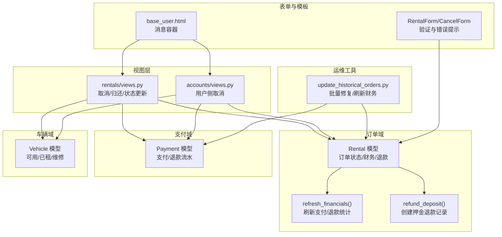
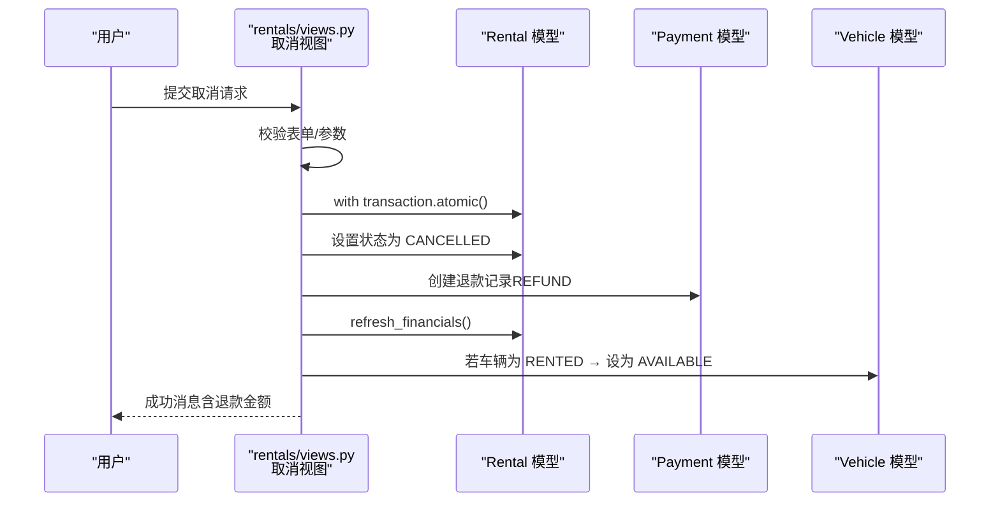
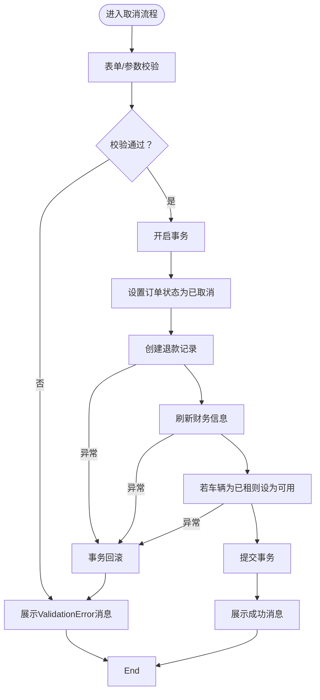
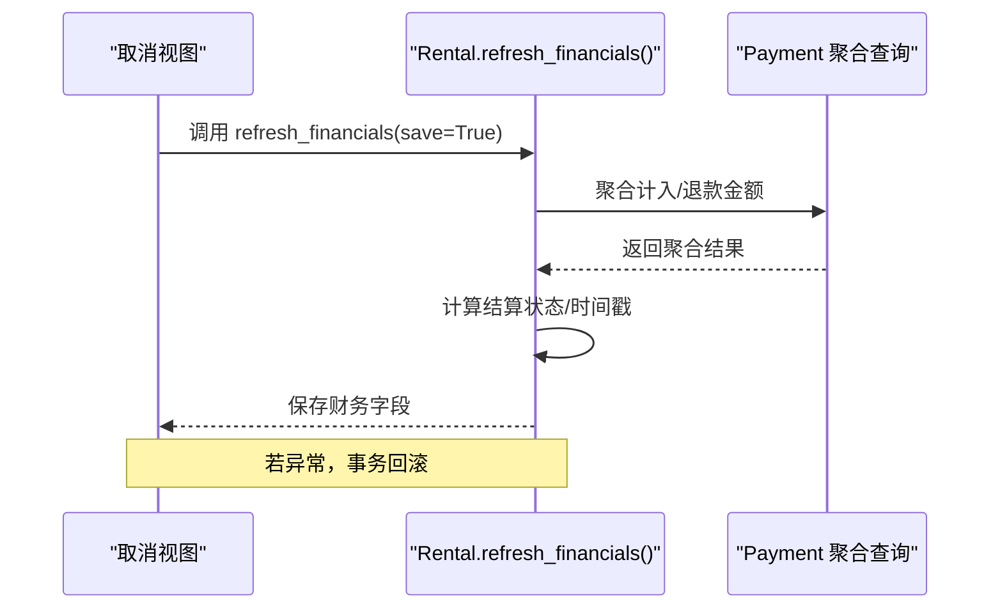
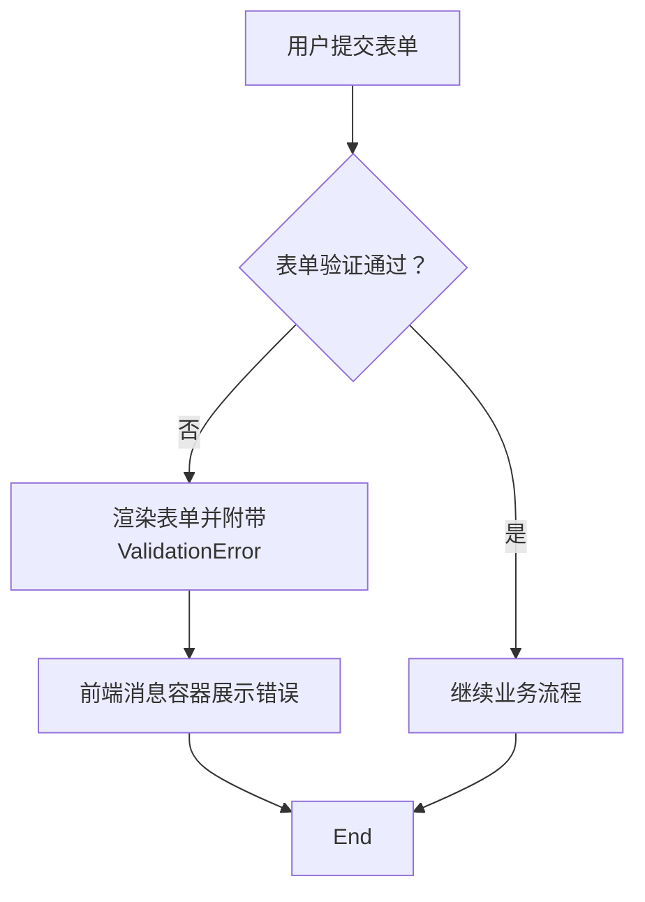
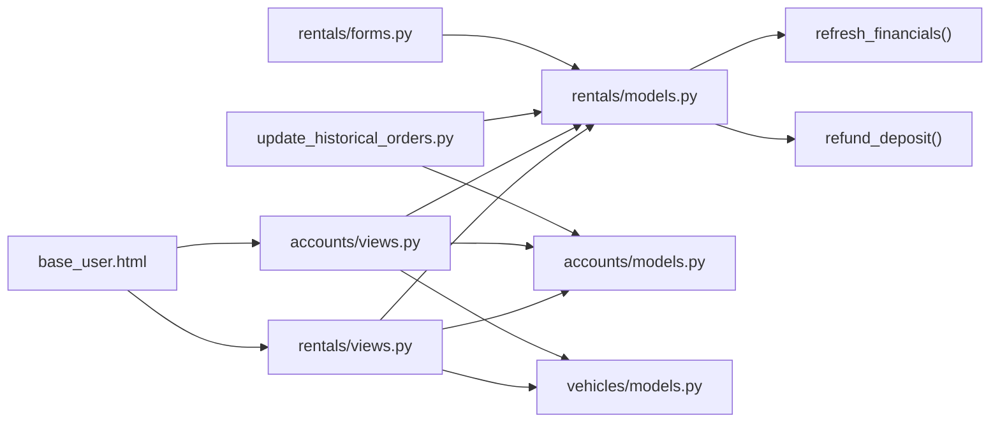

# 异常处理与回滚

<cite>
**本文引用的文件**
- [rentals/models.py](file://code/car_rental_system/rentals/models.py)
- [rentals/views.py](file://code/car_rental_system/rentals/views.py)
- [accounts/models.py](file://code/car_rental_system/accounts/models.py)
- [accounts/views.py](file://code/car_rental_system/accounts/views.py)
- [vehicles/models.py](file://code/car_rental_system/vehicles/models.py)
- [rentals/forms.py](file://code/car_rental_system/rentals/forms.py)
- [rentals/management/commands/update_historical_orders.py](file://code/car_rental_system/rentals/management/commands/update_historical_orders.py)
- [templates/base_user.html](file://code/car_rental_system/templates/base_user.html)
- [退款信息显示说明.md](file://code/car_rental_system/退款信息显示说明.md)
- [批量更新历史订单说明.md](file://code/car_rental_system/批量更新历史订单说明.md)
</cite>

## 目录
1. [简介](#简介)
2. [项目结构](#项目结构)
3. [核心组件](#核心组件)
4. [架构总览](#架构总览)
5. [详细组件分析](#详细组件分析)
6. [依赖关系分析](#依赖关系分析)
7. [性能考量](#性能考量)
8. [故障排查指南](#故障排查指南)
9. [结论](#结论)

## 简介
本文件聚焦于订单取消流程中的异常类型与处理机制，重点阐述以下方面：
- 当创建退款记录失败或更新车辆状态出错时，系统如何通过Django事务的自动回滚确保数据一致性；
- 视图层如何捕获并处理模型验证异常（如ValidationError），并向用户展示友好提示；
- 在refresh_financials方法中调用外部支付模型时可能产生的异常及其对事务的影响，以及如何在保持数据一致性的同时进行有效的错误恢复。

## 项目结构
围绕订单取消流程的关键模块与文件如下：
- 订单模型与业务逻辑：rentals/models.py
- 订单取消视图与流程控制：rentals/views.py
- 支付记录模型与退款创建：accounts/models.py
- 用户侧订单取消视图（前台）：accounts/views.py
- 车辆状态模型：vehicles/models.py
- 表单验证（含ValidationError）：rentals/forms.py
- 历史订单批量修复命令（含refresh_financials调用）：rentals/management/commands/update_historical_orders.py
- 前端消息容器模板：templates/base_user.html
- 退款信息显示与批量修复说明文档：退款信息显示说明.md、批量更新历史订单说明.md

图表来源
- [rentals/models.py](file://code/car_rental_system/rentals/models.py#L296-L394)
- [rentals/views.py](file://code/car_rental_system/rentals/views.py#L395-L466)
- [accounts/views.py](file://code/car_rental_system/accounts/views.py#L1026-L1091)
- [accounts/models.py](file://code/car_rental_system/accounts/models.py#L147-L251)
- [vehicles/models.py](file://code/car_rental_system/vehicles/models.py#L1-L85)
- [rentals/forms.py](file://code/car_rental_system/rentals/forms.py#L1-L364)
- [templates/base_user.html](file://code/car_rental_system/templates/base_user.html#L179-L196)
- [rentals/management/commands/update_historical_orders.py](file://code/car_rental_system/rentals/management/commands/update_historical_orders.py#L1-L200)

章节来源
- [rentals/models.py](file://code/car_rental_system/rentals/models.py#L1-L401)
- [rentals/views.py](file://code/car_rental_system/rentals/views.py#L1-L563)
- [accounts/models.py](file://code/car_rental_system/accounts/models.py#L1-L318)
- [accounts/views.py](file://code/car_rental_system/accounts/views.py#L1026-L1091)
- [vehicles/models.py](file://code/car_rental_system/vehicles/models.py#L1-L85)
- [rentals/forms.py](file://code/car_rental_system/rentals/forms.py#L1-L364)
- [templates/base_user.html](file://code/car_rental_system/templates/base_user.html#L179-L196)
- [rentals/management/commands/update_historical_orders.py](file://code/car_rental_system/rentals/management/commands/update_historical_orders.py#L1-L200)
- [退款信息显示说明.md](file://code/car_rental_system/退款信息显示说明.md#L1-L97)
- [批量更新历史订单说明.md](file://code/car_rental_system/批量更新历史订单说明.md#L1-L195)

## 核心组件
- 订单模型（Rental）提供：
  - 订单状态与结算状态管理；
  - 退款相关方法（refund_deposit）；
  - 财务刷新方法（refresh_financials）。
- 视图层（rentals/views.py）提供：
  - 订单取消流程（with transaction.atomic）；
  - 归还流程（含退款与财务刷新）；
  - 状态更新与车辆状态联动。
- 支付模型（Payment）提供：
  - 支付/退款流水记录；
  - 退款创建入口。
- 车辆模型（Vehicle）提供：
  - 车辆状态（可用/已租/维修）。
- 表单层（RentalForm/CancelForm）提供：
  - 模型级验证（ValidationError）与跨字段校验。
- 批量修复命令（update_historical_orders.py）提供：
  - 历史订单状态/退款/财务刷新的批量处理。

章节来源
- [rentals/models.py](file://code/car_rental_system/rentals/models.py#L296-L394)
- [rentals/views.py](file://code/car_rental_system/rentals/views.py#L395-L466)
- [accounts/models.py](file://code/car_rental_system/accounts/models.py#L147-L251)
- [vehicles/models.py](file://code/car_rental_system/vehicles/models.py#L1-L85)
- [rentals/forms.py](file://code/car_rental_system/rentals/forms.py#L1-L364)
- [rentals/management/commands/update_historical_orders.py](file://code/car_rental_system/rentals/management/commands/update_historical_orders.py#L1-L200)

## 架构总览
订单取消流程涉及“视图层-模型层-支付模型-车辆模型”的协作，并通过Django事务保证原子性与一致性。

图表来源
- [rentals/views.py](file://code/car_rental_system/rentals/views.py#L395-L466)
- [accounts/models.py](file://code/car_rental_system/accounts/models.py#L147-L251)
- [vehicles/models.py](file://code/car_rental_system/vehicles/models.py#L1-L85)
- [rentals/models.py](file://code/car_rental_system/rentals/models.py#L296-L394)

## 详细组件分析

### 订单取消流程中的异常类型与处理
- 可能的异常类型
  - 模型验证异常（ValidationError）：由表单层触发，如日期非法、异地还车地点不合法、车辆不可用等。
  - 数据库并发/约束异常：如唯一性冲突、外键约束失败。
  - 业务规则异常：如订单状态不允许取消、退款用户缺失等。
  - 外部支付模型调用异常：如第三方支付接口不可用导致退款创建失败。
- 视图层捕获与处理
  - 表单验证异常：表单clean()抛出ValidationError，视图层接收并渲染错误消息；前端通过消息容器展示。
  - 事务回滚：视图层使用with transaction.atomic()包裹关键操作，一旦任一步骤异常，事务自动回滚，确保数据一致性。
  - 用户提示：通过消息框架（messages）向用户展示友好提示，避免暴露内部错误细节。
- 关键路径参考
  - 取消视图（后台）：[rentals/views.py](file://code/car_rental_system/rentals/views.py#L395-L466)
  - 用户侧取消视图（前台）：[accounts/views.py](file://code/car_rental_system/accounts/views.py#L1026-L1091)
  - 表单验证（含ValidationError）：[rentals/forms.py](file://code/car_rental_system/rentals/forms.py#L1-L364)
  - 前端消息容器模板：[templates/base_user.html](file://code/car_rental_system/templates/base_user.html#L179-L196)

章节来源
- [rentals/views.py](file://code/car_rental_system/rentals/views.py#L395-L466)
- [accounts/views.py](file://code/car_rental_system/accounts/views.py#L1026-L1091)
- [rentals/forms.py](file://code/car_rental_system/rentals/forms.py#L1-L364)
- [templates/base_user.html](file://code/car_rental_system/templates/base_user.html#L179-L196)

### 退款记录创建失败与事务回滚
- 失败场景
  - 退款记录创建失败：如数据库写入异常、外键缺失、唯一约束冲突。
  - 财务刷新失败：refresh_financials内部聚合/保存异常。
- 事务保障
  - 视图层在取消流程中使用with transaction.atomic()包裹：
    - 设置订单状态为已取消；
    - 创建退款记录；
    - 刷新财务信息；
    - 更新车辆状态。
  - 任一步骤异常，事务自动回滚，避免出现“半更新”状态。
- 退款用户缺失的容错
  - 若无法确定退款用户，视图层会发出警告消息，提示后续人工处理，但仍保持事务内的其他步骤原子性。

图表来源
- [rentals/views.py](file://code/car_rental_system/rentals/views.py#L395-L466)
- [accounts/models.py](file://code/car_rental_system/accounts/models.py#L147-L251)
- [rentals/models.py](file://code/car_rental_system/rentals/models.py#L296-L394)

章节来源
- [rentals/views.py](file://code/car_rental_system/rentals/views.py#L395-L466)
- [accounts/models.py](file://code/car_rental_system/accounts/models.py#L147-L251)
- [rentals/models.py](file://code/car_rental_system/rentals/models.py#L296-L394)

### 更新车辆状态出错与事务回滚
- 出错场景
  - 车辆状态更新失败：如并发更新冲突、状态转换非法。
- 事务保障
  - 视图层在状态变更与车辆状态联动处同样使用with transaction.atomic()，确保订单状态与车辆状态同步更新。
- 容错策略
  - 若车辆状态更新失败，事务回滚，订单状态不会被错误地写入数据库。

章节来源
- [rentals/views.py](file://code/car_rental_system/rentals/views.py#L234-L276)
- [vehicles/models.py](file://code/car_rental_system/vehicles/models.py#L1-L85)

### refresh_financials方法中的异常与事务影响
- 方法职责
  - 根据支付记录聚合计算amount_paid/amount_refunded/settlement_status，并可选择保存。
- 外部支付模型调用
  - 依赖Payment模型的聚合查询与保存，若Payment模型或其索引/约束异常，可能导致refresh_financials失败。
- 事务影响
  - 若refresh_financials在事务内被调用（如取消流程），其失败会导致整个事务回滚，保证财务数据与业务操作的一致性。
- 历史数据修复
  - 批量修复命令update_historical_orders.py会逐个调用refresh_financials，支持dry-run预览与分步执行，降低风险。

图表来源
- [rentals/models.py](file://code/car_rental_system/rentals/models.py#L296-L333)
- [accounts/models.py](file://code/car_rental_system/accounts/models.py#L147-L251)
- [rentals/views.py](file://code/car_rental_system/rentals/views.py#L418-L445)
- [rentals/management/commands/update_historical_orders.py](file://code/car_rental_system/rentals/management/commands/update_historical_orders.py#L286-L309)

章节来源
- [rentals/models.py](file://code/car_rental_system/rentals/models.py#L296-L333)
- [accounts/models.py](file://code/car_rental_system/accounts/models.py#L147-L251)
- [rentals/views.py](file://code/car_rental_system/rentals/views.py#L418-L445)
- [rentals/management/commands/update_historical_orders.py](file://code/car_rental_system/rentals/management/commands/update_historical_orders.py#L286-L309)

### 视图层捕获与处理ValidationError的机制
- 表单验证
  - 表单RentalForm/CancelForm在clean()中进行跨字段与业务规则校验，抛出ValidationError。
- 视图层处理
  - 视图接收表单.is_valid()结果，若失败，渲染表单并携带错误消息。
  - 前端模板通过消息容器统一展示错误/成功消息，避免泄露内部异常细节。
- 友好提示策略
  - 使用messages.success/messages.error/messages.warning等分类提示，便于用户理解当前操作结果。

图表来源
- [rentals/forms.py](file://code/car_rental_system/rentals/forms.py#L1-L364)
- [templates/base_user.html](file://code/car_rental_system/templates/base_user.html#L179-L196)

章节来源
- [rentals/forms.py](file://code/car_rental_system/rentals/forms.py#L1-L364)
- [templates/base_user.html](file://code/car_rental_system/templates/base_user.html#L179-L196)

### 历史订单退款与财务刷新的批量修复
- 批量修复命令
  - 支持预览模式（--dry-run）、选择性执行（跳过状态/退款/财务刷新）。
  - 逐个调用refresh_financials，确保历史订单财务信息准确。
- 退款处理
  - 对已完成订单退还押金、对已取消订单退还已支付金额，若找不到退款用户则记录警告，便于人工跟进。

章节来源
- [rentals/management/commands/update_historical_orders.py](file://code/car_rental_system/rentals/management/commands/update_historical_orders.py#L1-L200)
- [退款信息显示说明.md](file://code/car_rental_system/退款信息显示说明.md#L1-L97)
- [批量更新历史订单说明.md](file://code/car_rental_system/批量更新历史订单说明.md#L1-L195)

## 依赖关系分析
- 组件耦合
  - 视图层依赖模型层（Rental/refresh_financials/refund_deposit）、支付层（Payment）、车辆层（Vehicle）。
  - 表单层负责前置验证，减少模型层与支付层的异常传播。
- 外部依赖
  - Django事务（transaction.atomic）提供原子性保障；
  - 消息框架（messages）与模板（base_user.html）提供用户反馈。
- 循环依赖规避
  - 模型层通过延迟导入（如refresh_financials内部导入Payment）避免循环导入。

图表来源
- [rentals/views.py](file://code/car_rental_system/rentals/views.py#L395-L466)
- [accounts/views.py](file://code/car_rental_system/accounts/views.py#L1026-L1091)
- [rentals/models.py](file://code/car_rental_system/rentals/models.py#L296-L394)
- [accounts/models.py](file://code/car_rental_system/accounts/models.py#L147-L251)
- [vehicles/models.py](file://code/car_rental_system/vehicles/models.py#L1-L85)
- [rentals/forms.py](file://code/car_rental_system/rentals/forms.py#L1-L364)
- [templates/base_user.html](file://code/car_rental_system/templates/base_user.html#L179-L196)
- [rentals/management/commands/update_historical_orders.py](file://code/car_rental_system/rentals/management/commands/update_historical_orders.py#L1-L200)

## 性能考量
- 事务范围控制
  - 将退款创建、财务刷新、车辆状态更新置于同一事务，避免多次往返数据库带来的锁竞争与不一致。
- 批量修复
  - 批量命令支持分步执行与预览，降低大事务风险与停机时间。
- 前端消息展示
  - 模板统一渲染消息，减少重复逻辑与页面碎片化。

[本节为一般性指导，无需特定文件引用]

## 故障排查指南
- 常见问题定位
  - 退款未到账：检查是否执行refresh_financials或批量修复命令；确认Payment记录类型为REFUND且状态为已退款。
  - 财务显示异常：查看订单详情/消费明细页面是否自动刷新财务信息；必要时执行批量修复。
  - 取消失败：确认是否在事务内出现异常（如退款用户缺失、车辆状态更新失败），查看消息提示与日志。
- 排查步骤
  - 查看消息容器（base_user.html）中的提示；
  - 检查订单状态与车辆状态是否一致；
  - 执行批量修复命令（update_historical_orders.py）进行历史数据修复；
  - 如退款用户缺失，按提示进行人工处理。

章节来源
- [templates/base_user.html](file://code/car_rental_system/templates/base_user.html#L179-L196)
- [退款信息显示说明.md](file://code/car_rental_system/退款信息显示说明.md#L1-L97)
- [批量更新历史订单说明.md](file://code/car_rental_system/批量更新历史订单说明.md#L1-L195)
- [rentals/management/commands/update_historical_orders.py](file://code/car_rental_system/rentals/management/commands/update_historical_orders.py#L1-L200)

## 结论
- 订单取消流程通过Django事务实现强一致性的原子操作，任一步骤异常均会被自动回滚，确保数据完整性。
- 表单层的ValidationError在视图层被捕获并转化为用户可理解的消息，避免暴露系统内部细节。
- refresh_financials方法在事务内调用时，其异常会触发回滚，保证财务数据与业务操作一致；批量修复命令提供安全的历史数据治理手段。
- 建议在生产环境中：
  - 严格使用事务包裹关键业务；
  - 通过批量修复命令定期维护历史数据；
  - 保持消息提示友好、简洁，便于用户与运营人员理解。