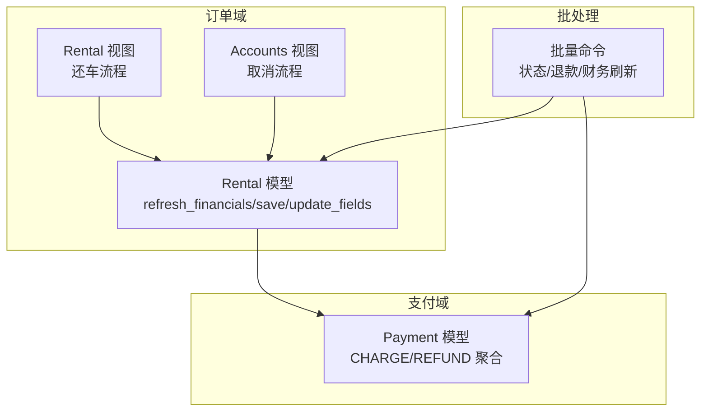
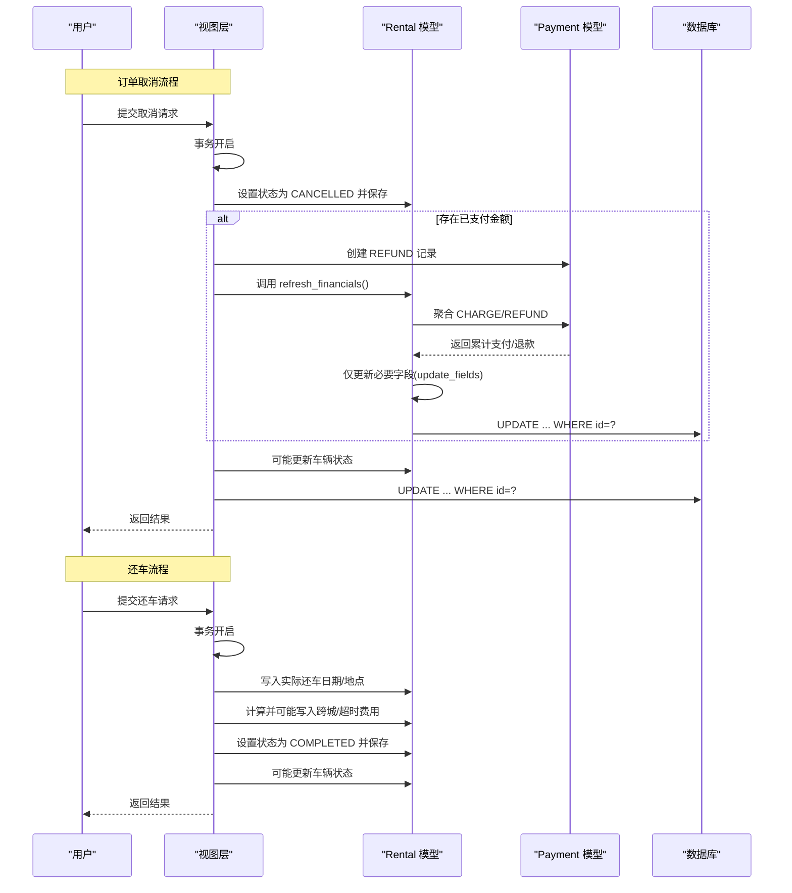
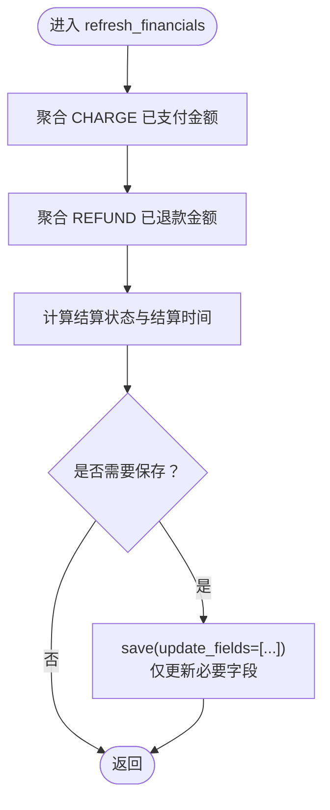
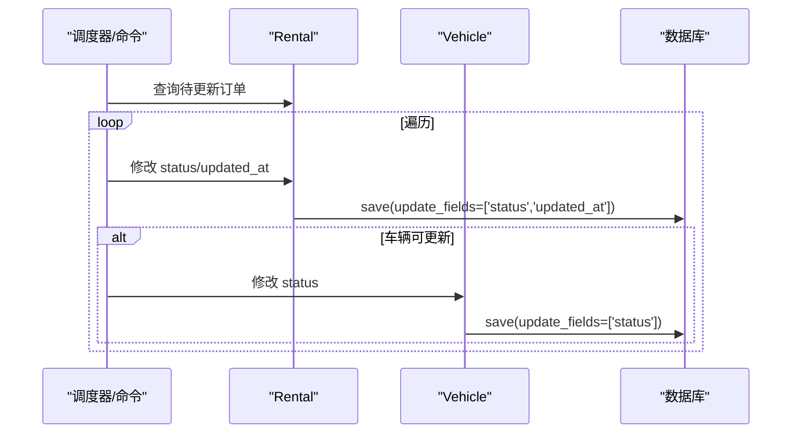
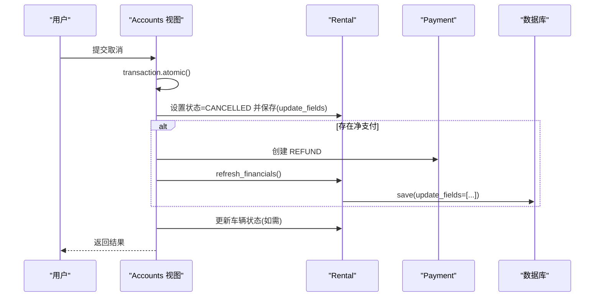
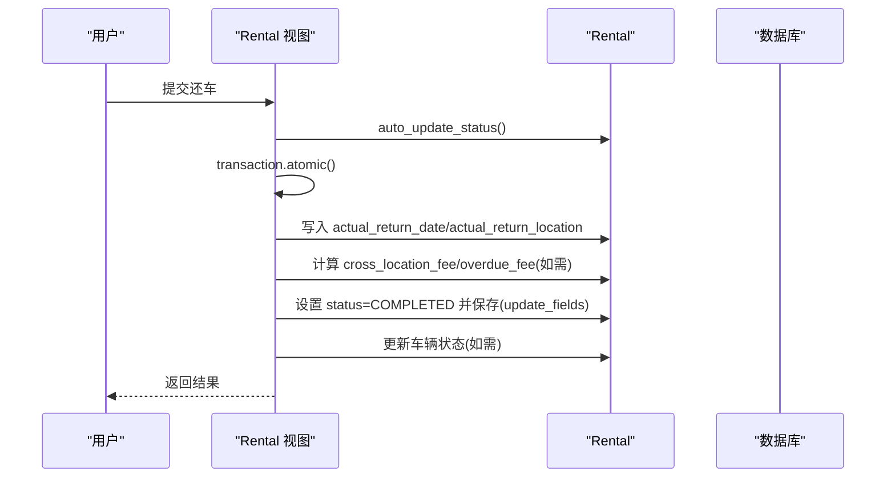
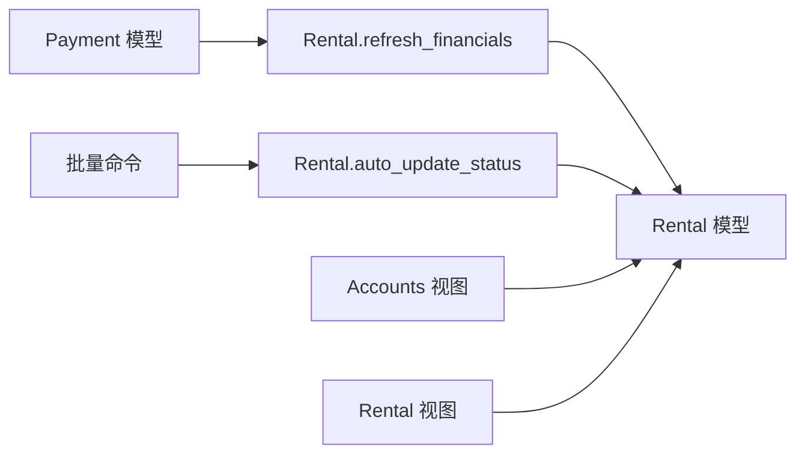

# 性能优化与锁竞争

<cite>
**本文引用的文件**
- [rentals/models.py](file://code/car_rental_system/rentals/models.py)
- [accounts/views.py](file://code/car_rental_system/accounts/views.py)
- [rentals/views.py](file://code/car_rental_system/rentals/views.py)
- [accounts/models.py](file://code/car_rental_system/accounts/models.py)
- [rentals/management/commands/update_historical_orders.py](file://code/car_rental_system/rentals/management/commands/update_historical_orders.py)
- [rentals/migrations/0003_settlement_fields.py](file://code/car_rental_system/rentals/migrations/0003_settlement_fields.py)
</cite>

## 目录
1. [引言](#引言)
2. [项目结构](#项目结构)
3. [核心组件](#核心组件)
4. [架构总览](#架构总览)
5. [详细组件分析](#详细组件分析)
6. [依赖关系分析](#依赖关系分析)
7. [性能考量](#性能考量)
8. [故障排查指南](#故障排查指南)
9. [结论](#结论)

## 引言
本文件聚焦于Rental模型的refresh_financials方法，系统性阐述其如何通过save(update_fields=[...])参数实现“细粒度字段更新”，以减少数据库写入量与锁竞争；并结合订单取消与还车流程，说明在事务中多次保存时，合理使用update_fields参数的重要性，以及如何避免不必要的信号触发与数据库日志开销，从而提升整体系统响应速度与并发稳定性。

## 项目结构
围绕本次主题的相关模块与文件如下：
- 租赁订单模型与业务逻辑：rentals/models.py
- 订单取消与还车视图：accounts/views.py、rentals/views.py
- 支付记录模型：accounts/models.py
- 历史订单批量处理命令：rentals/management/commands/update_historical_orders.py
- 财务字段迁移：rentals/migrations/0003_settlement_fields.py

图表来源
- [rentals/models.py](file://code/car_rental_system/rentals/models.py#L296-L333)
- [accounts/views.py](file://code/car_rental_system/accounts/views.py#L1026-L1091)
- [rentals/views.py](file://code/car_rental_system/rentals/views.py#L279-L307)
- [accounts/models.py](file://code/car_rental_system/accounts/models.py#L147-L248)
- [rentals/management/commands/update_historical_orders.py](file://code/car_rental_system/rentals/management/commands/update_historical_orders.py#L1-L120)

章节来源
- [rentals/models.py](file://code/car_rental_system/rentals/models.py#L1-L170)
- [accounts/views.py](file://code/car_rental_system/accounts/views.py#L1026-L1091)
- [rentals/views.py](file://code/car_rental_system/rentals/views.py#L279-L307)
- [accounts/models.py](file://code/car_rental_system/accounts/models.py#L147-L248)
- [rentals/management/commands/update_historical_orders.py](file://code/car_rental_system/rentals/management/commands/update_historical_orders.py#L1-L120)

## 核心组件
- Rental.refresh_financials：基于支付记录聚合，仅更新amount_paid、amount_refunded、settlement_status、settled_at、updated_at等必要字段，避免全量写入。
- Rental.auto_update_status：在事务中对多个Rental/vehicle对象进行状态更新，并使用update_fields减少锁范围。
- 订单取消与还车视图：在事务中多次保存，合理使用update_fields，避免触发不必要的信号与日志。
- Payment模型：提供CHARGE/REFUND两类交易类型，作为refresh_financials的聚合依据。

章节来源
- [rentals/models.py](file://code/car_rental_system/rentals/models.py#L296-L333)
- [rentals/models.py](file://code/car_rental_system/rentals/models.py#L171-L229)
- [accounts/views.py](file://code/car_rental_system/accounts/views.py#L1026-L1091)
- [rentals/views.py](file://code/car_rental_system/rentals/views.py#L279-L307)
- [accounts/models.py](file://code/car_rental_system/accounts/models.py#L147-L248)

## 架构总览
下面的序列图展示了“订单取消”与“还车”两条关键路径中，refresh_financials与update_fields的协作方式，以及它们如何降低锁竞争与日志开销。

图表来源
- [accounts/views.py](file://code/car_rental_system/accounts/views.py#L1026-L1091)
- [rentals/views.py](file://code/car_rental_system/rentals/views.py#L279-L307)
- [rentals/models.py](file://code/car_rental_system/rentals/models.py#L296-L333)
- [accounts/models.py](file://code/car_rental_system/accounts/models.py#L147-L248)

## 详细组件分析

### Rental.refresh_financials 方法与update_fields优化
- 功能要点
  - 基于Payment记录聚合，计算累计支付与累计退款。
  - 根据订单总额与已支付情况，更新结算状态与结算时间。
  - 仅对必要字段调用save(update_fields=[...])，避免全量写入。
- 关键实现位置
  - 聚合与字段赋值：[refresh_financials](file://code/car_rental_system/rentals/models.py#L296-L324)
  - update_fields写入：[save(update_fields=...)](file://code/car_rental_system/rentals/models.py#L325-L333)
- 优化收益
  - 减少UPDATE语句写入量，缩短行级锁持有时间。
  - 降低数据库redo/undo日志与索引维护成本。
  - 在高并发下显著降低锁等待与死锁概率。

图表来源
- [rentals/models.py](file://code/car_rental_system/rentals/models.py#L296-L333)

章节来源
- [rentals/models.py](file://code/car_rental_system/rentals/models.py#L296-L333)

### auto_update_status 中的细粒度更新
- 场景：定时任务/后台命令批量更新订单状态与车辆状态。
- 优化点：对每个Rental/vehicle仅更新所需字段，避免全量写入。
- 示例位置：
  - 状态更新与车辆状态联动：[auto_update_status](file://code/car_rental_system/rentals/models.py#L171-L229)
  - 批量命令中的update_fields使用：[update_historical_orders](file://code/car_rental_system/rentals/management/commands/update_historical_orders.py#L100-L159)

图表来源
- [rentals/models.py](file://code/car_rental_system/rentals/models.py#L171-L229)
- [rentals/management/commands/update_historical_orders.py](file://code/car_rental_system/rentals/management/commands/update_historical_orders.py#L100-L159)

章节来源
- [rentals/models.py](file://code/car_rental_system/rentals/models.py#L171-L229)
- [rentals/management/commands/update_historical_orders.py](file://code/car_rental_system/rentals/management/commands/update_historical_orders.py#L100-L159)

### 订单取消流程中的事务与字段更新
- 关键行为
  - 事务内设置订单状态为已取消，写入取消原因。
  - 如存在已支付金额，创建REFUND记录并调用refresh_financials刷新财务。
  - 更新车辆状态为可用。
- 优化点
  - 所有保存均使用update_fields，避免触发不必要的信号与日志。
  - 仅在必要时刷新财务字段，减少锁竞争。

图表来源
- [accounts/views.py](file://code/car_rental_system/accounts/views.py#L1026-L1091)
- [rentals/models.py](file://code/car_rental_system/rentals/models.py#L296-L333)
- [accounts/models.py](file://code/car_rental_system/accounts/models.py#L147-L248)

章节来源
- [accounts/views.py](file://code/car_rental_system/accounts/views.py#L1026-L1091)
- [rentals/models.py](file://code/car_rental_system/rentals/models.py#L296-L333)
- [accounts/models.py](file://code/car_rental_system/accounts/models.py#L147-L248)

### 还车流程中的事务与字段更新
- 关键行为
  - 自动更新状态，确保状态最新。
  - 写入实际还车日期/地点，按需计算跨城/超时费用。
  - 设置订单状态为已完成，并在必要时更新车辆状态。
- 优化点
  - 事务内多次保存均采用update_fields，降低锁范围。
  - 仅在变更发生时才写入对应字段，避免冗余日志。

图表来源
- [rentals/views.py](file://code/car_rental_system/rentals/views.py#L279-L307)
- [rentals/models.py](file://code/car_rental_system/rentals/models.py#L296-L333)

章节来源
- [rentals/views.py](file://code/car_rental_system/rentals/views.py#L279-L307)
- [rentals/models.py](file://code/car_rental_system/rentals/models.py#L296-L333)

### 财务字段的迁移与初始化
- 财务字段迁移：新增amount_paid、amount_refunded、settled_at、settlement_status等字段，并在迁移中批量填充初始值。
- 作用：为refresh_financials提供持久化存储基础，避免每次运行时都进行昂贵的全表扫描聚合。

章节来源
- [rentals/migrations/0003_settlement_fields.py](file://code/car_rental_system/rentals/migrations/0003_settlement_fields.py#L1-L84)

## 依赖关系分析
- refresh_financials依赖Payment模型的CHARGE/REFUND聚合，确保财务字段与支付记录一致。
- auto_update_status与批量命令依赖Rental与Vehicle的状态一致性，update_fields保证最小化写入。
- 视图层在事务中协调多处保存，统一采用update_fields策略，降低锁竞争。

图表来源
- [accounts/models.py](file://code/car_rental_system/accounts/models.py#L147-L248)
- [rentals/models.py](file://code/car_rental_system/rentals/models.py#L296-L333)
- [rentals/models.py](file://code/car_rental_system/rentals/models.py#L171-L229)
- [rentals/management/commands/update_historical_orders.py](file://code/car_rental_system/rentals/management/commands/update_historical_orders.py#L100-L159)
- [accounts/views.py](file://code/car_rental_system/accounts/views.py#L1026-L1091)
- [rentals/views.py](file://code/car_rental_system/rentals/views.py#L279-L307)

章节来源
- [accounts/models.py](file://code/car_rental_system/accounts/models.py#L147-L248)
- [rentals/models.py](file://code/car_rental_system/rentals/models.py#L171-L229)
- [rentals/management/commands/update_historical_orders.py](file://code/car_rental_system/rentals/management/commands/update_historical_orders.py#L100-L159)
- [accounts/views.py](file://code/car_rental_system/accounts/views.py#L1026-L1091)
- [rentals/views.py](file://code/car_rental_system/rentals/views.py#L279-L307)

## 性能考量
- 锁竞争与死锁风险
  - 使用update_fields仅更新必要字段，显著缩短行级锁持有时间，降低锁冲突概率。
  - 在事务中多次保存时，尽量合并字段到一次save(update_fields=[...])，减少多次写入带来的锁抖动。
- 日志与索引开销
  - 避免全量写入可减少redo/undo日志与索引维护成本，尤其在高频更新场景下收益明显。
- 并发场景下的建议
  - 对热点字段（如status、updated_at）采用update_fields，配合合适的索引，进一步降低锁竞争。
  - 批量处理时使用select_related/defer减少N+1查询，再配合update_fields写入，最大化吞吐。
- 信号与后处理
  - 全量save可能触发ORM信号与后处理逻辑，而update_fields通常绕过这些逻辑，有助于降低额外开销。

[本节为通用性能指导，不直接分析具体文件]

## 故障排查指南
- 症状：高并发下出现锁等待或死锁
  - 排查要点：确认是否在事务中多次save且未使用update_fields；检查是否存在全量save导致的长事务。
  - 处置：将save改为save(update_fields=[...])，仅包含必要字段。
- 症状：财务字段未及时更新
  - 排查要点：确认refresh_financials是否被调用；确认Payment记录状态与类型正确。
  - 处置：在取消/还车等关键路径显式调用refresh_financials，并确保事务提交。
- 症状：状态更新异常
  - 排查要点：检查auto_update_status与批量命令中的update_fields使用是否正确。
  - 处置：确保每个save都传入精确的update_fields列表，避免全量写入。

章节来源
- [rentals/models.py](file://code/car_rental_system/rentals/models.py#L171-L229)
- [rentals/models.py](file://code/car_rental_system/rentals/models.py#L296-L333)
- [accounts/views.py](file://code/car_rental_system/accounts/views.py#L1026-L1091)
- [rentals/views.py](file://code/car_rental_system/rentals/views.py#L279-L307)
- [rentals/management/commands/update_historical_orders.py](file://code/car_rental_system/rentals/management/commands/update_historical_orders.py#L100-L159)

## 结论
通过在Rental.refresh_financials与各类业务流程中广泛采用save(update_fields=[...])，系统实现了对数据库写入的精细化控制，有效减少了锁持有时间与日志开销，在高并发场景下显著降低了锁竞争与死锁风险。结合事务内的多次保存策略与字段选择，能够进一步提升整体响应速度与稳定性。建议在后续迭代中持续遵循这一原则，并在批量处理与状态机更新中保持一致的字段更新策略。