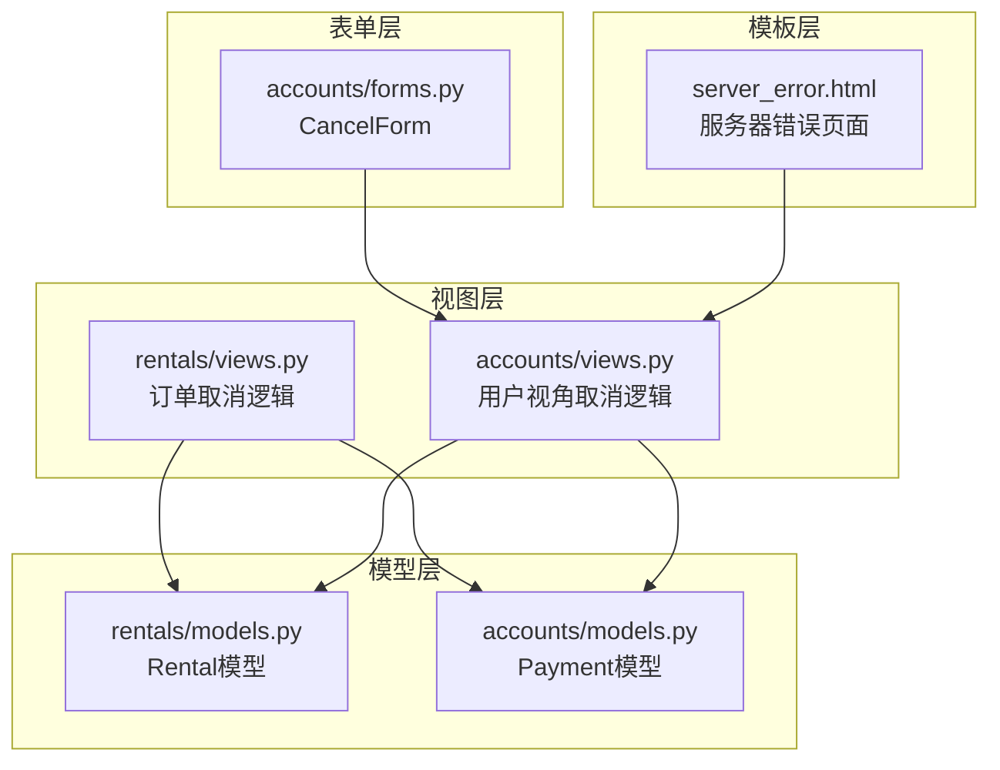
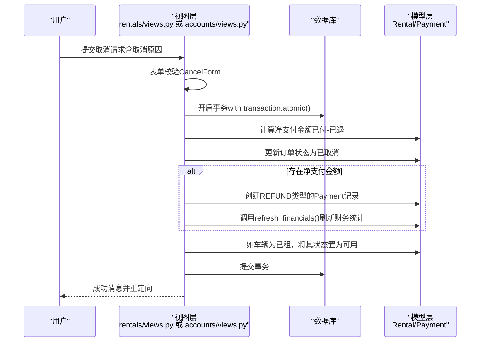
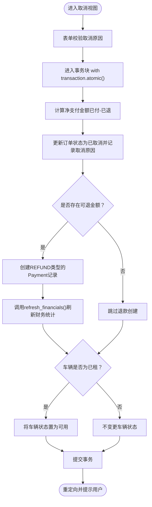
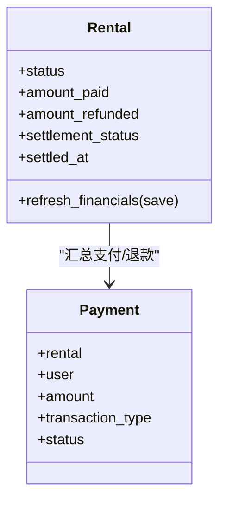
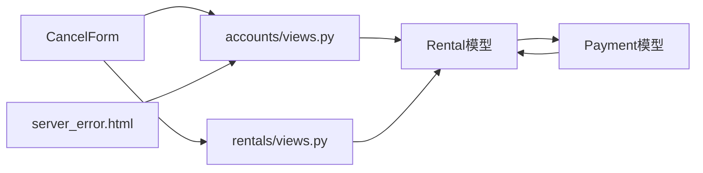

# 数据一致性保障

<cite>
**本文引用的文件**
- [rentals/views.py](file://code/car_rental_system/rentals/views.py)
- [accounts/views.py](file://code/car_rental_system/accounts/views.py)
- [rentals/models.py](file://code/car_rental_system/rentals/models.py)
- [accounts/models.py](file://code/car_rental_system/accounts/models.py)
- [accounts/forms.py](file://code/car_rental_system/accounts/forms.py)
- [server_error.html](file://code/car_rental_system/templates/server_error.html)
</cite>

## 目录
1. [引言](#引言)
2. [项目结构](#项目结构)
3. [核心组件](#核心组件)
4. [架构总览](#架构总览)
5. [详细组件分析](#详细组件分析)
6. [依赖关系分析](#依赖关系分析)
7. [性能考量](#性能考量)
8. [故障排查指南](#故障排查指南)
9. [结论](#结论)

## 引言
本文件聚焦于订单取消操作中的数据一致性保障机制，重点解析Django事务(transaction.atomic)如何确保“订单状态更新、退款记录创建、车辆状态恢复”三个操作的原子性；阐述在事务执行过程中若发生异常，系统如何自动回滚以防止数据不一致；解释Rental模型的refresh_financials方法在保存时使用update_fields参数优化数据库操作与降低锁竞争；并提供异常处理方案，包括错误日志记录与用户友好提示。

## 项目结构
围绕订单取消的关键模块与文件：
- 视图层：rentals/views.py与accounts/views.py中均包含订单取消逻辑
- 模型层：rentals/models.py中的Rental模型与accounts/models.py中的Payment模型
- 表单层：accounts/forms.py中的CancelForm
- 模板层：server_error.html用于展示服务器错误页面

图表来源
- [rentals/views.py](file://code/car_rental_system/rentals/views.py#L395-L466)
- [accounts/views.py](file://code/car_rental_system/accounts/views.py#L1026-L1091)
- [rentals/models.py](file://code/car_rental_system/rentals/models.py#L296-L333)
- [accounts/models.py](file://code/car_rental_system/accounts/models.py#L147-L200)
- [accounts/forms.py](file://code/car_rental_system/accounts/forms.py#L353-L364)
- [server_error.html](file://code/car_rental_system/templates/server_error.html#L1-L29)

章节来源
- [rentals/views.py](file://code/car_rental_system/rentals/views.py#L395-L466)
- [accounts/views.py](file://code/car_rental_system/accounts/views.py#L1026-L1091)

## 核心组件
- 订单取消视图：在rentals/views.py与accounts/views.py中分别实现，均使用Django事务包裹关键步骤，确保原子性。
- Rental模型：提供refresh_financials方法，支持使用update_fields参数仅更新必要字段，减少锁竞争与写放大。
- Payment模型：用于创建退款记录，配合订单取消流程生成REFUND类型的支付记录。
- CancelForm表单：约束取消原因输入，保证业务字段的完整性。

章节来源
- [rentals/views.py](file://code/car_rental_system/rentals/views.py#L395-L466)
- [accounts/views.py](file://code/car_rental_system/accounts/views.py#L1026-L1091)
- [rentals/models.py](file://code/car_rental_system/rentals/models.py#L296-L333)
- [accounts/models.py](file://code/car_rental_system/accounts/models.py#L147-L200)
- [accounts/forms.py](file://code/car_rental_system/accounts/forms.py#L353-L364)

## 架构总览
订单取消的端到端流程如下：
- 用户提交取消请求（表单校验）
- 视图层进入with transaction.atomic()代码块
- 计算净支付金额（已付-已退）
- 更新订单状态为已取消
- 若存在净支付金额，创建REFUND类型的Payment记录
- 刷新订单财务统计（amount_paid/amount_refunded/settlement_status）
- 将车辆状态从“已租”恢复为“可用”
- 成功后提示用户并重定向

图表来源
- [rentals/views.py](file://code/car_rental_system/rentals/views.py#L395-L466)
- [accounts/views.py](file://code/car_rental_system/accounts/views.py#L1026-L1091)
- [rentals/models.py](file://code/car_rental_system/rentals/models.py#L296-L333)
- [accounts/models.py](file://code/car_rental_system/accounts/models.py#L147-L200)

## 详细组件分析

### 订单取消视图（Django事务与原子性）
- 事务边界：两个取消视图均使用with transaction.atomic()包裹关键步骤，确保要么全部成功，要么全部回滚。
- 关键步骤：
  - 计算净支付金额：基于支付汇总函数，得到已付与已退，再求差值得到可退金额。
  - 更新订单状态为已取消，并追加取消原因。
  - 若存在可退金额，创建REFUND类型的Payment记录。
  - 刷新订单财务统计（amount_paid/amount_refunded/settlement_status等）。
  - 若车辆状态为“已租”，将其恢复为“可用”。

图表来源
- [rentals/views.py](file://code/car_rental_system/rentals/views.py#L395-L466)
- [accounts/views.py](file://code/car_rental_system/accounts/views.py#L1026-L1091)

章节来源
- [rentals/views.py](file://code/car_rental_system/rentals/views.py#L395-L466)
- [accounts/views.py](file://code/car_rental_system/accounts/views.py#L1026-L1091)

### Rental模型的refresh_financials与update_fields优化
- 功能职责：根据支付记录汇总“累计支付金额”和“累计退款金额”，并据此更新结算状态与结算时间。
- 性能优化：在save时传入update_fields参数，仅更新amount_paid、amount_refunded、settlement_status、settled_at、updated_at等必要字段，避免全量写入与不必要的锁竞争。
- 调用时机：在创建退款记录后调用，确保财务统计与数据库状态一致。

图表来源
- [rentals/models.py](file://code/car_rental_system/rentals/models.py#L296-L333)
- [accounts/models.py](file://code/car_rental_system/accounts/models.py#L147-L200)

章节来源
- [rentals/models.py](file://code/car_rental_system/rentals/models.py#L296-L333)

### 退款记录创建与车辆状态恢复
- 退款记录：当存在可退金额时，创建一条REFUND类型的Payment记录，状态为已退款，金额为净支付金额。
- 财务刷新：调用refresh_financials()以同步amount_paid/amount_refunded/settlement_status等字段。
- 车辆状态：若订单对应的车辆状态为“已租”，在事务内将其置为“可用”，确保后续调度不受影响。

章节来源
- [rentals/views.py](file://code/car_rental_system/rentals/views.py#L395-L466)
- [accounts/views.py](file://code/car_rental_system/accounts/views.py#L1026-L1091)
- [accounts/models.py](file://code/car_rental_system/accounts/models.py#L147-L200)

### 异常处理与回滚机制
- 事务回滚：Django在with transaction.atomic()块内遇到异常时会自动回滚所有已执行的操作，确保数据一致性。
- 日志记录：在自动更新状态等场景中，系统会捕获异常并记录错误日志，避免影响主流程。
- 用户提示：视图层通过消息框架向用户反馈成功或失败信息；服务器错误时由模板server_error.html统一展示。

章节来源
- [rentals/views.py](file://code/car_rental_system/rentals/views.py#L193-L229)
- [server_error.html](file://code/car_rental_system/templates/server_error.html#L1-L29)

## 依赖关系分析
- 视图依赖模型：取消视图依赖Rental与Payment模型；Rental.refresh_financials依赖Payment聚合查询。
- 表单依赖：取消视图依赖CancelForm，确保取消原因字段的合法性。
- 模板依赖：server_error.html作为通用错误页面，供全局异常处理使用。

图表来源
- [accounts/forms.py](file://code/car_rental_system/accounts/forms.py#L353-L364)
- [accounts/views.py](file://code/car_rental_system/accounts/views.py#L1026-L1091)
- [rentals/views.py](file://code/car_rental_system/rentals/views.py#L395-L466)
- [rentals/models.py](file://code/car_rental_system/rentals/models.py#L296-L333)
- [accounts/models.py](file://code/car_rental_system/accounts/models.py#L147-L200)
- [server_error.html](file://code/car_rental_system/templates/server_error.html#L1-L29)

## 性能考量
- 使用update_fields减少锁竞争：Rental.refresh_financials在save时仅更新必要字段，降低写放大与锁持有时间。
- 事务粒度控制：将订单状态更新、退款记录创建、车辆状态恢复放在同一事务中，避免中间态导致的并发问题。
- 聚合查询优化：通过聚合查询一次性统计支付/退款金额，减少多次往返数据库的开销。

章节来源
- [rentals/models.py](file://code/car_rental_system/rentals/models.py#L296-L333)
- [rentals/views.py](file://code/car_rental_system/rentals/views.py#L395-L466)
- [accounts/views.py](file://code/car_rental_system/accounts/views.py#L1026-L1091)

## 故障排查指南
- 现象：取消后订单状态未更新、退款未产生、车辆未恢复。
  - 排查要点：确认事务是否抛出异常导致回滚；检查支付汇总逻辑是否正确；核对车辆状态是否为“已租”。
- 现象：财务统计未同步。
  - 排查要点：确认refresh_financials是否被调用；检查update_fields是否包含所需字段。
- 现象：用户看到服务器错误页面。
  - 排查要点：查看日志记录位置；检查全局异常处理与server_error.html模板。

章节来源
- [rentals/views.py](file://code/car_rental_system/rentals/views.py#L193-L229)
- [server_error.html](file://code/car_rental_system/templates/server_error.html#L1-L29)

## 结论
通过Django事务的严格边界控制，订单取消流程实现了“订单状态更新、退款记录创建、车辆状态恢复”的强一致性。结合Rental.refresh_financials的update_fields优化，系统在保证数据正确性的同时，有效降低了锁竞争与写放大风险。异常处理方面，事务自动回滚与日志记录共同保障了系统的稳健性；用户层面通过消息提示与错误页面提升了体验。建议在生产环境中持续监控事务执行耗时与数据库锁等待情况，进一步优化热点路径与索引策略。