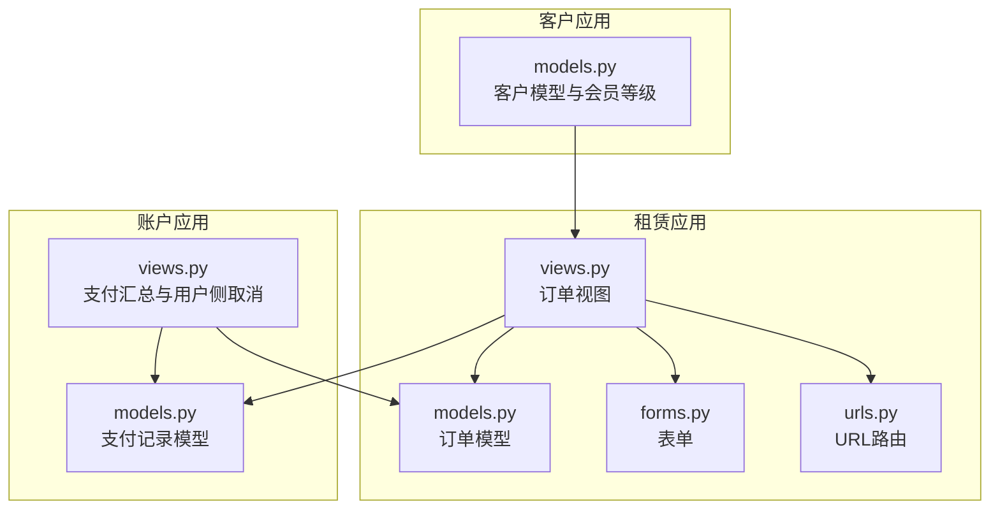
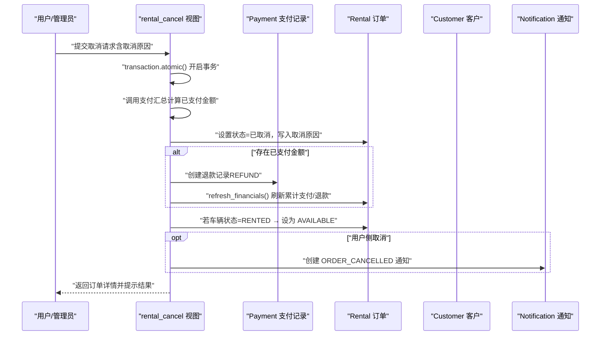
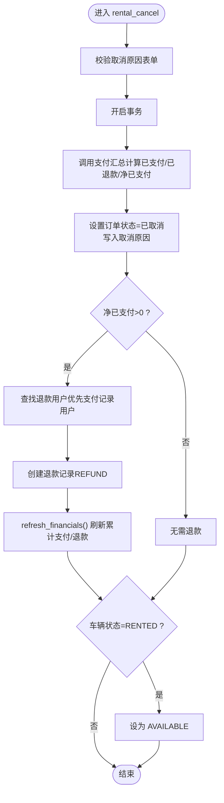
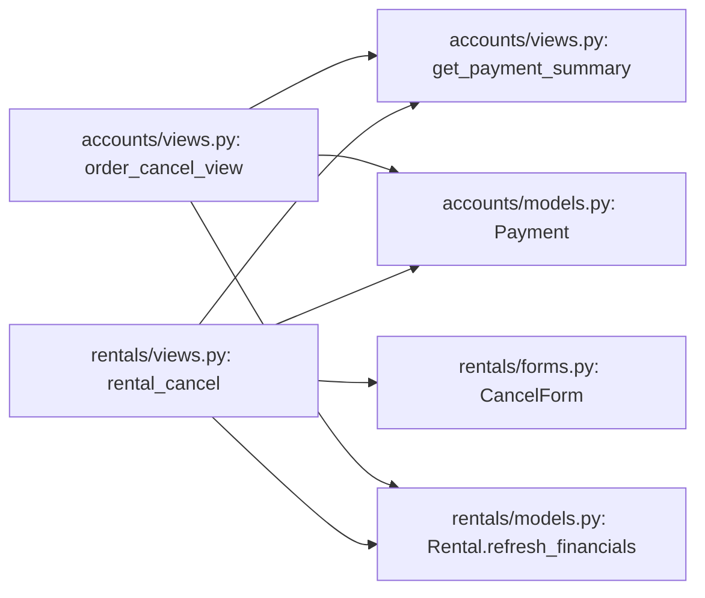
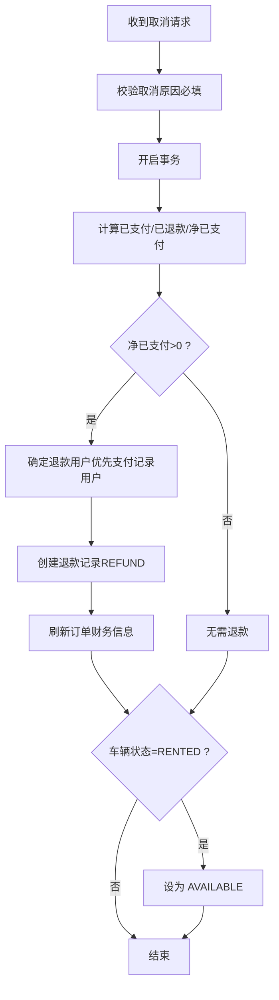

# 订单取消与退款处理

<cite>
**本文引用的文件**
- [rentals/models.py](file://code/car_rental_system/rentals/models.py)
- [rentals/views.py](file://code/car_rental_system/rentals/views.py)
- [accounts/models.py](file://code/car_rental_system/accounts/models.py)
- [accounts/views.py](file://code/car_rental_system/accounts/views.py)
- [customers/models.py](file://code/car_rental_system/customers/models.py)
- [rentals/forms.py](file://code/car_rental_system/rentals/forms.py)
- [rentals/urls.py](file://code/car_rental_system/rentals/urls.py)
- [templates/rentals/rental_confirm_cancel.html](file://code/car_rental_system/templates/rentals/rental_confirm_cancel.html)
</cite>

## 目录
1. [引言](#引言)
2. [项目结构](#项目结构)
3. [核心组件](#核心组件)
4. [架构总览](#架构总览)
5. [详细组件分析](#详细组件分析)
6. [依赖关系分析](#依赖关系分析)
7. [性能考量](#性能考量)
8. [故障排查指南](#故障排查指南)
9. [结论](#结论)
10. [附录](#附录)

## 引言
本文件围绕“订单取消与退款处理”的完整业务流程展开，重点覆盖：
- 取消原因记录、状态变更与财务处理
- rental_cancel 视图函数如何处理取消请求、如何检查已支付金额并自动生成退款记录
- 取消后车辆状态恢复为“可用”的联动更新机制
- 退款金额计算与支付记录创建的详细逻辑
- 取消操作对客户会员等级与历史订单统计的影响
- 通过事务确保数据一致性的策略
- 订单取消的决策流程图与异常处理方案

## 项目结构
本系统采用多应用分层组织，与订单取消直接相关的模块包括：
- 租赁应用（rentals）：订单模型、视图、表单、URL路由
- 账户应用（accounts）：支付记录模型、支付汇总工具、用户侧取消视图
- 客户应用（customers）：客户模型与会员等级、历史订单统计逻辑

图表来源
- [rentals/views.py](file://code/car_rental_system/rentals/views.py#L1-L563)
- [rentals/models.py](file://code/car_rental_system/rentals/models.py#L1-L401)
- [accounts/models.py](file://code/car_rental_system/accounts/models.py#L1-L318)
- [accounts/views.py](file://code/car_rental_system/accounts/views.py#L243-L902)
- [customers/models.py](file://code/car_rental_system/customers/models.py#L1-L160)
- [rentals/forms.py](file://code/car_rental_system/rentals/forms.py#L1-L364)
- [rentals/urls.py](file://code/car_rental_system/rentals/urls.py#L1-L22)

章节来源
- [rentals/views.py](file://code/car_rental_system/rentals/views.py#L1-L563)
- [rentals/models.py](file://code/car_rental_system/rentals/models.py#L1-L401)
- [accounts/models.py](file://code/car_rental_system/accounts/models.py#L1-L318)
- [accounts/views.py](file://code/car_rental_system/accounts/views.py#L243-L902)
- [customers/models.py](file://code/car_rental_system/customers/models.py#L1-L160)
- [rentals/forms.py](file://code/car_rental_system/rentals/forms.py#L1-L364)
- [rentals/urls.py](file://code/car_rental_system/rentals/urls.py#L1-L22)

## 核心组件
- 订单模型（Rental）：维护订单状态、金额、支付与退款累计、结算状态等，并提供刷新财务信息与押金退款能力
- 支付记录模型（Payment）：记录支付与退款流水，支持按订单聚合统计
- 订单视图（rental_cancel）：接收取消请求，计算已支付金额，创建退款记录，更新订单与车辆状态
- 用户侧取消视图（order_cancel_view）：面向前台用户的取消入口，校验权限与状态，执行退款与通知
- 表单（CancelForm）：约束取消原因必填
- URL路由：将取消请求映射到对应视图

章节来源
- [rentals/models.py](file://code/car_rental_system/rentals/models.py#L1-L401)
- [accounts/models.py](file://code/car_rental_system/accounts/models.py#L1-L318)
- [rentals/views.py](file://code/car_rental_system/rentals/views.py#L395-L466)
- [accounts/views.py](file://code/car_rental_system/accounts/views.py#L1026-L1091)
- [rentals/forms.py](file://code/car_rental_system/rentals/forms.py#L353-L364)
- [rentals/urls.py](file://code/car_rental_system/rentals/urls.py#L1-L22)

## 架构总览
订单取消涉及的关键交互如下：
- 用户在订单详情页发起取消，进入确认页面
- 管理端或用户端调用取消视图，基于支付汇总计算应退金额
- 创建退款记录并刷新订单财务信息
- 将订单状态置为“已取消”，若车辆处于“已租”状态则恢复为“可用”
- 若存在用户侧取消，还会发送通知

图表来源
- [rentals/views.py](file://code/car_rental_system/rentals/views.py#L395-L466)
- [accounts/views.py](file://code/car_rental_system/accounts/views.py#L1026-L1091)
- [accounts/models.py](file://code/car_rental_system/accounts/models.py#L147-L251)
- [rentals/models.py](file://code/car_rental_system/rentals/models.py#L296-L333)

## 详细组件分析

### rental_cancel 视图函数：取消请求处理全流程
- 输入：订单主键、取消原因表单
- 关键步骤：
  - 使用事务包裹，保证原子性
  - 通过支付汇总函数获取已支付金额与已退款金额，计算净已支付金额
  - 将订单状态置为“已取消”，并将取消原因写入备注
  - 若存在净已支付金额，优先从支付记录中获取退款用户，否则回退到客户关联用户；创建退款记录并刷新财务信息
  - 若车辆状态为“已租”，将其恢复为“可用”
  - 返回订单详情并提示结果

图表来源
- [rentals/views.py](file://code/car_rental_system/rentals/views.py#L395-L466)
- [accounts/views.py](file://code/car_rental_system/accounts/views.py#L243-L268)

章节来源
- [rentals/views.py](file://code/car_rental_system/rentals/views.py#L395-L466)

### 支付汇总与退款金额计算
- 支付汇总函数会聚合订单下的支付与退款记录，返回：
  - 已支付金额（仅计入已支付的支付记录）
  - 已退款金额（仅计入已退款的退款记录）
  - 净已支付金额（已支付-已退款）
- rental_cancel 视图据此决定是否创建退款记录

章节来源
- [accounts/views.py](file://code/car_rental_system/accounts/views.py#L243-L268)

### 退款记录创建与财务刷新
- 退款记录字段要点：
  - 交易类型：REFUND
  - 状态：REFUNDED
  - 金额：净已支付金额
  - 用户：优先使用支付记录中的用户，否则使用客户关联用户
  - 描述：包含订单号与退款金额
- 创建退款记录后，调用订单模型的财务刷新方法，更新累计支付、累计退款与结算状态

章节来源
- [rentals/views.py](file://code/car_rental_system/rentals/views.py#L407-L457)
- [rentals/models.py](file://code/car_rental_system/rentals/models.py#L296-L333)
- [accounts/models.py](file://code/car_rental_system/accounts/models.py#L147-L251)

### 车辆状态联动恢复机制
- 取消时若车辆状态为“已租”，立即恢复为“可用”，确保资源释放
- 该逻辑在 rental_cancel 视图中实现，保证与订单状态变更的原子性

章节来源
- [rentals/views.py](file://code/car_rental_system/rentals/views.py#L452-L456)

### 取消原因记录与备注
- 取消原因写入订单备注字段，便于审计与后续追溯
- 后台取消与前台取消均支持该行为

章节来源
- [rentals/views.py](file://code/car_rental_system/rentals/views.py#L414-L416)
- [accounts/views.py](file://code/car_rental_system/accounts/views.py#L1052-L1054)

### 事务与数据一致性
- 所有关键操作（状态变更、退款创建、财务刷新、车辆状态更新）均在事务中执行，确保原子性
- 事务失败不会影响业务流程，系统仍会记录日志以便排查

章节来源
- [rentals/views.py](file://code/car_rental_system/rentals/views.py#L407-L457)
- [rentals/models.py](file://code/car_rental_system/rentals/models.py#L171-L229)

### 客户会员等级与历史订单统计的影响
- 取消订单本身不改变客户会员等级，但会影响其历史订单统计
- VIP 升级条件依赖已完成订单的历史表现（无超时、诚信异地还车），取消订单不会计入该统计
- 若取消发生在用户侧，系统会在用户侧取消视图中创建“订单已取消”通知，便于用户感知

章节来源
- [customers/models.py](file://code/car_rental_system/customers/models.py#L101-L146)
- [accounts/views.py](file://code/car_rental_system/accounts/views.py#L1083-L1089)

### 前台用户侧取消（order_cancel_view）
- 仅允许“待确认（PENDING）”状态的订单取消
- 校验订单归属当前用户
- 执行与后台相同的退款与通知逻辑

章节来源
- [accounts/views.py](file://code/car_rental_system/accounts/views.py#L1026-L1091)

## 依赖关系分析
- 视图依赖：
  - rental_cancel 依赖支付汇总函数与支付记录模型
  - 用户侧取消视图同样依赖支付汇总函数与支付记录模型
- 模型依赖：
  - 订单模型提供财务刷新与押金退款能力
  - 支付记录模型提供交易类型、状态与金额等字段
- 表单依赖：
  - 取消原因表单要求必填，保障取消原因可追溯

图表来源
- [rentals/views.py](file://code/car_rental_system/rentals/views.py#L395-L466)
- [accounts/views.py](file://code/car_rental_system/accounts/views.py#L243-L268)
- [accounts/models.py](file://code/car_rental_system/accounts/models.py#L147-L251)
- [rentals/models.py](file://code/car_rental_system/rentals/models.py#L296-L333)
- [rentals/forms.py](file://code/car_rental_system/rentals/forms.py#L353-L364)

## 性能考量
- 自动状态更新使用缓存避免频繁更新（每5分钟最多更新一次），降低数据库压力
- 订单列表与详情页使用 select_related 与聚合查询减少数据库访问次数
- 支付汇总通过聚合查询一次性统计，避免多次往返

章节来源
- [rentals/models.py](file://code/car_rental_system/rentals/models.py#L171-L229)
- [rentals/views.py](file://code/car_rental_system/rentals/views.py#L1-L126)
- [accounts/views.py](file://code/car_rental_system/accounts/views.py#L243-L268)

## 故障排查指南
- 取消后未退款
  - 检查是否存在净已支付金额（已支付-已退款）
  - 确认退款用户是否可识别（支付记录用户或客户关联用户）
  - 查看退款记录是否创建成功
- 车辆状态未恢复
  - 确认取消时车辆状态确为“已租”
  - 检查事务是否成功提交
- 无法取消
  - 管理端取消：订单状态不受限制，但需确保事务成功
  - 用户侧取消：仅限“待确认”状态
- 日志与缓存
  - 自动状态更新失败会记录日志，可查看缓存键是否生效

章节来源
- [rentals/views.py](file://code/car_rental_system/rentals/views.py#L395-L466)
- [accounts/views.py](file://code/car_rental_system/accounts/views.py#L1026-L1091)
- [rentals/models.py](file://code/car_rental_system/rentals/models.py#L171-L229)

## 结论
订单取消流程通过“事务+支付汇总+退款记录+状态联动”的组合，实现了高可靠的数据一致性与清晰的业务闭环。取消原因被完整记录，退款金额精确计算，车辆资源及时释放，同时保留对客户会员等级与历史统计的最小影响。建议在生产环境中配合监控与日志，持续验证事务与缓存策略的有效性。

## 附录

### 订单取消决策流程图（概念示意）

### 取消原因与备注记录
- 后台取消：将取消原因写入订单备注
- 用户侧取消：同样记录取消原因

章节来源
- [rentals/views.py](file://code/car_rental_system/rentals/views.py#L414-L416)
- [accounts/views.py](file://code/car_rental_system/accounts/views.py#L1052-L1054)

### 取消确认页面与交互
- 确认页面展示订单基本信息、客户与车辆信息、租赁时间信息
- 提示取消后的影响（状态变更、车辆恢复、原因记录、可重新预订）

章节来源
- [templates/rentals/rental_confirm_cancel.html](file://code/car_rental_system/templates/rentals/rental_confirm_cancel.html#L1-L219)