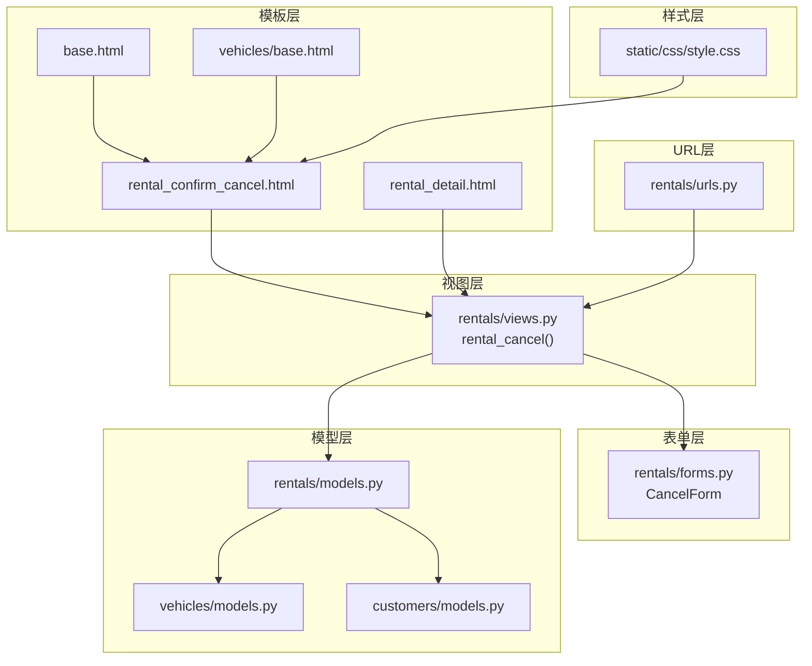
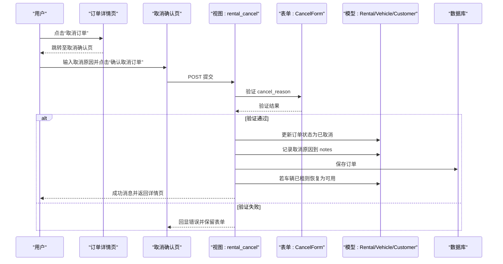
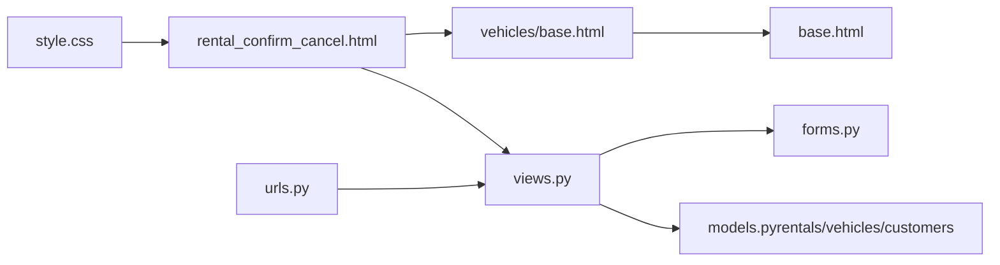

# 取消确认用户界面

<cite>
**本文引用的文件**
- [rental_confirm_cancel.html](file://code/car_rental_system/templates/rentals/rental_confirm_cancel.html)
- [views.py](file://code/car_rental_system/rentals/views.py)
- [forms.py](file://code/car_rental_system/rentals/forms.py)
- [urls.py](file://code/car_rental_system/rentals/urls.py)
- [base.html](file://code/car_rental_system/templates/base.html)
- [vehicles/base.html](file://code/car_rental_system/templates/vehicles/base.html)
- [rental_detail.html](file://code/car_rental_system/templates/rentals/rental_detail.html)
- [models.py（rentals）](file://code/car_rental_system/rentals/models.py)
- [models.py（vehicles）](file://code/car_rental_system/vehicles/models.py)
- [models.py（customers）](file://code/car_rental_system/customers/models.py)
- [style.css](file://code/car_rental_system/static/css/style.css)
</cite>

## 目录
1. [简介](#简介)
2. [项目结构](#项目结构)
3. [核心组件](#核心组件)
4. [架构总览](#架构总览)
5. [详细组件分析](#详细组件分析)
6. [依赖关系分析](#依赖关系分析)
7. [性能考量](#性能考量)
8. [故障排查指南](#故障排查指南)
9. [结论](#结论)

## 简介
本文件围绕“取消订单”的前端用户界面展开，基于模板 rental_confirm_cancel.html 的布局与交互进行深入解析。文档覆盖以下要点：
- 表单通过 CancelForm 渲染取消原因输入字段，并提供前端验证提示与错误反馈机制
- 界面中展示的订单关键信息（订单号、客户信息、车辆信息、租赁时间）如何帮助用户确认操作
- 确认按钮的 JavaScript 确认对话框实现
- CSRF 保护机制的集成方式
- 基于 Bootstrap 组件的响应式设计与视觉层次，如何提升操作安全性

## 项目结构
与“取消确认”相关的文件组织如下：
- 模板层：rental_confirm_cancel.html、rental_detail.html、base.html、vehicles/base.html
- 视图层：rentals/views.py 中的 rental_cancel 视图
- 表单层：rentals/forms.py 中的 CancelForm
- URL 层：rentals/urls.py 中的取消路由
- 模型层：rentals/models.py、vehicles/models.py、customers/models.py 提供数据支撑
- 样式层：static/css/style.css 提供通用样式与响应式网格

图表来源
- [rental_confirm_cancel.html](file://code/car_rental_system/templates/rentals/rental_confirm_cancel.html#L1-L219)
- [rental_detail.html](file://code/car_rental_system/templates/rentals/rental_detail.html#L1-L385)
- [base.html](file://code/car_rental_system/templates/base.html#L1-L291)
- [vehicles/base.html](file://code/car_rental_system/templates/vehicles/base.html#L1-L27)
- [views.py](file://code/car_rental_system/rentals/views.py#L395-L467)
- [forms.py](file://code/car_rental_system/rentals/forms.py#L353-L364)
- [urls.py](file://code/car_rental_system/rentals/urls.py#L1-L22)
- [models.py（rentals）](file://code/car_rental_system/rentals/models.py#L1-L401)
- [models.py（vehicles）](file://code/car_rental_system/vehicles/models.py#L1-L85)
- [models.py（customers）](file://code/car_rental_system/customers/models.py#L1-L160)
- [style.css](file://code/car_rental_system/static/css/style.css#L1-L668)

章节来源
- [rental_confirm_cancel.html](file://code/car_rental_system/templates/rentals/rental_confirm_cancel.html#L1-L219)
- [views.py](file://code/car_rental_system/rentals/views.py#L395-L467)
- [forms.py](file://code/car_rental_system/rentals/forms.py#L353-L364)
- [urls.py](file://code/car_rental_system/rentals/urls.py#L1-L22)
- [base.html](file://code/car_rental_system/templates/base.html#L1-L291)
- [vehicles/base.html](file://code/car_rental_system/templates/vehicles/base.html#L1-L27)
- [rental_detail.html](file://code/car_rental_system/templates/rentals/rental_detail.html#L1-L385)
- [models.py（rentals）](file://code/car_rental_system/rentals/models.py#L1-L401)
- [models.py（vehicles）](file://code/car_rental_system/vehicles/models.py#L1-L85)
- [models.py（customers）](file://code/car_rental_system/customers/models.py#L1-L160)
- [style.css](file://code/car_rental_system/static/css/style.css#L1-L668)

## 核心组件
- 模板 rental_confirm_cancel.html：承载取消确认界面，包含订单关键信息展示区、取消原因输入区、提示与确认按钮。
- 视图 rental_cancel：处理 POST 提交，执行取消逻辑（状态变更、退款记录、车辆状态恢复），并渲染取消确认模板。
- 表单 CancelForm：定义取消原因字段及必填约束，配合 Django 表单渲染与错误回显。
- URL 路由：将 /<int:pk>/cancel/ 映射至 rental_cancel 视图。
- 基础模板与样式：继承 base.html/vehicles/base.html，使用 Bootstrap 组件与自定义样式，保证响应式与一致性。

章节来源
- [rental_confirm_cancel.html](file://code/car_rental_system/templates/rentals/rental_confirm_cancel.html#L1-L219)
- [views.py](file://code/car_rental_system/rentals/views.py#L395-L467)
- [forms.py](file://code/car_rental_system/rentals/forms.py#L353-L364)
- [urls.py](file://code/car_rental_system/rentals/urls.py#L1-L22)
- [base.html](file://code/car_rental_system/templates/base.html#L1-L291)
- [vehicles/base.html](file://code/car_rental_system/templates/vehicles/base.html#L1-L27)

## 架构总览
下面的序列图展示了从订单详情页点击“取消订单”到最终提交取消请求的端到端流程。

图表来源
- [rental_detail.html](file://code/car_rental_system/templates/rentals/rental_detail.html#L329-L369)
- [rental_confirm_cancel.html](file://code/car_rental_system/templates/rentals/rental_confirm_cancel.html#L171-L219)
- [views.py](file://code/car_rental_system/rentals/views.py#L395-L467)
- [forms.py](file://code/car_rental_system/rentals/forms.py#L353-L364)
- [models.py（rentals）](file://code/car_rental_system/rentals/models.py#L1-L401)
- [models.py（vehicles）](file://code/car_rental_system/vehicles/models.py#L1-L85)
- [models.py（customers）](file://code/car_rental_system/customers/models.py#L1-L160)

## 详细组件分析

### 模板布局与信息展示
- 页面标题与返回入口：页面顶部包含标题与返回详情页的按钮，便于用户随时返回。
- 重要提示区：以警告样式卡片突出“取消不可撤销”的风险提示，强化安全意识。
- 订单基本信息卡片：展示订单号、当前状态、应付金额、创建时间，帮助用户核对订单。
- 客户信息卡片：展示客户姓名、电话、会员等级，便于确认操作对象。
- 车辆信息卡片：展示品牌/型号、车牌号、车辆状态，提醒用户释放资源。
- 租赁时间信息卡片：展示开始/结束日期、租赁天数，帮助用户理解影响范围。
- 取消原因输入卡片：包含取消原因文本域、必填标记、辅助说明与错误回显；下方提供取消后的预期影响提示；底部包含“返回”和“确认取消订单”两个按钮。

章节来源
- [rental_confirm_cancel.html](file://code/car_rental_system/templates/rentals/rental_confirm_cancel.html#L1-L219)

### 表单与前端验证
- 表单字段：CancelForm 定义了取消原因字段，要求必填。
- 渲染与错误回显：模板中使用 Django 表单渲染语法输出字段，并在字段存在错误时显示第一条错误信息，提升用户感知与修正效率。
- 前端验证提示：字段带有必填星号与辅助说明，配合 Bootstrap 样式形成清晰的视觉层级。

章节来源
- [forms.py](file://code/car_rental_system/rentals/forms.py#L353-L364)
- [rental_confirm_cancel.html](file://code/car_rental_system/templates/rentals/rental_confirm_cancel.html#L171-L219)

### 确认按钮的 JavaScript 对话框
- 确认对话框：确认按钮采用原生 JavaScript 的 confirm 对话框，弹出“确认取消此订单？此操作不可撤销！”提示，二次确认降低误操作风险。
- 交互流程：用户点击“确认取消订单”，若点击“确定”，继续提交表单；若点击“取消”，停留在当前页。

章节来源
- [rental_confirm_cancel.html](file://code/car_rental_system/templates/rentals/rental_confirm_cancel.html#L207-L214)

### CSRF 保护机制
- CSRF Token：表单中包含 ，确保 POST 请求具备 CSRF 令牌，防止跨站请求伪造攻击。
- 视图处理：视图函数 rental_cancel 接收 POST 请求并在内部进行表单验证与业务处理，配合框架内置的 CSRF 中间件共同保障安全。

章节来源
- [rental_confirm_cancel.html](file://code/car_rental_system/templates/rentals/rental_confirm_cancel.html#L178-L180)
- [views.py](file://code/car_rental_system/rentals/views.py#L395-L467)

### 响应式设计与视觉层次
- Bootstrap 组件：广泛使用卡片（card）、网格（row/col）、徽章（badge）、按钮（btn）等组件，统一风格与交互。
- 响应式布局：模板中使用 Bootstrap 的栅格系统（如 col-lg-3、col-md-6），在不同屏幕尺寸下自动调整列宽与间距，保证移动端体验。
- 视觉层次：通过颜色（主色/信息色/警告色/危险色）、阴影（shadow-sm）、间距（mb-4、gap）与字体权重（fw-semibold、h5）构建清晰的信息层级，突出关键信息与操作按钮。
- 自定义样式：style.css 提供卡片、按钮、表单控件、网格等通用样式，确保界面一致性和专业感。

章节来源
- [base.html](file://code/car_rental_system/templates/base.html#L1-L291)
- [vehicles/base.html](file://code/car_rental_system/templates/vehicles/base.html#L1-L27)
- [style.css](file://code/car_rental_system/static/css/style.css#L1-L668)
- [rental_confirm_cancel.html](file://code/car_rental_system/templates/rentals/rental_confirm_cancel.html#L1-L219)

### 订单关键信息如何帮助用户确认
- 订单号与状态：让用户明确操作目标与当前状态，避免误操作。
- 客户信息：核对操作对象，防止越权或错配。
- 车辆信息：提醒释放资源，避免重复占用。
- 租赁时间：帮助用户理解影响范围（如是否已开始/结束）。
- 金额与创建时间：提供财务与时间参考，便于后续对账与审计。

章节来源
- [rental_confirm_cancel.html](file://code/car_rental_system/templates/rentals/rental_confirm_cancel.html#L27-L169)
- [models.py（rentals）](file://code/car_rental_system/rentals/models.py#L1-L401)
- [models.py（vehicles）](file://code/car_rental_system/vehicles/models.py#L1-L85)
- [models.py（customers）](file://code/car_rental_system/customers/models.py#L1-L160)

### 取消逻辑与状态联动
- 视图处理：接收 POST 后，校验表单，更新订单状态为“已取消”，将取消原因写入 notes，并在必要时恢复车辆状态为“可用”。若存在已支付金额，创建退款记录并刷新财务信息。
- 路由映射：URL 将 /<int:pk>/cancel/ 映射到 rental_cancel，支持从订单详情页直接进入取消确认页。
- 模板入口：订单详情页在“进行中/预订中”状态下提供“取消订单”入口，引导用户到取消确认页。

章节来源
- [views.py](file://code/car_rental_system/rentals/views.py#L395-L467)
- [urls.py](file://code/car_rental_system/rentals/urls.py#L1-L22)
- [rental_detail.html](file://code/car_rental_system/templates/rentals/rental_detail.html#L329-L369)

## 依赖关系分析
- 模板依赖：rental_confirm_cancel.html 继承 vehicles/base.html，后者再继承 base.html，形成统一的头部、导航、消息容器与脚本加载。
- 视图依赖：rental_cancel 依赖 CancelForm、Rental/Vehicle/Customer 模型与 accounts 支付模块（退款记录）。
- URL 依赖：取消路由依赖 rentals 应用命名空间，视图函数通过名称解析生成链接。
- 样式依赖：模板使用 Bootstrap 组件与自定义样式，确保一致的视觉与交互体验。

图表来源
- [rental_confirm_cancel.html](file://code/car_rental_system/templates/rentals/rental_confirm_cancel.html#L1-L219)
- [vehicles/base.html](file://code/car_rental_system/templates/vehicles/base.html#L1-L27)
- [base.html](file://code/car_rental_system/templates/base.html#L1-L291)
- [views.py](file://code/car_rental_system/rentals/views.py#L395-L467)
- [forms.py](file://code/car_rental_system/rentals/forms.py#L353-L364)
- [urls.py](file://code/car_rental_system/rentals/urls.py#L1-L22)
- [models.py（rentals）](file://code/car_rental_system/rentals/models.py#L1-L401)
- [models.py（vehicles）](file://code/car_rental_system/vehicles/models.py#L1-L85)
- [models.py（customers）](file://code/car_rental_system/customers/models.py#L1-L160)
- [style.css](file://code/car_rental_system/static/css/style.css#L1-L668)

## 性能考量
- 模板渲染：模板采用卡片与网格布局，结构清晰，避免过度嵌套，有利于浏览器渲染性能。
- 资源加载：基础模板通过 CDN 加载 Bootstrap 与 Font Awesome，并提供备选方案，减少资源加载失败带来的影响。
- 交互确认：原生 confirm 对话框无额外依赖，开销极低，适合轻量级二次确认场景。

[本节为通用建议，不直接分析具体文件]

## 故障排查指南
- 表单未提交或报错
  - 检查模板中是否包含 CSRF Token，确保 POST 请求有效
  - 检查 CancelForm 字段是否必填，确认用户已填写取消原因
- 确认按钮无效
  - 检查按钮 onclick 是否正确绑定 confirm 对话框
  - 确认浏览器未禁用弹窗
- 状态未更新或车辆未恢复
  - 检查视图 rental_cancel 的业务逻辑是否执行（订单状态、车辆状态、退款记录）
  - 查看消息提示与返回详情页的最新状态
- 链接无法访问
  - 检查 URL 配置是否正确映射到 rentals:rental_cancel
  - 确认订单状态允许取消（仅“预订中/进行中”可取消）

章节来源
- [rental_confirm_cancel.html](file://code/car_rental_system/templates/rentals/rental_confirm_cancel.html#L171-L219)
- [views.py](file://code/car_rental_system/rentals/views.py#L395-L467)
- [urls.py](file://code/car_rental_system/rentals/urls.py#L1-L22)
- [rental_detail.html](file://code/car_rental_system/templates/rentals/rental_detail.html#L329-L369)

## 结论
取消确认用户界面通过清晰的信息展示、严格的表单验证与二次确认对话框，有效提升了操作安全性与用户体验。结合 CSRF 保护与响应式设计，系统在易用性与安全性之间取得良好平衡。建议在后续迭代中进一步完善错误提示文案与可访问性细节，持续优化交互流畅度。