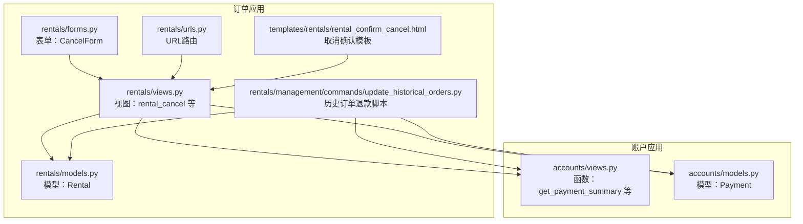
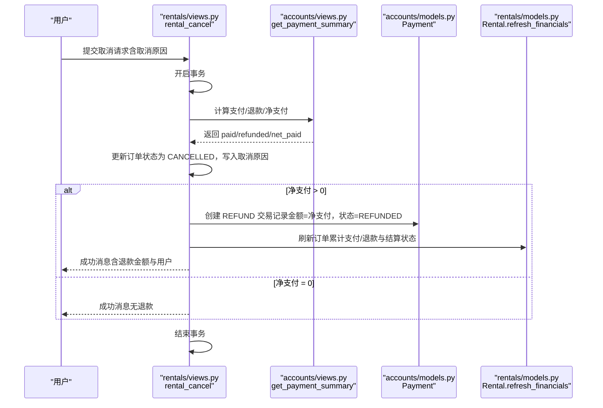
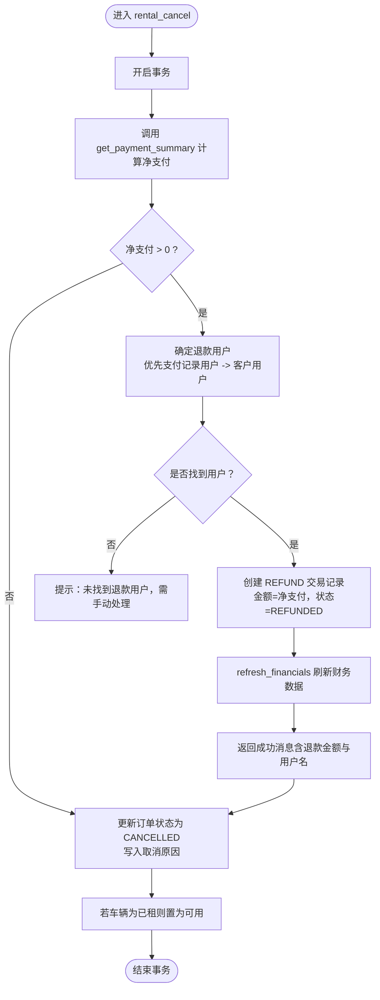
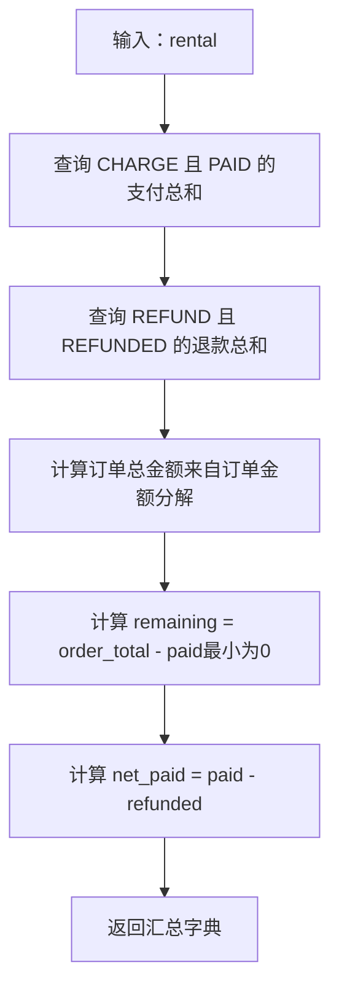
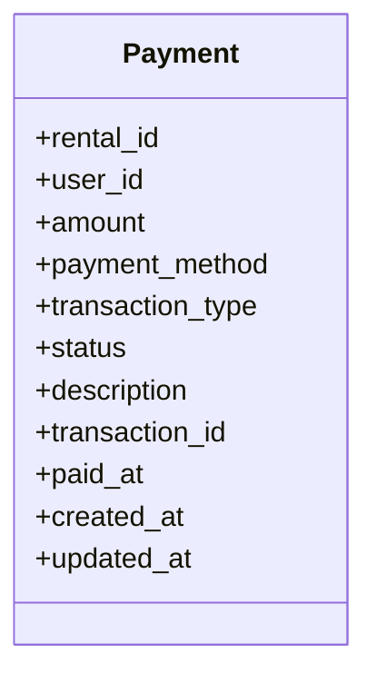
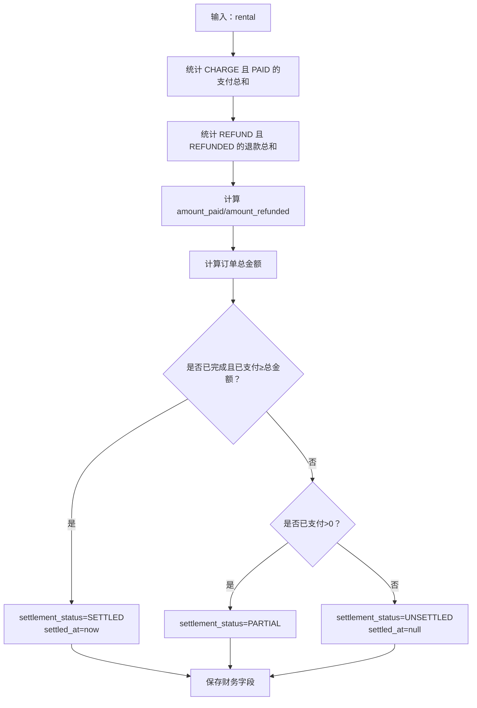
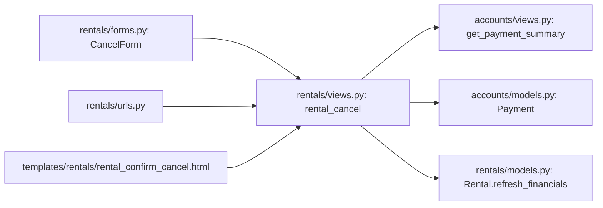

# 取消订单财务处理

<cite>
**本文引用的文件**
- [rentals/views.py](file://code/car_rental_system/rentals/views.py)
- [accounts/views.py](file://code/car_rental_system/accounts/views.py)
- [accounts/models.py](file://code/car_rental_system/accounts/models.py)
- [rentals/models.py](file://code/car_rental_system/rentals/models.py)
- [rentals/forms.py](file://code/car_rental_system/rentals/forms.py)
- [rentals/urls.py](file://code/car_rental_system/rentals/urls.py)
- [templates/rentals/rental_confirm_cancel.html](file://code/car_rental_system/templates/rentals/rental_confirm_cancel.html)
- [rentals/management/commands/update_historical_orders.py](file://code/car_rental_system/rentals/management/commands/update_historical_orders.py)
</cite>

## 目录
1. [引言](#引言)
2. [项目结构](#项目结构)
3. [核心组件](#核心组件)
4. [架构总览](#架构总览)
5. [详细组件分析](#详细组件分析)
6. [依赖关系分析](#依赖关系分析)
7. [性能考量](#性能考量)
8. [故障排查指南](#故障排查指南)
9. [结论](#结论)

## 引言
本文件聚焦“订单取消时的财务处理流程”，围绕以下目标展开：
- 解释 rental_cancel 视图如何调用 get_payment_summary 函数计算净支付金额，并据此创建退款记录；
- 说明 Payment 模型在处理 REFUND 类型交易时的字段设置逻辑（退款金额、支付方式、用户关联、交易ID生成规则）；
- 阐述事务性操作如何确保订单状态更新与退款记录创建的原子性，防止财务数据不一致；
- 提供从取消提交到退款完成的完整数据流路径分析；
- 说明在用户信息缺失时的降级处理策略。

## 项目结构
本系统采用分层清晰的 Django 应用组织方式，涉及订单管理、账户支付、车辆与客户模块。与取消财务处理直接相关的模块与文件如下：
- 订单应用（rentals）：视图、模型、表单、URL、管理命令
- 账户应用（accounts）：支付模型、支付汇总视图函数

图表来源
- [rentals/views.py](file://code/car_rental_system/rentals/views.py#L395-L466)
- [accounts/views.py](file://code/car_rental_system/accounts/views.py#L243-L268)
- [accounts/models.py](file://code/car_rental_system/accounts/models.py#L147-L251)
- [rentals/models.py](file://code/car_rental_system/rentals/models.py#L12-L169)
- [rentals/forms.py](file://code/car_rental_system/rentals/forms.py#L353-L364)
- [rentals/urls.py](file://code/car_rental_system/rentals/urls.py#L9-L19)
- [templates/rentals/rental_confirm_cancel.html](file://code/car_rental_system/templates/rentals/rental_confirm_cancel.html#L171-L219)
- [rentals/management/commands/update_historical_orders.py](file://code/car_rental_system/rentals/management/commands/update_historical_orders.py#L213-L270)

章节来源
- [rentals/views.py](file://code/car_rental_system/rentals/views.py#L395-L466)
- [accounts/views.py](file://code/car_rental_system/accounts/views.py#L243-L268)
- [accounts/models.py](file://code/car_rental_system/accounts/models.py#L147-L251)
- [rentals/models.py](file://code/car_rental_system/rentals/models.py#L12-L169)
- [rentals/forms.py](file://code/car_rental_system/rentals/forms.py#L353-L364)
- [rentals/urls.py](file://code/car_rental_system/rentals/urls.py#L9-L19)
- [templates/rentals/rental_confirm_cancel.html](file://code/car_rental_system/templates/rentals/rental_confirm_cancel.html#L171-L219)
- [rentals/management/commands/update_historical_orders.py](file://code/car_rental_system/rentals/management/commands/update_historical_orders.py#L213-L270)

## 核心组件
- rental_cancel 视图：接收取消请求，计算净支付金额，更新订单状态，必要时创建 REFUND 交易记录，并刷新财务统计。
- get_payment_summary 函数：汇总某订单的已支付金额、已退款金额、净支付金额等关键指标。
- Payment 模型：统一承载支付与退款记录，定义交易类型、状态、支付方式、交易号等字段。
- Rental 模型：维护订单金额、累计支付/退款、结算状态等财务字段，并提供 refresh_financials 刷新逻辑。
- CancelForm 表单：约束取消原因必填，保证业务留痕。
- URL 与模板：提供取消入口与确认交互界面。

章节来源
- [rentals/views.py](file://code/car_rental_system/rentals/views.py#L395-L466)
- [accounts/views.py](file://code/car_rental_system/accounts/views.py#L243-L268)
- [accounts/models.py](file://code/car_rental_system/accounts/models.py#L147-L251)
- [rentals/models.py](file://code/car_rental_system/rentals/models.py#L296-L333)
- [rentals/forms.py](file://code/car_rental_system/rentals/forms.py#L353-L364)
- [rentals/urls.py](file://code/car_rental_system/rentals/urls.py#L9-L19)
- [templates/rentals/rental_confirm_cancel.html](file://code/car_rental_system/templates/rentals/rental_confirm_cancel.html#L171-L219)

## 架构总览
取消订单财务处理的关键流程由“视图层 -> 服务函数 -> 模型层”构成，全程通过数据库事务包裹，确保原子性与一致性。

图表来源
- [rentals/views.py](file://code/car_rental_system/rentals/views.py#L395-L466)
- [accounts/views.py](file://code/car_rental_system/accounts/views.py#L243-L268)
- [accounts/models.py](file://code/car_rental_system/accounts/models.py#L147-L251)
- [rentals/models.py](file://code/car_rental_system/rentals/models.py#L296-L333)

## 详细组件分析

### 1) 视图：rental_cancel（取消订单）
- 关键点
  - 使用事务包裹取消全流程，确保订单状态更新与退款记录创建的原子性。
  - 调用 get_payment_summary 计算净支付金额（已支付-已退款），仅当净支付大于零时创建退款记录。
  - 用户关联策略：优先从支付记录中提取用户；若无支付记录则回退到客户关联的用户；若仍无用户则提示手动处理。
  - 交易ID生成规则：REFUND 类型交易号以“REF”前缀加当前时间戳生成，保证唯一性。
  - 财务刷新：创建退款后调用 refresh_financials，同步 amount_paid/amount_refunded/settlement_status。
  - 车辆状态：若订单处于已租状态，取消后恢复为可用。

图表来源
- [rentals/views.py](file://code/car_rental_system/rentals/views.py#L395-L466)

章节来源
- [rentals/views.py](file://code/car_rental_system/rentals/views.py#L395-L466)

### 2) 服务函数：get_payment_summary（支付汇总）
- 功能
  - 汇总某订单的已支付金额、已退款金额、订单总金额、剩余应付金额、净支付金额等。
  - 通过聚合查询一次性统计，避免多次往返数据库，提升性能。
- 输出
  - 返回 paid_amount、refunded_amount、net_paid、remaining_amount、order_total_amount 等键值。

图表来源
- [accounts/views.py](file://code/car_rental_system/accounts/views.py#L243-L268)

章节来源
- [accounts/views.py](file://code/car_rental_system/accounts/views.py#L243-L268)

### 3) 模型：Payment（支付/退款记录）
- 字段与约束
  - 交易类型：CHARGE/REFUND
  - 状态：PENDING/PAID/FAILED/REFUNDED
  - 支付方式：ALIPAY/WECHAT/BANK/CASH
  - 交易号：transaction_id（REFUND 类型以“REF”前缀+时间戳生成）
  - 外键：关联 Rental 与 User
- REFUND 类型字段设置逻辑
  - 金额：等于净支付金额（net_paid）
  - 支付方式：默认 BANK
  - 状态：REFUNDED
  - 描述：包含“订单取消，退还已支付金额”等信息
  - paid_at：退款发生时间
  - transaction_id：REFUND 类型交易号生成规则

图表来源
- [accounts/models.py](file://code/car_rental_system/accounts/models.py#L147-L251)

章节来源
- [accounts/models.py](file://code/car_rental_system/accounts/models.py#L147-L251)

### 4) 模型：Rental（订单财务刷新）
- 财务字段
  - amount_paid：累计支付金额（不含退款）
  - amount_refunded：累计退款金额
  - settlement_status：UNSETTLED/PARTIAL/SETTLED
  - settled_at：结算完成时间
- refresh_financials
  - 基于支付记录重新计算 amount_paid/amount_refunded
  - 根据订单总金额与已支付金额更新结算状态与结算时间
  - 保存更新后的财务字段

图表来源
- [rentals/models.py](file://code/car_rental_system/rentals/models.py#L296-L333)

章节来源
- [rentals/models.py](file://code/car_rental_system/rentals/models.py#L296-L333)

### 5) 表单与URL
- CancelForm：取消原因必填，便于审计与留痕。
- URL：/rentals/<int:pk>/cancel/ 映射至 rental_cancel 视图。
- 模板：rental_confirm_cancel.html 提供取消确认页面，包含取消原因输入与影响提示。

章节来源
- [rentals/forms.py](file://code/car_rental_system/rentals/forms.py#L353-L364)
- [rentals/urls.py](file://code/car_rental_system/rentals/urls.py#L9-L19)
- [templates/rentals/rental_confirm_cancel.html](file://code/car_rental_system/templates/rentals/rental_confirm_cancel.html#L171-L219)

### 6) 历史订单退款（补充机制）
- 历史脚本会扫描已取消订单，基于 get_payment_summary 计算净支付，若存在未退款的已支付金额，自动创建 REFUND 交易并刷新财务数据。
- 与在线取消流程一致的用户查找与交易号生成规则。

章节来源
- [rentals/management/commands/update_historical_orders.py](file://code/car_rental_system/rentals/management/commands/update_historical_orders.py#L213-L270)

## 依赖关系分析
- 视图依赖
  - rental_cancel 依赖 get_payment_summary（accounts/views.py）计算净支付金额；
  - 依赖 Payment 模型创建 REFUND 记录；
  - 依赖 Rental.refresh_financials 刷新财务数据；
  - 依赖 CancelForm 表单校验取消原因。
- 模型依赖
  - Payment 外键关联 Rental 与 User；
  - Rental 通过 refresh_financials 聚合 Payment 数据。
- URL/模板依赖
  - URL 将取消请求路由到 rental_cancel；
  - 模板提供取消确认交互。

图表来源
- [rentals/views.py](file://code/car_rental_system/rentals/views.py#L395-L466)
- [accounts/views.py](file://code/car_rental_system/accounts/views.py#L243-L268)
- [accounts/models.py](file://code/car_rental_system/accounts/models.py#L147-L251)
- [rentals/models.py](file://code/car_rental_system/rentals/models.py#L296-L333)
- [rentals/forms.py](file://code/car_rental_system/rentals/forms.py#L353-L364)
- [rentals/urls.py](file://code/car_rental_system/rentals/urls.py#L9-L19)
- [templates/rentals/rental_confirm_cancel.html](file://code/car_rental_system/templates/rentals/rental_confirm_cancel.html#L171-L219)

## 性能考量
- 聚合查询：get_payment_summary 使用聚合一次性统计支付/退款，减少数据库往返。
- 事务包裹：取消流程整体在单个事务中执行，避免中间态导致的数据不一致。
- 缓存与索引：Rental.auto_update_status 使用缓存降低频繁状态更新开销；Payment/Rental 模型具备常用字段索引，有利于查询性能。
- 建议
  - 若退款量大，可考虑异步任务队列处理退款创建与财务刷新，避免长事务阻塞。
  - 对 get_payment_summary 的调用尽量复用已有支付集合，减少重复查询。

[本节为通用建议，无需特定文件来源]

## 故障排查指南
- 无法创建退款
  - 检查是否存在净支付金额（已支付-已退款）。若为零则不会创建退款记录。
  - 检查退款用户来源：是否能找到支付记录中的用户或客户关联用户。
  - 若用户缺失，系统会提示“未找到退款用户，需手动处理”，应人工核对并补录退款。
- 退款未生效
  - 确认是否调用了 refresh_financials 刷新财务数据。
  - 检查订单结算状态是否正确更新（PARTIAL/SETTLED）。
- 交易号冲突
  - REFUND 交易号以“REF”前缀+时间戳生成，理论上唯一；若出现冲突，检查时间源或并发场景下的时序问题。
- 历史订单未退款
  - 使用历史脚本批量处理已取消订单的退款，确保其满足“存在净支付且未退款”的条件。

章节来源
- [rentals/views.py](file://code/car_rental_system/rentals/views.py#L395-L466)
- [accounts/views.py](file://code/car_rental_system/accounts/views.py#L243-L268)
- [rentals/models.py](file://code/car_rental_system/rentals/models.py#L296-L333)
- [rentals/management/commands/update_historical_orders.py](file://code/car_rental_system/rentals/management/commands/update_historical_orders.py#L213-L270)

## 结论
- 取消订单的财务处理通过“视图层事务 + 服务函数汇总 + 模型层记录”的组合实现，确保订单状态与退款记录的原子性。
- Payment 模型在 REFUND 场景下严格遵循字段规范，交易号生成规则明确，便于审计与追踪。
- 当用户信息缺失时，系统提供明确的降级提示，引导人工处理，避免财务数据遗漏。
- 建议在高并发场景下引入异步化与更细粒度的锁控制，进一步提升稳定性与吞吐量。