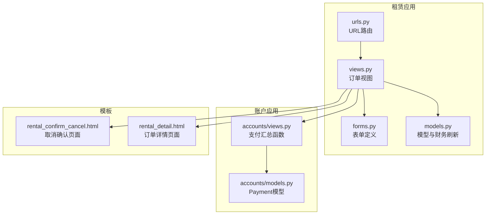
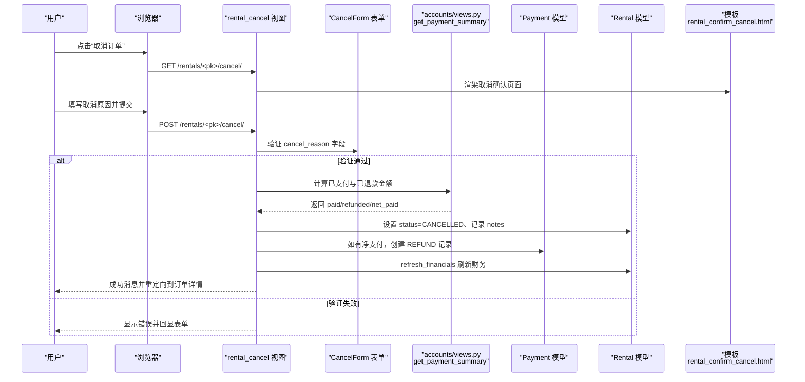
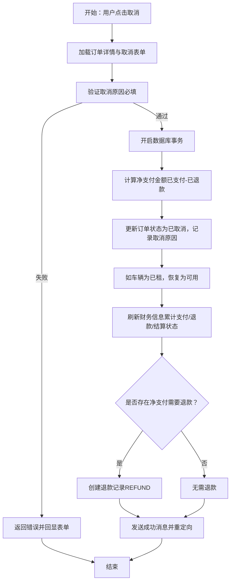
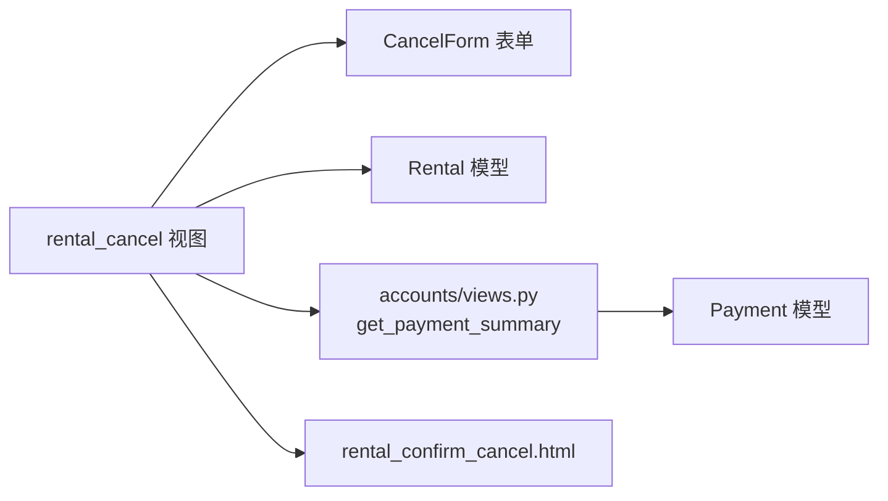

# 订单取消流程

<cite>
**本文引用的文件**
- [views.py](file://code/car_rental_system/rentals/views.py)
- [urls.py](file://code/car_rental_system/rentals/urls.py)
- [forms.py](file://code/car_rental_system/rentals/forms.py)
- [models.py](file://code/car_rental_system/rentals/models.py)
- [accounts/views.py](file://code/car_rental_system/accounts/views.py)
- [accounts/models.py](file://code/car_rental_system/accounts/models.py)
- [rental_confirm_cancel.html](file://code/car_rental_system/templates/rentals/rental_confirm_cancel.html)
- [rental_detail.html](file://code/car_rental_system/templates/rentals/rental_detail.html)
</cite>

## 目录
1. [引言](#引言)
2. [项目结构](#项目结构)
3. [核心组件](#核心组件)
4. [架构总览](#架构总览)
5. [详细组件分析](#详细组件分析)
6. [依赖关系分析](#依赖关系分析)
7. [性能考量](#性能考量)
8. [故障排查指南](#故障排查指南)
9. [结论](#结论)

## 引言
本文件围绕“订单取消”的完整业务流程进行深入解析，覆盖用户发起取消请求、系统验证订单状态、记录取消原因、执行状态变更与财务处理等关键环节。重点阐述 rental_cancel 视图函数如何处理 GET 和 POST 请求，并在 POST 请求中通过数据库事务确保数据一致性；同时说明取消确认页面 rental_confirm_cancel.html 的界面元素与交互逻辑，包括取消原因表单的验证规则与提交处理。最后给出从用户点击取消到系统完成处理的流程图，帮助读者快速理解端到端流程。

## 项目结构
- 租赁应用（rentals）负责订单生命周期管理，包括创建、状态更新、取消、归还等。
- 账户应用（accounts）负责支付记录与财务汇总，取消流程中用于计算已支付与应退金额。
- 模板层提供取消确认页面与订单详情页面，支撑用户交互与信息展示。

图表来源
- [views.py](file://code/car_rental_system/rentals/views.py#L395-L466)
- [urls.py](file://code/car_rental_system/rentals/urls.py#L1-L22)
- [forms.py](file://code/car_rental_system/rentals/forms.py#L353-L364)
- [models.py](file://code/car_rental_system/rentals/models.py#L296-L333)
- [accounts/views.py](file://code/car_rental_system/accounts/views.py#L243-L268)
- [accounts/models.py](file://code/car_rental_system/accounts/models.py#L147-L248)
- [rental_confirm_cancel.html](file://code/car_rental_system/templates/rentals/rental_confirm_cancel.html#L1-L219)
- [rental_detail.html](file://code/car_rental_system/templates/rentals/rental_detail.html#L1-L200)

章节来源
- [views.py](file://code/car_rental_system/rentals/views.py#L395-L466)
- [urls.py](file://code/car_rental_system/rentals/urls.py#L1-L22)

## 核心组件
- rental_cancel 视图：处理取消请求，校验状态，记录取消原因，执行状态变更与财务处理，使用事务保证一致性。
- CancelForm 表单：约束取消原因字段，要求必填。
- Payment 汇总：通过 accounts/views.py 中的 get_payment_summary 计算已支付与已退款金额，得出净支付额。
- Rental 模型：提供 refresh_financials 刷新财务信息，refund_deposit 退还押金等能力。
- 模板 rental_confirm_cancel.html：展示订单信息、取消原因输入、确认按钮与提示信息。

章节来源
- [views.py](file://code/car_rental_system/rentals/views.py#L395-L466)
- [forms.py](file://code/car_rental_system/rentals/forms.py#L353-L364)
- [accounts/views.py](file://code/car_rental_system/accounts/views.py#L243-L268)
- [models.py](file://code/car_rental_system/rentals/models.py#L296-L333)
- [rental_confirm_cancel.html](file://code/car_rental_system/templates/rentals/rental_confirm_cancel.html#L1-L219)

## 架构总览
下面的序列图展示了从用户点击取消到系统完成处理的关键调用链，包括 GET 展示、POST 提交、表单验证、事务处理与财务刷新。

图表来源
- [views.py](file://code/car_rental_system/rentals/views.py#L395-L466)
- [forms.py](file://code/car_rental_system/rentals/forms.py#L353-L364)
- [accounts/views.py](file://code/car_rental_system/accounts/views.py#L243-L268)
- [accounts/models.py](file://code/car_rental_system/accounts/models.py#L147-L248)
- [models.py](file://code/car_rental_system/rentals/models.py#L296-L333)
- [rental_confirm_cancel.html](file://code/car_rental_system/templates/rentals/rental_confirm_cancel.html#L1-L219)

## 详细组件分析

### rental_cancel 视图函数（GET/POST 处理与事务）
- GET 请求：加载订单详情与取消表单，渲染取消确认页面。
- POST 请求：接收取消原因，进行表单验证；在事务中执行以下操作：
  - 计算净支付金额（已支付 - 已退款），若大于零则创建退款记录；
  - 将订单状态置为已取消，并在备注中追加取消原因；
  - 若车辆处于已租状态，将其恢复为可用；
  - 刷新财务信息，更新结算状态与累计支付/退款字段；
  - 成功后重定向到订单详情页并显示消息。

事务与一致性保障
- 使用 Django 的事务上下文包裹关键写操作，确保：
  - 订单状态与备注更新、退款记录创建、车辆状态恢复、财务信息刷新等操作要么全部成功，要么全部回滚，避免数据不一致。

章节来源
- [views.py](file://code/car_rental_system/rentals/views.py#L395-L466)

### 取消确认页面（rental_confirm_cancel.html）界面与交互
- 页面结构要点：
  - 重要提示区域：强调取消不可逆；
  - 订单基本信息卡片：展示订单号、当前状态、金额、创建时间；
  - 客户信息卡片：展示客户姓名、电话、会员等级；
  - 车辆信息卡片：展示品牌型号、车牌号、车辆状态；
  - 租赁时间信息卡片：展示开始/结束日期、租赁天数；
  - 取消原因输入卡片：包含取消原因文本域、错误提示、温馨提示与确认按钮。
- 交互逻辑：
  - 表单字段 cancel_reason 必填；
  - 提交前弹窗确认，提示取消不可逆；
  - CSRF 令牌保护；
  - 错误信息在表单下方显示，便于用户修正。

章节来源
- [rental_confirm_cancel.html](file://code/car_rental_system/templates/rentals/rental_confirm_cancel.html#L1-L219)

### 取消原因表单（CancelForm）验证规则
- 字段 cancel_reason：
  - 必填；
  - 文本域，支持多行输入；
  - 后端通过 Django 表单清洗逻辑进行验证，前端也通过模板中的错误渲染实现即时反馈。

章节来源
- [forms.py](file://code/car_rental_system/rentals/forms.py#L353-L364)

### 财务处理与退款机制
- 净支付计算：
  - 通过 accounts/views.py 中的 get_payment_summary 聚合支付与退款，得到 paid_amount、refunded_amount、net_paid；
  - 若 net_paid > 0，则创建一条 REFUND 类型的 Payment 记录，状态为已退款。
- 财务信息刷新：
  - 调用 Rental.refresh_financials，重新统计 amount_paid、amount_refunded、settlement_status，并持久化保存；
  - 若订单已完成且应付已结清，结算状态置为已结算。
- 押金处理：
  - 当订单完成或取消时，系统会尝试退还押金（若存在且未退还）。此处取消流程主要关注 net_paid 的退款，押金逻辑由归还流程中的 refund_deposit 方法体现。

章节来源
- [accounts/views.py](file://code/car_rental_system/accounts/views.py#L243-L268)
- [models.py](file://code/car_rental_system/rentals/models.py#L296-L333)
- [accounts/models.py](file://code/car_rental_system/accounts/models.py#L147-L248)

### 订单状态检查与防非法操作
- 系统不会阻止用户访问取消页面，但取消流程本身仅对有效状态进行处理：
  - 取消流程会将订单状态置为已取消；
  - 若车辆处于已租状态，系统会将其恢复为可用；
  - 财务信息会根据支付与退款情况进行刷新。
- 业务层面的状态转换建议：
  - 可在订单详情页根据当前状态显示“取消”按钮，避免对已完成或已取消订单再次取消；
  - 若需要更严格的控制，可在视图中增加状态白名单判断，仅允许从“预订中/进行中”取消。

章节来源
- [views.py](file://code/car_rental_system/rentals/views.py#L395-L466)
- [rental_detail.html](file://code/car_rental_system/templates/rentals/rental_detail.html#L1-L200)

### 从用户点击取消到系统完成处理的流程图

图表来源
- [views.py](file://code/car_rental_system/rentals/views.py#L395-L466)
- [accounts/views.py](file://code/car_rental_system/accounts/views.py#L243-L268)
- [models.py](file://code/car_rental_system/rentals/models.py#L296-L333)
- [rental_confirm_cancel.html](file://code/car_rental_system/templates/rentals/rental_confirm_cancel.html#L1-L219)

## 依赖关系分析
- 视图依赖
  - rental_cancel 依赖 CancelForm、Rental、Payment、get_payment_summary；
  - URL 路由映射到 rentals 应用的 rental_cancel 视图；
  - 模板 rental_confirm_cancel.html 作为取消确认页面。
- 模型依赖
  - Rental.refresh_financials 依赖 Payment 模型；
  - Payment 模型提供支付与退款记录的数据结构。
- 财务汇总
  - get_payment_summary 聚合 CHARGE/REFUND 记录，输出 paid/refunded/net_paid 等指标。

图表来源
- [views.py](file://code/car_rental_system/rentals/views.py#L395-L466)
- [forms.py](file://code/car_rental_system/rentals/forms.py#L353-L364)
- [models.py](file://code/car_rental_system/rentals/models.py#L296-L333)
- [accounts/views.py](file://code/car_rental_system/accounts/views.py#L243-L268)
- [accounts/models.py](file://code/car_rental_system/accounts/models.py#L147-L248)
- [rental_confirm_cancel.html](file://code/car_rental_system/templates/rentals/rental_confirm_cancel.html#L1-L219)

章节来源
- [views.py](file://code/car_rental_system/rentals/views.py#L395-L466)
- [urls.py](file://code/car_rental_system/rentals/urls.py#L1-L22)
- [accounts/views.py](file://code/car_rental_system/accounts/views.py#L243-L268)
- [accounts/models.py](file://code/car_rental_system/accounts/models.py#L147-L248)
- [models.py](file://code/car_rental_system/rentals/models.py#L296-L333)

## 性能考量
- 事务边界：取消流程在事务中执行，减少并发写入风险，但注意事务范围内的数据库操作应尽量精简，避免长时间持有锁。
- 财务刷新：refresh_financials 会重新聚合支付与退款，建议在高并发场景下配合缓存或批量处理策略，避免频繁统计带来的开销。
- 模板渲染：取消确认页面包含较多订单信息卡片，建议在订单详情页提前加载必要数据，减少重复查询。

## 故障排查指南
- 取消失败或数据不一致
  - 检查事务是否正确包裹关键写操作；
  - 查看是否有异常导致事务回滚；
  - 确认 Payment 记录是否创建成功。
- 退款金额不正确
  - 核对 get_payment_summary 的 paid/refunded/net_paid 计算逻辑；
  - 检查是否存在重复退款或退款金额为零的情况。
- 车辆状态未恢复
  - 确认订单状态是否为已取消；
  - 检查车辆是否处于已租状态；
  - 查看刷新财务信息是否成功执行。
- 表单验证失败
  - 确认取消原因字段是否为空；
  - 检查模板中的错误渲染是否正确显示。

章节来源
- [views.py](file://code/car_rental_system/rentals/views.py#L395-L466)
- [accounts/views.py](file://code/car_rental_system/accounts/views.py#L243-L268)
- [models.py](file://code/car_rental_system/rentals/models.py#L296-L333)
- [rental_confirm_cancel.html](file://code/car_rental_system/templates/rentals/rental_confirm_cancel.html#L1-L219)

## 结论
订单取消流程在系统中通过清晰的视图、严谨的表单与事务、完善的财务汇总与模型方法共同实现。用户在取消确认页面完成取消原因输入后，系统在事务中完成状态变更、财务刷新与退款处理，并通过消息提示与重定向完成用户体验闭环。建议在业务层面进一步完善状态检查与按钮可见性控制，提升系统的易用性与安全性。