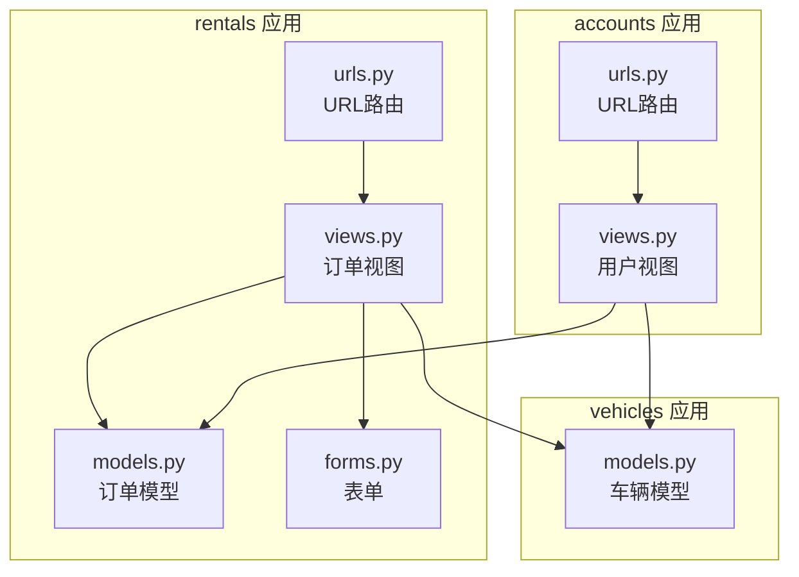
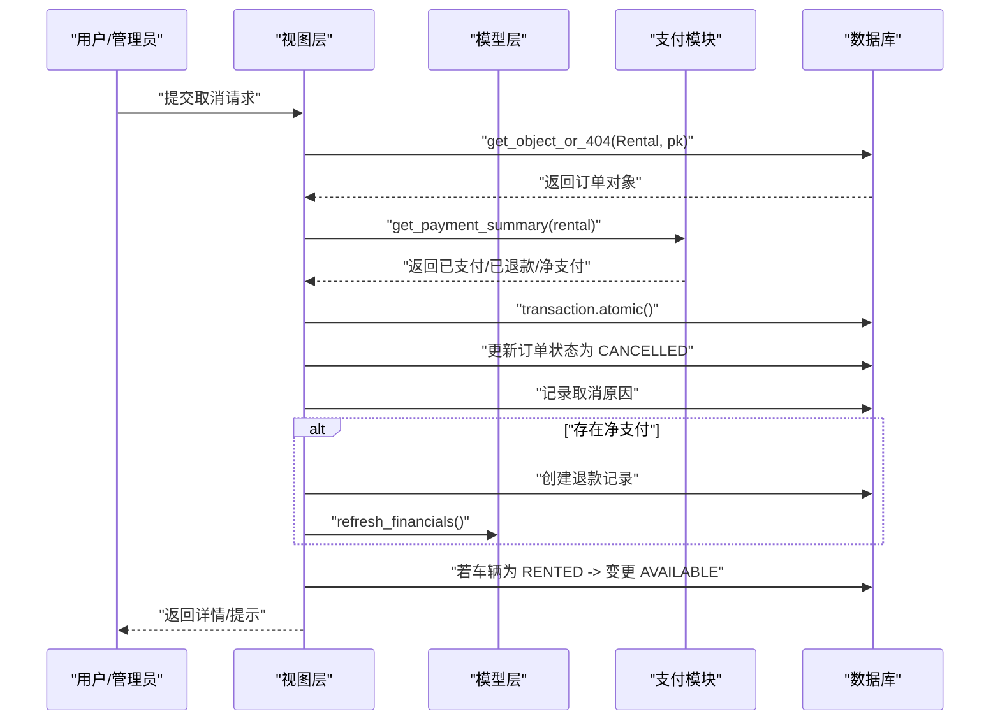
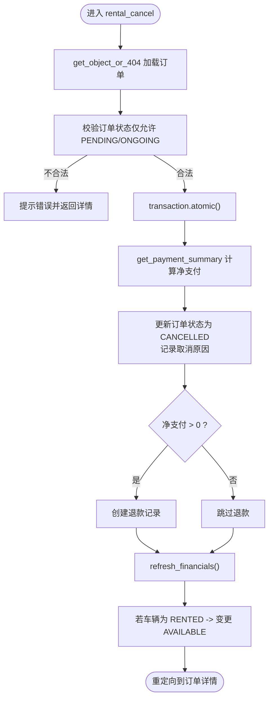
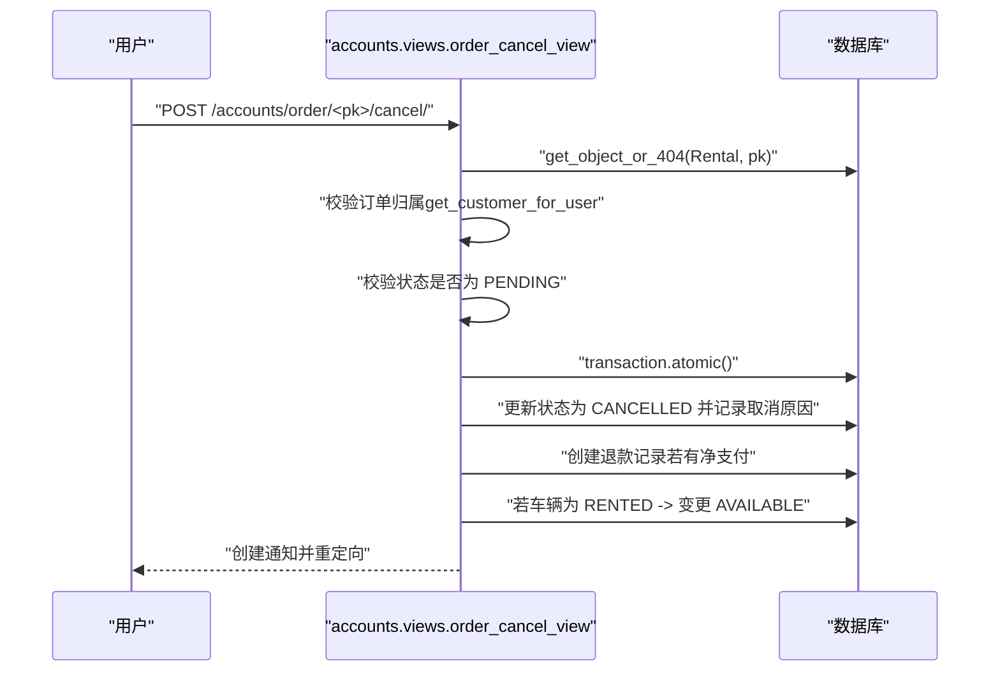
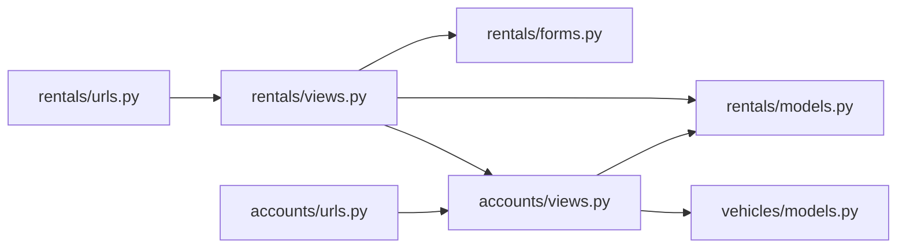

# 订单取消验证机制

<cite>
**本文引用的文件**
- [rentals/models.py](file://code/car_rental_system/rentals/models.py)
- [rentals/views.py](file://code/car_rental_system/rentals/views.py)
- [accounts/views.py](file://code/car_rental_system/accounts/views.py)
- [vehicles/models.py](file://code/car_rental_system/vehicles/models.py)
- [rentals/forms.py](file://code/car_rental_system/rentals/forms.py)
- [rentals/urls.py](file://code/car_rental_system/rentals/urls.py)
- [accounts/urls.py](file://code/car_rental_system/accounts/urls.py)
- [templates/rentals/rental_confirm_cancel.html](file://code/car_rental_system/templates/rentals/rental_confirm_cancel.html)
</cite>

## 目录
1. [简介](#简介)
2. [项目结构](#项目结构)
3. [核心组件](#核心组件)
4. [架构总览](#架构总览)
5. [详细组件分析](#详细组件分析)
6. [依赖关系分析](#依赖关系分析)
7. [性能考量](#性能考量)
8. [故障排查指南](#故障排查指南)
9. [结论](#结论)

## 简介
本文件聚焦“订单取消前的系统验证机制”，围绕以下目标展开：
- 如何通过 Rental 模型的状态字段检查订单是否允许取消，防止非法状态变更
- 在 rental_cancel 视图中如何使用 get_object_or_404 确保订单存在，并结合业务规则判断当前状态（如仅允许取消“预订中”或“进行中”的订单）
- 在事务处理中如何捕获并发修改风险，并提供异常处理策略
- 如何通过 Django ORM 查询确保数据一致性，以及在取消过程中如何验证车辆状态与订单状态的匹配性

## 项目结构
系统采用多应用分层组织，订单取消涉及 rentals 应用与 accounts 应用：
- rentals 应用负责订单生命周期管理（创建、状态更新、取消、归还）
- accounts 应用负责用户侧订单管理（用户视角的取消、支付、通知）
- vehicles 应用提供车辆状态与基础信息

图表来源
- [rentals/views.py](file://code/car_rental_system/rentals/views.py#L395-L466)
- [rentals/models.py](file://code/car_rental_system/rentals/models.py#L12-L169)
- [rentals/forms.py](file://code/car_rental_system/rentals/forms.py#L277-L310)
- [rentals/urls.py](file://code/car_rental_system/rentals/urls.py#L9-L18)
- [accounts/views.py](file://code/car_rental_system/accounts/views.py#L1026-L1091)
- [accounts/urls.py](file://code/car_rental_system/accounts/urls.py#L28-L34)
- [vehicles/models.py](file://code/car_rental_system/vehicles/models.py#L6-L85)

章节来源
- [rentals/views.py](file://code/car_rental_system/rentals/views.py#L395-L466)
- [accounts/views.py](file://code/car_rental_system/accounts/views.py#L1026-L1091)
- [rentals/models.py](file://code/car_rental_system/rentals/models.py#L12-L169)
- [vehicles/models.py](file://code/car_rental_system/vehicles/models.py#L6-L85)
- [rentals/urls.py](file://code/car_rental_system/rentals/urls.py#L9-L18)
- [accounts/urls.py](file://code/car_rental_system/accounts/urls.py#L28-L34)

## 核心组件
- 订单模型（Rental）：定义订单状态枚举、结算状态、关键字段与自动状态更新逻辑
- 订单视图（rental_cancel）：实现取消流程，包含事务、支付汇总、退款与车辆状态同步
- 用户视图（order_cancel_view）：实现用户侧取消流程，包含用户权限校验与状态限制
- 表单（CancelForm）：提供取消原因输入
- URL 路由：暴露取消入口

章节来源
- [rentals/models.py](file://code/car_rental_system/rentals/models.py#L12-L169)
- [rentals/views.py](file://code/car_rental_system/rentals/views.py#L395-L466)
- [accounts/views.py](file://code/car_rental_system/accounts/views.py#L1026-L1091)
- [rentals/forms.py](file://code/car_rental_system/rentals/forms.py#L353-L364)
- [rentals/urls.py](file://code/car_rental_system/rentals/urls.py#L9-L18)
- [accounts/urls.py](file://code/car_rental_system/accounts/urls.py#L28-L34)

## 架构总览
订单取消涉及两条路径：
- 管理端取消：rentals.views.rental_cancel
- 用户端取消：accounts.views.order_cancel_view

两者均通过 get_object_or_404 确保订单存在，使用事务包裹关键写操作，调用支付汇总函数计算净支付金额并生成退款记录，最后同步车辆状态。

图表来源
- [rentals/views.py](file://code/car_rental_system/rentals/views.py#L395-L466)
- [accounts/views.py](file://code/car_rental_system/accounts/views.py#L1026-L1091)

## 详细组件分析

### 1) 订单状态与合法性约束
- 状态枚举：订单状态包括“预订中”“进行中”“已超时未归还”“已完成”“已取消”
- 状态转换规则：Rental.clean 与 RentalStatusForm.clean 中体现状态转换合法性
- 自动状态更新：Rental.auto_update_status 将“预订中”激活为“进行中”，将“进行中”过期更新为“已超时未归还”

章节来源
- [rentals/models.py](file://code/car_rental_system/rentals/models.py#L12-L169)
- [rentals/forms.py](file://code/car_rental_system/rentals/forms.py#L277-L310)
- [rentals/models.py](file://code/car_rental_system/rentals/models.py#L171-L229)

### 2) 管理端取消流程（rentals.views.rental_cancel）
- 存在性校验：使用 get_object_or_404 确保订单存在
- 业务规则：仅当订单处于“预订中”或“进行中”时才允许取消（此处为管理端通用取消逻辑）
- 事务处理：使用 transaction.atomic 包裹取消过程，保证原子性
- 支付处理：调用 accounts.views.get_payment_summary 计算净支付金额，若大于零则创建退款记录
- 财务刷新：调用 rental.refresh_financials 刷新累计支付/退款与结算状态
- 车辆状态：若车辆状态为“已租”，取消后恢复为“可用”

图表来源
- [rentals/views.py](file://code/car_rental_system/rentals/views.py#L395-L466)

章节来源
- [rentals/views.py](file://code/car_rental_system/rentals/views.py#L395-L466)

### 3) 用户端取消流程（accounts.views.order_cancel_view）
- 权限校验：仅订单所属客户可取消
- 状态限制：仅“预订中”订单允许取消
- 事务处理：同样使用 transaction.atomic
- 支付处理：调用 accounts.views.get_payment_summary，创建退款记录并刷新财务
- 通知：创建“订单已取消”通知

图表来源
- [accounts/views.py](file://code/car_rental_system/accounts/views.py#L1026-L1091)

章节来源
- [accounts/views.py](file://code/car_rental_system/accounts/views.py#L1026-L1091)

### 4) 并发修改风险与异常处理
- 并发控制：取消流程统一使用 transaction.atomic，确保关键写操作在单事务中执行，避免部分更新导致的数据不一致
- 异常处理：Rental.auto_update_status 在事务中捕获异常并记录日志，不影响主流程；取消流程未显式捕获异常，遵循 Django 默认行为
- 数据一致性：通过 get_object_or_404 确保后续操作基于真实存在的对象；通过 select_related 提升查询效率，减少 N+1 问题

章节来源
- [rentals/views.py](file://code/car_rental_system/rentals/views.py#L395-L466)
- [rentals/models.py](file://code/car_rental_system/rentals/models.py#L171-L229)

### 5) 车辆状态与订单状态匹配性验证
- 取消后车辆状态同步：若订单取消时车辆状态为“已租”，则将其恢复为“可用”
- 归还场景对比：还车逻辑中也体现了车辆状态与订单状态的联动（仅“进行中/已超时未归还”可还车，完成后若无其他进行中订单则恢复“可用”）

章节来源
- [rentals/views.py](file://code/car_rental_system/rentals/views.py#L395-L466)
- [rentals/views.py](file://code/car_rental_system/rentals/views.py#L279-L392)
- [vehicles/models.py](file://code/car_rental_system/vehicles/models.py#L6-L85)

### 6) 前端交互与模板
- 管理端取消页面：展示订单基本信息、客户与车辆信息、取消原因输入与提示
- 用户端取消页面：由 accounts 应用提供，此处不展开前端细节

章节来源
- [templates/rentals/rental_confirm_cancel.html](file://code/car_rental_system/templates/rentals/rental_confirm_cancel.html#L1-L219)

## 依赖关系分析
- 视图依赖模型与表单：取消视图依赖 Rental 模型的状态与财务刷新能力
- 支付依赖：取消流程依赖 accounts.views.get_payment_summary 与 Payment 模型
- URL 映射：管理端取消路径为 rentals:rental_cancel，用户端取消路径为 accounts:order_cancel

图表来源
- [rentals/views.py](file://code/car_rental_system/rentals/views.py#L395-L466)
- [accounts/views.py](file://code/car_rental_system/accounts/views.py#L1026-L1091)
- [rentals/urls.py](file://code/car_rental_system/rentals/urls.py#L9-L18)
- [accounts/urls.py](file://code/car_rental_system/accounts/urls.py#L28-L34)

章节来源
- [rentals/views.py](file://code/car_rental_system/rentals/views.py#L395-L466)
- [accounts/views.py](file://code/car_rental_system/accounts/views.py#L1026-L1091)
- [rentals/urls.py](file://code/car_rental_system/rentals/urls.py#L9-L18)
- [accounts/urls.py](file://code/car_rental_system/accounts/urls.py#L28-L34)

## 性能考量
- 查询优化：Rental.auto_update_status 使用 select_related 与批量过滤，减少查询次数
- 缓存：状态自动更新使用缓存避免频繁更新
- 原子性：取消流程使用事务，避免中间态数据
- 建议：在高并发场景下，可在取消前对订单加锁（如 select_for_update），进一步降低并发冲突概率

章节来源
- [rentals/models.py](file://code/car_rental_system/rentals/models.py#L171-L229)
- [rentals/views.py](file://code/car_rental_system/rentals/views.py#L395-L466)

## 故障排查指南
- 订单不存在：确认 URL 参数 pk 是否正确，get_object_or_404 会抛出 404
- 状态不允许取消：管理端取消要求订单为“预订中/进行中”，用户端取消仅允许“预订中”
- 退款失败：检查支付汇总结果与用户信息来源，确保存在有效用户与净支付
- 车辆状态未恢复：确认取消前车辆状态是否为“已租”，并在事务中执行状态变更
- 并发冲突：在高并发下可考虑在取消前对订单记录加锁，避免竞态条件

章节来源
- [rentals/views.py](file://code/car_rental_system/rentals/views.py#L395-L466)
- [accounts/views.py](file://code/car_rental_system/accounts/views.py#L1026-L1091)

## 结论
系统通过 Rental 模型的状态枚举与表单校验、视图层的存在性校验与事务封装、支付模块的汇总与退款记录，构建了完整的订单取消验证与执行链路。管理端与用户端分别在不同约束下提供取消能力，确保数据一致性与业务合规性。建议在高并发场景下引入记录级锁定与更严格的异常处理，进一步提升可靠性。