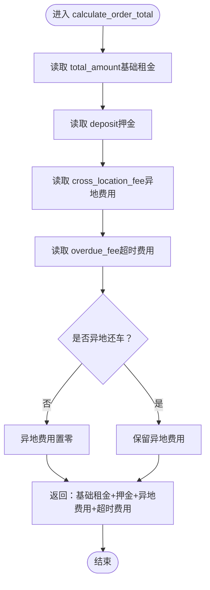

# 支付金额计算

<cite>
**本文引用的文件**
- [rentals/models.py](file://code/car_rental_system/rentals/models.py)
- [rentals/views.py](file://code/car_rental_system/rentals/views.py)
- [accounts/views.py](file://code/car_rental_system/accounts/views.py)
- [accounts/models.py](file://code/car_rental_system/accounts/models.py)
- [customers/models.py](file://code/car_rental_system/customers/models.py)
- [rentals/forms.py](file://code/car_rental_system/rentals/forms.py)
- [rentals/management/commands/update_historical_orders.py](file://code/car_rental_system/rentals/management/commands/update_historical_orders.py)
</cite>

## 目录
1. [简介](#简介)
2. [项目结构](#项目结构)
3. [核心组件](#核心组件)
4. [架构总览](#架构总览)
5. [详细组件分析](#详细组件分析)
6. [依赖关系分析](#依赖关系分析)
7. [性能考量](#性能考量)
8. [故障排查指南](#故障排查指南)
9. [结论](#结论)
10. [附录](#附录)

## 简介
本文件聚焦“订单取消时的支付金额计算逻辑”，围绕以下目标展开：
- 解析 Rental 模型中的 calculate_order_total 方法如何计算订单总额（基础租金+押金+异地费用+超时费用）。
- 详解 rental_cancel 视图中调用 get_payment_summary 函数获取支付摘要的过程，明确已支付金额、待支付金额、净支付金额（net_paid）的计算公式。
- 说明系统如何处理 VIP 用户的特殊折扣与免押金政策对最终支付金额的影响。
- 提供不同场景下的金额计算示例与业务规则验证机制说明。

## 项目结构
本项目的支付与订单相关逻辑主要分布在以下模块：
- 租赁模块（rentals）：订单模型、视图、表单、命令脚本。
- 账户模块（accounts）：支付记录模型、支付摘要函数、用户侧订单取消视图。
- 客户模块（customers）：会员等级与升级规则。

图表来源
- [rentals/models.py](file://code/car_rental_system/rentals/models.py#L286-L333)
- [rentals/views.py](file://code/car_rental_system/rentals/views.py#L395-L466)
- [accounts/views.py](file://code/car_rental_system/accounts/views.py#L243-L268)
- [accounts/models.py](file://code/car_rental_system/accounts/models.py#L147-L251)
- [customers/models.py](file://code/car_rental_system/customers/models.py#L101-L154)
- [rentals/forms.py](file://code/car_rental_system/rentals/forms.py#L1-L364)
- [rentals/management/commands/update_historical_orders.py](file://code/car_rental_system/rentals/management/commands/update_historical_orders.py#L213-L270)

章节来源
- [rentals/models.py](file://code/car_rental_system/rentals/models.py#L1-L401)
- [rentals/views.py](file://code/car_rental_system/rentals/views.py#L1-L563)
- [accounts/views.py](file://code/car_rental_system/accounts/views.py#L1-L1497)
- [accounts/models.py](file://code/car_rental_system/accounts/models.py#L1-L318)
- [customers/models.py](file://code/car_rental_system/customers/models.py#L1-L160)
- [rentals/forms.py](file://code/car_rental_system/rentals/forms.py#L1-L364)
- [rentals/management/commands/update_historical_orders.py](file://code/car_rental_system/rentals/management/commands/update_historical_orders.py#L65-L270)

## 核心组件
- Rental 模型
  - 计算订单总额：calculate_order_total（基础租金+押金+异地费用+超时费用）
  - 刷新财务：refresh_financials（累计支付/退款，结算状态）
  - 退还押金：refund_deposit（针对已完成订单的押金）
- 支付摘要：accounts/views 中的 get_payment_summary
  - 已支付金额（paid_amount）、已退款金额（refunded_amount）、净支付金额（net_paid）、待支付金额（remaining_amount）、订单总额（order_total_amount）
- VIP 用户政策
  - VIP 折扣：订单创建/费用明细计算时对基础租金打九折
  - 免押金：VIP 用户创建订单时不收取押金
- 订单取消流程
  - 租赁端取消：rentals/views 中的 rental_cancel
  - 用户端取消：accounts/views 中的 order_cancel_view
  - 历史批量处理：rentals/management/commands/update_historical_orders.py

章节来源
- [rentals/models.py](file://code/car_rental_system/rentals/models.py#L286-L333)
- [accounts/views.py](file://code/car_rental_system/accounts/views.py#L243-L268)
- [rentals/views.py](file://code/car_rental_system/rentals/views.py#L395-L466)
- [customers/models.py](file://code/car_rental_system/customers/models.py#L101-L154)

## 架构总览
下面的序列图展示了“订单取消时支付金额计算”的关键调用链，从用户触发取消到生成退款记录并刷新财务信息。

图表来源
- [rentals/views.py](file://code/car_rental_system/rentals/views.py#L395-L466)
- [accounts/views.py](file://code/car_rental_system/accounts/views.py#L243-L268)
- [accounts/models.py](file://code/car_rental_system/accounts/models.py#L147-L251)
- [rentals/models.py](file://code/car_rental_system/rentals/models.py#L296-L333)

## 详细组件分析

### 1) 订单总额计算：Rental.calculate_order_total
- 计算公式
  - 订单总额 = 基础租金 + 押金 + 异地还车费用 + 超时还车费用
  - 若未选择异地还车，则异地费用视为 0
- 关键点
  - 基础租金来自 total_amount 字段（由保存逻辑或创建逻辑预先计算）
  - 押金来自 deposit 字段（VIP 用户为 0；普通用户默认为日租金×10）
  - 异地费用来自 cross_location_fee 字段（若未异地还车则为 0）
  - 超时费用来自 overdue_fee 字段（归还时计算）

图表来源
- [rentals/models.py](file://code/car_rental_system/rentals/models.py#L286-L295)

章节来源
- [rentals/models.py](file://code/car_rental_system/rentals/models.py#L286-L295)

### 2) 支付摘要：accounts/views.get_payment_summary
- 输入：Rental 对象（可选传入 Payment 查询集）
- 输出：字典，包含
  - paid_amount：已支付金额（仅统计 CHARGE 且 PAID）
  - refunded_amount：已退款金额（仅统计 REFUND 且 REFUNDED）
  - net_paid：净支付金额 = paid_amount - refunded_amount
  - remaining_amount：待支付金额 = 订单总额 - paid_amount（最小为 0）
  - order_total_amount：订单总额（由 get_order_amount_breakdown 计算）
  - base_amount/deposit_amount/cross_location_fee：费用拆分项
- 计算公式
  - net_paid = paid_amount − refunded_amount
  - remaining_amount = max(0, order_total_amount − paid_amount)
  - order_total_amount = base_amount + deposit_amount + cross_location_fee（若非异地还车则 cross_location_fee=0）

图表来源
- [accounts/views.py](file://code/car_rental_system/accounts/views.py#L243-L268)
- [accounts/views.py](file://code/car_rental_system/accounts/views.py#L225-L241)

章节来源
- [accounts/views.py](file://code/car_rental_system/accounts/views.py#L225-L268)

### 3) VIP 用户的折扣与免押金政策
- VIP 折扣
  - 在订单创建/费用明细计算时，对基础租金按 10% 折扣（即 9 折）
- 免押金
  - 当客户会员等级为 VIP 时，创建订单时 deposit 设为 0
  - 归还/取消时，押金相关逻辑不会产生额外费用
- 升级规则
  - 客户可通过连续 N 个已完成订单保持“诚信”（无超时、无不诚信异地还车）达到升级条件

图表来源
- [rentals/models.py](file://code/car_rental_system/rentals/models.py#L246-L271)
- [rentals/views.py](file://code/car_rental_system/rentals/views.py#L469-L485)
- [customers/models.py](file://code/car_rental_system/customers/models.py#L101-L154)

章节来源
- [rentals/models.py](file://code/car_rental_system/rentals/models.py#L246-L271)
- [rentals/views.py](file://code/car_rental_system/rentals/views.py#L469-L485)
- [customers/models.py](file://code/car_rental_system/customers/models.py#L101-L154)

### 4) 订单取消流程与退款
- 租赁端取消（管理员）
  - 调用 get_payment_summary 获取 paid/refunded/net_paid
  - 若 net_paid > 0，创建 REFUND 支付记录并调用 rental.refresh_financials 刷新财务
- 用户端取消（用户）
  - 同样使用 get_payment_summary 计算 net_paid 并退款
- 历史批量处理
  - 针对已取消订单，自动退还已支付金额（net_paid）

图表来源
- [rentals/views.py](file://code/car_rental_system/rentals/views.py#L395-L466)
- [accounts/views.py](file://code/car_rental_system/accounts/views.py#L243-L268)
- [accounts/models.py](file://code/car_rental_system/accounts/models.py#L147-L251)
- [rentals/models.py](file://code/car_rental_system/rentals/models.py#L296-L333)
- [rentals/management/commands/update_historical_orders.py](file://code/car_rental_system/rentals/management/commands/update_historical_orders.py#L213-L270)

章节来源
- [rentals/views.py](file://code/car_rental_system/rentals/views.py#L395-L466)
- [accounts/views.py](file://code/car_rental_system/accounts/views.py#L243-L268)
- [accounts/models.py](file://code/car_rental_system/accounts/models.py#L147-L251)
- [rentals/models.py](file://code/car_rental_system/rentals/models.py#L296-L333)
- [rentals/management/commands/update_historical_orders.py](file://code/car_rental_system/rentals/management/commands/update_historical_orders.py#L213-L270)

### 5) 场景化示例与业务规则验证
- 场景一：VIP 用户取消（无押金）
  - 基础租金：1000 元
  - VIP 折扣：1000 × 0.9 = 900 元
  - 押金：0 元（VIP 免押金）
  - 异地还车：未选择异地还车，费用为 0
  - 超时费用：0 元
  - 订单总额：900 + 0 + 0 + 0 = 900 元
  - 若已支付 600 元，已退款 0 元，则 net_paid = 600 元，系统将退还 600 元
- 场景二：普通用户取消（有押金）
  - 基础租金：1000 元
  - 折扣：无
  - 押金：1000 × 10 = 10000 元
  - 异地还车：未选择异地还车，费用为 0
  - 超时费用：0 元
  - 订单总额：1000 + 10000 + 0 + 0 = 11000 元
  - 若已支付 10000 元，已退款 0 元，则 net_paid = 10000 元，系统将退还 10000 元
- 场景三：VIP 用户取消（已发生异地还车）
  - 基础租金：1000 元（VIP 9 折=900）
  - 押金：0 元
  - 异地还车费用：500 元
  - 超时费用：0 元
  - 订单总额：900 + 0 + 500 + 0 = 1400 元
  - 若已支付 1200 元，已退款 0 元，则 net_paid = 1200 元，系统将退还 1200 元
- 场景四：VIP 用户取消（已发生超时还车）
  - 基础租金：1000 元（VIP 9 折=900）
  - 押金：0 元
  - 异地还车费用：0 元
  - 超时费用：300 元
  - 订单总额：900 + 0 + 0 + 300 = 1200 元
  - 若已支付 1000 元，已退款 0 元，则 net_paid = 1000 元，系统将退还 1000 元

业务规则验证要点
- VIP 折扣与免押金：在订单创建/费用明细计算时生效，不改变取消退款的 net_paid 计算
- 异地还车费用：仅当实际异地还车或选择了异地还车时计入
- 超时还车费用：仅当实际还车日期晚于结束日期时计入
- 退款用户来源：优先使用支付记录中的用户，其次使用客户关联用户

章节来源
- [rentals/views.py](file://code/car_rental_system/rentals/views.py#L469-L534)
- [rentals/models.py](file://code/car_rental_system/rentals/models.py#L246-L271)
- [rentals/views.py](file://code/car_rental_system/rentals/views.py#L395-L466)
- [accounts/views.py](file://code/car_rental_system/accounts/views.py#L243-L268)

## 依赖关系分析
- 模块耦合
  - rentals/views 依赖 accounts/views 的 get_payment_summary
  - rentals/models 依赖 accounts/models 的 Payment 进行退款与财务刷新
  - customers/models 为 VIP 策略提供依据
- 循环依赖规避
  - 在函数内部延迟导入 accounts.models 与 accounts.views，避免模型层循环导入
- 外部依赖
  - Django ORM 聚合查询（Sum）用于统计支付/退款

图表来源
- [rentals/views.py](file://code/car_rental_system/rentals/views.py#L395-L466)
- [accounts/views.py](file://code/car_rental_system/accounts/views.py#L243-L268)
- [accounts/models.py](file://code/car_rental_system/accounts/models.py#L147-L251)
- [customers/models.py](file://code/car_rental_system/customers/models.py#L101-L154)

章节来源
- [rentals/views.py](file://code/car_rental_system/rentals/views.py#L395-L466)
- [accounts/views.py](file://code/car_rental_system/accounts/views.py#L243-L268)
- [accounts/models.py](file://code/car_rental_system/accounts/models.py#L147-L251)
- [customers/models.py](file://code/car_rental_system/customers/models.py#L101-L154)

## 性能考量
- 聚合查询优化
  - get_payment_summary 使用聚合查询一次性统计 paid/refunded，避免多次数据库往返
- 延迟导入
  - 在 rentals/views 中延迟导入 accounts.models 与 accounts.views，减少启动时的模块加载开销
- 批量处理
  - 历史订单批量退款命令通过 select_related 与聚合统计减少查询次数

章节来源
- [accounts/views.py](file://code/car_rental_system/accounts/views.py#L243-L268)
- [rentals/views.py](file://code/car_rental_system/rentals/views.py#L395-L466)
- [rentals/management/commands/update_historical_orders.py](file://code/car_rental_system/rentals/management/commands/update_historical_orders.py#L213-L270)

## 故障排查指南
- 取消后未退款
  - 检查 net_paid 是否大于 0；若为 0，系统不会创建退款记录
  - 检查是否存在支付用户来源（支付记录或客户关联用户）
- 退款金额不正确
  - 确认 get_payment_summary 的 paid/refunded 是否准确
  - 确认 calculate_order_total 的组成项（基础租金、押金、异地费用、超时费用）是否符合预期
- VIP 折扣/免押金未生效
  - 检查订单创建/费用明细计算逻辑中是否正确识别 VIP
  - 检查 VIP 升级条件是否满足（连续 N 个诚信订单）

章节来源
- [accounts/views.py](file://code/car_rental_system/accounts/views.py#L243-L268)
- [rentals/models.py](file://code/car_rental_system/rentals/models.py#L286-L333)
- [customers/models.py](file://code/car_rental_system/customers/models.py#L101-L154)

## 结论
- 订单取消时的支付金额计算以 get_payment_summary 为核心，通过 paid_amount、refunded_amount 计算 net_paid，再决定是否退款与退款金额。
- Rental.calculate_order_total 提供统一的订单总额计算口径，涵盖基础租金、押金、异地费用与超时费用。
- VIP 用户享有折扣与免押金政策，这些策略在订单创建/费用明细阶段生效，不影响取消退款的 net_paid 计算。
- 系统通过表单与模型层的验证规则保障业务一致性，并通过聚合查询与延迟导入提升性能与稳定性。

## 附录
- 相关实现路径
  - [Rental.calculate_order_total](file://code/car_rental_system/rentals/models.py#L286-L295)
  - [get_payment_summary](file://code/car_rental_system/accounts/views.py#L243-L268)
  - [rental_cancel 视图](file://code/car_rental_system/rentals/views.py#L395-L466)
  - [VIP 折扣与免押金逻辑](file://code/car_rental_system/rentals/models.py#L246-L271)
  - [VIP 升级规则](file://code/car_rental_system/customers/models.py#L101-L154)
  - [历史批量退款命令](file://code/car_rental_system/rentals/management/commands/update_historical_orders.py#L213-L270)