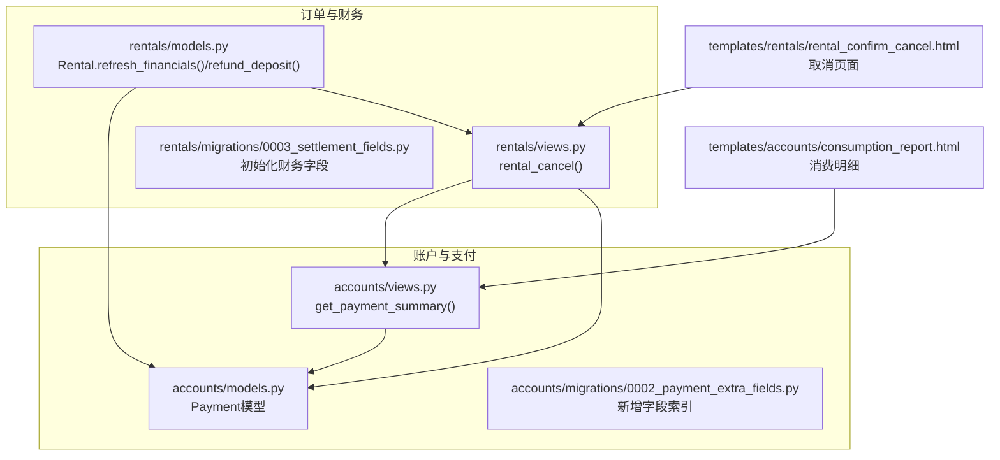
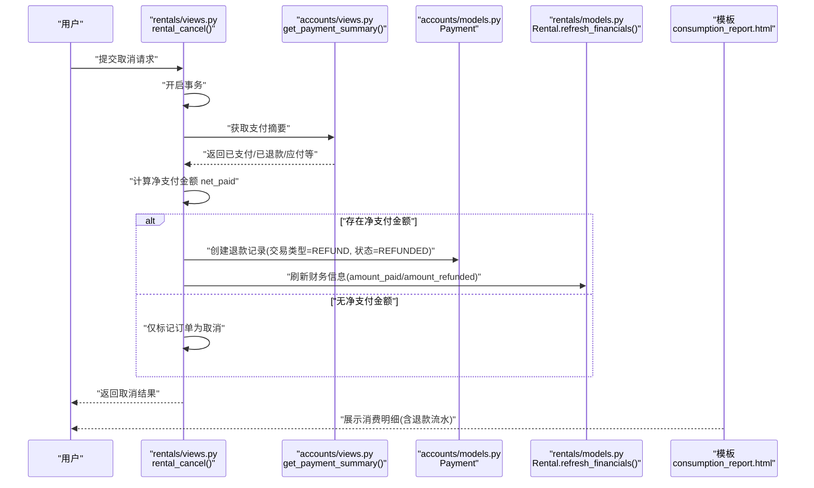
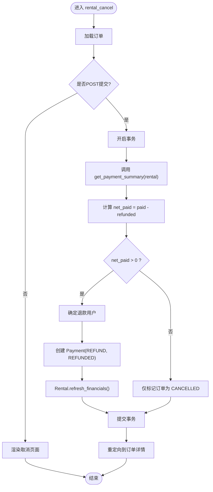
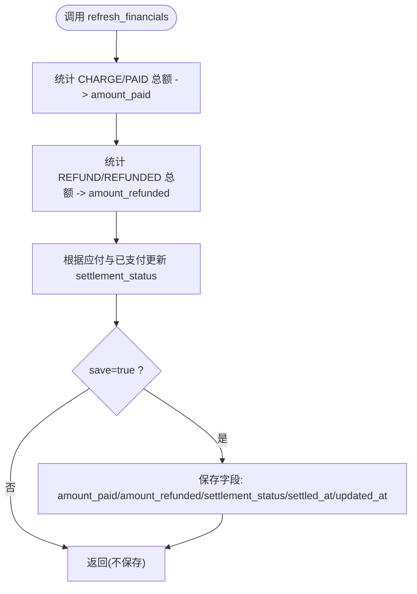
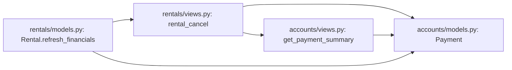

# 财务处理

<cite>
**本文引用的文件**
- [accounts/models.py](file://code/car_rental_system/accounts/models.py)
- [accounts/views.py](file://code/car_rental_system/accounts/views.py)
- [rentals/models.py](file://code/car_rental_system/rentals/models.py)
- [rentals/views.py](file://code/car_rental_system/rentals/views.py)
- [accounts/migrations/0002_payment_extra_fields.py](file://code/car_rental_system/accounts/migrations/0002_payment_extra_fields.py)
- [rentals/migrations/0003_settlement_fields.py](file://code/car_rental_system/rentals/migrations/0003_settlement_fields.py)
- [templates/rentals/rental_confirm_cancel.html](file://code/car_rental_system/templates/rentals/rental_confirm_cancel.html)
- [templates/accounts/consumption_report.html](file://code/car_rental_system/templates/accounts/consumption_report.html)
</cite>

## 目录
1. [引言](#引言)
2. [项目结构](#项目结构)
3. [核心组件](#核心组件)
4. [架构总览](#架构总览)
5. [详细组件分析](#详细组件分析)
6. [依赖关系分析](#依赖关系分析)
7. [性能考量](#性能考量)
8. [故障排查指南](#故障排查指南)
9. [结论](#结论)

## 引言
本章节聚焦“订单取消时的财务处理机制”，系统性阐述以下关键点：
- 如何通过 rental_cancel 视图调用 get_payment_summary 函数获取支付摘要，并据此计算净支付金额 net_paid；
- 系统如何创建 Payment 退款记录，包括交易类型、状态、描述等字段设置；
- Rental 模型的 refresh_financials 方法如何更新 amount_paid 和 amount_refunded 字段，并确保数据一致性；
- 提供从订单取消到退款完成的资金流时序图，帮助读者快速把握端到端流程。

## 项目结构
围绕财务处理的关键代码分布在 accounts 与 rentals 两个子系统中：
- accounts 子系统负责支付与退款记录的持久化与汇总；
- rentals 子系统负责订单生命周期管理、财务字段维护与退款触发。

图表来源
- [accounts/models.py](file://code/car_rental_system/accounts/models.py#L147-L250)
- [accounts/views.py](file://code/car_rental_system/accounts/views.py#L243-L268)
- [rentals/models.py](file://code/car_rental_system/rentals/models.py#L296-L394)
- [rentals/views.py](file://code/car_rental_system/rentals/views.py#L395-L466)
- [accounts/migrations/0002_payment_extra_fields.py](file://code/car_rental_system/accounts/migrations/0002_payment_extra_fields.py#L1-L42)
- [rentals/migrations/0003_settlement_fields.py](file://code/car/car_rental_system/rentals/migrations/0003_settlement_fields.py#L1-L93)
- [templates/rentals/rental_confirm_cancel.html](file://code/car_rental_system/templates/rentals/rental_confirm_cancel.html#L1-L219)
- [templates/accounts/consumption_report.html](file://code/car_rental_system/templates/accounts/consumption_report.html#L1-L154)

章节来源
- [accounts/models.py](file://code/car_rental_system/accounts/models.py#L147-L250)
- [accounts/views.py](file://code/car_rental_system/accounts/views.py#L243-L268)
- [rentals/models.py](file://code/car_rental_system/rentals/models.py#L296-L394)
- [rentals/views.py](file://code/car_rental_system/rentals/views.py#L395-L466)
- [accounts/migrations/0002_payment_extra_fields.py](file://code/car_rental_system/accounts/migrations/0002_payment_extra_fields.py#L1-L42)
- [rentals/migrations/0003_settlement_fields.py](file://code/car_rental_system/rentals/migrations/0003_settlement_fields.py#L1-L93)
- [templates/rentals/rental_confirm_cancel.html](file://code/car_rental_system/templates/rentals/rental_confirm_cancel.html#L1-L219)
- [templates/accounts/consumption_report.html](file://code/car_rental_system/templates/accounts/consumption_report.html#L1-L154)

## 核心组件
- Payment 模型：记录支付与退款，包含交易类型、状态、金额、描述、第三方交易号、支付时间等字段；通过索引加速按交易类型查询。
- get_payment_summary 函数：按订单聚合支付与退款金额，计算应付总额、已支付、已退款、待支付与净支付。
- Rental.refresh_financials：基于支付记录刷新累计支付与累计退款，并根据应付与实付更新结算状态。
- rental_cancel 视图：在事务中将订单标记为取消，若存在净支付金额则创建退款记录并刷新财务信息。
- 消费明细模板：展示订单的应付、已支付、已退款、待支付、净支付与流水明细，直观呈现退款结果。

章节来源
- [accounts/models.py](file://code/car_rental_system/accounts/models.py#L147-L250)
- [accounts/views.py](file://code/car_rental_system/accounts/views.py#L243-L268)
- [rentals/models.py](file://code/car_rental_system/rentals/models.py#L296-L394)
- [rentals/views.py](file://code/car_rental_system/rentals/views.py#L395-L466)
- [templates/accounts/consumption_report.html](file://code/car_rental_system/templates/accounts/consumption_report.html#L1-L154)

## 架构总览
下图展示了“订单取消—退款创建—财务更新”的整体流程，以及各模块之间的交互关系。

图表来源
- [rentals/views.py](file://code/car_rental_system/rentals/views.py#L395-L466)
- [accounts/views.py](file://code/car_rental_system/accounts/views.py#L243-L268)
- [accounts/models.py](file://code/car_rental_system/accounts/models.py#L147-L250)
- [rentals/models.py](file://code/car_rental_system/rentals/models.py#L296-L394)
- [templates/accounts/consumption_report.html](file://code/car_rental_system/templates/accounts/consumption_report.html#L1-L154)

## 详细组件分析

### 1) rental_cancel 视图与 get_payment_summary 的协作
- 视图入口：rental_cancel 在 POST 请求中接收取消原因，开启事务，随后调用 get_payment_summary 获取支付摘要。
- 净支付计算：函数返回 paid_amount、refunded_amount、order_total_amount 等字段，其中 net_paid = paid_amount - refunded_amount。
- 退款决策：当 net_paid > 0 时，系统尝试定位退款用户（优先使用支付记录中的用户，否则使用客户关联用户），然后创建一条交易类型为 REFUND、状态为 REFUNDED 的 Payment 记录，并设置描述、支付时间与第三方交易号。
- 财务刷新：创建退款记录后，调用 rental.refresh_financials 同步 amount_paid/amount_refunded/settlement_status。

图表来源
- [rentals/views.py](file://code/car_rental_system/rentals/views.py#L395-L466)
- [accounts/views.py](file://code/car_rental_system/accounts/views.py#L243-L268)
- [accounts/models.py](file://code/car_rental_system/accounts/models.py#L147-L250)
- [rentals/models.py](file://code/car_rental_system/rentals/models.py#L296-L394)

章节来源
- [rentals/views.py](file://code/car_rental_system/rentals/views.py#L395-L466)
- [accounts/views.py](file://code/car_rental_system/accounts/views.py#L243-L268)

### 2) get_payment_summary 的实现要点
- 聚合逻辑：分别统计交易类型为 CHARGE 且状态为 PAID 的已支付总额，以及交易类型为 REFUND 且状态为 REFUNDED 的已退款总额。
- 应付与待付：通过 get_order_amount_breakdown 计算订单应付总额，再由应付-已支付得到待支付金额（最小为0）。
- 净支付：paid_amount - refunded_amount 即为 net_paid，用于取消时的退款金额。

章节来源
- [accounts/views.py](file://code/car_rental_system/accounts/views.py#L243-L268)

### 3) Payment 退款记录的创建规范
- 交易类型：REFUND
- 状态：REFUNDED
- 描述：包含“订单取消，退还已支付金额”字样，便于审计与对账
- 金额：net_paid
- 时间：paid_at 设为当前时间
- 第三方交易号：以 REF 前缀加时间戳生成，保证唯一性
- 关联用户：优先使用支付记录中的用户，否则回退到客户关联用户

章节来源
- [accounts/models.py](file://code/car_rental_system/accounts/models.py#L147-L250)
- [rentals/views.py](file://code/car_rental_system/rentals/views.py#L419-L449)

### 4) Rental.refresh_financials 的财务一致性保障
- 聚合计数：分别统计 CHARGE/PAID 与 REFUND/REFUNDED 的总金额，写入 amount_paid 与 amount_refunded。
- 结算状态：根据应付总额与已支付金额动态更新 settlement_status，并在满足条件时设置 settled_at。
- 保存策略：支持 save 参数决定是否立即持久化，避免重复保存带来的开销。

图表来源
- [rentals/models.py](file://code/car_rental_system/rentals/models.py#L296-L394)

章节来源
- [rentals/models.py](file://code/car_rental_system/rentals/models.py#L296-L394)

### 5) 初始化与迁移：财务字段的落地
- accounts/migrations/0002_payment_extra_fields.py：为 Payment 增加 description、transaction_type 等字段，并添加按交易类型的索引，提升退款/支付查询效率。
- rentals/migrations/0003_settlement_fields.py：为 Rental 增加 amount_paid、amount_refunded、settlement_status 等字段，并通过 RunPython 将历史数据迁移为正确的财务字段值，确保系统上线后的数据一致性。

章节来源
- [accounts/migrations/0002_payment_extra_fields.py](file://code/car_rental_system/accounts/migrations/0002_payment_extra_fields.py#L1-L42)
- [rentals/migrations/0003_settlement_fields.py](file://code/car_rental_system/rentals/migrations/0003_settlement_fields.py#L1-L93)

### 6) 前端展示：消费明细与退款流水
- 消费明细页面展示应付总额、已支付、已退款、待支付、净支付与流水明细，其中退款行以负金额显示，便于用户核对。
- 取消页面提供取消原因输入与影响提示，确保用户知情。

章节来源
- [templates/accounts/consumption_report.html](file://code/car_rental_system/templates/accounts/consumption_report.html#L1-L154)
- [templates/rentals/rental_confirm_cancel.html](file://code/car_rental_system/templates/rentals/rental_confirm_cancel.html#L1-L219)

## 依赖关系分析
- 视图层依赖：
  - rentals/views.py 依赖 accounts/views.py 的 get_payment_summary 与 accounts/models.py 的 Payment。
  - accounts/views.py 依赖 accounts/models.py 的 Payment 与 rentals/models.py 的 Rental。
- 模型层依赖：
  - Rental.refresh_financials 依赖 Payment 的聚合查询，避免循环导入采用延迟导入。
- 迁移层依赖：
  - 通过 RunPython 将历史数据迁移至新字段，确保数据一致性。

图表来源
- [rentals/views.py](file://code/car_rental_system/rentals/views.py#L395-L466)
- [accounts/views.py](file://code/car_rental_system/accounts/views.py#L243-L268)
- [accounts/models.py](file://code/car_rental_system/accounts/models.py#L147-L250)
- [rentals/models.py](file://code/car_rental_system/rentals/models.py#L296-L394)

章节来源
- [rentals/views.py](file://code/car_rental_system/rentals/views.py#L395-L466)
- [accounts/views.py](file://code/car_rental_system/accounts/views.py#L243-L268)
- [accounts/models.py](file://code/car_rental_system/accounts/models.py#L147-L250)
- [rentals/models.py](file://code/car_rental_system/rentals/models.py#L296-L394)

## 性能考量
- 查询优化：
  - Payment 表按 transaction_type 建立索引，显著降低退款/支付聚合查询成本。
  - refresh_financials 使用聚合查询一次性统计，减少多次往返数据库的开销。
- 事务控制：
  - rental_cancel 使用原子事务包裹取消、退款创建与财务刷新，确保一致性与回滚能力。
- 缓存与批量：
  - 模块内广泛使用缓存键与批量查询优化，减少重复计算与数据库压力。

章节来源
- [accounts/migrations/0002_payment_extra_fields.py](file://code/car_rental_system/accounts/migrations/0002_payment_extra_fields.py#L36-L39)
- [rentals/models.py](file://code/car_rental_system/rentals/models.py#L296-L394)
- [rentals/views.py](file://code/car_rental_system/rentals/views.py#L395-L466)

## 故障排查指南
- 退款未到账
  - 检查 Payment 是否正确创建（交易类型为 REFUND、状态为 REFUNDED），并确认 paid_at 与描述字段是否完整。
  - 确认 Rental.refresh_financials 是否被调用，amount_paid/amount_refunded 是否更新。
- 退款用户缺失
  - 若支付记录中无用户信息，系统会回退到客户关联用户；若两者均无，将无法自动退款，需人工处理。
- 结算状态异常
  - 检查应付总额与已支付金额计算是否一致，必要时运行迁移脚本或手动刷新财务数据。
- 历史数据不一致
  - 使用 rentals/migrations/0003_settlement_fields.py 中的 RunPython 逻辑进行修复或重新执行迁移。

章节来源
- [accounts/models.py](file://code/car_rental_system/accounts/models.py#L147-L250)
- [rentals/models.py](file://code/car_rental_system/rentals/models.py#L296-L394)
- [rentals/migrations/0003_settlement_fields.py](file://code/car_rental_system/rentals/migrations/0003_settlement_fields.py#L1-L93)

## 结论
本系统在订单取消场景下实现了严谨的财务处理闭环：
- 通过 get_payment_summary 精准计算 net_paid；
- 通过 rental_cancel 创建标准的 REFUND/REFUNDED Payment 记录；
- 通过 Rental.refresh_financials 保持 amount_paid/amount_refunded 与结算状态的一致性；
- 借助迁移与索引保障历史数据与查询性能。
上述机制配合消费明细与取消页面，既满足业务合规要求，也提升了用户体验与运营透明度。