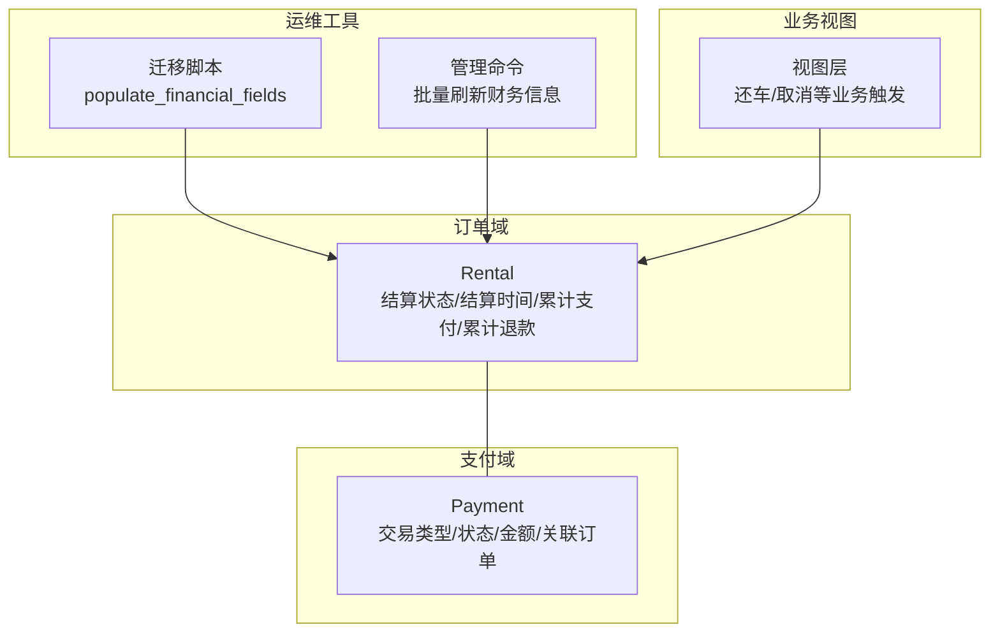
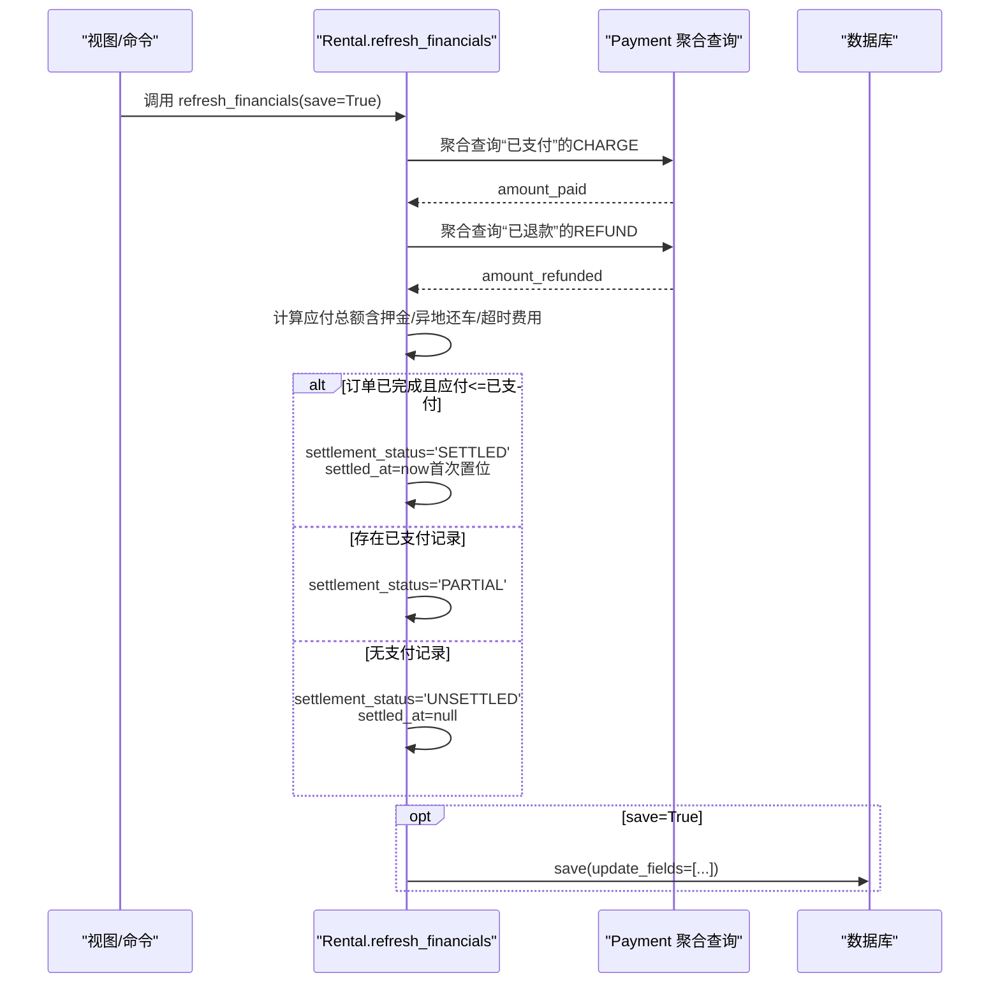
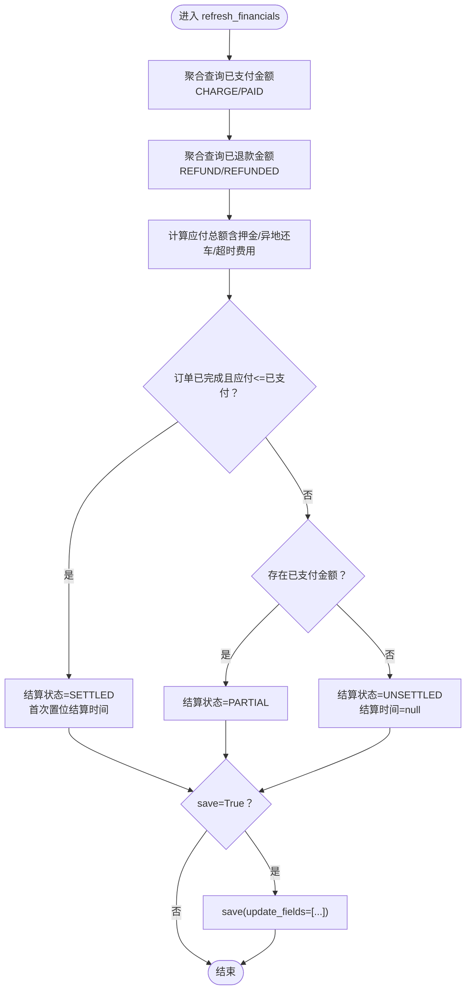
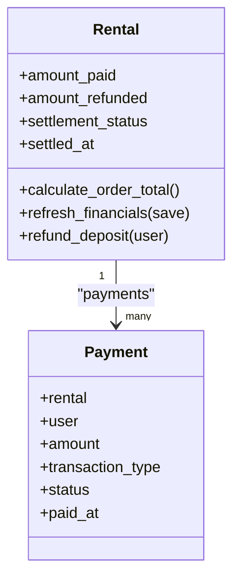

# 财务数据同步

<cite>
**本文引用的文件**
- [rentals/models.py](file://code/car_rental_system/rentals/models.py)
- [accounts/models.py](file://code/car_rental_system/accounts/models.py)
- [rentals/migrations/0003_settlement_fields.py](file://code/car_rental_system/rentals/migrations/0003_settlement_fields.py)
- [rentals/management/commands/update_historical_orders.py](file://code/car_rental_system/rentals/management/commands/update_historical_orders.py)
- [rentals/views.py](file://code/car_rental_system/rentals/views.py)
</cite>

## 目录
1. [简介](#简介)
2. [项目结构](#项目结构)
3. [核心组件](#核心组件)
4. [架构概览](#架构概览)
5. [详细组件分析](#详细组件分析)
6. [依赖关系分析](#依赖关系分析)
7. [性能考量](#性能考量)
8. [故障排查指南](#故障排查指南)
9. [结论](#结论)

## 简介
本文件聚焦于Rental模型的refresh_financials方法，系统性解析其如何通过聚合查询计算累计支付金额amount_paid与累计退款金额amount_refunded，并据此更新结算状态settlement_status与结算时间settled_at。同时说明该方法在save参数为True时如何使用update_fields优化数据库更新，避免不必要的字段更新，从而提升性能与一致性保障。

## 项目结构
围绕财务数据同步的关键模块与文件如下：
- 订单模型：Rental（包含结算状态、结算时间、累计支付、累计退款等字段）
- 支付模型：Payment（记录支付与退款，区分交易类型与状态）
- 历史数据迁移：为既有订单填充结算相关字段
- 管理命令：批量刷新历史订单财务信息
- 视图层：在还车、取消等关键业务节点调用refresh_financials

图表来源
- [rentals/models.py](file://code/car_rental_system/rentals/models.py#L120-L170)
- [accounts/models.py](file://code/car_rental_system/accounts/models.py#L147-L248)
- [rentals/migrations/0003_settlement_fields.py](file://code/car_rental_system/rentals/migrations/0003_settlement_fields.py#L6-L36)
- [rentals/management/commands/update_historical_orders.py](file://code/car_rental_system/rentals/management/commands/update_historical_orders.py#L286-L311)
- [rentals/views.py](file://code/car_rental_system/rentals/views.py#L348-L380)

章节来源
- [rentals/models.py](file://code/car_rental_system/rentals/models.py#L120-L170)
- [accounts/models.py](file://code/car_rental_system/accounts/models.py#L147-L248)
- [rentals/migrations/0003_settlement_fields.py](file://code/car_rental_system/rentals/migrations/0003_settlement_fields.py#L6-L36)
- [rentals/management/commands/update_historical_orders.py](file://code/car_rental_system/rentals/management/commands/update_historical_orders.py#L286-L311)
- [rentals/views.py](file://code/car_rental_system/rentals/views.py#L348-L380)

## 核心组件
- Rental模型
  - 字段：amount_paid、amount_refunded、settlement_status、settled_at、calculate_order_total等
  - 方法：refresh_financials、refund_deposit、calculate_order_total等
- Payment模型
  - 字段：rental、user、amount、transaction_type、status、paid_at等
  - 关系：与Rental多对一关联，作为财务事实表

章节来源
- [rentals/models.py](file://code/car_rental_system/rentals/models.py#L120-L170)
- [accounts/models.py](file://code/car_rental_system/accounts/models.py#L147-L248)

## 架构概览
refresh_financials方法通过聚合查询统计支付与退款两类事实，再依据订单状态与应付总额推导结算状态与结算时间，并在save=True时仅更新必要字段，避免全量写入。

图表来源
- [rentals/models.py](file://code/car_rental_system/rentals/models.py#L296-L333)
- [accounts/models.py](file://code/car_rental_system/accounts/models.py#L147-L248)

## 详细组件分析

### refresh_financials方法：累计支付与退款的聚合计算
- 聚合逻辑
  - 累计支付amount_paid：筛选Payment中属于该Rental且状态为“已支付”、交易类型为“支付”的记录，按金额求和
  - 累计退款amount_refunded：筛选Payment中属于该Rental且状态为“已退款”、交易类型为“退款”的记录，按金额求和
- 结算状态推导
  - 当订单状态为已完成且应付总额小于等于已支付金额时，结算状态设为“已结算”，并首次置位结算时间为当前时间
  - 当存在已支付金额时，结算状态设为“部分结算”
  - 否则结算状态为“未结算”，并将结算时间清空
- 性能优化
  - save=True时，使用save(update_fields=[...])仅更新amount_paid、amount_refunded、settlement_status、settled_at、updated_at，避免全量字段写入

图表来源
- [rentals/models.py](file://code/car_rental_system/rentals/models.py#L296-L333)

章节来源
- [rentals/models.py](file://code/car_rental_system/rentals/models.py#L296-L333)

### 结算状态与结算时间的更新逻辑
- 结算状态
  - SETTLED：订单已完成且应付总额≤已支付金额
  - PARTIAL：存在已支付金额
  - UNSETTLED：无支付记录
- 结算时间
  - 首次满足“已结算”条件时写入当前时间
  - 其他情况下保持空值或清空

章节来源
- [rentals/models.py](file://code/car_rental_system/rentals/models.py#L313-L324)

### 历史数据迁移与批量刷新
- 历史迁移
  - 在新增结算相关字段后，通过RunPython脚本遍历所有Rental，基于Payment数据回填amount_paid、amount_refunded与settlement_status
- 批量刷新命令
  - 提供管理命令，支持逐个订单调用refresh_financials，便于历史数据一致性修复与审计

章节来源
- [rentals/migrations/0003_settlement_fields.py](file://code/car_rental_system/rentals/migrations/0003_settlement_fields.py#L6-L36)
- [rentals/management/commands/update_historical_orders.py](file://code/car_rental_system/rentals/management/commands/update_historical_orders.py#L286-L311)

### 业务触发点：还车与取消
- 还车流程
  - 归还完成后，先更新订单状态与费用，再调用refresh_financials刷新财务
- 取消流程
  - 若存在已支付金额，会创建退款记录并调用refresh_financials刷新财务

章节来源
- [rentals/views.py](file://code/car_rental_system/rentals/views.py#L348-L380)
- [rentals/views.py](file://code/car_rental_system/rentals/views.py#L395-L466)

## 依赖关系分析
- 模型依赖
  - Rental依赖Payment（一对多），通过外键关联
  - Payment包含交易类型与状态枚举，决定聚合口径
- 运维依赖
  - 迁移脚本负责历史数据初始化
  - 管理命令提供批量修复能力
- 视图依赖
  - 视图在关键业务节点调用refresh_financials，保证财务视图与事实一致

图表来源
- [rentals/models.py](file://code/car_rental_system/rentals/models.py#L120-L170)
- [accounts/models.py](file://code/car_rental_system/accounts/models.py#L147-L248)

章节来源
- [rentals/models.py](file://code/car_rental_system/rentals/models.py#L120-L170)
- [accounts/models.py](file://code/car_rental_system/accounts/models.py#L147-L248)

## 性能考量
- 聚合查询
  - 使用聚合sum减少网络往返与Python侧循环开销
- 局部更新
  - save(update_fields=[...])仅写入必要字段，降低锁竞争与日志开销
- 批量处理
  - 管理命令支持逐条刷新，便于控制事务粒度与错误隔离

章节来源
- [rentals/models.py](file://code/car_rental_system/rentals/models.py#L296-L333)
- [rentals/management/commands/update_historical_orders.py](file://code/car_rental_system/rentals/management/commands/update_historical_orders.py#L286-L311)

## 故障排查指南
- 现象：结算状态异常或结算时间未更新
  - 排查要点
    - 确认订单状态是否为已完成
    - 确认应付总额计算是否包含押金/异地还车/超时费用
    - 检查Payment中是否存在“已支付”CHARGE与“已退款”REFUND记录
    - 确认refresh_financials是否在save=True时被调用
- 现象：历史订单财务字段缺失
  - 处理建议
    - 运行迁移脚本确保字段已添加
    - 使用管理命令批量刷新财务信息
- 现象：频繁全量更新导致性能问题
  - 处理建议
    - 优先使用save(update_fields=[...])局部更新
    - 在批量修复时分批处理，避免长事务

章节来源
- [rentals/migrations/0003_settlement_fields.py](file://code/car_rental_system/rentals/migrations/0003_settlement_fields.py#L6-L36)
- [rentals/management/commands/update_historical_orders.py](file://code/car_rental_system/rentals/management/commands/update_historical_orders.py#L286-L311)
- [rentals/models.py](file://code/car_rental_system/rentals/models.py#L296-L333)

## 结论
refresh_financials通过聚合查询精确计算累计支付与退款，并结合订单状态与应付总额推导结算状态与结算时间，最终在save=True时采用update_fields实现高效、可控的局部更新。配合历史迁移与管理命令，系统能够有效维护财务数据一致性，满足业务对结算状态与时间的准确要求。