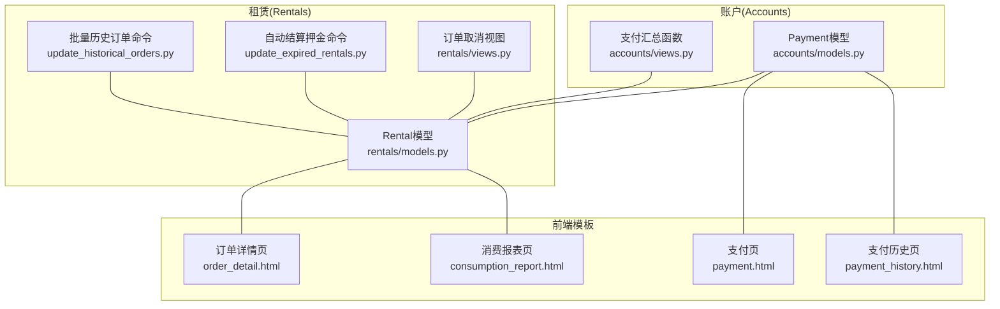
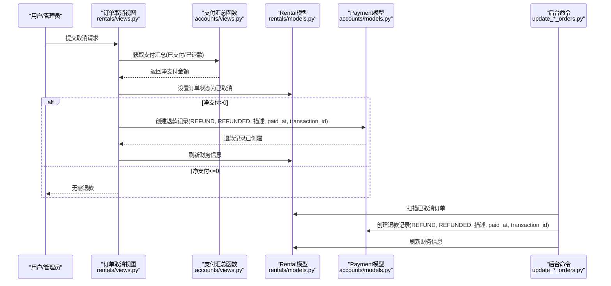
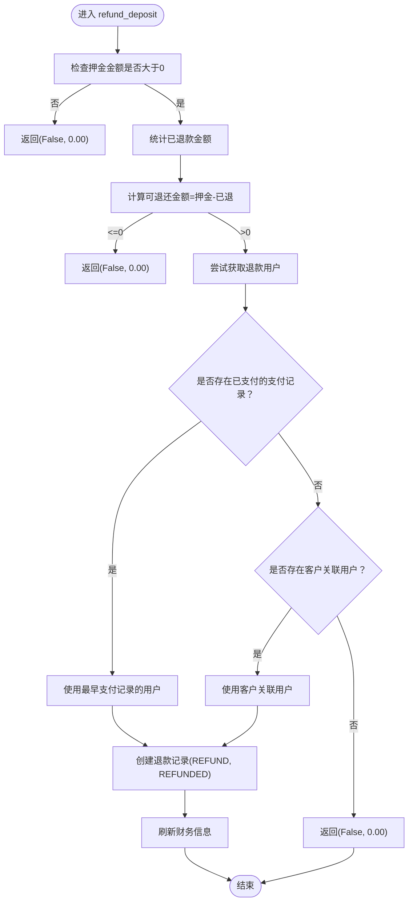
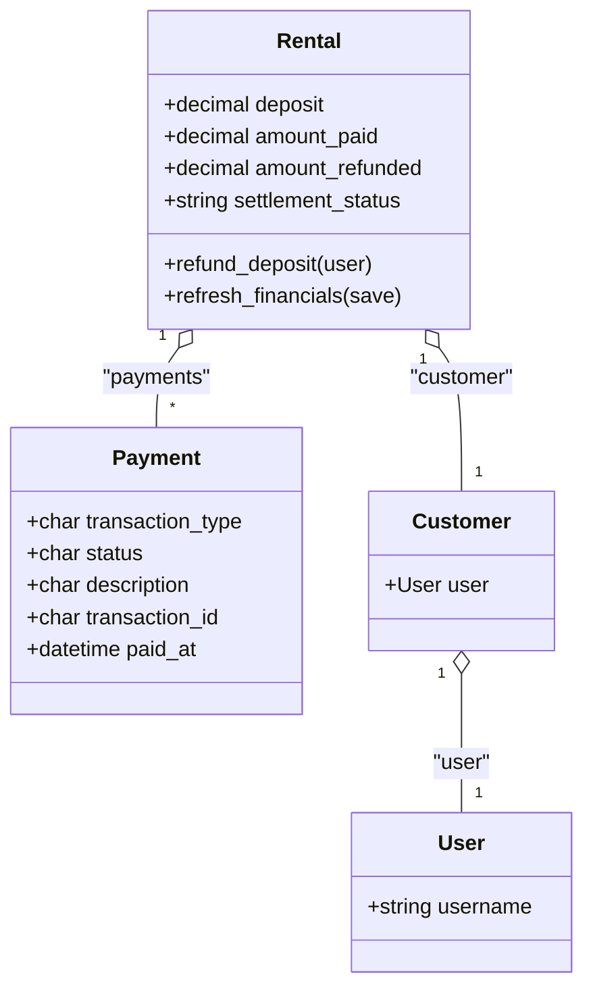

# 退款记录创建

<cite>
**本文引用的文件列表**
- [accounts/models.py](file://code/car_rental_system/accounts/models.py)
- [accounts/views.py](file://code/car_rental_system/accounts/views.py)
- [rentals/models.py](file://code/car_rental_system/rentals/models.py)
- [rentals/views.py](file://code/car_rental_system/rentals/views.py)
- [rentals/management/commands/update_expired_rentals.py](file://code/car_rental_system/rentals/management/commands/update_expired_rentals.py)
- [rentals/management/commands/update_historical_orders.py](file://code/car_rental_system/rentals/management/commands/update_historical_orders.py)
- [templates/accounts/order_detail.html](file://code/car_rental_system/templates/accounts/order_detail.html)
- [templates/accounts/consumption_report.html](file://code/car_rental_system/templates/accounts/consumption_report.html)
- [templates/accounts/payment.html](file://code/car_rental_system/templates/accounts/payment.html)
- [templates/accounts/payment_history.html](file://code/car_rental_system/templates/accounts/payment_history.html)
- [customers/models.py](file://code/car_rental_system/customers/models.py)
- [vehicles/models.py](file://code/car_rental_system/vehicles/models.py)
</cite>

## 目录
1. [简介](#简介)
2. [项目结构](#项目结构)
3. [核心组件](#核心组件)
4. [架构总览](#架构总览)
5. [详细组件分析](#详细组件分析)
6. [依赖关系分析](#依赖关系分析)
7. [性能考量](#性能考量)
8. [故障排查指南](#故障排查指南)
9. [结论](#结论)
10. [附录](#附录)

## 简介
本文件围绕“订单取消时如何创建Payment退款记录”展开，重点说明以下要点：
- 退款记录的字段设置：transaction_type='REFUND'、status='REFUNDED'、描述字段的设置规则
- refund_deposit方法中退款用户的确定规则：优先使用支付记录中的用户，其次使用客户关联的用户
- 唯一transaction_id的生成规则：以'REF'开头的时间戳
- paid_at时间的设置：退款发生时的当前时间
- 退款金额的计算逻辑：押金金额减去已退还金额的差额
- 提供代码示例路径，展示退款记录创建的完整流程

## 项目结构
系统采用多应用分层结构，涉及账户、客户、车辆、租赁等模块。与退款相关的关键文件如下：
- accounts/models.py：定义Payment模型及其字段、枚举、索引
- accounts/views.py：提供支付汇总工具函数get_payment_summary
- rentals/models.py：定义Rental模型，包含押金、财务统计字段，以及refund_deposit方法
- rentals/views.py：订单取消视图中创建退款记录的流程
- management/commands：后台命令批量处理历史订单退款
- templates：前端模板展示退款记录与财务信息

图表来源
- [accounts/models.py](file://code/car_rental_system/accounts/models.py#L147-L251)
- [accounts/views.py](file://code/car_rental_system/accounts/views.py#L243-L268)
- [rentals/models.py](file://code/car_rental_system/rentals/models.py#L12-L160)
- [rentals/views.py](file://code/car_rental_system/rentals/views.py#L395-L450)
- [rentals/management/commands/update_expired_rentals.py](file://code/car_rental_system/rentals/management/commands/update_expired_rentals.py#L144-L191)
- [rentals/management/commands/update_historical_orders.py](file://code/car_rental_system/rentals/management/commands/update_historical_orders.py#L230-L280)
- [templates/accounts/order_detail.html](file://code/car_rental_system/templates/accounts/order_detail.html#L298-L408)
- [templates/accounts/consumption_report.html](file://code/car_rental_system/templates/accounts/consumption_report.html#L53-L118)
- [templates/accounts/payment.html](file://code/car_rental_system/templates/accounts/payment.html#L79-L100)
- [templates/accounts/payment_history.html](file://code/car_rental_system/templates/accounts/payment_history.html#L34-L54)

章节来源
- [accounts/models.py](file://code/car_rental_system/accounts/models.py#L147-L251)
- [rentals/models.py](file://code/car_rental_system/rentals/models.py#L12-L160)

## 核心组件
- Payment模型：存储支付/退款记录，包含transaction_type、status、description、transaction_id、paid_at等字段，并定义了交易类型和状态的枚举。
- Rental模型：维护订单的押金、累计支付/退款金额、结算状态等，并提供refund_deposit方法用于自动退还押金。
- 支付汇总函数：accounts.views.get_payment_summary用于计算已支付、已退款、净支付等关键指标。
- 订单取消视图：rentals.views.rental_cancel在取消订单时根据净支付金额创建退款记录。
- 后台命令：自动结算押金与批量历史订单退款，均遵循相同的退款字段设置规则。

章节来源
- [accounts/models.py](file://code/car_rental_system/accounts/models.py#L147-L251)
- [accounts/views.py](file://code/car_rental_system/accounts/views.py#L243-L268)
- [rentals/models.py](file://code/car_rental_system/rentals/models.py#L296-L333)
- [rentals/views.py](file://code/car_rental_system/rentals/views.py#L395-L450)
- [rentals/management/commands/update_expired_rentals.py](file://code/car_rental_system/rentals/management/commands/update_expired_rentals.py#L144-L191)
- [rentals/management/commands/update_historical_orders.py](file://code/car_rental_system/rentals/management/commands/update_historical_orders.py#L230-L280)

## 架构总览
退款流程在不同入口保持一致的字段规范与逻辑：
- 订单取消：调用get_payment_summary计算净支付金额，再依据支付记录中的用户或客户关联用户创建退款记录
- 自动结算押金：在订单完成后，若满足条件则退还押金
- 批量历史订单：扫描已取消订单，按净支付金额创建退款记录

图表来源
- [rentals/views.py](file://code/car_rental_system/rentals/views.py#L395-L450)
- [accounts/views.py](file://code/car_rental_system/accounts/views.py#L243-L268)
- [rentals/models.py](file://code/car_rental_system/rentals/models.py#L296-L333)
- [accounts/models.py](file://code/car_rental_system/accounts/models.py#L147-L251)
- [rentals/management/commands/update_historical_orders.py](file://code/car_rental_system/rentals/management/commands/update_historical_orders.py#L230-L280)

## 详细组件分析

### 退款记录字段规范
- 交易类型：transaction_type='REFUND'
- 状态：status='REFUNDED'
- 描述：根据场景设置不同描述
  - 订单取消：描述包含“订单取消，退还已支付金额 ¥{net_paid:.2f}”
  - 押金自动退还：描述为“订单完成，押金自动退还”
- 唯一交易号：transaction_id以'REF'开头，后接当前时间戳
- 实际支付时间：paid_at设置为退款发生时的当前时间

章节来源
- [accounts/models.py](file://code/car_rental_system/accounts/models.py#L147-L251)
- [rentals/views.py](file://code/car_rental_system/rentals/views.py#L418-L441)
- [rentals/management/commands/update_expired_rentals.py](file://code/car_rental_system/rentals/management/commands/update_expired_rentals.py#L166-L177)
- [rentals/management/commands/update_historical_orders.py](file://code/car_rental_system/rentals/management/commands/update_historical_orders.py#L246-L257)

### 退款用户确定规则（refund_deposit方法）
refund_deposit方法在未显式传入用户时，按以下优先级确定退款用户：
1) 若存在已支付的支付记录，优先使用其中最早的一条记录对应的用户
2) 若不存在支付记录，使用订单关联客户(customer.user)的用户
3) 若仍无法确定用户，则不创建退款记录

图表来源
- [rentals/models.py](file://code/car_rental_system/rentals/models.py#L334-L394)

章节来源
- [rentals/models.py](file://code/car_rental_system/rentals/models.py#L334-L394)

### 退款金额计算逻辑
- 订单取消时：通过accounts.views.get_payment_summary计算净支付金额=已支付-已退款
- 自动结算押金时：refundable=押金-已退还金额
- 两者均遵循“可退还金额=应退-已退”的原则，避免重复退款

章节来源
- [accounts/views.py](file://code/car_rental_system/accounts/views.py#L243-L268)
- [rentals/models.py](file://code/car_rental_system/rentals/models.py#L144-L156)
- [rentals/models.py](file://code/car_rental_system/rentals/models.py#L296-L333)

### 退款记录创建的完整流程（代码示例路径）
- 订单取消创建退款记录
  - 视图入口：[rentals/views.py](file://code/car_rental_system/rentals/views.py#L395-L450)
  - 支付汇总：[accounts/views.py](file://code/car_rental_system/accounts/views.py#L243-L268)
  - 退款记录字段设置：[rentals/views.py](file://code/car_rental_system/rentals/views.py#L418-L441)
  - 财务信息刷新：[rentals/models.py](file://code/car_rental_system/rentals/models.py#L326-L333)

- 自动结算押金创建退款记录
  - 命令入口：[rentals/management/commands/update_expired_rentals.py](file://code/car_rental_system/rentals/management/commands/update_expired_rentals.py#L144-L191)
  - 退款记录字段设置：[rentals/management/commands/update_expired_rentals.py](file://code/car_rental_system/rentals/management/commands/update_expired_rentals.py#L166-L177)

- 批量历史订单退款创建退款记录
  - 命令入口：[rentals/management/commands/update_historical_orders.py](file://code/car_rental_system/rentals/management/commands/update_historical_orders.py#L230-L280)
  - 退款记录字段设置：[rentals/management/commands/update_historical_orders.py](file://code/car_rental_system/rentals/management/commands/update_historical_orders.py#L246-L257)

- 押金自动退还（refund_deposit）
  - 方法入口：[rentals/models.py](file://code/car_rental_system/rentals/models.py#L334-L394)
  - 退款记录字段设置：[rentals/models.py](file://code/car_rental_system/rentals/models.py#L378-L388)

章节来源
- [rentals/views.py](file://code/car_rental_system/rentals/views.py#L395-L450)
- [accounts/views.py](file://code/car_rental_system/accounts/views.py#L243-L268)
- [rentals/management/commands/update_expired_rentals.py](file://code/car_rental_system/rentals/management/commands/update_expired_rentals.py#L144-L191)
- [rentals/management/commands/update_historical_orders.py](file://code/car_rental_system/rentals/management/commands/update_historical_orders.py#L230-L280)
- [rentals/models.py](file://code/car_rental_system/rentals/models.py#L334-L394)

### 前端展示与校验
- 订单详情页：展示应付总额、已支付、已退款、待支付、净支付等关键指标；退款记录以“退款”类型显示
- 消费报表页：展示退款总额、支付/退款流水
- 支付页与支付历史页：展示退款记录的类型、金额、状态、备注

章节来源
- [templates/accounts/order_detail.html](file://code/car_rental_system/templates/accounts/order_detail.html#L298-L408)
- [templates/accounts/consumption_report.html](file://code/car_rental_system/templates/accounts/consumption_report.html#L53-L118)
- [templates/accounts/payment.html](file://code/car_rental_system/templates/accounts/payment.html#L79-L100)
- [templates/accounts/payment_history.html](file://code/car_rental_system/templates/accounts/payment_history.html#L34-L54)

## 依赖关系分析
- Rental与Payment：Rental通过外键关联Payment，用于统计累计支付/退款金额、刷新结算状态
- accounts.views.get_payment_summary：被多个入口调用，统一计算净支付金额
- 后台命令与视图：均遵循相同的退款字段设置规则，保证数据一致性

图表来源
- [rentals/models.py](file://code/car_rental_system/rentals/models.py#L12-L160)
- [accounts/models.py](file://code/car_rental_system/accounts/models.py#L147-L251)
- [customers/models.py](file://code/car_rental_system/customers/models.py#L7-L21)
- [vehicles/models.py](file://code/car_rental_system/vehicles/models.py#L1-L85)

章节来源
- [rentals/models.py](file://code/car_rental_system/rentals/models.py#L12-L160)
- [accounts/models.py](file://code/car_rental_system/accounts/models.py#L147-L251)
- [customers/models.py](file://code/car_rental_system/customers/models.py#L7-L21)

## 性能考量
- 聚合查询：refresh_financials与get_payment_summary使用聚合查询统计金额，避免逐条遍历
- 索引优化：Payment模型对user、rental、transaction_id、transaction_type建立索引，提升退款记录查询效率
- 批量处理：后台命令支持预览(dry-run)与批量执行，减少对生产环境的影响
- 原子性：订单取消与退款创建在同一事务中执行，保证数据一致性

章节来源
- [rentals/models.py](file://code/car_rental_system/rentals/models.py#L296-L333)
- [accounts/models.py](file://code/car_rental_system/accounts/models.py#L237-L248)
- [rentals/views.py](file://code/car_rental_system/rentals/views.py#L395-L450)
- [rentals/management/commands/update_historical_orders.py](file://code/car_rental_system/rentals/management/commands/update_historical_orders.py#L230-L280)

## 故障排查指南
- 退款记录未显示
  - 可能原因：历史订单财务信息未刷新、退款记录未创建
  - 处理建议：执行批量更新命令刷新财务信息或为已完成订单创建押金退款记录
  - 参考文档：[退款信息显示说明.md](file://code/car_rental_system/退款信息显示说明.md#L1-L58)
- 退款用户缺失
  - 可能原因：订单无已支付的支付记录，且客户未关联用户
  - 处理建议：在refund_deposit与批量命令中增加用户回退逻辑，或手动补充用户关联
- 重复退款
  - 预防措施：通过get_payment_summary与refundable计算避免重复退款
- 字段不一致
  - 校验建议：核对transaction_type、status、description、transaction_id、paid_at是否符合规范

章节来源
- [退款信息显示说明.md](file://code/car_rental_system/退款信息显示说明.md#L1-L58)
- [rentals/models.py](file://code/car_rental_system/rentals/models.py#L334-L394)
- [accounts/views.py](file://code/car_rental_system/accounts/views.py#L243-L268)

## 结论
系统在订单取消与自动结算押金场景下，均遵循统一的退款记录创建规范：transaction_type='REFUND'、status='REFUNDED'、描述字段明确、transaction_id以'REF'开头并结合时间戳生成、paid_at设置为退款发生时间。退款用户优先从支付记录中获取，其次使用客户关联用户，确保退款方向正确。退款金额通过“押金-已退”或“已支付-已退”计算，避免重复退款。前后端配合展示退款流水与财务摘要，便于审计与核对。

## 附录
- 关键字段与枚举定义参考：[accounts/models.py](file://code/car_rental_system/accounts/models.py#L147-L251)
- 退款用户确定与创建退款记录参考：
  - [rentals/models.py](file://code/car_rental_system/rentals/models.py#L334-L394)
  - [rentals/views.py](file://code/car_rental_system/rentals/views.py#L395-L450)
  - [rentals/management/commands/update_expired_rentals.py](file://code/car_rental_system/rentals/management/commands/update_expired_rentals.py#L144-L191)
  - [rentals/management/commands/update_historical_orders.py](file://code/car_rental_system/rentals/management/commands/update_historical_orders.py#L230-L280)
- 前端展示参考：
  - [templates/accounts/order_detail.html](file://code/car_rental_system/templates/accounts/order_detail.html#L298-L408)
  - [templates/accounts/consumption_report.html](file://code/car_rental_system/templates/accounts/consumption_report.html#L53-L118)
  - [templates/accounts/payment.html](file://code/car_rental_system/templates/accounts/payment.html#L79-L100)
  - [templates/accounts/payment_history.html](file://code/car_rental_system/templates/accounts/payment_history.html#L34-L54)