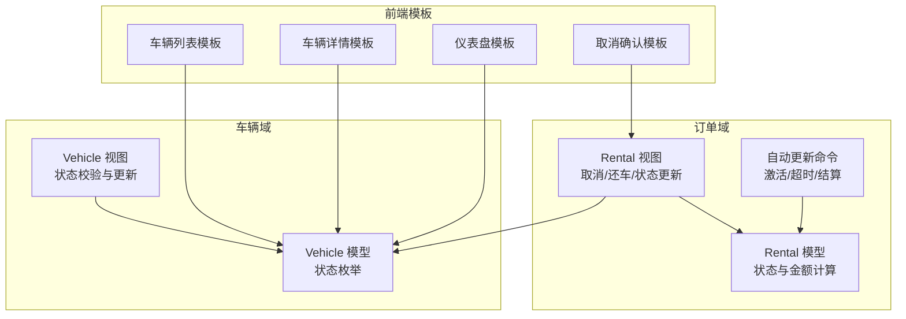
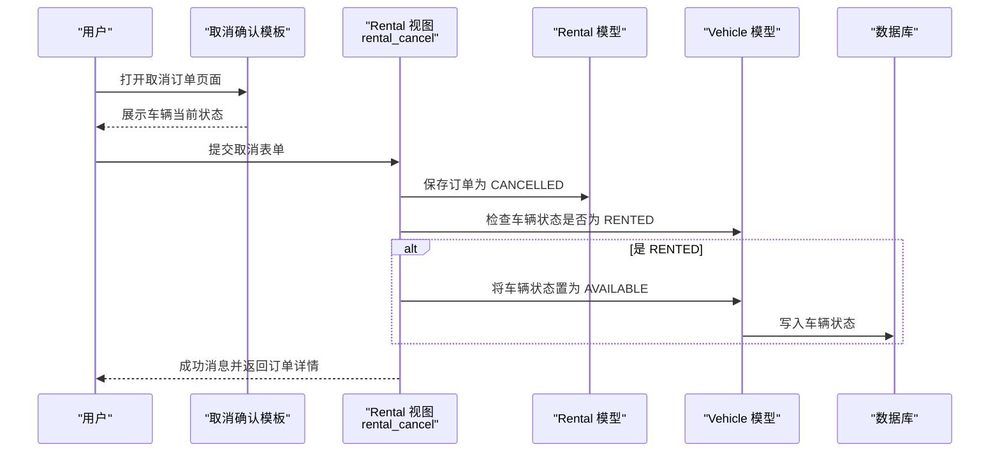
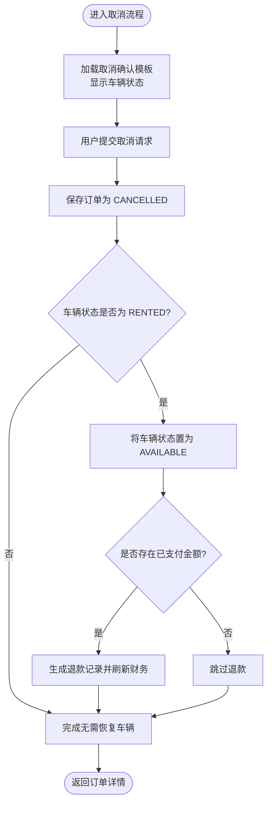
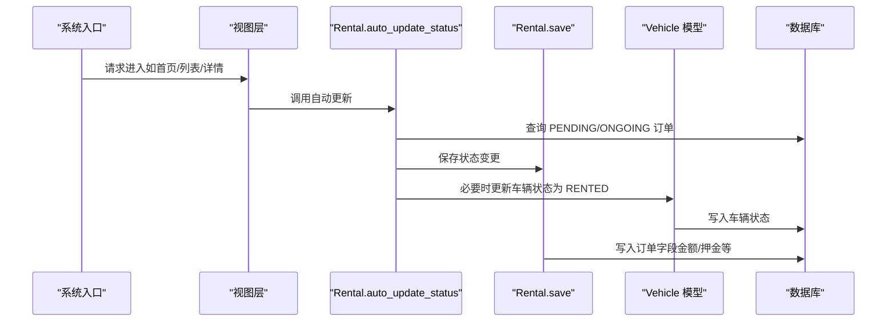
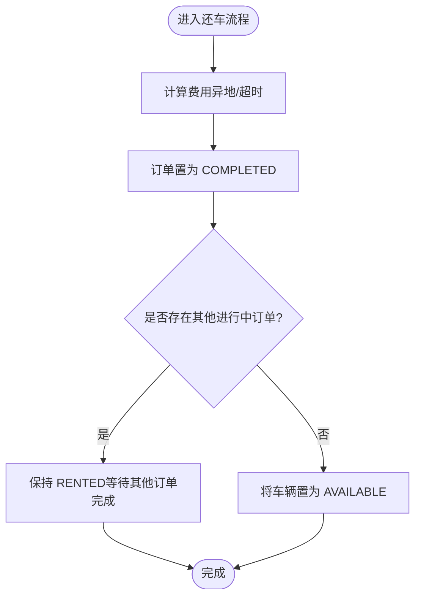
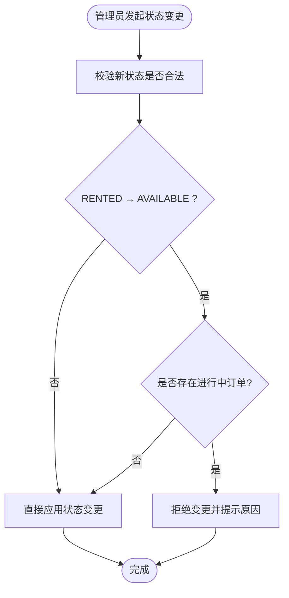
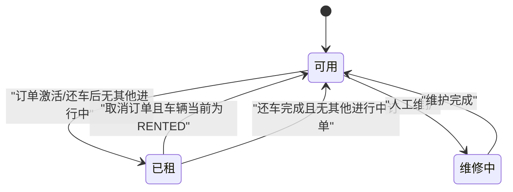
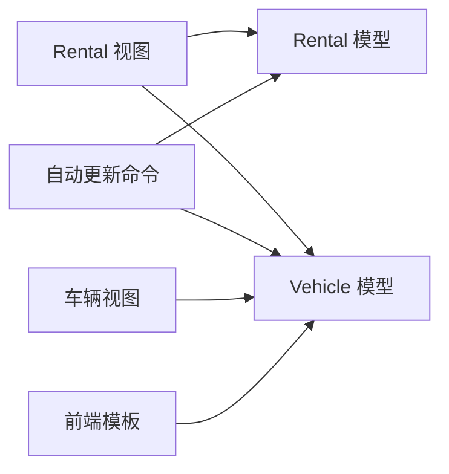

# 车辆状态恢复

<cite>
**本文引用的文件**
- [rentals/models.py](file://code/car_rental_system/rentals/models.py)
- [rentals/views.py](file://code/car_rental_system/rentals/views.py)
- [vehicles/models.py](file://code/car_rental_system/vehicles/models.py)
- [vehicles/views.py](file://code/car_rental_system/vehicles/views.py)
- [rentals/management/commands/update_expired_rentals.py](file://code/car_rental_system/rentals/management/commands/update_expired_rentals.py)
- [templates/rentals/rental_confirm_cancel.html](file://code/car_rental_system/templates/rentals/rental_confirm_cancel.html)
- [templates/dashboard.html](file://code/car_rental_system/templates/dashboard.html)
- [templates/vehicles/vehicle_list.html](file://code/car_rental_system/templates/vehicles/vehicle_list.html)
- [templates/vehicles/vehicle_detail.html](file://code/car_rental_system/templates/vehicles/vehicle_detail.html)
- [订单自动更新使用说明.md](file://code/car_rental_system/订单自动更新使用说明.md)
- [test_order_status_update.py](file://code/car_rental_system/test_order_status_update.py)
</cite>

## 目录
1. [简介](#简介)
2. [项目结构](#项目结构)
3. [核心组件](#核心组件)
4. [架构总览](#架构总览)
5. [详细组件分析](#详细组件分析)
6. [依赖关系分析](#依赖关系分析)
7. [性能考量](#性能考量)
8. [故障排查指南](#故障排查指南)
9. [结论](#结论)
10. [附录](#附录)

## 简介
本文聚焦“订单取消后车辆状态恢复为‘可用’”的联动更新机制，系统梳理以下要点：
- 在取消订单流程中如何检查车辆当前状态（vehicle.status == 'RENTED'），并在满足条件时将其置为‘AVAILABLE’。
- 如何通过 Rental 模型的 save 方法与 auto_update_status 类方法，确保订单生命周期内车辆状态的正确联动。
- 如何避免资源锁定问题，确保同一车辆在同一时刻只被一个有效订单占用。
- 提供状态转换图，直观展示车辆状态在订单生命周期中的演进路径。

## 项目结构
围绕订单与车辆状态联动的关键模块包括：
- 订单模型与视图：rentals/models.py、rentals/views.py
- 车辆模型与视图：vehicles/models.py、vehicles/views.py
- 自动更新命令：rentals/management/commands/update_expired_rentals.py
- 前端模板：templates/rentals/rental_confirm_cancel.html、templates/dashboard.html、templates/vehicles/vehicle_list.html、templates/vehicles/vehicle_detail.html
- 文档与测试：订单自动更新使用说明.md、test_order_status_update.py

图表来源
- [rentals/models.py](file://code/car_rental_system/rentals/models.py#L1-L120)
- [rentals/views.py](file://code/car_rental_system/rentals/views.py#L395-L466)
- [vehicles/models.py](file://code/car_rental_system/vehicles/models.py#L1-L85)
- [vehicles/views.py](file://code/car_rental_system/vehicles/views.py#L289-L322)
- [rentals/management/commands/update_expired_rentals.py](file://code/car_rental_system/rentals/management/commands/update_expired_rentals.py#L1-L191)
- [templates/rentals/rental_confirm_cancel.html](file://code/car_rental_system/templates/rentals/rental_confirm_cancel.html#L1-L219)
- [templates/vehicles/vehicle_list.html](file://code/car_rental_system/templates/vehicles/vehicle_list.html#L114-L139)
- [templates/vehicles/vehicle_detail.html](file://code/car_rental_system/templates/vehicles/vehicle_detail.html#L83-L124)
- [templates/dashboard.html](file://code/car_rental_system/templates/dashboard.html#L295-L313)

章节来源
- [rentals/models.py](file://code/car_rental_system/rentals/models.py#L1-L120)
- [vehicles/models.py](file://code/car_rental_system/vehicles/models.py#L1-L85)

## 核心组件
- Rental 模型
  - 定义订单状态枚举与结算状态枚举，提供 auto_update_status 类方法实现自动状态推进。
  - save 方法负责金额与押金等字段的计算与默认值填充。
- Vehicle 模型
  - 定义车辆状态枚举（AVAILABLE、RENTED、MAINTENANCE）。
- Rental 视图
  - rental_cancel：在取消订单时，若车辆处于 RENTED 状态则恢复为 AVAILABLE。
  - rental_status_update：根据状态变化联动更新车辆状态。
  - rental_return：还车完成后，检查是否存在其他进行中的订单，若无则将车辆置为 AVAILABLE。
- Vehicle 视图
  - vehicle_status_update：对车辆状态变更进行合法性校验（如 RENTED → AVAILABLE 时必须无进行中订单）。
- 自动更新命令
  - update_expired_rentals：激活 PENDING → ONGOING，并在必要时将车辆置为 RENTED；同时将 OVERDUE 的订单标记为已超时未归还。

章节来源
- [rentals/models.py](file://code/car_rental_system/rentals/models.py#L12-L120)
- [vehicles/models.py](file://code/car_rental_system/vehicles/models.py#L6-L20)
- [rentals/views.py](file://code/car_rental_system/rentals/views.py#L395-L466)
- [vehicles/views.py](file://code/car_rental_system/vehicles/views.py#L289-L322)
- [rentals/management/commands/update_expired_rentals.py](file://code/car_rental_system/rentals/management/commands/update_expired_rentals.py#L1-L191)

## 架构总览
下图展示了“取消订单导致车辆状态恢复”的端到端流程，包含后端业务逻辑与前端交互。

图表来源
- [templates/rentals/rental_confirm_cancel.html](file://code/car_rental_system/templates/rentals/rental_confirm_cancel.html#L120-L138)
- [rentals/views.py](file://code/car_rental_system/rentals/views.py#L395-L466)
- [vehicles/models.py](file://code/car_rental_system/vehicles/models.py#L6-L20)

## 详细组件分析

### 订单取消流程与车辆状态恢复
- 触发点：用户在取消订单确认页面提交取消请求。
- 关键逻辑：
  - 后端接收请求后，将订单状态置为 CANCELLED，并记录取消原因。
  - 若车辆状态为 RENTED，则立即将其置为 AVAILABLE。
  - 若存在已支付金额，按净额生成退款记录并刷新财务信息。
- 前端展示：取消确认页面会显示当前车辆状态，便于用户确认影响。

图表来源
- [templates/rentals/rental_confirm_cancel.html](file://code/car_rental_system/templates/rentals/rental_confirm_cancel.html#L120-L138)
- [rentals/views.py](file://code/car_rental_system/rentals/views.py#L395-L466)

章节来源
- [templates/rentals/rental_confirm_cancel.html](file://code/car_rental_system/templates/rentals/rental_confirm_cancel.html#L120-L138)
- [rentals/views.py](file://code/car_rental_system/rentals/views.py#L395-L466)

### Rental.auto_update_status 与 save 的协作
- auto_update_status：
  - 将到达开始日期的 PENDING 订单激活为 ONGOING，并在车辆为 AVAILABLE 时将其置为 RENTED。
  - 将超过结束日期的 ONGOING 订单标记为 OVERDUE。
  - 使用缓存避免频繁更新（每5分钟最多更新一次）。
- save：
  - 在保存订单时计算总金额、押金，默认值填充，以及异地还车与超时费用的默认策略。
- 协作效果：
  - 保证订单生命周期内车辆状态与订单状态的一致性，避免“已取消但车辆仍被标记为 RENTED”的异常。

图表来源
- [rentals/views.py](file://code/car_rental_system/rentals/views.py#L17-L30)
- [rentals/models.py](file://code/car_rental_system/rentals/models.py#L171-L229)
- [rentals/models.py](file://code/car_rental_system/rentals/models.py#L246-L271)

章节来源
- [rentals/models.py](file://code/car_rental_system/rentals/models.py#L171-L229)
- [rentals/models.py](file://code/car_rental_system/rentals/models.py#L246-L271)
- [rentals/views.py](file://code/car_rental_system/rentals/views.py#L17-L30)

### 还车流程中的车辆状态释放
- 还车时，系统会：
  - 计算异地还车与超时费用，更新订单状态为 COMPLETED。
  - 检查该车辆是否还有其他进行中的订单。
  - 若无其他进行中订单，则将车辆状态置为 AVAILABLE。
- 此逻辑确保“多订单并发占用同一辆车”的情况下，只有最后一个订单完成时才释放车辆，避免资源锁定。

图表来源
- [rentals/views.py](file://code/car_rental_system/rentals/views.py#L279-L392)

章节来源
- [rentals/views.py](file://code/car_rental_system/rentals/views.py#L279-L392)

### 车辆状态变更的合法性校验
- 当管理员直接修改车辆状态时，系统会进行合法性校验：
  - 将 RENTED 状态置为 AVAILABLE 时，必须确保该车辆没有进行中的订单。
- 这一约束与“取消/还车”流程共同作用，确保车辆资源不会被错误释放。

图表来源
- [vehicles/views.py](file://code/car_rental_system/vehicles/views.py#L289-L322)

章节来源
- [vehicles/views.py](file://code/car_rental_system/vehicles/views.py#L289-L322)

### 订单生命周期中的车辆状态转换图
下图展示车辆状态在典型订单生命周期内的变化，涵盖“取消”场景。

图表来源
- [vehicles/models.py](file://code/car_rental_system/vehicles/models.py#L6-L20)
- [rentals/views.py](file://code/car_rental_system/rentals/views.py#L395-L466)
- [rentals/views.py](file://code/car_rental_system/rentals/views.py#L279-L392)

## 依赖关系分析
- 模块耦合
  - Rental 视图与 Vehicle 模型强耦合：取消/还车/状态更新均涉及车辆状态联动。
  - 自动更新命令与 Rental 模型强耦合：通过查询与批量更新实现状态推进。
- 外部依赖
  - 前端模板依赖车辆状态显示逻辑，确保用户可见的状态与后端一致。
  - 文档与测试脚本辅助验证状态转换的正确性与幂等性。

图表来源
- [rentals/views.py](file://code/car_rental_system/rentals/views.py#L395-L466)
- [vehicles/views.py](file://code/car_rental_system/vehicles/views.py#L289-L322)
- [rentals/management/commands/update_expired_rentals.py](file://code/car_rental_system/rentals/management/commands/update_expired_rentals.py#L1-L191)
- [templates/vehicles/vehicle_list.html](file://code/car_rental_system/templates/vehicles/vehicle_list.html#L114-L139)

章节来源
- [rentals/views.py](file://code/car_rental_system/rentals/views.py#L395-L466)
- [vehicles/views.py](file://code/car_rental_system/vehicles/views.py#L289-L322)
- [rentals/management/commands/update_expired_rentals.py](file://code/car_rental_system/rentals/management/commands/update_expired_rentals.py#L1-L191)

## 性能考量
- 自动更新缓存：Rental.auto_update_status 使用缓存避免每请求都执行昂贵的查询与更新，降低数据库压力。
- 批量更新：自动更新命令采用事务包裹，减少多次往返数据库的开销。
- 前端状态展示：模板中对车辆状态的渲染简单高效，避免复杂逻辑在模板层执行。

章节来源
- [rentals/models.py](file://code/car_rental_system/rentals/models.py#L171-L229)
- [rentals/management/commands/update_expired_rentals.py](file://code/car_rental_system/rentals/management/commands/update_expired_rentals.py#L66-L93)

## 故障排查指南
- 取消后车辆未恢复为可用
  - 检查取消流程是否执行到“车辆状态检查与更新”分支。
  - 确认订单状态确为 CANCELLED，且车辆状态为 RENTED。
  - 查看事务是否成功提交，以及是否存在并发写入冲突。
- 还车后车辆未恢复为可用
  - 检查是否存在其他进行中的订单（同一车辆的其他订单）。
  - 确认还车流程中“检查其他进行中订单”的逻辑是否被执行。
- 状态显示异常
  - 检查前端模板中车辆状态的渲染逻辑是否与后端一致。
  - 确认车辆视图中的状态变更合法性校验未阻断预期变更。

章节来源
- [rentals/views.py](file://code/car_rental_system/rentals/views.py#L395-L466)
- [rentals/views.py](file://code/car_rental_system/rentals/views.py#L279-L392)
- [vehicles/views.py](file://code/car_rental_system/vehicles/views.py#L289-L322)
- [templates/vehicles/vehicle_list.html](file://code/car_rental_system/templates/vehicles/vehicle_list.html#L114-L139)
- [templates/dashboard.html](file://code/car_rental_system/templates/dashboard.html#L295-L313)

## 结论
- 订单取消后车辆状态恢复为‘可用’的联动更新机制由多处逻辑共同保障：
  - 取消流程中显式检查并更新车辆状态；
  - 自动更新命令与还车流程在不同场景下确保状态一致性；
  - 车辆视图对状态变更进行合法性校验，防止资源误释放。
- 通过事务、缓存与幂等设计，系统在保证正确性的同时兼顾性能与稳定性。

## 附录
- 自动更新规则与注意事项可参考文档说明，其中明确指出“当天结束的订单不会被更新”，以及“只有当车辆没有任何进行中订单时才会更新为可用”。

章节来源
- [订单自动更新使用说明.md](file://code/car_rental_system/订单自动更新使用说明.md#L71-L119)
- [test_order_status_update.py](file://code/car_rental_system/test_order_status_update.py#L141-L270)