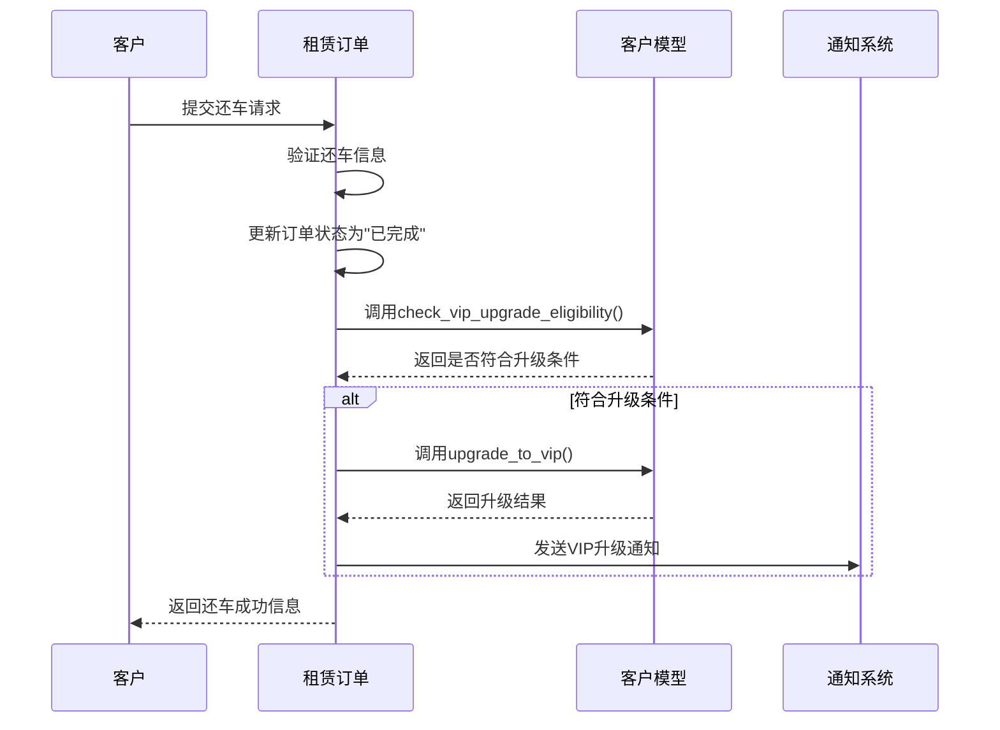
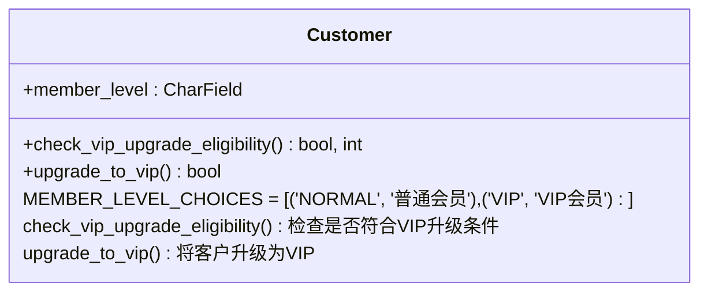
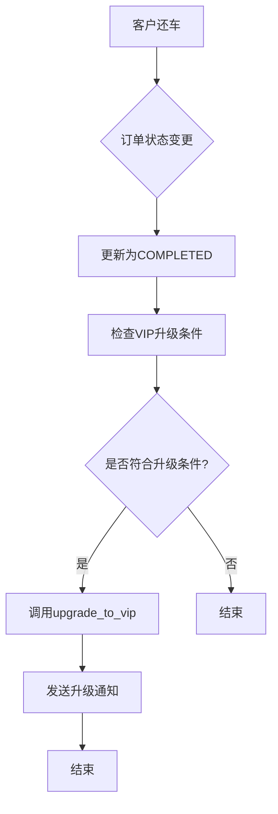
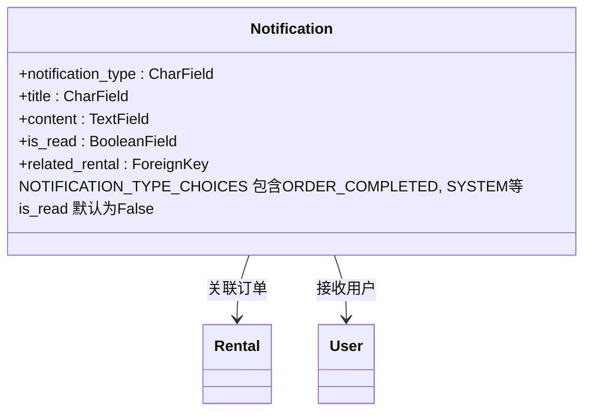
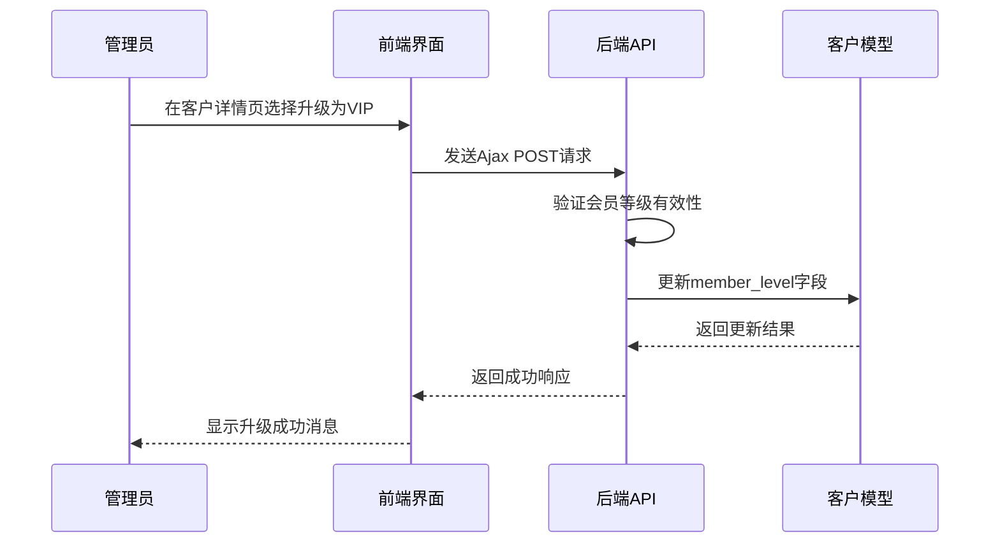

# VIP会员自动升级机制

<cite>
**本文档引用文件**   
- [customers/models.py](file://code/car_rental_system/customers/models.py)
- [rentals/models.py](file://code/car_rental_system/rentals/models.py)
- [rentals/views.py](file://code/car_rental_system/rentals/views.py)
- [customers/views.py](file://code/car_rental_system/customers/views.py)
- [accounts/models.py](file://code/car_rental_system/accounts/models.py)
- [templates/accounts/profile.html](file://code/car_rental_system/templates/accounts/profile.html)
</cite>

## 目录
1. [业务规则概述](#业务规则概述)
2. [升级触发条件](#升级触发条件)
3. [技术实现分析](#技术实现分析)
4. [Customer模型方法详解](#customer模型方法详解)
5. [Rental模型业务流程集成](#rental模型业务流程集成)
6. [通知系统集成](#通知系统集成)
7. [管理后台手动升级路径](#管理后台手动升级路径)
8. [客户忠诚度价值分析](#客户忠诚度价值分析)

## 业务规则概述

VIP会员自动升级机制是租车管理系统中的核心客户激励功能，旨在通过自动化方式识别并奖励表现优异的长期客户。该机制通过分析客户的租赁历史行为，当满足特定条件时，系统将自动为客户升级至VIP会员等级，享受专属权益。

该机制的设计体现了"以客户为中心"的服务理念，通过建立明确的升级路径和奖励机制，鼓励客户保持良好的租赁行为，如按时还车、诚信还车等。VIP会员可享受9折优惠等专属权益，这不仅提升了客户满意度，也增强了客户粘性。

系统通过在客户详情页展示升级进度，让客户清晰了解自己的升级状态，包括已满足条件的连续订单数和还需完成的订单数。这种透明化的进度展示增强了客户的参与感和成就感，进一步激励客户维持良好的租赁行为。

**本节来源**
- [customers/models.py](file://code/car_rental_system/customers/models.py#L101-L159)
- [templates/accounts/profile.html](file://code/car_rental_system/templates/accounts/profile.html#L142-L203)

## 升级触发条件

VIP会员自动升级的触发条件具有明确的逻辑规则和严格的验证机制。系统仅在客户当前会员等级非VIP且其历史租赁订单中连续10个订单均满足"表现优异"条件时，才会触发自动升级。

"表现优异"的定义包含两个核心维度：按时还车和诚信还车。按时还车的判断标准是订单的超时还车费用（overdue_fee）为0，即客户在租赁结束日期或之前完成还车。诚信还车的判断标准是客户在预订时选择的还车方式与实际还车方式一致，即如果客户选择了异地还车，则实际也在异地还车；如果客户未选择异地还车，则实际也在原取车门店还车。

系统通过从最新的已完成订单开始逆序检查，计算连续满足条件的订单数量。一旦遇到不满足条件的订单，计数即中断。只有当连续10个已完成订单都满足上述两个条件时，客户才符合VIP升级资格。这种连续性要求确保了客户行为的稳定性和可靠性，避免了偶然性良好表现带来的升级。

**本节来源**
- [customers/models.py](file://code/car_rental_system/customers/models.py#L101-L146)
- [rentals/models.py](file://code/car_rental_system/rentals/models.py#L60-L67)

## 技术实现分析

VIP会员自动升级机制的技术实现涉及多个组件的协同工作，包括Customer模型、Rental模型、业务流程控制和通知系统。该机制的核心是Customer模型中的`check_vip_upgrade_eligibility`和`upgrade_to_vip`方法，以及Rental模型在订单状态变更时的集成点。

系统通过在Rental模型的还车处理流程中集成VIP升级检查，实现了自动化的升级触发。当订单状态变更为"COMPLETED"（已完成）时，系统会调用客户对象的`check_vip_upgrade_eligibility`方法，检查该客户是否符合VIP升级条件。如果符合条件，则调用`upgrade_to_vip`方法进行升级。

这种设计体现了事件驱动的编程思想，将VIP升级检查与订单完成这一业务事件绑定，确保了升级检查的及时性和准确性。同时，通过在业务流程的关键节点集成该功能，避免了额外的定时任务或轮询机制，提高了系统的效率和响应性。

**图示来源**
- [rentals/views.py](file://code/car_rental_system/rentals/views.py#L357-L363)
- [customers/models.py](file://code/car_rental_system/customers/models.py#L147-L153)

## Customer模型方法详解

Customer模型中的`upgrade_to_vip`方法是VIP自动升级机制的核心实现，其内部逻辑简洁高效，注重性能优化和数据一致性。

该方法首先检查客户当前的会员等级是否已为VIP，如果是，则直接返回False，避免重复升级操作。这种前置检查确保了方法的幂等性，即使被多次调用也不会产生副作用。

当客户当前等级非VIP时，方法将`member_level`字段更新为'VIP'，并通过`save`方法的`update_fields`参数指定仅保存`member_level`和`updated_at`两个字段。这种选择性字段更新的优化策略减少了数据库I/O操作，提高了性能，特别是在高并发场景下能显著降低数据库负载。

方法返回一个布尔值，表示升级操作是否成功。True表示成功升级，False表示未进行升级（通常是因为客户已是VIP）。这种明确的返回值设计便于调用方进行后续处理，如记录日志、发送通知等。

**图示来源**
- [customers/models.py](file://code/car_rental_system/customers/models.py#L147-L153)
- [customers/models.py](file://code/car_rental_system/customers/models.py#L73-L79)

**本节来源**
- [customers/models.py](file://code/car_rental_system/customers/models.py#L147-L153)

## Rental模型业务流程集成

VIP会员自动升级机制与Rental模型的业务流程紧密集成，主要在订单状态变更为"COMPLETED"（已完成）后执行检查。这一集成点位于还车处理流程中，确保了升级检查的及时性和准确性。

在`rental_return`视图函数中，当系统处理还车请求并成功将订单状态更新为"COMPLETED"后，会立即检查该客户是否符合VIP升级条件。具体实现是在事务中调用`rental.customer.check_vip_upgrade_eligibility()`方法，如果返回符合条件，则调用`rental.customer.upgrade_to_vip()`方法进行升级。

这种集成方式具有多个优势：首先，它确保了升级检查基于最新的订单数据，避免了数据不一致的问题；其次，它将升级操作与还车操作放在同一个数据库事务中，保证了数据的一致性和完整性；最后，它利用了业务流程的自然节点，无需额外的定时任务或轮询机制，提高了系统效率。

**图示来源**
- [rentals/views.py](file://code/car_rental_system/rentals/views.py#L357-L363)
- [rentals/views.py](file://code/car_rental_system/rentals/views.py#L279-L381)

**本节来源**
- [rentals/views.py](file://code/car_rental_system/rentals/views.py#L357-L363)

## 通知系统集成

VIP会员升级成功后，系统通过集成的通知系统向客户发送通知，确保客户及时知晓其会员等级变更。通知系统通过`Notification`模型实现，支持多种通知类型，包括订单相关通知和系统通知。

当客户成功升级为VIP会员时，系统会在还车成功消息中包含升级提示，如"客户[姓名]由于连续10个订单表现优异，已自动升级为VIP会员！"。这种即时反馈增强了客户的成就感和满意度。

此外，客户可以在个人资料页面查看VIP会员的专属权益，如9折优惠等。系统通过模板中的条件判断，当客户为VIP会员时，显示相应的VIP权益卡片，提供清晰的视觉反馈。

通知系统的设计考虑了多渠道通知的可能性，虽然当前实现主要通过站内消息，但模型结构支持扩展邮件、短信等其他通知方式，为未来的功能扩展提供了基础。

**图示来源**
- [accounts/models.py](file://code/car_rental_system/accounts/models.py#L253-L317)
- [rentals/views.py](file://code/car_rental_system/rentals/views.py#L376-L377)

**本节来源**
- [accounts/models.py](file://code/car_rental_system/accounts/models.py#L253-L317)
- [rentals/views.py](file://code/car_rental_system/rentals/views.py#L376-L377)

## 管理后台手动升级路径

虽然系统支持VIP会员的自动升级，但管理后台也提供了手动升级的路径，以应对特殊情况或管理员决策。手动升级功能通过客户管理模块的Ajax接口实现，允许管理员在客户详情页直接更新会员等级。

在客户列表和详情页，管理员可以通过界面操作修改客户的会员等级。系统通过`customer_membership_update`视图函数处理会员等级更新请求，该函数接收Ajax POST请求，验证新的会员等级有效性后进行更新。

这种设计提供了灵活性，既保证了大多数情况下的自动化处理，又保留了人工干预的能力。例如，对于有特殊贡献的客户，管理员可以手动将其升级为VIP会员，作为额外的奖励。

**图示来源**
- [customers/views.py](file://code/car_rental_system/customers/views.py#L194-L231)
- [customers/urls.py](file://code/car_rental_system/customers/urls.py#L17)

**本节来源**
- [customers/views.py](file://code/car_rental_system/customers/views.py#L194-L231)

## 客户忠诚度价值分析

VIP会员自动升级机制对提升客户忠诚度具有重要价值。该机制通过建立明确的奖励路径，将客户的良好行为与实际利益直接关联，形成了正向激励循环。

从客户角度看，该机制提供了清晰的目标和可预期的奖励。客户通过查看升级进度条，可以明确知道还需要完成多少个良好订单才能升级，这种目标导向增强了客户的参与感和成就感。一旦升级为VIP会员，客户立即享受9折优惠等实际利益，这种即时回报强化了良好行为的价值。

从企业角度看，该机制有助于筛选和保留高质量客户。连续10个订单都表现优异的客户，其行为模式稳定可靠，违约风险低，是企业理想的长期客户。通过给予这些客户VIP待遇，企业不仅提高了客户满意度，也降低了客户流失率。

此外，该机制还具有口碑传播效应。VIP会员在享受优惠的同时，往往会向亲友推荐服务，形成自然的口碑营销。这种基于实际体验的推荐，比广告宣传更具说服力，有助于企业扩大客户基础。

**本节来源**
- [customers/models.py](file://code/car_rental_system/customers/models.py#L101-L159)
- [templates/accounts/profile.html](file://code/car_rental_system/templates/accounts/profile.html#L120-L135)