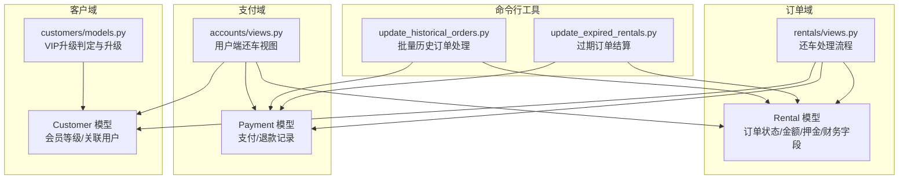
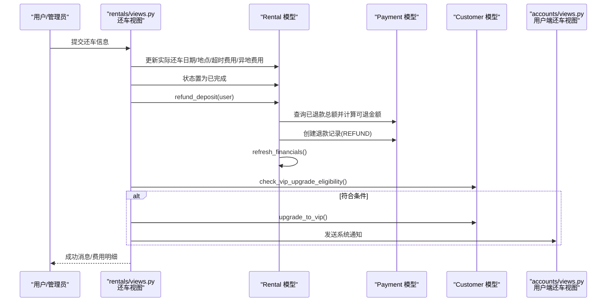
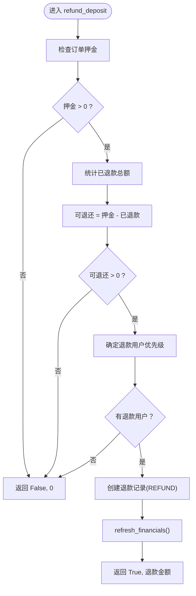
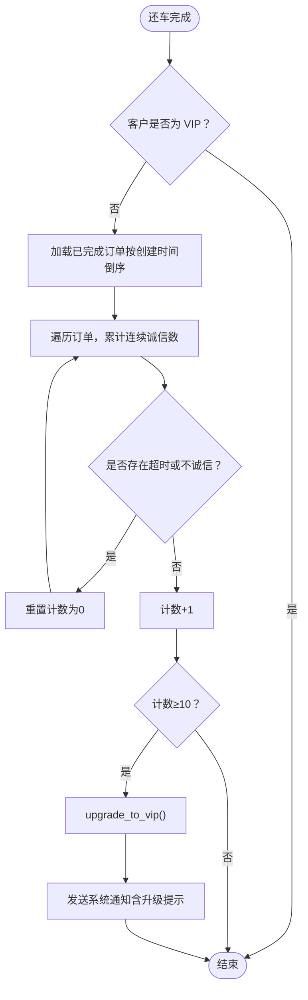
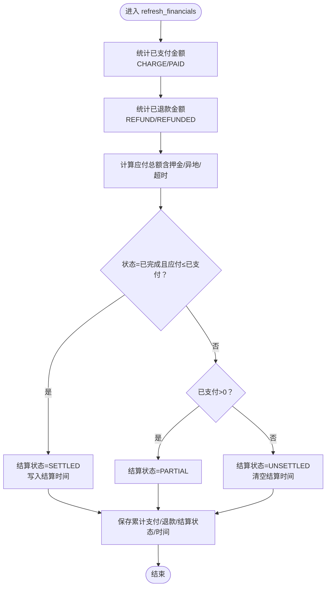
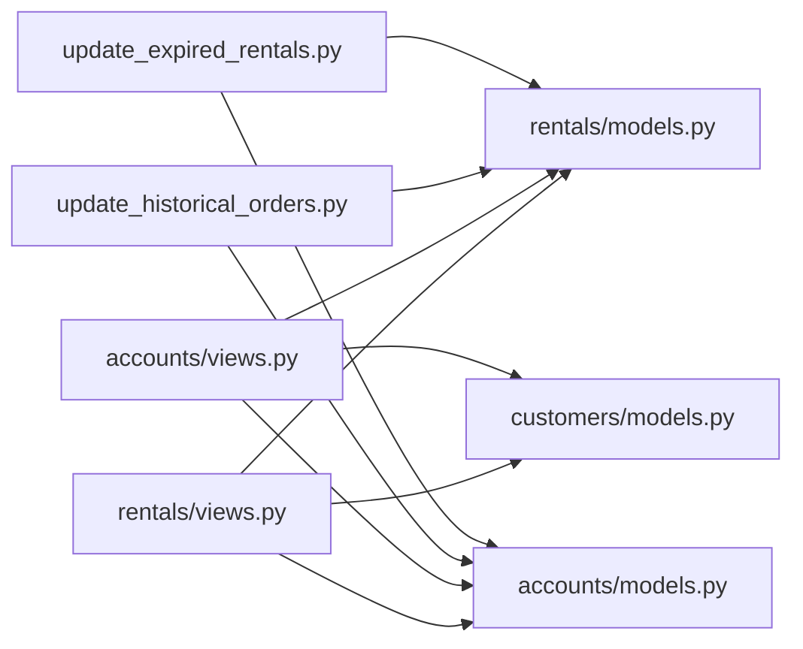

# 押金退还与VIP会员升级

<cite>
**本文引用的文件**
- [rentals/models.py](file://code/car_rental_system/rentals/models.py)
- [accounts/models.py](file://code/car_rental_system/accounts/models.py)
- [customers/models.py](file://code/car_rental_system/customers/models.py)
- [rentals/views.py](file://code/car_rental_system/rentals/views.py)
- [accounts/views.py](file://code/car_rental_system/accounts/views.py)
- [update_historical_orders.py](file://code/car_rental_system/rentals/management/commands/update_historical_orders.py)
- [update_expired_rentals.py](file://code/car_rental_system/rentals/management/commands/update_expired_rentals.py)
- [退款信息显示说明.md](file://code/car_rental_system/退款信息显示说明.md)
</cite>

## 目录
1. [简介](#简介)
2. [项目结构](#项目结构)
3. [核心组件](#核心组件)
4. [架构总览](#架构总览)
5. [详细组件分析](#详细组件分析)
6. [依赖关系分析](#依赖关系分析)
7. [性能考量](#性能考量)
8. [故障排查指南](#故障排查指南)
9. [结论](#结论)

## 简介
本文件聚焦还车处理中的财务与会员系统集成，围绕以下目标展开：
- 详细说明 refund_deposit 方法如何基于订单押金与已退款记录计算可退还金额，并在支付系统中创建退款记录。
- 解释退款用户确定的优先级逻辑：优先使用支付记录中的用户，其次使用客户关联的用户。
- 描述 VIP 会员自动升级机制：在客户非 VIP 且满足“连续10个订单表现优异”的条件下，调用 upgrade_to_vip 方法进行升级，并在成功后通过系统通知告知用户。
- 说明 refresh_financials 方法如何根据支付记录更新订单的累计支付与退款金额。

## 项目结构
系统采用多应用分层组织，涉及订单、支付、客户、车辆等模块。还车处理主要由 rentals 应用负责，财务与会员逻辑分布在 rentals、accounts、customers 三个应用中。

图表来源
- [rentals/models.py](file://code/car_rental_system/rentals/models.py#L1-L200)
- [accounts/models.py](file://code/car_rental_system/accounts/models.py#L147-L251)
- [customers/models.py](file://code/car_rental_system/customers/models.py#L101-L154)
- [rentals/views.py](file://code/car_rental_system/rentals/views.py#L279-L392)
- [accounts/views.py](file://code/car_rental_system/accounts/views.py#L1149-L1279)
- [update_historical_orders.py](file://code/car_rental_system/rentals/management/commands/update_historical_orders.py#L65-L211)
- [update_expired_rentals.py](file://code/car_rental_system/rentals/management/commands/update_expired_rentals.py#L144-L173)

章节来源
- [rentals/models.py](file://code/car_rental_system/rentals/models.py#L1-L200)
- [accounts/models.py](file://code/car_rental_system/accounts/models.py#L147-L251)
- [customers/models.py](file://code/car_rental_system/customers/models.py#L101-L154)
- [rentals/views.py](file://code/car_rental_system/rentals/views.py#L279-L392)
- [accounts/views.py](file://code/car_rental_system/accounts/views.py#L1149-L1279)

## 核心组件
- 订单模型（Rental）：维护订单状态、金额、押金、累计支付与退款金额，并提供 refresh_financials 与 refund_deposit。
- 支付模型（Payment）：记录支付与退款，支持按订单聚合统计。
- 客户模型（Customer）：维护会员等级，提供 check_vip_upgrade_eligibility 与 upgrade_to_vip。
- 视图控制器：rentals/views.py 中的还车流程；accounts/views.py 中的用户端还车流程。
- 历史处理命令：update_historical_orders.py 与 update_expired_rentals.py 提供批量退款与财务刷新能力。

章节来源
- [rentals/models.py](file://code/car_rental_system/rentals/models.py#L296-L401)
- [accounts/models.py](file://code/car_rental_system/accounts/models.py#L147-L251)
- [customers/models.py](file://code/car_rental_system/customers/models.py#L101-L154)
- [rentals/views.py](file://code/car_rental_system/rentals/views.py#L279-L392)
- [accounts/views.py](file://code/car_rental_system/accounts/views.py#L1149-L1279)
- [update_historical_orders.py](file://code/car_rental_system/rentals/management/commands/update_historical_orders.py#L65-L211)
- [update_expired_rentals.py](file://code/car_rental_system/rentals/management/commands/update_expired_rentals.py#L144-L173)

## 架构总览
还车处理的关键流程如下：
- 用户端还车：用户在账户侧发起还车，系统计算超时/异地还车费用，更新订单状态为已完成，退还押金，刷新财务，检查并触发 VIP 升级，发送系统通知。
- 管理端还车：管理端确认还车，流程与用户端一致，但退款用户优先使用客户关联的用户。
- 历史处理：命令行工具批量为已完成订单创建押金退款记录，并刷新所有订单财务信息。

图表来源
- [rentals/views.py](file://code/car_rental_system/rentals/views.py#L279-L392)
- [rentals/models.py](file://code/car_rental_system/rentals/models.py#L296-L401)
- [accounts/models.py](file://code/car_rental_system/accounts/models.py#L147-L251)
- [customers/models.py](file://code/car_rental_system/customers/models.py#L101-L154)
- [accounts/views.py](file://code/car_rental_system/accounts/views.py#L1149-L1279)

## 详细组件分析

### 押金退还：refund_deposit 方法
- 输入：订单对象、可选退款用户。
- 逻辑要点：
  - 若订单无押金，直接返回“未退款”。
  - 统计已退款总额，计算可退还金额 = 押金 - 已退款。
  - 若可退还金额 ≤ 0，返回“未退款”。
  - 退款用户优先级：
    - 显式传入 user；
    - 否则取该订单首笔已支付的支付记录中的用户；
    - 再否则使用客户关联的用户；
    - 若仍无用户，返回“未退款”。
  - 创建退款记录（类型 REFUND，状态 REFUNDED），并调用 refresh_financials 刷新累计支付/退款与结算状态。
- 返回值：(是否已退款, 退款金额)。

图表来源
- [rentals/models.py](file://code/car_rental_system/rentals/models.py#L334-L394)

章节来源
- [rentals/models.py](file://code/car_rental_system/rentals/models.py#L334-L394)

### 退款用户确定优先级
- 优先级顺序：
  1) 显式传入的 user；
  2) 该订单首笔已支付的支付记录中的用户；
  3) 该订单客户关联的用户。
- 若均不可得，无法创建退款记录。

章节来源
- [rentals/models.py](file://code/car_rental_system/rentals/models.py#L360-L375)
- [rentals/views.py](file://code/car_rental_system/rentals/views.py#L348-L352)
- [accounts/views.py](file://code/car_rental_system/accounts/views.py#L1226-L1228)

### VIP 会员自动升级机制
- 升级条件：
  - 客户当前为普通会员；
  - 连续10个已完成订单均满足：
    - 无超时归还（overdue_fee == 0）；
    - 异地还车行为诚信（实际异地还车与选择一致）。
- 触发时机：
  - 还车流程中，若客户非 VIP，检查其连续诚信订单数，达到10则升级。
- 通知：
  - 成功升级后，系统发送“订单完成”通知，告知用户已自动升级为 VIP 并享受免押金优惠。

图表来源
- [customers/models.py](file://code/car_rental_system/customers/models.py#L101-L146)
- [rentals/views.py](file://code/car_rental_system/rentals/views.py#L357-L378)
- [accounts/views.py](file://code/car_rental_system/accounts/views.py#L1239-L1252)

章节来源
- [customers/models.py](file://code/car_rental_system/customers/models.py#L101-L146)
- [rentals/views.py](file://code/car_rental_system/rentals/views.py#L357-L378)
- [accounts/views.py](file://code/car_rental_system/accounts/views.py#L1239-L1252)

### 财务刷新：refresh_financials 方法
- 功能：根据支付记录刷新订单的累计支付与退款金额，并据此更新结算状态。
- 统计口径：
  - 累计支付 = 所有状态为“已支付”的 CHARGE 类型支付金额之和；
  - 累计退款 = 所有状态为“已退款”的 REFUND 类型退款金额之和。
- 结算状态更新规则：
  - 当订单状态为已完成且应付总额 ≤ 已支付金额时，结算状态置为“已结算”，并写入结算时间；
  - 当已支付金额 > 0 时，结算状态置为“部分结算”；
  - 否则置为“未结算”，并清空结算时间。
- 保存字段：amount_paid、amount_refunded、settlement_status、settled_at、updated_at。

图表来源
- [rentals/models.py](file://code/car_rental_system/rentals/models.py#L296-L333)

章节来源
- [rentals/models.py](file://code/car_rental_system/rentals/models.py#L296-L333)

### 历史批量处理与自动结算
- update_historical_orders.py：
  - 为已完成订单退还押金（若可退金额 > 0），并刷新财务；
  - 为已取消订单退还已支付金额（若存在净支付）。
- update_expired_rentals.py：
  - 在订单完成后自动结算押金与财务数据，逻辑与 refund_deposit 一致。

章节来源
- [update_historical_orders.py](file://code/car_rental_system/rentals/management/commands/update_historical_orders.py#L65-L211)
- [update_expired_rentals.py](file://code/car_rental_system/rentals/management/commands/update_expired_rentals.py#L144-L173)

## 依赖关系分析
- 模块耦合：
  - Rentals 模型依赖 Payment 与 Customer；
  - Views 层在还车流程中协调 Rental、Payment、Customer；
  - 命令行工具批量操作 Rental 与 Payment。
- 关键依赖链：
  - 还车 → Rental.refund_deposit → Payment（创建退款记录）→ Rental.refresh_financials；
  - 还车 → Customer.check_vip_upgrade_eligibility → Customer.upgrade_to_vip → 通知（accounts/views.py）。

图表来源
- [rentals/views.py](file://code/car_rental_system/rentals/views.py#L279-L392)
- [accounts/views.py](file://code/car_rental_system/accounts/views.py#L1149-L1279)
- [rentals/models.py](file://code/car_rental_system/rentals/models.py#L296-L401)
- [accounts/models.py](file://code/car_rental_system/accounts/models.py#L147-L251)
- [customers/models.py](file://code/car_rental_system/customers/models.py#L101-L154)
- [update_historical_orders.py](file://code/car_rental_system/rentals/management/commands/update_historical_orders.py#L65-L211)
- [update_expired_rentals.py](file://code/car_rental_system/rentals/management/commands/update_expired_rentals.py#L144-L173)

## 性能考量
- 聚合查询：refresh_financials 使用聚合查询一次性统计支付与退款，避免多次数据库往返。
- 原子事务：还车流程在事务中执行，确保状态、费用、退款与通知的一致性。
- 批量处理：命令行工具支持批量处理历史订单，减少人工干预与重复工作。
- 缓存与索引：Rental 与 Payment 模型具备索引，有助于提升查询性能。

章节来源
- [rentals/models.py](file://code/car_rental_system/rentals/models.py#L296-L333)
- [accounts/models.py](file://code/car_rental_system/accounts/models.py#L237-L247)
- [rentals/views.py](file://code/car_rental_system/rentals/views.py#L279-L392)

## 故障排查指南
- 退款金额不正确
  - 退款金额 = 订单押金 - 已退还金额。若历史订单未刷新财务信息，可能导致显示异常。可通过批量更新命令刷新。
- 退款记录未显示
  - 历史订单可能尚未创建退款记录；执行批量更新命令或在订单详情页自动刷新财务信息。
- 退款用户缺失
  - 若订单无支付记录且客户未关联用户，无法创建退款记录。请先确保客户关联用户或至少有一笔支付记录。
- VIP 升级未生效
  - 需满足连续10个订单表现优异；若条件未满足，不会升级。可在个人中心查看升级进度。

章节来源
- [退款信息显示说明.md](file://code/car_rental_system/退款信息显示说明.md#L1-L124)
- [rentals/models.py](file://code/car_rental_system/rentals/models.py#L334-L394)
- [customers/models.py](file://code/car_rental_system/customers/models.py#L101-L146)
- [accounts/views.py](file://code/car_rental_system/accounts/views.py#L1149-L1279)

## 结论
本系统在还车环节实现了严谨的财务与会员机制：
- 通过 refund_deposit 与 refresh_financials 确保押金与退款的准确计算与记录；
- 通过明确的退款用户优先级保障退款流程的可追溯性；
- 通过 VIP 自动升级与系统通知提升用户体验与忠诚度；
- 通过命令行工具实现历史订单的批量处理与财务刷新，降低运维成本。