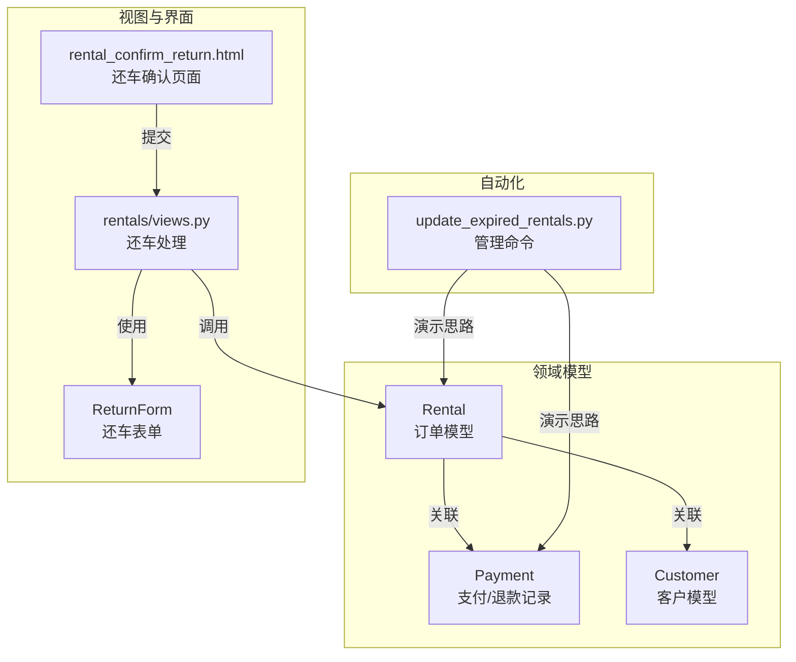
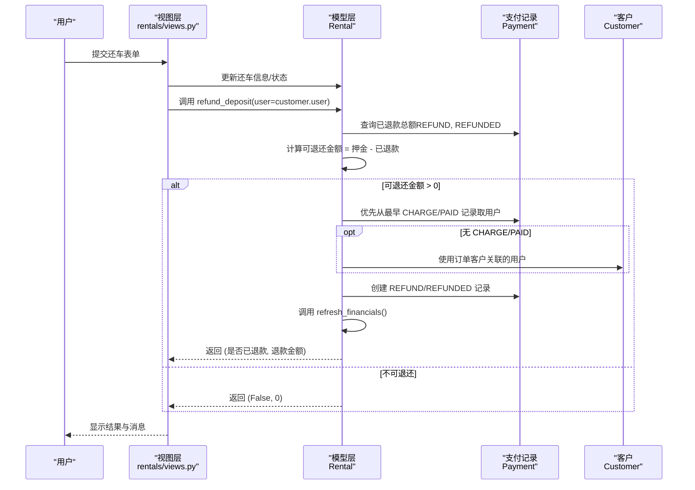
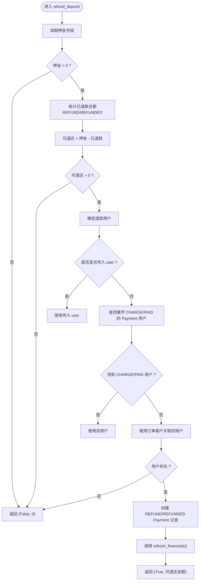
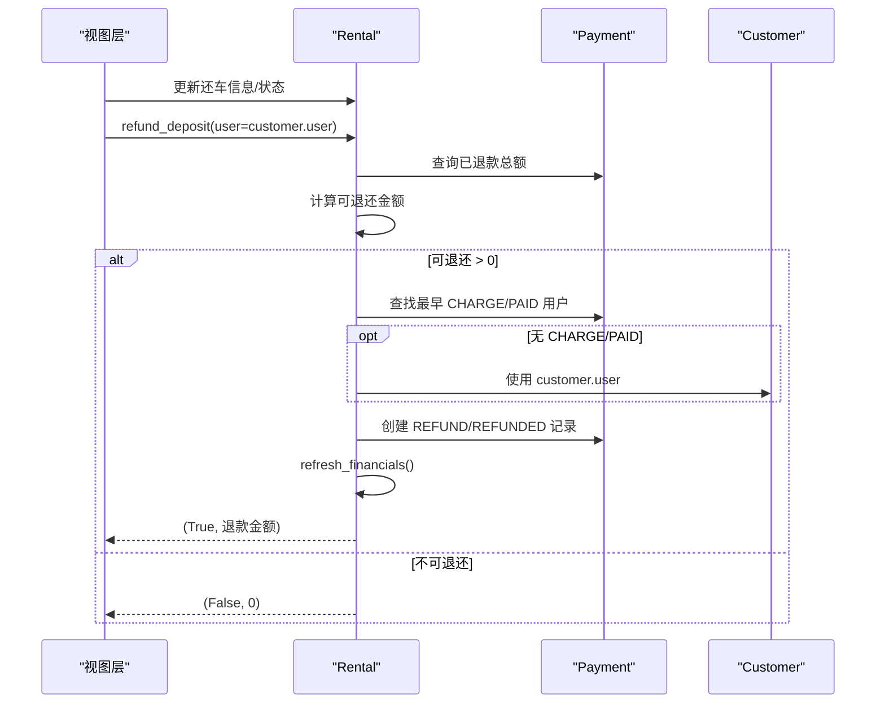
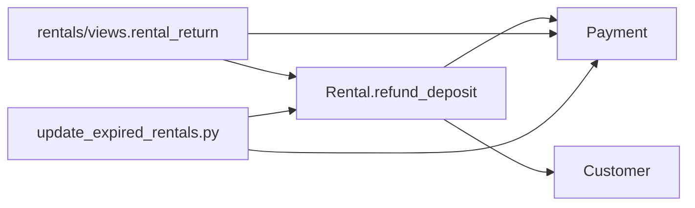

# 押金退还流程

<cite>
**本文引用的文件**
- [rentals/models.py](file://code/car_rental_system/rentals/models.py)
- [accounts/models.py](file://code/car_rental_system/accounts/models.py)
- [rentals/views.py](file://code/car_rental_system/rentals/views.py)
- [customers/models.py](file://code/car_rental_system/customers/models.py)
- [rentals/forms.py](file://code/car_rental_system/rentals/forms.py)
- [templates/rentals/rental_confirm_return.html](file://code/car_rental_system/templates/rentals/rental_confirm_return.html)
- [accounts/migrations/0002_payment_extra_fields.py](file://code/car_rental_system/accounts/migrations/0002_payment_extra_fields.py)
- [rentals/management/commands/update_expired_rentals.py](file://code/car_rental_system/rentals/management/commands/update_expired_rentals.py)
</cite>

## 目录
1. [简介](#简介)
2. [项目结构](#项目结构)
3. [核心组件](#核心组件)
4. [架构总览](#架构总览)
5. [详细组件分析](#详细组件分析)
6. [依赖分析](#依赖分析)
7. [性能考量](#性能考量)
8. [故障排查指南](#故障排查指南)
9. [结论](#结论)
10. [附录](#附录)

## 简介
本文围绕 Rental 模型中的 refund_deposit 方法展开，系统性阐述其“可退还押金金额”的计算逻辑、“退款用户”确定优先级策略、“退款记录创建过程”、以及“退款完成后刷新订单财务状态”的必要性。同时给出在还车流程中的触发时机与自动化特性说明，并提供调用示例路径与返回值的业务含义解读。

## 项目结构
围绕押金退还流程涉及的关键模块如下：
- 租赁订单模型：Rental（负责押金字段、状态、财务汇总等）
- 支付记录模型：Payment（负责 CHARGE/REFUND 交易类型、状态、用户、金额等）
- 客户模型：Customer（与 Django 用户关联，作为退款回退来源）
- 视图层：rentals/views.py（还车流程中调用 refund_deposit）
- 表单与模板：ReturnForm、rental_confirm_return.html（还车界面与交互）
- 管理命令：update_expired_rentals.py（演示自动退押金的实现思路）

图表来源
- [rentals/models.py](file://code/car_rental_system/rentals/models.py#L12-L160)
- [accounts/models.py](file://code/car_rental_system/accounts/models.py#L147-L248)
- [customers/models.py](file://code/car_rental_system/customers/models.py#L1-L40)
- [rentals/views.py](file://code/car_rental_system/rentals/views.py#L279-L392)
- [rentals/forms.py](file://code/car_rental_system/rentals/forms.py#L312-L351)
- [templates/rentals/rental_confirm_return.html](file://code/car_rental_system/templates/rentals/rental_confirm_return.html#L150-L216)
- [rentals/management/commands/update_expired_rentals.py](file://code/car_rental_system/rentals/management/commands/update_expired_rentals.py#L144-L191)

章节来源
- [rentals/models.py](file://code/car_rental_system/rentals/models.py#L12-L160)
- [accounts/models.py](file://code/car_rental_system/accounts/models.py#L147-L248)
- [customers/models.py](file://code/car_rental_system/customers/models.py#L1-L40)
- [rentals/views.py](file://code/car_rental_system/rentals/views.py#L279-L392)
- [rentals/forms.py](file://code/car_rental_system/rentals/forms.py#L312-L351)
- [templates/rentals/rental_confirm_return.html](file://code/car_rental_system/templates/rentals/rental_confirm_return.html#L150-L216)
- [rentals/management/commands/update_expired_rentals.py](file://code/car_rental_system/rentals/management/commands/update_expired_rentals.py#L144-L191)

## 核心组件
- Rental.refund_deposit：计算可退还押金、确定退款用户、创建 REFUND 支付记录、刷新财务状态
- Payment：存储 CHARGE/REFUND 交易、状态、用户、金额、描述、交易号等
- Customer：与 Django User 关联，作为退款用户的回退来源
- rentals/views.rental_return：还车流程入口，调用 refund_deposit 并刷新财务
- ReturnForm/rental_confirm_return.html：还车表单与页面，驱动还车流程

章节来源
- [rentals/models.py](file://code/car_rental_system/rentals/models.py#L296-L394)
- [accounts/models.py](file://code/car_rental_system/accounts/models.py#L147-L248)
- [customers/models.py](file://code/car_rental_system/customers/models.py#L1-L40)
- [rentals/views.py](file://code/car_rental_system/rentals/views.py#L279-L392)
- [rentals/forms.py](file://code/car_rental_system/rentals/forms.py#L312-L351)
- [templates/rentals/rental_confirm_return.html](file://code/car_rental_system/templates/rentals/rental_confirm_return.html#L150-L216)

## 架构总览
还车流程中，系统在完成还车信息登记、费用计算与状态变更后，自动尝试退还押金。refund_deposit 方法负责：
- 计算可退还金额：押金 - 已通过 Payment 记录退还的总额
- 确定退款用户：优先使用该订单下最早成功支付记录（CHARGE, PAID）关联的用户；若无支付记录，则回退至订单客户（customer）关联的 Django 用户
- 创建退款记录：生成 transaction_type='REFUND'、status='REFUNDED' 的 Payment 对象，填充描述、交易号、时间等字段
- 同步财务：调用 refresh_financials 刷新累计支付/退款与结算状态

图表来源
- [rentals/views.py](file://code/car_rental_system/rentals/views.py#L347-L380)
- [rentals/models.py](file://code/car_rental_system/rentals/models.py#L334-L394)
- [accounts/models.py](file://code/car_rental_system/accounts/models.py#L147-L248)
- [customers/models.py](file://code/car_rental_system/customers/models.py#L1-L40)

## 详细组件分析

### Rental.refund_deposit 方法详解
- 可退还金额计算
  - 从 Rental.deposit 字段获取押金
  - 通过 Payment 中 status='REFUNDED' 且 transaction_type='REFUND' 的记录求和，得到已退款总额
  - 可退还金额 = 押金 - 已退款总额；若小于等于 0，则直接返回 (False, 0)
- 退款用户确定优先级
  - 若显式传入 user，则直接使用
  - 否则优先使用该订单下最早一条 status='PAID' 且 transaction_type='CHARGE' 的 Payment 记录所关联的用户
  - 若无支付记录，则回退到 Rental.customer.user
  - 若仍无用户，返回 (False, 0)
- 退款记录创建
  - 生成 Payment 对象，字段要点：
    - rental=Rental
    - user=上述确定的用户
    - amount=可退还金额
    - payment_method='BANK'
    - transaction_type='REFUND'
    - status='REFUNDED'
    - description='订单完成，押金自动退还'
    - paid_at=当前时间
    - transaction_id='REF' + 当前时间戳（秒）
- 刷新财务状态
  - 调用 Rental.refresh_financials()，重新统计累计支付/退款并更新结算状态

图表来源
- [rentals/models.py](file://code/car_rental_system/rentals/models.py#L334-L394)

章节来源
- [rentals/models.py](file://code/car_rental_system/rentals/models.py#L334-L394)

### 退款记录字段与约束
- 交易类型与状态
  - transaction_type：'CHARGE' 或 'REFUND'
  - status：'PENDING'、'PAID'、'FAILED'、'REFUNDED'
- 关键字段
  - rental：外键指向 Rental
  - user：外键指向 Django User
  - amount：退款金额
  - payment_method：退款方式（示例为 'BANK'）
  - description：退款说明
  - transaction_id：交易号（命名规则：'REF' + 秒级时间戳）
  - paid_at：退款发生时间
- 索引与约束
  - 交易类型索引便于快速筛选 REFUND/CHARGE
  - 金额最小值约束确保退款金额为正

章节来源
- [accounts/models.py](file://code/car_rental_system/accounts/models.py#L147-L248)
- [accounts/migrations/0002_payment_extra_fields.py](file://code/car_rental_system/accounts/migrations/0002_payment_extra_fields.py#L1-L42)

### 还车流程中的触发与自动化
- 触发时机
  - 在 rentals/views.rental_return 中完成还车登记、状态变更、费用计算后，调用 Rental.refund_deposit(user=customer.user)，随后调用 refresh_financials()
- 自动化特性
  - 系统自动计算可退还金额、优先从最早支付记录取用户、创建 REFUND 记录并刷新财务
  - 管理命令 update_expired_rentals.py 展示了“订单完成后自动结算押金/退押金”的思路（与 refund_deposit 一致的逻辑）

图表来源
- [rentals/views.py](file://code/car_rental_system/rentals/views.py#L347-L380)
- [rentals/models.py](file://code/car_rental_system/rentals/models.py#L334-L394)
- [customers/models.py](file://code/car_rental_system/customers/models.py#L1-L40)

章节来源
- [rentals/views.py](file://code/car_rental_system/rentals/views.py#L279-L392)
- [rentals/management/commands/update_expired_rentals.py](file://code/car_rental_system/rentals/management/commands/update_expired_rentals.py#L144-L191)

### 用户界面与交互
- 还车确认页面提供实际还车日期与还车门店输入，支持费用预览
- 提交后触发还车处理，系统自动完成还车登记、费用计算、状态变更与押金退还

章节来源
- [templates/rentals/rental_confirm_return.html](file://code/car_rental_system/templates/rentals/rental_confirm_return.html#L150-L216)
- [rentals/forms.py](file://code/car_rental_system/rentals/forms.py#L312-L351)

## 依赖分析
- 模块耦合
  - Rental.refund_deposit 依赖 Payment（统计已退款总额）、Customer（回退用户）、Django 时间与时区工具
  - 视图层 rentals/views.rental_return 依赖 Rental.refund_deposit 与 Payment.refresh_financials
- 外部依赖
  - Django ORM、Decimal 数值运算、timezone 时间处理
- 循环依赖规避
  - 在方法内部延迟导入 accounts.models.Payment，避免循环导入

图表来源
- [rentals/models.py](file://code/car_rental_system/rentals/models.py#L296-L394)
- [accounts/models.py](file://code/car_rental_system/accounts/models.py#L147-L248)
- [rentals/views.py](file://code/car_rental_system/rentals/views.py#L279-L392)
- [rentals/management/commands/update_expired_rentals.py](file://code/car_rental_system/rentals/management/commands/update_expired_rentals.py#L144-L191)

章节来源
- [rentals/models.py](file://code/car_rental_system/rentals/models.py#L296-L394)
- [accounts/models.py](file://code/car_rental_system/accounts/models.py#L147-L248)
- [rentals/views.py](file://code/car_rental_system/rentals/views.py#L279-L392)
- [rentals/management/commands/update_expired_rentals.py](file://code/car_rental_system/rentals/management/commands/update_expired_rentals.py#L144-L191)

## 性能考量
- 查询优化
  - 使用聚合 Sum('amount') 统计已退款总额，避免逐条遍历
  - 使用 order_by('created_at').first() 快速定位最早支付记录
- 原子性
  - 在还车处理中使用事务包裹，确保还车信息、状态变更与退款记录的一致性
- 缓存与批量操作
  - 系统在其他场景使用缓存减少重复计算，但 refund_deposit 本身为即时计算

章节来源
- [rentals/models.py](file://code/car_rental_system/rentals/models.py#L296-L394)
- [rentals/views.py](file://code/car_rental_system/rentals/views.py#L301-L380)

## 故障排查指南
- 无法确定退款用户
  - 检查是否存在 CHARGE/PAID 的 Payment 记录；若无，确认 Rental.customer.user 是否存在
- 退款金额为 0
  - 押金为 0 或已全部退款；核对 Payment 中 REFUND/REFUNDED 记录
- 退款记录未创建
  - 确认调用链是否正确：rental_return → refund_deposit → Payment.create
  - 检查 transaction_type、status、amount、user 等字段是否完整
- 财务状态未更新
  - 确认是否调用了 refresh_financials；检查订单结算状态与累计支付/退款字段

章节来源
- [rentals/models.py](file://code/car_rental_system/rentals/models.py#L334-L394)
- [accounts/models.py](file://code/car_rental_system/accounts/models.py#L147-L248)
- [rentals/views.py](file://code/car_rental_system/rentals/views.py#L347-L380)

## 结论
Rental.refund_deposit 方法通过严谨的“可退还金额计算 + 优先级用户确定 + 标准化退款记录创建 + 财务状态刷新”，在还车流程中实现了自动化押金退还。其设计兼顾了业务准确性与系统健壮性，配合视图层与管理命令的协同，确保了用户体验与账务一致性。

## 附录

### 调用示例与返回值语义
- 调用位置
  - 还车处理：[rentals/views.py](file://code/car_rental_system/rentals/views.py#L347-L380)
  - 管理命令演示：[rentals/management/commands/update_expired_rentals.py](file://code/car_rental_system/rentals/management/commands/update_expired_rentals.py#L144-L191)
- 返回值语义
  - (True, 退款金额)：已成功生成退款记录，退款金额为实际退还金额
  - (False, 0)：无可退还金额或无法确定退款用户，未生成退款记录

章节来源
- [rentals/views.py](file://code/car_rental_system/rentals/views.py#L347-L380)
- [rentals/management/commands/update_expired_rentals.py](file://code/car_rental_system/rentals/management/commands/update_expired_rentals.py#L144-L191)