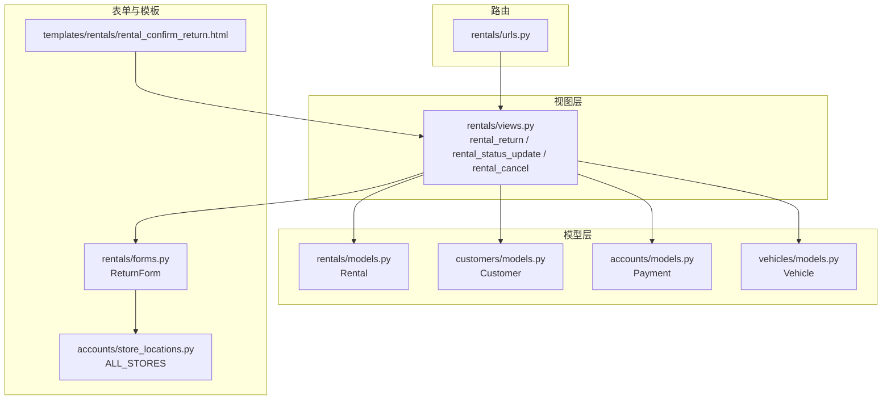
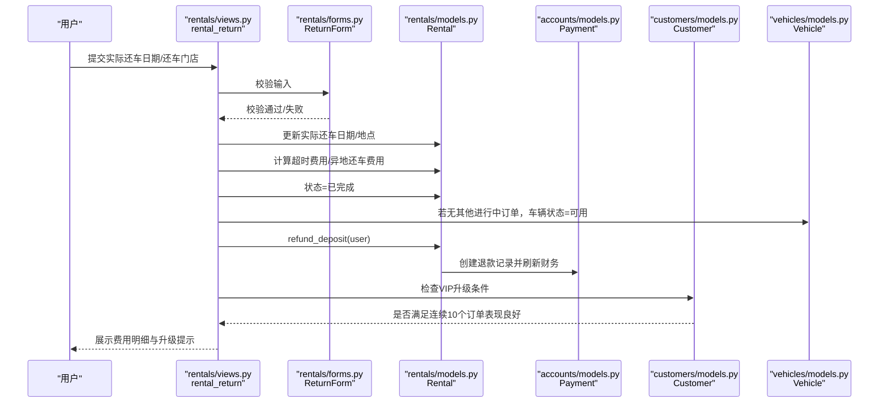
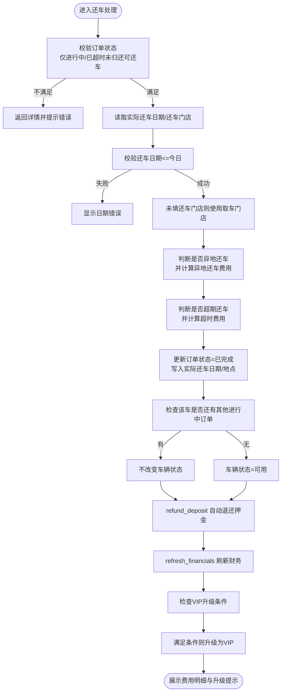
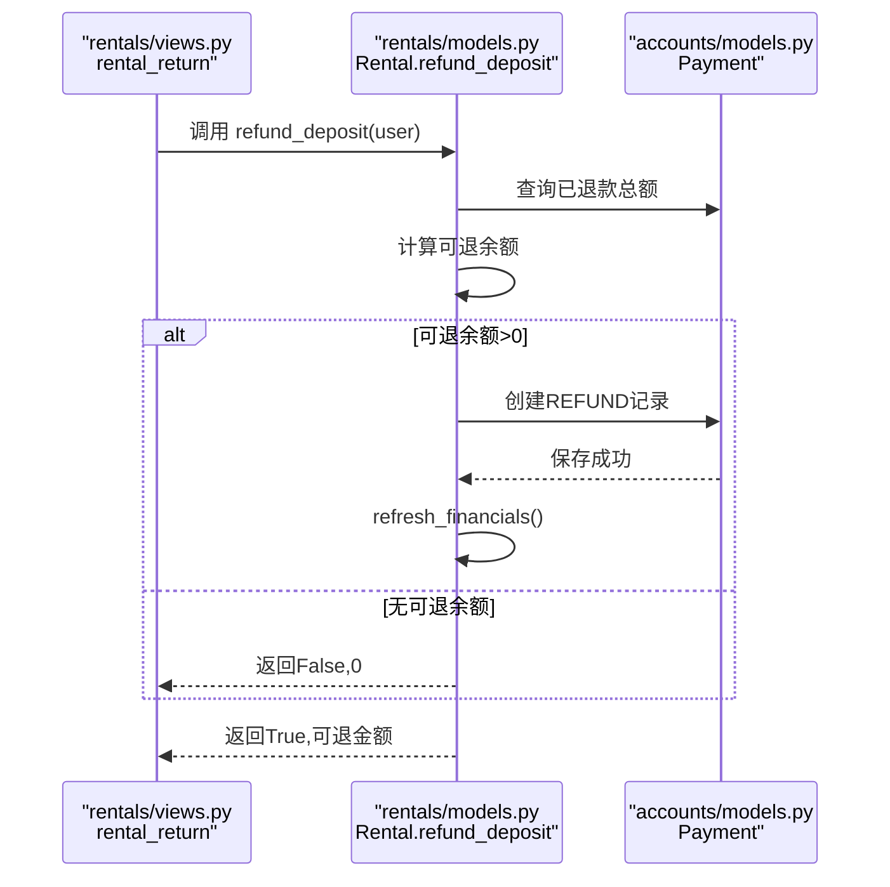
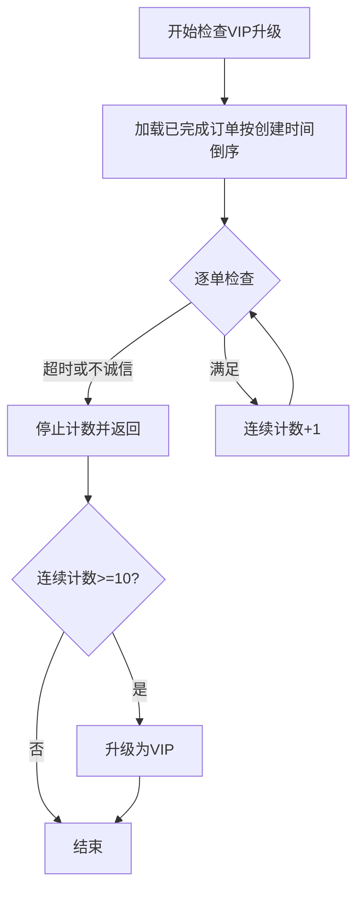
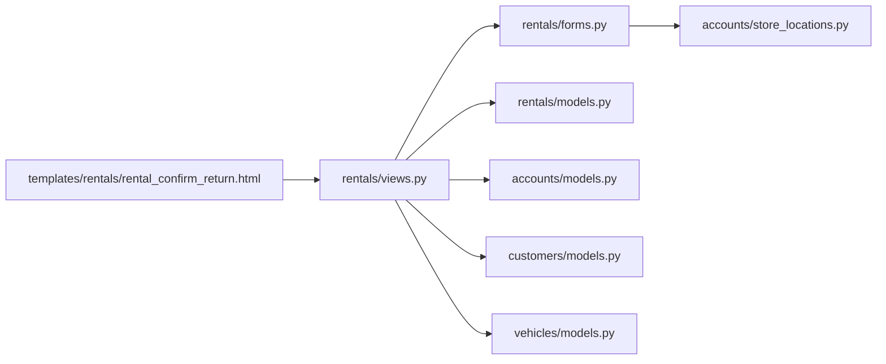

# 订单完成与还车处理

<cite>
**本文引用的文件**
- [views.py](file://code/car_rental_system/rentals/views.py)
- [models.py](file://code/car_rental_system/rentals/models.py)
- [forms.py](file://code/car_rental_system/rentals/forms.py)
- [urls.py](file://code/car_rental_system/rentals/urls.py)
- [store_locations.py](file://code/car_rental_system/accounts/store_locations.py)
- [models.py](file://code/car_rental_system/accounts/models.py)
- [models.py](file://code/car_rental_system/customers/models.py)
- [models.py](file://code/car_rental_system/vehicles/models.py)
- [rental_confirm_return.html](file://code/car_rental_system/templates/rentals/rental_confirm_return.html)
- [0004_add_return_location_fields.py](file://code/car_rental_system/rentals/migrations/0004_add_return_location_fields.py)
</cite>

## 目录
1. [简介](#简介)
2. [项目结构](#项目结构)
3. [核心组件](#核心组件)
4. [架构总览](#架构总览)
5. [详细组件分析](#详细组件分析)
6. [依赖关系分析](#依赖关系分析)
7. [性能考量](#性能考量)
8. [故障排查指南](#故障排查指南)
9. [结论](#结论)

## 简介
本文件面向“订单完成与还车处理”的完整业务闭环，聚焦以下目标：
- 解析 rental_return 视图函数如何接收并处理实际还车日期与还车地点，并据此计算超时费用与异地还车费用；
- 说明订单状态从“进行中/已超时未归还”变为“已完成”后，车辆状态自动恢复为“可用”的业务逻辑；
- 描述通过 refund_deposit 方法自动退还押金的实现机制；
- 解释 VIP 会员自动升级的触发条件与执行流程，包括连续订单表现的检查逻辑；
- 提供还车处理流程图与异常处理策略，帮助一线运营与开发快速定位问题。

## 项目结构
围绕还车与订单完成，涉及的核心模块与文件如下：
- 视图层：rentals/views.py 中的 rental_return、rental_status_update、rental_cancel 等；
- 模型层：rentals/models.py 中的 Rental；accounts/models.py 中的 Payment；customers/models.py 中的 Customer；vehicles/models.py 中的 Vehicle；
- 表单层：rentals/forms.py 中的 ReturnForm；
- URL 映射：rentals/urls.py；
- 模板：templates/rentals/rental_confirm_return.html；
- 迁移：rentals/migrations/0004_add_return_location_fields.py；
- 门店常量：accounts/store_locations.py。

图表来源
- [views.py](file://code/car_rental_system/rentals/views.py#L279-L392)
- [models.py](file://code/car_rental_system/rentals/models.py#L1-L160)
- [models.py](file://code/car_rental_system/customers/models.py#L1-L160)
- [models.py](file://code/car_rental_system/accounts/models.py#L147-L236)
- [models.py](file://code/car_rental_system/vehicles/models.py#L1-L85)
- [forms.py](file://code/car_rental_system/rentals/forms.py#L312-L364)
- [store_locations.py](file://code/car_rental_system/accounts/store_locations.py#L1-L79)
- [urls.py](file://code/car_rental_system/rentals/urls.py#L1-L22)
- [rental_confirm_return.html](file://code/car_rental_system/templates/rentals/rental_confirm_return.html#L1-L231)

章节来源
- [views.py](file://code/car_rental_system/rentals/views.py#L1-L120)
- [urls.py](file://code/car_rental_system/rentals/urls.py#L1-L22)

## 核心组件
- rental_return 视图：负责还车确认、费用计算、状态变更、车辆状态恢复、押金退还与 VIP 升级检查；
- Rental 模型：维护订单状态、实际还车日期/地点、超时费用、异地还车费用、押金、结算状态等；
- ReturnForm 表单：校验实际还车日期与还车门店；
- Payment 模型：记录支付与退款流水，支持 refund_deposit；
- Customer 模型：提供 check_vip_upgrade_eligibility 与 upgrade_to_vip；
- Vehicle 模型：维护车辆状态，配合订单完成自动恢复为“可用”。

章节来源
- [views.py](file://code/car_rental_system/rentals/views.py#L279-L392)
- [models.py](file://code/car_rental_system/rentals/models.py#L1-L160)
- [models.py](file://code/car_rental_system/accounts/models.py#L147-L236)
- [models.py](file://code/car_rental_system/customers/models.py#L101-L160)
- [models.py](file://code/car_rental_system/vehicles/models.py#L1-L85)
- [forms.py](file://code/car_rental_system/rentals/forms.py#L312-L364)

## 架构总览
还车处理的端到端流程由视图层协调模型层与表单层完成，核心路径如下：
- 用户进入还车页面，提交实际还车日期与还车门店；
- 视图层校验状态与输入，计算超时费用与异地还车费用；
- 更新订单状态为“已完成”，车辆状态恢复为“可用”；
- 自动退还押金（若存在未退部分）；
- 刷新财务信息并检查 VIP 升级条件；
- 渲染结果并提示用户。

图表来源
- [views.py](file://code/car_rental_system/rentals/views.py#L279-L392)
- [forms.py](file://code/car_rental_system/rentals/forms.py#L312-L364)
- [models.py](file://code/car_rental_system/rentals/models.py#L286-L394)
- [models.py](file://code/car_rental_system/accounts/models.py#L147-L236)
- [models.py](file://code/car_rental_system/customers/models.py#L101-L160)
- [models.py](file://code/car_rental_system/vehicles/models.py#L1-L85)

## 详细组件分析

### 1) rental_return 视图：还车确认与费用计算
- 状态前置校验：仅“进行中/已超时未归还”的订单允许还车；
- 输入处理：
  - 实际还车日期：校验不得晚于当天；
  - 实际还车门店：若未填写，默认使用取车门店；
- 费用计算：
  - 异地还车费用：若租车时未勾选异地还车但实际异地还车，按日租金的一定比例追加费用；
  - 超时还车费用：若实际还车日期晚于结束日期，按日租金乘以超期天数计算；
- 状态与资产：
  - 订单状态更新为“已完成”；
  - 若该车辆无其他进行中的订单，车辆状态恢复为“可用”；
- 财务与会员：
  - refund_deposit 自动退还押金（若有未退部分）；
  - refresh_financials 刷新累计支付/退款与结算状态；
  - 检查 VIP 升级条件并执行升级。

图表来源
- [views.py](file://code/car_rental_system/rentals/views.py#L279-L392)
- [models.py](file://code/car_rental_system/rentals/models.py#L286-L394)
- [models.py](file://code/car_rental_system/customers/models.py#L101-L160)

章节来源
- [views.py](file://code/car_rental_system/rentals/views.py#L279-L392)
- [forms.py](file://code/car_rental_system/rentals/forms.py#L312-L364)
- [rental_confirm_return.html](file://code/car_rental_system/templates/rentals/rental_confirm_return.html#L148-L231)

### 2) rental_return 视图函数的输入与计算细节
- 实际还车日期与还车地点的输入与默认值：
  - ReturnForm 对实际还车日期进行“不得晚于今天”的校验；
  - 若未填写还车门店，默认使用取车门店；
- 异地还车费用的判定与计算：
  - 当实际还车门店与取车门店不一致，且订单未勾选“异地还车”，则追加异地还车费用；
  - 费用按日租金的一定比例计算（默认为日租金的50%，可在业务规则中调整）；
- 超时还车费用的判定与计算：
  - 当实际还车日期晚于结束日期，按日租金乘以超期天数计算；
- 订单状态与车辆状态：
  - 订单完成后，若该车无其他进行中订单，车辆状态恢复为“可用”；
- 押金退还：
  - refund_deposit 仅对“仍有可退余额”的订单执行退款；
  - 退款用户优先取支付记录中的用户，其次取客户关联用户；
- VIP 升级：
  - 满足“连续10个已完成订单均无超时且异地还车行为与约定一致”的条件，自动升级为 VIP。

章节来源
- [views.py](file://code/car_rental_system/rentals/views.py#L279-L392)
- [models.py](file://code/car_rental_system/rentals/models.py#L286-L394)
- [models.py](file://code/car_rental_system/customers/models.py#L101-L160)
- [store_locations.py](file://code/car_rental_system/accounts/store_locations.py#L1-L79)

### 3) 订单状态变更与车辆状态恢复
- 状态变更：
  - rental_status_update：支持从“预订中/进行中”到“已完成”，或从“预订中/进行中/已完成”到“已取消”；
  - rental_return：直接将状态设为“已完成”；
- 车辆状态恢复：
  - 若某车辆在本次还车后无其他进行中的订单，则将其状态恢复为“可用”；
  - 若订单被取消，且车辆处于“已租”状态，同样恢复为“可用”。

章节来源
- [views.py](file://code/car_rental_system/rentals/views.py#L234-L276)
- [views.py](file://code/car_rental_system/rentals/views.py#L279-L392)

### 4) 押金自动退还机制（refund_deposit）
- 业务目标：在订单完成后，自动退还尚未退还的押金；
- 关键逻辑：
  - 计算可退余额 = 押金金额 - 已退款金额；
  - 若可退余额大于零，创建一条“REFUND”类型的支付记录；
  - 退款用户优先取支付记录中的用户，其次取客户关联用户；
  - 退款后刷新财务信息，更新结算状态与结算时间。

图表来源
- [views.py](file://code/car_rental_system/rentals/views.py#L347-L356)
- [models.py](file://code/car_rental_system/rentals/models.py#L334-L394)
- [models.py](file://code/car_rental_system/accounts/models.py#L147-L236)

章节来源
- [models.py](file://code/car_rental_system/rentals/models.py#L334-L394)
- [models.py](file://code/car_rental_system/accounts/models.py#L147-L236)

### 5) VIP 会员自动升级流程
- 触发条件：
  - 客户当前非 VIP；
  - 连续10个已完成订单满足：
    - 无超时归还（overdue_fee==0）；
    - 异地还车行为与约定一致（若勾选异地还车则实际异地还车，若未勾选则实际未异地还车）。
- 执行流程：
  - check_vip_upgrade_eligibility 从最近订单开始向前遍历，遇不满足即停止计数；
  - 若连续计数≥10，调用 upgrade_to_vip 将客户等级提升为 VIP。

图表来源
- [models.py](file://code/car_rental_system/customers/models.py#L101-L160)

章节来源
- [models.py](file://code/car_rental_system/customers/models.py#L101-L160)
- [views.py](file://code/car_rental_system/rentals/views.py#L357-L364)

### 6) 页面与前端交互要点
- 模板 rental_confirm_return.html：
  - 默认还车门店为取车门店；
  - 前端实时计算基础费用、VIP折扣、超时费用与异地还车费用；
  - 提示“还车后车辆状态更新为可用”、“订单完成后才标记为已完成”等关键信息。

章节来源
- [rental_confirm_return.html](file://code/car_rental_system/templates/rentals/rental_confirm_return.html#L148-L231)

## 依赖关系分析
- 视图层依赖：
  - ReturnForm 校验输入；
  - Rental.save 与 auto_update_status 控制订单状态与金额；
  - Payment.refresh_financials 与 refund_deposit 管理财务；
  - Customer.check_vip_upgrade_eligibility 与 upgrade_to_vip 管理会员等级；
  - Vehicle.status 与 Rental 之间的状态联动。
- 模板依赖：
  - ALL_STORES 提供还车门店选项；
  - 前端脚本根据取车/还车门店差异与超期天数动态计算费用。

图表来源
- [views.py](file://code/car_rental_system/rentals/views.py#L279-L392)
- [forms.py](file://code/car_rental_system/rentals/forms.py#L312-L364)
- [models.py](file://code/car_rental_system/rentals/models.py#L1-L160)
- [models.py](file://code/car_rental_system/accounts/models.py#L147-L236)
- [models.py](file://code/car_rental_system/customers/models.py#L101-L160)
- [models.py](file://code/car_rental_system/vehicles/models.py#L1-L85)
- [store_locations.py](file://code/car_rental_system/accounts/store_locations.py#L1-L79)
- [rental_confirm_return.html](file://code/car_rental_system/templates/rentals/rental_confirm_return.html#L148-L231)

章节来源
- [urls.py](file://code/car_rental_system/rentals/urls.py#L1-L22)
- [store_locations.py](file://code/car_rental_system/accounts/store_locations.py#L1-L79)

## 性能考量
- 自动状态更新缓存：Rental.auto_update_status 使用缓存避免频繁更新（每5分钟最多更新一次），减少数据库压力；
- 财务刷新：refresh_financials 仅在还车后调用，避免重复扫描支付记录；
- 前端费用预览：模板中使用 jQuery 动态计算费用，减少不必要的后端请求；
- 查询优化：列表页与详情页使用 select_related 与分页，降低查询成本。

章节来源
- [models.py](file://code/car_rental_system/rentals/models.py#L171-L229)
- [views.py](file://code/car_rental_system/rentals/views.py#L1-L120)

## 故障排查指南
- 还车日期错误
  - 症状：提交还车日期晚于当天；
  - 处理：ReturnForm.clean_actual_return_date 会报错，修正日期后重试。
- 状态不可还车
  - 症状：提示“只有进行中或已超时未归还的订单才能办理还车”；
  - 处理：确认订单状态是否正确，必要时通过状态更新接口调整。
- 异地还车费用争议
  - 症状：系统自动追加异地还车费用；
  - 处理：检查订单是否勾选“异地还车”，以及实际还车门店与取车门店是否一致。
- 押金未退还
  - 症状：订单已完成但未看到退款记录；
  - 处理：确认是否存在已退款金额，核对退款用户来源（支付记录或客户关联用户）。
- VIP 升级未生效
  - 症状：连续10个订单表现良好但未升级；
  - 处理：检查是否存在超时或异地还车不一致的订单，导致计数中断。

章节来源
- [forms.py](file://code/car_rental_system/rentals/forms.py#L334-L364)
- [views.py](file://code/car_rental_system/rentals/views.py#L279-L392)
- [models.py](file://code/car_rental_system/rentals/models.py#L334-L394)
- [models.py](file://code/car_rental_system/customers/models.py#L101-L160)

## 结论
本流程以 rental_return 为核心，串联还车确认、费用计算、状态变更、资产恢复与财务结算，形成闭环。通过 ReturnForm 的严格校验、Rental 的自动状态更新与财务刷新、Customer 的 VIP 升级检查，以及 Vehicle 的状态联动，系统实现了高效、可靠且可追溯的还车与订单完成机制。建议在生产环境中持续监控自动状态更新与 VIP 升级的执行情况，并根据业务规则灵活调整异地还车费用与超时费用的计算策略。