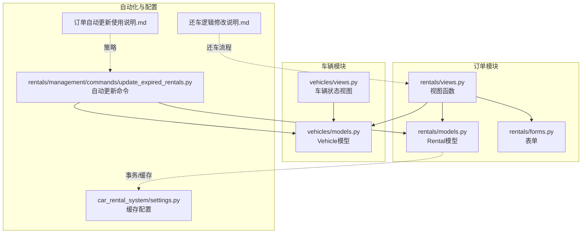
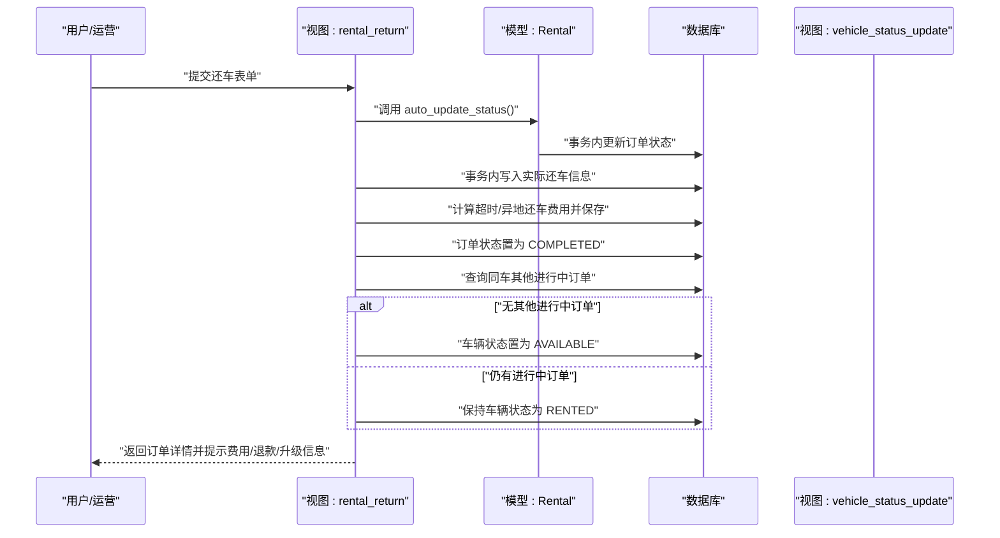
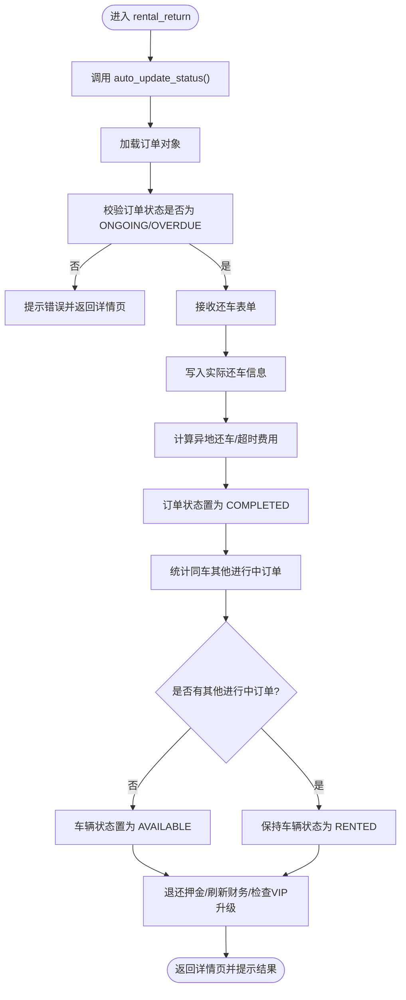
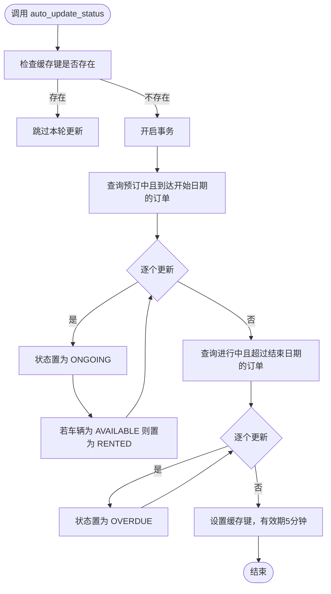
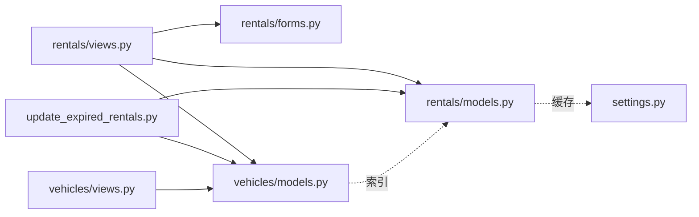

# 订单状态与车辆状态更新

<cite>
**本文引用的文件**
- [rentals/models.py](file://code/car_rental_system/rentals/models.py)
- [rentals/views.py](file://code/car_rental_system/rentals/views.py)
- [rentals/forms.py](file://code/car_rental_system/rentals/forms.py)
- [vehicles/models.py](file://code/car_rental_system/vehicles/models.py)
- [vehicles/views.py](file://code/car_rental_system/vehicles/views.py)
- [rentals/management/commands/update_expired_rentals.py](file://code/car_rental_system/rentals/management/commands/update_expired_rentals.py)
- [订单自动更新使用说明.md](file://code/car_rental_system/订单自动更新使用说明.md)
- [还车逻辑修改说明.md](file://code/car_rental_system/还车逻辑修改说明.md)
- [car_rental_system/settings.py](file://code/car_rental_system/car_rental_system/settings.py)
</cite>

## 目录
1. [简介](#简介)
2. [项目结构](#项目结构)
3. [核心组件](#核心组件)
4. [架构总览](#架构总览)
5. [详细组件分析](#详细组件分析)
6. [依赖关系分析](#依赖关系分析)
7. [性能考量](#性能考量)
8. [故障排查指南](#故障排查指南)
9. [结论](#结论)

## 简介
本文件围绕“订单状态变更为‘已完成’后的一系列状态更新操作”展开，重点说明：
- rental_return 视图如何将订单状态设置为“COMPLETED”，并检查该车辆是否还有其他进行中的订单；若无则将车辆状态恢复为“AVAILABLE”的业务逻辑；
- auto_update_status 类方法如何在系统层面自动更新订单状态（预订中→进行中→已超时未归还），以及其基于缓存的执行频率控制（每5分钟最多执行一次）；
- 状态变更过程中的事务管理，确保订单和车辆状态的一致性更新。

## 项目结构
本项目采用分层与功能模块化组织，涉及订单、车辆、账户等子应用。与本次主题直接相关的关键文件如下：
- 订单模型与视图：rentals/models.py、rentals/views.py、rentals/forms.py
- 车辆模型与视图：vehicles/models.py、vehicles/views.py
- 自动更新命令：rentals/management/commands/update_expired_rentals.py
- 自动更新说明与策略：订单自动更新使用说明.md、还车逻辑修改说明.md
- 缓存与性能配置：car_rental_system/settings.py

图表来源
- [rentals/models.py](file://code/car_rental_system/rentals/models.py#L1-L200)
- [rentals/views.py](file://code/car_rental_system/rentals/views.py#L234-L392)
- [vehicles/models.py](file://code/car_rental_system/vehicles/models.py#L1-L85)
- [vehicles/views.py](file://code/car_rental_system/vehicles/views.py#L289-L322)
- [rentals/management/commands/update_expired_rentals.py](file://code/car_rental_system/rentals/management/commands/update_expired_rentals.py#L1-L191)
- [订单自动更新使用说明.md](file://code/car_rental_system/订单自动更新使用说明.md#L71-L129)
- [还车逻辑修改说明.md](file://code/car_rental_system/还车逻辑修改说明.md#L62-L104)
- [car_rental_system/settings.py](file://code/car_rental_system/car_rental_system/settings.py#L139-L178)

章节来源
- [rentals/models.py](file://code/car_rental_system/rentals/models.py#L1-L200)
- [rentals/views.py](file://code/car_rental_system/rentals/views.py#L234-L392)
- [vehicles/models.py](file://code/car_rental_system/vehicles/models.py#L1-L85)
- [vehicles/views.py](file://code/car_rental_system/vehicles/views.py#L289-L322)
- [rentals/management/commands/update_expired_rentals.py](file://code/car_rental_system/rentals/management/commands/update_expired_rentals.py#L1-L191)
- [订单自动更新使用说明.md](file://code/car_rental_system/订单自动更新使用说明.md#L71-L129)
- [还车逻辑修改说明.md](file://code/car_rental_system/还车逻辑修改说明.md#L62-L104)
- [car_rental_system/settings.py](file://code/car_rental_system/car_rental_system/settings.py#L139-L178)

## 核心组件
- 订单模型（Rental）：定义订单状态枚举、自动状态更新方法、财务刷新与押金退还等。
- 订单视图（rental_return）：处理还车流程，设置订单为“已完成”，并按需将车辆置为“可用”。
- 订单视图（rental_status_update）：管理员/运营人员手动更新订单状态，并联动车辆状态。
- 车辆模型（Vehicle）：定义车辆状态枚举及索引。
- 车辆视图（vehicle_status_update）：限制将“已租”车辆置为“可用”的前置条件。
- 自动更新命令（update_expired_rentals）：定时任务，批量激活“预订中→进行中”，并标记“已超时未归还”。

章节来源
- [rentals/models.py](file://code/car_rental_system/rentals/models.py#L1-L200)
- [rentals/views.py](file://code/car_rental_system/rentals/views.py#L234-L392)
- [vehicles/models.py](file://code/car_rental_system/vehicles/models.py#L1-L85)
- [vehicles/views.py](file://code/car_rental_system/vehicles/views.py#L289-L322)
- [rentals/management/commands/update_expired_rentals.py](file://code/car_rental_system/rentals/management/commands/update_expired_rentals.py#L1-L191)

## 架构总览
下面的序列图展示了“还车→订单完成→车辆状态联动”的端到端流程，包括自动状态更新与人工干预路径。

图表来源
- [rentals/views.py](file://code/car_rental_system/rentals/views.py#L279-L392)
- [rentals/models.py](file://code/car_rental_system/rentals/models.py#L171-L229)

章节来源
- [rentals/views.py](file://code/car_rental_system/rentals/views.py#L279-L392)
- [rentals/models.py](file://code/car_rental_system/rentals/models.py#L171-L229)

## 详细组件分析

### 1) rental_return 视图：订单完成与车辆状态联动
- 自动状态更新：在还车前调用模型的自动状态更新方法，确保“预订中→进行中”“进行中→已超时未归还”的状态是最新的。
- 还车校验：仅允许“进行中/已超时未归还”的订单执行还车。
- 实际还车信息：写入实际还车日期与还车门店（默认取车门店）。
- 费用计算：异地还车费用与超时费用按日租金计算并保存。
- 订单完成：将订单状态置为“已完成”。
- 车辆状态联动：统计该车辆的其他“进行中”订单数量，若为0则将车辆状态置为“可用”。
- 事务保证：上述步骤均在数据库事务中执行，确保一致性。
- 附加流程：自动退还押金、刷新财务信息、检查VIP升级条件。

图表来源
- [rentals/views.py](file://code/car_rental_system/rentals/views.py#L279-L392)

章节来源
- [rentals/views.py](file://code/car_rental_system/rentals/views.py#L279-L392)

### 2) auto_update_status 类方法：自动状态更新与缓存频率控制
- 功能范围：
  - “预订中 → 进行中”：当到达开始日期时激活订单，并将车辆状态置为“已租”（前提是车辆为“可用”）。
  - “进行中 → 已超时未归还”：当超过结束日期时更新订单状态。
- 事务保证：上述更新在数据库事务中执行，避免中间态导致的数据不一致。
- 频率控制：通过缓存键“rental_status_auto_update”与5分钟超时，确保每5分钟最多执行一次，避免频繁更新带来的性能压力。
- 错误处理：捕获异常并记录日志，不影响主流程继续运行。

图表来源
- [rentals/models.py](file://code/car_rental_system/rentals/models.py#L171-L229)
- [car_rental_system/settings.py](file://code/car_rental_system/car_rental_system/settings.py#L139-L178)

章节来源
- [rentals/models.py](file://code/car_rental_system/rentals/models.py#L171-L229)
- [car_rental_system/settings.py](file://code/car_rental_system/car_rental_system/settings.py#L139-L178)

### 3) 管理命令 update_expired_rentals：定时自动更新
- 目标：定时激活“预订中→进行中”，并标记“已超时未归还”（注意：订单需在还车后才完成）。
- 执行策略：分阶段处理，阶段1激活订单并联动车辆状态；阶段2检查过期订单并提示需手动还车。
- 事务保证：每个阶段内部使用事务包裹，确保原子性。
- 说明文档：明确日期判断规则（严格小于）、幂等性、数据安全与建议执行频率。

章节来源
- [rentals/management/commands/update_expired_rentals.py](file://code/car_rental_system/rentals/management/commands/update_expired_rentals.py#L1-L191)
- [订单自动更新使用说明.md](file://code/car_rental_system/订单自动更新使用说明.md#L71-L129)

### 4) 状态变更中的事务管理与一致性
- 视图层：rental_return、rental_status_update、vehicle_status_update 均使用数据库事务包裹关键更新，确保订单与车辆状态的原子性。
- 模型层：Rental.save()/refresh_financials/refund_deposit 等方法在业务上也应配合事务使用，避免脏读或半更新。
- 一致性约束：
  - 订单状态：PENDING → ONGOING → OVERDUE → COMPLETED → CANCELLED（受表单验证限制）。
  - 车辆状态：RENTED 仅在无任何“进行中”订单时可置为 AVAILABLE；vehicle_status_update 对此有显式校验。

章节来源
- [rentals/views.py](file://code/car_rental_system/rentals/views.py#L234-L392)
- [vehicles/views.py](file://code/car_rental_system/vehicles/views.py#L289-L322)
- [rentals/forms.py](file://code/car_rental_system/rentals/forms.py#L277-L310)

### 5) 还车流程与状态联动的业务规则
- 仅允许“进行中/已超时未归还”的订单还车。
- 若实际还车门店不同于取车门店，且租车时未勾选异地还车，则按日租金的一定比例收取异地还车费用。
- 若实际还车日期晚于结束日期，按日租金计算超时费用。
- 订单完成后：
  - 若该车辆无其他“进行中”订单，车辆状态置为“可用”；
  - 若仍有“进行中”订单，车辆状态保持“已租”。
- 自动退还押金与财务刷新，VIP升级条件检查。

章节来源
- [还车逻辑修改说明.md](file://code/car_rental_system/还车逻辑修改说明.md#L62-L104)
- [rentals/views.py](file://code/car_rental_system/rentals/views.py#L279-L392)

## 依赖关系分析
- 模块耦合：
  - 视图依赖模型（Rental/Vehicle）与表单（ReturnForm/RentalStatusForm）。
  - 自动更新命令依赖模型与车辆模型，用于批量更新。
  - 车辆状态视图对“RENTED→AVAILABLE”的前置条件进行强约束，防止误操作。
- 外部依赖：
  - 缓存：LocMemCache，超时5分钟，用于控制 auto_update_status 的执行频率。
  - 日志：自动更新失败时记录错误日志，便于排查。

图表来源
- [rentals/views.py](file://code/car_rental_system/rentals/views.py#L234-L392)
- [rentals/models.py](file://code/car_rental_system/rentals/models.py#L1-L200)
- [vehicles/models.py](file://code/car_rental_system/vehicles/models.py#L1-L85)
- [vehicles/views.py](file://code/car_rental_system/vehicles/views.py#L289-L322)
- [rentals/management/commands/update_expired_rentals.py](file://code/car_rental_system/rentals/management/commands/update_expired_rentals.py#L1-L191)
- [car_rental_system/settings.py](file://code/car_rental_system/car_rental_system/settings.py#L139-L178)

章节来源
- [rentals/views.py](file://code/car_rental_system/rentals/views.py#L234-L392)
- [vehicles/views.py](file://code/car_rental_system/vehicles/views.py#L289-L322)
- [rentals/management/commands/update_expired_rentals.py](file://code/car_rental_system/rentals/management/commands/update_expired_rentals.py#L1-L191)
- [car_rental_system/settings.py](file://code/car_rental_system/car_rental_system/settings.py#L139-L178)

## 性能考量
- 缓存频率控制：auto_update_status 使用5分钟缓存键，避免高频重复扫描与更新，降低数据库压力。
- 数据库索引：Rental/ Vehicle 模型均建立常用查询字段索引，有助于批量查询与过滤。
- 事务粒度：将状态更新与费用计算、财务刷新等操作置于同一事务，减少锁竞争与中间态。
- 建议：
  - 定时任务执行频率建议：每日或每6小时一次，结合业务高峰与报表需求。
  - 对于高并发场景，可在缓存层引入分布式缓存（如Redis）以提升扩展性。

章节来源
- [car_rental_system/settings.py](file://code/car_rental_system/car_rental_system/settings.py#L139-L178)
- [rentals/models.py](file://code/car_rental_system/rentals/models.py#L158-L169)
- [vehicles/models.py](file://code/car_rental_system/vehicles/models.py#L68-L78)

## 故障排查指南
- 自动更新未生效
  - 检查缓存键是否存在（5分钟内不会重复执行）。
  - 确认定时任务是否按计划执行（参考使用说明中的 crontab 示例）。
  - 查看日志输出，定位异常。
- 车辆状态未置为“可用”
  - 确认该车辆是否存在其他“进行中”订单。
  - 使用车辆状态视图进行强制更新时，系统会阻止将“已租”车辆置为“可用”（除非无活跃租赁）。
- 还车失败或状态异常
  - 确认订单状态为“进行中/已超时未归还”。
  - 检查还车日期不得晚于当天的校验。
  - 查看是否正确计算了异地还车与超时费用。

章节来源
- [订单自动更新使用说明.md](file://code/car_rental_system/订单自动更新使用说明.md#L71-L129)
- [还车逻辑修改说明.md](file://code/car_rental_system/还车逻辑修改说明.md#L62-L104)
- [vehicles/views.py](file://code/car_rental_system/vehicles/views.py#L289-L322)
- [rentals/views.py](file://code/car_rental_system/rentals/views.py#L279-L392)

## 结论
- rental_return 视图在还车时将订单置为“已完成”，并基于“同车其他进行中订单计数”决定是否将车辆状态置为“可用”，确保了订单与车辆状态的一致性。
- auto_update_status 类方法通过事务与缓存控制，实现了“预订中→进行中→已超时未归还”的自动化更新，避免了重复执行与性能损耗。
- 管理命令 update_expired_rentals 提供了定时批量处理能力，明确区分“到期提醒”与“完成还车”的职责边界。
- 通过事务、缓存与严格的表单/视图约束，系统在复杂业务场景下仍能保持数据一致性与用户体验的稳定性。