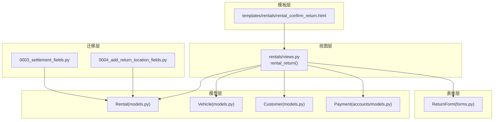
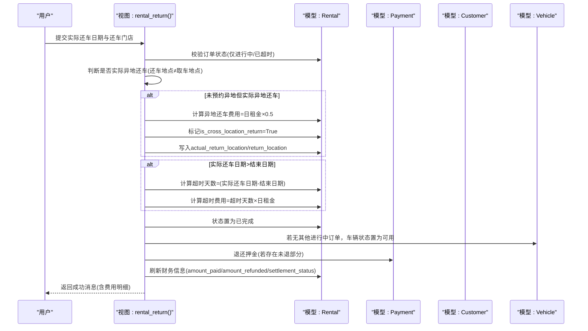
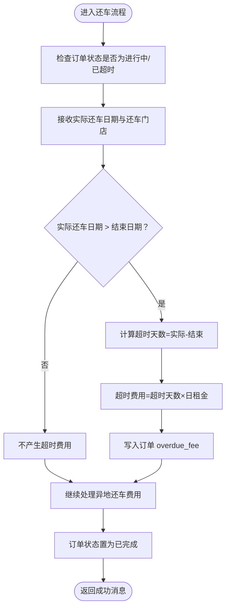
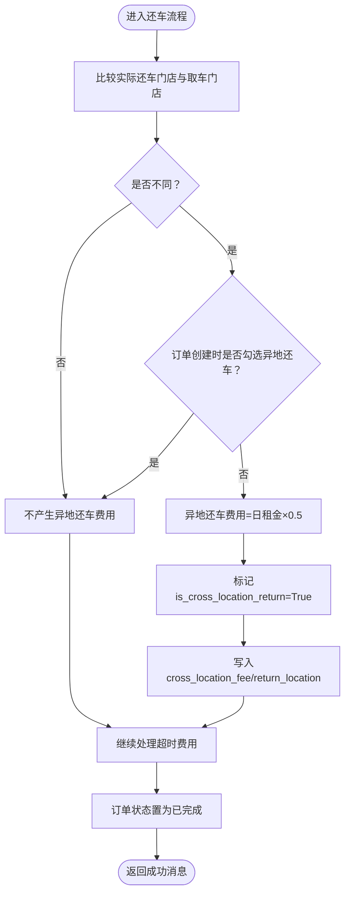
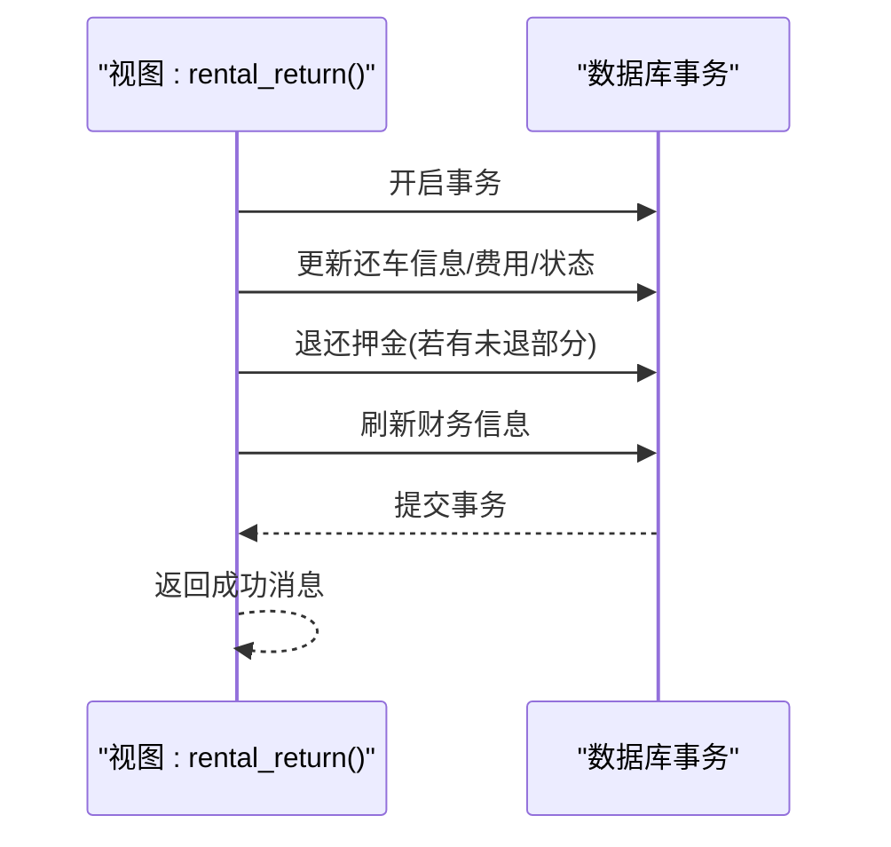
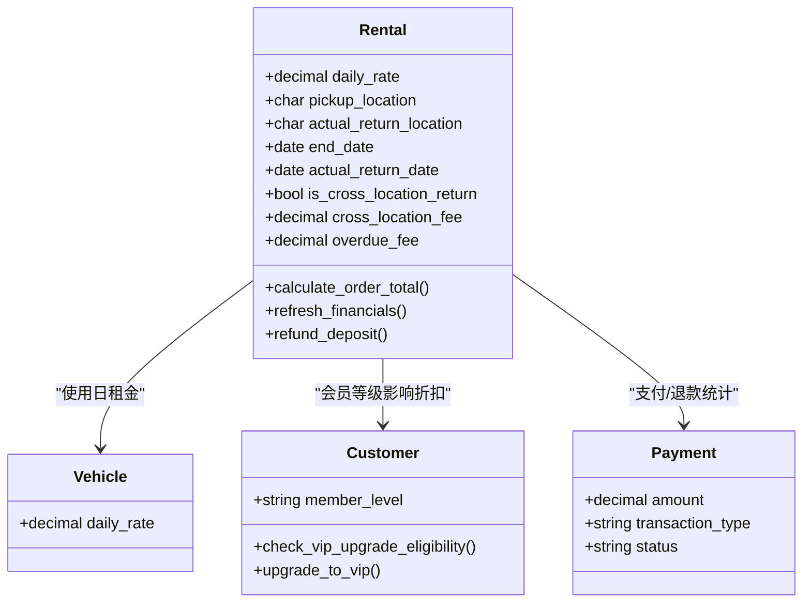
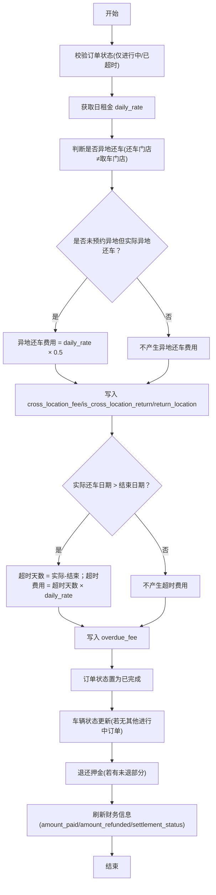

# 还车费用计算

<cite>
**本文引用的文件**
- [rentals/models.py](file://code/car_rental_system/rentals/models.py)
- [rentals/views.py](file://code/car_rental_system/rentals/views.py)
- [rentals/forms.py](file://code/car_rental_system/rentals/forms.py)
- [vehicles/models.py](file://code/car_rental_system/vehicles/models.py)
- [customers/models.py](file://code/car_rental_system/customers/models.py)
- [accounts/models.py](file://code/car_rental_system/accounts/models.py)
- [rentals/migrations/0003_settlement_fields.py](file://code/car_rental_system/rentals/migrations/0003_settlement_fields.py)
- [rentals/migrations/0004_add_return_location_fields.py](file://code/car_rental_system/rentals/migrations/0004_add_return_location_fields.py)
- [templates/rentals/rental_confirm_return.html](file://code/car_rental_system/templates/rentals/rental_confirm_return.html)
- [还车逻辑修改说明.md](file://code/car_rental_system/还车逻辑修改说明.md)
</cite>

## 目录
1. [简介](#简介)
2. [项目结构](#项目结构)
3. [核心组件](#核心组件)
4. [架构总览](#架构总览)
5. [详细组件分析](#详细组件分析)
6. [依赖关系分析](#依赖关系分析)
7. [性能考量](#性能考量)
8. [故障排查指南](#故障排查指南)
9. [结论](#结论)
10. [附录](#附录)

## 简介
本文件面向“还车过程中超时费用与异地还车费用”的计算逻辑进行系统化文档化，重点说明：
- 在 rental_return 视图中，如何基于 actual_return_date 与 end_date 的差值计算超时天数，并按日租金标准计算超时费用；
- 异地还车费用的触发条件：当实际还车地点与取车地点不同时，若租车时未勾选异地还车选项，则需额外收取日租金 50% 的异地还车费用；
- 费用计算过程中的事务处理机制，确保数据一致性；
- 提供费用计算的伪代码示例与边界情况处理（如提前还车、同一天还车等）。

## 项目结构
围绕还车费用计算的关键模块与文件如下：
- 模型层：Rental、Vehicle、Customer、Payment
- 视图层：rental_return 处理还车流程
- 表单层：ReturnForm 输入实际还车日期与还车门店
- 模板层：rental_confirm_return.html 展示费用预览
- 迁移层：新增 overdue_fee、actual_return_location 等字段
- 文档说明：还车逻辑修改说明.md

图表来源
- [rentals/views.py](file://code/car_rental_system/rentals/views.py#L279-L392)
- [rentals/models.py](file://code/car_rental_system/rentals/models.py#L12-L169)
- [vehicles/models.py](file://code/car_rental_system/vehicles/models.py#L45-L51)
- [customers/models.py](file://code/car_rental_system/customers/models.py#L7-L11)
- [accounts/models.py](file://code/car_rental_system/accounts/models.py#L147-L248)
- [rentals/forms.py](file://code/car_rental_system/rentals/forms.py#L312-L351)
- [templates/rentals/rental_confirm_return.html](file://code/car_rental_system/templates/rentals/rental_confirm_return.html#L250-L312)
- [rentals/migrations/0003_settlement_fields.py](file://code/car_rental_system/rentals/migrations/0003_settlement_fields.py#L1-L95)
- [rentals/migrations/0004_add_return_location_fields.py](file://code/car_rental_system/rentals/migrations/0004_add_return_location_fields.py#L1-L42)

章节来源
- [rentals/views.py](file://code/car_rental_system/rentals/views.py#L279-L392)
- [rentals/models.py](file://code/car_rental_system/rentals/models.py#L12-L169)
- [vehicles/models.py](file://code/car_rental_system/vehicles/models.py#L45-L51)
- [customers/models.py](file://code/car_rental_system/customers/models.py#L7-L11)
- [accounts/models.py](file://code/car_rental_system/accounts/models.py#L147-L248)
- [rentals/forms.py](file://code/car_rental_system/rentals/forms.py#L312-L351)
- [templates/rentals/rental_confirm_return.html](file://code/car_rental_system/templates/rentals/rental_confirm_return.html#L250-L312)
- [rentals/migrations/0003_settlement_fields.py](file://code/car_rental_system/rentals/migrations/0003_settlement_fields.py#L1-L95)
- [rentals/migrations/0004_add_return_location_fields.py](file://code/car_rental_system/rentals/migrations/0004_add_return_location_fields.py#L1-L42)

## 核心组件
- Rental 模型：存储订单、日租金、取车/还车地点、是否异地还车、异地还车费用、超时费用、状态、结算状态等；提供计算订单总额、刷新财务信息、退还押金等方法。
- Vehicle 模型：提供日租金 daily_rate，作为超时费用与异地还车费用的基础。
- ReturnForm 表单：校验实际还车日期不得晚于当天，允许不填写实际还车门店（默认使用取车门店）。
- rental_return 视图：负责还车流程的事务性处理，包括异地还车费用与超时费用的计算与记录、订单状态更新、车辆状态更新、押金退还与财务刷新。
- calculate_rental_cost 函数：用于页面侧费用详情展示，支持超时费用与异地还车费用的展示逻辑。
- 迁移文件：新增 overdue_fee、actual_return_location 等字段，完善结算相关字段。

章节来源
- [rentals/models.py](file://code/car_rental_system/rentals/models.py#L12-L169)
- [vehicles/models.py](file://code/car_rental_system/vehicles/models.py#L45-L51)
- [rentals/forms.py](file://code/car_rental_system/rentals/forms.py#L312-L351)
- [rentals/views.py](file://code/car_rental_system/rentals/views.py#L279-L392)
- [rentals/migrations/0003_settlement_fields.py](file://code/car_rental_system/rentals/migrations/0003_settlement_fields.py#L1-L95)
- [rentals/migrations/0004_add_return_location_fields.py](file://code/car_rental_system/rentals/migrations/0004_add_return_location_fields.py#L1-L42)

## 架构总览
还车费用计算的端到端流程如下：

图表来源
- [rentals/views.py](file://code/car_rental_system/rentals/views.py#L279-L392)
- [rentals/models.py](file://code/car_rental_system/rentals/models.py#L12-L169)
- [accounts/models.py](file://code/car_rental_system/accounts/models.py#L147-L248)
- [customers/models.py](file://code/car_rental_system/customers/models.py#L101-L154)
- [vehicles/models.py](file://code/car_rental_system/vehicles/models.py#L45-L51)

## 详细组件分析

### 超时费用计算逻辑
- 触发条件：实际还车日期严格大于结束日期。
- 计算方式：超时天数 = actual_return_date - end_date（按自然日计），超时费用 = 超时天数 × 日租金。
- 存储位置：写入订单的 overdue_fee 字段；最终订单总额通过 calculate_order_total() 累加。
- 页面展示：calculate_rental_cost() 支持展示超时费用与额外天数；模板 rental_confirm_return.html 也实时预览超时费用。

图表来源
- [rentals/views.py](file://code/car_rental_system/rentals/views.py#L323-L334)
- [rentals/models.py](file://code/car_rental_system/rentals/models.py#L286-L295)
- [rentals/forms.py](file://code/car_rental_system/rentals/forms.py#L334-L344)
- [templates/rentals/rental_confirm_return.html](file://code/car_rental_system/templates/rentals/rental_confirm_return.html#L272-L277)

章节来源
- [rentals/views.py](file://code/car_rental_system/rentals/views.py#L323-L334)
- [rentals/models.py](file://code/car_rental_system/rentals/models.py#L286-L295)
- [rentals/forms.py](file://code/car_rental_system/rentals/forms.py#L334-L344)
- [templates/rentals/rental_confirm_return.html](file://code/car_rental_system/templates/rentals/rental_confirm_return.html#L272-L277)

### 异地还车费用计算逻辑
- 触发条件：实际还车门店与取车门店不同，且订单创建时未勾选“是否异地还车”。
- 计算方式：异地还车费用 = 日租金 × 0.5；同时标记 is_cross_location_return=True，并写入 return_location。
- 存储位置：写入 cross_location_fee 与 is_cross_location_return；模板与页面展示区分“已预约”与“未预约但实际异地还车”的提示。
- 特殊说明：若订单创建时已勾选异地还车，则费用已在订单中，还车时不再重复加收。

图表来源
- [rentals/views.py](file://code/car_rental_system/rentals/views.py#L306-L322)
- [templates/rentals/rental_confirm_return.html](file://code/car_rental_system/templates/rentals/rental_confirm_return.html#L256-L304)

章节来源
- [rentals/views.py](file://code/car_rental_system/rentals/views.py#L306-L322)
- [templates/rentals/rental_confirm_return.html](file://code/car_rental_system/templates/rentals/rental_confirm_return.html#L256-L304)

### 事务处理与数据一致性
- 事务范围：还车流程在单个事务中执行，确保异常回滚，避免部分更新导致的数据不一致。
- 关键点：
  - 更新 actual_return_date、actual_return_location；
  - 异地还车费用与标记；
  - 超时费用；
  - 订单状态置为已完成；
  - 车辆状态更新（若无其他进行中订单）；
  - 押金退还与财务刷新。

图表来源
- [rentals/views.py](file://code/car_rental_system/rentals/views.py#L291-L380)

章节来源
- [rentals/views.py](file://code/car_rental_system/rentals/views.py#L291-L380)

### 页面费用预览与展示
- 页面模板 rental_confirm_return.html 会在用户输入还车日期与还车门店后，实时计算并展示：
  - 基础费用（含 VIP 折扣）、超时费用、异地还车费用；
  - 区分“已预约异地还车”与“未预约但实际异地还车”的提示。
- 计算逻辑与后端保持一致，确保前后端一致。

章节来源
- [templates/rentals/rental_confirm_return.html](file://code/car_rental_system/templates/rentals/rental_confirm_return.html#L250-L312)

### 费用计算函数与模型方法
- calculate_rental_cost(rental)：用于页面侧费用详情展示，支持超时费用与异地还车费用的展示逻辑。
- calculate_order_total()：计算订单总额（基础租金+押金+异地还车费用+超时费用），并考虑是否勾选异地还车。
- refresh_financials()：根据支付记录刷新 amount_paid、amount_refunded、settlement_status、settled_at。

章节来源
- [rentals/views.py](file://code/car_rental_system/rentals/views.py#L487-L533)
- [rentals/models.py](file://code/car_rental_system/rentals/models.py#L286-L333)

## 依赖关系分析
- 模型依赖：
  - Rental 依赖 Vehicle(daily_rate)、Customer(member_level)、Payment(支付/退款统计)。
- 视图依赖：
  - rental_return 依赖 ReturnForm、Rental、Vehicle、Customer、Payment。
- 模板依赖：
  - rental_confirm_return.html 依赖 rental.customer.member_level、rental.pickup_location、rental.is_cross_location_return、rental.return_location 等上下文。

图表来源
- [rentals/models.py](file://code/car_rental_system/rentals/models.py#L12-L169)
- [vehicles/models.py](file://code/car_rental_system/vehicles/models.py#L45-L51)
- [customers/models.py](file://code/car_rental_system/customers/models.py#L101-L154)
- [accounts/models.py](file://code/car_rental_system/accounts/models.py#L147-L248)

章节来源
- [rentals/models.py](file://code/car_rental_system/rentals/models.py#L12-L169)
- [vehicles/models.py](file://code/car_rental_system/vehicles/models.py#L45-L51)
- [customers/models.py](file://code/car_rental_system/customers/models.py#L101-L154)
- [accounts/models.py](file://code/car_rental_system/accounts/models.py#L147-L248)

## 性能考量
- 自动状态更新：Rental.auto_update_status() 使用缓存避免频繁更新（每 5 分钟最多更新一次），减少数据库压力。
- 查询优化：列表页与详情页使用 select_related 与聚合查询，降低 N+1 查询风险。
- 事务边界：还车流程在单个事务中执行，避免中间态数据暴露。

章节来源
- [rentals/models.py](file://code/car_rental_system/rentals/models.py#L171-L229)
- [rentals/views.py](file://code/car_rental_system/rentals/views.py#L17-L59)

## 故障排查指南
- 还车日期校验：
  - 实际还车日期不得晚于当天；若晚于当天，表单将拒绝提交。
- 订单状态限制：
  - 仅“进行中/已超时未归还”的订单可还车；否则提示错误。
- 异地还车判定：
  - 若实际还车门店与取车门店不同，且订单创建时未勾选异地还车，系统将自动加收异地还车费用。
- 超时还车判定：
  - 若实际还车日期晚于结束日期，系统将按日租金计算超时费用。
- 财务一致性：
  - 事务失败会回滚；若出现异常，检查 overdue_fee/cross_location_fee 是否被错误写入。
- VIP 升级与押金：
  - 完成订单后，系统会尝试退还押金；VIP 升级条件与“诚信还车”相关，详见 Customer.check_vip_upgrade_eligibility()。

章节来源
- [rentals/forms.py](file://code/car_rental_system/rentals/forms.py#L334-L351)
- [rentals/views.py](file://code/car_rental_system/rentals/views.py#L286-L290)
- [customers/models.py](file://code/car_rental_system/customers/models.py#L101-L154)

## 结论
- 超时费用与异地还车费用均在还车流程中统一计算并落库，保证费用明细清晰、可追溯。
- 通过事务控制与状态机约束，确保还车过程的数据一致性与业务正确性。
- 页面端提供费用预览，提升用户体验与透明度。

## 附录

### 伪代码示例（超时费用与异地还车费用）
- 输入：订单对象、实际还车日期、实际还车门店
- 输出：超时费用、异地还车费用、最终订单总额

图表来源
- [rentals/views.py](file://code/car_rental_system/rentals/views.py#L291-L380)
- [rentals/models.py](file://code/car_rental_system/rentals/models.py#L286-L333)

### 边界情况处理
- 提前还车：实际还车日期 ≤ 结束日期，不产生超时费用。
- 同一天还车：实际还车日期 = 结束日期，不产生超时费用。
- 未填写还车门店：默认使用取车门店，不触发异地还车费用。
- 已预约异地还车：即使实际还车门店与取车门店不同，也不再重复加收异地还车费用。
- VIP 折扣：基础费用在计算时已考虑折扣，超时与异地还车费用叠加计算。

章节来源
- [rentals/views.py](file://code/car_rental_system/rentals/views.py#L291-L380)
- [rentals/forms.py](file://code/car_rental_system/rentals/forms.py#L312-L351)
- [templates/rentals/rental_confirm_return.html](file://code/car_rental_system/templates/rentals/rental_confirm_return.html#L250-L312)