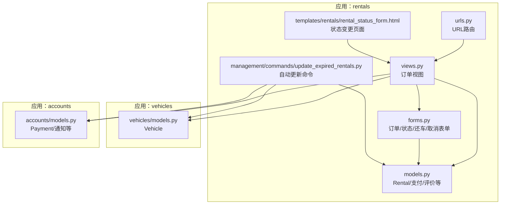
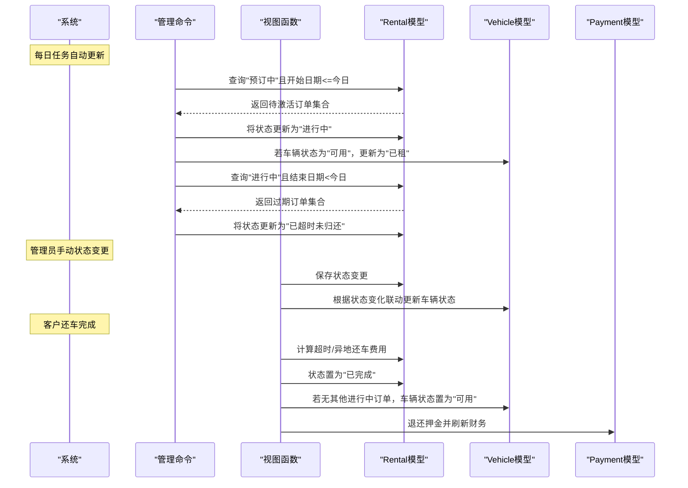
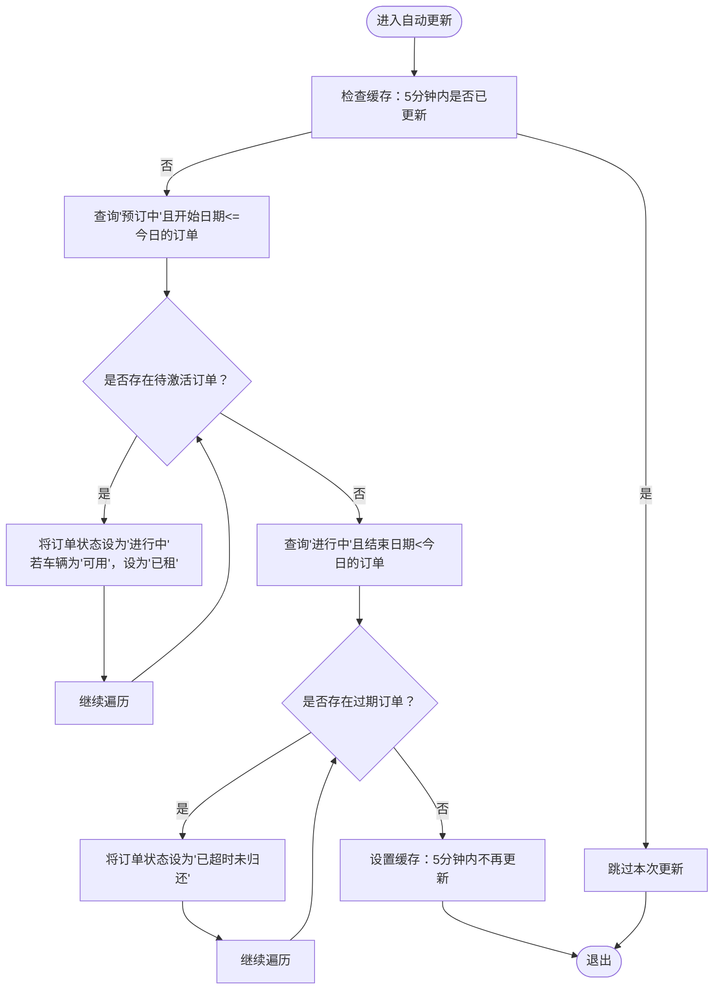
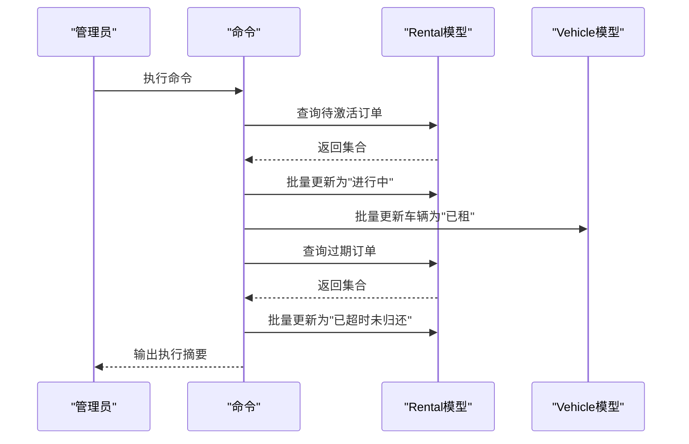
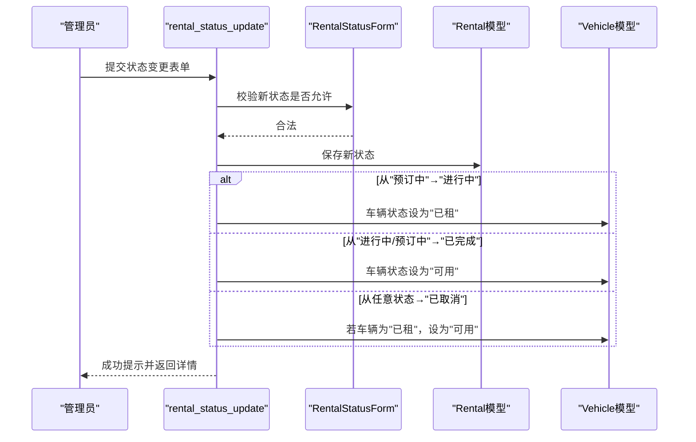
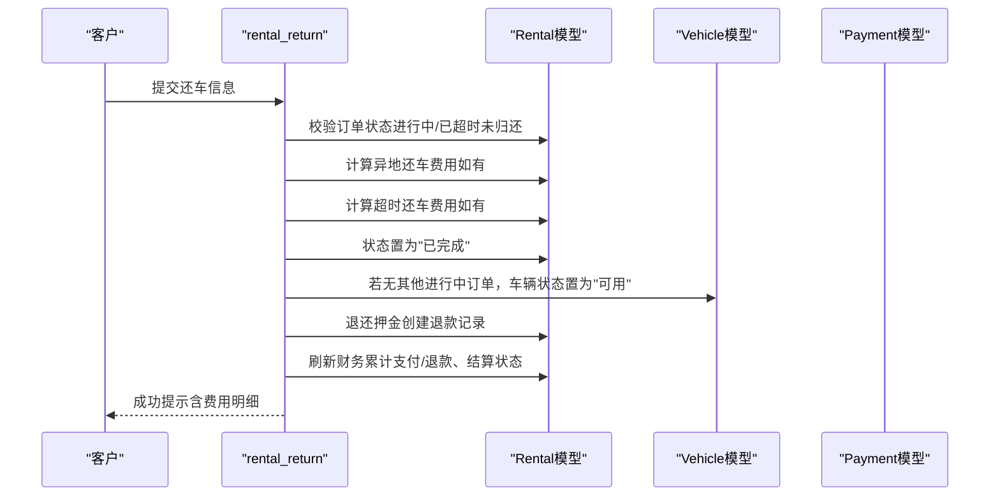
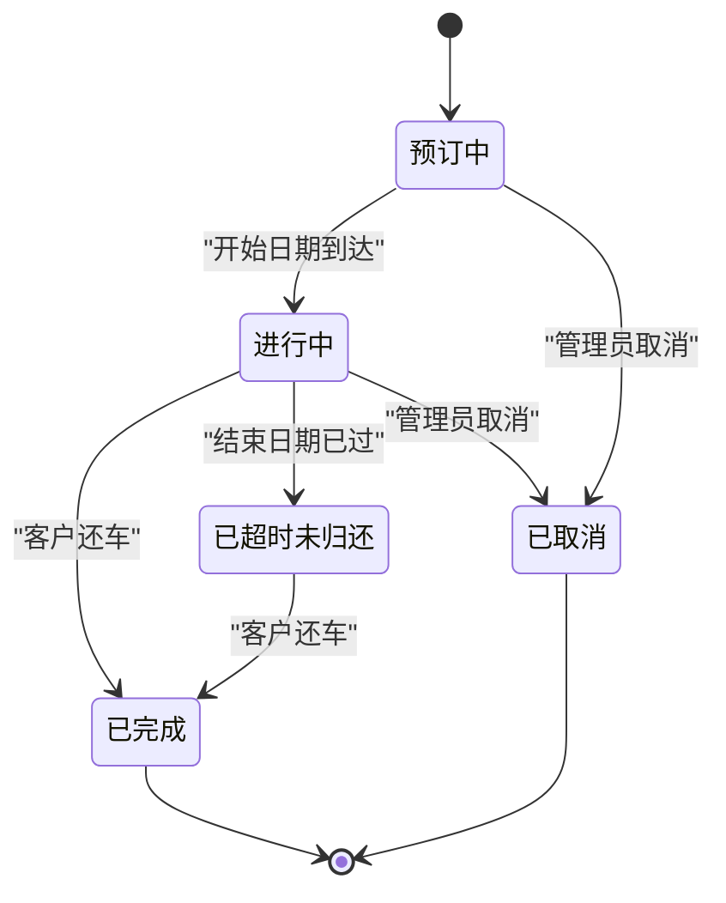
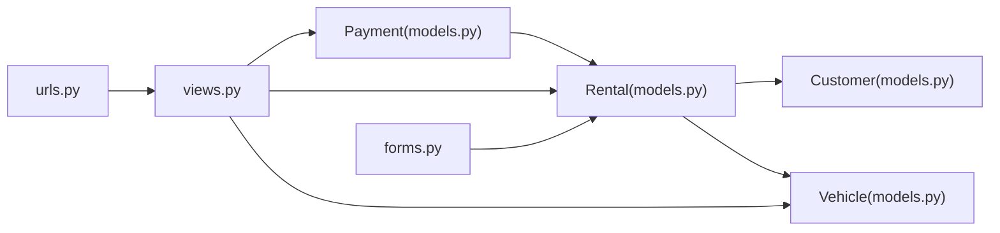

# 订单生命周期管理

<cite>
**本文引用的文件**
- [models.py](file://code/car_rental_system/rentals/models.py)
- [views.py](file://code/car_rental_system/rentals/views.py)
- [forms.py](file://code/car_rental_system/rentals/forms.py)
- [urls.py](file://code/car_rental_system/rentals/urls.py)
- [vehicles/models.py](file://code/car_rental_system/vehicles/models.py)
- [accounts/models.py](file://code/car_rental_system/accounts/models.py)
- [management/commands/update_expired_rentals.py](file://code/car_rental_system/rentals/management/commands/update_expired_rentals.py)
- [templates/rentals/rental_status_form.html](file://code/car_rental_system/templates/rentals/rental_status_form.html)
- [test_order_status_update.py](file://code/car_rental_system/test_order_status_update.py)
</cite>

## 目录
1. [简介](#简介)
2. [项目结构](#项目结构)
3. [核心组件](#核心组件)
4. [架构总览](#架构总览)
5. [详细组件分析](#详细组件分析)
6. [依赖关系分析](#依赖关系分析)
7. [性能考量](#性能考量)
8. [故障排查指南](#故障排查指南)
9. [结论](#结论)
10. [附录](#附录)

## 简介
本文件系统性地文档化租赁订单的完整生命周期，覆盖从创建到最终完成的各状态转换。重点解释五种状态（预订中、进行中、已超时未归还、已完成、已取消）的业务含义与转换规则；深入解析 Rental 模型中的自动状态更新机制（每日任务将“预订中”升级为“进行中”，将“进行中”超过结束日期标记为“已超时未归还”）；结合视图函数 rental_status_update，说明管理员如何通过表单进行手动状态变更，并描述状态变更时车辆状态（AVAILABLE/RENTED）的联动更新机制；最后提供状态转换图与关键代码路径，帮助开发者快速理解状态机工作原理。

## 项目结构
围绕订单生命周期管理的核心模块包括：
- 模型层：Rental 订单模型、Vehicle 车辆模型、Payment 支付模型
- 视图层：订单列表、详情、创建、更新、状态变更、还车、取消等视图
- 表单层：RentalForm、RentalStatusForm、ReturnForm、CancelForm
- 管理命令：自动更新过期订单状态
- URL 路由：订单相关 URL 映射

图表来源
- [models.py](file://code/car_rental_system/rentals/models.py#L1-L120)
- [views.py](file://code/car_rental_system/rentals/views.py#L1-L120)
- [forms.py](file://code/car_rental_system/rentals/forms.py#L1-L120)
- [urls.py](file://code/car_rental_system/rentals/urls.py#L1-L22)
- [management/commands/update_expired_rentals.py](file://code/car_rental_system/rentals/management/commands/update_expired_rentals.py#L1-L60)
- [templates/rentals/rental_status_form.html](file://code/car_rental_system/templates/rentals/rental_status_form.html#L1-L60)
- [vehicles/models.py](file://code/car_rental_system/vehicles/models.py#L1-L60)
- [accounts/models.py](file://code/car_rental_system/accounts/models.py#L147-L248)

章节来源
- [models.py](file://code/car_rental_system/rentals/models.py#L1-L120)
- [views.py](file://code/car_rental_system/rentals/views.py#L1-L120)
- [forms.py](file://code/car_rental_system/rentals/forms.py#L1-L120)
- [urls.py](file://code/car_rental_system/rentals/urls.py#L1-L22)

## 核心组件
- Rental 模型：定义订单状态枚举、字段、自动状态更新方法、财务刷新与押金退还等
- Vehicle 模型：定义车辆状态枚举（AVAILABLE/RENTED/MAINTENANCE），并与订单建立外键关系
- Payment 模型：记录支付/退款流水，支持订单完成后的财务结算刷新
- 视图函数：提供订单列表、详情、创建、更新、状态变更、还车、取消等入口
- 表单：约束状态转换合法性、日期与金额校验、车辆可用性检查
- 管理命令：每日定时任务，批量更新“预订中→进行中”和“进行中→已超时未归还”

章节来源
- [models.py](file://code/car_rental_system/rentals/models.py#L12-L120)
- [vehicles/models.py](file://code/car_rental_system/vehicles/models.py#L1-L60)
- [accounts/models.py](file://code/car_rental_system/accounts/models.py#L147-L248)
- [views.py](file://code/car_rental_system/rentals/views.py#L129-L276)
- [forms.py](file://code/car_rental_system/rentals/forms.py#L277-L310)
- [management/commands/update_expired_rentals.py](file://code/car_rental_system/rentals/management/commands/update_expired_rentals.py#L1-L60)

## 架构总览
订单生命周期由“自动更新 + 手动干预 + 还车完成”的组合驱动：
- 自动更新：每日任务将“预订中”且到达开始日期的订单升级为“进行中”，并将“进行中”且超过结束日期的订单标记为“已超时未归还”
- 手动干预：管理员通过状态变更表单进行“预订中→进行中/已取消”、“进行中→已完成/已取消”的操作，并联动车辆状态
- 还车完成：客户还车后，系统计算超时费用、异地还车费用、退还押金并刷新结算状态，最终将订单置为“已完成”

图表来源
- [management/commands/update_expired_rentals.py](file://code/car_rental_system/rentals/management/commands/update_expired_rentals.py#L46-L143)
- [views.py](file://code/car_rental_system/rentals/views.py#L234-L276)
- [views.py](file://code/car_rental_system/rentals/views.py#L279-L392)
- [models.py](file://code/car_rental_system/rentals/models.py#L171-L229)
- [vehicles/models.py](file://code/car_rental_system/vehicles/models.py#L1-L60)
- [accounts/models.py](file://code/car_rental_system/accounts/models.py#L147-L248)

## 详细组件分析

### 状态定义与业务含义
- 预订中（PENDING）：订单已创建，尚未开始使用车辆
- 进行中（ONGOING）：订单已激活，客户正在使用车辆
- 已超时未归还（OVERDUE）：订单已到期但仍未归还，系统标记为超时
- 已完成（COMPLETED）：客户已归还车辆，系统完成结算与押金退还
- 已取消（CANCELLED）：订单被取消，若已支付则发起退款

章节来源
- [models.py](file://code/car_rental_system/rentals/models.py#L12-L25)

### 自动状态更新机制（每日任务）
Rental.auto_update_status 方法负责：
- 将“预订中”且到达开始日期的订单升级为“进行中”，并联动车辆状态为“已租”
- 将“进行中”且超过结束日期的订单标记为“已超时未归还”
- 使用缓存限制更新频率（每5分钟最多更新一次）

图表来源
- [models.py](file://code/car_rental_system/rentals/models.py#L171-L229)

章节来源
- [models.py](file://code/car_rental_system/rentals/models.py#L171-L229)

### 管理命令：批量自动更新
管理命令 update_expired_rentals 提供更明确的批量更新流程：
- 阶段1：激活“预订中”订单（开始日期到达即激活为“进行中”，并联动车辆为“已租”）
- 阶段2：检查“进行中”过期订单（标记为“已超时未归还”，需手动还车）

图表来源
- [management/commands/update_expired_rentals.py](file://code/car_rental_system/rentals/management/commands/update_expired_rentals.py#L12-L143)

章节来源
- [management/commands/update_expired_rentals.py](file://code/car_rental_system/rentals/management/commands/update_expired_rentals.py#L12-L143)

### 手动状态变更（管理员）
管理员通过 rental_status_update 视图进行状态变更：
- 使用 RentalStatusForm 限定合法转换（如“预订中→进行中/已取消”、“进行中→已完成/已取消”）
- 根据状态变化联动车辆状态（从“预订中→进行中”→“已租”，从“已完成”→“可用”，从“已取消”→“可用”）

图表来源
- [views.py](file://code/car_rental_system/rentals/views.py#L234-L276)
- [forms.py](file://code/car_rental_system/rentals/forms.py#L277-L310)
- [templates/rentals/rental_status_form.html](file://code/car_rental_system/templates/rentals/rental_status_form.html#L1-L96)

章节来源
- [views.py](file://code/car_rental_system/rentals/views.py#L234-L276)
- [forms.py](file://code/car_rental_system/rentals/forms.py#L277-L310)
- [templates/rentals/rental_status_form.html](file://code/car_rental_system/templates/rentals/rental_status_form.html#L1-L96)

### 还车完成与结算
客户还车流程（rental_return）：
- 仅“进行中/已超时未归还”的订单可还车
- 计算异地还车费用（若实际还车地点与取车地点不同）
- 计算超时还车费用（若实际还车日期晚于结束日期）
- 状态置为“已完成”，若无其他进行中订单则车辆状态置为“可用”
- 退还押金并刷新财务信息（累计支付/退款、结算状态）

图表来源
- [views.py](file://code/car_rental_system/rentals/views.py#L279-L392)
- [models.py](file://code/car_rental_system/rentals/models.py#L296-L394)
- [accounts/models.py](file://code/car_rental_system/accounts/models.py#L147-L248)

章节来源
- [views.py](file://code/car_rental_system/rentals/views.py#L279-L392)
- [models.py](file://code/car_rental_system/rentals/models.py#L296-L394)
- [accounts/models.py](file://code/car_rental_system/accounts/models.py#L147-L248)

### 状态转换图（面向开发者的参考）

图表来源
- [models.py](file://code/car_rental_system/rentals/models.py#L12-L25)
- [views.py](file://code/car_rental_system/rentals/views.py#L234-L276)
- [views.py](file://code/car_rental_system/rentals/views.py#L279-L392)

## 依赖关系分析
- 模型依赖
  - Rental 依赖 Customer、Vehicle（一对多外键）
  - Payment 依赖 Rental（一对多外键）
- 视图依赖
  - views 中调用 Rental.auto_update_status、Rental.refund_deposit、Vehicle.save 等
  - 表单对状态转换进行约束（RentalStatusForm）
- URL 依赖
  - 通过 rentals/urls.py 将请求映射到对应视图

图表来源
- [models.py](file://code/car_rental_system/rentals/models.py#L12-L120)
- [vehicles/models.py](file://code/car_rental_system/vehicles/models.py#L1-L60)
- [accounts/models.py](file://code/car_rental_system/accounts/models.py#L147-L248)
- [views.py](file://code/car_rental_system/rentals/views.py#L1-L120)
- [forms.py](file://code/car_rental_system/rentals/forms.py#L277-L310)
- [urls.py](file://code/car_rental_system/rentals/urls.py#L1-L22)

章节来源
- [models.py](file://code/car_rental_system/rentals/models.py#L12-L120)
- [vehicles/models.py](file://code/car_rental_system/vehicles/models.py#L1-L60)
- [accounts/models.py](file://code/car_rental_system/accounts/models.py#L147-L248)
- [views.py](file://code/car_rental_system/rentals/views.py#L1-L120)
- [forms.py](file://code/car_rental_system/rentals/forms.py#L277-L310)
- [urls.py](file://code/car_rental_system/rentals/urls.py#L1-L22)

## 性能考量
- 自动更新缓存：Rental.auto_update_status 使用缓存限制更新频率，避免频繁数据库写入
- 查询优化：Rental 索引覆盖 start_date、end_date、status、customer+status、vehicle+status
- 批量处理：管理命令采用事务块批量更新，减少锁竞争
- 页面缓存：列表页筛选选项使用缓存（customers/vehicles）提升加载速度

章节来源
- [models.py](file://code/car_rental_system/rentals/models.py#L158-L169)
- [views.py](file://code/car_rental_system/rentals/views.py#L60-L126)
- [management/commands/update_expired_rentals.py](file://code/car_rental_system/rentals/management/commands/update_expired_rentals.py#L12-L45)

## 故障排查指南
- 自动更新未生效
  - 检查缓存是否阻断更新（每5分钟限制）
  - 确认系统定时任务是否正确执行
  - 参考路径：[models.py](file://code/car_rental_system/rentals/models.py#L171-L229)，[management/commands/update_expired_rentals.py](file://code/car_rental_system/rentals/management/commands/update_expired_rentals.py#L12-L45)
- 状态变更无效
  - 确认表单状态转换是否在允许范围内（RentalStatusForm）
  - 参考路径：[forms.py](file://code/car_rental_system/rentals/forms.py#L277-L310)
- 还车异常
  - 检查订单状态是否为“进行中/已超时未归还”
  - 检查实际还车日期是否晚于结束日期并正确计算超时费用
  - 参考路径：[views.py](file://code/car_rental_system/rentals/views.py#L279-L392)
- 押金未退还
  - 确认订单已完成且满足退还条件
  - 检查退款记录是否创建成功
  - 参考路径：[models.py](file://code/car_rental_system/rentals/models.py#L334-L394)，[accounts/models.py](file://code/car_rental_system/accounts/models.py#L147-L248)

章节来源
- [models.py](file://code/car_rental_system/rentals/models.py#L171-L229)
- [forms.py](file://code/car_rental_system/rentals/forms.py#L277-L310)
- [views.py](file://code/car_rental_system/rentals/views.py#L279-L392)
- [models.py](file://code/car_rental_system/rentals/models.py#L334-L394)
- [accounts/models.py](file://code/car_rental_system/accounts/models.py#L147-L248)

## 结论
本系统通过“自动更新 + 手动干预 + 还车完成”的闭环机制，实现了订单生命周期的自动化与可控性。Rental.auto_update_status 与管理命令共同保证了状态的及时更新；管理员通过受控表单进行状态变更并联动车辆状态；还车流程完善地处理了费用计算与押金退还。整体设计清晰、可维护性强，适合在生产环境中稳定运行。

## 附录
- 关键代码路径参考
  - 自动状态更新：[models.py](file://code/car_rental_system/rentals/models.py#L171-L229)
  - 管理命令：[management/commands/update_expired_rentals.py](file://code/car_rental_system/rentals/management/commands/update_expired_rentals.py#L12-L143)
  - 手动状态变更视图：[views.py](file://code/car_rental_system/rentals/views.py#L234-L276)
  - 状态变更表单：[forms.py](file://code/car_rental_system/rentals/forms.py#L277-L310)
  - 还车完成流程：[views.py](file://code/car_rental_system/rentals/views.py#L279-L392)
  - 车辆状态模型：[vehicles/models.py](file://code/car_rental_system/vehicles/models.py#L1-L60)
  - 支付模型：[accounts/models.py](file://code/car_rental_system/accounts/models.py#L147-L248)
  - URL 路由：[urls.py](file://code/car_rental_system/rentals/urls.py#L1-L22)
  - 状态变更页面模板：[templates/rentals/rental_status_form.html](file://code/car_rental_system/templates/rentals/rental_status_form.html#L1-L96)
  - 自动更新测试脚本：[test_order_status_update.py](file://code/car_rental_system/test_order_status_update.py#L1-L288)